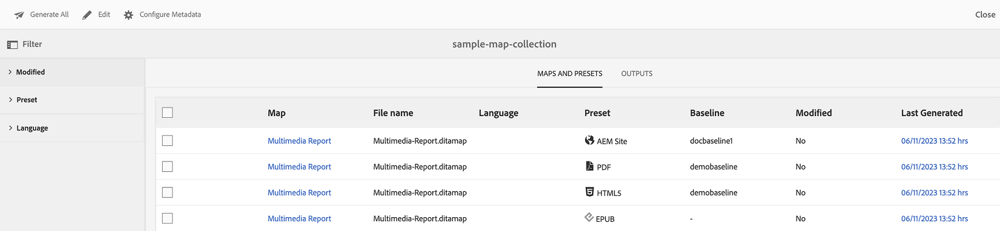
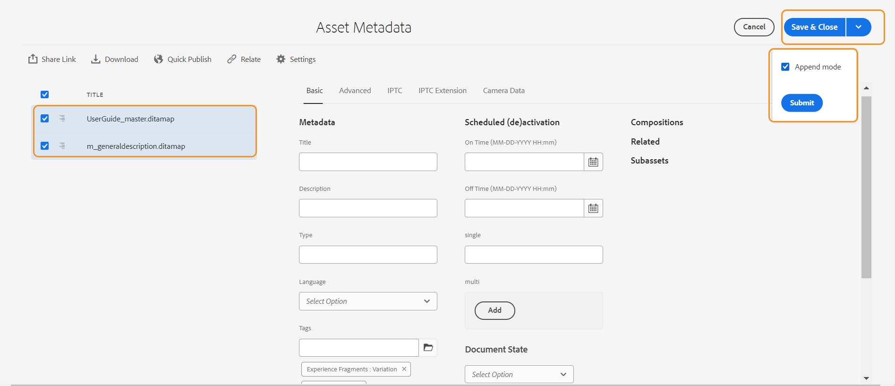
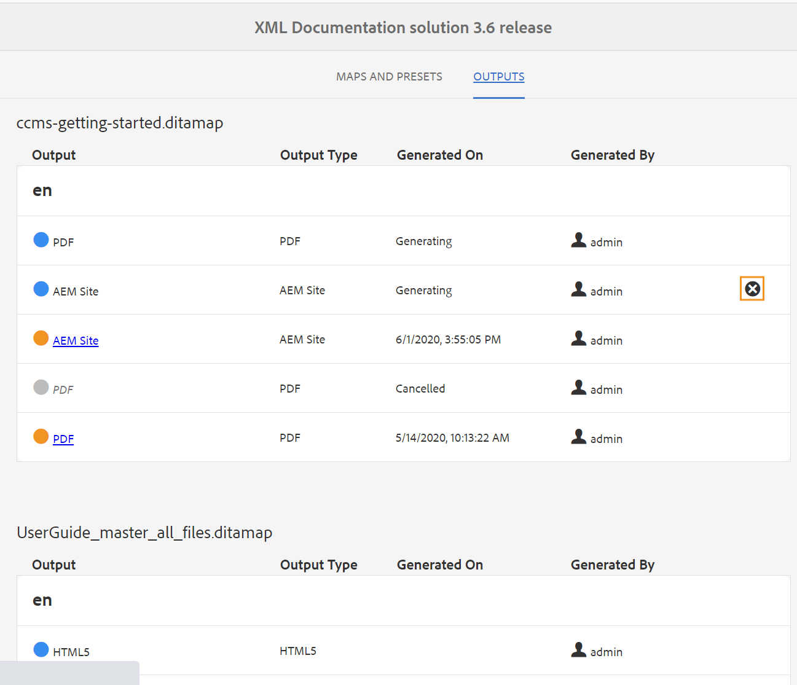

# Utilisation de Map Collection pour la génération de sortie {#id1723F20G0HS}

Dans n’importe quelle organisation, un produit peut avoir plusieurs types de documentation. En tant que spécialiste de la publication, vous souhaitez contrôler la sortie que vous souhaitez générer pour chaque document. En outre, il doit exister un moyen de publier plusieurs documents par lots en une seule fois.

Adobe Experience Manager Guides vous offre la possibilité d’organiser votre contenu pour publication à l’aide d’un tableau de bord appelé Collection de cartes. Une collection Map vous permet d’assembler tous les différents types de documents dans une seule unité. Vous pouvez choisir le type de sortie que vous souhaitez générer pour chaque document de votre collection Map. En outre, vous pouvez également générer une sortie et afficher la progression de la génération de la sortie à partir du tableau de bord de publication.

Map Collection vous donne une option pour voir s&#39;il y a une modification dans un mappage à partir de la dernière sortie publiée. Vous pouvez afficher les détails dans l’onglet Cartes et paramètres prédéfinis de votre collection de cartes, puis republier la sortie si nécessaire.

## Créer une collection de plans et ajouter des plans DITA

Pour créer une collection Map et ajouter des cartes DITA à la collection, procédez comme suit :

1. Ouvrez la page d&#39;accueil de [Experience Manager Guides](./intro-home-page.md#map-collections) puis sélectionnez **Mapper les collections**.

   La page **Mapper des collections** s’ouvre dans un nouvel onglet.

   {width="350" align="left"}

   >[!NOTE]
   >
   > Vous pouvez également ouvrir l’interface utilisateur d’Assets et sélectionner **Mapper les collections**. Si la page Mapper les collections n’est pas disponible, sélectionnez l’option **Navigation** dans le rail de gauche, puis sélectionnez **Mapper les collections**.

1. Sur la page **Collections Map**, sélectionnez **Créer** en haut à droite, puis fournissez un **Titre de collection** pour votre collection Map.
1. Sélectionnez **Créer**.

   Un message de réussite s’affiche lors de la création de la collection de mappages.

1. Sélectionnez **Fermer** dans le message de réussite.

   Le fichier de mappage nouvellement créé s’affiche sur la page Mapper les collections .

1. Sélectionnez la zone grise dans la mosaïque de la collection à modifier.
1. La collection de cartes sélectionnée s’ouvre dans le tableau de bord de la collection de cartes.
1. Sélectionnez **Modifier** puis sélectionnez **Ajouter des mappages**.
1. Recherchez et ajoutez les mappages DITA que vous souhaitez ajouter à la collection Map.

   Par défaut, tous les paramètres prédéfinis et locaux associés à la carte sont ajoutés automatiquement.

1. Sélectionnez la sortie souhaitée en activant ou en désactivant le bouton coulissant.
1. Sélectionnez **Terminé**.

   Les fichiers map DITA sont ajoutés à votre collection Map.

   {align="left"}

**Options de filtrage**

Les options de filtrage et les détails de mappage suivants sont affichés sur la page de collection :

- **Filtre :** le rail de gauche affiche les filtres suivants :
   - **Modifié** : vous pouvez sélectionner Oui ou Non. Si vous sélectionnez oui, seuls les mappages DITA modifiés seront affichés dans le tableau Mappages et paramètres prédéfinis.
   - **Paramètre prédéfini** : sélectionnez un paramètre prédéfini pour lequel vous souhaitez filtrer les fichiers de mappage. Par exemple, si vous choisissez le paramètre prédéfini *Site AEM*, seuls les mappages sur lesquels le paramètre prédéfini de sortie *Site AEM* est configuré s’affichent.
   - **Langue** : vous pouvez sélectionner l’un des codes de langue disponibles et afficher uniquement la langue sélectionnée dans le tableau Cartes et paramètres prédéfinis.
- **Tableau des mappages et des paramètres prédéfinis** : le tableau des mappages et des paramètres prédéfinis présente les informations dans les colonnes suivantes :
   - **Map** : affiche le titre du fichier de plan DITA.
   - **Nom de fichier** : affiche le nom de fichier du plan DITA.
   - **Langue** : affiche la langue du plan DITA.
   - **Paramètre prédéfini** : affiche le type de paramètre prédéfini de sortie configuré sur le fichier map.
   - **Ligne de base** : affiche la ligne de base utilisée par le paramètre prédéfini de sortie.  Si aucune ligne de base n&#39;est utilisée, un trait d&#39;union (-) apparaît
   - **Modifié** : indique si le plan DITA est mis à jour après la dernière publication. En fonction de ces informations, vous pouvez décider de republier ou non la sortie de ce plan DITA.
   - **Dernière génération** : affiche la date et l’heure de la dernière sortie générée.

## Configurer et générer la sortie à l’aide d’une collection de cartes

Pour configurer et générer la sortie à l’aide d’une collection Map, procédez comme suit :

1. Ouvrez la collection Map . Vous pouvez afficher les différents paramètres prédéfinis de sortie tels qu’AEM Sites, PDF (y compris Native PDF), HTML5, EPUB et les paramètres prédéfinis personnalisés. Vous pouvez également afficher les paramètres prédéfinis de profil globaux et de dossier créés par votre administrateur.

   L’icône  indique un paramètre prédéfini de niveau de profil de dossier.
1. \(Facultatif\) Effectuez l’une des opérations suivantes en fonction de vos besoins :
   - Appliquez des filtres dans le rail de gauche pour filtrer les mappages, les paramètres prédéfinis de sortie ou la langue modifiés.
   - Si nécessaire, sélectionnez **Modifier** et modifiez la sortie souhaitée en activant ou en désactivant le bouton coulissant.

   >[!NOTE]
   >  
   > Par défaut, tout nouveau paramètre prédéfini est désactivé.

1. Vous pouvez activer les paramètres prédéfinis d&#39;un plan DITA des manières suivantes :

   - Activez n’importe quel paramètre prédéfini.
   - Activez **Tous les paramètres prédéfinis** pour un plan DITA afin de sélectionner tous les paramètres prédéfinis en une seule fois. Cette option est désactivée par défaut.
   - Activez **Paramètres prédéfinis de profil de dossier** pour un plan DITA afin de sélectionner tous les paramètres prédéfinis de profil de dossier pour ce plan. Cette option est désactivée par défaut.

{align="left"}

1. Utilisez l’une des méthodes suivantes :

   - Pour générer la sortie des mappages sélectionnés, sélectionnez les fichiers de mappage et sélectionnez **Générer la sélection**.
   - Pour générer la sortie de tous les plans DITA avec leurs paramètres prédéfinis configurés, sélectionnez **Tout générer**.

   >[!IMPORTANT]
   >
   > Si un processus de génération de sortie pour un paramètre prédéfini ou un mappage DITA est en file d&#39;attente ou en cours, vous ne pouvez pas lancer une autre tâche de génération de sortie pour le même paramètre prédéfini ou mappage.

## Configuration des propriétés de métadonnées

Dans la collection de cartes, vous pouvez configurer les propriétés de métadonnées en bloc pour les cartes DITA. Sélectionnez **Configurer les métadonnées** pour ouvrir la page **Métadonnées de ressource**. Sur la page **Métadonnées de ressource**, tous les mappages présents dans la collection sont répertoriés à gauche.

{align="left"}

Pour configurer les propriétés de métadonnées, procédez comme suit :

1. Vous pouvez choisir les mappages pour lesquels vous souhaitez mettre à jour les métadonnées. Par défaut, tous les plans DITA présents sont sélectionnés.

1. Une fois que vous avez sélectionné les plans DITA, vous pouvez afficher des propriétés telles que les métadonnées, la planification (de)activation, les références, l&#39;état du document, etc.

1. Mettez à jour les propriétés de métadonnées.

1. Sélectionnez **Enregistrer et fermer** dans la partie supérieure pour enregistrer les mises à jour.
1. (Facultatif) Lorsque vous mettez à jour les balises, vous pouvez également sélectionner Ajouter dans le menu déroulant **Enregistrer et fermer** pour ajouter les nouvelles balises à la liste existante.
1. Sélectionnez **Envoyer** dans le menu déroulant **Enregistrer et fermer**.
Les propriétés de métadonnées sont mises à jour pour les plans DITA que vous sélectionnez en bloc dans la collection de plans.

>[!NOTE]
> 
>Dans le menu déroulant **État du document**, vous pouvez sélectionner uniquement les états de document autorisés en commun pour tous les plans DITA sélectionnés. Pour en savoir plus, consultez [**État du document**](./web-editor-document-states.md).

Les propriétés de métadonnées sont synchronisées avec les propriétés du fichier. Une fois que vous les avez mis à jour, vous pouvez les afficher à partir du panneau **Propriétés du fichier** dans l’éditeur.

## Suppression d&#39;une collection Map ou d&#39;un plan DITA dans la collection Map

- Pour supprimer une collection de cartes, sélectionnez une collection sur la page Collection de cartes, puis sélectionnez **Supprimer**.
- Pour supprimer un plan DITA d&#39;une collection de plans, ouvrez la collection de plans en mode d&#39;édition, sélectionnez le fichier de plan DITA, puis sélectionnez **Supprimer de la collection**.

Cela supprimera également tous les paramètres prédéfinis ou les paramètres régionaux associés au plan DITA de la collection Map.

## Annuler une tâche de génération de sortie à partir d’une collection Map

De la même manière que vous pouvez annuler une tâche de génération de sortie à partir de la [console de mappage DITA](generate-output-for-a-dita-map.md#id2061H100T5Z) ou du [tableau de bord de publication](generate-output-publish-dashboard.md#), vous pouvez annuler une tâche de génération de sortie à partir d&#39;une collection de mappages. Accédez à l’onglet Sorties d’une collection Map, accédez à la tâche de publication que vous souhaitez annuler, puis sélectionnez l’icône **Annuler cette tâche** pour annuler la tâche de publication.

{align="left"}

**Rubrique parente :**&#x200B;[ Génération de sortie](generate-output.md)
