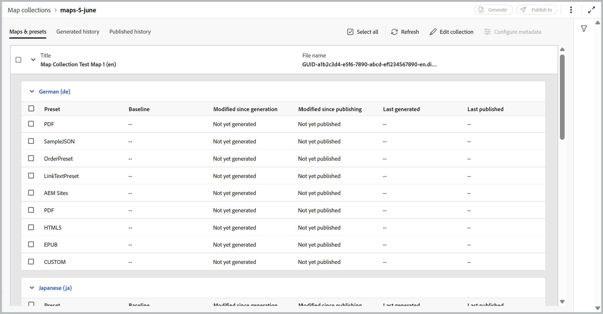
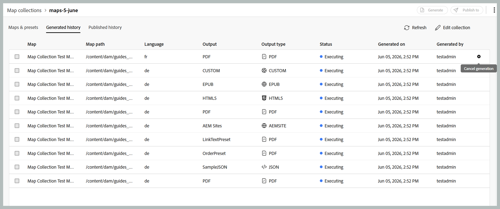

# Utiliser une nouvelle collection de cartes pour la génération de sortie (Beta)

>[!IMPORTANT]
>
> Une nouvelle collection de cartes est disponible dans Experience Manager Guides as a Cloud Service à partir de la version 2026.06.0. Contactez votre équipe du succès client pour activer cette fonctionnalité.

La collecte de cartes dans Adobe Experience Manager Guides permet aux spécialistes de la publication d’organiser plusieurs documents en une seule collection, de contrôler la sortie générée pour chaque document et de générer et publier efficacement des sorties par lots à partir d’un tableau de bord centralisé. Il offre également une visibilité sur la progression de la génération de sortie, met en évidence les modifications apportées aux mappages depuis leur dernière sortie publiée et vous permet de republier du contenu si nécessaire.

La nouvelle collection de mappages consolide les fonctionnalités précédemment réparties dans l’ancienne collection de mappages et la publication en bloc dans une seule interface unifiée. Une fois activé, vous pouvez gérer les mappages, les paramètres prédéfinis, l’historique de génération, l’historique de publication, les métadonnées et l’appartenance à une collection à partir d’un seul emplacement.

## Créer une collection de plans et ajouter des plans DITA

Pour créer une collection de mappages et y ajouter des mappages, procédez comme suit :

1. Ouvrez la page d’accueil de Experience Manager Guides et sélectionnez **Nouvelles collections de cartes**.

   La page **Mapper des collections** s’ouvre.

   {width="650"}

1. Sur la page **Collections de cartes**, sélectionnez **Créer** en haut à droite, puis fournissez un **Nom** pour votre nouvelle collection de cartes.

   {width="350"}

1. Sélectionnez **Créer**.

   Un message de réussite s’affiche lors de la création de la collection de cartes.

1. Ouvrez la collection de mappages à laquelle vous souhaitez ajouter les mappages.

   

   En pointant sur le titre de la collection de cartes, vous pouvez effectuer les actions suivantes :

   - **Générer l’historique** : permet d’accéder directement à l’onglet Historique généré qui répertorie toutes les cartes avec les sorties générées pour les paramètres prédéfinis définis.
   - **Historique de publication** : permet d’accéder directement à l’onglet Historique de publication répertoriant tous les mappages avec sortie publiée pour les paramètres prédéfinis définis.
   - **Renommer** : renomme la collection de cartes.

1. Sélectionnez **Modifier la collection** puis sélectionnez **Ajouter des mappages**.

   

1. Sélectionnez les mappages souhaités et activez le bouton (bascule) **Sélectionner les traductions disponibles** pour ajouter automatiquement toutes les copies de traduction disponibles de ce mappage à la collection de mappages. Si le mappage ne comporte aucune copie de traduction, la langue par défaut est ajoutée au mappage.

   

1. Sélectionnez **Ajouter**.

   Les fichiers de carte sont répertoriés avec toutes leurs copies traduites disponibles. Pour les mappages qui n’ont pas de copies traduites, la langue par défaut s’affiche.

   

1. Sélectionnez les mappages requis ou tous les mappages répertoriés, puis cliquez sur le bouton **Récupérer les paramètres prédéfinis** pour récupérer les paramètres prédéfinis disponibles pour les mappages sélectionnés.

   La liste de tous les paramètres prédéfinis disponibles pour les mappages sélectionnés s’affiche, regroupés sous deux catégories : **Paramètres prédéfinis de profil de dossier** et **Autres paramètres prédéfinis**. Les **paramètres prédéfinis de profil de dossier** sont communs à tous les mappages sélectionnés, tandis que les **autres paramètres prédéfinis** sont spécifiques à chaque mappage. Pour les paramètres prédéfinis sous **Autres paramètres prédéfinis**, le mappage associé est indiqué en regard du bouton (bascule) correspondant.

   

1. Sélectionnez **Activer tous les paramètres prédéfinis** ou **Activer tous les paramètres prédéfinis de profil de dossier** selon vos besoins. Vous pouvez également utiliser l’icône Filtre à droite pour réduire la liste. Le filtre propose deux niveaux de filtrage : **Types de paramètres prédéfinis** pour réduire les paramètres prédéfinis répertoriés et **Statut de la carte** pour sélectionner une carte spécifique dans le panneau Cartes.

   

1. Sélectionnez **Enregistrer**.

Vous obtenez une liste de toutes les cartes souhaitées avec le titre de la carte, le nom de fichier correspondant, la langue dans laquelle elle est disponible et les paramètres prédéfinis configurés.

L’onglet **Mappages et paramètres prédéfinis** présente des informations sur la base des mappages sélectionnés pour une langue spécifique dans les colonnes suivantes :

- **Paramètre prédéfini** : affiche le type de paramètre prédéfini de sortie configuré sur le fichier map.
- **Ligne de base** : affiche la ligne de base utilisée par le paramètre prédéfini de sortie.  Si aucune ligne de base n&#39;est utilisée, un trait d&#39;union s&#39;`-`.
- **Modifié depuis la génération** : indique si le plan DITA est mis à jour après la génération. En fonction de ces informations, vous pouvez décider de publier ou non la sortie de ce plan DITA.
- **Modifié depuis la publication** : indique si le plan DITA est mis à jour après la dernière publication. En fonction de ces informations, vous pouvez décider de republier ou non la sortie de ce plan DITA.
- **Dernière sortie générée** : affiche la date et l’heure de la dernière sortie générée.
- **Dernière publication** : affiche la date et l’heure de la dernière sortie publiée.

**Options de filtrage**

Les options de filtrage suivantes sont disponibles dans le panneau de droite de la page Cartes et paramètres prédéfinis :

- **Modifié depuis la génération** : vous pouvez sélectionner Oui, Non ou Pas encore généré. Si vous sélectionnez Oui, seules les cartes qui ont été modifiées depuis la génération sont affichées dans l’onglet Cartes et paramètres prédéfinis.
- **Modifié depuis la publication** : vous pouvez sélectionner Oui, Non ou Pas encore généré. Si vous sélectionnez Oui, seules les cartes qui ont été modifiées depuis leur publication sont affichées dans l’onglet Cartes et paramètres prédéfinis.
- **Paramètres prédéfinis** : sélectionnez un paramètre prédéfini pour lequel vous souhaitez filtrer les fichiers de mappage. Par exemple, si vous choisissez le paramètre prédéfini *Site*, seuls les mappages sur lesquels le paramètre prédéfini de sortie *Site AEM* est configuré s’affichent.
- **Langue** : vous pouvez sélectionner l’un des codes de langue disponibles et afficher uniquement la langue sélectionnée dans l’onglet Cartes et paramètres prédéfinis.

  

## Générer la sortie à l’aide d’une collection de cartes

Pour générer la sortie à l’aide d’une collection Map, procédez comme suit :

1. Ouvrez la collection Map . Vous pouvez afficher les différents paramètres prédéfinis de sortie tels qu’AEM Sites, PDF (y compris Native PDF), HTML5, EPUB et les paramètres prédéfinis personnalisés en fonction de votre configuration.

1. Pour générer une sortie pour les mappages sélectionnés, sélectionnez les fichiers de mappage requis et les paramètres prédéfinis spécifiques, puis sélectionnez **Générer**.

   >[!IMPORTANT]
   >
   > Si un processus de génération de sortie pour un paramètre prédéfini ou un mappage DITA est en file d&#39;attente ou en cours, vous ne pouvez pas lancer une autre tâche de génération de sortie pour le même paramètre prédéfini ou mappage.

1. Une fois la sortie générée, accédez à l’onglet **Historique généré** pour afficher la liste de tous les mappages générés. Vous pouvez suivre la progression de la génération dans la colonne **Statut**, qui indique si une génération est en cours d’exécution ou terminée.

   

1. Sélectionnez **Actualiser** pour afficher le dernier statut du processus de génération. La colonne Statut est mise à jour pour refléter le statut actuel de chaque mappage et de ses paramètres prédéfinis associés :

   - **Terminé (vert)** : la génération a été effectuée avec succès.
   - **Terminé (rouge)** : génération terminée avec des erreurs. Les détails des erreurs sont visibles dans les journaux.
   - **En cours d’exécution (bleu)** : la génération est en cours.

   

1. Vous pouvez également annuler la tâche de génération de sortie jusqu&#39;à ce que le statut de la tâche soit en cours d&#39;exécution en sélectionnant l&#39;icône **Annuler la génération**.

   

1. De plus, vous pouvez afficher la sortie générée pour les mappages dont la génération de sortie a été terminée en sélectionnant l’icône **Ouvrir la sortie** qui s’affiche lorsque vous pointez sur le nom du mappage, ou afficher les journaux de génération en sélectionnant l’icône adjacente **Journaux**.

   

## Publier la sortie à l’aide d’une collection de mappages

Pour publier (si configuré) la sortie à l’aide d’une collection Map, procédez comme suit :

1. Sélectionnez les mappages de votre choix dans l’onglet **Mappages et paramètres prédéfinis** ou dans l’onglet **Historique généré** et sélectionnez **Publier vers**.
1. Sélectionnez l’environnement cible dans lequel vous souhaitez publier la sortie : instance **Aperçu** ou **Publication**.

   

1. Passez à l’onglet **Historique de publication** pour surveiller le statut de la tâche de publication.

   

1. Sélectionnez **Actualiser** pour afficher le dernier statut de la tâche.
1. Une fois le statut passé à **Réussi**, vérifiez le contenu publié dans l’instance cible sélectionnée.

## Configuration des propriétés de métadonnées

Dans la collection de cartes, vous pouvez configurer les propriétés de métadonnées en bloc pour les cartes DITA. Sélectionnez l’icône **Configurer les métadonnées** dans l’onglet **Cartes et paramètres prédéfinis** pour ouvrir la page **Métadonnées de ressource**. Sur la page **Métadonnées de ressource**, tous les mappages présents dans la collection sont répertoriés à gauche.

Pour configurer les propriétés de métadonnées, procédez comme suit :

1. Vous pouvez choisir les mappages pour lesquels vous souhaitez mettre à jour les métadonnées. Par défaut, tous les plans DITA présents sont sélectionnés.

1. Une fois que vous avez sélectionné les plans DITA, vous pouvez afficher des propriétés telles que les métadonnées, la planification (de)activation, les références, l&#39;état du document, etc.

1. Mettez à jour les propriétés de métadonnées.

1. Sélectionnez **Enregistrer et fermer** dans la partie supérieure pour enregistrer les mises à jour.
1. (Facultatif) Lorsque vous mettez à jour les balises, vous pouvez également sélectionner Ajouter dans le menu déroulant **Enregistrer et fermer** pour ajouter les nouvelles balises à la liste existante.
1. Sélectionnez **Envoyer** dans le menu déroulant **Enregistrer et fermer**.
Les propriétés de métadonnées sont mises à jour en bloc pour les plans DITA que vous sélectionnez dans la collection de plans.

>[!NOTE]
> 
>Dans le menu déroulant **État du document**, vous pouvez sélectionner uniquement les états de document autorisés en commun pour tous les plans DITA sélectionnés. Pour en savoir plus, consultez [**État du document**](./web-editor-document-states.md).

Les propriétés de métadonnées sont synchronisées avec les propriétés du fichier. Une fois que vous les avez mis à jour, vous pouvez les afficher à partir du panneau **Propriétés du fichier** dans l’éditeur.

**Rubrique parente :**[ Génération de sortie](generate-output.md)
