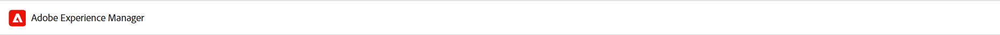
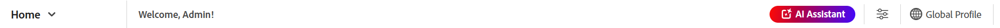

# Expérience de la page d’accueil de Experience Manager Guides

La page d’accueil est le premier écran que vous affichez lorsque vous vous connectez à Experience Manager Guides. Il vous offre une expérience d’écran de bienvenue unifiée et intuitive, qui inclut un aperçu rapide des fichiers auxquels vous avez récemment accédé, des collections, etc.

{align="left"}

La page d’accueil de Experience Manager Guides se compose des sections suivantes :

- Barre d’en-tête
- Barre de navigation
- Panneau de gauche

## Barre d’en-tête

La barre d’en-tête est la barre supérieure de la page d’accueil qui affiche le logo de Adobe Experience Manager (ou un shell unifié si vous utilisez le shell unifié comme interface utilisateur de Experience Manager Guides). Lorsque vous sélectionnez le logo, il vous dirige vers la page de navigation d’Experience Manager.

{align="left"}

## Barre de navigation

La barre de navigation affiche des outils permettant de changer de navigation, de personnaliser la disposition de l’aperçu et d’ajuster l’affichage de la page. Il affiche également le profil de dossier actuel en cours d’utilisation.

>[!NOTE]
>
> Si vous utilisez Adobe Experience Manager Guides as a Cloud Service, une fonctionnalité supplémentaire intitulée **Assistant AI** s’affiche dans la barre de navigation.

{align="left"}

Les fonctionnalités disponibles dans la barre de navigation sont expliquées comme suit :

- **Sélecteur de navigation** : permet une navigation transparente vers d’autres pages :
   - **Accueil** : page par défaut affichée lors de la connexion à Experience Manager Guides.
   - **Éditeur** : éditeur web convivial qui vous permet de créer et de gérer des documents structurés dans Experience Manager Guides. [Découvrez l’interface de l’éditeur](./web-editor.md).
   - **Console de mappage** : fournit un espace de travail dédié pour gérer tous les aspects de la gestion et de la publication des cartes. [Découvrez l’interface de la console Carte](./map-console-overview.md).
- **Assistant IA** : puissant outil optimisé par l’IA, conçu pour améliorer votre productivité grâce à des fonctionnalités d’aide intelligentes. De plus, lorsque vous travaillez dans l’interface de l’éditeur, vous pouvez tirer parti des fonctionnalités de création intelligente de l’assistant AI qui rendent votre processus de création plus intelligent et plus rapide grâce à des suggestions intelligentes de réutilisation et d’optimisation du contenu.

  La fonctionnalité [Assistant AI](./ai-assistant.md) n’est actuellement disponible que pour Adobe Experience Manager as a Cloud Service.
- **Personnaliser la section de présentation** : permet de masquer ou d’afficher les widgets dans la section Widgets.
- **Profil de dossier en cours d’utilisation** : affiche le profil de dossier actuellement utilisé.
- **Développer la vue** : permet de développer la page vue à l’aide de l’icône **Développer**. Dans cette vue, la barre d’en-tête est masquée, ce qui optimise l’espace du contenu. Pour revenir à la vue standard, utilisez l’icône **Quitter la vue développée**.

## Panneau de gauche

Le panneau de gauche vous donne un accès rapide aux fonctionnalités Aperçu, Mapper des collections, Publication en bloc, File d’attente de publication et Préférences utilisateur. Vous pouvez développer le panneau en sélectionnant l’icône **Développer** placée dans le coin inférieur gauche de l’interface. Une fois développé, utilisez l’icône **Réduire** pour réduire le panneau.

{width="300" align="left"}

Ce que vous voyez dans ce panneau dépend de votre rôle d’utilisateur. Le tableau suivant répertorie les rôles et les sections respectives affichées dans le panneau de gauche.

- **Administrateur et éditeur** : la possibilité d’afficher toutes les sections du panneau.
- **Auteur** : la possibilité d’afficher toutes les sections, à l’exception de la publication. Les auteurs n’ont pas accès aux sections Mapper des collections, File d’attente de publication et Publication en bloc .
- **Réviseur** : possibilité d’afficher uniquement la section Aperçu. La sélection de la section Aperçu affiche soit un message d’état vide par défaut, soit le widget Tâches de Workfront , selon qu’Adobe Workfront est configuré ou non.

Les fonctionnalités disponibles dans le panneau de gauche sont expliquées comme suit :

- [Vue d’ensemble](#overview)
- [Mapper des collections](#map-collections)
- [Publier en masse](#bulk-publish)
- [File d’attente de publication](#publish-queue)
- [Préférences utilisateur](#user-preferences)

>[!NOTE]
>
> En outre, si votre administrateur a configuré l’intégration d’Adobe Workfront dans le système, une option **Workfront** s’affiche également dans le panneau de gauche. Découvrez l’[intégration d’Adobe Workfront](./workfront-integration.md) dans Experience Manager Guides.

### Vue d’ensemble

**Présentation** agit comme un tableau de bord personnalisé conçu pour améliorer la productivité. Il comprend différents widgets qui vous aident à rester organisé et ciblé.

Les widgets vous offrent également des options pour trier et redimensionner les colonnes. Pour afficher ces options, sélectionnez l’en-tête de colonne et les options s’affichent dans une liste.

Les widgets suivants sont présents dans la section Widgets :

- **Fichiers récents** : le widget vous fournit un instantané des fichiers récemment ouverts (une liste de fichiers auxquels vous avez accédé dans l’éditeur) ainsi que les détails clés du fichier, y compris le titre, le nom du fichier, le type de fichier, le chemin d’accès au fichier et les dates d’accès.

  {align="left"}

  Vous pouvez trier et redimensionner les colonnes en sélectionnant des options dans le menu déroulant des colonnes. Par défaut, les données sont triées en fonction de la date et de l’heure du dernier accès.

  {align="left"}

  Dans [Préférences utilisateur](#user-preferences), vous pouvez définir le nombre maximal de fichiers qui peuvent être affichés dans ce widget. Par défaut, cette limite est définie sur **20**.

  Les options suivantes sont disponibles lorsque vous pointez sur un fichier :

   - **Ouvrir dans l’éditeur** : permet d’ouvrir le fichier dans l’éditeur. Vous pouvez également ouvrir un fichier en le sélectionnant simplement.
   - **Épingler/désépingler** : vous permet d’épingler un ou plusieurs fichiers au widget Fichiers récents. Les fichiers épinglés s’affichent en haut de la liste des widgets. Pour désépingler un fichier, utilisez l’option **Désépingler**.
   - **Supprimer** : permet de supprimer le fichier du widget Fichiers récents.

  **Créer un fichier à partir du menu déroulant Nouveau fichier**

  Le menu déroulant **Nouveau fichier** vous permet de créer une rubrique ou un plan DITA directement à partir du widget **Fichiers récents**. Une fois le fichier créé, vous êtes redirigé vers l’interface de l’éditeur dans laquelle vous pouvez travailler sur le fichier.

- **Collections** : si vous travaillez sur un ensemble de fichiers ou de dossiers, vous pouvez les ajouter à ce widget pour y accéder rapidement. Une fois ajoutés, vous pouvez afficher les fichiers par titre, ainsi que d’autres détails clés tels que le propriétaire et les dates de création. Lorsque vous sélectionnez la liste déroulante de la colonne, vous pouvez afficher les options de tri et de redimensionnement de la colonne.

  {align="left"}

  Les chemins de navigation de la collection sélectionnée s’affichent en haut du widget Collection. Vous pouvez la sélectionner pour revenir à un dossier spécifique dans la hiérarchie.

  {align="left"}

  Les options suivantes sont disponibles lorsque vous pointez sur une collection et sélectionnez l’icône Plus  :

   - **Renommer** : permet de renommer la collection.
   - **Supprimer** : permet de supprimer la collection.
   - **Afficher dans l’interface utilisateur d’Assets** : permet d’ouvrir la collection dans l’interface utilisateur d’Assets.

  Vous pouvez ouvrir une collection en sélectionnant son titre. Les options suivantes sont disponibles lorsque vous pointez sur un fichier de collection et sélectionnez l’icône Plus  :

   - **Ouvrir dans l’éditeur** : permet d’ouvrir le fichier dans l’éditeur. Vous pouvez également sélectionner le titre du fichier pour l’ouvrir.
   - **Ouvrir dans la console de mappage** : permet d’ouvrir le fichier de mappage dans la console de mappage. (Disponible uniquement pour un fichier de plan DITA).
   - **Ajouter aux collections** : permet d’ajouter le fichier à une collection nouvelle ou existante.
   - **Supprimer des collections** : permet de supprimer le fichier de la liste des collections.
   - **Afficher dans l’interface utilisateur d’Assets** : permet de localiser le fichier dans l’interface utilisateur d’Assets.

  **Créer une collection à partir du menu déroulant Nouvelle collection**

  Le menu déroulant **Nouvelle collection** vous permet de créer une collection et de l’ajouter au widget **Collections**.

>[!NOTE]
>
> En outre, si votre administrateur a configuré l’intégration d’Adobe Workfront dans le système, le widget **Vos tâches** s’affiche également dans la section Widgets . En savoir plus sur l’[intégration d’Adobe Workfront](./workfront-integration.md#working-with-the-your-tasks-widget) dans Experience Manager Guides.

### Mappage des collections

Experience Manager Guides vous permet d’organiser votre contenu pour publication à l’aide d’un tableau de bord appelé **Collections de cartes**. Pour utiliser cette fonctionnalité, sélectionnez **Mapper des collections** dans le panneau de gauche. Elle vous mène à la page Mapper les collections dans l’interface utilisateur **Assets** où vous pouvez [utiliser la collection de mappages pour la génération de sortie.](./generate-output-use-map-collection-output-generation.md)

### Publication en bloc

La fonctionnalité d’activation en bloc vous permet d’activer rapidement et facilement votre contenu de l’instance de création à l’instance de publication. Pour utiliser cette fonctionnalité, sélectionnez **Publication en bloc** dans le panneau de gauche. Elle vous mène à la page Collections d’activation en bloc dans l’interface utilisateur d’Assets, où vous pouvez créer et gérer l’[activation en bloc du contenu publié](./conf-bulk-activation.md).

### File d’attente de publication

Lorsqu&#39;un grand nombre de tâches de publication sont exécutées sur votre système, il devient pratiquement impossible de vérifier chaque plan DITA individuellement pour surveiller sa tâche de publication. Experience Manager Guides offre aux administrateurs et aux éditeurs une vue unifiée de toutes les tâches de publication exécutées dans le système.

Pour utiliser cette fonctionnalité, sélectionnez **File d’attente de publication** dans le panneau de gauche. Elle vous mène à la page du tableau de bord de publication dans l’interface utilisateur d’Assets, où vous pouvez [gérer les tâches de publication à l’aide du tableau de bord de publication](./generate-output-publish-dashboard.md).

### Préférences utilisateur

Les préférences utilisateur sont disponibles pour tous les auteurs. À l’aide des préférences, vous pouvez configurer les paramètres suivants :

- **Général** : l&#39;onglet Général permet de paramétrer les éléments suivants :

  {align="left"}

   - **Profil de dossier** : le profil de dossier contrôle diverses configurations liées aux attributs conditionnels, aux modèles de création, aux paramètres prédéfinis de sortie et aux configurations de l’éditeur. Le profil global s’affiche par défaut. En outre, si votre administrateur a configuré des profils de dossier dans le système, ces profils de dossier s’affichent également dans la liste Profils de dossier .
   - **Chemin d’accès de base** : par défaut, lorsque vous accédez au référentiel Experience Manager Guides à partir de l’éditeur, les ressources s’affichent à partir de l’emplacement /content/dam. Votre dossier de travail serait probablement constitué de quelques dossiers à l’intérieur du dossier /content/dam/. Vous pouvez définir le Chemin d’accès de base à votre dossier de travail, puis la vue du référentiel vous montre le contenu de cet emplacement au premier plan. Cela réduit le temps d’accès à votre dossier de travail. En outre, lorsque vous insérez un fichier de référence ou de média dans votre rubrique, l’emplacement de recherche de fichier commence par le dossier défini dans le chemin d’accès de base.
   - **Sélectionner la carte racine** : sélectionnez un fichier de carte DITA pour résoudre les références clés ou les entrées du glossaire. La carte racine sélectionnée a la priorité la plus élevée pour résoudre les références clés. Pour plus d’informations, voir [Résoudre les références clés](./map-editor-other-features.md).
   - **Nombre maximum de fichiers récents** : utilisez ce champ pour définir une limite maximale pour les fichiers qui s’affichent dans le widget Fichiers récents.
   - **Préférences d&#39;ouverture pour les cartes** : vous pouvez sélectionner ici un comportement par défaut que le système appliquera lors de l&#39;ouverture d&#39;un fichier de carte DITA.

- **Apparence** : l’onglet Apparence vous propose les options de sélection des thèmes de l’application et de la vue source de la zone d’édition du contenu. Utilisez cet onglet pour configurer les paramètres suivants :

  {align="left"}

   - **Thème d’application et vue Source** : vous pouvez choisir parmi les thèmes Clair ou Sombre de l’application et de la vue source. Dans le cas du thème Clair , les barres d’outils et les panneaux utilisent un arrière-plan gris clair. Dans le cas du thème Sombre, les barres d’outils et les panneaux utilisent un arrière-plan noir. Sélectionnez **Utiliser l’appareil** le thème pour permettre à Experience Manager Guides de sélectionner les thèmes clairs et sombres en fonction du thème de votre appareil.

     Dans tous les thèmes, la zone de modification du contenu s’affiche en arrière-plan blanc en mode Création.

   - **Configuration de l’affichage des fichiers de l’éditeur** : sélectionnez la manière par défaut d’afficher les fichiers dans l’éditeur. Vous pouvez afficher la liste des fichiers en fonction des titres ou des noms de fichier à partir des différents panneaux dans la vue de création. Par défaut, les fichiers sont affichés par titre dans l’éditeur.

   - **Toujours localiser les fichiers dans le référentiel** : sélectionnez cette option pour afficher l’emplacement d’un fichier dans le référentiel lors de sa modification dans l’éditeur.
