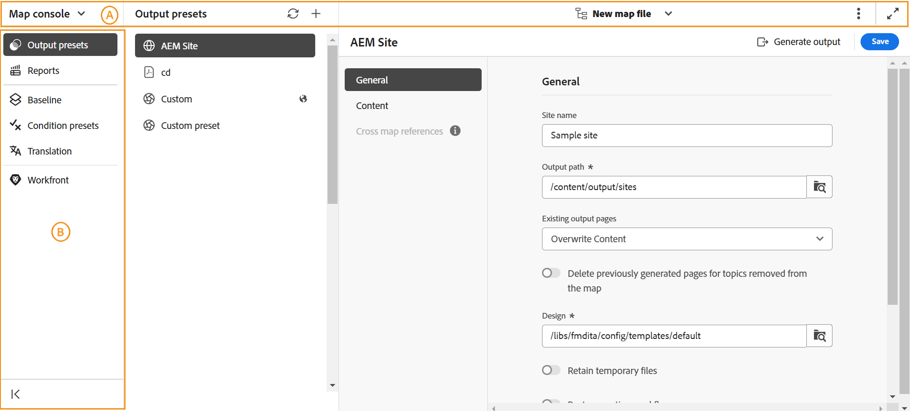

# Présentation de la console Carte

Adobe Experience Manager Guides propose une console dédiée, appelée **console Map**, pour rationaliser toutes vos tâches de gestion et de publication de cartes. Cette interface centralisée améliore la productivité et la précision de vos activités liées aux cartes en vous offrant des options pour générer des sorties, traduire le contenu, accéder aux rapports, etc., le tout à un seul endroit.

{align="left"}

L’interface de Map Console est principalement divisée en deux sections : **Barre de navigation** et **Panneau de gauche**.

{align="left"}

- (**A**) **Barre de navigation** : la barre de navigation fait apparaître les outils permettant de changer de navigation, d’ajuster l’affichage de la page et d’afficher le nom du fichier de mappage sélectionné.

  Les fonctionnalités disponibles dans la barre de navigation sont expliquées comme suit :

   - **Sélecteur de navigation** : permet une navigation transparente vers d’autres pages - Éditeur ou Page d’accueil :
   - **Fichier de mappage sélectionné** : affiche le nom du fichier de mappage actuellement sélectionné. Vous pouvez l’ouvrir dans l’éditeur ou choisir un autre fichier de mappage pour la console Mappage.
   - **Autres actions** : fournit des options pour accéder à l’**interface utilisateur d’Assets** et aux **paramètres**. Pour plus d’informations, reportez-vous à la section **Autres actions** du document [Connaître les fonctionnalités de l’éditeur](./web-editor-features.md#tab-bar).
   - **Développer la vue** : permet de développer la page vue à l’aide de l’icône **Développer**. Dans cette vue, la barre d’en-tête est masquée, ce qui optimise l’espace du contenu. Pour revenir à la vue standard, utilisez l’icône **Quitter la vue développée**.

  >[!NOTE]
  >
  > Si vous utilisez Adobe Experience Manager Guides as a Cloud Service, une fonctionnalité supplémentaire [assistant AI](./ai-assistant.md) s’affiche dans la barre de navigation.

- (**B**) **Panneau de gauche** : le panneau de gauche vous donne un accès rapide aux fonctionnalités de génération de sortie, de création et de gestion de rapports, de ligne de base, de paramètres prédéfinis de condition, de traduction de contenu et de Workfront (uniquement si elles sont configurées).

  Pour plus d’informations, reportez-vous à la section [Fonctionnalités de la console Map](#map-console-features) ci-dessous.

## Fonctionnalités de Map Console

Les fonctionnalités suivantes sont disponibles dans le panneau de gauche lorsque vous [ouvrez un fichier DITA map dans la console Carte](./open-files-map-console.md).

**Génération de sortie**

Avec Map Console, vous pouvez générer efficacement des sorties dans divers formats, y compris AEM Sites, PDF, HTML5, EPUB, JSON, ainsi qu’une sortie personnalisée via DITA-OT, la publication Native PDF et FMPS. Vous pouvez générer une sortie pour un plan DITA complet ou publier de manière sélective seulement quelques rubriques que vous avez mises à jour. Vous pouvez également utiliser la fonction Publication de ligne de base pour publier de manière sélective une version spécifique de votre plan ou rubrique DITA.

Pour plus d’informations, voir [Génération de sortie](./generate-output.md).

**Création et gestion de rapports**

Dans une configuration organisationnelle, vous souhaitez vérifier l’exhaustivité globale de votre documentation technique avant de commencer à travailler dessus ou à publier les documents en direct. Un tel besoin devient encore plus essentiel dans les environnements multi-utilisateurs et à grande échelle. Avec Map Console, vous avez accès aux rapports Experience Manager Guides qui donnent des informations utiles sur l’intégrité globale du contenu dans votre référentiel et sur la manière dont le contenu est utilisé dans le processus de documentation.

Pour plus d’informations, voir [Rapports dans Experience Manager Guides](./reports-intro.md).

**Ligne de base**

Experience Manager Guides fournit la fonction Ligne de base qui vous permet de créer une version de vos rubriques et ressources qui peut ensuite être utilisée pour la publication ou la traduction. Vous pouvez également publier plusieurs paramètres prédéfinis de sortie du même plan DITA en parallèle.

Découvrez comment [créer et gérer des références dans Experience Manager Guides](./web-editor-baseline.md).

**Paramètres prédéfinis de condition**

Experience Manager Guides vous permet de définir des attributs dans vos rubriques DITA et d&#39;utiliser le paramètre prédéfini de condition pour spécifier ce qui se passe avec l&#39;attribut dans la sortie finale. Par exemple, vous pouvez ajouter des attributs en tant que version 1.0 et version 2.0 à votre contenu et utiliser un paramètre prédéfini de condition pour inclure la version 1.0 pour la version 1.0 et exclure la version 2.0. De même, vous pouvez ajouter des attributs tels que OS Windows et OS Linux à votre contenu, puis inclure ou exclure le contenu approprié pour votre sortie finale en fonction du système d’exploitation.

En savoir plus sur les [paramètres prédéfinis de condition](./generate-output-use-condition-presets.md).

**Traduction de contenu**

Experience Manager Guides s’accompagne de puissantes fonctionnalités qui vous permettent de traduire votre contenu dans plusieurs langues. Les workflows de traduction humaine et automatique sont pris en charge par Experience Manager Guides.

Dans la console Mappage , vous avez accès à toutes les options requises pour commencer à utiliser les workflows de traduction. Pour plus d’informations, consultez la section [Traduire le contenu](./translation.md).

**Workfront**

La fonction Workfront est également présente dans la console Carte, ce qui permet d’utiliser les tâches Adobe Workfront directement depuis Experience Manager Guides.

En savoir plus sur l’intégration d’Adobe Workfront à Experience Manager Guides](./workfront-integration.md).[

Vous ne pouvez accéder à cette fonctionnalité que si votre administrateur a configuré l’intégration d’**Adobe Workfront** dans votre instance Experience Manager Guides.
