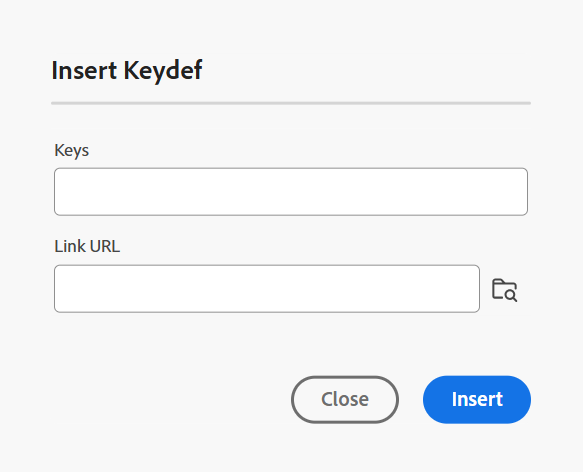

# Fonctionnalités de l’éditeur de cartes {#id1942D0S0IHS}

La barre d’outils de l’éditeur de cartes est similaire à celle de l’éditeur de rubriques. Les opérations de base telles que le basculement du panneau de gauche, l’enregistrement du mappage, la création d’une nouvelle version du mappage, l’annulation/la restauration de la dernière opération et la suppression des éléments sélectionnés sont communes aux deux éditeurs. Pour plus d’informations sur le fonctionnement de ces opérations, consultez la section [Connaître les fonctionnalités de l’éditeur](web-editor-features.md#).

Les options affichées dans la barre d’outils de l’éditeur sont basées sur la vue Éditeur de cartes . Quatre vues sont disponibles dans l’éditeur de cartes :

- [Disposition](#layout-view)
- [Création](#author-view)
- [Source](#source-view)
- [Prévisualisation](#preview)

Les sections suivantes couvrent les options de la barre d’outils disponibles dans les différentes vues de l’éditeur de cartes :

## Mode Mise en page

Lorsque vous ouvrez une carte pour la modifier, le mode Mise en page de l’éditeur de cartes s’ouvre. Le mode Mise en page affiche la hiérarchie de la carte sous forme d’arborescence et vous permet d’organiser les rubriques sur une carte.

>[!NOTE]
>
> Le mode Mise en page affiche uniquement les références présentes dans une carte. Si des références sont rompues, un petit symbole croisé s&#39;affiche à gauche de la référence

Les options suivantes sont disponibles sur la barre d’outils en mode Mise en page :

**Référence de rubrique** - 

Affiche la boîte de dialogue de recherche de rubrique. Accédez au fichier de rubrique/mappage à insérer et choisissez **Sélectionner** pour l’ajouter au mappage.

{align="left"}

**Groupe de sujets** - 

Insérez l’élément `topicgroup`. Pour plus d&#39;informations sur le regroupement des rubriques, consultez la documentation [topicgroup](https://docs.oasis-open.org/dita/v1.0/langspec/topicgroup.html) dans Spécification de langage OASIS DITA.

**Définition de la clé** - 

Affiche la boîte de dialogue Insérer une clé. Utilisez cette boîte de dialogue pour définir toute définition de clé que vous souhaitez utiliser dans le mappage.

{width="300" align="left"}

**Insérer avant/insérer après** - /

Affiche la boîte de dialogue Insérer un élément. Sélectionnez l&#39;élément à insérer dans le mappage. Selon l&#39;opération, le nouvel élément est inséré avant ou après l&#39;élément courant dans la carte.

**Insérer le contenu avant** - 

Cette icône s’affiche lorsque vous ouvrez une carte des signets à des fins de modification. Vous pouvez insérer des composants au début de la liasse, tels qu’une table des matières, un index et une liste de tables.

**Insérer le fond** - 

Cette icône s’affiche lorsque vous ouvrez une carte des signets à des fins de modification. Vous pouvez insérer des composants pour à la fin de la liasse, tels qu’un index, un glossaire et une liste de figures.

**Déplacer l’élément sélectionné vers la gauche/droite** - /

Sélectionnez la flèche de gauche pour déplacer la rubrique vers le côté gauche de la hiérarchie. Cela permet essentiellement de promouvoir le sujet respectif un niveau plus haut dans la hiérarchie. Par exemple, si vous sélectionnez la flèche gauche alors qu&#39;une rubrique enfant est sélectionnée, faites-en la sœur de la rubrique au-dessus. De même, si vous sélectionnez la flèche vers la droite, le sujet est poussé vers la droite, ce qui en fait l’enfant du sujet au-dessus.

**Déplacer l’élément sélectionné vers le haut/bas**  - / 

Sélectionnez les icônes fléchées vers le haut ou vers le bas pour déplacer la rubrique vers le haut ou vers le bas dans la hiérarchie.

>[!NOTE]
>
> Vous pouvez également faire glisser et déposer les références pour les déplacer dans un mappage.

**Verrouiller/Déverrouiller**

Obtient un verrou sur le fichier de carte et libère le verrou. Si votre fichier de mappage contient des modifications non enregistrées, au moment de la libération du verrou, vous êtes invité à enregistrer le fichier de mappage. Les modifications sont enregistrées dans la version actuelle du fichier de mappage.

**Fusionner** - 

Pour plus d’informations sur la fusion de contenu à partir d’une autre version du même fichier ou d’un fichier différent, consultez [Fusion](web-editor-features.md#menu-dropdown) dans l’éditeur.

**Historique des versions** - 

Vérifiez les versions et les libellés disponibles sur votre rubrique active, puis revenez à n’importe quelle version à partir de l’éditeur lui-même.

**Libellé de version** - 

Affiche la boîte de dialogue de gestion des libellés de version. Sélectionnez une version dans la liste déroulante. Sélectionnez le libellé à appliquer à la version sélectionnée, puis sélectionnez **Ajouter un libellé** pour l’ajouter.

**Afficher le nom de fichier**

Affiche le nom de fichier des titres des rubriques.

>[!NOTE]
>
> Lorsque vous placez le pointeur de la souris sur le titre d&#39;une rubrique, le chemin d&#39;accès au fichier s&#39;affiche.

**Afficher les numéros de ligne**

Affiche ou masque le numéro de ligne pour chaque rubrique. Les numéros de ligne s’affichent en fonction du niveau dans la hiérarchie.

**Afficher la case à cocher**

Affiche ou masque une case à cocher pour chaque rubrique. Vous pouvez utiliser la case à cocher pour sélectionner la ou les rubriques et effectuer diverses tâches à l’aide du menu Options.

**Menu Options en mode Mise en page**

Outre l’organisation des rubriques dans le fichier de mappage, vous pouvez également effectuer les actions suivantes à l’aide du menu Options qui s’affiche lorsque vous pointez sur un fichier ou cliquez avec le bouton droit de la souris dans l’éditeur en mode Mise en page :

{width="650" align="left"}

- **Ajouter** : vous pouvez choisir d’ajouter une nouvelle rubrique ou une référence vide à partir de l’éditeur de cartes :
   - **Référence vide** : cette option vous permet d&#39;ajouter une référence vide dans votre plan DITA. Vous pouvez double-cliquer ultérieurement sur la référence vide insérée et ajouter les détails de la rubrique.
   - **Nouvelle rubrique** : lorsque vous choisissez de créer une nouvelle rubrique à partir du menu, vous obtenez la boîte de dialogue **Nouvelle rubrique**. Dans la boîte de dialogue **Nouvelle rubrique**, fournissez les détails requis et sélectionnez **Créer**.
- **Déplacer** : permet de déplacer une rubrique vers le haut/bas/droite/gauche dans la hiérarchie. Vous pouvez également faire glisser une rubrique ou une carte du panneau du référentiel vers la carte ouverte dans l’éditeur de cartes.
- **Annuler** : permet d’annuler la dernière opération en mode Mise en page.
- **Rétablir** : permet de rétablir la dernière opération en mode Mise en page.
- **Copier** : copie la référence sélectionnée du fichier de mappage.

  >[!NOTE]
  >
  > Vous pouvez afficher et sélectionner les cases à cocher pour copier plusieurs références.

- **Coller** : collez les références copiées à l’emplacement actuel dans la hiérarchie.
- **Supprimer** : supprimez les références sélectionnées du fichier de mappage.

  >[!NOTE]
  >
  > Vous pouvez afficher et sélectionner les cases à cocher pour supprimer plusieurs références.

**Affichage des rubriques en fonction de filtres conditionnels**

Si vous avez appliqué des conditions à une rubrique, une icône de filtre s’affiche à droite de la rubrique. Lorsque vous placez le pointeur sur une icône de filtre, la condition appliquée et sa valeur d’attribut s’affichent.

## Vue Auteur

La vue **Auteur** vous permet de modifier votre plan DITA dans l&#39;éditeur. La vue WYSIWYG de l’éditeur de cartes s’affiche, et certaines des icônes affichées en mode Création sont identiques à la vue Mise en page.

{align="left"}

En outre, vous pouvez afficher les icônes suivantes et effectuer les tâches associées à partir de la vue Auteur :

**Insérer avant/Insérer après** - /

Affiche la boîte de dialogue **Insérer un élément avant ou &#x200B;** Insérer un élément après. Sélectionnez l&#39;élément à insérer dans le mappage. Selon l&#39;opération, le nouvel élément est inséré avant ou après l&#39;élément courant dans la carte.

**Element** - 

Affiche la boîte de dialogue **Insérer un élément**. Sélectionnez l’élément à insérer. Vous pouvez utiliser le clavier pour faire défiler la liste des éléments et appuyer sur Entrée pour insérer l’élément requis. Vous pouvez également sélectionner l’élément pour l’insérer dans le mappage.

<!-----------------------------------------------------------

**Relationship table** - 

Inserts a relationship table in the map.

Perform the following steps to work with relationship tables in the Basic Map Editor:

1.  In the Assets UI, navigate to the DITA map in which you want to create the relationship table.

1.  Select the DITA map to open it in DITA map console.

1.  Select the **Topics** tab to view a list of topics available in the DITA map.

    >[!TIP]
    >
    > The Topics tab gives you an option to download the map file with its dependents. For more details, view [Export a DITA map file](authoring-download-assets.md#id218UBA00IXA).

1.  In the main toolbar, select **Edit**.

    The map file is opened in the Advanced Map Editor.

1.  Select **Reltable** from the toolbar.

    {width="650" align="left"}

1.  Drag-and-drop topics from the topic list to the Reltable editor.

    >[!NOTE]
    >
    > You can add topics from any folder in the References rail.

    {width="550" align="left"}

1.  To add a header to your relationship table, click **Add Relheader**.

1.  To add a column to your relationship table, click **Add a Column**.

    {width="550" align="left"}

1.  Click **Save**.

You can also perform the following actions from the relationship table editor:

**Delete rows or columns**

If you want to delete a column from your table, select the checkbox in the column header and click Delete. If you want to remove a row from table, select the checkbox in the first column of the respective row and click Delete.

**Delete a topic**

If you want to delete a topic from your table, click the cross icon next to the topic.

**Delete the relationship table**

If you want to delete the relationship table, click anywhere outside the relationship table and click Delete. For details, view [Work with relationship tables in the Map Editor](map-editor-basic-map-editor.md).
----->

**Contenu réutilisable** - 

Affiche la boîte de dialogue **Réutiliser le contenu**. Utilisez cette boîte de dialogue pour insérer le contenu que vous souhaitez réutiliser dans votre carte.

**Actualiser l’attribut du titre de navigation** - 

Permet de conserver la synchronisation entre l’attribut `@navtitle` et l’élément `title` d’un fichier référencé. Vous pouvez ajouter différents types de fichiers à un mappage, tels que des rubriques, des tâches, des références ou des sous-mappages. La plupart d’entre eux prennent en charge l’attribut `@navtitle`, qui contrôle la façon dont le nom de fichier apparaît sur la carte ou dans la table des matières. Si un fichier contient l’attribut `@navtitle`, l’attribut `@navtitle` du même fichier dans le mappage est mis à jour. Si l’attribut `@navtitle` n’est pas présent, l’attribut `@navtitle` est ajouté à ce fichier de référence et son `title` est également mis à jour pour afficher le `@navtitle`.

>[!NOTE]
>
> Votre administrateur peut choisir d’afficher ou de masquer ce bouton dans la barre d’outils de l’éditeur de cartes à l’aide d’une propriété de configuration. Ils peuvent également activer l’ajout automatique de l’attribut `@navtitle` lorsque des fichiers sont ajoutés à un mappage. Pour plus d’informations, consultez la section [Inclure l’attribut @navtitle par défaut](../cs-install-guide/auto-add-navtitle.md)* dans Installation et configuration d’Adobe Experience Manager Guides as a Cloud Service.

**Balises**

Affiche ou masque les balises XML. Les balises servent de repères visuels indiquant la limite d’un élément. Dans ce mode, si vous souhaitez insérer une référence de rubrique/mappage, faites glisser et déposez le fichier souhaité avant ou après la balise. La barre horizontale ne s’affiche pas en mode Balises .

**Suivi des modifications** - 

Vous pouvez conserver une trace de toutes les mises à jour effectuées dans le fichier de mappage en activant le mode Suivi des modifications. Une fois le suivi des modifications activé, toutes les insertions et suppressions sont capturées dans le document. Pour plus d’informations, voir [Suivi des modifications](web-editor-features.md#track-changes) dans l’éditeur.

**Créer une tâche de révision** - 

Vous pouvez créer une tâche de révision de la rubrique active ou mapper le fichier directement à partir de l&#39;éditeur. Ouvrez le fichier pour lequel vous souhaitez créer la tâche de révision et sélectionnez **Créer une tâche de révision** pour lancer le processus de création de révision. Suivez les instructions données dans la [Introduction à la révision](review.md#) pour plus de détails.

## Vue Source

Cette vue vous permet de modifier le contenu dans son format brut, ce qui vous permet de contrôler entièrement la structure et la mise en forme.

{align="left"}

Dans cette vue, la barre d’outils fournit des options de base d’édition et d’insertion de contenu disponibles sous la liste déroulante **Menu**, notamment Couper, Copier, Annuler, Rétablir, Supprimer, Rechercher et remplacer, Libellé de version, Fusionner, Enregistrer comme nouvelle version, Verrouiller et Déverrouiller.

## Prévisualisation

Le mode Prévisualisation rend le contenu tel qu’il apparaîtra dans la sortie finale, ce qui vous permet de réviser la disposition et la mise en forme avant de le publier.

En plus de pouvoir afficher la position de chaque fichier de rubrique dans une carte, il est souhaitable d’afficher le contenu de la carte dans un flux consécutif. La fonction Aperçu de la carte vous permet d&#39;afficher l&#39;intégralité du contenu du fichier de carte en un seul clic. Il n’est pas nécessaire de générer une sortie du fichier de mappage pour voir à quoi ressemblera l’ensemble du mappage une fois publié. Vous pouvez simplement accéder à l&#39;aperçu de la carte et tous les sujets et sous-cartes sont rendus sous la forme d&#39;un livre.

{align="left"}

>[!NOTE]
>
> Aucune option d’édition ou d’insertion de contenu n’est disponible dans la barre d’outils en mode Aperçu. Vous ne pouvez pas modifier le contenu dans cette vue. Vous pouvez toutefois utiliser les fonctionnalités **Enregistrer en tant que nouvelle version** et **Verrouiller** ou **Déverrouiller**.

Vous pouvez effectuer les tâches supplémentaires suivantes en mode Aperçu :

- Cliquez avec le bouton droit de la souris sur une rubrique, puis sélectionnez **Modifier** pour ouvrir la rubrique afin de la modifier dans un nouvel onglet.

  >[!NOTE]
  >
  > Si vous ne disposez pas de droits de modification, la rubrique s’ouvre en mode lecture seule.

- Accédez à la rubrique souhaitée en sélectionnant le titre de la rubrique dans l’arborescence de carte \(dans le panneau de gauche\).

- La rubrique actuelle dans la prévisualisation de la carte est également mise en surbrillance dans l&#39;arborescence de la carte.

**Autres méthodes pour prévisualiser un fichier de mappage**

Vous pouvez accéder à l’aperçu d’une carte depuis :

- **Interface utilisateur d’Assets** : dans l’interface utilisateur d’Assets, accédez à l’emplacement du mappage, sélectionnez le fichier de mappage et choisissez **Prévisualiser le mappage** dans la barre d’outils. L’aperçu de la carte s’affiche dans un nouvel onglet. Vous pouvez afficher le contenu de toutes les rubriques en mode Aperçu. Dans cet affichage, vous ne pouvez modifier aucune rubrique.

  >[!NOTE]
  >
  > Si l’option *Prévisualiser le mappage* n’est pas visible dans la barre d’outils principale, elle a peut-être été déplacée sous le menu de la barre d’outils **Plus**.

- **Éditeur de cartes** : dans l’éditeur de cartes, sélectionnez **Aperçu** dans le menu d’options pour afficher l’aperçu de la carte actuelle.

  {width="650" align="left"}

  L&#39;aperçu de la carte est affiché dans une boîte pop-up.

  {width="500" align="left"}

**Propriétés du mappage**

Affiche la boîte de dialogue Propriétés du mappage dans laquelle vous pouvez définir les attributs et les informations de métadonnées du mappage.

## Modifier les rubriques via le plan DITA {#id17ACJ0F0FHS}

La modification d’une rubrique individuelle ne donne pas le contexte complet à l’auteur. Un auteur ne dispose d&#39;aucune information sur l&#39;emplacement d&#39;une rubrique dans un plan DITA. Sans ces informations contextuelles, il devient un peu difficile pour les auteurs de créer du contenu.

Experience Manager Guides permet aux auteurs d&#39;ouvrir un plan DITA dans l&#39;éditeur et d&#39;afficher le positionnement des rubriques dans le plan. Cela permet aux auteurs de savoir exactement où le sujet est placé sur la carte et de créer du contenu plus pertinent. En outre, si plusieurs auteurs travaillent sur un projet, ils peuvent connaître tous les sujets disponibles sur la carte et réutiliser le contenu, si nécessaire.

Pour modifier des rubriques via un plan DITA, procédez comme suit :

1. Dans le panneau Référentiel, accédez au fichier DITA map à modifier et ouvrez-le.

   Le fichier de mappage s’ouvre dans la vue Carte.

>[!NOTE]
>
> Vous pouvez également utiliser l&#39;interface utilisateur d&#39;Assets pour ouvrir un fichier de plan DITA. Accédez au fichier de plan DITA contenant les rubriques à modifier et sélectionnez **Modifier les rubriques** dans la barre d&#39;outils principale pour lancer l&#39;éditeur.

1. Sélectionnez un lien de rubrique pour l’ouvrir dans l’éditeur en vue de le modifier.

   Vous pouvez ouvrir plusieurs rubriques dans l’éditeur et chaque rubrique est ouverte dans un nouvel onglet de l’éditeur. Même si votre plan DITA contient des sous-plans, les rubriques des sous-plans sont également ouvertes dans un nouvel onglet pour modification. Si vous souhaitez visualiser les rubriques sous une sous-carte, vous pouvez sélectionner et développer la sous-carte.

   {align="left"}

   Si vous sélectionnez un fichier de mappage, le mappage est ouvert dans un nouvel onglet de l’éditeur.

1. Une fois la modification des rubriques terminée, vous pouvez effectuer les opérations suivantes :

   - Vous pouvez les enregistrer individuellement. Si vous fermez sans enregistrer vos rubriques, une boîte de dialogue vous invitant à enregistrer les rubriques non enregistrées s’affiche :

     {width="300" align="left"}

     Vous pouvez choisir d’enregistrer toutes les rubriques sélectionnées ou de désélectionner les rubriques que vous ne souhaitez pas enregistrer.

   - Vous pouvez déverrouiller la rubrique à l’aide de l’option **Enregistrer en tant que nouvelle version**. Lorsque vous enregistrez une version de la rubrique, une nouvelle version est créée et le verrou est également libéré.

     Il est recommandé d’enregistrer vos modifications avant de déverrouiller les fichiers.  Lorsque vous enregistrez les modifications, le fichier XML est validé.

   - Vous pouvez également afficher la progression des rubriques dans la boîte de dialogue **Enregistrer en tant que nouvelle version**. Un message de réussite s’affiche lorsque les fichiers sont déverrouillés.

   - Si votre administrateur a activé l’option de déverrouillage des fichiers à la fermeture, une invite vous demandant d’enregistrer les fichiers verrouillés s’affiche à chaque fermeture des fichiers verrouillés. Lorsque cette option est activée, lorsque vous fermez l’éditeur avec les fichiers modifiés, la liste des fichiers verrouillés à enregistrer s’affiche. Les fichiers verrouillés s’affichent avec une icône de verrouillage :

     {width="350" align="left"}

## Panneau de droite dans l’éditeur de cartes

Le panneau de droite affiche les propriétés de contenu et les propriétés de carte en mode Mise en page de l’éditeur de cartes.

**Propriétés du contenu**

Le panneau Propriétés du contenu contient des informations sur le type de rubrique actuellement sélectionnée dans la carte, son URL de lien et ses attributs. Pour plus d’informations, consultez la section [Propriétés du contenu](web-editor-features.md#right-panel) dans l’éditeur.

- **Autres attributs** Si votre administrateur a créé un profil pour les attributs, vous obtiendrez ces attributs ainsi que leurs valeurs configurées. À l’aide du panneau Propriétés du contenu , vous pouvez choisir ces attributs et les affecter au contenu approprié dans votre rubrique. Vous pouvez également affecter des attributs configurés par votre administrateur sous l’onglet **Afficher les attributs** dans les paramètres de l’éditeur. Les attributs définis pour un élément sont affichés en mode Mise en page et Plan. Cela vous permet d’avoir un aperçu rapide de toutes les rubriques d’un mappage pour lequel un attribut particulier est défini. Par exemple, toutes les rubriques qui possèdent l’attribut `audience` sont définies comme `US`.

  {width="650" align="left"}

  Pour plus d’informations, consultez la section *Attributs d’affichage* dans la description de la fonctionnalité *Paramètres* dans l’[Éditeur](web-editor-features.md#main-toolbar).

- **Métadonnées** à l’aide des métadonnées , vous pouvez définir les informations de métadonnées. Vous pouvez définir le titre de navigation, le texte du lien, la description courte et les mots-clés.

Pour plus d&#39;informations sur les métadonnées et les attributs de rubrique standard, consultez la documentation [topicref](https://docs.oasis-open.org/dita/v1.2/os/spec/langref/topicref.html) dans la section Spécification du langage OASIS DITA.

**Rubrique parente :** [Présentation de l’éditeur de cartes](map-editor.md)
