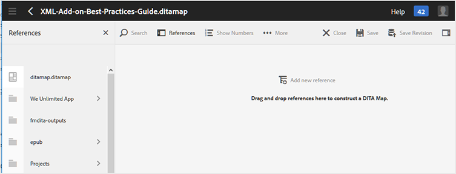

# Utilisation de l’éditeur de cartes de base {#id1942CM005Y4}

>[!NOTE]
>
> L’éditeur de carte de base, auparavant disponible dans Experience Manager Guides, est obsolète à partir des versions 4.3 et 2307. Vous ne pouvez pas accéder à l&#39;éditeur de mappages de base pour créer et gérer des mappages DITA.
>Il est recommandé d’utiliser l’éditeur de carte avancé. L’éditeur de carte avancé offre des fonctionnalités améliorées et de meilleures options de personnalisation. Découvrez comment utiliser l’[éditeur de cartes avancé](../user-guide/map-editor-advanced-map-editor.md).

L&#39;éditeur de carte de base offre une fonctionnalité simple par glisser-déposer permettant d&#39;ajouter des rubriques de votre référentiel AEM pour créer le plan DITA ou le plan de votre signet. Vous pouvez ajouter des rubriques imbriquées, des tables de relation \(reltable\), des attributs et des informations de métadonnées, ainsi que valider la carte pour en vérifier l’exactitude.

>[!NOTE]
>
> Si votre administrateur a activé l&#39;option Éditeur de carte avancé, vous n&#39;aurez pas accès à l&#39;Éditeur de carte de base. Tous les fichiers de mappage s’ouvrent par défaut dans l’éditeur de mappage avancé.

Les sections suivantes décrivent les différentes fonctions disponibles dans l’éditeur de cartes de base.

## Ajouter des rubriques à un fichier de mappage {#id193CBL0505Z}

Une fois qu’un fichier de mappage est créé, vous devez y ajouter des rubriques. À l’aide de l’éditeur de mappage de base, vous pouvez ajouter des rubriques, des tables de relation ou d’autres fichiers de mappage.

Effectuez les étapes suivantes pour créer votre fichier map :

1. Dans l’interface utilisateur d’Assets, accédez au fichier de mappage à modifier.

1. Pour obtenir un verrou exclusif sur le fichier de mappage, sélectionnez le fichier de mappage et cliquez sur **Extraire**.

   >[!NOTE]
   >
   > Une fois que vous disposez d’un verrou exclusif sur un fichier map, les autres utilisateurs ne peuvent pas modifier le map. Cependant, ils pourraient travailler sur les rubriques du fichier de carte.

1. Une fois le fichier de mappage sélectionné, cliquez sur **Modifier**.

   Le fichier de mappage est ouvert pour modification dans l’éditeur de mappages. À l’aide de l’éditeur de cartes, vous créez une carte en utilisant les rubriques actuellement disponibles qui s’affichent dans le rail Références.

   {align="left"}

1. À l’aide du rail **Références**, accédez au dossier contenant les rubriques ou les sous-mappages à ajouter.

   >[!NOTE]
   >
   > Vous pouvez ajouter des rubriques ou des sous-mappages à partir de n’importe quel dossier dans le rail Références .

1. Pour ajouter la première rubrique à la carte, faites glisser et déposez la rubrique sur l’éditeur de cartes de base.

   >[!NOTE]
   >
   > Après avoir ajouté le premier lien, le lien Ajouter une nouvelle référence est disponible lorsque vous placez le pointeur de la souris sur une rubrique existante de la carte.

1. Pour ajouter des rubriques suivantes ou une sous-carte, faites glisser et déposez la rubrique ou la sous-carte vers l’emplacement souhaité dans la carte.

   Si vous ajoutez une sous-carte à votre plan DITA, la sous-carte s&#39;affiche sous la forme d&#39;un lien dans le plan DITA. Pour visualiser toutes les rubriques de la sous-carte, cliquez sur le lien sous-carte. Le contenu de la sous-carte est affiché dans un nouvel onglet.

   >[!NOTE]
   >
   > Si vous déposez une nouvelle rubrique sur une rubrique existante dans la carte, vous obtenez un message sur le remplacement de la rubrique. Cliquez sur Oui si vous souhaitez remplacer la rubrique, cliquez sur Non si vous ne souhaitez pas remplacer la rubrique. Vous pouvez utiliser les combinaisons CTRL+Z et CTRL+Y pour annuler ou rétablir toute modification apportée à la carte.

1. Cliquez sur **Enregistrer**.

## Fonctionnalités disponibles dans la barre d’outils de l’éditeur de cartes de base

La barre d’outils principale de l’éditeur de carte de base vous permet d’effectuer les tâches suivantes :

{align="left"}

**A : Recherche**

Vous pouvez rechercher et inclure les rubriques requises dans la gestion des ressources numériques. Cliquez sur cette icône pour afficher la boîte de dialogue Rechercher :

{align="left"}

Saisissez les mots-clés à rechercher ; ces mots-clés sont associés dans les valeurs de nom de fichier, de contenu et même d’attribut du sujet. Une fois les résultats de la recherche disponibles, sélectionnez la ou les rubriques souhaitées, puis cliquez sur le bouton Vérifier pour ajouter les fichiers sélectionnés à la fin de votre structure de mappage. Vous pouvez filtrer les résultats de la recherche en spécifiant les paramètres de date de modification.

**B : groupe**

Cochez la case à gauche des rubriques et cliquez sur Regrouper dans la barre d’outils pour regrouper les rubriques sélectionnées. Pour plus d&#39;informations sur le regroupement des rubriques, consultez la documentation [topicgroup](https://docs.oasis-open.org/dita/v1.0/langspec/topicgroup.html) dans Spécification du langage OASIS DITA.

**C : supprimer**

Cliquez sur la case à cocher située à gauche d’une rubrique, puis sur Supprimer dans la barre d’outils pour supprimer les rubriques sélectionnées de la carte.

**D : afficher/masquer les nombres**

Afficher la numérotation \(ou masquer\) pour les rubriques de la carte.

**E : valider**

Vérifiez si la carte est valide ou comporte des erreurs.

**F : mode par défaut/mode XML**

Dans le **Mode par défaut**, cliquer sur un lien de rubrique affiche l&#39;aperçu de la rubrique dans un nouvel onglet. Cliquez sur l’icône **Mode par défaut** pour changer son mode en **Mode XML**. En **mode XML**, cliquer n&#39;importe où dans une ligne de rubrique affiche le code XML sous-jacent des références de rubrique dans la rubrique. Dans la vue XML source, il existe une option **Retrait automatique** qui réorganise le code XML dans un format présentable et facile à lire. Si vous modifiez une carte manuellement, la vue source effectue également des contrôles de validation. Si votre fichier XML contient des erreurs, celles-ci sont mises en surbrillance dans le **Mode XML** et vous n&#39;êtes pas autorisé à enregistrer le fichier de mappage DITA. Si vous souhaitez afficher le XML pour l&#39;ensemble du mappage, cliquez n&#39;importe où en dehors de la limite de rubrique.

**Remarque :** en mode par défaut, vous pouvez utiliser les raccourcis clavier pour annuler \(`Ctrl+z`\) ou rétablir \(`Ctrl+y`\) la dernière action.

{width="650" align="left"}

**G : Propriétés de la carte**

Affichez la boîte de dialogue Propriétés de la carte dans laquelle vous pouvez définir les attributs et les informations de métadonnées de la carte. Pour ajouter un attribut, cliquez sur le bouton **Ajouter** dans le coin inférieur gauche de la boîte de dialogue pour obtenir la liste déroulante **Attribut**. Dans la liste, sélectionnez l’attribut à ajouter. Si l’attribut sélectionné possède des valeurs prédéfinies spécifiées dans la DTD, ces valeurs sont présentées dans une nouvelle liste déroulante. Vous pouvez sélectionner la valeur souhaitée dans la liste déroulante. S’il n’existe aucune valeur prédéfinie, une zone de texte s’affiche pour vous permettre de saisir une valeur pour l’attribut sélectionné.

{width="300" align="left"}

## Fonctionnalités disponibles au niveau de la rubrique dans l’éditeur de cartes de base

Lorsque vous placez le pointeur de la souris sur une rubrique ou un fichier de sous-mappage dans l’éditeur de mappage de base, vous pouvez effectuer les tâches suivantes :

{width="650" align="left"}

**A : Déplacer vers la gauche ou vers la droite**

Cliquez sur les icônes fléchées à gauche ou à droite pour déplacer la rubrique vers la gauche ou la droite. Le déplacement d’une rubrique de cette manière en fait une \(imbrication\) enfant ou sœur \(suppression de l’imbrication\) par rapport à la rubrique au-dessus.

**B : propriétés**

Cliquez sur l’icône Propriétés pour ouvrir la boîte de dialogue Propriétés de la rubrique. Cette boîte de dialogue vous permet de définir les attributs de rubrique et les informations de métadonnées. Pour plus d&#39;informations sur les métadonnées et les attributs de rubrique standard, reportez-vous à la documentation [topicref](https://docs.oasis-open.org/dita/v1.2/os/spec/langref/topicref.html) dans Spécification de langage OASIS DITA.

{width="350" align="left"}

**C : Ajouter une nouvelle référence**

Cliquez sur l&#39;icône Ajouter une nouvelle référence pour ajouter une nouvelle référence en tant que sœur de la rubrique active.

**D : Ajouter Une Nouvelle Définition De Clé**

Cliquez sur l’icône Clé pour ajouter une nouvelle définition de clé. Toute clé remplacée ou déjà définie dans la carte s’affiche en rouge. Si vous cliquez sur l’icône Propriétés dans une définition de clé, vous accédez à la boîte de dialogue Propriétés de la clé.

## Utiliser les tables de relation dans l’éditeur de mappage de base {#id1944B0I0COB}

Les éditeurs de carte d&#39;AEM Guides s&#39;accompagnent d&#39;une puissante fonctionnalité qui vous permet de créer et de modifier des tables de relation dans votre plan DITA.

Pour utiliser les tables de relation dans l’éditeur de mappage de base, procédez comme suit :

1. Dans l’interface utilisateur d’Assets, accédez au plan DITA dans lequel vous souhaitez créer la table de relation.

1. Cliquez sur le plan DITA pour l&#39;ouvrir dans la console Plan DITA.

1. Sélectionnez l&#39;onglet **Rubriques** pour afficher la liste des rubriques disponibles dans le plan DITA.

   >[!TIP]
   >
   > L’onglet Rubriques vous donne la possibilité de télécharger le fichier de mappage avec ses dépendants. Pour plus d&#39;informations, voir [Exporter un fichier de plan DITA](authoring-download-assets.md#id218UBA00IXA).

1. Dans la barre d&#39;outils principale, cliquez sur **Modifier**.

   Le fichier de mappage est ouvert dans l’éditeur de mappage de base.

1. Sélectionnez **Fiable** dans la barre d’outils.

   {width="650" align="left"}

1. Faites glisser et déposez des rubriques de la liste des rubriques vers l’éditeur fiable.

   >[!NOTE]
   >
   > Vous pouvez ajouter des rubriques à partir de n’importe quel dossier dans le rail Références.

   {width="550" align="left"}

1. Pour ajouter un en-tête à votre tableau de relation, cliquez sur **Ajouter un nouvel en-tête**.

1. Pour ajouter une colonne à votre table de relation, cliquez sur **Ajouter une colonne**.

   {width="550" align="left"}

1. Cliquez sur **Enregistrer**.

Vous pouvez également effectuer les actions suivantes à partir de l’éditeur de table de relation :

**Supprimer lignes ou colonnes**

Si vous souhaitez supprimer une colonne de votre tableau, cochez la case située dans l’en-tête de colonne et cliquez sur Supprimer. Si vous souhaitez supprimer une ligne du tableau, cochez la case située dans la première colonne de la ligne correspondante, puis cliquez sur Supprimer.

**Supprimer une rubrique**

Si vous souhaitez supprimer une rubrique de votre tableau, cliquez sur l’icône en forme de croix en regard de la rubrique.

**Supprimer la table de relation**

Si vous souhaitez supprimer la table de relation, cliquez n&#39;importe où en dehors de la table de relation et cliquez sur Supprimer.

**Rubrique parente :**[ Utilisation de l’éditeur de cartes](map-editor.md)
