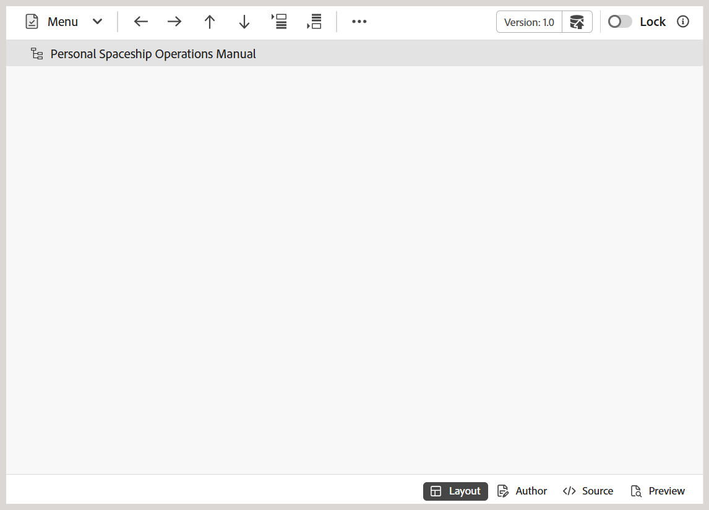
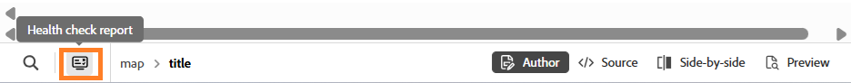
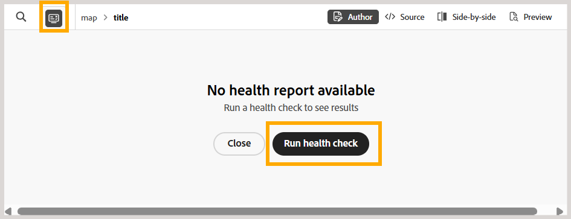
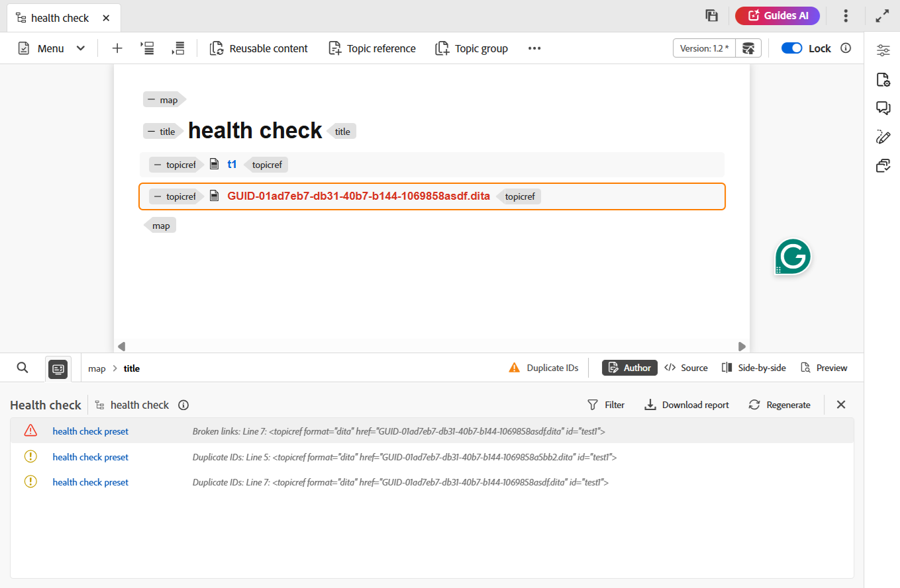

# Fonctionnalités supplémentaires de l’éditeur de cartes {#id1942D0T0HUI}

Voici quelques fonctionnalités courantes de l’éditeur de cartes :

## Résoudre les principales références {#id176GD01H05Z}

Une référence de clé de contenu DITA, ou `conkeyref`, est un mécanisme permettant d&#39;insérer une partie du contenu d&#39;une rubrique dans une autre. Ce mécanisme utilise la clé pour localiser le contenu à réutiliser plutôt que le mécanisme de référencement direct du contenu. Pour plus d&#39;informations sur le référencement direct et indirect dans DITA, consultez *Adressage DITA* dans Spécification de langage OASIS DITA.

Si la rubrique DITA est associée à des références clés, celles-ci doivent être résolues avant de prévisualiser, modifier ou réviser une rubrique.

Les références clés sont résolues sur la base du mappage racine défini dans l’ordre de priorité suivant :

1. Préférences utilisateur
1. Panneau Vue Carte
1. Profil de dossier

La carte racine sélectionnée dans les Préférences utilisateur a la priorité la plus élevée pour résoudre les références clés, suivie du panneau Vue Carte et de la carte racine Profil de dossier. Ainsi, si aucune carte n’est définie dans les Préférences utilisateur, la carte ouverte dans le panneau Vue Carte est utilisée. Si aucun mappage n’est ouvert dans le panneau Mappage , le mappage défini dans les profils de dossier est utilisé pour résoudre les références clés.

Les références de clés peuvent être stockées dans un fichier de plan DITA ou dans un fichier DITA distinct. Dans Experience Manager Guides, vous pouvez spécifier des références clés au niveau du projet ou de la session. Si une carte racine est déjà définie pour la session utilisateur, elle est utilisée pour résoudre les clés. Dans le cas contraire, le mappage racine par défaut pour ce dossier est utilisé. Si aucune carte racine par défaut n’est configurée, les références clés manquantes sont mises en surbrillance pour l’utilisateur.

Il existe plusieurs façons de résoudre les références clés d&#39;une rubrique DITA en définissant le plan DITA à utiliser aux emplacements suivants :

**Propriétés du projet** - Vous pouvez définir une carte racine pour résoudre les références clés lors de la création d’un projet dans la section Propriétés du projet .

Cette carte racine s’appliquera à toutes les ressources \(dossiers et sous-dossiers\) associées à ce projet. Pour le contenu référencé dans plusieurs projets, une liste alphabétique de projets est conservée et la carte racine par défaut associée au premier projet est utilisée. Vous pouvez également choisir le plan DITA à utiliser dans la liste pour résoudre les références clés.

**Aperçu de la rubrique** - En mode Aperçu de la rubrique, sélectionnez l&#39;icône Résolution de clé dans la barre d&#39;outils et sélectionnez le fichier DITA à utiliser pour les références de clé.

**Vue d&#39;édition de rubrique** - Sélectionnez l&#39;icône Résolution de clé lors de la modification d&#39;une rubrique DITA et sélectionnez le fichier DITA à utiliser pour résoudre les références de clé.

## Ajouter des références de navigation

L&#39;élément `navref` est utilisé dans un plan DITA pour inclure des références de navigation provenant d&#39;un autre plan DITA. Cela permet aux auteurs de réutiliser la structure de navigation, telle que les menus partagés ou les liens, sans fusionner le contenu réel de la carte référencée dans la sortie.

>[!NOTE]
>
> L’élément `navref` est destiné uniquement à des fins de navigation dans la structure de carte. Il ne contribue pas à la sortie de mappage DITA générée et est exclu du traitement et de l&#39;affichage dans la vue Carte, les rapports, la ligne de base, la traduction et la prévisualisation.

Pour ajouter des références de navigation à une carte, procédez comme suit :

1. Ouvrez le fichier DITA map dans lequel vous souhaitez ajouter une référence de navigation.

   Le fichier de mappage s’ouvre dans l’éditeur de mappages.
1. Passez à la vue Auteur et placez le curseur à un emplacement valide pour une référence de navigation.
1. Sélectionnez l’option **Élément** dans la barre d’outils.
1. Dans la boîte de dialogue **Insérer un élément**, sélectionnez **navref**.

   
1. La boîte de dialogue **Sélectionner le chemin** s’affiche. Sélectionnez un fichier de mappage à inclure comme référence de navigation dans votre mappage, puis choisissez **Sélectionner**.

Une référence de navigation du fichier de mappage sélectionné est ajoutée à l’emplacement spécifié. En outre, le titre de la carte référencée s’affiche en mode Création et en mode Mise en page.

*Vue Auteur*

*Mode Mise en page*

## Exécuter le contrôle d’intégrité sur une carte

L’option Exécuter le contrôle d’intégrité du menu contextuel vous permet d’exécuter un contrôle d’intégrité sur la carte sélectionnée pour détecter des problèmes tels que des liens rompus, des identifiants en double et des échecs de validation du schéma avant publication.

>[!NOTE]
>
> Cette fonctionnalité est activée par défaut. Si vous préférez ne pas utiliser cette fonctionnalité dans votre environnement, contactez votre équipe du succès client.

Les contrôles pouvant être exécutés sont définis par un paramètre prédéfini de contrôle de l’intégrité, créé et géré par un administrateur au niveau du profil de dossier. Pour plus d’informations, consultez [Création et gestion des paramètres prédéfinis de contrôle de l’intégrité](../install-conf-guide/conf-health-check-preset.md).

Effectuez les étapes suivantes pour exécuter un contrôle d’intégrité sur une carte :

1. Ouvrez un mappage dans l’éditeur.
1. Dans le menu Options, sélectionnez l’option **Exécuter le contrôle de l’intégrité**.
   
1. La boîte de dialogue Exécuter le contrôle de l’intégrité s’affiche. Sélectionnez un paramètre prédéfini de contrôle de l’intégrité à exécuter. Seuls les paramètres prédéfinis configurés pour votre profil de dossier peuvent être sélectionnés.

   La sélection d’un paramètre prédéfini charge les contrôles définis dans la boîte de dialogue.

   
1. *Facultatif* Sélectionnez une ligne de base. Si vous ne souhaitez pas utiliser de ligne de base, sélectionnez **Aucune**.
1. Sélectionnez **Exécuter**.

Vous pouvez également exécuter un contrôle d’intégrité sur une carte à partir du panneau **Rapport de contrôle d’intégrité**. Pour ce faire, ouvrez une carte en mode Carte, puis sélectionnez l’icône **Rapport de contrôle de l’intégrité**.

>[!NOTE]
>
>Cette option s’affiche uniquement pour un mappage sur lequel aucun contrôle de l’intégrité n’a encore été exécuté. Si un contrôle de l’intégrité a déjà été exécuté sur la carte, si vous sélectionnez l’icône **Rapport de contrôle de l’intégrité**, le rapport existant s’ouvre à la place.

Dans le panneau, sélectionnez **Exécuter le contrôle de l’intégrité**.

La même boîte de dialogue **Exécuter le contrôle d’intégrité** s’ouvre, dans laquelle vous pouvez sélectionner un paramètre prédéfini de contrôle d’intégrité et une ligne de base pour exécuter un contrôle d’intégrité sur la carte, comme décrit dans les étapes ci-dessus.

## Utilisation du rapport de contrôle de l’intégrité dans l’éditeur

Lorsque vous exécutez un contrôle d’intégrité pour une carte, le rapport s’ouvre dans le panneau **Rapport de contrôle d’intégrité** comme illustré ci-dessous :

### Options du panneau de rapport de vérification de l’intégrité

Les options suivantes sont disponibles dans le panneau Rapport de vérification de l’intégrité :

- **Nom du mappage** : nom du mappage pour lequel le rapport a été généré.
- **Icône Infos** : sélectionnez cette option pour afficher le nom du paramètre prédéfini, la version du mappage et la ligne de base (le cas échéant) utilisés pour générer le rapport.
- **Filtrer** : permet de limiter le rapport à une règle spécifique, par exemple pour n’afficher que les résultats Liens rompus . Le filtre répertorie uniquement les types de règles qui ont généré des résultats dans le rapport actuel.
- **Télécharger le rapport** : télécharge le rapport.
- **Régénérer** : exécute à nouveau le contrôle de l’intégrité.

### Résultats du contrôle d’intégrité

Chaque résultat des contrôles sélectionnés est listé avec les détails suivants :
- **Gravité** : niveau de gravité du résultat ; par exemple Erreur, Avertissement, Infos ou Fatal.
- **Nom du préréglage de contrôle de l’intégrité** : nom du préréglage de contrôle de l’intégrité utilisé pour générer le rapport
- **Nom de la règle** : la règle qui a généré le résultat, par exemple les liens rompus ou l’ID en double.
- **Numéro de ligne** : la ligne dans le fichier où le problème se produit.
- **Ressource** : fichier dans lequel le problème a été détecté.

Sélectionnez un résultat pour ouvrir le fichier correspondant à la ligne exacte où le problème persiste.

>[!NOTE]
>
>Les résultats du lien rompu ouvrent le fichier en mode création. Les résultats de la validation des identifiants et des schémas en double ouvrent le fichier en mode Source.

### Régénérer le rapport

Après avoir résolu un problème, sélectionnez **Régénérer** dans la barre d’outils pour exécuter à nouveau le contrôle de l’intégrité et confirmer que le problème a été résolu. Dans la boîte de dialogue **Régénérer** qui s&#39;affiche, sélectionnez les vérifications à inclure dans le rapport régénéré.

>[!NOTE]
>
> Les rapports de contrôle de l’intégrité sont spécifiques à l’utilisateur qui les a générés. Si plusieurs utilisateurs génèrent un rapport pour la même carte, chaque utilisateur consulte ses propres résultats. Toutefois, les administrateurs ont toujours accès au dernier rapport généré pour la carte.

### Télécharger le rapport

Sélectionnez **Télécharger le rapport** pour télécharger le rapport au format XLS, avec des informations détaillées pour chaque résultat.

**Rubrique parente :**[ Présentation de l’éditeur de cartes](map-editor.md)
