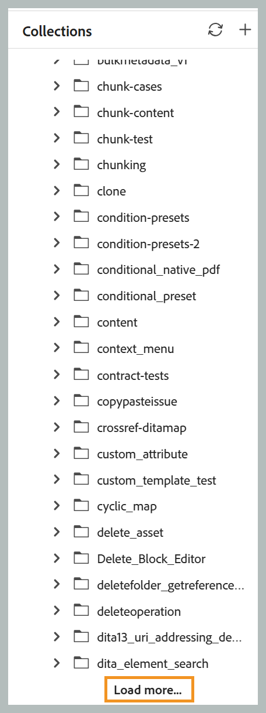

## Chargement paginé des fichiers et des dossiers

>[!NOTE]
>
> Cette fonctionnalité est activée par défaut. Pour le désactiver, contactez votre équipe du succès client.

Experience Manager Guides utilise une API paginée pour charger des fichiers et des dossiers. Au lieu de charger tout le contenu en une seule fois, les dossiers se chargent progressivement par lots, avec des ressources supplémentaires récupérées automatiquement au fur et à mesure que vous faites défiler l’écran ou en sélectionnant l’option **Charger plus**.

Le tri est effectué côté serveur. Ainsi, l’application d’un ordre de tri récupère les résultats nouvellement triés plutôt que de réorganiser les données déjà chargées dans le navigateur. Les opérations courantes, telles que le changement de nom, la suppression, l’ajout et le déplacement, ne rechargent plus un dossier entier. Au lieu de cela, ils mettent à jour uniquement l’élément concerné ou actualisent la première page de résultats. La fonctionnalité *Toujours localiser un fichier dans l’Explorateur* n’est également plus disponible. Pour n’importe quelle ressource, vous pouvez toujours utiliser le menu contextuel pour localiser le fichier dans l’Explorateur.

Les sections ci-dessous décrivent comment chacune de ces options s’applique à différentes interfaces, panneaux et boîtes de dialogue.

### Table de référentiel interne

- **Navigation** : utilise le défilement infini. Le premier lot de ressources se charge initialement, tandis que les lots suivants sont ajoutés automatiquement en suivant le défilement. Le changement de dossier efface la liste actuelle et charge les ressources à partir du dossier nouvellement sélectionné.
- **Renommer** : statique ; aucune actualisation de dossier.
- **Supprimer** : le dossier racine s’actualise pour afficher le premier lot de ressources.
- **Ajouter** : le nouveau fichier est inséré en haut (du dossier actif). D’autres métadonnées, telles que l’état du document, le statut du verrouillage, le type de fichier, la date de création et d’autres détails, sont récupérées dans une seule requête en arrière-plan par lots et remplies automatiquement au bout d’un certain temps.
- **Déplacer** : le déplacement d’un fichier dans le dossier actif l’ajoute en haut ; le déplacement d’un fichier en dehors du dossier actif actualise le dossier à son premier lot de ressources.
- **bouton Actualiser** : recharge le dossier actif et affiche le premier lot de ressources.
- **Tri** : affichez la première page triée avec un défilement infini.
- **Panneau de navigation Dossier** : l’ouverture d’un dossier charge le premier lot de ressources, auquel est ajoutée une option **Charger plus** pour les lots suivants.

  {width="650"}

### Collections

- L’ajout d’un fichier l’insère en haut du dossier sans actualiser le dossier.
- L’ouverture d’un dossier charge le premier lot de ressources, auquel est ajoutée une option **Charger plus** pour les lots suivants.

  {width="650"}

### Explorateur

- **Dossier racine** : défilement infini. Le premier lot de ressources se charge au départ ; les lots suivants sont ajoutés automatiquement au fur et à mesure que vous faites défiler l’écran.
- **Dossiers enfants** : le développement d’un dossier charge le premier lot de ressources, auquel est ajoutée une option **Charger plus** pour les lots suivants.

  {width="650"}

- **Renommer** : se produit sur place sans actualisation du dossier.
- **Supprimer** : le dossier racine s’actualise pour afficher le premier lot de ressources.
- **Ajouter ou dupliquer** : le nouveau fichier s’affiche en haut du dossier.
- **Déplacer** : le déplacement entre des dossiers non liés actualise le dossier source vers son premier lot de ressources et ajoute l’élément en haut de la destination (en chargeant le premier lot de ressources de la destination s’il n’était pas déjà ouvert).
- **Actualiser** : un nouveau bouton d’actualisation dans l’en-tête du panneau Explorateur recharge le niveau racine et affiche le premier lot de ressources.

### Panneau de recherche

- La navigation dans les résultats de recherche utilise le défilement infini. Le premier lot de ressources se charge au départ ; les lots suivants sont ajoutés automatiquement au fur et à mesure que vous faites défiler l’écran.

### Panneau Modèle

- Le niveau racine affiche uniquement les catégories **map** et **topic**. Le développement d’un sous-dossier charge le premier lot de ressources, auquel est ajoutée une option **Charger plus** pour les lots suivants.

### Boîte de dialogue Sélectionner le chemin d’accès

- Chaque nœud de dossier charge le premier lot de ressources, auquel est ajoutée une option **Charger plus** pour les lots suivants.

  {width="650"}

- Lorsque la boîte de dialogue s’ouvre et accède à un chemin d’accès cible spécifique, l’arborescence se développe automatiquement de la racine à la cible. Les dossiers situés le long du chemin d’accès se chargent avec une taille de page plus grande, tandis que le dossier cible se charge avec la taille de lot standard.