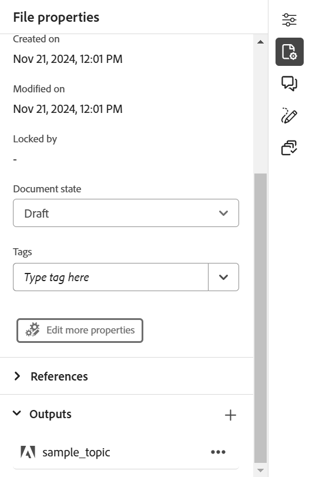

# Publication de pages Adobe Experience Manager Sites

La page Experience Manager Sites fait référence au contenu publié sur le site web de Adobe Experience Manager. Experience Manager Guides vous permet de publier une rubrique autonome sur une page Sites.

Cette fonctionnalité vous permet de publier une rubrique et ses éléments sans créer de plan DITA ni de paramètres prédéfinis de sortie. Vous pouvez facilement mettre à jour la rubrique, republier la page Sites et la réutiliser dans différentes pages web. Grâce à cette fonctionnalité, vous pouvez facilement publier des articles autonomes ou du contenu marketing.

Pour générer une page Sites, procédez comme suit :

1. Ouvrez la rubrique dans l’éditeur et sélectionnez **Propriétés du fichier** dans le panneau de droite.
1. Sélectionnez **Nouvelle sortie** icône dans la section **Sorties**.
1. Sélectionnez **Page Sites**.
1. Dans la boîte de dialogue **Générer une page Sites**, renseignez les informations suivantes :
   {width="500" align="left"}

   * **Chemin** : recherchez et sélectionnez le chemin d’accès du dossier dans lequel vous souhaitez publier la page Sites.
   * **Titre** : saisissez le titre de la page Sites. Par défaut, le titre est renseigné avec le titre de la rubrique. Vous pouvez le modifier. Ce titre est utilisé pour générer le nom de la page Sites.
   * **Nom** : saisissez le nom de la page Sites. Par défaut, le nom est renseigné avec le titre du topic et les caractères non autorisés tels que les espaces et les caractères spéciaux sont remplacés par &#39;_&#39;. Par exemple, *sample_sites_page*. Vous pouvez le modifier. Ce nom est utilisé pour générer l’URL de la page Sites.
   * **Modèle de page** : sélectionnez le modèle de page Sites pour créer votre page Sites. Vous pouvez afficher les modèles dans le dossier à l’emplacement sélectionné. Votre administrateur peut également charger des modèles personnalisés.

   * Vous pouvez également sélectionner différentes conditions pour publier le contenu. Sélectionnez l’une des options suivantes :

      * **Aucune** : sélectionnez cette option si vous ne souhaitez appliquer aucune condition sur la sortie publiée.
      * **A partir de DITAVAL** : sélectionnez le fichier DITAVAL afin de générer un contenu personnalisé. Vous pouvez sélectionner le fichier DITAVAL à l’aide de la boîte de dialogue de navigation ou en saisissant le chemin d’accès au fichier.
      * **Utilisation d&#39;attributs** : vous pouvez définir des attributs de condition dans vos rubriques DITA. Sélectionnez ensuite l’attribut de condition pour publier le contenu approprié.

     >[!NOTE]
     > 
     >Les conditions ne sont activées que si les attributs de condition sont définis dans la rubrique.

1. Sélectionnez **Générer** pour publier la page Sites.
1. Vous pouvez afficher la page Sites pour une rubrique sous la section **Sorties** dans la section **Propriétés du fichier**. Les pages Sites s’affichent en fonction de la date et de l’heure de leur publication, la plus récente étant la première.

   {width=300 align="left"}

   *Affichez la page Sites présente pour une rubrique et republiez-la.*

Une fois la page Sites publiée, vous pouvez également les utiliser sur n’importe quel site Adobe Experience Manager.

## Menu Options d’un Experience Manager Sites

Vous pouvez également effectuer les actions suivantes pour un Experience Manager Sites à partir du menu **Options** :

* **Générer** : republiez la page Sites pour la mettre à jour avec le contenu le plus récent de la rubrique DITA. Lorsque vous régénérez la sortie sans modifier le chemin, le nom, le titre, le modèle et les conditions, la page Sites est simplement mise à jour avec le contenu le plus récent.

* **Dupliquer** : permet de dupliquer une page Sites. Vous pouvez modifier le chemin d’accès, le nom, le titre et le modèle. Vous pouvez également sélectionner différentes conditions lorsque vous dupliquez une page Sites.

* **Supprimer** : permet de supprimer une page Sites de la liste des sorties. Une invite de confirmation s’affiche. Une fois que vous avez confirmé, la page Sites est supprimée de la liste **Sorties**. Cependant, la page Sites n’est pas supprimée définitivement.

* **Afficher** : affichez l’éditeur de page Sites. Vous pouvez également apporter des modifications et les enregistrer.
