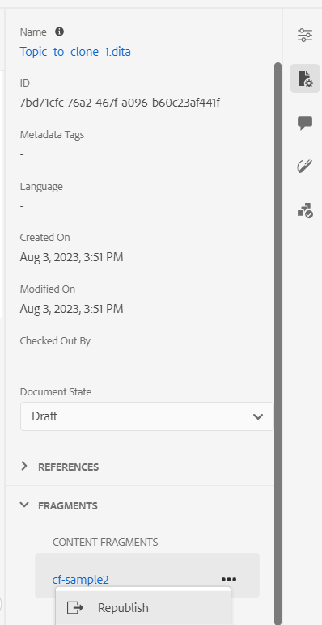

# Publication sur un fragment de contenu

Les fragments de contenu sont des éléments de contenu distincts dans AEM. Il s’agit de contenu structuré basé sur un modèle de contenu. Les fragments de contenu sont du contenu pur sans informations de conception ou de mise en page. Ils peuvent être créés et gérés indépendamment des canaux pris en charge par AEM. Les fragments de contenu sont modulaires, où le contenu est divisé en composants plus petits.

AEM Guides vous permet de publier une rubrique ou les éléments d’une rubrique dans un fragment de contenu. Vous pouvez créer un mappage basé sur JSON entre une rubrique et un modèle de fragment de contenu. Utilisez ce mappage pour publier une rubrique ou les éléments d’une rubrique sur un fragment de contenu. Vous pouvez ensuite utiliser des fragments de contenu sur n’importe quel site AEM ou extraire les détails via des API prises en charge par les fragments de contenu.

Pour créer un fragment de contenu, procédez comme suit :

1. Créez un [modèle de fragment de contenu](https://experienceleague.adobe.com/docs/experience-manager-65/assets/content-fragments/content-fragments-models.html?lang=fr) dans AEM Assets.
1. Créez un dossier dans lequel vous souhaitez enregistrer les fragments de contenu que vous créez en fonction du modèle de fragment de contenu. Par exemple, &quot;stock-content-fragments&quot;.
1. Modifiez les propriétés du dossier (par exemple, &quot;stock-content-fragments&quot;) et ajoutez le chemin du dossier, qui contient le modèle de fragment de contenu dans la configuration cloud.
Par exemple, ajoutez `/conf/we-retail` dans la configuration cloud. Cette configuration connecte tous les modèles de fragment de contenu au dossier .\
   {width="650" align="left"}
   *Ajoutez la configuration de cloud dans les propriétés du dossier pour la connecter aux modèles de fragment.*
1. Sélectionnez la rubrique que vous souhaitez publier dans le **Repository View**.
1. Dans la **Options** menu, sélectionnez **Publier sous** > **Fragment de contenu**.
1. Dans le **Publier en tant que fragment de contenu** , renseignez les informations suivantes :
   {width="500" align="left"}
   *Ajoutez les détails du chemin, du modèle et du mappage pour publier une rubrique ou ses éléments en tant que fragment de contenu. Vous pouvez remplacer un fragment de contenu existant.*

   * **Chemin**: recherchez et sélectionnez le chemin du dossier dans lequel vous souhaitez publier le fragment de contenu. Vous pouvez également sélectionner un fragment de contenu existant et le publier.
   * **Titre**: saisissez le titre du fragment de contenu.
   * **Nom**: saisissez le nom du fragment de contenu.
   * **Modèle**: sélectionnez le modèle de fragment de contenu que vous souhaitez utiliser pour créer votre fragment de contenu. Les modèles sont sélectionnés dans le dossier que vous avez configuré dans les services cloud.
   * **Mappage**: sélectionnez un mappage dans la liste déroulante. Il sélectionne les mappages de la variable *contentFragmentMapping.json* fichier .

     Selon votre configuration, votre administrateur peut ajouter les mappages dans la variable *contentFragmentMapping.json* fichier .

     

        
Services cloud

     En savoir plus sur la manière de procéder [créer un mappage entre une rubrique et un fragment de contenu ;](../cs-install-guide/conf-content-fragment-mapping-cs.md) dans le Guide d&#39;installation et de configuration de Cloud Service.
     

     

        
 Logiciel On-Premise

     En savoir plus sur la manière de procéder [créer un mappage entre une rubrique et un fragment de contenu ;](../install-guide/conf-content-fragment-mapping.md) dans le Guide d&#39;installation et de configuration On-premise.

     

   * Sélectionnez la variable **Remplacer** si votre fragment de contenu existe déjà et que vous souhaitez le remplacer. AEM Guides affiche une erreur si vous ne cochez pas la case et que votre fragment de contenu existe déjà.
1. Cliquez sur **Créer** pour publier le fragment de contenu.
1. Vous pouvez afficher les fragments de contenu d’une rubrique sous le **Fragments** dans la section **Propriétés du fichier**.

   {width="300" align="left"}

   *Afficher les fragments de contenu présents pour une rubrique et les republier.*

Vous pouvez également republier le fragment de contenu pour le mettre à jour avec le contenu le plus récent de la rubrique DITA.

Une fois les fragments de contenu publiés, vous pouvez les utiliser sur n’importe quel site AEM.
