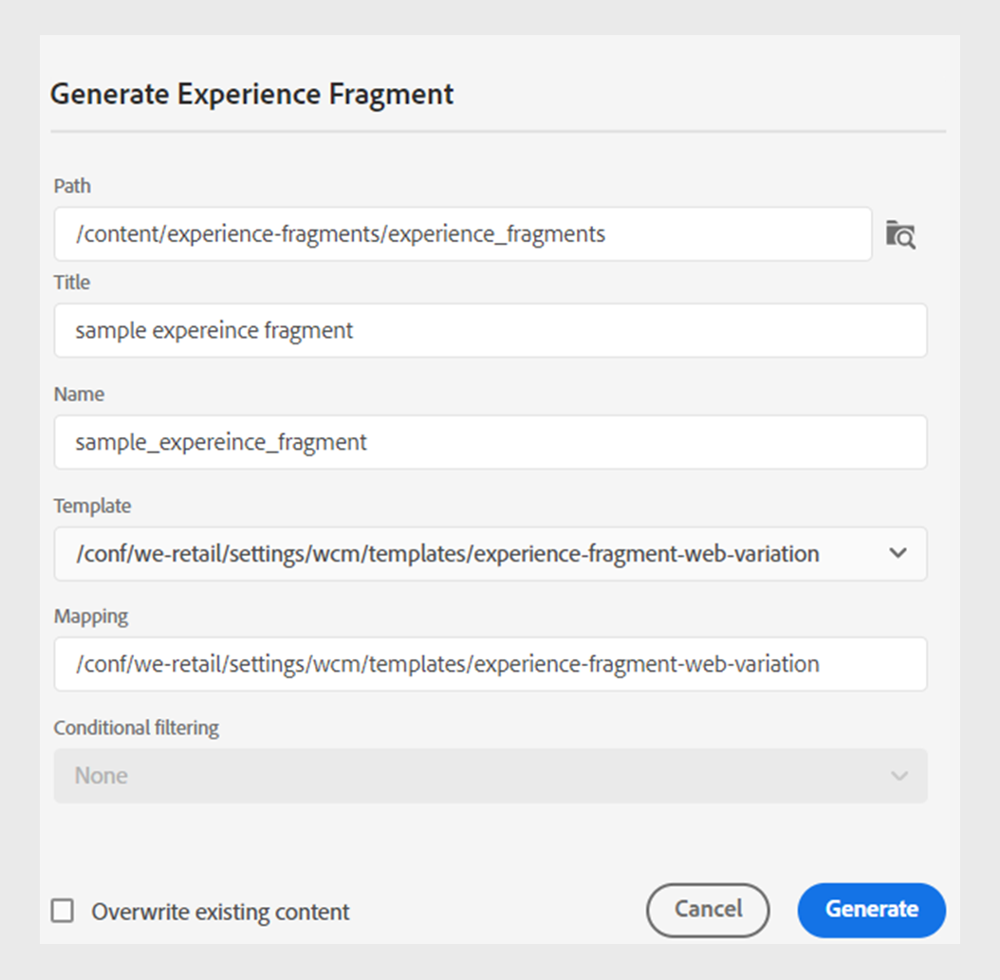

# Fragments d’expérience Publish

Les fragments d’expérience sont des éléments de contenu modulaire dans Adobe Experience Manager. Ces blocs de contenu sont basés sur des modèles et encapsulent le contenu et sa mise en page. Ces éléments de contenu réutilisables permettent aux créateurs de contenu d’assembler et de diffuser des expériences cohérentes et évolutives sur plusieurs canaux pris en charge par Experience Manager. Cette fonctionnalité vous permet de créer facilement des expériences marketing cohérentes, telles que des newsletters, des bannières de promotion et des témoignages client.

Experience Manager Guides vous permet de publier une rubrique ou ses éléments dans un fragment d’expérience. Vous pouvez créer un mappage JSON entre une rubrique et ses éléments dans un fragment d’expérience. Ensuite, utilisez le mappage pour publier une rubrique ou ses éléments sur un fragment d’expérience. Vous pouvez ensuite utiliser des fragments d’expérience dans n’importe quel site Experience Manager ou extraire les détails via des API prises en charge par les fragments d’expérience.

Pour générer un fragment d’expérience, procédez comme suit :

1. Créez un dossier dans les fragments d’expérience. Utilisez ce dossier pour enregistrer les fragments d’expérience que vous créez en fonction des modèles de fragments d’expérience. Par exemple, *sales-experience-fragments*.
1. Sélectionnez le dossier, puis l’icône **Propriétés** dans la partie supérieure.
1. Modifiez les propriétés du dossier (par exemple, *sales-experience-fragments*).

   * **Titre** : affichez ou modifiez le titre du dossier.

   * **Modèles autorisés** : contient la liste des modèles qui peuvent être ajoutés en tant que pages enfants du fragment d’expérience. Pour ajouter le modèle autorisé, spécifiez l’expression régulière pour récupérer les modèles requis dans le champ **Modèles autorisés**.
Par exemple :
     `/libs/cq/experience-fragments/components/experiencefragment/template`

     Si vous ne définissez pas de modèle autorisé pour un dossier, les modèles sont sélectionnés par défaut dans le dossier parent ou dans le dossier templates.
   * **Orderable** : permet de modifier l’ordre des ressources dans un dossier.
     {width="650" align="left"}
     *Ajoutez la configuration cloud dans les propriétés du dossier pour la connecter aux modèles de fragment.*
1. Pour générer un fragment d’expérience, sélectionnez **Nouvelle sortie**  à partir de la section **Sorties** dans les **Propriétés du fichier** d’une rubrique.
1. Sélectionnez **Fragment d’expérience**.\
   {width="300" align="left"}

   *Ajoutez un nouveau fragment d’expérience à partir des propriétés de fichier d’une rubrique*.

   >[!NOTE]
   >
   > Vous pouvez également publier un fragment d’expérience à partir de la **vue du référentiel**. Sélectionnez la rubrique que vous souhaitez publier en tant que fragment d’expérience. Ensuite, dans le menu **Options**, sélectionnez **Publish As** > **Fragment d’expérience**.

1. Dans la boîte de dialogue **Générer un fragment d’expérience**, renseignez les détails suivants :
   {width="500" align="left"}

   *Ajoutez les détails du chemin, du modèle et du mappage pour publier une rubrique ou ses éléments en tant que fragment d’expérience. Vous pouvez remplacer un fragment d’expérience existant.*

   * **Chemin** : recherchez et sélectionnez le chemin d’accès du dossier dans lequel vous souhaitez publier le fragment d’expérience. Vous pouvez également sélectionner un fragment d’expérience existant et le republier.
   * **Titre** : saisissez le titre du fragment d’expérience. Par défaut, le titre est renseigné avec le titre de la rubrique. Vous pouvez le modifier. Ce titre est utilisé pour générer le nom du fragment d’expérience.
   * **Nom** : saisissez le nom du fragment d’expérience. Par défaut, le nom est renseigné avec le titre de la rubrique et les espaces sont remplacés par &quot;_&quot;. Par exemple, *sample_experience_fragment*. Vous pouvez le modifier. Ce nom est utilisé pour générer l’URL du fragment d’expérience.
   * **Modèle** : sélectionnez le modèle de fragment d’expérience que vous souhaitez utiliser pour créer votre fragment d’expérience. Les modèles sont sélectionnés dans le dossier que vous avez configuré dans les propriétés.
   * **Mapping** : il sélectionne le mappage à partir du fichier *experienceFragmentMapping.json* et l’affiche.

     Votre administrateur peut ajouter les mappages dans le fichier *experienceFragmentMapping.json*.  Découvrez comment [créer un mappage entre une rubrique et un fragment d’expérience](../cs-install-guide/conf-experience-fragment-mapping-cs.md) dans le Guide d’installation et de configuration.

   * Vous pouvez également sélectionner différentes conditions pour publier le contenu.  Sélectionnez l’une des options suivantes :

      * **Aucun** : sélectionnez cette option si vous ne souhaitez appliquer aucune condition sur la sortie publiée.
      * **Utilisation de DITAVAL** : sélectionnez le fichier DITAVAL pour générer du contenu personnalisé. Vous pouvez sélectionner le fichier DITAVAL à l’aide de la boîte de dialogue de navigation ou en saisissant le chemin du fichier.
      * **Utilisation d’attributs** : vous pouvez définir des attributs de condition dans vos rubriques DITA. Sélectionnez ensuite l’attribut de condition pour publier le contenu correspondant.

     >[!NOTE]
     > 
     >Les conditions ne sont activées que si les attributs de condition sont définis dans la rubrique.

   * Cochez la case **Remplacer le contenu existant** si votre fragment d’expérience existe déjà et que vous souhaitez le remplacer. Experience Manager Guides affiche une erreur si vous ne cochez pas la case et que votre fragment d’expérience existe déjà.
1. Cliquez sur **Générer** pour publier le fragment d’expérience.
1. Vous pouvez afficher les fragments d’expérience pour une rubrique sous la section **Sorties** dans les **Propriétés du fichier**. Les fragments d’expérience s’affichent en fonction de la date et de l’heure de publication, la date la plus récente étant la première.

   {width=300 align=&quot;left&quot;}

   *Affichez les fragments d’expérience présents pour une rubrique et republiez-les.*

Une fois que vous avez publié les fragments d’expérience, vous pouvez également les utiliser sur n’importe quel site Adobe Experience Manager.

## Menu Options d’un fragment d’expérience

Vous pouvez également effectuer les actions suivantes pour un fragment d’expérience à partir du menu **Options** :

* **Générer** : republiez le fragment d’expérience pour le mettre à jour avec le contenu le plus récent de la rubrique DITA. Lorsque vous régénérez la sortie, vous ne pouvez pas modifier le chemin, le nom, le titre et le modèle du fragment d’expérience. Vous pouvez toutefois sélectionner différentes conditions lors de la régénération de la sortie.

* **Dupliquer** : dupliquez un fragment d’expérience. Vous pouvez modifier le chemin, le nom, le titre et le modèle. Vous pouvez également sélectionner différentes conditions lorsque vous dupliquez un fragment d’expérience.

* **Supprimer** : supprimez un fragment d’expérience de la liste des sorties. Une invite de confirmation s’affiche. Une fois que vous avez confirmé, le fragment d’expérience est supprimé de la liste **Sorties**. Toutefois, le fragment d’expérience n’est pas supprimé du dossier.

* **Afficher** : affichez l’éditeur de fragments d’expérience. Vous pouvez également apporter des modifications et les enregistrer.
