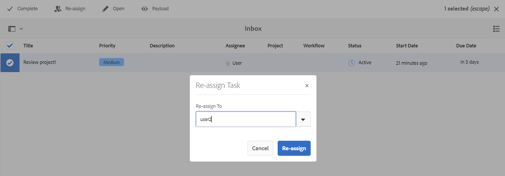

# Réaffecter une tâche de révision à l’aide d’une notification {#id21BNH03M0KS}

Vous pouvez réaffecter une tâche de révision qui vous a été assignée à un autre utilisateur qui a été ajouté au même projet de révision. La réaffectation de la tâche de révision peut être facilement effectuée à partir de la notification de révision diffusée dans votre boîte de réception. Cependant, en tant que réviseur ou réviseuse, vous pouvez réaffecter une tâche de révision uniquement à des utilisateurs individuels et non à des groupes d’utilisateurs ou utilisatrices à l’aide de la notification.

Notez que la réaffectation ne peut être effectuée que pour les tâches de réviseur et non pour les tâches de propriétaire.

1. **Tâche du réviseur** : toute tâche affectée à un réviseur pour une révision.
1. **Tâche du propriétaire** : tâche créée uniquement pour le propriétaire. Lorsque vous créez et affectez une tâche de révision à un réviseur, le propriétaire reçoit également une tâche de propriétaire portant le nom Fermer &lt; nom de la tâche de révision\> \(par exemple close-reviewtask1\), mais cette tâche de propriétaire ne peut être réaffectée à personne.

Effectuez les étapes suivantes pour réaffecter une tâche de révision à partir de la notification de boîte de réception :

1. Sélectionnez la notification de la tâche de révision dans la boîte de réception.
1. Sélectionnez l’icône **Réaffecter** en haut.
1. Sélectionnez le nom d’utilisateur auquel vous souhaitez réaffecter la tâche.

   >[!IMPORTANT]
   >
   > Le réviseur ou la réviseuse doit disposer des autorisations de réaffectation et doit faire partie du groupe utilisateur-administrateur.

   

1. Sélectionnez **Réaffecter**.

Une fois la tâche de révision réaffectée, la colonne Assignation affiche le nom du réviseur auquel la tâche a été réaffectée.

Le réviseur affecté reçoit une notification dans la boîte de réception pour la tâche de révision réaffectée.

**Rubrique parente :**&#x200B;[&#x200B; Présentation de la révision](review.md)
