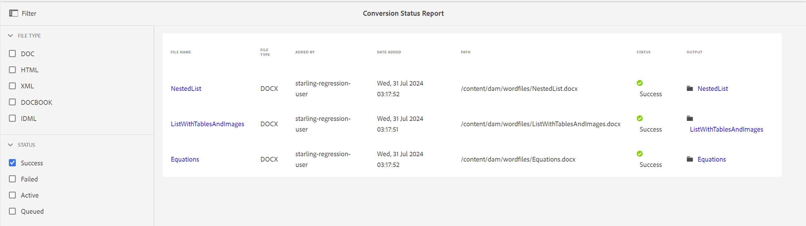

# Rapport sur le statut de la conversion {#id205BBA00WZZ}

Adobe Experience Manager Guides offre une fonctionnalité de conversion robuste pour convertir en DITA des documents de différents formats. Le rapport Statut de la conversion fournit une vue consolidée de toutes les tâches de conversion exécutées par Experience Manager Guides.

Pour afficher le rapport Statut de la conversion, procédez comme suit :

1. Sélectionnez le logo Adobe Experience Manager en haut et choisissez **Outils**.

1. Sélectionnez **Guides** dans la liste des outils.

1. Sélectionnez la mosaïque **Rapport de statut de la conversion**.

   Le rapport Statut de la conversion s’affiche pour toutes les tâches de conversion exécutées sur le système.

   

1. La page du rapport est divisée en deux parties :

   - **Filter:**

     Vous pouvez filtrer les données du rapport en fonction du type de fichier et du statut de conversion. Dans le type de fichier, vous pouvez choisir d’afficher les données de rapport pour les documents Word, HTML structurés, XML, DocBook et IDML. Dans le Statut, vous pouvez choisir d’afficher les données du rapport pour les tâches exécutées avec succès, en échec, actives ou en file d’attente.

     La capture d’écran suivante affiche les données de rapport pour les tâches de conversion dont le statut est défini sur Succès .

     

   - **Données du rapport :**

     Les données du rapport contiennent les colonnes suivantes :

      - **Nom de fichier** : nom du fichier source sur lequel le processus de conversion a été exécuté. Lorsque vous sélectionnez le lien Nom de fichier, vous accédez à l’emplacement du document source.

      - **Type de fichier** : type du document source, qui peut être Word, HTML structuré, XML, IDML et DocBook.

      - **Ajouté par** : nom de l’utilisateur qui a exécuté la tâche de conversion.

      - **Date ajoutée** : date d’exécution de la tâche. Sélectionner sur le lien Date d’ajout télécharge le fichier journal.

      - **Chemin** : chemin complet du document source.

      - **Statut** : statut des tâches de conversion : Succès, Échec, Actif ou En file d’attente.

      - **Output** : chemin d’accès du document converti. Lorsque vous sélectionnez le lien Sortie , vous accédez à l’emplacement où la sortie est enregistrée.

**Rubrique parente :**&#x200B;[&#x200B; Présentation des rapports](reports-intro.md)
