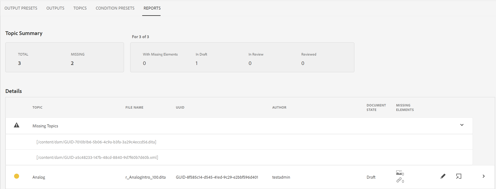

# Rapport DITA map à partir du tableau de bord du mappage {#id205BB800EEN}

Adobe Experience Manager Guides fournit à vos administrateurs les fonctionnalités de création de rapports nécessaires pour vérifier l’intégrité globale de la documentation avant qu’elle ne soit mise en ligne ou mise à la disposition des utilisateurs finaux. Le rapport de plan DITA du tableau de bord des plans de Experience Manager Guides fournit des informations précieuses telles que les rubriques manquantes, les rubriques comportant des éléments manquants, l&#39;UUID des rubriques référencées et des fichiers multimédias, ainsi que l&#39;état de révision de chaque rubrique. Un rapport détaillé individuel au niveau de la rubrique fournit également des informations relatives au contenu DITA, telles que des références de contenu, des images manquantes ou des références croisées.

>[!NOTE]
>
>Experience Manager Guides actualise ce rapport à chaque événement entraînant une modification de votre fichier de mappage ou lorsqu’une référence de votre fichier de rubrique est mise à jour.

Pour afficher le rapport DITA Map, procédez comme suit :

1. Dans l’interface utilisateur d’Assets, recherchez et sélectionnez le fichier de plan DITA pour lequel vous souhaitez afficher le rapport.

1. Sélectionnez **Rapports**.

   {width="800" align="left"}

   La page Rapports est divisée en deux parties :

   - **Résumé du sujet :**

     Répertorie le résumé général du fichier de mappage sélectionné. En regardant le Résumé, vous pouvez rapidement connaître le nombre total de sujets dans la carte, les sujets manquants, le nombre de sujets qui ont des éléments manquants, l&#39;état des sujets — En version préliminaire, En révision ou Révisé.

   - **Détails:**

     Lorsque vous sélectionnez une rubrique, un rapport détaillé de la rubrique sélectionnée s&#39;affiche.

     {width="800" align="left"}

     Les éléments mis en évidence sous **A**, **B**, **C** et **D** sont décrits ci-dessous :

      - **Rubrique** : titre de la rubrique spécifiée dans le plan DITA. Placez le pointeur de la souris sur le titre de la rubrique pour afficher le chemin d&#39;accès complet de la rubrique. En cas de problèmes dans la rubrique, tels que des références ou des images manquantes, un point rouge s&#39;affiche avant le titre de la rubrique.

      - **Nom de fichier** : nom du fichier.

      - **UUID** : identifiant universel unique \(UUID\) du fichier.

      - **Auteur** : dernier utilisateur à avoir travaillé sur ce sujet.

      - **État du document** : état actuel du document (brouillon, en cours de révision ou révisé).

      - **Éléments manquants** : indique le nombre d’images manquantes ou de références croisées rompues, le cas échéant.

      - **Rubriques manquantes \(B\)** : s’il existe des rubriques dont les références sont rompues, elles sont répertoriées sous la liste Rubriques manquantes .

      - **Ouvrir dans Framemaker \(C\)** : répertorie le nombre d’images manquantes ou de références croisées rompues, le cas échéant.

      - **Ouvrir dans l’éditeur \(D\)** : si vous sélectionnez cette icône, la rubrique s’ouvre dans l’éditeur.

   Les éléments mis en surbrillance sous **E** sont décrits ci-dessous :

   - **Multimédia** : le chemin des images utilisées dans la rubrique s’affiche avec son UUID. Si vous sélectionnez le chemin d’accès de l’image, l’image correspondante s’ouvre dans une fenêtre pop-up. Les liens d’image rompus sont répertoriés en rouge.

   - **Références de contenu** : le chemin d’accès du contenu référencé dans la rubrique s’affiche avec son UUID. Si vous sélectionnez le titre du contenu référencé, la rubrique correspondante est ouverte en mode Aperçu.

   - **Référence croisée** : le chemin d’accès du contenu référencé s’affiche avec son UUID. Si vous sélectionnez le titre du contenu référencé, la rubrique correspondante est ouverte en mode Aperçu. Les références croisées rompues sont répertoriées en rouge.

   - **Révision** : affiche le statut de la tâche de révision de la rubrique. Vous pouvez afficher le statut \(ouverture ou fermeture\), la date d’échéance et la personne désignée pour la rubrique en cours de révision. Si vous sélectionnez le lien de la rubrique, il ouvre la rubrique en mode Révision.

   - **Utilisé dans** : affiche une liste d’autres rubriques ou mappages dans lesquels la rubrique est utilisée. L&#39;UUID de toutes ces rubriques et cartes est également répertorié.

Outre le rapport de chaque rubrique, les administrateurs ont également accès à des informations telles que l&#39;historique de publication d&#39;un plan DITA. Pour plus d&#39;informations sur l&#39;historique des sorties générées, consultez la section [Afficher l&#39;état de la tâche de génération de sortie](generate-output-for-a-dita-map.md#viewing_output_history).

## Générer le CSV du rapport de plan DITA

Vous pouvez télécharger et exporter le fichier CSV d&#39;un rapport DITA map. Le fichier CSV contient le rapport détaillé de plan DITA.

Effectuez les étapes suivantes pour générer le fichier CSV d&#39;un rapport DITA map :

1. Sélectionnez **Générer le rapport** en haut à gauche pour générer le rapport DITA map.

   {width="800" align="left"}

1. Vous recevrez une notification une fois que le rapport sera prêt à être téléchargé. Sélectionnez **Télécharger** pour télécharger le fichier CSV du rapport généré.

   {width="550" align="left"}

   Vous pouvez également télécharger ultérieurement le fichier CSV du rapport généré à partir de la boîte de réception de notifications d’Experience Manager.

   Sélectionnez le rapport généré dans la boîte de réception pour le télécharger.

   {width="300" align="left"}

Une fois le rapport téléchargé dans la boîte de réception, vous pouvez également sélectionner le rapport et utiliser l’icône Ouvrir en haut pour ouvrir le rapport sélectionné.

**Rubrique parente :**[ Présentation des rapports](reports-intro.md)
