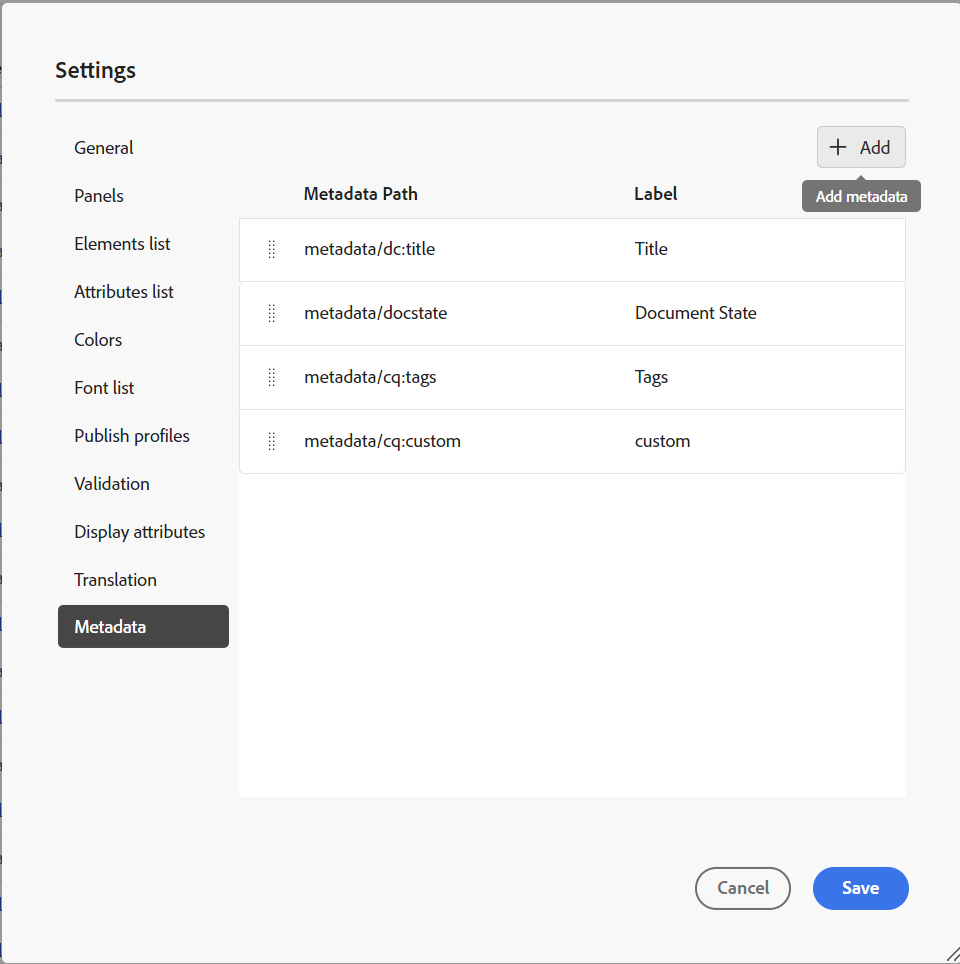
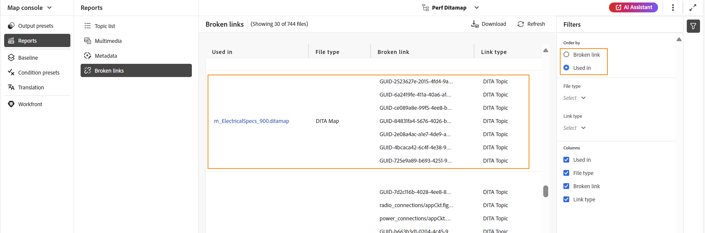

# Rapport DITA map à partir de la console Map {#id231HF0Z0NXA}

Adobe Experience Manager Guides est fourni avec une fonctionnalité de la console Map qui permet de vérifier l’intégrité globale de votre carte et de générer des rapports à son sujet.

Vous pouvez afficher la liste des rubriques, gérer les métadonnées de toutes les références, afficher la liste multimédia et corriger tous les liens rompus pour la carte actuelle à partir de l&#39;onglet **Rapports** dans la console Carte à laquelle vous pouvez accéder comme suit :

1. Dans le panneau **Référentiel**, ouvrez le fichier DITA map en mode Carte.

   >[!NOTE]
   >
   > Vous pouvez également ouvrir un plan DITA directement dans l&#39;onglet **Map console** à partir de la liste déroulante située dans la partie supérieure gauche de la page d&#39;accueil.

1. Sélectionnez l’icône **Ouvrir dans la console de mappage**.

   {width="600" align="left"}

1. Sélectionnez **Rapports** dans le panneau de gauche.

Vous pouvez localiser les quatre rapports à partir du panneau **Rapports**. Selon vos besoins, vous pouvez sélectionner l’un des rapports, comme illustré ici.

{align="left"}

Le panneau Rapports permet d’accéder à quatre types de rapports différents. Chaque rapport, ainsi que son accessibilité et ses fonctionnalités, sont expliqués en détail ci-dessous.

## Rapport Liste de sujets

Le rapport **Liste de rubriques** fournit des informations détaillées sur vos rubriques, telles que le type de référence, le statut du document et l’auteur.

Vous pouvez afficher le rapport de liste de rubriques d’une carte en procédant comme suit :

1. Sélectionnez **Liste de rubriques** dans le panneau Rapports. La liste des rubriques présentes dans le plan DITA s&#39;affiche.

   {align="left"}

1. Dans le panneau **Filtres** vous pouvez filtrer les rubriques en fonction du **Type de référence** \(direct ou indirect\), **État du document** \(par exemple, si vos rubriques sont à l’état Modifier, En cours de révision ou Révisé, elles sont répertoriées\) ou du **Auteur** de la rubrique.

   >[!NOTE]
   >
   > Tous les filtres fournissent une liste exhaustive des options présentes dans le système.

1. Vous pouvez également utiliser les options de filtrage de rubrique suivantes pour choisir d&#39;afficher les colonnes suivantes dans la liste :

   - **Titre** le titre de la rubrique est spécifié dans le plan DITA. Vous pouvez sélectionner la rubrique pour la modifier.
   - **Nom de fichier** Nom du fichier.
   - **UUID** Identifiant universel unique \(UUID\) du fichier.
   - **Emplacement du fichier** Chemin d’accès complet de la rubrique.
   - **Type de référence** type de référence : directe ou indirecte.
   - **État du document** État du topic.
   - **Auteur** Dernier utilisateur à avoir travaillé sur le sujet. La liste est paginée et se charge de manière asynchrone, affichant un ensemble limité d’utilisateurs à la fois et en récupérant d’autres au fur et à mesure que vous faites défiler ou naviguez. Cela améliore la vitesse de chargement et les performances globales, en particulier lorsque vous travaillez avec un grand nombre d’utilisateurs.
   - **Mappage parent** liste de tous les mappages où la rubrique est directement référencée.
   >[!NOTE]
   >
   > Sélectionnez **Actualiser** pour obtenir une nouvelle liste des rubriques et afficher les modifications apportées à votre fichier de mappage ou si une référence de votre fichier de rubrique est mise à jour.

1. Sélectionnez **Télécharger** pour télécharger l&#39;instantané de toutes les rubriques du plan DITA. La feuille Excel contient les colonnes sélectionnées et les rubriques filtrées dans la vue **Liste de rubriques**.

## Rapport de métadonnées

Le **rapport de métadonnées** fournit un rapport détaillé de vos références dans le plan DITA actuel, comme le type de référence, le statut du document, les balises, l&#39;emplacement du fichier, etc.

Vous pouvez afficher le rapport de métadonnées d’une carte en procédant comme suit :

1. Sélectionnez **Métadonnées** dans le panneau Rapports. La liste de toutes les références d’un mappage s’affiche avec ses métadonnées telles que les balises, l’état du document et les métadonnées personnalisées. Pour ajouter une nouvelle colonne de métadonnées personnalisée, reportez-vous à la section [Ajouter des colonnes de métadonnées personnalisées](#add-custom-metadata-columns).

   {align="left"}

1. Dans le panneau **Filtres**, vous pouvez filtrer les rubriques en fonction de **État du document** \(par exemple, si vos rubriques sont à l’état Modifier, En cours de révision ou Révisé, elles sont répertoriées\), **Références** \(direct ou indirect\), **Type de fichier** \(Carte, Rubrique, Document, Image, Vidéo et autres\) de la référence.

   >[!NOTE]
   >
   > Tous les filtres fournissent une liste exhaustive des options présentes dans le système.

1. Vous pouvez également choisir de n’afficher que les **Fichiers sans balises** ou de choisir des balises spécifiques dans le filtre **Balises** pour afficher les fichiers qui leur sont associés.
1. Vous pouvez également utiliser les options de filtrage de rubrique suivantes pour choisir d’afficher les colonnes suivantes dans la liste de métadonnées :
   - **Titre** \(sélectionné par défaut\) Le titre du fichier référencé est spécifié dans le plan DITA. Vous pouvez sélectionner le fichier pour le modifier.

     >[!NOTE]
     >
     > Une icône extraite s’affiche également à côté du titre d’un fichier extrait. Vous pouvez pointer sur l’icône pour afficher le nom de l’utilisateur.

   - **Nom de fichier** Nom du fichier.
   - **Emplacement du fichier** Chemin d’accès complet du fichier.
   - **UUID** Identifiant universel unique \(UUID\) du fichier.
   - **Balises** \(sélectionné par défaut\) Balises appliquées au fichier.

     >[!NOTE]
     >
     > Par défaut, vous pouvez afficher deux balises pour un fichier. Pour afficher plus de balises, sélectionnez **Afficher plus**. Sélectionnez **Afficher moins** pour réduire à nouveau la liste.

   - **État du document** \(sélectionné par défaut\) État actuel du fichier de référence.
   - **Type de référence** Type de référence : directe ou indirecte
   - **Type de fichier** \(sélectionné par défaut\) Type du fichier source. Les options disponibles sont Carte, Rubrique et Image.
   - **Verrouillé par** Utilisateur qui a verrouillé le fichier.

1. Sélectionnez **Télécharger** pour télécharger l&#39;instantané de toutes les références dans le plan DITA. La feuille Excel contient les colonnes sélectionnées et les références filtrées dans la vue **Métadonnées**.

### Gestion des métadonnées en bloc à partir du rapport de métadonnées

Vous pouvez appliquer des balises sur une rubrique individuelle ou utiliser la fonction de balisage en bloc pour appliquer plusieurs balises sur plusieurs rubriques, un plan DITA ou sur un sous-plan. Vous pouvez également modifier l&#39;état du document de toutes les rubriques sélectionnées pour passer à l&#39;état suivant du document commun.

### Mettre à jour les métadonnées

Pour mettre à jour les métadonnées, procédez comme suit :

1. Pour mettre à jour les métadonnées, sélectionnez les fichiers à mettre à jour. Vous pouvez sélectionner les fichiers qui s’affichent dans le panneau Métadonnées en cochant la case située en regard de **Titre**. Si vous souhaitez sélectionner tous les enregistrements, utilisez l&#39;onglet **Tout sélectionner** au-dessus de la barre de titre comme illustré ci-dessous.

   >[!NOTE]
   >
   > Vous ne pouvez pas sélectionner de fichiers extraits. Une icône extraite s’affiche également à côté du titre d’un fichier extrait. Vous pouvez pointer sur l’icône pour afficher le nom de l’utilisateur.

   {align="left"}

1. Sélectionnez **Gérer** dans la partie supérieure.

   {width="350" align="left"}

1. Si vous souhaitez ajouter de nouvelles balises, sélectionnez-les dans la liste déroulante pour les appliquer à toutes les rubriques sélectionnées. Vous pouvez également supprimer n’importe quelle balise en sélectionnant la croix située à proximité de la balise.

   >[!NOTE]
   >
   > Les balises courantes appliquées à toutes les rubriques sélectionnées sont répertoriées.

1. Sélectionnez un nouvel état de document si vous souhaitez modifier l&#39;état de document de toutes les références sélectionnées. La liste déroulante affiche l’état commun possible pour toutes les rubriques sélectionnées. Par exemple, si l’état actuel de vos rubriques est En cours de révision, vous pouvez afficher l’état Brouillon, Approuvé ou Révisé.
1. Sélectionnez **Mise à jour** pour mettre à jour les métadonnées. Un message de confirmation s’affiche pour les métadonnées, indiquant si elles ont été mises à jour avec succès ou si des mises à jour ont échoué. Vous pouvez également sélectionner **Télécharger le rapport** pour télécharger l’instantané du rapport. Cet instantané contient les détails du statut mis à jour pour les références sélectionnées.

### Ajout de colonnes de métadonnées personnalisées

Cette fonctionnalité vous permet d’ajouter des colonnes de métadonnées personnalisées en fonction des besoins, qui sont ensuite affichées dans les rapports de métadonnées. Elle offre également une meilleure flexibilité dans la création de rapports de métadonnées. Pour ajouter une nouvelle colonne de métadonnées personnalisée, procédez comme suit :

1. Pour ajouter une colonne de métadonnées personnalisée, sélectionnez **Paramètres Workspace** (sous la forme **Paramètres** pour **On-Prem**) à partir des trois points situés dans le coin supérieur droit de la page des métadonnées.

   {width="600" align="left"}

1. Sélectionnez **Métadonnées** dans le panneau gauche du pop-up qui s’affiche.
1. Ajoutez un nouveau champ de métadonnées personnalisé selon vos besoins à l’aide de l’onglet **Ajouter**.

   {width="600" align="left"}

1. Spécifiez un chemin d’accès aux métadonnées spécifique et un titre approprié pour celui-ci que vous souhaitez ajouter dans les colonnes du rapport de métadonnées. Par exemple, une métadonnée personnalisée avec la langue du titre et un chemin d’accès spécifique est ajoutée.

   >[!NOTE]
   >
   > Si vous souhaitez supprimer une colonne de métadonnées spécifique, vous pouvez la supprimer de la liste affichée. De plus, vous pouvez modifier le **Libellé** pour modifier le titre affiché de la colonne.

   {width="600" align="left"}

1. Sélectionnez **Enregistrer** et **Actualiser** dans la vue Métadonnées. Une nouvelle colonne personnalisée **Langue** est ajoutée dans la liste Colonnes du panneau Filtre.

   >[!NOTE]
   >
   > L’ajout d’une nouvelle colonne de métadonnées est également reflété dans le panneau **Historique des versions** de l’éditeur. Pour plus d’informations, voir **[Métadonnées](web-editor-features.md)**.

   {width="600" align="left"}

De même, vous pouvez suivre les étapes mentionnées ci-dessus pour ajouter de nouveaux champs de métadonnées personnalisés en fonction de vos besoins, nécessaires dans les rapports de métadonnées.

## Rapport multimédia

Le rapport **Multimédia** fournit des informations détaillées sur le contenu multimédia utilisé dans votre carte, telles que le titre, le type \(audio, vidéo et images\), les fichiers dans lesquels le contenu multimédia est utilisé et le type de référence des fichiers dans lesquels il a été utilisé. Vous pouvez également afficher l’UUID et l’emplacement du fichier multimédia dans le référentiel. Pour afficher un rapport multimédia, procédez comme suit :

1. Sélectionnez **Multimédia** dans le panneau Rapport. La liste des fichiers multimédias présents dans le plan DITA s&#39;affiche.
1. Dans le panneau **Filtres**, vous pouvez classer la liste par multimédia ou par les noms des éléments utilisés dans les références.

   - Lorsque vous triez par **Multimédia**, le nom du contenu multimédia est affiché dans la première colonne, puis les noms de toutes les références dans lesquelles il a été utilisé sont affichés dans une autre colonne de la même ligne. Par exemple, la capture d’écran suivante montre le fichier multimédia testSong.mp3 dans la première colonne et deux références dans lesquelles il est utilisé sont affichées dans la troisième colonne de la même ligne.

     {width="650" align="left"}

   - Si vous triez par colonne **Utilisé dans**, vous verrez la vue transposée dans laquelle les noms des références dans lesquelles le contenu multimédia a été utilisé sont répertoriés dans la première colonne tandis que les noms du contenu multimédia sont répertoriés dans une autre colonne sur des lignes distinctes. Par exemple, la capture d’écran suivante montre les noms de deux références \(testing_indirect et Video content Topic\) dans la première colonne et le fichier multimédia testSong.mp3 est affiché dans la troisième colonne sur deux lignes distinctes.

     {width="650" align="left"}

1. Vous pouvez filtrer vos fichiers multimédias en fonction des **Type multimédia** et **Type de référence**. La liste des fichiers multimédias s’affiche en fonction de votre choix dans la liste déroulante. Par exemple, vous pouvez choisir d&#39;afficher uniquement les références audio dans votre plan DITA et un fichier affiche uniquement les références audio utilisées.

1. Vous pouvez également utiliser les options de filtrage suivantes pour choisir d&#39;afficher les colonnes suivantes dans la liste :

   - **Multimédia** \(sélectionné par défaut\) Le titre du fichier multimédia est spécifié dans le plan DITA. Vous pouvez sélectionner le fichier multimédia pour le modifier.
   - **Emplacement multimédia** Chemin d’accès complet du fichier multimédia.
   - **UUID multimédia** Identifiant universel unique \(UUID\) du fichier.
   - **Type multimédia** \(sélectionné par défaut\) Type du fichier multimédia. Les options disponibles sont Audio, Vidéo ou Image.
   - **Utilisé dans** \(sélectionné par défaut\) Références dans lesquelles le contenu multimédia a été utilisé. Vous pouvez sélectionner la référence pour la modifier.
   - **Type de référence** \(sélectionné par défaut\) Le type de référence - direct ou indirect.
   >[!NOTE]
   >
   > Sélectionnez **Actualiser** pour obtenir une nouvelle liste des fichiers multimédias et afficher les modifications apportées à votre fichier de carte ou si des fichiers multimédias de votre carte DITA sont mis à jour.

1. Sélectionnez **Télécharger** pour télécharger l&#39;instantané de tous les fichiers multimédias dans le plan DITA. La feuille Excel contient les colonnes sélectionnées et le contenu multimédia filtré dans la vue **Multimédia**.

## Rapport Liens rompus

Le **Liens rompus** est un rapport utile qui vous fournit les détails des liens rompus présents sur votre carte actuelle. Vous pouvez afficher les liens rompus, qui peuvent être destinés aux rubriques DITA, aux références de fichiers multimédias, aux références de clés de contenu, etc. Vous avez aussi la capacité de les réparer ici même.
Le rapport fournit des informations détaillées telles que le lien rompu, le type de lien, les fichiers dans lesquels la référence est utilisée et le type de fichiers dans lesquels elles ont été utilisées.
Vous pouvez afficher le rapport pour les liens rompus en procédant comme suit :

1. Sélectionnez **Liens rompus** dans le panneau Rapports . La liste des liens ou références rompus présents dans le plan DITA s&#39;affiche.
1. Dans le panneau **Filtres** vous pouvez classer la liste par liens ou par noms d’utilisateurs dans les références.

   - Lorsque vous triez par **Lien rompu**, les chemins d’accès des liens rompus sont affichés dans la première colonne, puis les noms de toutes les références dans lesquelles ils ont été utilisés sont affichés dans une autre colonne sur des lignes distinctes. Si le même lien rompu est utilisé dans plusieurs fichiers, ils sont affichés sur une ligne et présentés comme regroupés ou sous-lignes. Par exemple, la capture d’écran suivante montre deux liens rompus dans la première colonne et la référence dans laquelle ils sont utilisés, `m_ElectricalSpecs_900.ditamap` s’affiche dans la troisième colonne sur deux lignes distinctes.

   {align="left"}

   - Si vous triez par colonne **Utilisé dans**, vous verrez la vue transposée dans laquelle les noms des références dans lesquelles les liens rompus ont été utilisés sont répertoriés dans la première colonne tandis que les liens rompus sont répertoriés dans une autre colonne de la même ligne. Par exemple, la capture d’écran suivante montre la référence (dans laquelle le lien rompu est utilisé) `m_ElectricalSpecs_900.ditamap` dans la première colonne et les liens rompus sont affichés dans la troisième colonne de la même ligne.

   {align="left"}

1. Vous pouvez filtrer les liens rompus en fonction du **Type de fichier** et du **Type de lien**. La liste des liens rompus s’affiche en fonction de votre sélection dans la liste déroulante. Par exemple, vous pouvez choisir d&#39;afficher uniquement les références de contenu dans votre plan DITA et un fichier affiche uniquement les références de contenu rompues qui y sont utilisées.

   La rubrique DITA, le plan DITA, la référence de fichier, la référence de clé, la référence de contenu, la référence de clé de contenu, la référence d&#39;image, la référence de fichier multimédia et la référence de clé multimédia sont des valeurs disponibles pour la liste déroulante **Type de lien** et la rubrique DITA, le plan DITA, le document, l&#39;image, la vidéo, l&#39;audio et autres sont des valeurs disponibles pour la liste déroulante **Type de fichier**.
1. Vous pouvez également utiliser les options de filtrage suivantes pour choisir d&#39;afficher les colonnes suivantes dans la liste :

   - **Lien rompu** (sélectionné par défaut) Le chemin d&#39;accès du lien rompu est spécifié dans le plan DITA.

   - **Type de lien** (sélectionné par défaut) Type des liens. Les options disponibles sont Rubrique DITA, Plan DITA, Référence de fichier, Référence de clé, Référence de contenu, Référence de clé de contenu, Référence d&#39;image, Référence de fichier multimédia et Référence de clé multimédia.

   - **Utilisé dans** (sélectionné par défaut) Références dans lesquelles le lien rompu a été utilisé. Vous pouvez sélectionner la référence pour l’afficher en mode création.

   - **Type de fichier** (sélectionné par défaut) Type de référence - Rubrique DITA, Plan DITA, Document, Image, Vidéo, Audio et Autres.

   Sélectionnez **Actualiser** pour obtenir une nouvelle liste des liens rompus et afficher les modifications apportées au fichier de mappage ou si des liens rompus dans votre mappage DITA sont mis à jour.
1. Vous pouvez sélectionner l’icône **Corriger le lien** () pour réparer le lien rompu.

   >[!NOTE]
   >
   > Pointez sur le chemin du lien rompu sous la colonne Lien rompu pour afficher l’icône Corriger le lien ().

   Vous pouvez corriger un lien dans les deux vues lorsque vous avez trié par **Liens rompus** ou par **Utilisé dans**.

   >[!NOTE]
   >
   > Lorsque vous corrigez un lien rompu alors que vous l’avez ordonné par Liens rompus, le lien est corrigé dans tous les fichiers dans lesquels il est utilisé (qui sont regroupés dans une seule ligne).

1. Vous devez mettre à jour les détails de référence requis dans la boîte de dialogue **Mettre à jour le lien**. Les détails requis dans la boîte de dialogue **Mettre à jour le lien** dépendent du type de référence.\
   Une fois que vous avez corrigé un lien, il ne s’affiche pas sous la liste des liens rompus. Au lieu de cela, vous pouvez l’afficher sous Liste de rubriques ou Métadonnées.

1. Sélectionnez **Télécharger** pour télécharger l&#39;instantané de tous les liens rompus dans le plan DITA. Le fichier Excel contient les colonnes sélectionnées et les liens rompus filtrés dans la vue Liens rompus.

**Rubrique parente :**&#x200B;[&#x200B; Présentation des rapports](reports-intro.md)
