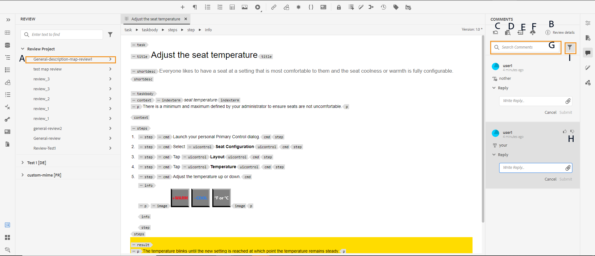

# Commentaires sur la révision des adresses {#id2056B0X0KBI}

En tant qu’auteur, vous pouvez traiter des commentaires dans une rubrique à l’aide de l’éditeur web. Les commentaires sont chargés en fonction de la tâche de révision sélectionnée dans le panneau Révision. Pour plus d’informations, voir la **Réviser** panel  description des fonctionnalités dans la section [Panneau gauche](../user-guide/web-editor-features.md#id2051EA0M0HS) .

Les sections suivantes décrivent les méthodes de modification des commentaires dans l’éditeur web.

Un auteur peut adresser des commentaires dans un document à partir de l’éditeur Web. Des indicateurs visuels sont fournis pour indiquer si les commentaires insérés \(texte\), supprimés ou mis en surbrillance. Le type de commentaire est également mentionné en haut de chaque entrée de commentaire.

>[!NOTE]
>
> Lors de l’examen des commentaires de révision \(pour un document de révision actif\), assurez-vous que vous n’ouvrez pas la rubrique de révision dans plusieurs onglets avec l’affichage complet des balises activé, ne permutez pas entre les modes Auteur et Source.

{width="800" align="left"}

En mode Éditeur Web, le panneau de droite contient les icônes Révision et modifications suivies . Le panneau Révision affiche tous les commentaires effectués dans votre document par les réviseurs. La variable **Modifications suivies** affiche l’état de tous les commentaires insérés et supprimés dans votre document.

- **A**: sélectionnez une tâche de révision pour afficher les commentaires de révision. Si votre rubrique a été partagée pour révision dans plusieurs tâches de révision, ces tâches sont répertoriées dans cette liste déroulante.

  Lorsque vous sélectionnez une tâche de révision dans la liste, vous pouvez voir les commentaires effectués par les réviseurs dans cette tâche. Vous pouvez traiter les commentaires de révision indépendamment dans les tâches, ce qui signifie que toute mise à jour d’un commentaire n’est visible que par les réviseurs de cette tâche respective.

- **B :**  Sélectionner **Détails de la révision**  dans le **Commentaires** pour afficher plus d’informations sur la tâche de révision :

   - **Nom**: nom de la tâche de révision .
   - **Version de révision**: affiche la version associée à la tâche de révision sélectionnée. Cela vous permet de conserver un suivi de la version que vous avez partagée pour révision.
   - **État**: état actuel de la tâche de révision.

  >[!NOTE]
  >
  > Si le mappage racine de votre tâche de révision est différent du mappage racine de création, il affiche les informations le concernant pour indiquer que la création et le mappage racine de révision ne correspondent pas.

- **C**: si vous avez mis à jour votre rubrique après avoir lancé la révision, cliquez sur l’icône Rétablir la rubrique pour réviser la version pour rétablir votre copie de travail sur la version qui a été partagée pour révision. Cela vous permet d’incorporer plus facilement les commentaires de révision directement dans la version qui a été partagée pour révision. Après avoir incorporé le commentaire, vous pouvez enregistrer les modifications dans la version rétablie ou créer une nouvelle révision de votre rubrique. Si vous choisissez de créer une révision de votre rubrique, une nouvelle branche est créée à partir de la version de la rubrique qui a été partagée pour révision. Par exemple, si vous avez partagé la version `1.2` d’une rubrique à réviser pendant que la version actuelle de création est `1.3`, vous pouvez ensuite utiliser cette icône pour revenir à la version `1.2` pour incorporer des commentaires de révision. Si vous choisissez de créer une révision après avoir incorporé des modifications à la version `1.2`, puis une nouvelle branche avec une version `1.2.0` est créé pour la rubrique.

  En règle générale, après avoir intégré les commentaires de révision, vous souhaitez fusionner les modifications de la dernière version de la rubrique. Pour ce faire, utilisez la méthode [Fusion](web-editor-features.md#id205DF04E0HS) pour obtenir toutes les mises à jour effectuées après le partage de la rubrique en vue de la révision.

- **D**: ouvrez la vue côte à côte pour afficher la version commentée de la rubrique. Comme le montre la capture d’écran ci-dessus, la section la plus à gauche est la dernière version de la rubrique dans laquelle vous pouvez apporter des modifications. La section suivante est la version commentée de la rubrique. Lorsque vous naviguez entre les commentaires de la rubrique, le mode latéral change et affiche cette version de la rubrique sur laquelle le commentaire a été effectué. Chaque commentaire du panneau des commentaires est lié au texte correspondant dans cette section. Il permet d’identifier le texte commenté. Les commentaires sont affichés dans l’ordre du texte commenté dans le document.

  Vous pouvez voir le numéro de version en haut de la vue latérale. Cliquez de nouveau sur cette icône pour masquer la version commentée de la rubrique.

- E : Importez directement les commentaires \(ou Barré\) insérés et supprimés dans la rubrique. Après avoir cliqué sur l’icône Importer , toutes les insertions et suppressions de texte s’affichent dans la copie de travail de la rubrique. Maintenant, il y a deux façons d&#39;accepter ou de rejeter les commentaires.

  Si vous souhaitez incorporer la modification suggérée \(insertion ou suppression\) une par une, il vous suffit de cliquer avec le bouton droit sur le commentaire dans le contenu et de sélectionner Accepter la modification ou Rejeter la modification. Selon votre choix, le commentaire est accepté ou rejeté. En cas de commentaire accepté, le contenu est ajouté dans le contenu ; en cas de rejet, il est supprimé du contenu. En outre, l’état du commentaire est modifié dans le panneau Révision.

  {width="800" align="left"}

  Vous pouvez également utiliser la fonction de révision dans le panneau de droite pour accepter ou refuser des commentaires. Le fait de cliquer sur un commentaire met en surbrillance ce commentaire dans le document.

  {width="800" align="left"}

  >[!IMPORTANT]
  >
  > La fonction d’importation des commentaires fonctionne uniquement sur les documents qui n’ont pas été modifiés depuis qu’ils ont été partagés pour révision. Si vous avez apporté des modifications après l’envoi du document pour révision, vous recevrez une alerte pour **Importation forcée** commentaires dans votre document. Toutefois, cela entraînera la perte de toutes les mises à jour que vous avez effectuées dans votre document. La variable **Importation forcée** alerte s’affiche également si le document est créé à l’extérieur, puis partagé en vue de la révision. Vous pouvez ajouter les commentaires.

  Lorsque vous acceptez ou rejetez un commentaire, il est supprimé de la liste Modifications suivies . Cela permet également d’indiquer le nombre de commentaires à prendre en compte dans le document.

- **F**: dans le menu Plus d’options, téléchargez toutes les pièces jointes disponibles dans la rubrique de révision.
- **G**: recherchez un texte dans les commentaires.
- **h**: acceptez ou rejetez un commentaire.

- **I**: appliquez un filtre sur les commentaires. Vous pouvez filtrer les commentaires pour les afficher en fonction du type de révision \(tous, mis en surbrillance, supprimé, inséré ou pense-bête\), du statut de la révision \(tous, acceptés, rejetés ou aucun\), des réviseurs \(tous ou certains réviseurs\(s\)\) ou des versions de la rubrique.

**Rubrique parente :**[ Révision de rubriques ou de mappages](review.md)
