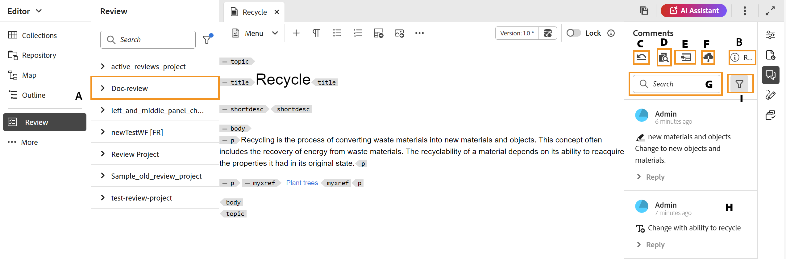

# Commentaires de révision d’adresse {#id2056B0X0KBI}

En tant qu’auteur, vous pouvez ajouter des commentaires dans une rubrique à l’aide de l’éditeur web. Les commentaires sont chargés en fonction de la tâche de révision sélectionnée dans le panneau de révision. Pour plus d’informations, consultez la description des fonctionnalités du panneau **Révision**  dans la section [Panneau de gauche](../user-guide/web-editor-features.md#id2051EA0M0HS).

Les sections suivantes décrivent les méthodes d’ajout de commentaires dans l’éditeur web.

Un auteur peut adresser des commentaires dans un document à partir de l’éditeur web. Des indicateurs visuels sont fournis pour indiquer si les commentaires insérés \(text\), supprimés ou mis en surbrillance. En outre, le type de commentaire est mentionné en haut de chaque entrée de commentaire.

>[!NOTE]
>
> Lorsque vous traitez des commentaires de révision \(pour un document de révision actif\), assurez-vous de ne pas ouvrir la rubrique de révision dans plusieurs onglets avec la vue complète des balises activée et de ne pas basculer entre les modes d’affichage Auteur et Source.

{align="left"}

En mode Éditeur web, le panneau de droite contient les icônes Révision et Suivi des modifications . Le panneau Révision affiche tous les commentaires formulés par les réviseurs dans votre document. Le panneau **Suivi des modifications** affiche le statut de tous les commentaires insérés et supprimés dans votre document.

- **A** : sélectionnez une tâche de révision pour afficher les commentaires de révision. Si votre rubrique a été partagée pour révision dans plusieurs tâches de révision, vous verrez ces tâches répertoriées dans cette liste déroulante.

  Lorsque vous sélectionnez une tâche de révision dans la liste, vous avez la possibilité d’afficher les commentaires formulés par les réviseurs et réviseuses au cours de cette tâche. Vous pouvez traiter les commentaires de révision indépendamment dans les tâches, ce qui signifie que toute mise à jour d’un commentaire n’est visible que par les réviseurs et réviseuses de cette tâche respective.

- **B :** sélectionnez **Détails de la révision**  dans le panneau **Commentaires** pour afficher plus d’informations sur la tâche de révision :

   - **Nom** : nom de la tâche de révision .
   - **Version de révision** : affiche la version associée à la tâche de révision sélectionnée. Cela vous permet de conserver une trace de la version que vous avez partagée pour révision
   - **Statut** : statut actuel de la tâche de révision.

  >[!NOTE]
  >
  > Si la carte racine de votre tâche de révision est différente de la carte racine de création, elle affiche les informations s’y rapportant pour indiquer que la carte racine de création et la carte racine de révision ne correspondent pas.

- **C** : si vous avez mis à jour votre rubrique après avoir lancé la révision, le fait de sélectionner l’icône Rétablir la rubrique en version de révision rétablit la version de travail de votre copie de travail qui a été partagée pour la révision. Il vous est ainsi plus facile d’incorporer les commentaires de révision directement dans la version qui a été partagée pour la révision. Après avoir incorporé les commentaires, vous pouvez enregistrer les modifications dans la version rétablie ou créer une nouvelle révision de votre rubrique. Si vous choisissez de créer une nouvelle révision de votre rubrique, une nouvelle branche est créée à partir de la version de rubrique qui a été partagée pour révision. Par exemple, si vous avez partagé la version `1.2` d’une rubrique pour révision alors que la version de création actuelle est `1.3`, vous pouvez utiliser cette icône pour revenir à la version `1.2` pour incorporer les commentaires de révision. Si vous choisissez de créer une révision après avoir incorporé des modifications dans la version `1.2`, une nouvelle branche avec la version `1.2.0` est créée pour la rubrique.

  En règle générale, après avoir incorporé les commentaires de révision, vous souhaitez fusionner les modifications de la dernière version de la rubrique. Pour ce faire, utilisez la fonctionnalité [Fusion](web-editor-features.md#id205DF04E0HS) pour que toutes les mises à jour soient effectuées après le partage de la rubrique pour révision.

- **D** : ouvrez la vue côte à côte pour afficher la version commentée de la rubrique. Comme illustré dans la capture d’écran ci-dessus, la section la plus à gauche est la dernière version de la rubrique dans laquelle vous pouvez apporter des modifications. La section suivante est la version commentée de la rubrique. Lorsque vous naviguez entre les commentaires dans la rubrique, la vue latérale change et affiche cette version de la rubrique sur laquelle le commentaire a été fait. Chaque commentaire du panneau de commentaires est lié au texte correspondant dans cette section. Cela vous permet d’identifier le texte commenté. Les commentaires s’affichent dans l’ordre du texte commenté dans le document.

  Vous pouvez afficher le numéro de version en haut de la vue latérale. Si vous sélectionnez à nouveau cette icône, la version commentée de la rubrique est masquée.

- E : importez directement les commentaires \(ou Barré\) insérés et supprimés dans la rubrique. Après avoir sélectionné l’icône Importer , toutes les insertions et suppressions de texte sont affichées dans la copie de travail de la rubrique. Il existe désormais deux manières d’accepter ou de rejeter des commentaires.

  Si vous souhaitez incorporer la modification suggérée \(insertion ou suppression\) une par une, il vous suffit de cliquer avec le bouton droit de la souris sur le commentaire dans le contenu et de sélectionner Accepter la modification ou Rejeter la modification. Selon votre sélection, le commentaire est accepté ou rejeté. En cas de commentaire accepté, le contenu est ajouté au contenu ; et en cas de rejet, il est supprimé du contenu. En outre, le statut du commentaire est modifié dans le panneau de révision.

  {align="left"}

  Vous pouvez également utiliser le panneau Suivi des modifications pour accepter ou rejeter des commentaires. La sélection d’un commentaire le met en surbrillance dans le document.

  {align="left"}

  >[!IMPORTANT]
  >
  > La fonction Importer les commentaires fonctionne uniquement sur les documents qui n’ont pas été modifiés depuis qu’ils ont été partagés pour révision. Si vous avez apporté une modification après l’envoi du document pour révision, vous recevrez une alerte pour **Forcer l’importation** des commentaires dans votre document. Toutefois, cela entraînera la perte de toutes les mises à jour que vous avez apportées à votre document. L’alerte **Forcer l’importation** s’affiche également si le document est créé en dehors d’puis partagé pour révision. Vous pouvez continuer et importer les commentaires.

  Lorsque vous acceptez ou refusez un commentaire, il est supprimé de la liste des modifications suivies. Cela sert également d’indicateur du nombre de commentaires à prendre en compte dans le document.

- **F** : dans le menu Plus d’options, téléchargez toutes les pièces jointes disponibles dans la rubrique de révision.
- **G** : recherche un texte dans les commentaires.
- **H** : accepter ou refuser un commentaire.

- **I** : appliquer un filtre sur les commentaires. Vous pouvez filtrer les commentaires selon le type de révision \(tous, mis en surbrillance, supprimé, inséré ou pense-bête\), le statut de révision \(tous, acceptés, rejetés ou aucun\), les réviseurs \(tous ou certains réviseurs\(s\)\) ou les versions de rubrique.

**Rubrique parente :**&#x200B;[ Présentation de la révision](review.md)
