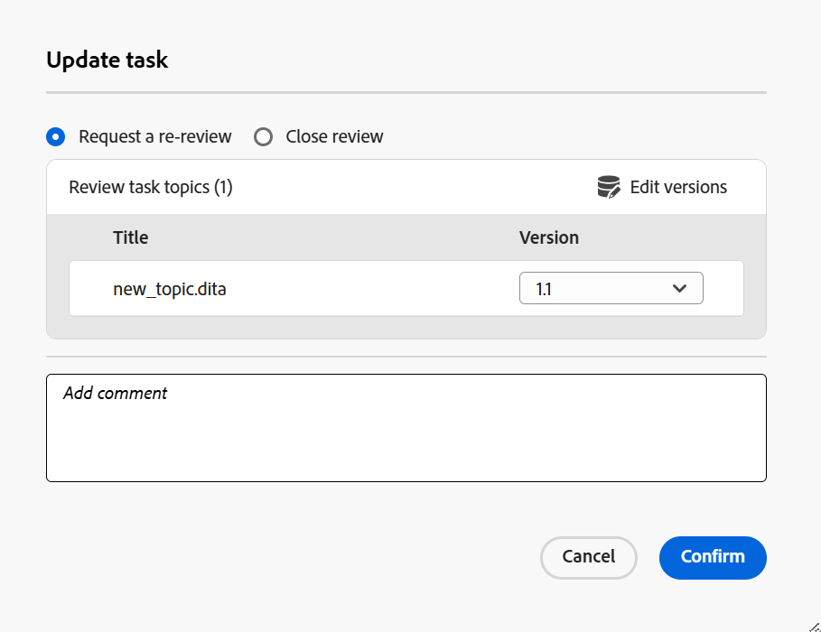

# Demander une révision ou fermer une tâche de révision en tant qu’auteur

>[!IMPORTANT]
>
> Les nouvelles fonctionnalités décrites dans cet article sont activées par défaut avec la version 2508 de Experience Manager Guides as a Cloud Services. Les révisions créées avant la migration ne sont pas affectées et continueront à utiliser le workflow précédent. Si vous préférez continuer à utiliser les fonctionnalités existantes sans ces mises à jour, contactez votre équipe du succès client pour que les nouvelles fonctionnalités soient désactivées.

Lorsqu’une tâche de révision est marquée comme terminée par un réviseur, une notification est déclenchée à l’initiateur de la tâche, lui permettant d’accéder à la tâche et de la réviser, ainsi qu’aux commentaires au niveau de la tâche associés.

En tant qu’initiateur de la tâche de révision, vous pouvez ensuite décider comment procéder en fonction des commentaires. Les options disponibles sont les suivantes :

- Demander une révision
- Fermer la tâche de révision

## Demander une révision ou fermer une tâche de révision

Effectuez les étapes suivantes pour demander une révision ou fermer une tâche de révision :

1. Ouvrez la tâche Révision dans l’éditeur.
2. Dans le panneau Révision, sélectionnez la tâche de révision dans la liste **Tâches actives**.

   >[!NOTE]
   >
   > Vous pouvez également ouvrir la tâche dans le tableau de bord de la tâche pour obtenir une vue plus complète. Pour ce faire, sélectionnez **Ouvrir dans le tableau de bord de la tâche** dans le menu Options d’une tâche de révision active. Les détails de la tâche s’ouvrent alors dans la console Projets.

   
3. Sélectionnez la boîte de dialogue **Commentaires de la tâche** pour accéder aux commentaires au niveau de la tâche ajoutés par le réviseur ou la réviseuse et les réviser.

   .

   La boîte de dialogue **Commentaires de la tâche** s’affiche à droite.

   {width="350" align="left"}.
4. Sélectionnez **Mettre à jour la tâche** pour effectuer une action supplémentaire sur la tâche de révision sélectionnée.
5. Dans la boîte de dialogue **Mettre à jour la tâche**, choisissez l’une des actions suivantes :

   - **Demander un réexamen** : lance un autre cycle de révision. Vous pouvez sélectionner une autre version de la rubrique à réviser. Par défaut, la dernière version (ou la dernière version modifiée) du fichier de rubrique ou de mappage envoyé pour révision est sélectionnée. Les réviseurs et réviseuses qui ont terminé la révision précédente recevront une notification leur demandant de faire part de leurs commentaires sur la version mise à jour. Les autres réviseurs et réviseuses qui n’ont pas marqué la tâche de révision comme terminée sont avertis de la mise à jour de la rubrique.

   - **Fermer la révision** : ferme la tâche de révision. Le bouton **Mettre à jour la tâche** présent au bas du panneau de révision devient **Fermé** et une notification est envoyée à tous les utilisateurs impliqués dans la tâche de révision pour indiquer sa fermeture.

   Pour plus d’informations sur le déclenchement des notifications de révision, voir [Présentation des notifications de révision](./review-understanding-review-notifications.md).

   .

6. Sélectionnez **Confirmer**.

En tant qu’auteur ou initiateur d’une tâche de révision, lorsque vous fermez la tâche, le bouton **Mettre à jour la tâche** présent au bas du panneau de révision est remplacé par **Fermé**, indiquant que la tâche n’est plus active.

{width="350" align="left"}

En outre, le bouton **Mettre à jour la tâche** présent dans le panneau de révision reste désactivé pour les autres utilisateurs de la tâche de révision. Par exemple, en tant que personne effectuant la révision d’une tâche de révision, si vous ouvrez la tâche dans l’éditeur, le bouton Mettre à jour la tâche sera désactivé avec un message **Vous n’êtes pas autorisé à agir sur cette tâche**. Seul l’initiateur d’une tâche de révision est autorisé à mettre à jour la tâche à partir de l’éditeur.

{width="350" align="left"}