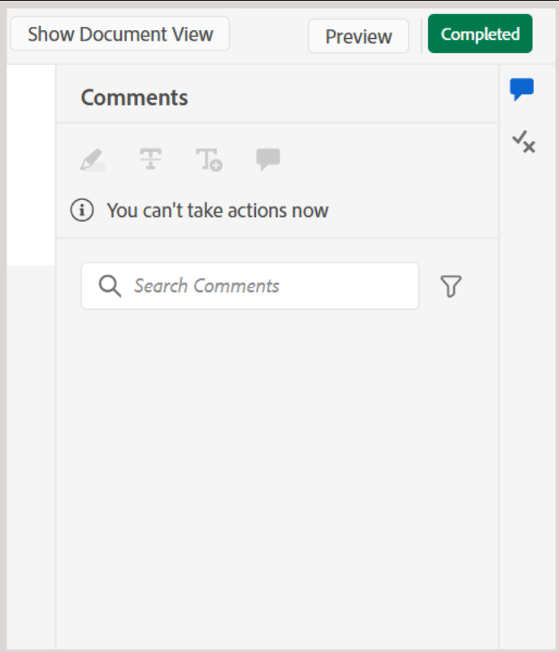

# Terminer la tâche de révision en tant que réviseur

>[!IMPORTANT]
>
> Les nouvelles fonctionnalités décrites dans cet article sont activées par défaut avec la version 2508 de Experience Manager Guides as a Cloud Service. Les révisions créées avant la migration ne sont pas affectées et continueront à utiliser le workflow précédent. Si vous préférez continuer à utiliser les fonctionnalités existantes sans ces mises à jour, contactez votre équipe du succès client pour que les nouvelles fonctionnalités soient désactivées.

En tant que réviseur ou réviseuse, vous pouvez marquer une tâche de révision comme terminée une fois que vous avez révisé tout le contenu et que vous souhaitez en informer l’auteur ou l’autrice. Vous pouvez également laisser des commentaires finaux à ce stade.

Effectuez les étapes suivantes pour terminer une tâche de révision :

1. Ouvrez la tâche de révision qui vous a été assignée.
2. Sélectionnez **Marquer comme terminé** dans la partie supérieure, comme illustré ci-dessous :

   {width="350" align="left"}

   La boîte de dialogue **Terminer la tâche** s’affiche.
3. Dans la boîte de dialogue **Terminer la tâche**, ajoutez les commentaires finaux pour l’auteur et sélectionnez **Terminer**.

   >[!NOTE]
   >
   > Les commentaires au niveau de la tâche servent de résumé ou de commentaires finaux et sont distincts des commentaires au niveau du texte ajoutés lors de la révision de la rubrique. Dans cette boîte de dialogue, vous pouvez indiquer les mesures de suivi, par exemple demander à l’auteur de répondre à des commentaires spécifiques et de renvoyer la tâche pour révision, ou indiquer que la révision est terminée.

   Par exemple, en tant que réviseur ou réviseuse, vous pouvez ajouter un commentaire en tant qu’action de suivi pour l’auteur :

   {width="350" align="left"}

   Vous pouvez également ajouter un commentaire pour indiquer que la tâche est terminée, comme illustré ci-dessous :

   {width="350" align="left"}

Vous avez marqué la tâche comme terminée et son état est maintenant défini sur **Terminé**. Aucune autre action n’est autorisée une fois la tâche marquée comme terminée. Une notification est envoyée à l’auteur ou à l’initiateur de la tâche de révision pour attirer leur attention immédiate. Pour plus d’informations sur le déclenchement des notifications de révision, voir [Présentation des notifications de révision](./review-understanding-review-notifications.md).

{width="350" align="left"}

En fonction des commentaires, si l’auteur ou l’initiateur de la tâche décide de [fermer la tâche de révision](./review-close-review-task.md), le statut de la tâche dans l’interface utilisateur de révision devient **Fermée**.

{width="350" align="left"}

## Afficher les commentaires au niveau de la tâche

Tous les commentaires au niveau de la tâche sont affichés dans la boîte de dialogue **Commentaires des tâches**, disponible en mode lecture seule. Lorsque vous terminez une tâche de révision avec un commentaire final, votre saisie est enregistrée dans cette boîte de dialogue pour référence ultérieure.

Pour accéder aux commentaires au niveau de la tâche à partir de l’interface utilisateur de révision, accédez au panneau de gauche et sélectionnez l’icône **Commentaires sur la tâche**.

{width="350" align="left"}

La boîte de dialogue **Commentaires de la tâche** s’affiche à droite.

{width="350" align="left"}

Les commentaires de la boîte de dialogue s’affichent dans l’ordre chronologique, les commentaires récents apparaissant en premier et les commentaires les plus anciens en dernier. Cet ordre vous aide à suivre la conversation au fil du temps.

La boîte de dialogue **Commentaires sur la tâche** est accessible à tous les utilisateurs impliqués dans la tâche de révision, y compris l’auteur ou l’initiateur de la tâche de révision et les autres réviseurs. Par conséquent, les commentaires des autres réviseurs (le cas échéant) peuvent également apparaître dans la boîte de dialogue Commentaires sur la tâche. Cela permet d’assurer une communication claire et traçable tout au long du processus d’examen.

Après avoir consulté les commentaires au niveau de la tâche, l’auteur peut demander une révision ou fermer la tâche de révision. Dans les deux cas, tous les commentaires capturés au cours du processus de révision restent disponibles à titre de référence dans la boîte de dialogue **Commentaires de la tâche**.
