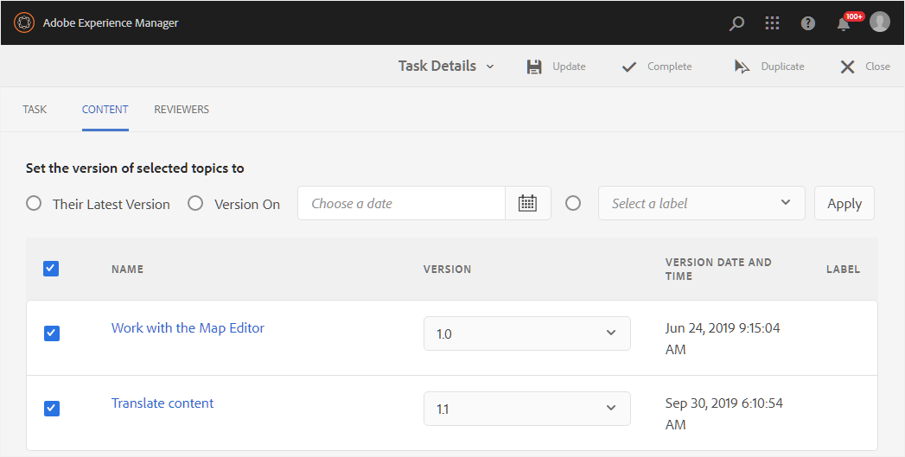

# Gérer les tâches de révision à l’aide du tableau de bord de révision {#id2056B0Y70X4}

Le workflow de gestion des révisions peut inclure diverses tâches. Par exemple, vous pouvez ajouter des réviseurs ou des réviseuses pour une rubrique particulière ou prolonger la date limite de révision. Vous pouvez également marquer la tâche de révision comme terminée si vous pensez que toutes les parties prenantes ont donné leur avis. Ces tâches peuvent être gérées à l’aide du tableau de bord de révision.

Pour accéder au tableau de bord de révision et l’utiliser, procédez comme suit :

>[!NOTE]
>
> Vous ne pouvez gérer les tâches de révision que pour les projets dont vous êtes l’auteur \(ou l’initiateur\). Même si vous êtes un réviseur ou un éditeur \(utilisateur\), vous n’aurez accès à aucune des tâches du projet.

1. Dans la console **Projets**, sélectionnez le projet de révision que vous souhaitez gérer.

   Un panneau Projet avec des mosaïques de tâches s’affiche.

   {align="left"}

   >[!NOTE]
   >
   > Vous pouvez également accéder directement au tableau de bord du projet à partir du panneau de gauche de l’éditeur. Ouvrez le [Panneau de révision](./web-editor-left-panel.md#review) et utilisez l’icône **Ouvrir le tableau de bord du projet** placée en regard de chaque projet de révision répertorié dans le panneau de révision.

1. Sélectionnez les trois points de la mosaïque **Révisions**.

   Le tableau de bord de révision s’affiche. Le tableau de bord répertorie toutes les tâches de révision que vous avez créées.

   {align="left"}

   Le tableau de bord de révision affiche les détails de la tâche de révision, tels que le nom de la tâche, l’auteur de la révision, la date de début de la révision, la date d’échéance, le statut, le nombre de nouveaux commentaires qui n’ont pas été acceptés ou rejetés par l’auteur et le nom des réviseurs. Les tâches sont répertoriées dans l’ordre des tâches nouvellement créées par rapport aux tâches plus anciennes.

   >[!NOTE]
   >
   > Si vous sélectionnez le lien Tâche de révision , le fichier de rubrique ou de mappage envoyé pour révision est ouvert.

1. Sélectionnez une tâche de révision.

   Les options Modifier les propriétés et [Statut](#check-review-status-id199RF0A0UHS) s’affichent dans la barre d’outils.

1. Si vous sélectionnez **Modifier les propriétés**, la page Détails de la tâche s’affiche.

   La page Détails de la tâche comporte trois onglets : Tâche, Contenu et Réviseurs. Les sections suivantes décrivent les différentes fonctions disponibles sous chaque onglet.

## Onglet Tâche

{align="left"}

Vous pouvez effectuer les actions suivantes sous l’onglet **Tâche** :

- Modifiez le titre de la tâche dans le champ **Titre**.
- Ajoutez des personnes désignées par défaut dans la liste déroulante **Affecter à**. Les réviseurs et réviseuses que vous ajoutez ici ont accès à la révision de toutes les rubriques qui font partie de cette tâche de révision. Vous pouvez choisir de supprimer ou d’ajouter de manière sélective d’autres réviseurs ou réviseuses à des rubriques spécifiques à partir de l’onglet [Réviseurs ou réviseuses](#reviewer-tab-id199RF0N0MUI).
- Mettez à jour la description de la tâche dans le champ **Description**.
- Modifiez la **Date d’échéance**. Vous pouvez retarder ou reporter l’échéance pour l’achèvement de la tâche.
- Sélectionnez cette option pour empêcher les utilisateurs de consulter uniquement les rubriques qui leur sont affectées.
- Sélectionnez **Mettre à jour** pour mettre à jour les détails modifiés.

  Un message toast s’affiche pour confirmer si la mise à jour est réussie ou non.
- Sélectionnez **Terminé** pour marquer la tâche de révision comme terminée avant la date d’échéance. Lorsque la tâche d&#39;une rubrique est marquée comme Terminée, la révision de la rubrique sélectionnée est fermée. Toutefois, dans le cas de rubriques partagées pour révision via un plan DITA, le marquage de la tâche de plan DITA comme Terminé ferme la révision de toutes les rubriques du plan qui ont été partagées pour révision.
- Sélectionnez **Dupliquer** pour créer une copie de la tâche de révision. Le processus de création d’une tâche de révision en double est similaire à la création d’une tâche de révision. Une fois que vous avez lancé le workflow de tâche en double, la page Créer une tâche de révision s’affiche. Vous devez fournir les détails de la nouvelle tâche, comme expliqué dans la section [ Envoyer les rubriques pour révision ](review-send-topics-for-review.md#).

  Si vous avez sélectionné une tâche de révision créée à partir d&#39;un plan DITA, les rubriques qui font partie du plan vous sont présentées. Vous pouvez ensuite choisir les rubriques que vous souhaitez inclure dans la nouvelle tâche de révision.

  Dans le cas d’une tâche de révision dupliquée à partir d’une ou de plusieurs révisions de rubriques, seules ces rubriques sont affichées dans la liste des tâches de révision. Vous pouvez choisir de partager ces rubriques pour révision avec un ensemble différent de réviseurs.

- Sélectionnez **Fermer** pour accéder à la page Boîte de réception.

## Onglet Contenu

{align="left"}

Vous pouvez effectuer les actions suivantes sous l’onglet **Contenu** :

- Modifiez la version de la rubrique envoyée pour révision. Vous pouvez choisir la dernière version de la rubrique, la version en date du, la version avec libellé spécifique ou la version avec une ligne de base spécifique \(pour un plan DITA\).

- Sélectionnez **Mettre à jour** pour partager la version mise à jour de la rubrique avec les réviseurs. Les réviseurs et réviseuses reçoivent une notification par e-mail indiquant que la version la plus récente de la rubrique a été envoyée pour révision. La prochaine fois qu’un réviseur ou une réviseuse ouvre la rubrique, il ou elle affiche la version mise à jour de la rubrique.

  >[!NOTE]
  >
  > Dans le cas d’une version mise à jour d’une rubrique, les anciens commentaires sont également conservés dans la version la plus récente. Les réviseurs et réviseuses peuvent également afficher les différences entre les deux versions.

- Sélectionnez **Terminé** pour marquer la tâche de révision comme terminée avant la date d’échéance. Lorsque la tâche d&#39;une rubrique est marquée comme Terminée, la révision de la rubrique sélectionnée est fermée. Toutefois, dans le cas de rubriques partagées pour révision via un plan DITA, le marquage de la tâche de plan DITA comme Terminé ferme la révision de toutes les rubriques du plan qui ont été partagées pour révision.

- Sélectionnez **Dupliquer** pour créer une tâche de révision en utilisant la tâche en cours comme base.

## Onglet Réviseurs {#reviewer-tab-id199RF0N0MUI}

{align="left"}

Vous pouvez effectuer les actions suivantes sous l’onglet **Réviseurs** :

- **Tout sélectionner** : sélectionne toutes les rubriques de la liste des rubriques. Vous pouvez facilement effectuer une opération par lots après avoir sélectionné toutes les rubriques.
- **Effacer la sélection** : désélectionne les rubriques sélectionnées dans la liste des rubriques.

  >[!NOTE]
  >
  > Vous pouvez également sélectionner ou désélectionner individuellement une rubrique en cochant la case en regard de celle-ci.

- **Ajouter** : affiche la boîte de dialogue Ajouter des réviseurs. Vous pouvez saisir le nom d’un réviseur ou d’un rôle utilisateur \(ou groupe\) que vous souhaitez ajouter en tant que réviseur aux rubriques sélectionnées.
- **Supprimer** : permet d’afficher la boîte de dialogue Supprimer les réviseurs. Vous pouvez saisir le nom d’un réviseur ou d’un rôle d’utilisateur \(ou d’un groupe\) que vous souhaitez supprimer des rubriques sélectionnées en tant que réviseur.
- **Réaffecter** : affiche la boîte de dialogue Réaffecter les réviseurs. Vous pouvez saisir le nom d’un réviseur ou d’un rôle d’utilisateur \(ou d’un groupe\) auquel vous souhaitez affecter la tâche de révision. Cette action supprime tous les réviseurs existants des rubriques sélectionnées et affecte les nouveaux réviseurs à ces rubriques.
- **Exporter** : permet d’exporter les détails de la tâche de révision dans un fichier CSV. Le fichier contient des détails tels que le chemin et le titre de la rubrique, le nom du réviseur et la version des rubriques envoyées pour révision.
- **Modifier les validants** : si vous sélectionnez l’icône  dans la liste de rubriques, la boîte de dialogue Modifier les validants s’affiche. Vous pouvez ajouter ou supprimer des réviseurs et réviseuses pour la rubrique sélectionnée à partir de cette boîte de dialogue.

## Vérifier le statut d’une tâche de révision {#check-review-status-id199RF0A0UHS}

Sur la page principale Tableau de bord de révision, si vous sélectionnez une tâche de révision et choisissez **Statut**, le rapport de statut de la tâche de révision s’affiche.

{align="left"}

Le rapport de statut de la tâche de révision contient les détails suivants :

- Nom\(s) du réviseur ou de la réviseuse auquel la tâche de révision est affectée.
- La colonne Statut indique le statut de révision. Le statut peut être l’un des suivants :
   - **Non démarré** : le réviseur ou la réviseuse n’a pas encore ouvert le lien de révision.
   - **En cours** : le réviseur ou la réviseuse a ouvert le lien de révision et est en train de réviser la rubrique.
   - **Terminé** : le réviseur ou la réviseuse a terminé la révision en effectuant la tâche de révision qui lui a été assignée. La tâche de révision se trouve dans la boîte de réception de notifications AEM de chaque réviseur.
- Lorsqu’un réviseur ouvre un lien de révision et accède à une rubrique spécifique, celle-ci est ajoutée à la liste Rubriques révisées . Cela permet aux auteurs et aux autrices de déterminer si les réviseurs et réviseuses ont ouvert leurs sections respectives ou non. Si des commentaires sont formulés, ils sont indiqués entre parenthèses.
- Nombre total de commentaires sur tous les sujets. Si plusieurs sujets sont en cours de révision, le nombre de commentaires pour chaque sujet est mentionné \(entre parenthèses\) en regard du nom du sujet.
- Date du dernier accès à une rubrique par le réviseur ou la réviseuse.

**Rubrique parente :**&#x200B;[ Présentation de la révision](review.md)
