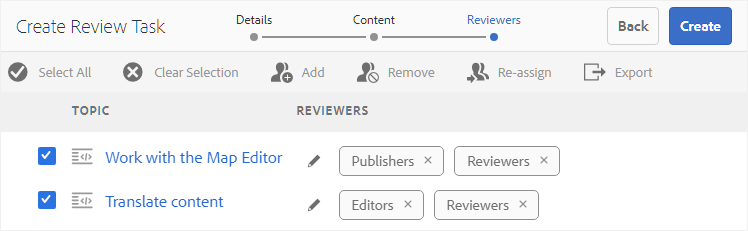

# Envoyer les rubriques à réviser {#id199RD0S035Z}

Le workflow de révision crée un environnement à réviseurs multiples dans lequel l’initiateur spécifie une liste de rubriques à réviser, ajoute plusieurs réviseurs et affecte une chronologie à la tâche de révision. Adobe Experience Manager Guides permet aux utilisateurs appartenant aux groupes Auteurs et Éditeurs de lancer une révision.

Comme le workflow de révision est spécifique au projet, l’initiateur de la révision doit faire partie de l’équipe du projet ou disposer des droits pour créer un projet. Au moment de la création d’un projet, vous définissez les membres de l’équipe du projet et leur affectez différents rôles ou groupes. Pour plus d&#39;informations sur les projets, voir [Créer un projet DITA](authoring-create-dita-project.md#).

Vous pouvez créer une tâche de révision à partir de :

- **Éditeur** : permet d&#39;envoyer une rubrique ou un plan DITA individuel pour révision. Notez que le workflow de création d’une tâche de révision est commun à l’ensemble de l’éditeur et de l’interface utilisateur d’Assets. Seule la méthode de lancement du workflow de révision diffère. Pour plus d’informations sur le lancement du workflow de révision à partir de l’éditeur, consultez la fonction [Créer une tâche de révision](web-editor-features.md#id215OCJ00JXA) dans l’éditeur.

- **Interface utilisateur d&#39;Assets** : permet d&#39;envoyer une ou plusieurs rubriques et un plan DITA pour révision. Le partage de documents à réviser à partir du workflow de l’interface utilisateur d’Assets est traité dans cette rubrique.

Dans l’interface utilisateur d’Assets, un auteur/éditeur peut créer une tâche de révision de deux façons :

- Envoyer une ou plusieurs rubriques pour révision
- Envoyer plusieurs rubriques à partir d&#39;un plan DITA pour révision

## Envoyer une ou plusieurs rubriques pour révision {#id1721E600FY4}

>[!IMPORTANT]
>
> Avant de créer une tâche de révision, assurez-vous d’avoir créé un projet et ajouté des réviseurs à ce projet.

Pour créer une tâche de révision et envoyer des rubriques à réviser, procédez comme suit :

>[!NOTE]
>
> Vous ne pouvez créer une tâche de révision que si vous êtes auteur ou éditeur dans un projet DITA.

1. Accédez au dossier requis dans l’interface utilisateur d’Assets.

1. Cliquez sur l’icône **Sélectionner** dans l’action rapide et sélectionnez les rubriques à envoyer pour révision.

   {width="300" align="left"}

1. Dans la barre d’outils, sélectionnez **Créer une tâche de révision**. La page de création de la tâche de révision s’affiche.

   >[!NOTE]
   >
   > Vous ne pouvez créer une tâche de révision que pour les rubriques comportant une révision. Si la rubrique sélectionnée n&#39;a pas de révision, une invite s&#39;affiche.

   {width="650" align="left"}

1. Saisissez un **Titre** pour la tâche et sélectionnez un projet DITA.

1. Dans le champ déroulant **Projet**, sélectionnez un projet DITA pour cette tâche de révision. Vous pouvez également saisir le nom du projet pour le localiser rapidement dans la liste déroulante.

1. Dans le champ déroulant **Affecter à**, sélectionnez les réviseurs auxquels vous souhaitez envoyer les rubriques pour révision.

   Vous pouvez affecter une tâche de révision à des utilisateurs individuels du projet ou à des groupes d’utilisateurs. Notez que vous ne pouvez affecter une tâche de révision à des utilisateurs individuels que lorsque vous faites partie du groupe d’administrateurs du projet. Sinon, vous ne pourrez afficher que les groupes d’utilisateurs dans le champ Affecter à .

   >[!NOTE]
   >
   > Le workflow de révision est spécifique au projet. Lorsque vous créez des projets, vous ajoutez les membres de l’équipe au projet et les affectez à des groupes. Ainsi, lorsque vous sélectionnez le projet ici, vous pouvez choisir les membres qui font partie de ce projet. Pour plus d&#39;informations sur les projets, voir [Créer un projet DITA](authoring-create-dita-project.md#).

1. Saisissez une **Description** pour la tâche.

   Cette description est utilisée comme corps de l’e-mail de notification envoyé aux réviseurs.

1. Sélectionnez la **Date d’échéance** et l’heure pour indiquer l’échéance de la révision.

   >[!NOTE]
   >
   > Une fois l’échéance atteinte, un e-mail est envoyé à l’initiateur pour l’informer que la tâche de révision est terminée. L’initiateur ou l’initiatrice peut prolonger la date limite de la tâche de révision depuis le [Tableau de bord de révision](review-manage-tasks-review-dashboard.md#).

1. Sélectionnez la carte racine dans le **Chemin de la carte racine**. Cette feuille de route est utilisée pour résoudre toutes les références clés et tous les termes du glossaire utilisés dans le contenu de la révision. Si vous ne sélectionnez pas la feuille de route, les références clés ou les termes du glossaire associés à la rubrique DITA ne sont pas résolus avant l&#39;envoi de la rubrique pour révision.

   Si vous créez la révision d&#39;un plan DITA, le chemin par défaut **Rootmap** est défini sur le chemin de ce plan. Si vous créez la révision d’une ou de plusieurs rubriques, le **Chemin de la feuille de route** est défini par défaut sur la feuille de route définie dans les Préférences utilisateur.

   >[!NOTE]
   >
   > La carte racine sélectionnée a la priorité la plus élevée pour résoudre les références clés. Pour plus d’informations, voir [Résoudre les références clés](map-editor-other-features.md#id176GD01H05Z).

1. Comme vous pouvez affecter différents réviseurs à différentes rubriques, l&#39;option **Autoriser les personnes désignées à réviser n&#39;importe quelle rubrique** contrôle si les réviseurs peuvent réviser toutes les rubriques d&#39;une tâche de révision ou uniquement les rubriques qui leur sont affectées.

   Si vous souhaitez permettre à tous les réviseurs et réviseuses de réviser n’importe quelle rubrique de la tâche de révision, sélectionnez **Autoriser les personnes désignées à réviser n’importe quelle rubrique**.

   Si vous ne sélectionnez pas cette option, les réviseurs ajoutés dans le champ **Affecter à** auront accès à la révision uniquement des rubriques qui leur sont affectées.

1. Sélectionnez **Suivant**.

   La page Contenu s’affiche.

   {align="left"}

1. Sur la page Contenu, sélectionnez une version de la rubrique que vous souhaitez partager pour révision.

   Vous pouvez utiliser l’une des méthodes suivantes pour sélectionner une version :

   - *\(Par défaut\)* Sélectionnez l’option **Leur dernière version** pour sélectionner la dernière révision enregistrée des rubriques.
   - Sélectionnez l’option **Version activée** et indiquez la date et l’heure auxquelles sélectionner une version en fonction de la date et de l’heure spécifiées. Si aucune version de rubrique n&#39;est disponible à la date spécifiée, une version disponible immédiatement après la date et l&#39;heure spécifiées est sélectionnée.
   - Sélectionnez l’option **Sélectionner un libellé** et sélectionnez un libellé dans la liste déroulante.
1. Après avoir effectué votre sélection pour choisir une version, sélectionnez **Appliquer**.

   La version basée sur l’option sélectionnée est choisie pour les rubriques.

   >[!NOTE]
   >
   > Vous pouvez également sélectionner manuellement la version souhaitée dans la liste déroulante **Version** de chaque rubrique.

1. Sélectionnez **Suivant**.

   La page Réviseurs s’affiche et vous permet d’ajouter ou de supprimer des réviseurs. Par défaut, les réviseurs ajoutés dans le champ Affecter à sont automatiquement ajoutés à chaque rubrique sélectionnée pour la révision.

   {width="650" align="left"}

1. Sur la page Réviseurs, vous pouvez ajouter ou supprimer des réviseurs. Les opérations suivantes sont disponibles sur la page Réviseurs :

   - **Tout sélectionner** : sélectionne toutes les rubriques de la liste des rubriques. Vous pouvez facilement effectuer une opération par lots après avoir sélectionné toutes les rubriques.
   - **Effacer la sélection** : désélectionne les rubriques sélectionnées dans la liste des rubriques.

     >[!NOTE]
     >
     > Vous pouvez également sélectionner ou désélectionner individuellement une rubrique en cochant la case en regard de celle-ci.

   - **Ajouter** : affiche la boîte de dialogue Ajouter des réviseurs. Vous pouvez saisir le nom d’un réviseur ou d’un rôle utilisateur \(ou groupe\) que vous souhaitez ajouter en tant que réviseur aux rubriques sélectionnées.
   - **Supprimer** : permet d’afficher la boîte de dialogue Supprimer les réviseurs. Vous pouvez saisir le nom d’un réviseur ou d’un rôle d’utilisateur \(ou d’un groupe\) que vous souhaitez supprimer des rubriques sélectionnées en tant que réviseur.

     >[!NOTE]
     >
     > Vous pouvez également supprimer une révision d&#39;une rubrique en sélectionnant le signe croisé dans la zone du réviseur.

   - **Réaffecter** : affiche la boîte de dialogue Réaffecter les réviseurs. Vous pouvez saisir le nom d’un réviseur ou d’un rôle d’utilisateur \(ou d’un groupe\) auquel vous souhaitez affecter la tâche de révision. Cette action supprime tous les réviseurs existants des rubriques sélectionnées et affecte les nouveaux réviseurs à ces rubriques.
   - **Exporter** : permet d’exporter les détails de la tâche de révision dans un fichier CSV. Le fichier contient des détails tels que le chemin et le titre de la rubrique, le nom du réviseur et la version des rubriques envoyées pour révision.
   - **Modifier les validants** : si vous sélectionnez l’icône  dans la liste de rubriques, la boîte de dialogue Modifier les validants s’affiche. Vous pouvez ajouter ou supprimer des réviseurs et réviseuses pour la rubrique sélectionnée à partir de cette boîte de dialogue.
1. Sélectionnez **Créer** pour créer la tâche de révision.

   Un message de confirmation s’affiche lorsque la tâche de révision est créée avec succès. Le [état du document](web-editor-document-states.md#) pour les sujets envoyés pour révision est défini sur En cours de révision.

   >[!NOTE]
   >
   > Vous pouvez également sélectionner Notifications en haut à droite de l’écran et confirmer que la tâche de révision a été créée avec succès. Dans le panneau Notifications , vous trouverez une notification pour chaque réviseur ou réviseuse qui a participé à la tâche de révision et une notification pour l’initiateur de la révision.

Un e-mail est envoyé à tous les réviseurs et réviseuses pour les informer qu’une ou plusieurs rubriques leur ont été affectées pour la révision. L’e-mail contient un lien direct qu’ils peuvent utiliser pour accéder à la rubrique dans une fenêtre de navigateur.

Si plusieurs rubriques sont affectées, les réviseurs et réviseuses peuvent les afficher et les sélectionner dans une liste déroulante de rubriques dans le navigateur web.

## Envoyer plusieurs rubriques à réviser à partir d&#39;un plan DITA

Un plan DITA est une organisation logique de rubriques dans un livre. Lorsque vous envoyez une rubrique individuelle pour révision, le réviseur n’obtient aucune information sur l’emplacement de cette rubrique dans le livre. Si le réviseur ou la réviseuse dispose d’informations sur le lieu exact de la rubrique en cours de révision, il ou elle obtient un meilleur contexte pour la rubrique en cours de révision.

Experience Manager Guides vous permet d&#39;envoyer une ou plusieurs rubriques d&#39;un plan DITA pour révision en même temps. Le réviseur ou la réviseuse peut afficher le fichier de mappage complet ainsi que les rubriques qui ont été partagées pour la révision. Cela permet au réviseur ou à la réviseuse d’obtenir plus facilement un contexte pour la rubrique dans le fichier de carte ou de livre.

Vous pouvez partager le même plan DITA dans pour révision dans plusieurs tâches de révision. Par exemple, si dans un plan DITA, il existe des rubriques A, B, C, D et E. Dans une tâche de révision, vous pouvez partager A, B et C pour révision et dans une autre tâche de révision, vous pouvez envoyer les rubriques C, D et E pour révision. Le processus de révision permet de partager la même rubrique et de mapper le fichier dans plusieurs tâches de révision. Pour la rubrique commune à plusieurs tâches de révision, les commentaires fournis dans une tâche de révision ne remplacent pas ou ne fusionnent pas avec les commentaires des autres tâches de révision.

>[!IMPORTANT]
>
> Si une rubrique d’un fichier de mappage a été partagée dans plusieurs tâches de révision, son statut indique En révision jusqu’à ce que toutes les tâches de révision soient terminées.

Pour envoyer une ou plusieurs rubriques avec le fichier de mappage pour révision, procédez comme suit :

>[!IMPORTANT]
>
> Une fois que vous avez lancé une révision à l’aide d’un fichier de mappage, vous ne devez pas modifier la structure du fichier de mappage en ajoutant de nouvelles rubriques ou en supprimant des rubriques existantes.

1. Accédez au dossier requis dans l’interface utilisateur d’Assets.

   >[!NOTE]
   >
   > Assurez-vous que la vue de la console est définie sur Carte ou Liste.

1. Sélectionnez la carte à partir de laquelle vous souhaitez envoyer les rubriques à réviser.

1. Dans la barre d’outils, sélectionnez **Créer une tâche de révision**. La page de création de la tâche de révision s’affiche.

1. Saisissez un **Titre** pour la tâche.

1. Dans le champ déroulant **Projet**, sélectionnez un projet DITA pour cette tâche de révision. Vous pouvez également saisir le nom du projet pour le localiser rapidement dans la liste déroulante.

   >[!NOTE]
   >
   > Vous ne pouvez créer une tâche de révision que pour les rubriques comportant une révision. Si votre carte contient des rubriques qui n’ont pas de révision, une invite vous est présentée avec une liste de ces fichiers. Les fichiers sans révision sont exclus de la tâche de révision.

1. Dans le champ déroulant **Affecter à**, sélectionnez les réviseurs auxquels vous souhaitez envoyer les rubriques pour révision.

   Vous pouvez affecter une tâche de révision à des utilisateurs individuels du projet ou à des groupes d’utilisateurs. Notez que vous ne pouvez affecter une tâche de révision à des utilisateurs individuels que lorsque vous faites partie du groupe d’administrateurs du projet. Sinon, vous ne pourrez afficher que les groupes d’utilisateurs dans le champ Affecter à .

   >[!NOTE]
   >
   > Le workflow de révision est spécifique au projet. Lorsque vous créez des projets, vous ajoutez les membres de l’équipe au projet et les affectez à des groupes. Ainsi, lorsque vous sélectionnez le projet ici, vous pouvez choisir les membres qui font partie de ce projet. Pour plus d&#39;informations sur les projets, voir [Créer un projet DITA](authoring-create-dita-project.md#).

1. Saisissez une **Description** pour la tâche.

   Cette description est utilisée comme corps de l’e-mail de notification envoyé aux réviseurs.

1. Sélectionnez la **Date d’échéance** et l’heure pour indiquer l’échéance de la révision.

   >[!NOTE]
   >
   > Une fois l’échéance atteinte, un e-mail est envoyé à l’initiateur pour l’informer que la tâche de révision est terminée. L’initiateur ou l’initiatrice peut prolonger la date limite de la tâche de révision depuis le [Tableau de bord de révision](review-manage-tasks-review-dashboard.md#).

1. Comme vous pouvez affecter différents réviseurs à différentes rubriques, l&#39;option **Autoriser les personnes désignées à réviser n&#39;importe quelle rubrique** contrôle si les réviseurs peuvent réviser toutes les rubriques d&#39;une tâche de révision ou uniquement les rubriques qui leur sont affectées.

   Si vous souhaitez permettre à tous les réviseurs et réviseuses de réviser n’importe quelle rubrique de la tâche de révision, sélectionnez **Autoriser les personnes désignées à réviser n’importe quelle rubrique**.

   Si vous ne sélectionnez pas cette option, les réviseurs ajoutés dans le champ **Affecter à** auront accès à la révision uniquement des rubriques qui leur sont affectées.

1. Sélectionnez **Suivant**.

   La page Contenu s’affiche avec toutes les rubriques référencées à partir du fichier de mappage. Si votre plan DITA contient des plans imbriqués, les rubriques des plans imbriqués sont également répertoriées ici.

   {align="left"}

1. Sur la page Contenu, sélectionnez une version de la rubrique que vous souhaitez partager pour révision.

   Vous pouvez utiliser l’une des méthodes suivantes pour sélectionner une version :

   - *\(Par défaut\)* Sélectionnez l’option **Leur dernière version** pour sélectionner la dernière révision enregistrée des rubriques.
   - Sélectionnez l’option **Version activée** et indiquez la date et l’heure afin de sélectionner une version en fonction de la date et de l’heure. Si aucune version de rubrique n&#39;est disponible à la date spécifiée, une version disponible immédiatement après la date et l&#39;heure spécifiées est sélectionnée.
   - Sélectionnez l’option **Sélectionner un libellé** et sélectionnez un libellé dans la liste déroulante. Toutes les rubriques contenant le libellé sélectionné sont sélectionnées dans la liste déroulante **Version**.
   - Choisissez l&#39;option **Sélectionner une ligne de base** et sélectionnez une ligne de base dans la liste déroulante. Toutes les versions de rubrique faisant partie de la ligne de base sélectionnée sont sélectionnées dans la liste déroulante **Version**.
1. Après avoir effectué votre sélection pour choisir une version, sélectionnez **Appliquer**.

   La version basée sur l’option sélectionnée est choisie pour les rubriques.

   >[!NOTE]
   >
   > Vous pouvez également sélectionner manuellement la version souhaitée dans la liste déroulante **Version** de chaque rubrique.

1. Sélectionnez **Suivant**.

   La page Réviseurs s’affiche et vous permet d’ajouter ou de supprimer des réviseurs. Par défaut, les réviseurs ajoutés dans le champ Affecter à sont automatiquement ajoutés à chaque rubrique sélectionnée pour la révision.

1. Sur la page Réviseurs, vous pouvez ajouter ou supprimer des réviseurs. Les opérations suivantes sont disponibles sur la page Réviseurs :

   - **Tout sélectionner** : sélectionne toutes les rubriques de la liste des rubriques. Vous pouvez facilement effectuer une opération par lots après avoir sélectionné toutes les rubriques.
   - **Effacer la sélection** : désélectionne les rubriques sélectionnées dans la liste des rubriques.

     >[!NOTE]
     >
     > Vous pouvez également sélectionner ou désélectionner individuellement une rubrique en cochant la case en regard de celle-ci.

   - **Ajouter** : affiche la boîte de dialogue Ajouter des réviseurs. Vous pouvez saisir le nom d’un réviseur ou d’un rôle utilisateur \(ou groupe\) que vous souhaitez ajouter en tant que réviseur aux rubriques sélectionnées.
   - **Supprimer** : permet d’afficher la boîte de dialogue Supprimer les réviseurs. Vous pouvez saisir le nom d’un réviseur ou d’un rôle d’utilisateur \(ou d’un groupe\) que vous souhaitez supprimer des rubriques sélectionnées en tant que réviseur.
   - **Réaffecter** : affiche la boîte de dialogue Réaffecter les réviseurs. Vous pouvez saisir le nom d’un réviseur ou d’un rôle d’utilisateur \(ou d’un groupe\) auquel vous souhaitez affecter la tâche de révision. Cette action supprime tous les réviseurs existants des rubriques sélectionnées et affecte les nouveaux réviseurs à ces rubriques.
   - **Exporter** : permet d’exporter les détails de la tâche de révision dans un fichier CSV. Le fichier contient des détails tels que le chemin et le titre de la rubrique, le nom du réviseur et la version des rubriques envoyées pour révision.
   - **Modifier les validants** : si vous sélectionnez l’icône  dans la liste de rubriques, la boîte de dialogue Modifier les validants s’affiche. Vous pouvez ajouter ou supprimer des réviseurs et réviseuses pour la rubrique sélectionnée à partir de cette boîte de dialogue.

   >[!IMPORTANT]
   >
   > Vous devez affecter au moins un réviseur/une réviseuse pour créer la tâche de révision.

1. Sélectionnez **Créer** pour créer la tâche de révision.

   Un message de confirmation s’affiche lorsque la tâche de révision est créée avec succès. Le [état du document](web-editor-document-states.md#) pour les sujets envoyés pour révision est défini sur En cours de révision.

   >[!NOTE]
   >
   > Vous pouvez également sélectionner le panneau Notifications en haut à droite de l’interface et confirmer que la tâche a été créée avec succès. Dans le panneau Notifications , vous trouverez une notification pour chaque révision ayant fait partie de la tâche de révision et une notification pour l’initiateur de la révision.

   >[!IMPORTANT]
   >
   > Une fois que vous avez lancé une révision, vous ne devez pas déplacer ni supprimer le plan ou les rubriques DITA vers un autre emplacement. Cela entraînera une interruption du processus d&#39;examen.

Un e-mail est envoyé à tous les réviseurs et réviseuses, les informant que des rubriques leur ont été affectées pour la révision. L’e-mail contient un lien direct qu’ils peuvent utiliser pour accéder à la rubrique dans une fenêtre de navigateur. Les rubriques ainsi que le plan DITA sont ouvertes en mode de révision.

**Rubrique parente :**&#x200B;[ Présentation de la révision](review.md)
