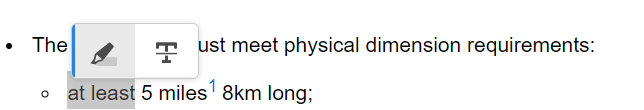

# Rubriques de révision {#id2056B0W0FBI}

Si vous êtes réviseur, vous recevez un e-mail de demande de révision contenant un lien vers les rubriques de révision. Ce lien vous permet d’accéder à la page de révision dans laquelle vous pouvez ajouter vos commentaires sur les sujets partagés.

>[!NOTE]
>
> Lors de l’accès à la demande de révision à partir de la notification, vous pouvez choisir de la réaffecter à un autre utilisateur qui fait partie du même projet de révision. Pour plus d’informations, consultez [Réaffecter une tâche de révision à l’aide d’une notification](./reassign-review-using-notification.md).

Pour passer en revue une rubrique, procédez comme suit :

1. Sélectionnez le lien direct donné dans l’e-mail de demande de révision.

   Le lien de la rubrique ou du mappage est ouvert dans un navigateur.

   >[!NOTE]
   >
   > Vous pouvez également accéder au lien de révision de la rubrique à partir de la zone des notifications de votre boîte de réception dans l’interface utilisateur de Adobe Experience Manager.

1. Selon la manière dont la révision de la rubrique est lancée, vous pouvez afficher l’un des deux écrans suivants :

   >[!NOTE]
   >
   > L’interface utilisateur peut être différente si vous avez créé la révision dans :
   >
   > - Adobe Experience Manager Guides as a Cloud Service version de novembre 2022 ou antérieure
   > - Adobe Experience Manager Guides version 4.1 ou antérieure

   L&#39;écran suivant s&#39;affiche lorsqu&#39;un plan DITA est utilisé pour lancer le processus de révision :

   {align="left"}

   Les options suivantes sont disponibles sur cet écran :

   - **A** : nom de la tâche de révision.
   - **B** : sélectionnez l’icône Vue Rubriques pour afficher ou masquer le panneau des rubriques.

   - **C** : vous pouvez rechercher la rubrique souhaitée en saisissant une partie du texte du titre ou du chemin d’accès au fichier dans la barre de recherche.

     Sélectionnez  près de la barre de recherche pour afficher toutes les rubriques ou afficher les rubriques avec des commentaires. Par défaut, vous pouvez afficher toutes les rubriques présentes dans la tâche de révision.

   - **D** : les nombres mis en surbrillance par ***F*** peuvent être filtrés en sélectionnant l’option de filtre de votre choix à partir d’ici. Vous pouvez filtrer les commentaires par type, statut, réviseur ou version. Par exemple, si vous souhaitez afficher le nombre de commentaires Barré effectués dans chacune des rubriques en cours de révision, sélectionnez l’icône de filtre, puis choisissez **Type de révision** \> **Suppression**.

     >[!NOTE]
     >
     > Lors de l’application des filtres, seuls les commentaires correspondant aux filtres sélectionnés s’affichent dans le panneau Commentaires . Le nombre de commentaires filtrés s’affiche à gauche dans le panneau des rubriques.

   - **E** : Un sujet assigné pour révision au réviseur actuel est affiché en noir et peut être sélectionné. Lorsque le réviseur ou la réviseuse sélectionne une rubrique, celle-ci est affichée en haut de l’écran.
   - **F** : une rubrique qui n’est pas disponible pour révision est grisée. La rubrique s’affiche en mode lecture seule et vous n’êtes pas autorisé à ajouter des commentaires de révision sur ces rubriques.

   - **G** : Nombre de commentaires reçus sur un sujet. Ce nombre change en fonction du filtre appliqué.

   Toutes les rubriques de la carte s’affichent sous la forme d’un document composite unique. Les rubriques que le réviseur est autorisé à examiner s’affichent normalement. Les rubriques que la révision n’est pas autorisée à réviser ne s’affichent pas.

   {align="left"}

   Dans la capture d’écran ci-dessus, la rubrique Description générale est partagée pour révision avec le réviseur actuel, ce qui s’affiche normalement. Cependant, la rubrique suivante, Historique du contenu des vols, n’est pas partagée pour révision et s’affiche en mode lecture seule. Le sujet actuellement en discussion est également mis en évidence dans la table des matières.

   L’écran suivant s’affiche lorsqu’une ou plusieurs rubriques sont sélectionnées et partagées pour la révision :

   {align="left"}

   >[!NOTE]
   >
   > Si plusieurs rubriques sont sélectionnées, elles s’affichent sous la forme d’un document composite dans la vue de document. La capture d’écran ci-dessus met en évidence deux sujets différents présentés l’un après l’autre dans une seule vue.

1. Ouvrez le panneau Commentaires en sélectionnant l’icône **Commentaires** dans le coin supérieur droit de la barre d’outils.

   Fournissez des commentaires de révision en sélectionnant un type de commentaire approprié dans la barre d’outils, puis appuyez sur Entrée pour envoyer votre commentaire.
La zone de commentaire prend en charge les entrées multiligne et permet aux utilisateurs de la développer selon leurs besoins pour fournir des commentaires détaillés. Vous pouvez utiliser **Maj** + **Entrée** pour accéder à la ligne suivante lors de la rédaction du commentaire.

   >[!NOTE]
   >
   > Le panneau Commentaires affiche uniquement les commentaires relatifs aux rubriques actuelles. Lorsque vous déplacez la sélection vers un autre sujet, les commentaires laissés sur l&#39;autre sujet s&#39;affichent.

1. Cliquez sur le bouton **Fermer** une fois la révision de la rubrique terminée. En sélectionnant le bouton **Fermer**, vous serez redirigé vers la page à partir de laquelle vous avez accédé à la rubrique de révision.

## Fonctionnalités supplémentaires disponibles dans l’écran de révision

**Vue Document et vue Rubrique** - Par défaut, si plusieurs rubriques sont partagées pour la révision, une vue de document composite des rubriques est présentée aux réviseurs. Dans le cas d&#39;une révision de carte DITA, toutes les rubriques de la carte sont présentées sous la forme d&#39;un document unique, ressemblant à une vue de livre. Si vous le souhaitez, vous pouvez également sélectionner une rubrique spécifique. Seule cette rubrique est alors affichée sur l’écran de révision.

Lorsque vous affichez une seule rubrique, vous disposez d&#39;une option supplémentaire pour revenir à la vue de document. Dans la capture d’écran suivante, une rubrique spécifique d’un fichier de mappage est ouverte pour révision. L&#39;option en surbrillance — **Afficher le mode Document** permet à l&#39;utilisateur de revenir au mode Document du fichier de mappage.

>[!NOTE]
>
> Toute résolution d’écran supérieure à 1 600 px est compatible avec les largeurs de panneau par défaut (gauche et droite), ce qui garantit qu’aucune barre de défilement horizontale ne s’affiche et que le contenu reste correctement aligné dans la vue du document. Vous pouvez également toujours redimensionner l’écran pour conserver la vue de document appropriée dans l’interface utilisateur de révision.

{align="left"}

**Utilisation de différents types d’outils de commentaires** - Vous pouvez ajouter des commentaires intégrés en mettant le texte en surbrillance, en barrant le texte, en insérant du texte ou en ajoutant une note de commentaire. Les différents types d’outils de commentaires fournis dans la barre d’outils Commentaires sont décrits ci-dessous :

{width="350" align="left"}

- **Surbrillance** \(\) : pour ajouter un commentaire de surbrillance, sélectionnez le texte et choisissez l’icône Surbrillance. Vous pouvez également d’abord sélectionner l’icône de surbrillance, puis sélectionner le texte souhaité.

  {width="650" align="left"}

  Un pop-up s’affiche dans le panneau Commentaires dans lequel vous pouvez ajouter votre commentaire pour le contenu mis en surbrillance.

- **Barré** \(\) : si vous souhaitez suggérer la suppression de contenu, sélectionnez le contenu, puis choisissez l’icône Barré. Vous pouvez également d’abord sélectionner le texte souhaité, puis choisir la touche Supprimer .

  Un pop-up s’affiche dans le panneau Commentaires dans lequel vous pouvez ajouter votre commentaire pour le contenu supprimé.

- **Insérer du texte** \(\) : si vous souhaitez insérer du texte, sélectionnez l&#39;icône Insérer du texte et placez le curseur à l&#39;endroit où vous souhaitez insérer le texte et saisissez les informations. Vous pouvez également placer le curseur à l’endroit où vous souhaitez insérer du texte et commencer la saisie. Les informations ajoutées s’affichent en vert.

- **Ajouter un commentaire**\(\) : si vous souhaitez ajouter un commentaire de type pense-bête, sélectionnez l’icône Ajouter un commentaire et saisissez le commentaire dans le pop-up.

**Barre d’outils contextuelle**

Vous pouvez également mettre en surbrillance ou barrer le texte rapidement à l’aide de la barre d’outils contextuelle. Effectuez les étapes suivantes pour ajouter un commentaire à l’aide de la barre d’outils contextuelle :

1. Sélectionnez le texte à mettre en surbrillance ou à barrer. La barre d’outils contextuelle s’affiche.

   {width="550" align="left"}

1. Sélectionnez l’icône **Surbrillance** ou **Barré**.
1. Vous pouvez ajouter des commentaires dans le panneau de commentaires pour l’action de surbrillance ou de barrage.

**Révision à l’aide du panneau Commentaires** - Le panneau Commentaires affiche une liste de commentaires sur la rubrique actuelle. Ce panneau répertorie également les commentaires des autres réviseurs ou réviseuses, si la rubrique est envoyée à plusieurs réviseurs ou réviseuses. Chaque commentaire du panneau de commentaires est lié au texte correspondant dans la rubrique active. Cela vous permet d’identifier le texte commenté. Chaque commentaire affiche le nom du réviseur ou de la réviseuse qui l’a ajouté ainsi que la date et l’heure.

Les commentaires s’affichent dans l’ordre du texte commenté dans le document. Par exemple, si un commentaire de texte mis en surbrillance est ajouté à la première phrase du premier paragraphe et qu’un commentaire de texte inséré est ajouté à la deuxième phrase, ce dernier est affiché avant le commentaire de texte inséré.

Les tâches que vous pouvez effectuer à l’aide du panneau Commentaires sont décrites ci-dessous :

- La sélection d’un commentaire met en surbrillance et affiche l’emplacement du commentaire correspondant dans le document.
- Vous pouvez ajouter des réponses aux commentaires.
- Vous pouvez modifier votre propre commentaire en le sélectionnant dans le panneau Commentaires, puis en choisissant **Modifier** dans le menu Options.
- Vous pouvez supprimer vos propres commentaires en les sélectionnant dans le panneau Commentaires, puis en choisissant l’option **Supprimer** dans le menu Options.

  {width="300" align="left"}

  >[!NOTE]
  >
  > Le menu Options s’affiche uniquement lorsque vous pointez sur vos propres commentaires. Il n’est pas affiché pour les commentaires des autres réviseurs.

- Tous les utilisateurs participants peuvent répondre aux commentaires envoyés par d’autres utilisateurs. Dans un commentaire, sélectionnez **Répondre** et appuyez sur Entrée pour envoyer une réponse. La zone de réponse est multiligne et extensible, ce qui permet aux utilisateurs et aux utilisatrices de fournir des réponses détaillées aux commentaires. Vous pouvez utiliser **Maj** + **Entrée** pour accéder à la ligne suivante lors de l’écriture de la réponse.

**Mode Aperçu.**

- L’ouverture d’une rubrique en mode Aperçu montre comment une rubrique s’affichera lorsqu’elle sera consultée par un auteur après l’application de toutes les modifications. Par exemple, tout le texte inséré s’affiche en tant que texte normal et tout le texte barré \(supprimé\) est supprimé du contenu.

- La capture d’écran suivante montre le contenu en mode *Révision* :

{width="550" align="left"}

La capture d’écran suivante montre le contenu en mode *Aperçu* :

{width="550" align="left"}

**Balisage des utilisateurs de la tâche dans un commentaire**

Lorsque vous collaborez à une tâche de révision avec plusieurs réviseurs ou réviseuses, vous pouvez améliorer la communication en identifiant des utilisateurs ou utilisatrices spécifiques dans les nouveaux commentaires et réponses. En tant que réviseur ou réviseuse, vous pouvez ajouter un commentaire ou répondre à un commentaire existant tout en taguant d’autres utilisateurs et utilisatrices impliqués dans la même tâche de révision afin d’attirer leur attention ou d’attribuer des suivis. Cette fonctionnalité est disponible uniquement pour les tâches de révision actives.

>[!NOTE]
>
> Pour afficher la liste des utilisateurs affectés à une tâche de révision et les baliser dans un commentaire, vous devez disposer d’un accès en *lecture* sur les nœuds `/home/users and /home/groups`. Pour plus d’informations, consultez [Administration et sécurité des utilisateurs](../cs-install-guide/user-admin-sec.md#additional-notes-on-user-groups).   Si le balisage n’est toujours pas disponible après avoir confirmé l’accès, votre administrateur peut avoir besoin d’attribuer une licence `user-admin` pour activer cette fonctionnalité.

{width="350" align="left"}

Les utilisateurs identifiés reçoivent à la fois un e-mail et une notification AEM, pour être rapidement informés. Pour plus d’informations sur le déclenchement des notifications de révision, voir [Présentation des notifications de révision](./review-understanding-review-notifications.md).

{width="350" align="left"}

**Ajouter des pièces jointes aux commentaires** -   Si vous souhaitez compléter votre commentaire en fournissant des informations supplémentaires qui sont disponibles dans un autre fichier, vous pouvez le faire en le joignant à votre commentaire. En tant que réviseur ou réviseuse, vous pouvez facilement ajouter un ou plusieurs fichiers de votre système local à votre commentaire. Vous pouvez ajouter un fichier à toutes les formes de commentaires prises en charge : surligné, barré, insertion de texte ou commentaire.

Lorsque vous insérez l’un des commentaires, le pop-up de commentaire s’affiche. Après avoir fourni des commentaires ou des informations supplémentaires dans le pop-up, vous l’envoyez en appuyant sur Entrée. Une fois le commentaire ajouté, vous avez la possibilité d’ajouter une pièce jointe à ce commentaire.

{align="left"}

Dans la capture d’écran ci-dessus, le document contient le pop-up du commentaire mis en surbrillance et le commentaire est également ajouté dans le panneau Commentaires . L’icône de pièce jointe est disponible avec le commentaire aux deux emplacements.

Pour ajouter une pièce jointe à votre commentaire, procédez comme suit :

1. Sélectionnez l’icône *Ajouter une pièce jointe* en  du commentaire avec lequel vous souhaitez ajouter une pièce jointe.

   La boîte de dialogue Ouvrir le fichier s’affiche.

1. Sélectionnez un ou plusieurs fichiers à joindre.

   Les fichiers sélectionnés s’affichent avec le commentaire dans le panneau Commentaires .

   Dans le panneau Commentaires , vous pouvez afficher le nom du fichier et sa taille. Vous avez également la possibilité de supprimer un fichier en sélectionnant l’icône de suppression  associée au nom du fichier.

1. Sélectionnez **Envoyer**.

   Les pièces jointes sont chargées et ajoutées au commentaire.

**Remarques supplémentaires sur l’utilisation des pièces jointes :**

- Par défaut, seuls deux fichiers joints avec un commentaire s’affichent. S’il existe d’autres fichiers, le bouton **Afficher la pièce jointe** situé à droite affiche le nombre de toutes les pièces jointes \(qui sont plus de deux\) associées au commentaire. Vous pouvez sélectionner le nombre pour afficher toutes les pièces jointes. Par exemple, si vous avez quatre pièces jointes avec un commentaire, vous verrez +2 sur le bouton.

{width="550" align="left"}

- Placez le pointeur de la souris sur une pièce jointe pour télécharger ou supprimer la pièce jointe. La suppression de la pièce jointe n’est possible que si le réviseur actuel a ajouté ce commentaire, comme le montre la capture d’écran suivante :

{width="550" align="left"}

Les autres réviseurs ou auteurs n’obtiennent que l’option de pièce jointe de téléchargement.

{width="550" align="left"}

- Vous pouvez télécharger toutes les pièces jointes associées à un commentaire dans la boîte de dialogue **Afficher les pièces jointes**. Sélectionnez les pièces jointes et sélectionnez l’icône **Télécharger** au niveau des commentaires.

- Vous pouvez également supprimer les pièces jointes associées à un commentaire dans la boîte de dialogue **Afficher les pièces jointes**. Sélectionnez les pièces jointes et sélectionnez l’icône **Supprimer**.

{width="550" align="left"}

**Panneau Conditions** -   Si votre rubrique comporte du contenu conditionnel, l’icône **Conditions** \(\) s’affiche à droite. Sélectionnez l’icône **Conditions** pour ouvrir le panneau Conditions qui vous permet de mettre en surbrillance le contenu en fonction des conditions disponibles dans la rubrique.

:   Par défaut, l’option **Tout mettre en surbrillance** est activée, toutes les conditions sont sélectionnées, l’intégralité du contenu est affichée et le contenu conditionné est affiché comme étant mis en surbrillance en mode Révision et Aperçu.

:   Vous pouvez désactiver l’option **Tout mettre en surbrillance** et afficher tout le contenu présent dans la rubrique sous forme de texte normal sans mise en surbrillance.

{width="350" align="left"}

Vous pouvez choisir d’afficher ou de masquer une condition spécifique.

- Si vous masquez une condition, le contenu associé à cette condition n’est pas mis en surbrillance en mode de révision.
- Si vous affichez une condition, le contenu conditionné est mis en surbrillance dans le mode de révision. Par exemple, dans la capture d’écran suivante, seul le contenu utilise deux conditions : `win` et `mac` sont mises en surbrillance.

{width="650" align="left"}

En mode d’aperçu, le contenu non conditionné et le contenu conditionné qui utilise les deux conditions affichées, `win` et `mac`, s’affichent. Le contenu conditionné restant pour lequel les conditions sont masquées ne s’affiche pas.

**Révision en temps réel** -   Le panneau Commentaires est mis à jour en temps réel avec les commentaires et les commentaires ou les actions de l’auteur ou de l’autrice concernant les commentaires.

- Plusieurs réviseurs pourront laisser des commentaires ou répondre à des commentaires simultanément sur le même document. Pour savoir qui examine actuellement le document, pointez la souris sur l’icône de l’utilisateur dans le coin supérieur droit de l’écran.

- Si une rubrique fait partie de plusieurs tâches de révision, les commentaires ajoutés dans une tâche ne sont pas affichés dans l’autre tâche.

- Sélectionnez l’icône Commentaire obsolète \(\) pour afficher les différences entre la dernière version et la version commentée du document. Les numéros de version \(des versions comparées\) s’affichent en haut des documents.

  {align="left"}

  >[!NOTE]
  >
  > Lorsque vous pointez sur l’icône Commentaire obsolète , le numéro de version de la rubrique à laquelle le commentaire a été ajouté s’affiche. Par exemple, si un commentaire a été donné sur la version 1.0, le même message s’affiche.

- La sélection d’un commentaire obsolète ouvre la version de ce commentaire dans le panneau de gauche. La version précédente s’affiche dans le panneau de gauche et la version actuelle dans le panneau de droite. Tous les commentaires de la version obsolète sont importés sur le côté gauche. Vous pouvez comparer la version précédente à la version actuelle.

**Filtrer les commentaires** -   Vous pouvez filtrer les commentaires dans un document pour afficher des commentaires spécifiques selon vos besoins. Pour filtrer les commentaires, sélectionnez l’icône **Filtrer** \(\) qui s’affiche dans le menu à droite de la zone de texte Rechercher des commentaires dans le panneau Commentaires.

Sélectionnez une ou plusieurs des options de filtrage suivantes dans la boîte de dialogue **Type de filtre** et sélectionnez **Appliquer**.

- **Type de révision** - Filtre basé sur le type de commentaires - Surbrillance, Suppression, Insertion ou Commentaire.
- **Statut de la révision** - Filtrez selon le statut du commentaire, par exemple Acceptée, Rejetée ou Aucune.
- **Validants** - Filtrez en fonction du nom du validant.

- **Versions** - Filtrez en fonction des commentaires reçus sur une version particulière de la rubrique.

  Lors de l’utilisation des filtres, les commentaires du panneau de droite sont filtrés en fonction de la sélection et le nombre de commentaires du panneau de gauche est mis à jour en conséquence.

Pour supprimer le filtre et afficher tous les commentaires, désélectionnez tous les filtres de la boîte de dialogue **Type de filtre** et sélectionnez **Appliquer**.

**Rubrique parente :**&#x200B;[ Présentation de la révision](review.md)
