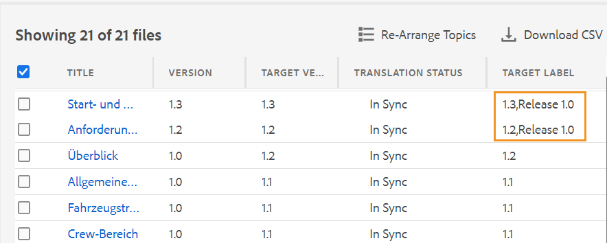

# Traduire des documents à partir de l’éditeur Web {#id21BKF0Z0YZF}

>[!TIP]
>
> Il est recommandé d’utiliser cette fonction de traduction de l’éditeur web si vous avez effectué la mise à niveau vers la version de février 2022 as a Cloud Service AEM Guides ou une version ultérieure.

AEM Guides s’accompagne d’une puissante fonctionnalité de l’éditeur web qui vous permet de traduire votre contenu dans plusieurs langues. Vous pouvez créer un projet de traduction, puis ajouter les tâches de traduction au projet de traduction existant. Vous pouvez également créer un projet de traduction multilingue qui comprend des tâches de traduction pour toutes les langues sélectionnées.

>[!NOTE]
>
> Votre administrateur peut configurer l’onglet Gérer \(utilisé pour la traduction\) dans l’éditeur web. Pour plus d’informations, voir *Configuration de la fonction de traduction dans l’éditeur web* dans la section Installation et configuration de l’as a Cloud Service Adobe Experience Manager Guides.

## Avant de commencer

Avant d’exécuter les étapes de cette procédure, assurez-vous d’avoir créé la racine de langue et les dossiers cibles requis.

1. Créez un dossier racine pour stocker le contenu source. Le dossier racine doit être créé avec le nom de langue \(par exemple, Anglais\) ou le code de langue \(en\).
1. Créez les dossiers de destination vers lesquels vous souhaitez traduire votre contenu. Par exemple, si vous souhaitez traduire votre contenu en allemand ou en français, vous devez créer un dossier nommé -de \(pour allemand\) ou -fr \(pour français\).

>[!NOTE]
>
> Le dossier racine et les dossiers de destination doivent être créés au même niveau.

## Créer un projet de traduction

1. Dans le panneau **Repository**, ouvrez le fichier de mappage DITA en mode Carte.
1. Cliquez sur l’onglet **Gérer** . Le **panneau de traduction** affiche les groupes de langues disponibles.

1. En tant qu’utilisateur, vous pouvez afficher les groupes de langues configurés pour votre profil de dossier. Les groupes linguistiques affichent les dossiers de langue avec leurs codes de langue. Par exemple, le groupe de langues nommé G1 contient des dossiers de langue Italien \(it\), Allemand \(de\), Français \(fr\) et Anglais \(en\).

   {width="300" align="left"}

   *Sélectionnez les groupes de langues ou les langues dans lesquels vous souhaitez traduire vos documents.*

   >[!IMPORTANT]
   >
   > Vous pouvez uniquement sélectionner et traduire dans les langues pour lesquelles vous avez créé le dossier cible parallèlement à la langue source. Un dossier de langue créé à un autre niveau, tel qu’un niveau inférieur du dossier de langue source, n’est pas non plus affiché. Veillez à créer tous vos dossiers de langue cible au même niveau que votre dossier de langue source.

1. Vous pouvez sélectionner n’importe quel groupe de langues comme cible pour la traduction. Si vous **Tout sélectionner**, les fichiers sélectionnés sont traduits dans toutes les langues disponibles dans les groupes de langues existants.

   L’option du dossier de langue apparaît grisé et affiche un signe d’avertissement :

   - Si le dossier cible d’une langue est manquant.
   - Si la langue cible est la même que la source.

   >[!NOTE]
   >
   > Si vous créez le dossier cible d’une langue après avoir créé le groupe de langues, actualisez le navigateur afin d’activer la langue dans les groupes de langues.

1. Si vous choisissez une langue particulière, elle apparaît comme étant sélectionnée sous tous les groupes de langues que vous avez sélectionnés. Donc, quand vous traduisez dans n&#39;importe quelle langue, elle est traduite en une seule fois pour tous les groupes de langues. Par exemple, si l’allemand est présent dans les groupes de langue G1 et G2, il est sélectionné pour les deux.

1. Dans **Other languages**, vous pouvez choisir n’importe quelle langue pour laquelle vous avez créé le dossier cible, mais ne fait partie d’aucun groupe de langues.

1. Vous pouvez également sélectionner l’une des options suivantes pour traduire votre projet :

   **None** Sélectionnez cette option pour traduire les versions par défaut des fichiers. Cette option est sélectionnée par défaut.

   **Utiliser la ligne de base :** Vous pouvez sélectionner une ligne de base pour traduire votre projet. Cliquez sur Utiliser la ligne de base et choisissez une ligne de base créée sur la carte. Tous les fichiers qui font partie de la ligne de base sélectionnée sont affichés dans la page Traduction. Une fois votre contenu traduit, vous pouvez exporter la ligne de base traduite. Pour plus d’informations sur l’exportation de la ligne de base traduite, voir [Exportation de la ligne de base traduite](generate-output-use-baseline-for-publishing.md#id196SE600GHS).

   **Utiliser la dernière version comme sur** : choisissez de filtrer la version des rubriques en fonction de leur date et heure de création. Lorsque vous sélectionnez une date et une heure, seule la dernière version des fichiers créés avant ou après la date et l’heure sélectionnées s’affiche.

1. Cliquez sur **Apply**. Une liste contenant les détails des rubriques et des ressources associées s’affiche.
1. Sélectionnez les rubriques que vous souhaitez envoyer pour traduction. Vous pouvez également utiliser les options de filtrage des rubriques pour les colonnes suivantes :

   - **Titre** : titre du fichier source.  Passez la souris sur le titre du fichier source pour afficher le titre du fichier cible ou du fichier traduit.
   - **Nom de fichier** : nom du fichier source
   - **Type de fichier** : type du fichier source. Les options disponibles sont Carte, Rubrique et Image.
   - **Type de référence** : références directes ou indirectes
   - **Version** : numéro de version du fichier source
   - **Version Label** : libellé de la version sélectionnée du fichier source.
   - **Version cible** : numéro de version du fichier cible
   - **Document State** : état du fichier source. Les options disponibles sont Version préliminaire, In-Review et Review.
   - **Langue cible** : la langue vers laquelle vous souhaitez traduire le fichier source.
   - **État de traduction** : les options disponibles sont : Désynchronisé, Copie manquante, En cours et Synchronisé.
   - **Étiquette cible** : libellé de la version sélectionnée du fichier cible.
1. Cliquez sur **Envoyer pour traduction** dans le coin supérieur droit.

   {width="800" align="left"}

1. Dans la liste déroulante, sélectionnez **Créer un projet de traduction**.

   {width="350" align="left"}

   Outre un nouveau projet de traduction, vous pouvez également sélectionner l’une des options suivantes :

   - Vous pouvez choisir de **créer une structure** uniquement pour le projet de traduction.
   - Vous pouvez choisir de **Créer un projet de traduction XLIFF** pour convertir le contenu XML au format XLIFF (XML Localization Interchange File Format). XLIFF est un format XML ouvert utilisé pour normaliser le transfert de données entre différents outils utilisés dans le processus de traduction de contenu. AEM Guides prend en charge XLIFF version 1.2.
Dans un projet XLIFF, le contenu est exporté au format XLIFF standard du secteur, qui peut être fourni aux fournisseurs de traduction. Le format XLIFF permet la réutilisation potentielle des segments que vous avez déjà traduits lors de la phase de traduction.\
     Une fois le contenu XLIFF traduit, il peut être importé dans AEM Guides, créant ainsi une version traduite du projet DITA d’origine.

     >[!NOTE]
     >
     > L’exportation XLIFF fonctionne uniquement avec la configuration de traduction humaine.

   - Vous pouvez sélectionner **Créer un projet de traduction multilingue** qui inclura des tâches de traduction pour toutes les langues que vous avez sélectionnées pour traduction. Par exemple, si vous avez sélectionné le français, l’allemand et l’espagnol, un projet contenant des tâches de traduction pour les trois langues sera créé.
   - Si vous disposez déjà d’un projet de traduction, vous pouvez ajouter des rubriques à ce projet. Sélectionnez Ajouter à **Projet de traduction existant** dans la liste Projet et choisissez un projet dans la liste Projet de traduction existant. Vous pouvez trier ces projets par ordre croissant ou décroissant le plus récent.

- Si vous sélectionnez **Projet de traduction existant**, cette opération met à jour l’entrée de ressource existante dans le projet si la ressource est déjà ajoutée et que l’état de la tâche de traduction associée est à l’état *Brouillon*.
   - Si la langue de destination n’est pas présente dans le projet, un nouveau projet est créé pour le projet de traduction en une seule langue et une nouvelle tâche est créée pour le projet de traduction multilingue.
   - Si la tâche est déjà présente pour la langue de destination et que l’état de la tâche n’est pas à l’état *Brouillon* , une nouvelle tâche est créée dans le même projet pour ajouter les ressources à traduire.

  >[!NOTE]
  >
  > Si votre projet existant est un projet de définition de la portée, &quot;\(Portée\)&quot; est ajouté dans son nom.

- Si vous devez créer la portée d’un projet à traduire, vous pouvez sélectionner **Créer un nouveau projet de traduction de définition de la portée**. Cela n’enverra pas les copies à traduire et l’état de traduction d’origine des fichiers est conservé. Il n’y a aucun impact sur la copie de langue de destination des rubriques référencées qui sont envoyées pour la définition de la portée.
1. Dans le champ **Titre du projet**, saisissez un titre pour le projet.
1. Cliquez sur **Créer** pour créer un projet de traduction.

   Un nouveau projet de traduction est créé avec la version sélectionnée des rubriques. À l’heure actuelle, un message contextuel s’affiche, confirmant que le projet de traduction a été créé. Une fois que toutes les copies de langue cible sont disponibles dans le projet de traduction, vous recevez une notification dans la boîte de réception. Une fois que les copies de langue cible sont disponibles dans le projet de traduction, vous pouvez poursuivre et lancer la tâche de traduction. Pour plus d’informations, voir [Démarrage de la tâche de traduction](translation-first-time.md#id225IK030OE8).

   >[!NOTE]
   >
   > Si vous rejetez la traduction d’une ou de plusieurs rubriques dans une tâche de traduction, l’état de traduction **En cours** de toutes les rubriques rejetées revient à leur état d’origine. L’état des rubriques référencées est vérifié et rétabli en fonction de l’état de traduction le plus récent. En outre, les fichiers de traduction créés dans le projet de destination ne sont pas supprimés même si la traduction est refusée pour eux.

## Ajout de règles de traduction

AEM Guides permet à vos administrateurs de configurer les règles de traduction. Le format SRX (Segmentation Rules exchange) est une norme permettant d’échanger des règles de segmentation entre différents utilisateurs et différents environnements de traduction. Vous pouvez créer un dossier et y ajouter vos fichiers SRX personnalisés.

Les fichiers SRX doivent être nommés `<language-code>.srx`. Par exemple, en-US ou ar-AE.

>[!NOTE]
>Le titre n’est pas sensible à la casse. Vous pouvez donc avoir &quot;en-US&quot;, &quot;en-us&quot; ou &quot;EN-us&quot;. En outre, AEM guides peuvent résoudre &quot;-&quot; (trait d’union) ou &quot;_&quot; (trait de soulignement). Vous pouvez donc avoir &quot;en-US&quot; ou &quot;en_US&quot;.

Vous pouvez également placer ces fichiers dans n’importe quel dossier sous AEM racine de ressources `./content/dam`.

Une fois que vous avez créé le dossier contenant les fichiers SRX, vous pouvez ajouter le chemin d’accès au dossier dans la configuration de l’emplacement de Traduction SRX dans votre profil de dossiers.

Pour de meilleures performances, il est recommandé de ne conserver que les fichiers SRX dans le dossier configuré dans le profil de dossiers.

AEM Guides sélectionne les règles SRX en fonction de la langue source du projet de traduction. Il recherche un fichier SRX personnalisé pour une langue. Si vous ne définissez pas de fichier SRX personnalisé, il sélectionne les règles conformément aux règles de traduction prêtes à l’emploi.

Pour plus d’informations sur la configuration des profils globaux et de niveau dossier, voir la section *Configurer les modèles de création* dans Installation et configuration d’Adobe Experience Manager Guides as a Cloud Service.

## Transmettre le libellé de la version à la version cible

AEM Guides permet de transmettre le libellé du fichier source au fichier cible. Vous pourrez ainsi identifier facilement la version source du fichier traduit.

Pour ajouter le libellé de la version source dans la copie cible, votre administrateur système doit sélectionner l’option **Propager les libellés de version source à la version cible** sous l’onglet **Traduction** dans les **Paramètres de l’éditeur**.

Par exemple, si certains fichiers source sont associés à l’étiquette de version `Release 1.0`, vous pouvez également transmettre l’étiquette source \(`Release 1.0`\) au fichier traduit.

{width="650" align="left"}

>[!NOTE]
>
> Le libellé source n&#39;est joint qu&#39;à une seule version cible. Si vous déplacez le libellé source vers une autre version, il est automatiquement repris dans le dernier libellé cible.

## Afficher la différence de version pour les fichiers de désynchronisation 

AEM Guides fournit la fonctionnalité permettant de vérifier les différences entre la version sélectionnée et la dernière version source traduite des rubriques. Vous pouvez choisir de traduire les fichiers **Out of Sync** en fonction des modifications apportées.

{width="650" align="left"}

Sélectionnez l’icône **Afficher la différence**\(\) pour une rubrique afin d’afficher les différences entre la dernière version traduite et la version actuelle du fichier sélectionné.

>[!NOTE]
>
> **Afficher la différence** L’icône \(\) s’affiche uniquement pour les fichiers DITA dont l’état de traduction est **Désynchronisé**.

La boîte de dialogue **Différence de version** s’affiche. Il affiche la **Dernière version traduite** et le numéro de la **Version sélectionnée** sur la gauche. La fenêtre d’aperçu affiche les différences entre la dernière version traduite et la version sélectionnée de la rubrique.

{width="650" align="left"}

## Ignorer les ressources désynchronisées

Si vous apportez des modifications à certaines ressources, celles-ci deviennent désynchronisées. Vous pouvez soit retraduire les ressources modifiées, soit choisir d’ignorer l’état Désynchronisé . Par exemple, si vous avez apporté des modifications très mineures qui n’ont vraiment pas besoin de traduction, vous pouvez marquer leur état sur Synchronisé.

Pour ignorer l’état de désynchronisation, procédez comme suit :

1. Sélectionnez les ressources désynchronisées pour lesquelles vous souhaitez modifier l’état.
1. Sélectionnez le bouton **Marquer dans la synchronisation** \(\) en haut. La boîte de dialogue **Marquer dans la synchronisation** s’affiche.

   {width="550" align="left"}

1. Cliquez sur **Forcer la synchronisation**. Elle définit l’état sur En synchronisation pour les ressources désynchronisées sélectionnées.

>[!NOTE]
>
> Le bouton **Marquer dans la synchronisation** \(\) s’affiche uniquement pour les ressources dont l’état de traduction est Désynchronisé.

## Projets de traduction Afficher en cours pour une carte ou une rubrique

Certaines des références de votre tableau de bord de traduction peuvent être à l’état en cours. Ces références comportent un lien **En cours** sous la colonne **État de traduction**. Lorsque vous cliquez sur le lien, la boîte de dialogue **Projets en cours** s’ouvre. Dans la boîte de dialogue, vous pouvez voir la liste de tous les projets de traduction en cours \(avec la langue cible\) qui contiennent la référence sélectionnée.

>[!NOTE]
>
> Vous pouvez voir le lien En cours pour les projets traduits créés dans AEM Guides as a Cloud Service en février 2023 ou version ultérieure.

Cliquez sur le nom de la référence dans la boîte de dialogue pour l’ouvrir en mode aperçu. Vous pouvez également cliquer sur le projet de traduction pour commencer la traduction.

{width="550" align="left"}

## Supprimer ou désactiver automatiquement un projet de traduction terminé

>[!NOTE]
> 
>Cette fonctionnalité est disponible pour les nouveaux projets de traduction que vous créez à l’aide de la version Experience Manager Guides 2404 ou ultérieure.  Cela n’aura aucune incidence sur les projets existants.

Votre administrateur peut configurer l’option **Nettoyage du projet de traduction à la fin** sous l’onglet **Traduction** dans **Paramètres de l’éditeur** pour désactiver ou supprimer automatiquement les projets de traduction.

Pour la gestion des documents, Experience Manager Guides permet de supprimer les projets de traduction une fois la traduction terminée.

Vous pouvez également désactiver les projets de traduction si vous souhaitez les utiliser ultérieurement. La suppression d’un projet supprime tous les fichiers et dossiers présents dans le projet. La désactivation d’un projet ne le supprime pas, mais le conserve dans le référentiel. Vous ne pouvez toutefois pas mettre à jour ou modifier un projet désactivé.  La suppression ou la désactivation d’un projet n’a aucune incidence sur l’état de traduction des références.

**Rubrique parente :**[ Utilisation de l’éditeur web](web-editor.md)
