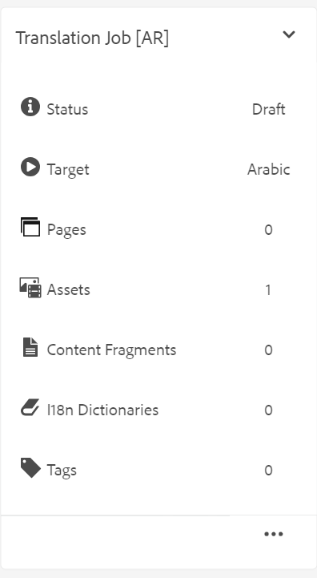

# Traduire les rubriques modifiées {#id16A5A0B6072}

Si vous apportez des modifications à certains sujets, alors ces sujets doivent être retraduits. Vous pouvez suivre les rubriques modifiées à partir du plan DITA. Dans le dossier de copie de la langue source, sélectionnez le fichier de mappage DITA dans la console de mappage et sélectionnez l&#39;onglet Traduction . Vous pouvez afficher le statut de chaque rubrique, qu’elle nécessite une retraduction ou non.

Effectuez les étapes suivantes pour envoyer une rubrique modifiée pour retraduction :

1. Sélectionnez le fichier de mappage DITA dans le dossier de copie de la langue source de la **Console de mappage** dans l&#39;éditeur.

1. Sélectionnez l’onglet **Traduction** .

1. Dans le panneau **Traduction** sur la gauche, sélectionnez les **Langues disponibles** dont vous souhaitez vérifier le statut et sélectionnez **Appliquer**.

   Vous pouvez afficher le statut de la traduction pour chaque rubrique. Les rubriques pour lesquelles une autre révision de la rubrique est disponible que celle envoyée pour traduction affichent un statut **Désynchronisé**.

   >[!NOTE]
   >
   > Le workflow de traduction compare la dernière révision enregistrée du fichier de rubrique dans le dossier de langue source avec la version traduite.

   Si vous sélectionnez la flèche pour afficher plus de détails, vous pouvez afficher la copie de langue spécifique qui n’est pas synchronisée.

   {align="left"}

1. Cochez la case pour sélectionner les rubriques à envoyer pour une nouvelle traduction.

   Lorsque vous sélectionnez une rubrique désynchronisée, le bouton **Marquer comme synchronisé** s’affiche au-dessus de la barre de titre.

   Vous pouvez utiliser le bouton **Marquer comme synchronisé** pour remplacer le statut Désynchronisé pour les rubriques dans le plan DITA.  Par exemple, si vous avez apporté des modifications très mineures qui n’ont pas vraiment besoin d’être traduites, vous pouvez marquer leur statut sur Synchronisé.

   >[!NOTE]
   >
   > Si vous sélectionnez le bouton **Marquer comme synchronisé**, il définit le statut de la rubrique sur Synchronisé pour les rubriques désynchronisées sélectionnées.

1. Vous pouvez sélectionner le bouton **Envoyer pour traduction**.

1. Vous pouvez choisir de créer un projet de traduction ou d’ajouter des rubriques à un projet de traduction existant. Fournissez les détails requis pour configurer le projet de traduction.

1. Sélectionnez **Envoyer**.

   Un message de confirmation s’affiche indiquant que la rubrique a été envoyée pour traduction.

1. Accédez au projet de traduction dans la console Projet. Une nouvelle carte de tâche de traduction est créée dans le dossier . Sélectionnez les points de suspension pour afficher les ressources du dossier.

   {width="300" align="left"}

1. Pour commencer la traduction, cliquez sur la flèche sur la carte Tâche de traduction et sélectionnez **Démarrer** dans la liste. Un message indique que le traitement a commencé.

   Vous pouvez également consulter le statut de la rubrique traduite en sélectionnant les points de suspension en bas de la carte Tâche de traduction .

   >[!NOTE]
   >
   > Si vous utilisez le service de traduction humaine, vous devez exporter le contenu pour le traduire. Une fois que vous disposez du contenu traduit, vous devez le réimporter dans le projet de traduction.

1. Une fois la traduction terminée, le statut passe à **Prêt pour la révision**. Sélectionnez les points de suspension pour afficher les détails de la rubrique et effectuez l’une des opérations suivantes dans la barre d’outils :

   - Sélectionnez **Afficher dans Assets** pour afficher et vérifier la traduction.

   - Sélectionnez **Accepter la traduction** si vous pensez que les modifications ont été correctement traduites. Un message de confirmation s’affiche.

   - Sélectionnez **Rejeter la traduction** si vous pensez que la tâche doit être refaite. Un message de rejet s’affiche.

   >[!NOTE]
   >
   > Il est important d’accepter ou de rejeter la ressource traduite, sinon le fichier reste à l’emplacement temporaire et n’est pas copié dans la gestion des ressources numériques.

1. Revenez au fichier de mappage DITA dans le dossier de langue source dans l’interface utilisateur d’Assets. Les rubriques retraduites sont désormais synchronisées.

**Rubrique parente :**[ Présentation de la traduction de contenu](translation.md)
