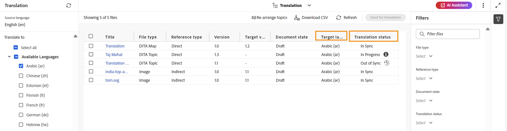

# Afficher le statut de la traduction {#id169SEK00KOW}

Vous pouvez afficher le statut de traduction et les copies de langue traduites pour chaque rubrique dans un plan DITA.

Pour afficher le statut de traduction d&#39;un plan DITA, procédez comme suit :

1. Accédez au fichier de mappage DITA requis via la **console de mappage** dans l&#39;éditeur.
1. Sélectionnez l’onglet **Traduction** .
1. Dans le panneau **Traduction** à gauche, archivez la langue de la liste **Langues disponibles** dont vous souhaitez vérifier le statut, puis sélectionnez **Appliquer**.
1. Toutes les rubriques dont la langue cible est sélectionnée s’affichent avec la   statut de la traduction.

   >[!NOTE]
   >
   > Vous pouvez filtrer davantage le contenu en fonction de son statut de traduction \(comme Copie manquante non synchronisée, En cours, ou Synchronisé\), de son type de Source \(comme Tous, DITA, plan DITA ou Ressource\) et de sa date de modification. De plus, vous pouvez saisir des mots-clés pour rechercher des sujets spécifiques. Vous pouvez utiliser **Actualiser** pour mettre à jour le statut si des modifications ont été apportées.

   {align="left"}

**Rubrique parente :**&#x200B;[ Présentation de la traduction de contenu](translation.md)
