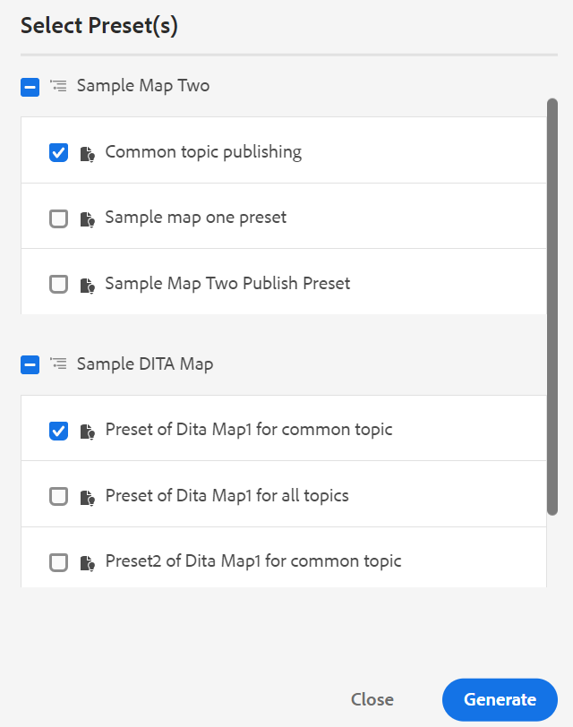
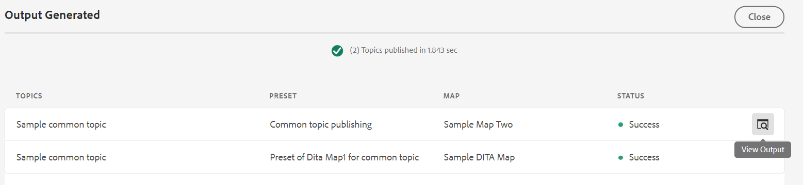
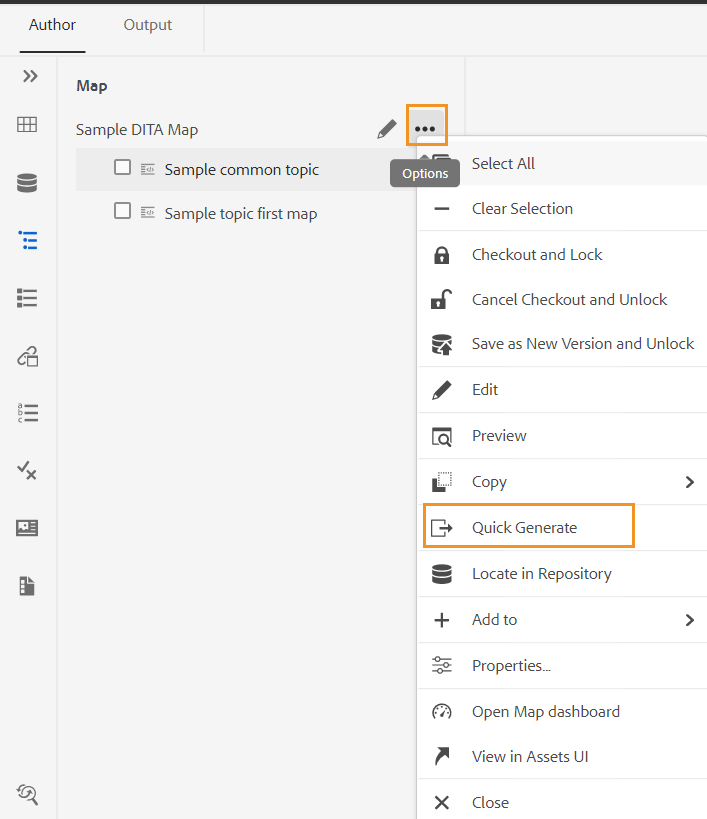

# Générez une sortie à partir du panneau Référentiel ou du panneau Vue Carte . {#id218CL6010AE}

>[!NOTE]
>
> Le panneau Génération rapide, auparavant disponible dans Adobe Experience Manager Guides, est obsolète à partir des versions 4.0 et 2502. Vous ne pouvez pas accéder au panneau Génération rapide pour générer une sortie à partir du panneau Référentiel ou du panneau Vue Carte .

Vous pouvez également utiliser les paramètres prédéfinis de sortie créés pour votre plan DITA afin de générer une sortie à partir du panneau Référentiel ou du panneau Vue du plan.

- Utilisez la fonction **Génération rapide** du panneau Référentiel ou du panneau Vue Carte pour générer une sortie pour la rubrique unique sélectionnée ou l&#39;ensemble du plan DITA.

  >[!NOTE]
  >
  > Vous pouvez également accéder à la fonction **Génération rapide** à partir du panneau Favoris ou du panneau de recherche.

- Utilisez la fonction **Générer la sortie** du panneau Vue Carte pour générer la sortie des différentes rubriques sélectionnées.

## Publication d&#39;une rubrique utilisée dans un ou plusieurs plans DITA

Effectuez les étapes suivantes pour générer une sortie pour une ou plusieurs rubriques de votre plan DITA :

1. Dans l&#39;onglet **Auteur**, sélectionnez la rubrique de votre plan DITA que vous souhaitez publier.

1. Sélectionnez **Génération rapide** dans le menu Options de la rubrique sélectionnée.
   {width="650"}

1. Pour publier une rubrique utilisée dans un seul plan DITA, sélectionnez les paramètres prédéfinis de sortie du plan que vous souhaitez utiliser pour publier, puis cliquez sur **Générer**.
   {width="350"}

1. Vous verrez le statut du processus de génération de sortie. Pour afficher la sortie, placez le pointeur de la souris sur la rubrique et cliquez sur Afficher la sortie.

1. Si une rubrique commune est utilisée dans plusieurs rubriques, sélectionnez les différents plans DITA ainsi que les paramètres prédéfinis de sortie à utiliser pour la publication, puis cliquez sur **Générer.**

   {width="350"}

1. Vous verrez le statut du processus de génération de sortie.

   - **Rubriques** : répertorie les rubriques sélectionnées pour lesquelles une sortie est générée.
   - **Paramètre prédéfini** : affiche les paramètres prédéfinis de sortie qui contiennent les rubriques sélectionnées.
   - **Map** : répertorie les plans DITA contenant la rubrique sélectionnée.
   - **Statut** : affiche le statut de publication de chaque rubrique.
Pour afficher la sortie, placez le pointeur de la souris sur la rubrique et cliquez sur Afficher la sortie.
     

## Générer la sortie d&#39;un plan DITA à partir de l&#39;éditeur Web

Effectuez les étapes suivantes pour générer une sortie pour l&#39;ensemble du plan DITA :

1. Dans l&#39;onglet **Auteur**, sélectionnez le plan DITA que vous souhaitez publier.

1. Sélectionnez **Génération rapide** dans le menu Options de votre plan DITA.

   {width="650"}

1. Sélectionnez les paramètres prédéfinis de sortie de votre plan DITA que vous souhaitez utiliser pour publier, puis cliquez sur **Générer.**

1. Vous verrez le statut du processus de génération de sortie. Pour afficher la sortie, placez le pointeur de la souris sur la rubrique et cliquez sur Afficher la sortie.

## Générer une sortie pour plusieurs rubriques

Effectuez les étapes suivantes pour générer une sortie pour plusieurs rubriques de votre plan DITA à partir du panneau Vue Carte :

1. Dans l’onglet **Auteur**, sélectionnez les rubriques que vous souhaitez publier.

1. Sélectionnez **Générer la sortie** dans le menu Options en bas.

1. Sélectionnez le paramètre prédéfini de sortie du plan DITA que vous souhaitez utiliser pour publier.

   >[!NOTE]
   >
   > Seuls les paramètres prédéfinis de sortie du plan DITA actuel contenant toutes les rubriques sélectionnées s&#39;affichent.

   {width="650"}

1. Vous verrez le statut du processus de génération de sortie.Pour afficher la sortie, placez le pointeur de la souris sur la rubrique et cliquez sur Afficher la sortie.

**Rubrique parente :**[ Publication basée sur des articles dans l’éditeur web](web-editor-article-publishing.md)
