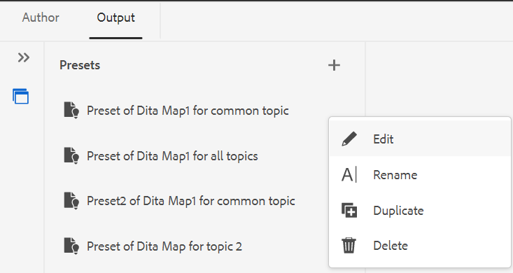

# Création de paramètres prédéfinis de sortie à partir de l’éditeur web {#id218CL400JW3}

Effectuez les étapes suivantes pour créer des paramètres prédéfinis de sortie pour votre mappage DITA :

1. Dans l’interface utilisateur d’Assets, accédez au fichier de mappage à modifier.

1. Pour obtenir un verrou exclusif sur le fichier map, sélectionnez le fichier map et cliquez sur **Extraire**.

1. Sélectionnez la variable **Modifier les rubriques** dans le menu d’actions du fichier map.

   Le fichier de mappage est ouvert pour modification dans l’éditeur web.

   >[!NOTE]
   >
   > Vous pouvez ajouter ou supprimer une rubrique du mappage à l’aide de l’éditeur de mappage avancé. Pour plus d’informations, voir [Utilisation de l’éditeur de mappage avancé](map-editor-advanced-map-editor.md#).

1. Dans le **Sortie** sélectionnez l’icône + pour créer un paramètre prédéfini de sortie pour votre mappage DITA.

   {width="350" align="left"}

1. Saisissez le nom du paramètre prédéfini dans la boîte de dialogue Ajouter un paramètre prédéfini , puis cliquez sur **Ajouter**.

1. Saisissez les détails de configuration suivants.

   1. Sélectionnez les options requises dans la **Général** . Vous pouvez choisir de créer un paramètre prédéfini de sortie avec ou sans conditions. Vous pouvez également utiliser un fichier DITVAL. AEM Guides vous permet également de sélectionner une ligne de base pour publier une version spécifique de votre mappage DITA.
   1. Saisissez les détails AEM site dans la **AEM** . **Site** affiche la liste des AEM Sites disponibles dans votre référentiel AEM. **Catégorie**, **Modèle de section**, et **Modèle d’article** sont les composants structurels utilisés pour organiser l’aspect de votre sortie. Elles sont prédéfinies dans le modèle Site AEM.

      >[!NOTE]
      >
      > Actualisez chaque liste déroulante pour obtenir la classification supplémentaire dans la liste déroulante suivante.

   1. Dans la **Articles** , sélectionnez les rubriques pour lesquelles vous souhaitez générer la sortie.
1. Sélectionnez la variable **Générer un paramètre prédéfini** dans la partie supérieure pour générer la sortie.

   {width="800" align="left"}

1. Vous verrez l’état du processus de génération de sortie. La variable **Sujets** La colonne répertorie les rubriques pour lesquelles une sortie est générée pendant que la fonction **État** affiche l’état de publication de chaque rubrique.

   Pour afficher la sortie, placez le pointeur de la souris sur la rubrique et cliquez sur Afficher la sortie.

   {width="800" align="left"}

>[!NOTE]
>
> Vous pouvez également modifier, renommer, dupliquer ou supprimer un paramètre prédéfini de sortie existant dans le menu Options.

{width="550" align="left"}

**Rubrique parente :**[ Publication basée sur des articles à partir de l’éditeur web](web-editor-article-publishing.md)
