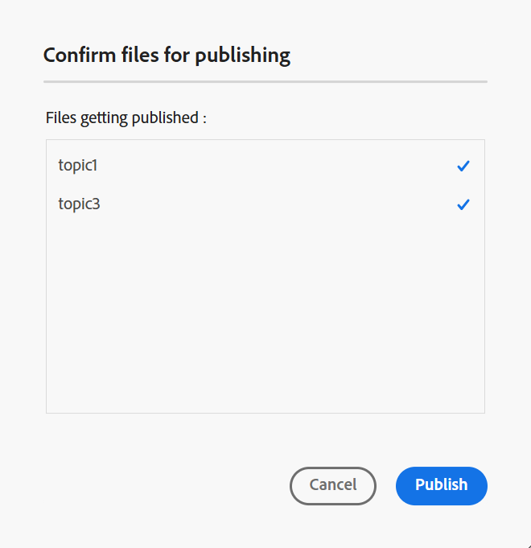

# Générer une sortie de la base de connaissances {#id218CL05J0M1}

Adobe Experience Manager Guides s’accompagne d’une fonctionnalité de publication d’articles qui permet aux utilisateurs de publier simultanément un ou plusieurs articles de la base de connaissances.

Ce moteur est également fourni avec un modèle de contenu prêt à l’emploi, qui repose sur les composants principaux de Adobe Experience Manager, et qui permet aux utilisateurs et aux utilisatrices de créer un référentiel de contenu technique basé sur les connaissances. Ce modèle peut être personnalisé en fonction des besoins des clients. Ce moteur permet aux utilisateurs de créer le plan DITA de manière additive et de publier des rubriques au fur et à mesure qu&#39;elles sont prêtes.

Si vous n&#39;avez mis à jour le contenu que pour quelques rubriques de votre plan DITA, il n&#39;est pas toujours nécessaire de publier le plan entier. Vous pouvez sélectionner et publier uniquement les rubriques mises à jour.

Pour la publication d&#39;articles, vous devez créer le paramètre prédéfini de sortie de votre plan DITA de la base de connaissances. Votre carte doit inclure les rubriques que vous souhaitez publier. Vous pouvez également appliquer des conditions et spécifier les détails AEM Sites pour le paramètre prédéfini de sortie. Vous pouvez ensuite générer une sortie à l’aide de la fonction **Générer la sortie**.

Effectuez les étapes suivantes pour générer une sortie basée sur un article :

1. [Créez le paramètre prédéfini de la base de connaissances](./generate-output-knowledge-base.md) pour une sortie basée sur des articles.
1. Accédez à l’onglet **Articles** et sélectionnez les rubriques pour lesquelles vous souhaitez générer la sortie.
1. Sélectionnez **Générer la sortie** en haut pour générer la sortie.

   {width="800" align="left"}

1. Dans l’invite **Confirmer les fichiers à publier**, sélectionnez les fichiers à publier et confirmez en sélectionnant **Publier**.

   {width="800" align="left"}

   Vous verrez l’état du processus de génération de sortie. La colonne **Rubriques** répertorie les rubriques pour lesquelles une sortie est générée tandis que la colonne **Statut** affiche le statut de publication de chaque rubrique.

   {width="800" align="left"}

   Pour afficher la sortie, fermez la boîte de dialogue **Sortie générée** et sélectionnez **Afficher la sortie** sur la page du paramètre prédéfini.

   >[!NOTE]
   >
   > Vous pouvez également Renommer, Dupliquer ou Supprimer un paramètre prédéfini de sortie existant à partir du menu Options.

**Rubrique parente :**[ Utiliser l’éditeur](web-editor.md)
