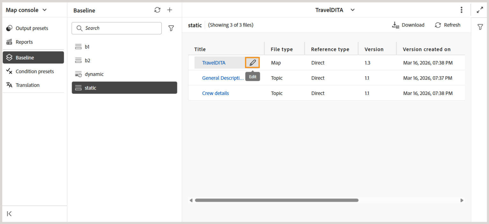
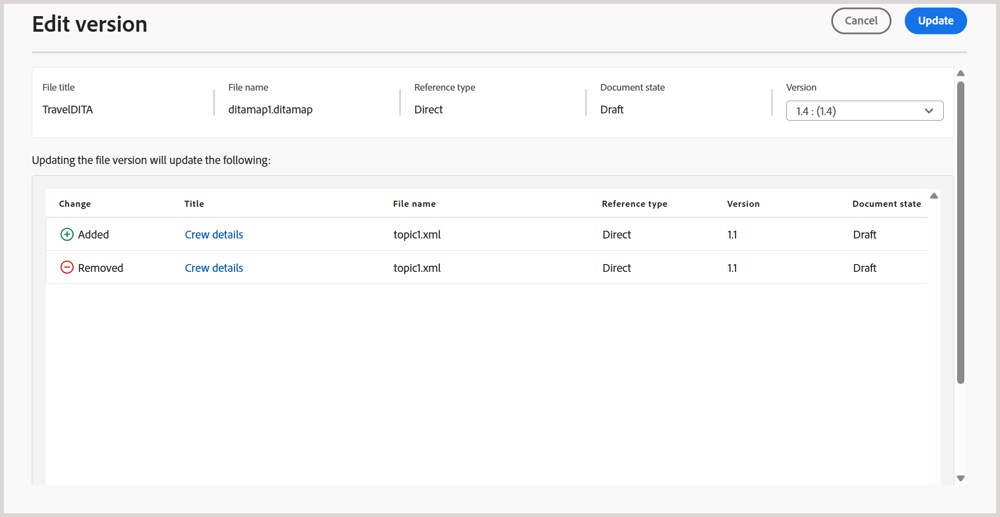

# Nouvelle ligne de base (Beta) dans Experience Manager Guides

>[!NOTE]
>
> Cet article s’applique à la nouvelle ligne de base , actuellement disponible en tant que fonctionnalité *Beta*, qui offre des performances améliorées et une stabilité disponible avec la version Experience Manager Guides 2026.03.0. Pour activer la nouvelle fonctionnalité de base dans votre configuration, contactez l’équipe du succès client.

La nouvelle fonctionnalité de base résout les problèmes critiques de fiabilité et de performances associés aux cartes volumineuses et complexes. Il s’accompagne d’une architecture de base repensée qui offre une expérience de base plus rapide, plus stable et plus cohérente.

Le nouveau modèle de ligne de base renforce la gestion des lignes de base en abordant les points faibles courants :

- Chargement lent et faible réactivité lorsque les lignes de base sont volumineuses
- États de référence incohérents causés par des mises à jour partielles ou des échecs de validation
- Visibilité et contrôle limités lors de la gestion d’un contenu de base étendu
- Goulets d’étranglement des performances lors de la création, des mises à jour ou des reconstructions de la ligne de base

Les sections suivantes décrivent le nouveau modèle de ligne de base, y compris les améliorations qu’il apporte, les changements de comportement clés à prendre en compte avant la migration et les instructions pour migrer vers et utiliser la nouvelle ligne de base :

- [Améliorations clés ajoutées à la nouvelle ligne de base](#key-enhancements-introduced-in-the-new-baseline)
- [Changement de comportement à connaître avant de migrer vers la nouvelle ligne de base](#behavior-changes-to-know-before-migrating-to-the-new-baseline)
- [Migrer vers la nouvelle ligne de base](#migrate-to-new-baseline)
- [Utiliser la nouvelle ligne de base](#use-the-new-baseline)

## Améliorations clés ajoutées à la nouvelle ligne de base

La nouvelle ligne de base introduit des améliorations importantes qui rendent la gestion de la ligne de base plus rapide et plus facile à mettre à l&#39;échelle sans modifier votre façon de travailler. Envisagez de passer à la nouvelle ligne de base pour :

- **Performances et évolutivité améliorées :** le modèle de données de base et le comportement de rendu ont été optimisés pour évoluer efficacement avec des lignes de base volumineuses, à l’aide d’un chargement incrémentiel et d’une structure de données rationalisée afin d’améliorer la réactivité.
- **Amélioration de la cohérence de l’interface utilisateur et du serveur principal** : toutes les modifications apportées à une ligne de base (telles que les mises à jour de version ou de dépendance) sont désormais répercutées dans l’interface utilisateur uniquement après la validation réussie du serveur principal, ce qui empêche la création de lignes de base non valides.
- **Filtrage, tri et navigation :** les lignes de base prennent en charge le filtrage complet sur plusieurs attributs, notamment l’état du document, les libellés, le type de fichier, le type de référence et la recherche basée sur un GUID sur l’ensemble de la ligne de base. La pagination est prise en charge pour les lignes de base volumineuses, avec une option permettant d’inclure des fichiers sans libellés.
- **Visibilité claire de l’impact sur les dépendances :** l’impact sur les dépendances (pour les dépendances ajoutées ou supprimées) s’affiche en tant qu’aperçu avant l’application des modifications de version, ce qui vous permet de vérifier les modifications avant de les appliquer.
- **Gestion des libellés plus flexible :** les libellés peuvent être déplacés entre les versions d’une ligne de base, ce qui offre une plus grande flexibilité lors de la gestion des libellés dans différentes versions de rubrique.
- **** Comportement de modification et d’enregistrement déterministe : les modifications de ligne de base prennent en charge les mises à jour au niveau des lignes, chargent les données gourmandes en ressources (telles que les arborescences de versions et les différences de dépendance) uniquement lors des mises à jour de version et terminent les opérations d’enregistrement de manière déterministe en une seule étape, ce qui réduit les échecs d’enregistrement inattendus et les mises à jour partielles.
- **Création de lignes de base plus fiable :** les lignes de base sont créées à l’aide de données de référence stockées plutôt que d’une analyse d’exécution, avec les informations de version requises validées au préalable pour éviter les lignes de base incomplètes ou non valides.
- **Prise en charge des API et de l’automatisation :** le nouveau modèle de référence est entièrement pris en charge par le biais des API REST et de Java SDK, ce qui permet l’automatisation et l’intégration avec des workflows externes.

## Changement de comportement à connaître avant de migrer vers la nouvelle ligne de base

Avant de migrer vers le nouveau modèle de ligne de base, passez en revue les changements de comportement suivants. Ces modifications affectent la façon dont les lignes de base sont créées, mises à jour et gérées, et peuvent influencer les workflows existants.

| Aire | Modification (description) |
|------|-------------|
| **Résolution de référence** | Les références de mappage direct sont classées comme **DIRECT**. Les références non valides sont ignorées et les références de `reltable` continuent d’être exclues. |
| **Sélection automatique** | La sélection de version est évaluée immédiatement avant de résoudre les références directes, en garantissant une résolution de version précise. |
| **Règles de création de ligne de base** | La version **1.0** est obligatoire. Les références dont les versions sont manquantes ou ambiguës peuvent se résoudre différemment après la migration. |
| **Gestion de la migration** | Les références non valides sont ignorées. **DIRECT** les références sont prioritaires, les références détachées sont déplacées vers la dernière version et des métadonnées supplémentaires sont ajoutées à partir de la version **5.0**. |
| **Modèle de données de référence** | Le nouveau modèle de ligne de base basé sur un graphique supprime les champs modifiables et n’est pas rétrocompatible avec le modèle de ligne de base précédent. |
| **Utilisation de l’API** | Les opérations de ligne de base sont prises en charge par les API REST et le SDK Java. Les objets de ligne de base bruts ne sont plus exposés. |
| **Purge de version** | Après la migration, la purge de version ne prend en compte que les lignes de base stockées dans le nouveau référentiel de ligne de base. |

## Migrer vers une nouvelle ligne de base

Une fois la fonctionnalité activée dans l’équipe du succès client, vous devez migrer les lignes de base existantes vers la nouvelle ligne de base.

Effectuez les étapes suivantes pour migrer la ligne de base existante vers la nouvelle ligne de base.

1. Sélectionnez le logo Adobe Experience Manager en haut et choisissez **Outils**.
1. Dans le panneau **Outils**, sélectionnez **Guides**.
1. Sélectionnez la mosaïque **Processeur en bloc**.

   {align="left"}

   La page **Guides Bulk Processor** s’affiche.

1. Sélectionnez **Nouveau processus** dans le coin supérieur droit de la page pour démarrer une nouvelle tâche de traitement.

   La boîte de dialogue **Nouveau processus** s’affiche.

1. Fournissez les détails suivants dans la boîte de dialogue :

   1. **Type de fonction** : sélectionnez **Ligne de base** dans la liste déroulante.
   1. **Sélectionner un ou plusieurs dossiers et fichiers)** : naviguez et choisissez un ou plusieurs dossiers et fichiers à traiter.
   1. **Sélectionner le ou les dossiers à ignorer** : éventuellement, sélectionnez des sous-dossiers dans le dossier parent choisi à exclure de la migration.

   {align="left"}

1. Sélectionnez **Créer**.

Une fenêtre pop-up affichant **Le traitement des ressources a été déclenché avec succès** s’affiche. Vous pouvez afficher le statut de la tâche de traitement sur la page.

Vous pouvez également sélectionner **Afficher les journaux** pour vérifier et télécharger les journaux de la tâche de migration.

{align="left"}

Le rapport de journal fournit des détails sur la migration, y compris le nombre de mappages migrés, les lignes de base migrées avec succès et les détails associés.

{align="left"}

>[!NOTE]
>
> Aucune modification de ligne de base ne doit être apportée pendant la migration, en particulier dans les copies de travail, pour éviter les échecs. Après la migration, certaines lignes de base peuvent nécessiter une reconstruction si des versions sont manquantes.

## Utiliser la nouvelle ligne de base

Le nouveau modèle de ligne de base utilise les mêmes workflows et la même interface utilisateur que la fonctionnalité de ligne de base existante dans Experience Manager Guides. Vous pouvez continuer à [Créer et gérer la ligne de base à partir de la console Carte](./web-editor-baseline.md) à l’aide des options disponibles.

>[!NOTE]
>
> Le nouveau modèle de ligne de base ne prend pas en charge la création et la gestion des lignes de base depuis le tableau de bord Mapper.

Cette section décrit uniquement les modifications et améliorations introduites avec le nouveau modèle de ligne de base. Les workflows de base communs restent inchangés, sauf mention explicite.

**Nouvelles options/options améliorées disponibles dans la nouvelle interface utilisateur de base**

Les mises à jour suivantes s&#39;appliquent lorsque vous utilisez des lignes de base créées à l&#39;aide du **nouveau modèle de ligne de base** :

- L&#39;option **Exporter la ligne de base** du menu Options est renommée **Télécharger** pour les lignes de base créées à l&#39;aide de mises à jour manuelles et automatiques.

  

- Les lignes de base dynamiques peuvent être ouvertes directement à partir du panneau **Ligne de base** et gérées à l’aide des actions disponibles dans le menu Options.

  

  Vous pouvez également utiliser les nouvelles options introduites pour les lignes de base dynamiques créées à l&#39;aide du nouveau modèle de ligne de base :
   - **Modifier les propriétés** : permet de modifier les propriétés d&#39;une ligne de base existante.
   - **Reconstruire** : vous permet de reconstruire une ligne de base dynamique à chaque fois que des modifications se produisent.

     {align="left"}

- L’action **Télécharger** prend en charge les téléchargements paginés. Tout le contenu de base correspondant aux filtres appliqués est inclus dans le téléchargement, et pas seulement le contenu visible sur la page active.
- Filtrez les fichiers par GUID, en plus des noms de fichier ou de l’emplacement du fichier. Une option supplémentaire permettant de **filtrer les fichiers sans libellés** est également disponible.

  
- Le nouveau modèle de ligne de base prend en charge la modification déterministe, ce qui vous permet de mettre à jour une référence à la fois avec une résolution de dépendance validée.

  +++Etapes de modification des références d&#39;une nouvelle ligne de base

  Effectuez les étapes suivantes pour apporter des modifications à une ligne de base :

   - Ouvrez la ligne de base à partir du panneau **Ligne de base**.

     La vue tabulaire des références des lignes de base s&#39;affiche.

   - Accédez au fichier à modifier et pointez dessus.
   - Sélectionnez l’icône **Modifier**.

     {align="left"}

     La boîte de dialogue **Modifier la version** s’affiche.
   - Sélectionnez la version requise dans le menu déroulant **Version** (par exemple, passez de la version 1.0 à la version 1.1).

     {align="left"}

     Les dépendances ajoutées et supprimées sont évaluées et affichées en tant qu’aperçu. Examinez les modifications avant de les appliquer.

     

     Si aucune modification de dépendance n’est détectée, un message d’état vide s’affiche.

   - Sélectionnez **Mettre à jour** pour appliquer les modifications.

  La ligne de base est mise à jour avec la version sélectionnée.
  +++
