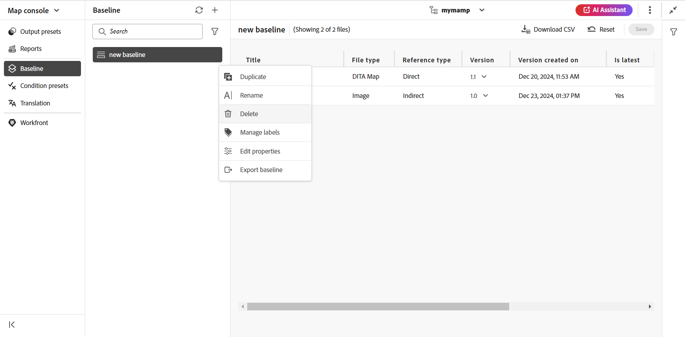

# Création et gestion des lignes de base à partir de l’éditeur web {#id223MB0ZF043}

>[!TIP]
>
> Il est recommandé d’utiliser cette fonctionnalité de ligne de base de l’éditeur web si vous avez effectué la mise à niveau vers AEM version de mars as a Cloud Service ou ultérieure de Guides.

AEM Guides fournit la fonctionnalité de ligne de base intégrée à l’éditeur web qui permet aux utilisateurs de créer des lignes de base et de les utiliser pour publier ou traduire des rubriques de différentes versions. Ils peuvent également publier plusieurs paramètres prédéfinis de sortie d’un même mappage DITA en parallèle.

## Création d’une ligne de base

Vous pouvez créer une ligne de base à partir de l’éditeur Web en procédant comme suit :

1. Dans le panneau Repository, ouvrez le fichier de mappage DITA en mode Carte.
1. Cliquez sur le bouton **Gérer** . La variable **Ligne de base** affiche les lignes de base du mappage DITA.

   {width="800" align="left"}

1. Sur le **Ligne de base** sélectionnez l’icône + en haut à droite pour commencer à créer une ligne de base.
1. Saisissez un nom pour la ligne de base dans **Nom**.
1. Dans **Configuration**, vous pouvez choisir **Mise à jour manuelle** ou **Mise à jour automatique** option :

   **Mise à jour manuelle**: vous pouvez créer manuellement une ligne de base statique avec une version spécifique des rubriques et du contenu référencé disponible à une date et une heure spécifiques, ou avec un libellé défini pour une version des rubriques :

   - Dans **Sélectionnez la version en fonction de,** sélectionnez l’une des options suivantes :

      1. **Date** &lt;time stamp=&quot;&quot;>: sélectionne la version des rubriques à la date et à l’heure spécifiées.
      1. **Libellé**: sélectionnez cette option pour sélectionner les rubriques en fonction du libellé qui leur est appliqué. Si des libellés sont spécifiés pour les rubriques, ils sont répertoriés dans la liste déroulante. Vous pouvez choisir un libellé dans la liste. Vous pouvez également ajouter un libellé dans la zone de texte.

         Pour les références directes dans les lignes de base statiques, les libellés sont extraits de la dernière version enregistrée de la carte. Par exemple, si vous avez créé des étiquettes `Label Release 1.0` et `Label Release 1.1` pour les versions 1.0 et 1.1 de la rubrique A, puis ajoutez la rubrique A à la carte enregistrée comme version 1.0. Dans ce cas, vous pouvez afficher les libellés `Label Release 1.0` et `Label Release 1.1` dans la liste déroulante pour les libellés de ligne de base statiques.

         Lorsque vous sélectionnez **Libellé,** vous pouvez choisir les références directes et indirectes.
         - Pour les références directes dans le mappage DITA, vous avez la possibilité d’utiliser la dernière version des rubriques auxquelles le libellé spécifié ne s’applique pas.

           >[!NOTE]
           >
           > Si vous saisissez un libellé qui n’existe pas et sélectionnez l’option **Ne pas créer de ligne de base** la création de la ligne de base échoue et renvoie un message d’erreur près du nom de la ligne de base dans le panneau Ligne de base .

         - Pour les références indirectes dans le mappage DITA, vous disposez d’une option supplémentaire pour utiliser la dernière version des rubriques pour lesquelles le libellé spécifié ne leur est pas appliqué. Vous pouvez également choisir **Sélectionner automatiquement** pour le contenu référencé, et le système sélectionne automatiquement la version du contenu référencé correspondant à la version du contenu dans lequel il est référencé.

         Une fois que vous avez sélectionné un libellé ou une version à la date, toutes les rubriques et tous les fichiers multimédias référencés dans le mappage sont sélectionnés en conséquence. Cette sélection de rubriques n’est pas affichée dans l’interface utilisateur, mais elle est enregistrée dans le serveur principal.

   **Mise à jour automatique**: sélectionnez cette option pour la création de ligne de base afin de sélectionner automatiquement les rubriques en fonction du libellé qui leur est appliqué.

   Les lignes de base créées à l’aide de la configuration de mise à jour automatique sont mises à jour dynamiquement. Si vous générez une ligne de base, téléchargez une ligne de base ou créez un projet de traduction à l’aide d’une ligne de base, les fichiers sont sélectionnés dynamiquement en fonction des étiquettes mises à jour. Par exemple, si vous avez utilisé la version 1.2 d’une rubrique avec la version 1.0 du libellé pour la ligne de base et la version 1.5 ultérieure mise à jour avec la version 1.0 du libellé, la ligne de base sera mise à jour dynamiquement et la version 1.5 sera utilisée.

   {width="300" align="left"}

   - **Sélectionner des étiquettes**: si des libellés sont spécifiés pour les rubriques, utilisez la variable **Sélectionner des étiquettes** pour choisir parmi les [libellés répertoriés](#labels-list).
Les libellés sélectionnés en premier se voient accorder une priorité plus élevée que les libellés ultérieurs.

     Pour les lignes de base dynamiques, les libellés sont extraits de la dernière version enregistrée et de la copie de travail actuelle du mappage. Par exemple, si vous avez créé des étiquettes   `Label Release A.1.0 ` et `Label Release A.1.1` pour les versions 1.0 et 1.1 de la rubrique A et des libellés `Label Release B.1.0` et `Label Release B.1.1` pour les versions 1.0 et 1.1 de la rubrique B . Vous pouvez ensuite ajouter la rubrique A au mappage A dans la version 1.0 et la rubrique B au mappage A dans la version 1.0* (copie de travail). Dans ce cas, vous pouvez afficher  `Label Release A.1.0 `, `Label Release A.1.1`, `Label Release B.1.0`, et `Label Release B.1.1` dans la liste déroulante des libellés de ligne de base dynamiques.

1. **Références indirectes**: pour les références indirectes dans le mappage DITA, les options suivantes sont proposées :

   - **Sélectionner automatiquement**: vous pouvez choisir de **Sélectionner automatiquement** pour le contenu référencé, et le système sélectionne automatiquement la version du contenu référencé correspondant à la version du contenu dans lequel il est référencé.

   - **Utiliser le libellé sélectionné**: vous pouvez créer une ligne de base avec le libellé sélectionné défini pour une version de rubriques.
   - **Utiliser la dernière version ou la copie de travail**: utilisez la dernière version des rubriques pour laquelle le libellé spécifié n’est pas appliqué ou, si aucune version n’a été créée, utilisez la copie de travail des rubriques pour créer la ligne de base.
1. Cliquez sur **Appliquer**.

La ligne de base est créée. La création de ligne de base se produit de manière asynchrone. Vous pouvez donc continuer à travailler sur d’autres fichiers dans l’éditeur web. Une fois la ligne de base créée, un message contextuel s’affiche, confirmant que la ligne de base a été créée, et vous recevez également une notification de boîte de réception pour la même raison.

## Gestion des lignes de base

Vous pouvez gérer vos lignes de base existantes à l’aide des différentes fonctionnalités du tableau de bord Ligne de base .

- Vous pouvez rechercher une ligne de base existante à l’aide de la zone de texte dans le panneau Ligne de base . Utilisez la variable **Appliquer un filtre** pour afficher toutes les lignes de base ou répertorier celles dont l’état de création est Réussite, En cours ou Échec.
- Utilisez la variable **Actualiser** dans le panneau Ligne de base pour vérifier toutes les lignes de base et afficher une nouvelle liste des lignes de base pour le mappage DITA ouvert dans la vue Carte.
- Vous pouvez afficher ou modifier le contenu d’une ligne de base statique existante en double-cliquant sur la ligne de base dans la liste du **Ligne de base** du panneau. La fenêtre de modification de ligne de base au centre affiche le fichier de mappage DITA, le contenu ou les rubriques de la carte et le contenu référencé.

  >[!NOTE]
  >
  >L’opération de modification des lignes de base statiques est recommandée uniquement pour un petit nombre de modifications de référence. L’opération de modification n’est pas recommandée pour modifier la version du mappage DITA principal, car il doit recalculer toutes les références. Cela peut entraîner un échec de mise à jour de ligne de base pour les mappages DITA volumineux. Pour les mappages DITA plus volumineux, vous pouvez créer une nouvelle ligne de base ou modifier les propriétés de la ligne de base.
  >
  >L’opération de modification dans le cas d’une ligne de base dynamique vous permet de modifier les propriétés de la ligne de base, car les références des lignes de base dynamiques sont générées au moment de l’exécution à l’aide des libellés.

  {width="800" align="left"}

  Vous pouvez également effectuer les opérations suivantes sur la ligne de base à partir du menu Options :

### Duplication d’une ligne de base

Vous pouvez dupliquer une ligne de base et la modifier selon vos besoins.
{width="300" align="left"}
*Dupliquez une ligne de base à partir d’un libellé ou créez une copie exacte.*

1. Sélectionner **Dupliquer** dans le menu Options d’une ligne de base. La variable **Dupliquer la ligne de base** s’ouvre.
>[!NOTE]
> >Le nom par défaut de la ligne de base est `<selected baseline name>`_suffix (comme sample-baseline_1). Vous pouvez modifier le nom en fonction de vos besoins.

   Dans **Sélectionnez la version en fonction de**, vous pouvez choisir l’une des options suivantes : **Exact Copy** ou l’option **Libellé** option :

   - **Exact Copy**: les guides du Experience Manager sélectionnent la même version de toutes les rubriques et créent une copie exacte de la ligne de base dupliquée.
   - **Libellé**: à l’aide de la liste déroulante, vous pouvez choisir l’une des options suivantes : [libellés répertoriés](#labels-list). Les guides du Experience Manager sélectionnent ces versions des rubriques pour lesquelles le libellé sélectionné est défini, tandis que pour les rubriques restantes, il sélectionne la version à partir de la ligne de base dupliquée. Par exemple, vous sélectionnez le libellé `Release 1.0` dans la liste déroulante, il sélectionne les versions des rubriques pour lesquelles vous avez défini ce libellé. Pour toutes les autres rubriques, la version est sélectionnée à partir de la ligne de base dupliquée.
1. Cliquez sur **Dupliquer**.

- **Renommer**, ou **Supprimer** une ligne de base existante.
- Ajoutez, supprimez ou apportez des modifications à des étiquettes existantes à partir de la fonction **Gestion des étiquettes** pour les lignes de base statiques. Si votre administrateur a configuré des libellés prédéfinis, ces libellés s’affichent dans la liste déroulante Ajouter un libellé . Pour plus d’informations sur l’ajout d’étiquettes, voir [Utilisation des libellés](web-editor-use-label.md#).

  >[!NOTE]
  >
  > Le processus d’ajout ou de suppression des libellés se produit de manière asynchrone. Vous pouvez donc continuer à travailler sur d’autres fichiers dans l’éditeur web. Une fois le libellé ajouté ou supprimé, un message contextuel s’affiche pour confirmer qu’il a été ajouté ou supprimé et vous recevez également une notification de boîte de réception pour le même élément.

- **Modifier les propriétés** d’une ligne de base statique existante que vous avez définie lors de la création de la ligne de base.
- Exportez l’instantané d’une ligne de base dans un fichier Excel Microsoft avec le **Référence d’exportation** .

### Liste des libellés {#labels-list}

Les libellés répertoriés dans la liste déroulante sont basés sur les critères suivants :
- Les libellés doivent être ajoutés à l’une des versions des rubriques dans le mappage DITA (sur lequel la ligne de base est créée).
- Et seules les références de premier niveau (rubriques ou sous-plans) de la carte DITA sont prises en compte pour le choix des étiquettes.

## Filtres de base

Utilisation de l’icône Filtres dans la variable **Filtres de ligne de base** vous pouvez appliquer des filtres sur la ligne de base ouverte dans la fenêtre d’édition de ligne de base :

{width="300" align="left"}

- Filtrez les fichiers en fonction de leur nom ou de leur emplacement.
- Filtrez les fichiers en fonction des valeurs de différentes colonnes comme Type de fichier, Type de référence, etc.
- Sélectionnez les colonnes à afficher dans la fenêtre d&#39;édition de la ligne de base.

>[!NOTE]
>
> Vous pouvez cliquer sur un en-tête de colonne et trier les fichiers en fonction des colonnes de la fenêtre d’édition de ligne de base.

**Enregistrement ou réinitialisation d’une ligne de base**

Une fois que vous avez modifié la ligne de base, vous pouvez cliquer sur le bouton **Enregistrer** pour enregistrer les modifications apportées à la ligne de base. Vous pouvez cliquer sur le bouton **Réinitialiser** si vous ne souhaitez pas enregistrer la modification et réinitialiser la ligne de base. Lorsque vous cliquez sur le bouton **Réinitialiser** un avertissement s’affiche pour vous informer que vos modifications non enregistrées seront perdues.

**Rubrique parente :**[ Utilisation de l’éditeur web](web-editor.md)

