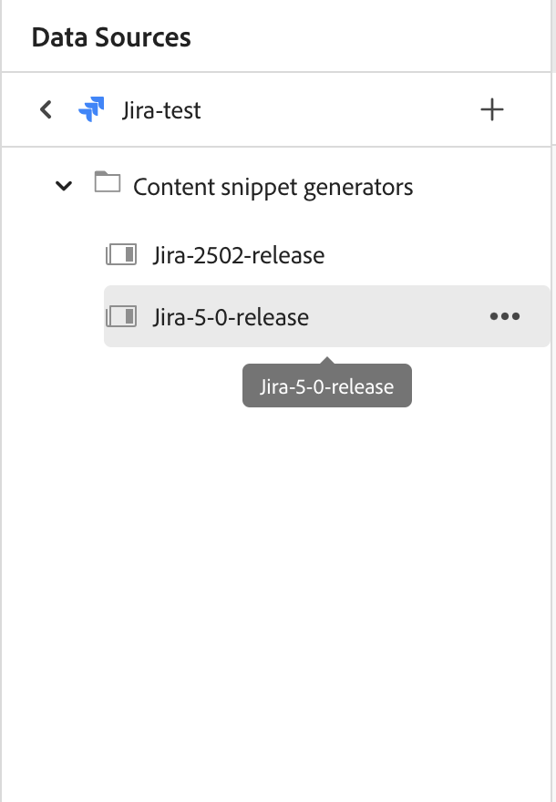
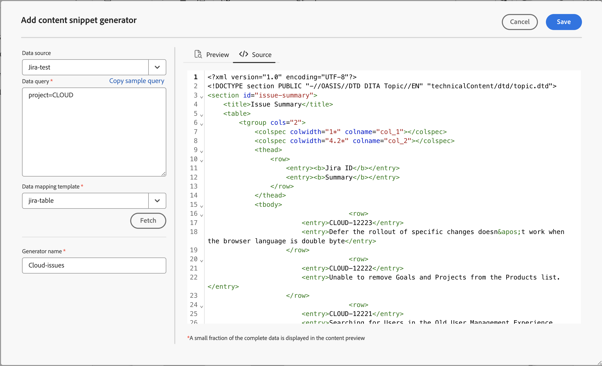
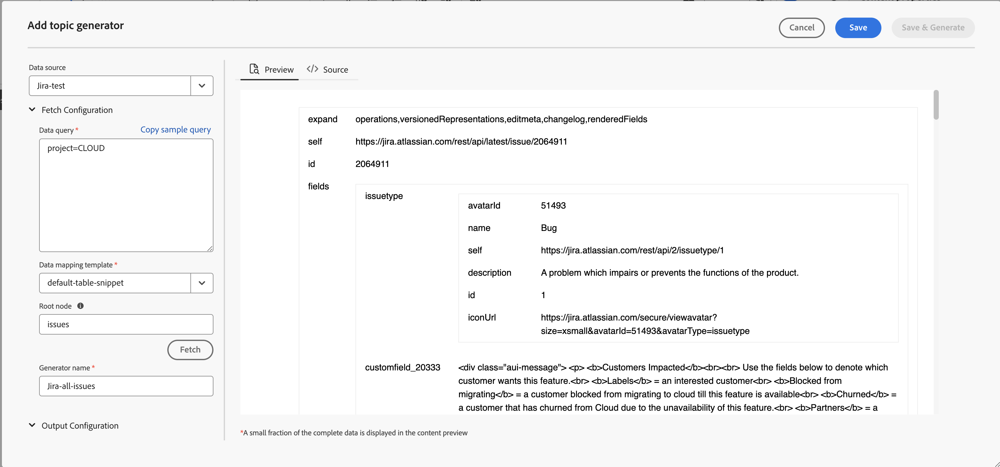

# Utiliser des données provenant de votre source de données

Une **source de données** est un système dans lequel vous stockez et gérez les données pour votre organisation. Il s’agit de vos systèmes d’enregistrement tels que JIRA, bases de données SQL, PIM ou PLM. AEM Guides permet d’établir une connexion à votre source de données et d’utiliser les données qui en proviennent.

Vous pouvez également vous connecter à des fichiers de données JSON à l’aide d’un connecteur de fichiers. Chargez le fichier JSON à partir de votre ordinateur ou parcourez-le à partir des ressources Adobe Experience Manager. Créez ensuite des fragments de contenu ou des rubriques à l’aide des générateurs.

## Panneau Sources de données

Sélectionnez **Sources de données**  dans le panneau de gauche pour afficher les sources de données connectées. Le panneau Sources de données s’ouvre et affiche toutes les sources de données connectées.

Selon votre configuration, votre administrateur peut configurer un connecteur de source de données :

 Services cloud 

- Si vous utilisez la version d’octobre 2023 ou une version ultérieure, découvrez comment [configurer un connecteur de source de données à partir de l’interface utilisateur](../cs-install-guide/conf-data-source-connector-tools.md) dans le Guide d’installation et de configuration des services cloud.

- Si vous utilisez la version de juillet 2023 ou de septembre 2023, découvrez comment [configurer un connecteur de source de données](../cs-install-guide/conf-data-source-connector.md) dans le Guide d’installation et de configuration des services cloud.

    

  Logiciel On-Premise 

- Si vous utilisez la version 4.3.1 ou une version ultérieure, découvrez comment [configurer un connecteur de source de données à partir de l’interface utilisateur](../cs-install-guide/conf-data-source-connector-tools.md) dans le Guide d’installation et de configuration On-premise.

- Si vous utilisez la version 4.3, découvrez comment [configurer un connecteur de source de données](../cs-install-guide/conf-data-source-connector.md) dans le Guide d’installation et de configuration On-premise.

>[!NOTE]
>
> Vous verrez les sources de données pour lesquelles votre administrateur a configuré le connecteur.

## Afficher la vue Liste ou la vue Mosaïque

Vous pouvez basculer entre la vue Liste ou la vue Mosaïque pour afficher les différentes sources de données sous la forme d’une liste ou de mosaïques.

Sélectionnez une source de données pour afficher les générateurs de fragments de contenu et les générateurs de rubriques disponibles pour la source de données sélectionnée.

### Vue Liste

{width="300" align="left"}

*Liste des sources de données connectées.*

### Affichage en mosaïque

{width="300" align="left"}

*Afficher les sources de données connectées sous forme de mosaïques.*

Vous pouvez utiliser les données des sources de données de deux manières :
- Insertion d’un fragment de contenu
- Création d’une rubrique

## Insérer un fragment de contenu à partir de votre source de données

Adobe Experience Manager Guides permet d’établir une connexion à votre source de données. Vous pouvez récupérer vos données, les insérer dans vos rubriques et les modifier. Vous pouvez facilement créer un fragment de contenu à l’aide du générateur de fragments de contenu et le réutiliser dans vos rubriques.

Pour créer un fragment de contenu à l’aide du générateur de fragments de contenu et l’insérer dans votre rubrique, procédez comme suit :

1. Sélectionnez **Sources de données**  dans le panneau de gauche pour afficher les sources de données connectées.

1. Sélectionnez une source de données pour afficher les générateurs de fragments de code de contenu disponibles pour la source de données sélectionnée.

   {width="300" align="left"}

   *Le panneau Sources de données répertorie les générateurs de fragments de contenu disponibles.*

1. Sélectionnez **Ajouter** pour ajouter un nouveau générateur de fragment de contenu. Le panneau **Ajouter un générateur de fragment de contenu** s’ouvre.

   {width="500" align="left"}

1. Saisissez la requête dans la zone de texte **Requête de données**.  Sélectionnez **Copier un exemple de requête** pour copier rapidement une requête de données. Au lieu de créer manuellement la requête, vous pouvez copier et coller l’exemple de requête dans la zone de texte **Requête de données**. Il vous suffit ensuite de modifier la requête en fonction de vos besoins en matière de données.

   >[!NOTE]
   >
   > Experience Manager fournit différents exemples de requêtes pour toutes les ressources des différentes sources de données. Ils correspondent à la source de données à partir de laquelle vous récupérez les données.

1. Si vous utilisez un connecteur de fichiers, vous pouvez charger le fichier JSON à partir de votre ordinateur ou parcourir un fichier JSON à partir de ressources Adobe Experience Manager.

   >[!NOTE]
   >
   > Si vous utilisez un connecteur de fichiers, vous verrez les options permettant de charger ou de parcourir les fichiers à la place d’une requête de données.

1. Sélectionnez le modèle qui correspond à votre source de données dans le menu déroulant **Modèle de mappage de données**.
Les modèles prêts à l’emploi pour la source de données sélectionnée s’affichent dans la liste déroulante. Par exemple, vous pouvez afficher le modèle « sql-table » pour la source de données nommée « PostgreSQL ».

   >[!NOTE]
   >  
   > Si votre administrateur a configuré des modèles personnalisés, ces modèles s’affichent également dans la liste déroulante (en fonction des configurations de chemin d’accès aux modèles effectuées par votre administrateur).
   >   
   >Vous pouvez également utiliser les outils Velocity dans les modèles. En savoir plus sur l’utilisation [des outils Velocity](#use-velocity-tools).

1. La liste déroulante **Ressource** s’affiche pour certains connecteurs tels que REST Client, Salsify, Akeneo et Microsoft ADO.  Sélectionnez une ressource dans la liste déroulante et connectez-vous à elle pour créer un fragment de contenu ou une rubrique à l’aide du générateur correspondant.

   >[!NOTE]
   >
   > Votre administrateur peut configurer les ressources par défaut ou ajouter des ressources pour plusieurs URL lors de la configuration des connecteurs de source de données.

1. Sélectionnez **Récupérer** pour récupérer les données de la source de données et appliquer le modèle aux données qui résultent de la requête SQL.

1. Vous pouvez afficher les données dans l&#39;aperçu ou dans la vue source DITA.

   1. L’aperçu montre comment les données seront affichées lorsqu’elles seront insérées dans le contenu. L’aperçu affiche une petite fraction des données au format du modèle sélectionné.
Par exemple :
      - Si vous avez sélectionné le modèle sql-table, vous pouvez afficher les données SQL sous la forme d’un tableau.
      - Si vous avez sélectionné le modèle de liste ordonnée Jira, vous pouvez afficher une liste ordonnée des problèmes Jira.

   1. La vue source affiche les données dans la vue source DITA.

      {width="500" align="left"}
      *Ajoutez un générateur de fragments de code de contenu. Affichez les données en mode source ou aperçu.*

1. Pour enregistrer les résultats de la requête, saisissez le nom du générateur, puis sélectionnez **Ajouter**.   Un nouveau générateur de fragments de contenu est ajouté à la liste.

   >[!NOTE]
   >
   > Vous devez suivre la convention de dénomination des fichiers pour le nom du nouveau générateur de contenu. Le nom du générateur de fragments de contenu ne peut pas contenir d’espace. En outre, vous ne pouvez pas enregistrer un nouveau générateur de contenu avec le nom d’un générateur de contenu existant. Une erreur se produit.

### Options d’un générateur de fragments de contenu

Cliquez avec le bouton droit de la souris sur un générateur de fragments de contenu pour ouvrir les options. À l’aide des options, vous pouvez effectuer les opérations suivantes :

- **Prévisualisation** : utilisez cette option pour ouvrir un volet et visualiser une petite fraction de l’affichage des données dans la sortie.
- **Insérer** : utilisez cette option pour insérer le fragment de contenu sélectionné dans la rubrique ouverte pour modification dans l’éditeur. Les données étant insérées sous forme d’extrait de code, vous pouvez également les modifier dans votre rubrique dans l’éditeur.

  >[!NOTE]
  > 
  > L’option Insérer ne s’affiche que lorsque vous modifiez une rubrique.

- **Modifier** : utilisez cette option pour apporter des modifications au générateur de fragments de contenu et l’enregistrer.
- **Supprimer** : utilisez cette option pour supprimer le générateur de fragment de contenu sélectionné.
- **Dupliquer** : utilisez cette option pour créer un doublon ou une copie du générateur de fragment de contenu sélectionné. Par défaut, le duplicata est créé avec un suffixe (comme generator_1).

### Insérer des données de requête

Vous pouvez également utiliser le  **Requête de données** de la barre d’outils pour insérer le fragment de données dans les rubriques.  Vous pouvez sélectionner un générateur dans la liste déroulante, modifier votre requête ou modifier le modèle et insérer les données dans votre rubrique.

{align="left"}

*Modifier et insérer un fragment de données.*

## Créer une rubrique à l’aide du générateur de rubriques

Un générateur de rubriques vous permet de créer des rubriques contenant des données issues de vos sources. Vous pouvez rapidement créer un générateur de rubriques, puis générer les rubriques à l’aide du générateur. Chaque rubrique peut contenir des données dans différents formats, tels que des tableaux, des listes et des paragraphes.   Par exemple, dans une rubrique, vous pouvez ajouter un tableau qui inclut les détails de tous les nouveaux produits et une liste de tous les produits qui seront arrêtés pour la vente.

Le générateur de rubriques peut créer les rubriques contenant les données et un plan DITA pour toutes les rubriques. Vous pouvez également `<conref>` ces rubriques dans votre contenu. Cela vous permet de garder vos données synchronisées avec la source de données et de les mettre facilement à jour.

### Création d’une rubrique

Pour créer une rubrique à l’aide du générateur de rubriques, procédez comme suit :

1. Sélectionnez une source de données pour afficher les générateurs de fragments de contenu et les générateurs de rubriques disponibles pour la source de données sélectionnée.

   {width="300" align="left"}

   *Ajoutez un générateur de rubrique pour une source de données connectée.*

1. Sélectionnez **Ajouter**  et sélectionnez **Générateur de rubrique** dans la liste déroulante pour ajouter un nouveau générateur de rubrique. Le panneau **Ajouter un générateur de rubriques** s’ouvre.

1. Saisissez les valeurs dans les champs situés sous les trois onglets suivants du panneau **Ajouter un générateur de rubrique** :

   **Récupérer la configuration**

   {width="300" align="left"}

   *Ajoutez les détails Requête de données, Modèle de mappage de données et Nœud racine pour le générateur de rubrique et attribuez-lui un nom unique dans le panneau Récupérer la configuration*.

   1. Saisissez la requête dans la zone de texte **Requête de données**. Sélectionnez **Copier un exemple de requête** pour copier rapidement une requête de données. Au lieu de créer manuellement la requête, vous pouvez copier et coller l’exemple de requête dans la zone de texte **Requête de données**. Il vous suffit ensuite de modifier la requête en fonction de vos besoins en matière de données.

      >[!NOTE]
      >
      >Experience Manager fournit différents exemples de requêtes pour toutes les ressources des différentes sources de données. Ils correspondent à la source de données à partir de laquelle vous récupérez les données.

   1. Si vous utilisez un connecteur de fichiers, vous pouvez charger le fichier JSON à partir de votre ordinateur ou parcourir un fichier JSON à partir de ressources Adobe Experience Manager.

      >[!NOTE]
      >
      > Si vous utilisez un connecteur de fichiers, vous verrez les options permettant de charger ou de parcourir les fichiers à la place d’une requête de données.

   1. Sélectionnez le modèle qui correspond à votre source de données dans le menu déroulant **Modèle de mappage de données**.

      >[!NOTE]
      >
      > Si votre administrateur a configuré des modèles personnalisés, ces modèles s’affichent également dans la liste déroulante (en fonction des configurations de chemin d’accès aux modèles effectuées par votre administrateur). Par exemple, vous pouvez créer un modèle de rubrique contenant une liste ordonnée, des tableaux, des paragraphes ou d&#39;autres éléments DITA.

   1. Saisissez le **nœud racine**. Il s’agit du nœud sur lequel vous souhaitez accéder à vos données. Le générateur de rubriques crée ensuite chaque rubrique au niveau défini dans le nœud racine. Par exemple, vous pouvez ajouter « issues » en tant que nœud racine dans Jira. Ainsi, si une requête renvoie 13 événements, vous obtiendrez 13 rubriques, une rubrique pour chaque événement.

   1. Sélectionnez **Récupérer** pour récupérer les données de la source de données et appliquer le modèle aux données qui résultent de la requête SQL. L’aperçu montre une petite fraction de la façon dont la rubrique apparaît au format du modèle sélectionné. Par exemple, vous pouvez afficher un seul problème Jira avec tous les champs qui résultent de la requête.
   1. Saisissez le nom du générateur de rubrique.

      >[!NOTE]
      > 
      > Vous devez suivre la convention de dénomination des fichiers pour le nom du nouveau générateur de rubrique. Le nom du générateur de rubrique ne peut pas contenir d&#39;espace. En outre, vous ne pouvez pas enregistrer un nouveau générateur de rubriques avec le nom d&#39;un générateur de rubriques existant. Une erreur se produit.

   **Configuration de sortie**

   {width="300" align="left"}

   *Saisissez les détails du Chemin de sortie et de la convention de nommage des rubriques dans le panneau Configuration de sortie . Générez un plan DITA et nommez-le.*

   1. Saisissez les détails du **chemin de sortie** où vous souhaitez enregistrer vos rubriques.
   1. Dans la **convention de nommage des rubriques**, vous pouvez saisir une valeur ou une variable avec des balises de vitesse. Les nouveaux thèmes suivront la convention. Par exemple, vous pouvez saisir le `$key` pour créer des rubriques basées sur des clés Jira.
   1. Activez l’option **Générer un mappage** si vous souhaitez créer un mappage contenant toutes les rubriques générées.
   1. Saisissez le nom du nouveau plan DITA.

   >[!NOTE]
   >
   > Le générateur de rubriques génère le plan DITA sur le même chemin de sortie que les rubriques.

   **Métadonnées**

   Sélectionnez les propriétés de métadonnées dans la liste déroulante à transmettre aux rubriques. La liste déroulante **Nom** répertorie les propriétés personnalisées et par défaut.

   Par exemple, dans la capture d’écran suivante, `dc:description`, `dc:language`, `dc:title` et `docstate` sont les propriétés par défaut pour lesquelles vous pouvez définir les valeurs. Vous pouvez créer une propriété personnalisée telle que author et définir sa valeur.

   {width="300" align="left"}

   *Ajoutez les propriétés de métadonnées dans le panneau Métadonnées à transmettre aux rubriques.*

1. Saisissez le nom du générateur et sélectionnez **Enregistrer** pour enregistrer les résultats de la requête. Un nouveau générateur de rubriques est ajouté à la liste.

1. Sélectionnez **Enregistrer et générer** pour enregistrer le générateur de rubriques et générer de nouvelles rubriques à partir du générateur de rubriques.

   {align="left"}

   *Générer de nouvelles rubriques à partir d’un générateur de rubriques existant.*

   >[!NOTE]
   >
   > Si les rubriques existent déjà, le générateur met à jour les données dans les rubriques existantes.

### Options d’un générateur de rubriques

Cliquez avec le bouton droit de la souris sur un générateur de rubriques pour ouvrir le **Options**. À l’aide des options, vous pouvez effectuer les opérations suivantes :

- **Générer** : cette option génère les rubriques pour le générateur de rubriques sélectionné. Vous pouvez également utiliser cette option pour mettre à jour les rubriques existantes. Il se connecte à la source de données et récupère les données mises à jour. Lors de la génération du contenu, cette option est désactivée et vous affichez un chargeur.
  >[!NOTE]
  >
  >Si votre rubrique existe déjà, vous pouvez soit remplacer les données de la rubrique, soit les enregistrer en tant que nouvelle version.

  

  *Générez une rubrique et, si le fichier existe déjà, enregistrez-le en tant que nouvelle version ou remplacez-le.*
- **Afficher le journal** : sélectionnez cette option pour afficher le fichier journal de génération du contenu. Le fichier journal s’ouvre dans un nouvel onglet. Vous pouvez consulter les erreurs, les avertissements, les messages d’information et les exceptions dans le fichier journal. Cette option est activée si vous avez généré le contenu pour le générateur de rubrique sélectionné.

- **Prévisualisation** : utilisez cette option pour ouvrir un volet et visualiser une petite fraction de l’affichage des données dans la sortie.

- **Modifier** : utilisez cette option pour modifier et enregistrer le générateur de rubriques. Cette option est désactivée pendant que vous générez le contenu.
- **Supprimer** : utilisez cette option pour supprimer le générateur de rubriques sélectionné. Cette option est désactivée pendant que vous générez le contenu.
- **Dupliquer** : cette option crée un doublon ou une copie du générateur de rubrique sélectionné. Par défaut, le duplicata est créé avec un suffixe (comme `topic-sample_1`).

## Utilisation des outils Velocity dans les modèles de source de données {#use-velocity-tools}

Les modèles Experience Manager prennent également en charge les outils Velocity (version 2.0). Ces outils vous aident à appliquer diverses fonctions aux données que vous récupérez à partir des sources de données. En savoir plus sur l’utilisation des [outils Velocity](https://velocity.apache.org/tools/2.0/generic.html) et les fonctions que vous pouvez appliquer.

Pour utiliser un outil Velocity dans un modèle, procédez comme suit :
1. Modifiez un modèle Velocity dans l’éditeur.
1. Ajoutez un outil et sa fonction au format `<tool.function>`. Par exemple :
   - Pour générer un nombre aléatoire à l’aide de l’outil mathématique, utilisez `$mathTool.random`.
   - Pour générer la somme des nombres à l’aide de l’outil mathématique, utilisez `$mathTool.add(num1, num2)`.
1. Utilisez le modèle pour créer un fragment de code ou une rubrique de contenu.
1. Après avoir appliqué le modèle aux données, vous pouvez afficher les données dans l&#39;aperçu ou dans la vue source DITA.

Vous pouvez utiliser les outils suivants dans les modèles Velocity pour appliquer diverses fonctions aux données que vous récupérez du connecteur :
-`$alternatorTool`
- `$classTool`
- `$contextTool`
- `$conversionTool`
- `$dateTool`
- `$comparisonDateTool`
- `$displayTool`
- `$escapeTool`
- `$fieldTool`
- `$loopTool`
- `$linkTool`
- `$listTool`
- `$mathTool`
- `$numberTool`
- `$renderTool`
- `$resourceTool`
- `$sortTool`
