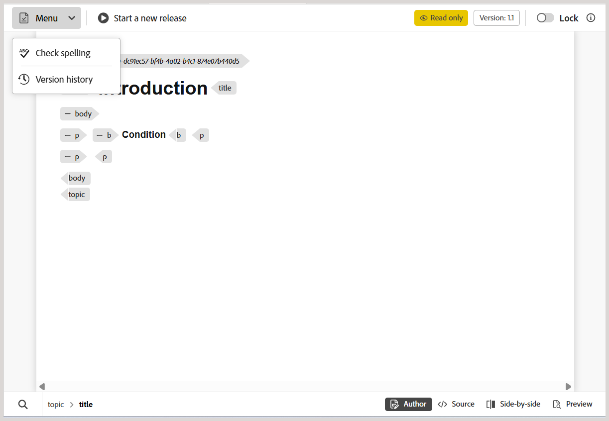

# Etat du document {#id1821HC00URO}

>[!INFO]
>
> Cette rubrique s’applique à la fois au nouvel éditeur et à l’ancien éditeur. Bien que les principales fonctionnalités restent cohérentes, les différences au niveau de l’interface utilisateur, de la terminologie et des interactions sont indiquées dans le contenu à l’aide des onglets et des légendes, le cas échéant.

Pour gérer le niveau de préparation des documents, Adobe Experience Manager Guides fournit la propriété d’état du document pour indiquer l’état actuel du document. Les états du document vous permettent de déterminer rapidement si un document est nouveau, en cours de révision ou terminé.

## Types d’états du document

Un document peut avoir n’importe quel état de document défini dans le profil **État du document**. Par exemple, un document peut avoir l’un des états de document suivants :

- Brouillon - Indique que le document est créé et enregistré avec de nouvelles modifications.
- En cours - Indique qu’un workflow de révision a été lancé pour le document.
- Révisé - Indique que le document a été révisé par les utilisateurs prévus.

Ces états sont définis manuellement ou automatiquement en fonction des paramètres du profil États du document . Par exemple, si le profil d&#39;état du document est configuré avec l&#39;état de début Brouillon et que l&#39;état En cours de révision est défini pour les documents en cours de révision. Ensuite, lorsque vous créez un document, son état est défini sur *Brouillon*. Si vous lancez une tâche de révision, le document passe à l’état En cours de révision.

Vous pouvez également modifier manuellement le statut d’un ou de plusieurs documents. Cependant, si vous choisissez de modifier l’état du document pour plusieurs documents, l’état autorisé est déterminé par les états communs autorisés pour les documents sélectionnés. Supposons, par exemple, que vous ayez défini les états du document comme Brouillon, En cours de révision, Révisé et Prêt à publier, dans le même ordre. Sur le document one.dita, l’état est défini sur *Draft* et sur le document two.dita, l’état est défini sur Reviewed. Lorsque vous sélectionnez à la fois one.dita et two.dita, l’état du document autorisé est *Prêt pour publication*. Comme two.dita est à l’état *Reviewed*, l’état suivant possible pour two.dita est uniquement *Ready to Publish*, qui s’affiche lorsque les deux documents sont sélectionnés.

>[!NOTE]
>
> Un document ne peut exister que dans un seul état à la fois.

## Modifier le statut du document à partir de l’éditeur

Pour modifier le statut d’un document, procédez comme suit :

1. Ouvrez le document dans l’éditeur, puis sélectionnez Propriétés du fichier dans le panneau de droite.
1. Dans le panneau Propriétés du fichier , sélectionnez le nouvel état dans le menu déroulant **État du document**. Vous ne pouvez sélectionner que les états du document autorisés dans la section Transition d’état du profil d’état du document.

   >[!NOTE]
   >
   >Les administrateurs et administratrices peuvent afficher tous les états du document et définir le document sur n’importe quel état possible.

1. Sélectionnez **Enregistrer** dans l’invite de confirmation.

## Modifier le statut du document à partir de l’interface utilisateur d’Assets

1. Dans l’interface utilisateur d’Assets, sélectionnez un ou plusieurs documents dont vous souhaitez modifier l’état.
1. Dans la barre d’outils principale, sélectionnez **Propriétés**.
1. Sélectionnez le nouveau statut dans le menu déroulant **État du document**. Vous ne pouvez sélectionner que les états du document autorisés dans la section Transition d’état du profil d’état du document.

   >[!NOTE]
   >
   >Les administrateurs et administratrices peuvent afficher tous les états du document et définir le document sur n’importe quel état possible.

1. Sélectionnez **Enregistrer et fermer**.

### Afficher l’état du document

Le mode Carte de l’interface utilisateur d’Assets affiche le statut actuel, ainsi que la date de création et la taille de la rubrique DITA ou du plan DITA correspondant.

## Utiliser les états de document dans DDLC

Les états de document jouent un rôle important dans la gestion du cycle de vie des documents dans DDLC. Si votre organisation suit strictement le DDLC, il devient essentiel de disposer d’un mécanisme pour contrôler la modification des documents en fonction de leur état. Par exemple, vous pouvez autoriser la modification de documents lorsqu’ils sont à l’état *Brouillon* ou *En cours*. Cependant, une fois qu’un document est examiné et prêt à être publié, il doit y avoir un moyen d’empêcher toute modification ultérieure des documents.

Experience Manager Guides fournit un processus d’approbation des documents, qui vous permet de contrôler le cycle de vie de votre processus de développement de documents. Une fois qu’un document est prêt à être publié ou a atteint l’avant-dernier état, vous pouvez le marquer comme approuvé. Une fois qu’un document est approuvé, Experience Manager Guides crée une nouvelle version du document et le rend en lecture seule. Vous pouvez ensuite déplacer le document pour publication ou créer une ligne de base pour un traitement ultérieur.

Pour lancer une nouvelle version des documents marqués comme approuvés, un auteur doit lancer une nouvelle version. Le démarrage d’une nouvelle version modifie l’état du document en *Brouillon*. En modifiant l’état du document sur *Brouillon*, le document devient à nouveau modifiable et vous pouvez continuer à travailler sur la version suivante.

Pour utiliser la fonction d&#39;approbation de document, procédez comme suit :

>[!NOTE]
>
> La fonction de workflow d’approbation doit être activée par votre administrateur. Pour plus d’informations, consultez la section *Activer le workflow d’approbation* dans la section Installation et configuration d’Adobe Experience Manager Guides as a Cloud Service.

1. Dans l’éditeur, ouvrez le document que vous souhaitez marquer pour approbation.

1. Sélectionnez l’icône **Marquer comme approuvé**.

1. Si votre document est à l’état d’être marqué comme approuvé, la boîte de dialogue suivante s’affiche :

   {width="300"}

   Si votre document ne peut pas être marqué comme approuvé, le message suivant s’affiche :

   {width="300"}

1. Si votre document est prêt à être marqué comme approuvé, sélectionnez un libellé dans la liste déroulante et sélectionnez **Approuver**.

   >[!NOTE]
   >
   > Si votre administrateur n’a pas configuré de liste prédéfinie de libellés, un champ de texte à structure libre s’affiche et vous permet de saisir un libellé.

1. Une fois le document marqué comme approuvé, un **Aperçu** du document s’affiche en mode lecture seule. Toutes les options de modification sont supprimées des trois modes : Auteur, Source et Aperçu. Cependant, vous avez toujours accès à la liste déroulante **Menu** qui contient les options **Historique des versions** et **Balises**.

>[!BEGINTABS]

>[!TAB Nouvel éditeur]

{width="650"}

>[!TAB Ancien éditeur]

{width="650"}

>[!ENDTABS]

>[!NOTE]
>
> En mode Aperçu , la liste déroulante Menu contenant les options Historique des versions et Balises est supprimée de la barre d’outils.

Une fois qu’un document est marqué comme approuvé, il n’est plus disponible pour modification. Si vous souhaitez utiliser le document pour la prochaine version, vous devez le ramener à l’état *Brouillon*. Pour rétablir le statut d’un document approuvé en mode *Brouillon*, procédez comme suit :

1. Dans un document approuvé, sélectionnez l’ d’icône **Démarrer une nouvelle version**.

   Le message Démarrer une nouvelle version s’affiche.

1. Sélectionnez **Confirmer**.

   Le document passe à l’état Brouillon et est ouvert dans l’éditeur en mode d’édition.

**Rubrique parente :**&#x200B;[&#x200B; Présentation de l’éditeur](web-editor.md)
