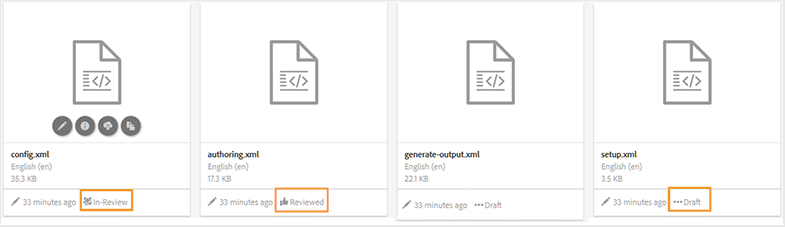
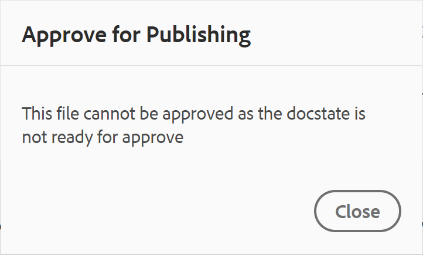

# État du document {#id1821HC00URO}

Pour gérer l’état de préparation des documents, AEM Guides fournit une propriété d’état du document pour indiquer l’état actuel du document. Les états du document vous aident à déterminer rapidement si un document est nouveau, en révision ou s’il est terminé.

## Types d’états de document

Un document peut avoir l’un des états de document définis dans le profil Document State. Par exemple, un document peut avoir l’un des états de document suivants :

- Version préliminaire : indique que le document est créé et enregistré avec de nouvelles modifications.
- En révision : indique qu’un processus de révision a été lancé pour le document.
- Révision : indique que le document a été révisé par les utilisateurs prévus.

Ces états sont définis manuellement ou automatiquement, conformément aux paramètres de profil Document States . Par exemple, si le profil Etat du document est configuré avec l’état de départ comme brouillon et que l’état In-Review est défini pour les documents en cours de révision. Ensuite, lorsque vous créez un document, l’état du document est défini sur *Version préliminaire*. Si vous lancez une tâche de révision, l’état du document est alors modifié en In-Review.

Vous pouvez également modifier manuellement l’état du document pour un ou plusieurs documents. Cependant, si vous choisissez de modifier l’état du document pour plusieurs documents, l’état autorisé est déterminé par les états communs autorisés pour les documents sélectionnés. Supposons, par exemple, que vous ayez défini les états du document comme Brouillon, En révision, Révisé et Prêt à publier, dans le même ordre. Dans le document one.dita, l’état est défini sur *Version préliminaire* et sur le document two.dita, l’état est défini sur Révision. Lorsque vous sélectionnez à la fois : one.dita et two.dita, l’état du document autorisé est *Prêt à publier*. Comme le fait le dictionnaire two.dita dans *Révisé* état, le prochain état possible de two.dita est uniquement *Prêt à publier*, qui s’affiche lorsque les deux documents sont sélectionnés.

>[!NOTE]
>
> Un document ne peut exister que dans un seul état à la fois.

## Modifier l’état du document

Pour modifier l’état d’un document, procédez comme suit :

1. Dans l’interface utilisateur d’Assets, sélectionnez un ou plusieurs documents pour lesquels vous souhaitez modifier l’état du document.
1. Dans la barre d’outils principale, cliquez sur **Propriétés**.
1. Sélectionnez le nouvel état dans la **État du document** menu déroulant. Vous ne pouvez sélectionner que les états du document autorisés dans la section Transition de l’état du profil Document State.

   >[!NOTE]
   >
   >Les administrateurs peuvent afficher tous les états du document et le remplacer par n’importe quel état possible.

1. Cliquez sur **Enregistrer et fermer**.

## Affichage de l’état du document

Le mode Carte de l’interface utilisateur d’Assets affiche l’état actuel ainsi que la date et la taille de création de la rubrique DITA ou du mappage DITA correspondant.

{width="800" align="left"}

## Utilisation des états de document dans DDLC

Les états de document jouent un rôle important dans la gestion du cycle de vie des documents dans DDLC. Si votre entreprise suit strictement le DDLC, disposer d’un mécanisme de contrôle de la modification des documents en fonction de leur état devient une fonctionnalité essentielle. Par exemple, vous pouvez autoriser la modification de documents lorsqu’ils se trouvent dans *Version préliminaire* ou *En cours de révision* états. Cependant, une fois qu’un document est révisé et prêt à être publié, il doit y avoir un moyen d’empêcher toute modification supplémentaire des documents.

AEM Guides fournit un processus d’approbation de document qui vous aide à contrôler le cycle de vie de votre processus de développement de documents. Une fois qu’un document est prêt à être publié ou qu’il a atteint l’avant-dernier état, vous pouvez le marquer comme approuvé. Une fois qu’un document est approuvé, AEM Guides crée une nouvelle version du document et le rend en lecture seule. Vous pouvez ensuite déplacer le document à des fins de publication ou créer une ligne de base pour un traitement ultérieur.

Pour lancer une nouvelle version à partir des documents marqués comme approuvés, un auteur doit lancer une nouvelle version. Le lancement d’une nouvelle version modifie l’état du document en *Version préliminaire* encore une fois. En définissant l’état du document sur *Version préliminaire*, le document est à nouveau modifiable et vous pouvez continuer à travailler sur la prochaine version.

Pour utiliser la fonction d’approbation de document, procédez comme suit :

>[!NOTE]
>
> La fonction de workflow d’approbation doit être activée par votre administrateur. Pour plus d’informations, voir *Activer le workflow de validation* dans la section Installation et configuration de Adobe Experience Manager Guides as a Cloud Service.

1. Dans l’éditeur Web, ouvrez le document que vous souhaitez marquer pour approbation.

1. Cliquez sur le bouton **Marquer comme approuvé** Icône

1. Si votre document doit être marqué comme approuvé, la boîte de dialogue suivante s’affiche :

   {width="300" align="left"}

   Si le document ne peut pas être marqué comme approuvé, le message suivant s’affiche :

   {width="300" align="left"}

1. Si votre document est prêt à être marqué comme approuvé, sélectionnez un libellé dans la liste déroulante, puis cliquez sur **Approuver**.

   >[!NOTE]
   >
   > Si votre administrateur n’a pas configuré de liste prédéfinie d’étiquettes, un champ de texte en forme libre s’affiche pour vous permettre de saisir un libellé.

1. Une fois le document marqué comme approuvé, une **Aperçu** du document s’affiche en mode lecture seule.

   {width="650" align="left"}

   >[!NOTE]
   >
   > En mode Aperçu , toutes les options de modification sont supprimées de la barre d’outils. En outre, les vues Auteur et Source du document ont également été supprimées de la barre de navigation supérieure.

Une fois qu’un document est marqué comme approuvé, il ne peut plus être modifié. Si vous souhaitez utiliser le document pour la prochaine version, vous devez le ramener à la *Version préliminaire* état. Pour rétablir l’état du document d’un document approuvé sur *Version préliminaire* en mode , procédez comme suit :

1. Dans un document approuvé, cliquez sur l’icône **Commencer une nouvelle version** Icône .

   Le message Démarrer une nouvelle version s’affiche.

1. Cliquez sur **Confirmer**.

   L’état du document est alors modifié et le document s’ouvre dans l’éditeur Web en mode d’édition.

**Rubrique parente :**[ Utilisation de l’éditeur web](web-editor.md)
