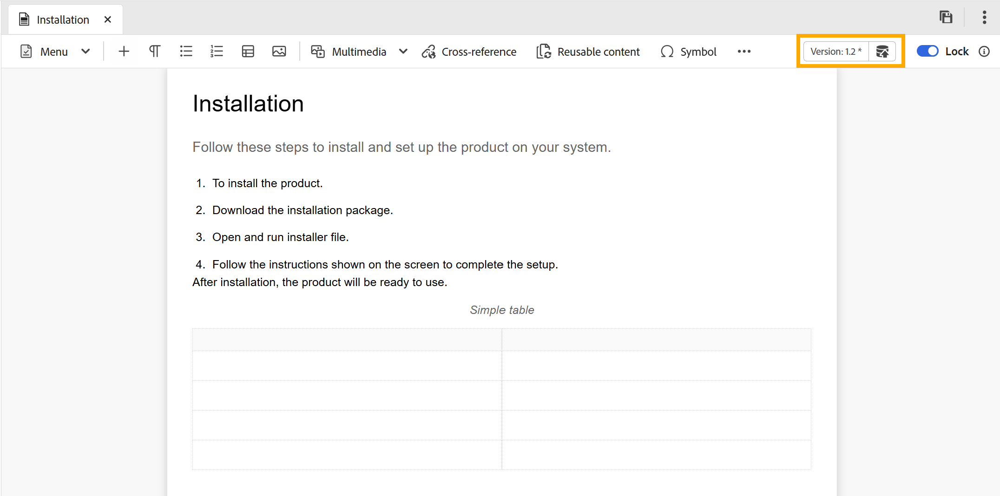

# Modifier les rubriques dans l’éditeur {#id2056B040VUI}

>[!INFO]
>
>Cette rubrique s’applique à la fois au nouvel éditeur et à l’ancien éditeur. Bien que les principales fonctionnalités restent cohérentes, les différences au niveau de l’interface utilisateur, de la terminologie et des interactions sont indiquées dans le contenu à l’aide des onglets et des légendes, le cas échéant.

L&#39;éditeur est fourni avec une gamme de fonctions d&#39;édition qui vous permettent de créer ou de modifier facilement vos fichiers de rubrique. En règle générale, vous devez effectuer les étapes suivantes pour modifier une rubrique dans l’éditeur.

>[!IMPORTANT]
>
> Si vous rencontrez une erreur d’application lors de l’utilisation de l’éditeur, actualisez la page pour continuer à travailler.

>[!BEGINTABS]

>[!TAB Nouvel éditeur]

1. Pour modifier ou insérer un élément dans une rubrique, cliquez dans la limite de texte de l&#39;élément requis pour apporter des modifications, ou placez le curseur à la fin de l&#39;élément après lequel vous souhaitez ajouter un nouvel élément et sélectionnez l&#39;élément requis dans la barre d&#39;outils (ou appuyez sur Alt+1 pour ouvrir la fenêtre contextuelle Insérer un élément), qui répertorie et insère intelligemment uniquement des éléments valides pour cet emplacement dans la rubrique.

1. De plus, vous pouvez utiliser le menu d&#39;insertion rapide pour insérer facilement les éléments autorisés à la position du curseur. Sélectionnez **Contrôle + /** pour Windows ou **Commande + /** pour Mac pour accéder aux éléments.

   {width="650"}

   Recherchez un nouvel élément ou choisissez-en un parmi vos favoris à l&#39;aide du menu Insertion rapide, puis insérez-le à l&#39;emplacement actuel du curseur. Les favoris incluent les éléments les plus fréquemment utilisés, et seuls ceux qui sont valides pour l&#39;emplacement actuel du curseur s&#39;affichent. Vous pouvez activer ou désactiver cette fonction et configurer les éléments favoris à insérer à l’aide du menu d’insertion rapide disponible dans les paramètres de l’[éditeur](./config-editor-settings.md).

>[!TAB Ancien éditeur]

1. Pour apporter des modifications à votre rubrique, cliquez dans la limite de texte de l&#39;élément requis et commencez à apporter des modifications.

1. Pour insérer un élément spécifique, déplacez le curseur à la fin de l’élément après quoi vous souhaitez insérer le nouvel élément et sélectionner l’icône de l’élément requis dans la barre d’outils. Vous pouvez également utiliser le raccourci clavier `Alt+1` pour appeler la fenêtre contextuelle **Insérer un élément**.

   Une liste d’éléments qui peuvent être utilisés dans la rubrique s’affiche. Experience Manager Guides place intelligemment les éléments en fonction de leur emplacement valide dans la rubrique.

   >[!NOTE]
   >
   > Vous pouvez également choisir l’icône à afficher dans la barre d’outils en configurant le fichier `ui_config.json` situé à l’emplacement - `/etc/designs/fmdita/clientlibs/xmleditor/`. Pour plus d’informations sur la personnalisation des fonctionnalités, contactez votre administrateur système.

1. Une fois la modification du document terminée, sélectionnez **Enregistrer tout**.

   >[!NOTE]
   >
   > Si vous ne souhaitez pas valider les modifications dans le référentiel Adobe Experience Manager, sélectionnez **Fermer**, puis sélectionnez **Fermer sans enregistrer** dans la boîte de dialogue Modifications non enregistrées.

>[!ENDTABS]

## Sélection partielle de contenu entre des éléments

Experience Manager Guides vous permet également de sélectionner du contenu sur plusieurs éléments. Après avoir sélectionné le contenu, vous pouvez effectuer les opérations suivantes :

- Formatage : le formatage du contenu sélectionné est considérablement plus facile dans le nouvel éditeur par rapport à l’éditeur 1.0, comme illustré ci-dessous.

>[!BEGINTABS]

>[!TAB Nouvel éditeur]

Vous pouvez mettre en forme le contenu sélectionné en gras, italique ou souligné à l’aide de la barre d’outils contextuelle. Sélectionnez le contenu, puis cliquez sur l’icône de mise en forme appropriée dans le menu qui s’affiche. Mettre le contenu sélectionné en gras, en italique ou en soulignement. Le contenu des balises ouvertes valides est ensuite fusionné et s’affiche sous un seul élément.

{width="650"}

>[!TAB Ancien éditeur]

Mettre le contenu sélectionné en gras, en italique et souligner le contenu sélectionné. Le contenu des balises ouvertes valides est ensuite fusionné et s’affiche sous un seul élément. Par exemple, vous pouvez sélectionner le contenu d’un paragraphe et étendre la sélection à un autre paragraphe. Ensuite, si vous mettez le contenu sélectionné en gras, tout le contenu en gras des balises ouvertes est fusionné et apparaît sous un seul élément de paragraphe.

>[!ENDTABS]

- Suppression : si vous supprimez le contenu sélectionné, le contenu restant après la suppression dans les balises ouvertes est fusionné.

- Entourer le contenu d’un élément valide : effectuez les étapes suivantes pour encapsuler le contenu avec un élément valide :

   - Sélectionnez le contenu dans un élément.
   - Sélectionnez l’icône  dans la barre d’outils supérieure pour afficher la boîte de dialogue **Insérer un élément**. La boîte de dialogue répertorie les éléments valides pour le contenu sélectionné.

     >[!NOTE]
     >
     > Vous pouvez également afficher la boîte de dialogue Insérer un élément en sélectionnant le menu contextuel du contenu sélectionné.

   - Sélectionnez un élément dans la boîte de dialogue. Le contenu sélectionné est encapsulé sous cet élément. Par exemple, si vous sélectionnez le contenu dans un paragraphe, puis choisissez l’élément `<note>` dans la boîte de dialogue **Insérer un élément**, le contenu sélectionné s’affiche sous une note.

      {width="300"}

## Actualiser le navigateur lors de la modification des fichiers

Experience Manager Guides permet d’actualiser le navigateur lorsque vous modifiez votre contenu dans l’éditeur. Cette fonctionnalité vous permet de continuer à modifier le contenu si vous rencontrez une erreur d’application pendant que vous travaillez. Si vous appuyez sur l’actualisation du navigateur alors qu’un ou plusieurs fichiers avec des modifications non enregistrées sont ouverts pour modification, vous êtes averti que les modifications non enregistrées risquent d’être perdues. Vous avez la possibilité d’annuler l’opération d’actualisation et d’enregistrer vos fichiers pour conserver vos modifications.

Même lors de l’actualisation du navigateur, les vues du panneau de gauche et du panneau de droite sont conservées dans l’éditeur. Experience Manager Guides restaure le dernier état enregistré des fichiers ouverts dans l’éditeur lorsque vous actualisez le navigateur. Par exemple, les fichiers ouverts dans le panneau Référentiel sont à nouveau ouverts. Le panneau de carte est conservé avec la carte précédemment ouverte.

La rubrique active ou le plan DITA est rouverte dans la zone d&#39;édition du contenu.

Le panneau de droite est également rouvert et affiche la même vue qu’avant l’actualisation.

## Indicateur de copie de travail

Experience Manager Guides fournit l’indicateur de copie de travail qui indique si la \(copie de travail\) actuelle du fichier est synchronisée avec la version enregistrée ou non. Si vous avez apporté des modifications à votre copie actuelle et que vous n&#39;avez pas enregistré votre fichier, une marque \* apparaît avec le titre dans l&#39;onglet Fichier de la rubrique. Cet indicateur sert de rappel pour enregistrer vos modifications et disparaît lorsque vous enregistrez votre fichier.

>[!BEGINTABS]

>[!TAB Nouvel éditeur]

Cette vue affiche le rendu du contenu dans le nouvel éditeur.

{width="550"}

>[!TAB Ancien éditeur]

Cette vue affiche le rendu du contenu dans l’ancien éditeur.

{width="550"}

>[!ENDTABS]

Experience Manager Guides indique également si la dernière copie \(working\) enregistrée du fichier est synchronisée avec la version enregistrée ou non. Si des modifications n&#39;ont pas été enregistrées entre la copie de travail et la dernière version enregistrée, une marque \* apparaît avec les informations de version affichées dans le coin supérieur droit de l&#39;onglet Fichier de la rubrique. Cet indicateur sert de rappel pour enregistrer et créer une version de votre copie \(working\) actuelle du fichier.

>[!NOTE]
>
> Toute modification apportée aux champs de métadonnées disponibles sous [Propriétés du fichier](./web-editor-right-panel.md#file-properties) ou appliquée sur le serveur principal déclenche également l’astérisque `(*)` sur la version du document.  Pour éviter que les mises à jour de métadonnées générées par le système n’affectent cet indicateur, l’administration peut configurer une liste d’exclusion pour les propriétés de métadonnées. Pour plus d’informations sur la configuration des propriétés de métadonnées, consultez la section [Configurer la liste d’exclusion des propriétés de métadonnées](../install-conf-guide/conf-metadata-prop.md).

>[!BEGINTABS]

>[!TAB Nouvel éditeur]

{width="650"}

>[!TAB Ancien éditeur]

{width="650"}

>[!ENDTABS]

## Accès aux fichiers verrouillés en modes Création et Source

Lorsqu&#39;un fichier DITA ou Markdown est verrouillé ou extrait par un autre utilisateur, la modification du contenu n&#39;est pas possible. Cependant, vous pouvez toujours afficher le fichier en lecture seule dans les modes **Auteur** et **Source**, en plus du mode **Aperçu**.

En mode lecture seule, vous pouvez afficher le contenu, les balises et les attributs dans les modes **Auteur** ou **Source**. Vous pouvez également modifier les propriétés du fichier.

>[!NOTE]
>
> En tant qu’administrateur, vous avez accès à la fonctionnalité **Forcer le déverrouillage** qui vous permet de déverrouiller un fichier verrouillé par une autre personne.

<!-- This is no more available -->
<!--
The toolbar displays the following icons for read-only access:

- Toggle Tags view
- Version History
- Version Label

Experience Manager Guides also displays a **Read only access** indicator near the version number.
 

You can access the **Layout** view for read-only DITA maps. This view lets you see the DITA map and its properties but prevents edits.

>[!NOTE]
>
> Your folder-level administrative users must update *ui_config.json* so that you can harmoniously access the read-only files in the  Author, Source, and Layout modes.

 -->

## Rechercher un fichier ouvert dans l’Explorateur

Lorsque vous ouvrez un fichier dans l’éditeur, Experience Manager Guides permet de le localiser dans l’Explorateur. Par exemple, il localise la rubrique active pendant que vous la modifiez.

Vous pouvez désactiver la fonction de recherche du fichier à l’aide de l’option **Toujours rechercher les fichiers dans l’Explorateur** dans l’onglet **Apparence** des **Préférences utilisateur**.

>[!NOTE]
>
>À partir de la version 2025.11.0, le paramètre **Toujours localiser les fichiers dans le référentiel** est renommé **Toujours localiser les fichiers dans l’explorateur**. Pour la configuration On-Premise, elle reste disponible comme Toujours localiser les fichiers dans le référentiel jusqu’à la version 5.1 de Experience Manager Guides.

**Rubrique parente :**&#x200B;[&#x200B; Utiliser l’éditeur](web-editor.md)
