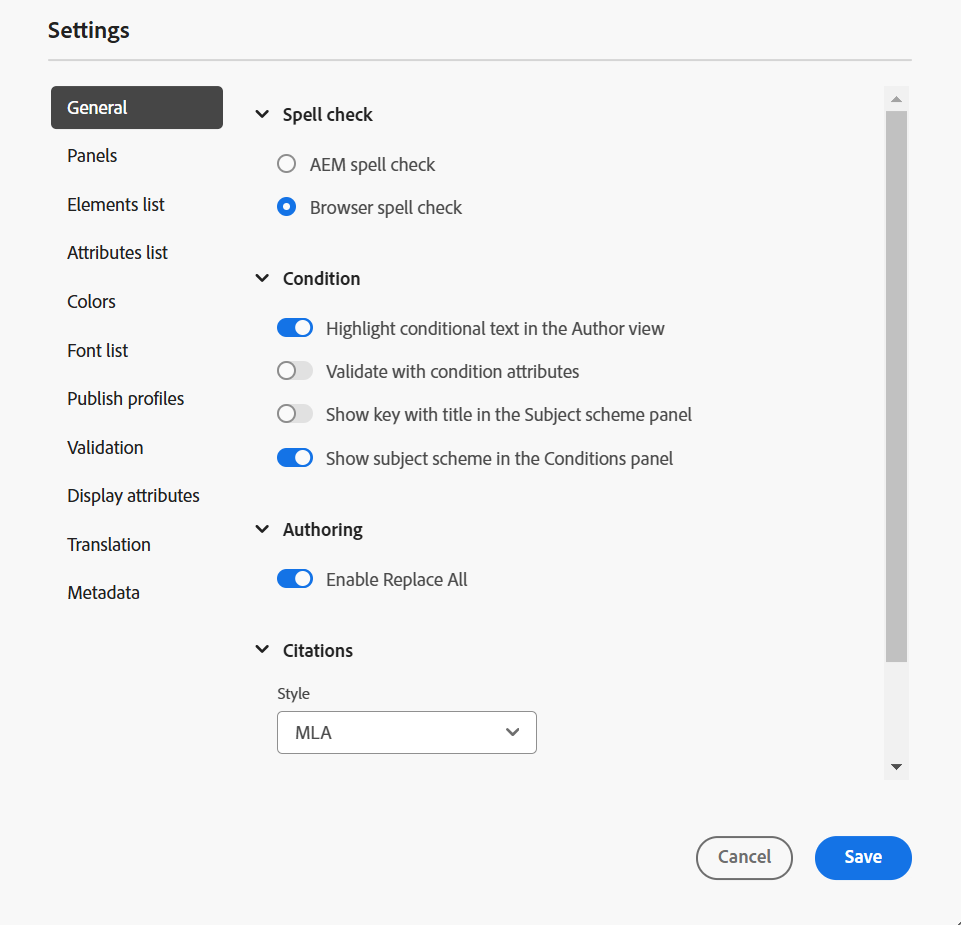
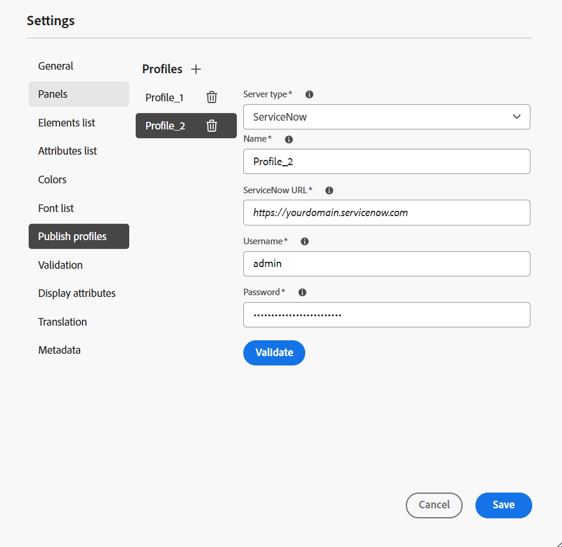
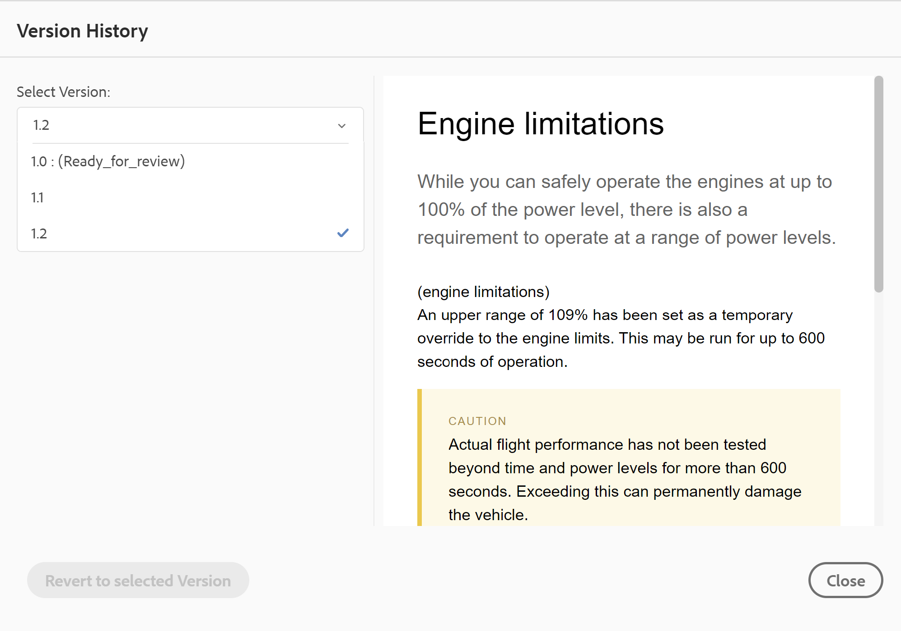
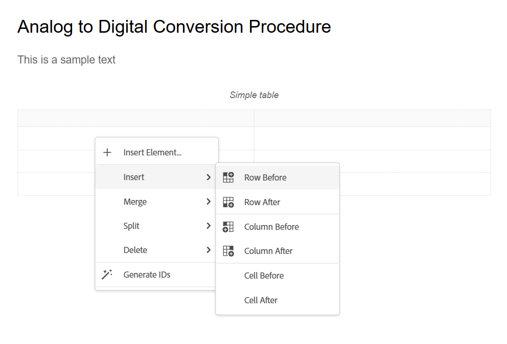
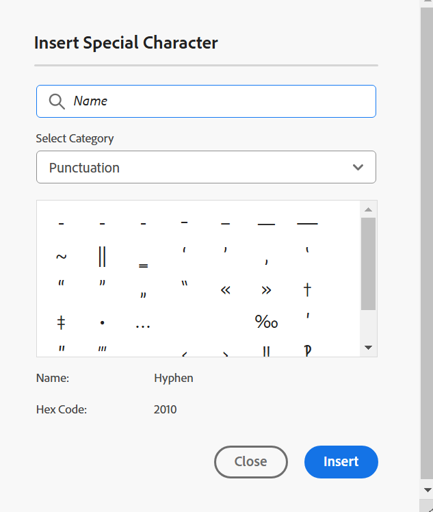
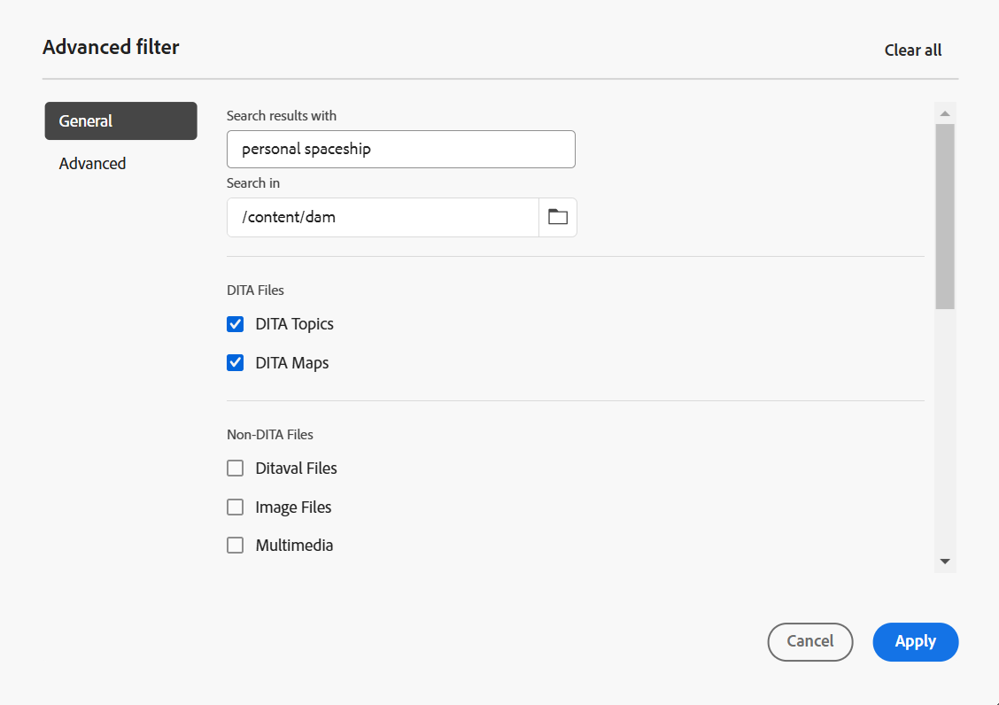
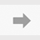

# Connaître les fonctionnalités de l’éditeur {#id176NC500V5Z}

Cette section décrit les différentes fonctionnalités disponibles dans l’éditeur. Nous pouvons diviser l’éditeur en sections ou zones suivantes :

- [Barre d’en-tête](#header-bar)
- [Barre de tabulation](#tab-bar)
- [Barre d’outils](#toolbar)
- [Panneau de gauche](#left-panel)
- [Zone d&#39;édition du contenu](#content-editing-area)
- [Panneau de droite](#right-panel)

La sous-section suivante couvre en détail les différentes sections de l’éditeur.

## Barre d’en-tête

La barre d’en-tête est la barre supérieure de l’éditeur qui affiche le logo de Adobe Experience Manager (ou un shell unifié si vous utilisez le shell unifié comme interface utilisateur de Experience Manager Guides). Lorsque vous sélectionnez le logo, il vous dirige vers la page de navigation d’Experience Manager.


Utilisez l’icône **Développer** dans la barre d’outils pour masquer la barre d’en-tête et agrandir la zone de contenu. Pour restaurer la vue standard, sélectionnez **Quitter la vue développée**.


## Barre de tabulation

La barre d’onglets se trouve en haut de l’interface de l’éditeur et permet d’accéder aux fonctionnalités suivantes :


**Onglets**

Affiche les rubriques actuellement ouvertes dans l’éditeur sous forme d’onglets de fichiers. Plusieurs rubriques peuvent être ouvertes en même temps et s’afficher dans leurs onglets respectifs dans la barre d’onglets. Par défaut, vous pouvez afficher les titres des fichiers dans les onglets. Pointez sur un fichier pour afficher le titre du fichier et son chemin d’accès sous forme d’info-bulle.

>[!NOTE]
>
> En tant qu’administrateur, vous pouvez également choisir d’afficher la liste des fichiers par nom de fichier dans les onglets. Sélectionnez l’option **Nom de fichier** de la section **Configuration de l’affichage des fichiers de l’éditeur** dans [Préférences utilisateur](./intro-home-page.md#user-preferences).

En sélectionnant l’onglet Fichier, vous accédez à un menu contextuel contenant les options Enregistrer en tant que nouvelle version, Copier, Localiser dans, Ajouter à, Propriétés, Fractionner, Télécharger en tant que PDF et Fermer .

**Enregistrer tout**

Enregistre les modifications que vous avez apportées à toutes les rubriques ouvertes. Si plusieurs rubriques sont ouvertes dans l’éditeur, sélectionnez **Enregistrer tout** ou utilisez les touches de raccourci **Ctrl**+**S** pour enregistrer tous les documents en un seul clic. Il n’est pas nécessaire d’enregistrer chaque document individuellement.

>[!NOTE]
>
> L’opération **Enregistrer tout** ne crée pas de nouvelle version de vos rubriques. Pour créer une nouvelle version, utilisez l’option **Enregistrer en tant que nouvelle version**.

**Assistant IA**

Un outil puissant et piloté par l’IA conçu pour améliorer votre productivité grâce à des fonctionnalités d’aide et de création intelligentes. Il réunit deux fonctionnalités d’IA puissantes (**Création** et **Aide** dans l’interface de Experience Manager Guides, ce qui vous permet de créer du contenu et d’accéder plus rapidement et plus efficacement aux informations de la documentation de Experience Manager Guides.

>[!NOTE]
>
> La fonctionnalité Assistant AI est actuellement disponible pour Adobe Experience Manager Guides as a Cloud Service.

**Développer la vue** : permet de développer la page vue à l’aide de l’icône **Développer**. Dans cet affichage, la barre d’en-tête contenant le logo Adobe Experience Manager est masquée. L’espace de contenu à modifier est ainsi optimisé. Pour revenir à la vue standard, utilisez l’icône **Quitter la vue développée**.

**Autres actions** : vous permet d’accéder à **Assets** et **Paramètres**.

L’option **Assets** vous dirige vers une destination en fonction de votre configuration :

- **Services cloud** : si vous utilisez des services cloud, la sélection de l’option **Assets** vous conduit à la page de navigation d’AEM.

- **Logiciel On-premise** : si vous utilisez Adobe Experience Manager Guides (4.2.1 et versions ultérieures), la sélection de l’option **Assets** vous conduit au chemin d’accès actuel au fichier dans l’interface utilisateur d’Assets.


L’option **Paramètres** est disponible uniquement pour les administrateurs et les administrateurs de profil de dossier. Elle permet de configurer les paramètres suivants :

>[!NOTE]
>
> Si vous mettez à jour des paramètres par défaut, vous devez rouvrir les documents pour que les modifications prennent effet.

- **Général** : les paramètres Général vous permettent de configurer le dictionnaire à utiliser avec l’éditeur. Cet onglet contient quatre sections : **Vérification orthographique**, **Condition**, **Création** et **Citations** .

  {width="650" align="left"}

   - **Vérification orthographique** : il existe deux options : **Vérification orthographique AEM** et **Vérification orthographique du navigateur**. Par défaut, l’éditeur utilise la fonction de vérification orthographique du navigateur , où la vérification orthographique est effectuée à l’aide du dictionnaire intégré du navigateur. Vous pouvez passer à la vérification orthographique d’AEM pour utiliser le dictionnaire Adobe Experience Manager, qui peut également être personnalisé pour ajouter votre liste de mots personnalisée. Pour plus d’informations sur la personnalisation du dictionnaire AEM, consultez la section [ Personnaliser le dictionnaire par défaut d’AEM ](../cs-install-guide/customize-aem-custom-dictionary.md) dans Installation et configuration d’Adobe Experience Manager Guides as a Cloud Service.

   - **Condition**

      - **Mettre en surbrillance le texte conditionnel en mode Création** : sélectionnez cette option pour mettre en surbrillance le texte conditionnel en mode Création. Le contenu conditionnel est mis en surbrillance à l’aide de la couleur définie pour la condition.

      - **Valider avec des attributs de condition** : sélectionnez cette option pour permettre la validation des valeurs définies pour les attributs. Cela vous empêche d’ajouter une valeur incorrecte.

      - **Afficher la clé avec le titre dans le panneau Schéma d’objet** : sélectionnez cette option pour afficher les clés ainsi que les titres dans le schéma d’objet. Si vous ne sélectionnez pas cette option, seuls les titres s’affichent. Par exemple, les clés « os », « audience » et « other » sont également affichées avec les titres.

        {width="550" align="left"}

      - **Afficher le schéma d’objet dans le panneau Conditions** : sélectionnez cette option pour afficher un schéma d’objet dans le panneau Conditions. Si vous désélectionnez cette option, les conditions définies s’affichent dans le panneau Conditions .

   - **Création**

      - **Activer tout remplacer** : sélectionnez cette option pour afficher l’icône **Tout remplacer** dans le panneau **Rechercher et remplacer**.

   - **Citations**
Modifier le style des citations. Choisissez le style de citation dans la liste déroulante que vous souhaitez utiliser dans votre projet. Pour plus d’informations, voir [Modifier les styles de citation](./web-editor-apply-citations.md#change-citation-style).

   - **Assistant IA**
Sélectionnez cette option pour activer la fonctionnalité [Assistant IA](./ai-assistant.md) dans Experience Manager Guides. Désélectionnez cette option pour désactiver la fonction.

**Panneaux** : ce paramètre contrôle les panneaux affichés dans les panneaux gauche et droit de la console Éditeur et Carte. Vous pouvez activer/désactiver le bouton pour afficher ou masquer le panneau souhaité.

{width="650" align="left"}

Vous pouvez également définir l’ordre dans lequel les fonctionnalités présentes dans les panneaux sont affichées. Pour modifier l’ordre par défaut des fonctions disponibles dans les panneaux, sélectionnez les barres en pointillés afin de faire glisser et de déposer les onglets des fonctions à l’emplacement souhaité. Une fonction peut également être déplacée de la section **Plus** vers la section principale d’un panneau, et inversement, en fonction des besoins. Une fois réorganisées, les fonctions apparaissent dans la même séquence dans le panneau de droite et de gauche correspondant.

{width="650" align="left"}


Vous pouvez afficher huit panneaux à la fois au maximum. Toutes les modifications apportées aux paramètres du panneau sont appliquées immédiatement.


>[!NOTE]
>
> Si un panneau personnalisé a été configuré, il apparaît également dans la liste des panneaux. Vous pouvez activer/désactiver le basculement pour afficher ou masquer le panneau personnalisé.

- **Liste d’éléments** : en tant qu’administrateur, vous pouvez contrôler la liste des éléments qu’un auteur peut insérer dans un fichier et également définir le nom d’affichage de l’élément. Le paramètre de liste Éléments vous permet de spécifier le nom de l&#39;élément selon les spécifications DITA et un libellé que vous souhaitez utiliser à la place du nom d&#39;élément défini par DITA :

  {width="650" align="left"}

Dans la capture d’écran ci-dessus, l’élément `p` a reçu le libellé Paragraphe et `codeblock` reçoit le libellé Bloc de code ainsi que d’autres éléments. Si vous sélectionnez l&#39;option **Utiliser uniquement au-dessus des éléments**, seuls les éléments valides \(au point d&#39;insertion actuel\) de cette liste seront affichés dans la boîte de dialogue **Insérer un élément**.

Dans la capture d’écran suivante, seuls 3 des 4 éléments configurés de la capture d’écran précédente sont affichés dans le contexte actuel :

{width="300" align="left"}

- **Liste Attributs** : tout comme la liste des éléments, vous pouvez contrôler la liste des attributs et leurs noms d’affichage à afficher dans la liste des attributs d’un élément. Dans la capture d’écran suivante, seuls 3 attributs ont été configurés pour être affichés dans la liste d’attributs d’un élément :

  {width="650" align="left"}

  Avec ce paramètre, lorsque vous essayez d’ajouter un attribut à un élément, vous ne voyez que la liste des attributs configurés dans la liste.

  {width="300" align="left"}

- **Couleurs** : affiche une liste des couleurs d’arrière-plan préconfigurées pour **Conditions**. Les utilisateurs peuvent sélectionner une couleur d’arrière-plan lors de l’application d’une condition à une rubrique. En tant qu’administrateur, vous pouvez également créer et ajouter des couleurs d’arrière-plan personnalisées à la liste. Pour ajouter une nouvelle couleur, saisissez le nom souhaité dans le champ **Nom de la couleur**, choisissez une couleur personnalisée, puis sélectionnez l’icône **+**. La couleur personnalisée s’affiche à la fin de la liste des couleurs.

- **Publier les profils** : contient les profils qui peuvent être utilisés pour publier la sortie **Base de connaissances**. Vous pouvez créer un profil pour une base de connaissances cible. Par exemple, Salesforce ou ServiceNow.

   - **Créer un profil Salesforce**

     **Conditions préalables**

      - Créez une application connectée pour Salesforce. Pour plus d’informations, voir [Activer les paramètres OAuth pour l’intégration de l’API](https://help.salesforce.com/s/articleView?id=sf.connected_app_create_api_integration.htm&amp;type=5).

      - Lors de la configuration de l’application connectée, assurez-vous des points suivants :

         - Spécifiez le rappel .

           `URL: http://<server name>:<port>/bin/dxml/thirdparty/callback/salesforce`

         - Sélectionnez les portées OAuth suivantes :
            - Accès complet (complet)
            - Sélectionnez Gérer les données utilisateur via les API (api) .

     Une fois l’application configurée, Salesforce fournit une **Clé du client** et **Secret du client**. Ils peuvent être utilisés pour créer le profil Salesforce.


   - Pour créer un profil Salesforce, sélectionnez la base de connaissances **Salesforce** dans le menu déroulant **Type de serveur**. Saisissez un nom de profil. Dans l’**URL du site**, saisissez le site client que vous utiliserez pour publier la sortie, puis ajoutez les **Clé du client** et **Secret du client** fournis par le site client Salesforce. Ensuite, **Valider** et **Enregistrer** le profil nouvellement créé.

     {width="550" align="left"}

     >[!NOTE]
     >
     >Pour configurer un proxy pour Salesforce dans Experience Manager Guides, utilisez la configuration proxy de composants HTTP Apache dans AEM. Découvrez comment [configurer le proxy pour le Vérificateur de lien AEM](https://helpx.adobe.com/experience-manager/kb/How-to-configure-proxy-for-the-AEM-Link-Checker-AEM.html).


   - **Créer un profil ServiceNow**

     **Conditions préalables**

     Configurez le serveur ServiceNow pour charger les ressources.
      - Se connecter au serveur **ServiceNow**.
      - Accédez à **Propriétés du système** > **Sécurité**.
      - Désélectionnez l’option suivante :

        **Cette propriété doit être définie pour activer la vérification de type MIME pour les chargements (toutes les versions Eureka et ultérieures). Active (true) ou désactive (false) la validation du type MIME pour les pièces jointes. Les extensions de fichier configurées via glide.attachment.extensions seront vérifiées pour le type MIME lors du chargement.**

      - Sélectionnez **Enregistrer**.

     Une fois que vous avez configuré l’application, créez le profil **ServiceNow**.
   - Pour créer un profil, sélectionnez la base de connaissances ServiceNow dans le menu déroulant **Type de serveur**. Saisissez un profil **Nom**. Dans l’URL **ServiceNow**, saisissez le site client que vous utiliseriez pour publier la sortie, puis ajoutez les **Nom d’utilisateur** et **Mot de passe** fournis par le site client ServiceNow. Ensuite, **Valider** et **Enregistrer** le profil nouvellement créé.

     {width="550" align="left"}

  Après la validation, vous pouvez sélectionner le profil de publication dans les paramètres prédéfinis de sortie d&#39;un plan DITA et l&#39;utiliser pour générer la sortie vers le serveur **Salesforce** ou **ServiceNow** que vous avez choisi.

  En savoir plus sur le paramètre prédéfini de sortie [Base de connaissances](../user-guide/generate-output-knowledge-base.md).


- **Validation** : cet onglet contient des options pour configurer les validations du schéma dans l’éditeur. Vous pouvez activer les fonctionnalités suivantes :

   - **Exécuter la vérification de validation avant d’enregistrer le fichier** : sélectionnez cette option pour exécuter les validations Schematron à l’aide du ou des fichiers Schematron sélectionnés avant toute opération d’enregistrement. Vous pouvez ajouter un fichier de schéma en sélectionnant l’icône + . Le ou les fichiers Schematron sélectionnés sont répertoriés.

     >[!NOTE]
     >Le ou les fichiers de schéma sélectionnés seront conservés pour le profil de dossier sélectionné.

     {width="550" align="left"}

     Cela empêche les utilisateurs d’enregistrer tout fichier qui enfreint une règle définie dans le ou les fichiers de schéma sélectionnés. Si cette option n’est pas sélectionnée, le fichier ne sera pas validé avant d’enregistrer les modifications.

   - **Autoriser tous les utilisateurs à ajouter des fichiers Schematron dans le panneau de validation** : sélectionnez cette option pour autoriser les utilisateurs à ajouter n’importe quel fichier Schematron dans le panneau Validation de l’éditeur. Cela permet aux utilisateurs d’ajouter des fichiers Schematron, puis de valider les rubriques par rapport au fichier Schematron. Si cette option n’est pas sélectionnée, l’option permettant d’ajouter un fichier de schéma **Ajouter un fichier de schéma** n’est pas disponible pour les utilisateurs dans le panneau **Validation** de l’éditeur.


- **Attributs d’affichage** : à l’instar de la liste Attributs , vous pouvez contrôler la liste des attributs à afficher dans la liste des attributs d’un élément. Par défaut, quatre **attributs d’affichage** — audience, plateforme, produit et props ont été configurés pour être affichés dans la liste d’attributs d’un élément. Vous pouvez également ajouter un attribut d’affichage à l’aide de l’icône **Ajouter** située en haut. Vous pouvez également supprimer l’un des attributs d’affichage à l’aide de l’icône **Supprimer**.

  Les attributs définis pour un élément sont affichés en mode Mise en page et Plan.

  {width="550" align="left"}

- **Traduction** : cet onglet contient les options permettant de créer des groupes de langues, de propager les libellés source vers la version cible et de nettoyer le projet de traduction.

  {width="550" align="left"}

   - **Groupes de langues** : en tant qu’administrateur, vous pouvez créer un groupe de langues et les utiliser comme un ensemble pour traduire le contenu.\
     Pour créer un groupe de langues, procédez comme suit :
      1. Sélectionnez **Ajouter**.
      1. Saisissez le nom du groupe linguistique. Chaque langue doit avoir un nom unique. Vous pouvez voir une erreur si le champ du nom est vide ou si le nom n’est pas unique.
      1. Sélectionnez les langues dans la liste déroulante. Vous pouvez sélectionner plusieurs langues.

     Saisissez les premiers caractères de la langue ou le code de langue pour filtrer les langues souhaitées. Par exemple, saisissez « en » pour filtrer toutes les langues qui contiennent « en » au début de leur nom ou de leur code.
      1. Sélectionnez l’icône Terminé pour ajouter les langues sélectionnées au groupe. Les langues s’affichent. Lorsque vous ajoutez trois langues ou plus, l’option **Afficher plus** s’affiche. Vous pouvez sélectionner **Afficher plus** pour afficher toutes les langues présentes dans le groupe.

         >[!TIP]
         >
         > Activez le bouton (bascule) **Afficher plus** pour **Afficher moins** et afficher uniquement quelques langues.

      1. Pointez sur les langues d’un groupe pour modifier  ou supprimer  les groupes de langues.
      1. Enregistrez le **Paramètres**.

         >[!NOTE]
         >
         >En tant qu’utilisateur, vous pouvez afficher les groupes linguistiques configurés sur votre profil de dossier.

   - **Propager les libellés de la version source vers la version cible** : sélectionnez cette option pour transmettre le libellé de la version du fichier source au fichier traduit. Par défaut, cette option est désactivée.
   - **Nettoyage du projet de traduction après l’achèvement** : sélectionnez cette option pour configurer les projets de traduction à désactiver ou à supprimer automatiquement après la traduction. Par défaut, l’option **Aucun** est sélectionnée, de sorte que le projet existe après la traduction.

     Vous pouvez désactiver les projets de traduction si vous souhaitez les utiliser ultérieurement. La suppression d’un projet supprime définitivement tous les fichiers et dossiers présents dans le projet.


- **Métadonnées** : vous pouvez contrôler les métadonnées de version de la rubrique et leurs valeurs à afficher dans la boîte de dialogue **Historique des versions**.  Dans le chemin d’accès des métadonnées, indiquez l’emplacement des nœuds à partir desquels vous souhaitez sélectionner les métadonnées. Vous pouvez également définir un nom personnalisé pour les métadonnées comme libellé. Les propriétés par défaut sont Titre, État du document et Balises.

  Les métadonnées peuvent être sélectionnées à partir de n’importe quelle propriété sous le nœud `/jcr:content` de la ressource. Vous pouvez donc ajouter le chemin de la propriété comme chemin des métadonnées.


  Une erreur s’affiche si le chemin d’accès aux métadonnées est vide. Si vous laissez le libellé vide, le dernier élément est sélectionné comme libellé.


  {width="550" align="left"}

  *Configurer les métadonnées de la boîte de dialogue **Historique des versions**.*


  Vous pouvez également définir l’ordre d’affichage de ces balises de métadonnées. Pour modifier l’ordre par défaut de ces balises, sélectionnez les barres pointillées pour faire glisser et déposer les balises à l’emplacement souhaité.
Les libellés de métadonnées apparaissent dans la même séquence dans la boîte de dialogue **Historique des versions** de l’éditeur.

## Barre d’outils

La barre d’outils s’affiche lorsque vous ouvrez une rubrique ou un mappage à modifier dans l’éditeur. Les fonctionnalités disponibles dans la barre d’outils sont les suivantes :

- [Menu déroulant](#menu-dropdown)
- [Options d&#39;insertion de contenu](#content-insertion-options)
- [Informations sur la version et bouton Enregistrer en tant que nouvelle version](#save-as-new-version)
- [Verrouiller/déverrouiller](#lockunlock)

>[!NOTE]
>
> Les fonctionnalités répertoriées ci-dessus s’appliquent uniquement aux fichiers de rubrique. Lorsque vous utilisez un fichier de mappage, différentes options s’affichent dans la barre d’outils en fonction de la vue actuelle de l’éditeur de mappages. Découvrez les options de la barre d’outils de l’éditeur de cartes dans le document [Fonctionnalités de l’éditeur de cartes](./map-editor-advanced-map-editor.md).

### Menu déroulant

La liste déroulante Menu permet d’accéder aux actions de modification, Rechercher et remplacer, Historique des versions, Libellé de version, Fusionner, Créer une tâche de révision, Suivi des modifications et Balises.

L’explication détaillée de ces fonctionnalités est la suivante :

**Modification des actions**

Lorsque vous modifiez une rubrique dans l’éditeur, accédez aux différentes actions d’édition telles que **Couper** ou ***Ctrl***+***X*** , **Copier** ou ***Ctrl***+***C*** , **Undo** ou ***Ctrl***+***Z*** ou **Ctrl**+***Y*** et ***Delete*** **** présentes dans la liste déroulante Menu .


**Rechercher et remplacer**

La fonction **Rechercher et remplacer** est disponible dans les modes d’affichage Auteur et Source. Lorsqu’elle est activée, la barre de texte Rechercher et remplacer s’affiche au bas de la zone d’édition de la rubrique. Vous pouvez utiliser les touches de raccourci **Ctrl**+**F** pour appeler la barre de recherche et de remplacement.

{width="800" align="left"}

À l’aide de l’icône de paramètres \(\), vous pouvez activer ou désactiver les options de recherche **Ignorer la casse** et **Mot entier uniquement**. Pour effectuer une recherche qui ne respecte pas la casse, activez l’option **Ignorer la casse** en \(ou sélectionnez\). Sinon, si vous souhaitez effectuer une recherche sensible à la casse, désactivez l’option **Ignorer la casse**. Vous pouvez également choisir de rechercher un mot entier.

La recherche est instantanée, ce qui signifie que lorsque vous saisissez l’expression ou le mot à rechercher dans le champ **Rechercher**, le terme est immédiatement recherché et sélectionné dans le sujet. De même, pour remplacer un texte dans votre rubrique, saisissez le terme de recherche et son remplacement dans les champs respectifs et sélectionnez le bouton **Remplacer** ou **Tout remplacer**.

Dans la vue Source, la fonction **Rechercher et remplacer** est extrêmement utile pour rechercher un élément ou un attribut spécifique. Par exemple, si vous souhaitez remplacer la valeur de l’attribut `@product`, vous pouvez facilement le faire à partir de la vue Source. La vue Auteur ne vous permet pas d’effectuer une recherche sur la base d’un attribut ou d’un élément. Toutefois, vous devez faire preuve de prudence lors de l’utilisation de la fonction **Tout remplacer**, car elle peut remplacer le code XML.

**Historique des versions**

La fonction **Historique des versions** de l&#39;éditeur vous permet de vérifier les versions disponibles de vos fichiers DITA, de les comparer et de revenir à n&#39;importe quelle version de l&#39;éditeur lui-même. Vous pouvez comparer le contenu et les métadonnées de la version actuelle (qui peut également être une copie de travail) avec n’importe quelle version précédente du même fichier. Vous pouvez également afficher les libellés et les commentaires des versions comparées.

>[!NOTE]
>
> Les options Historique des versions n&#39;apparaissent que si des modifications sont apportées à la première version de la rubrique ou de la carte.

Pour accéder à l’historique des versions et revenir à une version spécifique de votre rubrique, procédez comme suit :

1. Ouvrez une rubrique dans l’éditeur.
1. Sélectionnez **Historique des versions** dans le menu déroulant **Menu**.

   La boîte de dialogue **Historique des versions** s’affiche.

   {width="550" align="left"}

   *Prévisualiser les modifications dans les différentes versions d&#39;une rubrique.*

1. Sélectionnez la version de la rubrique que vous souhaitez comparer ou revenir à dans la liste déroulante **Comparer avec**.

   >[!NOTE]
   >
   > Si des libellés sont appliqués à une version, ils sont également affichés \(entre parenthèses\) avec le numéro de version.

1. Activez l’option **Afficher les libellés et les commentaires** pour afficher les libellés et les commentaires appliqués aux versions actuelle et comparée.
1. Vous pouvez également afficher les informations suivantes dans la boîte de dialogue **Historique des versions** :

   Onglet **Aperçu** : le contenu nouvellement ajouté est dans la police verte et le contenu supprimé est dans la police rouge.

   Onglet **Métadonnées** : les métadonnées nouvellement ajoutées sont dans la police verte et les métadonnées supprimées sont dans la police rouge.

   {width="550" align="left"}

   *Comparez les métadonnées de différentes versions dans l’historique des versions.*

   >[!NOTE]
   >
   > Votre administrateur système peut modifier les métadonnées à afficher à partir de l’onglet Métadonnées dans le **Paramètres**. Pour plus d’informations, reportez-vous à la section **Autres actions** de la [barre d’onglets](#tab-bar).

   Vous pouvez également afficher les détails de l’utilisateur et de l’heure de la version actuelle et de la version comparée.

   Une fois que vous avez choisi une version dans la liste déroulante, l’option **Revenir à la version sélectionnée** est disponible. La fenêtre de prévisualisation affiche les différences entre la version actuelle et la version sélectionnée de la rubrique.

1. Sélectionnez **Rétablir la version sélectionnée** pour rétablir votre copie de travail avec la version sélectionnée de la rubrique.

   La boîte de dialogue Rétablir la version s’affiche.

   {width="550" align="left"}

1. \(*Facultatif*\) Indiquez un motif pour revenir à une version antérieure. Vous pouvez également créer une nouvelle version de la copie de travail active de votre rubrique.

1. Sélectionnez **Confirmer.**

   Votre copie de travail du fichier est rétablie à la version sélectionnée. Si vous choisissez de créer une nouvelle version de la copie de travail active, une nouvelle version du fichier est également créée avec toutes les modifications de travail.

   Lorsque vous revenez à une version antérieure, un indice visuel s’affiche indiquant que la version sur laquelle vous travaillez actuellement n’est pas la dernière version.

   {width="800" align="left"}

**Libellés de version**

Les libellés vous permettent d’identifier l’étape à laquelle une rubrique spécifique se trouve dans le DDLC \(cycle de vie du développement de document\). Par exemple, lorsque vous travaillez sur une rubrique, vous pouvez définir le libellé comme « Approuvé ». Une fois qu’une rubrique est publiée et mise à la disposition des clients, vous pouvez lui attribuer le libellé « Publié ».

Experience Manager Guides vous permet de spécifier des libellés dans un format de texte libre ou d’utiliser un ensemble de libellés prédéfinis. Le libellé personnalisé permet à tout auteur ou autrice du système de spécifier un libellé en fonction de son choix. Cela donne de la flexibilité ; cependant, cela introduit des libellés incohérents dans le système. Pour résoudre ce problème, les administrateurs et administratrices peuvent configurer un ensemble de libellés prédéfinis. Pour plus d’informations sur la configuration des libellés prédéfinis, consultez *Configuration et personnalisation de l’éditeur web XML* dans la section Installation et configuration d’Adobe Experience Manager Guides as a Cloud Service.

Ces libellés s’affichent sous la forme d’une liste déroulante à l’intention des auteurs qui souhaitent spécifier un libellé. Cela permet de s’assurer que seuls des libellés prédéfinis et cohérents sont utilisés dans le système.

Il existe différentes méthodes d’application des libellés à vos rubriques : panneau [Historique des versions](web-editor-use-label.md) dans l’interface utilisateur d’Assets, [Lignes de base](/help/product-guide/user-guide/generate-output-use-baseline-for-publishing.md) interface utilisateur et éditeur. La fonction Libellé de version de l’éditeur permet aux auteurs d’attribuer rapidement et facilement des libellés à leurs rubriques.

Pour ajouter des libellés à votre rubrique à partir de l’éditeur, procédez comme suit :

1. Ouvrez une rubrique dans l’éditeur.

1. Sélectionnez **Libellés de version** dans le menu déroulant Menu .

   La boîte de dialogue Gestion des libellés de version s’affiche.

   {width="650" align="left"}

   La boîte de dialogue Gestion des libellés de version est divisée en deux parties : le panneau de gauche contient une liste des versions disponibles pour la rubrique, une liste déroulante de libellés \(ou une zone de texte pour saisir un libellé\) et le panneau de droite avec un aperçu de la rubrique.

1. Sélectionnez la version sur laquelle vous souhaitez appliquer des libellés.

   Lorsque vous choisissez une autre version de la rubrique dans la liste des versions, le panneau d’aperçu affiche les modifications entre la version actuelle et la version sélectionnée de la rubrique

   >[!NOTE]
   >
   > Si un libellé est déjà appliqué à une version, il est affiché en regard du numéro de version dans la liste déroulante et sous la liste Sélectionner la version . Vous pouvez supprimer un libellé existant en sélectionnant l’icône \(**x**\) en regard du libellé.

1. Si votre administrateur a défini une liste de libellés, une liste déroulante des libellés s’affiche à partir de laquelle vous pouvez choisir les libellés à appliquer. Vous pouvez sélectionner plusieurs libellés dans la liste déroulante.

   Dans le cas contraire, une zone de texte s’affiche, dans laquelle vous pouvez saisir les libellés à ajouter à la rubrique.

   >[!NOTE]
   >
   > Vous ne pouvez pas appliquer le même libellé à plusieurs versions d’une rubrique. Si vous essayez d’associer un libellé existant, vous avez la possibilité de le supprimer de la version existante et de l’appliquer à la version sélectionnée de la rubrique.

1. Sélectionnez **Ajouter une étiquette**.

1. Dans le message de confirmation Appliquer le libellé , sélectionnez l’option **Déplacer le libellé (s’il est utilisé dans une autre version)** pour déplacer les libellés d’une version existante vers la version sélectionnée. Si vous ne sélectionnez pas cette option et que des libellés sont affectés à une autre version de la rubrique, ils ne sont pas déplacés vers la version de la rubrique sélectionnée. Ces libellés sont ignorés dans le processus d’application des libellés.

**Fusionner**

Lorsque vous travaillez dans un environnement multi-auteurs, il devient difficile de suivre les modifications que les autres auteurs ont apportées à une rubrique ou à un mappage. La fonction de fusion vous permet de mieux contrôler non seulement l’affichage des modifications, mais également les modifications conservées dans la dernière version du document.

- **Fusionner les fichiers de rubrique**

  Pour fusionner les modifications dans une rubrique, procédez comme suit :

   1. Ouvrez une rubrique dans l’éditeur.

   1. Sélectionnez **Fusionner**.

      La boîte de dialogue Fusionner s’affiche.

      {width="550" align="left"}

   1. *\(Facultatif\)* Vous pouvez également rechercher et sélectionner un nouveau fichier à partir d’un autre emplacement de votre référentiel.

   1. Sélectionnez la version du fichier avec laquelle vous souhaitez comparer la version actuelle du fichier.

   1. Dans la liste Options, choisissez :

      - **Suivi des modifications de la version sélectionnée** : cette option affiche toutes les mises à jour de contenu sous la forme de modifications suivies. Vous pouvez ensuite choisir d&#39;accepter ou de rejeter les modifications apportées au document une par une ou toutes en une seule fois.

      - **Rétablir la version sélectionnée** : cette option rétablit la version actuelle du document à la version sélectionnée. Cette option ne vous permet pas de contrôler le contenu accepté ou rejeté.

   1. Sélectionnez **Terminé**.

   1. Si vous avez sélectionné l’option **Suivi des modifications à partir de la version sélectionnée**, toutes les modifications de la version sélectionnée sont affichées dans la fonction Modifications suivies du panneau de droite.

      Vous pouvez choisir d’accepter ou de rejeter tous les commentaires du panneau Modifications suivies ou d’accepter ou de rejeter chaque commentaire.


- **Fusionner les fichiers de mappage**

  Pour fusionner les modifications dans un fichier de mappage, procédez comme suit :

   1. Ouvrez un mappage dans l’éditeur.

   1. Sélectionnez **Fusionner**.

      La boîte de dialogue Fusionner s’affiche.

      {width="550" align="left"}

   1. *\(Facultatif\)* Vous pouvez également rechercher et sélectionner un nouveau fichier à partir d’un autre emplacement de votre référentiel.

   1. Sélectionnez la version du fichier avec laquelle vous souhaitez comparer la version actuelle du fichier.

   1. Dans la liste Options, choisissez :

      - **Suivi des modifications de la version sélectionnée** : cette option affiche toutes les mises à jour de contenu sous la forme de suivi des modifications. Vous pouvez ensuite choisir d&#39;accepter ou de rejeter les modifications apportées au document une par une ou toutes en une seule fois.

      - **Rétablir la version sélectionnée** : cette option rétablit la version actuelle du document à la version sélectionnée. Cette option ne vous permet pas de contrôler le contenu accepté ou rejeté.

   1. Sélectionnez **Terminé**.

   1. Si vous avez sélectionné l’option **Suivi des modifications à partir de la version sélectionnée**, toutes les modifications de la version sélectionnée sont affichées dans le panneau Modifications suivies \(à droite\).

      Vous pouvez choisir d’accepter ou de rejeter toutes les modifications dans le panneau Modifications suivies ou d’accepter ou de rejeter des modifications individuelles dans le fichier de mappage.


**Créer une tâche de révision**

Vous pouvez [créer une tâche de révision](./review-send-topics-for-review.md) de la rubrique active ou mapper le fichier directement à partir de l&#39;éditeur. Ouvrez le fichier pour lequel vous souhaitez créer la tâche de révision et sélectionnez **Créer une tâche de révision** dans la liste déroulante du menu pour lancer le processus de création de révision.

**Suivi des modifications**

Vous pouvez conserver une trace de toutes les mises à jour apportées à un document en activant le mode Suivi des modifications . Une fois le suivi des modifications activé, toutes les insertions et suppressions sont capturées dans le document. Tout le contenu supprimé est mis en surbrillance avec des caractères barrés et toutes les insertions sont mises en surbrillance en vert. En outre, vous obtenez également les barres de modification à la périphérie de la page de rubrique. Une nouvelle fois, une barre rouge s’affiche pour le contenu supprimé et une barre verte pour le contenu ajouté. S’il y a un ajout et une suppression sur la même ligne, des barres vertes et rouges s’affichent.

La capture d’écran suivante met en surbrillance le contenu supprimé et inséré ainsi que les barres de modification :

{width="650" align="left"}

Un cas d’utilisation type pour le suivi des modifications dans un document peut être la réalisation d’une révision par les pairs. Vous pouvez activer le suivi des modifications et partager votre document pour révision, puis le réviseur ou la réviseuse apporte des modifications avec le suivi des modifications ACTIVÉ. Lorsque vous recevez le document, vous devez disposer d’un mécanisme pour afficher les mises à jour suggérées, ainsi que d’un moyen pratique d’accepter ou de rejeter les modifications.

Experience Manager Guides propose la fonction Modifications suivies qui contient des informations sur les mises à jour effectuées dans le document. La fonction Modifications suivies fournit des informations sur les mises à jour effectuées, leur auteur et l’heure. Grâce à la fonction Modifications suivies, vous pouvez également accepter ou refuser facilement les mises à jour suggérées dans le document.

Pour accéder à la fonctionnalité, sélectionnez l’icône **Suivi des modifications** dans le panneau de droite.

{width="300" align="left"}

La sélection d’une modification suivie sélectionne le contenu modifié dans le document. Vous pouvez accepter une modification en sélectionnant l&#39;icône Accepter la modification ou la rejeter en sélectionnant Rejeter la modification.

Pour accepter ou rejeter toutes les modifications en un seul clic, sélectionnez **Accepter toutes les modifications** ou **Rejeter toutes les modifications**.

>[!NOTE]
>
> Le mode Aperçu vous permet d’afficher le document avec ou sans les balises du contenu modifié. Pour plus d’informations, consultez le mode [Aperçu](web-editor-views.md#preview-mode-id19AAGL00163).

**Balises**

La fonction **Balises** de l&#39;éditeur est un bouton bascule qui contrôle la visibilité des éléments DITA. Lorsqu&#39;elle est activée, elle affiche des balises structurelles dans le contenu, ce qui vous permet d&#39;afficher et de gérer plus efficacement les éléments DITA sous-jacents. Lorsqu’il est désactivé, l’éditeur masque ces balises, offrant ainsi un environnement de création plus propre et plus ciblé.

La capture d’écran suivante présente un document dans lequel la vue Balises est activée :

{width="650" align="left"}

Les opérations suivantes peuvent être effectuées dans un document avec des balises :

- **Sélectionner un élément** : sélectionnez la balise d’ouverture ou de fermeture d’un élément pour sélectionner son contenu.

- **Développer ou réduire des balises** : sélectionnez la balise + ou - pour la développer ou la réduire.

- **Utiliser le menu contextuel** : le menu contextuel propose des options permettant de couper, copier ou coller l’élément sélectionné. Vous pouvez également insérer un élément avant ou après l’élément sélectionné. Les autres options vous permettent de Générer un identifiant ou d’ouvrir le panneau Propriétés pour l’élément sélectionné.

- **Glisser-déposer des éléments** : sélectionnez la balise d’un élément et glissez-déposez-la facilement dans votre document. Si l’emplacement de dépôt est un emplacement valide où l’élément est autorisé, l’élément est placé à l’emplacement déposé.


>[!NOTE]
>
> Si un utilisateur ou une utilisatrice active la vue Balises à partir de l’éditeur, elle reste activée même entre les sessions. Cela signifie que vous n’avez pas besoin d’activer à nouveau la vue Balises pour y accéder ultérieurement. La valeur par défaut de la vue Balises pour la session d’un nouvel utilisateur est déterminée par la propriété `tagsView` dans le fichier `ui\_config.json`. Pour plus d’informations, consultez la section [Configurer la valeur par défaut de la vue Balises](../cs-install-guide/configure-default-value-tags-view.md) dans Installation et configuration d’Adobe Experience Manager Guides as a Cloud Service.

### Options d&#39;insertion de contenu

**Element** - 

Insère un élément valide à l’emplacement valide actuel ou suivant. Vous pouvez également utiliser le raccourci clavier ***Alt***+***Entrée*** pour ouvrir la boîte de dialogue Élément. Par exemple, si vous modifiez un paragraphe, une liste d’éléments pouvant être insérés dans le paragraphe apparaît dans la boîte de dialogue **Élément**. Sélectionnez l’élément à insérer. Vous pouvez utiliser le clavier pour faire défiler la liste des éléments et appuyer sur ***Entrée*** pour insérer l’élément requis.

Vous pouvez afficher deux types d’éléments valides :

- **Éléments valides à l’emplacement actuel** : la liste affiche les éléments que vous pouvez insérer à l’emplacement actuel du curseur.

- **Éléments valides en dehors de l’emplacement actuel** : la liste affiche les éléments que vous pouvez insérer après l’un des parents de l’élément actif dans la hiérarchie d’éléments.

Par exemple, si vous vous trouvez dans l’élément de `<b>` intégré, vous pouvez insérer des éléments tels que `<u>`, `<xref>` ou `<i>` à l’emplacement actuel. En revanche, vous pouvez insérer des éléments tels que `<table>` et `<topic>` en dehors de l’emplacement actuel.

Vous pouvez également saisir un caractère ou une chaîne dans la zone de recherche et rechercher les éléments qui commencent par lui.

{width="300" align="left"}

*Saisissez &#39;t&#39; pour rechercher tous les éléments valides commençant par &#39;t&#39;.*

Si vous travaillez dans un élément de bloc tel qu&#39;un `note`, utilisez l&#39;icône Insérer un élément pour insérer un nouvel élément après l&#39;élément de `note`. Dans la capture d’écran suivante, un élément note a été inséré dans l’élément p \(paragraph\) :

{width="800" align="left"}

Si vous appuyez sur Entrée dans l’élément de note, un nouveau paragraphe est créé dans l’élément de note lui-même. Pour insérer un nouvel élément en dehors d’une note, sélectionnez l’élément p \(mis en surbrillance dans la capture d’écran\) dans le chemin de navigation des éléments, puis sélectionnez l’icône Élément ou appuyez sur ***Alt***+***Entrée*** pour ouvrir la boîte de dialogue Insérer un élément . Sélectionnez ensuite l’élément souhaité et appuyez sur Entrée pour insérer l’élément sélectionné après l’élément de note.

Vous pouvez également ajouter un élément entre deux éléments lorsqu’un curseur en forme de bloc clignotant s’affiche.


{width="300" align="left"}

Par exemple, si vous travaillez sur une rubrique DITA et que le curseur de bloc clignote entre la description courte et le corps, vous pouvez ajouter `prolog` élément , puis ajouter les détails copyright, auteur et autres.

Le menu contextuel vous permet également de saisir un nouvel élément. Effectuez un clic droit à n’importe quel emplacement de votre document pour appeler le menu contextuel. Dans ce menu, choisissez **Insérer un élément** pour afficher la boîte de dialogue **Insérer un élément** et choisissez l&#39;élément à insérer.

{width="300" align="left"}

**Paragraphe** - 

Insérer l’élément de paragraphe à l’emplacement valide actuel ou suivant.

**Liste à puces** - 

Crée une liste à puces à l’emplacement valide actuel ou suivant. Si vous vous trouvez dans une liste à puces et sélectionnez cette icône, l’élément est converti en paragraphe normal.

**Liste numérotée** - 

Crée une liste numérotée à l’emplacement valide actuel ou suivant. Si vous vous trouvez sur une liste numérotée et sélectionnez cette icône, l’élément est converti en paragraphe normal.

>[!NOTE]
>
>Vous pouvez également sélectionner l’option **Fractionner la liste** dans le menu contextuel d’un élément de liste pour fractionner la liste actuelle et commencer une nouvelle liste au même niveau.

**Tableau** - 

Insère un tableau à l’emplacement valide actuel ou suivant. Sélectionnez l&#39;icône Tableau pour ouvrir la boîte de dialogue Insérer un tableau simple.

{width="550" align="left"}

>[!NOTE]
>
> Vous pouvez également copier un tableau à partir de MS Word ou Excel et le coller dans le fichier de rubrique Experience Manager Guides. Le tableau copié est collé sous la forme `<simpletable>` ou `<tgroup>` selon les paramètres configurés dans la configuration de l’éditeur XML. Pour plus d’informations, consultez [Configuration de l’affichage des tableaux collés](../cs-install-guide/conf-pasted-tables.md).

Vous pouvez indiquer le nombre de lignes et de colonnes requis dans le tableau. Si vous souhaitez conserver la première ligne comme en-tête du tableau, sélectionnez l’option **Définir la première ligne comme en-tête**. Pour ajouter un titre à votre tableau, saisissez-le dans le champ Titre .

Une fois un tableau inséré, vous pouvez le modifier à l’aide du menu contextuel.

{width="550" align="left"}


À l’aide du menu contextuel du tableau, vous pouvez :

- Insérer des cellules, des lignes ou des colonnes

- Fusionner les cellules dans les directions droite et vers le bas

- Fractionner les cellules horizontalement ou verticalement

- Supprimer des cellules, des lignes ou des colonnes

- Générer des identifiants


Vous pouvez également définir des attributs sur plusieurs cellules, une ligne entière ou une colonne d’un tableau. Par exemple, pour aligner une cellule de tableau, faites glisser et sélectionnez la cellule souhaitée. Dans le panneau Propriétés du contenu (à droite), la propriété **Type** devient **entrée**.

1. Dans la section **Attributs**, sélectionnez **+Ajouter**.
1. Sélectionnez l’attribut `@valign` dans la liste déroulante **Attribut**.
1. Dans la liste déroulante Valeur , sélectionnez l’alignement du texte à appliquer aux cellules de tableau sélectionnées.
1. Sélectionnez **Ajouter.**

{width="800" align="left"}

**Image** - 

Insère une image à l’emplacement valide actuel ou suivant. Sélectionnez l’icône Image pour ouvrir la boîte de dialogue Insérer une image , puis recherchez et sélectionnez l’image à insérer.

>[!NOTE]
>
> Vous pouvez également ajouter une image en la faisant glisser de votre système local vers votre article. Dans ce cas, le fichier image est ajouté à l’aide du workflow **Télécharger Assets**.  Pour plus d’informations, consultez le workflow **Charger Assets** dans la section [Panneau de gauche](#left-panel).


{width="650" align="left"}

Vous pouvez ajouter un titre d’image/d’illustration et un texte secondaire pour l’image dans la boîte de dialogue Insérer une image .

>
>
> Lorsque vous insérez une image et spécifiez un texte secondaire pour celle-ci, il est ajouté dans l&#39;élément `<alt>` conformément aux dernières normes DITA. L&#39;utilisation de l&#39;attribut `@alt` pour le texte secondaire est obsolète, mais il reste pris en charge dans les versions précédentes de DITA.

À l’aide de l’option **Sélectionner un fichier**, vous pouvez rechercher le fichier image requis par nom de fichier. Vous pouvez également filtrer les résultats de la recherche par Chemin \(pour rechercher dans\), Collections, Type de fichier et Balises. Une fois que vous avez trouvé le fichier image requis, sélectionnez-le et choisissez **Sélectionner** pour insérer l’image dans votre document. Vous pouvez insérer différents formats de fichiers image, tels que `.png`, `.svg`, `.gif`, `.jpg`, `.eps`, `.ai`, `.psd`, etc.

Une fois que vous avez inséré une image, vous pouvez modifier sa hauteur, sa largeur, son emplacement et ses attributs à partir du panneau Propriétés du contenu . Sélectionnez le fichier image, puis apportez des modifications dans le panneau Propriétés du contenu du panneau de droite.

{width="800" align="left"}

Le champ Source affiche l’UUID du fichier image inséré. Vous pouvez obtenir le chemin d’accès complet au fichier image inséré en plaçant le pointeur de la souris sur le champ Source. Le chemin d’accès s’affiche dans l’info-bulle.

Vous pouvez redimensionner une image en fournissant une valeur de Hauteur ou de Largeur pour le fichier image. Les proportions de l’image sont conservées automatiquement. Si vous le souhaitez, vous pouvez également choisir de ne pas conserver les proportions du fichier image en sélectionnant l’icône de cadenas \(ou Conserver les proportions\) et en fournissant les valeurs Hauteur et Largeur .

Vous pouvez également définir le paramètre Emplacement de l’image sur Intégré ou Saut. Si vous choisissez d’utiliser l’option d’emplacement Saut , vous pouvez ensuite choisir où aligner l’image (Gauche, Centre ou Droite).

Vous pouvez également ajouter d’autres propriétés pour un fichier image en sélectionnant les propriétés requises dans le champ **Attributs**.

>[!NOTE]
>
>Vous pouvez également définir des zones cliquables \(zone cliquable\) dans votre image. Pour plus d’informations, reportez-vous à la description de la fonction **Insérer/modifier une zone cliquable** dans la section [Panneau de gauche](web-editor-features.md#left-panel).

**Menu contextuel des fichiers image ou multimédia**

Vous pouvez également effectuer certaines opérations courantes pour les images et les fichiers multimédias à l’aide du menu contextuel. Cliquez avec le bouton droit de la souris à n’importe quel emplacement de votre image pour appeler le menu contextuel.

Le menu contextuel propose des options permettant de couper, copier ou coller l’image ou le média. Vous pouvez insérer un élément avant ou après l’élément sélectionné. Vous avez également la possibilité de renommer ou de déplier un élément. Vous pouvez localiser l’image ou le média sélectionné dans le référentiel ou afficher l’aperçu du fichier dans l’interface utilisateur d’Assets.

Les autres options du menu contextuel vous permettent de copier un chemin d’accès, de modifier une zone cliquable, de renommer un élément, de créer un fragment de code ou de générer des identifiants pour l’élément sélectionné.

**Insérer/Modifier une zone cliquable**

Insère une zone cliquable sur l’image sélectionnée. Une image avec des zones cliquables pointant vers des rubriques ou des pages web est appelée zone cliquable.

Sélectionnez une image dans la rubrique active, puis sélectionnez l’icône Insérer/Modifier la zone cliquable pour ouvrir la boîte de dialogue Insérer une zone cliquable.

{width="650" align="left"}

Choisissez la forme préférée  de rectangle, Cercle  ou Polygone  pour définir une zone sur une image que vous voulez utiliser comme lien. Une fois la zone définie, la boîte de dialogue Référence s’affiche. Vous devez alors spécifier le lien vers le contenu interne ou externe :

{width="650" align="left"}

Si des zones se chevauchent, vous pouvez avancer ou reculer la forme en cliquant sur l&#39;icône correspondante dans la barre d&#39;outils. Vous pouvez également supprimer une zone en la sélectionnant et en cliquant sur l’icône Supprimer . Double-cliquez sur une zone pour ouvrir la boîte de dialogue Référence dans laquelle vous pouvez modifier le lien de destination. Une fois que vous avez marqué les zones requises sur votre image, enregistrez les modifications en sélectionnant **Terminé**.


**Multimédia**

Insère différents types de fichiers multimédias. Sélectionnez l’icône déroulante Multimédia et choisissez le type de fichier à insérer. Les formats multimédias pris en charge sont les suivants :

- Fichier audio
- Fichier vidéo
- YouTube
- Vimeo

Lorsque vous sélectionnez l’option Fichier audio ou vidéo , la vue du référentiel s’affiche et vous permet de rechercher et de sélectionner le fichier souhaité. Si vous choisissez YouTube ou Vimeo, la boîte de dialogue Insérer un fichier multimédia s’affiche. Collez le lien du fichier vidéo dans le champ Lien web et sélectionnez Insérer pour ajouter la vidéo à l’emplacement valide actuel ou suivant dans votre document.

>[!NOTE]
>
> Lors de l’ajout d’un lien vidéo YouTube, vous devez remplacer la chaîne `watch?v=` par `embed` dans l’URL. Par exemple, pour ajouter un lien vidéo YouTube : `https://www.youtube.com/**watch?v**=WlIKQOrmZcs`, vous devez l’ajouter en tant que : `https://www.youtube.com/**embed/**WlIKQOrmZcs`. Cette modification permet de s’assurer que la vidéo est incorporée dans la sortie AEM Site et PDF.

Vous pouvez également ajouter le fichier audio ou vidéo à partir de la boîte de dialogue Insérer un fichier multimédia. Sélectionnez l’option Fichier audio/vidéo , puis sélectionnez l’icône de navigation pour lancer la vue du référentiel. Sélectionnez le fichier audio ou vidéo dans le référentiel, puis sélectionnez **Sélectionner** pour ajouter le lien du fichier dans le champ Fichier audio/vidéo . Si vous choisissez un fichier vidéo, un aperçu du fichier s’affiche également dans la zone Aperçu . Vous pouvez lire le fichier vidéo pour en afficher l’aperçu.

{width="650" align="left"}

**Référence croisée**

Insérer des références de type Référence de contenu, Référence de clé de contenu, Référence de fichier, Lien web ou Lien e-mail.

Sélectionnez l’icône **Sélectionner un fichier** \(pour la référence de contenu et la référence de fichier\) ou **Sélectionner la carte racine** icône \(pour la référence de clé de contenu et la référence de clé\) et sélectionnez le fichier ou le contenu à lier.

{width="650" align="left"}

Un lien de la référence sélectionnée est ajouté dans le document. Le menu contextuel du lien vous donne les options suivantes :

- **Insérer un élément** : affiche une liste d’éléments valides que vous pouvez insérer dans le contexte donné.
- **Copier l’UUID** : copie l’UUID de la référence insérée.
- **Copier le chemin** : copie le chemin d’accès complet de la référence insérée.
- **Generate IDs** : génère un ID unique pour la référence insérée.

Vous pouvez également effectuer une recherche à l’aide de l’UUID du fichier que vous souhaitez référencer. Pour les liens Contenu et Référence de clé, saisissez l’UUID du fichier vers lequel vous souhaitez créer un lien afin que le fichier soit automatiquement recherché et affiché dans la section Aperçu . Lorsque vous spécifiez l’UUID du fichier, vous n’avez pas besoin de mentionner explicitement l’extension de fichier pour les fichiers .xml. L’extension .xml est ajoutée automatiquement à l’UUID.

{width="650" align="left"}

Si votre administrateur a activé l’option UUIDs dans *XMLEditorConfig*, l’UUID du contenu référencé s’affiche dans la propriété **Link**.

{width="800" align="left"}

>[!NOTE]
>
> Si l’option **Activer les UUIDs** n’est pas activée, le chemin d’accès relatif du contenu référencé s’affiche.

>[!IMPORTANT]
>
> Même si le chemin d’accès relatif du contenu référencé est affiché dans la propriété **Link**, le lien est créé en interne à l’aide de l’UUID du contenu référencé.

>[!TIP]
>
> Consultez la section Références du guide des bonnes pratiques pour connaître les bonnes pratiques relatives au référencement de contenu.

**Filtrer la recherche**

Vous pouvez rechercher du texte dans les fichiers présents sur le chemin d’accès sélectionné du référentiel AEM. Par exemple, la recherche « général » est effectuée dans la capture d’écran ci-dessous. Vous pouvez également affiner votre recherche à l’aide de filtres améliorés. Vous pouvez rechercher tous les fichiers DITA tels que les rubriques DITA et les plans DITA présents sur le chemin d&#39;accès sélectionné.

Vous pouvez rechercher des fichiers non-DITA tels que des fichiers image, des fichiers multimédias et des documents dans le chemin d&#39;accès sélectionné. Vous pouvez également rechercher des valeurs spécifiques dans les attributs des éléments DITA. Vous pouvez également rechercher les fichiers qui sont extraits par l’utilisateur spécifié.

{width="650" align="left"}

>[!NOTE]
>
> Votre administrateur système peut également configurer les filtres de texte et afficher ou masquer d’autres filtres. Pour plus d’informations, consultez la section *Configurer les filtres de texte* dans la section Installation et configuration d’Adobe Experience Manager Guides as a Cloud Service.

La liste des fichiers filtrés contenant le texte recherché s’affiche. Par exemple, dans la capture d’écran ci-dessus, les fichiers contenant le texte « général » sont répertoriés. Vous pouvez également prévisualiser le contenu du fichier.


**Contenu réutilisable** - 

Réutilisez le contenu existant dans tout autre document du projet. Vous pouvez insérer du contenu en établissant un lien direct vers le contenu d’un fichier ou en utilisant une référence de clé, afficher [Résoudre les références de clé](map-editor-other-features.md#id176GD01H05Z). Lorsque vous sélectionnez l’icône Contenu réutilisable , la boîte de dialogue Réutiliser le contenu s’affiche :

{width="650" align="left"}

Dans la boîte de dialogue Réutiliser le contenu, sélectionnez le fichier DITA pour les références de fichier ou le fichier DITA map qui contient les références clés. Une fois la rubrique ou les références clés sélectionnées, elles s’affichent dans la boîte de dialogue. Vous pouvez sélectionner l’ID/la clé de la rubrique à insérer et sélectionner **Terminé** pour insérer le contenu dans la rubrique.

Pour insérer une référence de contenu, vous pouvez également saisir l’UUID du fichier et le contenu réutilisable de ce fichier est répertorié dans la section Aperçu .

Selon le paramètre d’insertion de liens, vous pouvez afficher l’UUID du contenu inséré ou le chemin d’accès relatif dans le panneau Propriétés ou dans l’affichage du code Source. Le lien est toujours créé à partir de l’UUID du contenu référencé. Affichez *Configurer des liens basés sur l’UUID* dans la section Installation et configuration d’Adobe Experience Manager Guides as a Cloud Service.

>[!NOTE]
>
> Pour ajouter du contenu avant ou après le contenu référencé, utilisez les touches fléchées *Alt*+*Gauche* ou Alt+*Droite* pour déplacer le curseur à l’emplacement souhaité.

Vous pouvez également incorporer le contenu référencé dans la rubrique en cliquant avec le bouton droit sur le contenu référencé et en choisissant **Remplacer la référence par le contenu** dans le menu contextuel.

**Symbole** - 

Insère des caractères spéciaux dans votre rubrique. Sélectionnez l’icône Symbole pour ouvrir la boîte de dialogue Insérer un caractère spécial .

>[!NOTE]
>
> Experience Manager Guides fournit des boîtes de dialogue mobiles et redimensionnables. Les boîtes de dialogue comportant deux lignes croisées dans le coin inférieur droit peuvent être redimensionnées. Les lignes croisées de la boîte de dialogue Caractère spécial sont affichées ci-dessous.

{width="550" align="left"}

Dans la boîte de dialogue Insérer un caractère spécial, vous pouvez rechercher un caractère spécial en utilisant son nom. Tous les caractères spéciaux sont stockés dans différentes catégories. Utilisez la liste déroulante Sélectionner une catégorie et sélectionnez une catégorie. Les caractères spéciaux disponibles dans la catégorie sélectionnée s’affichent. Vous pouvez parcourir la liste des caractères spéciaux à l’aide des touches fléchées ou sélectionner le caractère que vous souhaitez insérer. Le nom et le code hexadécimal du caractère spécial sélectionné s’affichent sous la liste. Sélectionnez **Insérer** pour insérer le caractère sélectionné dans votre document.

**Mot-clé** - 

Insérer un mot-clé défini dans votre plan DITA. Sélectionnez l’option Mot-clé pour ouvrir la boîte de dialogue Référence de clé .

{width="550" align="left"}

Les mots-clés sont répertoriés dans l’ordre alphabétique et vous pouvez également rechercher le(s) mot(s)-clé(s) en saisissant une chaîne de recherche dans la zone Rechercher . Le résultat de la recherche renvoie les mots-clés contenant la chaîne dans l’ID ou la Valeur. Les mots-clés définis dans votre plan DITA sont répertoriés dans cette boîte de dialogue. Choisissez le mot-clé à insérer et sélectionnez **Insérer**.

Vous pouvez également modifier les attributs du mot-clé inséré en cliquant avec le bouton droit sur le mot-clé et en sélectionnant l’option Attributs . La boîte de dialogue **Attributs pour le mot-clé) s’ouvre :

{width="550" align="left"}

Vous pouvez modifier les attributs du mot-clé ou ajouter un nouvel attribut au mot-clé.

**Fragments de code** - 

Insérez un fragment de code à l’emplacement valide actuel ou suivant. Pour que cette fonctionnalité fonctionne, des fragments de code doivent être définis dans votre système. Pour plus d’informations sur l’ajout d’un extrait de code, consultez la description de la fonctionnalité **Extrait de code** dans la section [Panneau de gauche](web-editor-features.md#left-panel).

Lorsque vous sélectionnez l’option Fragments de code, le catalogue Insérer un fragment de code s’affiche. Le catalogue est contextuel, ce qui indique qu’il n’affichera les fragments de code que s’ils sont autorisés à l’emplacement actuel.

L’exemple suivant illustre deux fragments de code préconfigurés, Avertissement et Erreur, qui peuvent être insérés à l’emplacement actuel du document.

{width="300" align="left"}

Lorsque vous choisissez un fragment de code dans la liste, il est inséré à l’emplacement valide actuel ou suivant dans le document. La capture d’écran suivante présente le fragment de code d’erreur inséré dans le document :

{width="400" align="left"}

**Citations** - 

Créez des citations et ajoutez-les à votre contenu. Découvrez comment [ajouter et gérer des citations dans votre contenu](./web-editor-apply-citations.md).

**Requête sur les données** - 

Connectez-vous à votre source de données et utilisez les données pour créer du contenu. Découvrez comment [utiliser les données de votre source de données](./web-editor-content-snippet.md).

### Informations sur la version et Enregistrer comme nouvelle version

La fonctionnalité **Informations sur la version et Enregistrer en tant que nouvelle version** combine le suivi des versions et l’enregistrement de contenu dans une seule fonctionnalité.

- Les informations de version affichent la version actuelle de la rubrique ou du mappage. Un astérisque (*) s’affiche en regard du numéro de version pour indiquer les modifications non enregistrées.

  Le numéro de version change à chaque nouvelle version créée pour le fichier de rubrique ou de mappage. Si vous travaillez sur un document nouvellement créé, les informations de version apparaissent sous la forme **aucune**.

  {width="800" align="left"}


- **Enregistrer en tant que nouvelle version** est un bouton qui enregistre les modifications que vous avez apportées à votre rubrique et crée également une nouvelle version de votre rubrique.

  {width="800" align="left"}


Lorsque vous choisissez d’enregistrer une rubrique ou un mappage à l’aide de **Enregistrer en tant que nouvelle version**, la boîte de dialogue suivante s’affiche :

{width="300" align="left"}

Saisissez les commentaires et les libellés de version pour identifier les modifications, puis sélectionnez **Enregistrer** pour créer une nouvelle version du fichier.

Lorsque vous sélectionnez l’option **Enregistrer en tant que nouvelle version**, la première version de la rubrique est créée dans la gestion des ressources numériques, qui devient également la version actuellement active de votre rubrique. Par la suite, si vous revenez à une ancienne version de la rubrique, celle-ci devient votre version active actuelle de la rubrique.

Si votre administrateur ou administratrice dispose de libellés de version préconfigurés, vous verrez ces libellés dans une liste déroulante. Vous pouvez choisir un libellé dans la liste des libellés disponibles et enregistrer votre document.

{width="300" align="left"}

Au moment d’enregistrer une rubrique, vous pouvez ajouter un commentaire spécifiant les modifications que vous avez apportées à la rubrique. Ce commentaire s’affiche dans l’historique des versions de la rubrique.

Si votre rubrique est en cours de révision, vos réviseurs et réviseuses reçoivent une notification indiquant qu’une version plus récente de la rubrique est disponible. Ils peuvent facilement accéder à la dernière révision de votre document et continuer à consulter la dernière version de votre rubrique.

Lorsque vous placez le pointeur de la souris sur le titre d&#39;une rubrique, le titre du fichier, le chemin d&#39;accès au fichier et le numéro de version s&#39;affichent.

{width="800" align="left"}

>[!NOTE]
>
> Une fois qu’une version de votre rubrique est disponible, vous pouvez également ajouter des libellés à votre rubrique. Ces libellés peuvent ensuite être utilisés pour créer une ligne de base pour publier une version spécifique de votre document. Pour plus d&#39;informations sur l&#39;utilisation des libellés dans vos rubriques, voir [Utiliser des libellés](web-editor-use-label.md#).

### Verrouiller/déverrouiller

Verrouille ou déverrouille le fichier courant. Le verrouillage d’un fichier vous donne un accès exclusif en écriture au fichier. Cela empêche d’autres utilisateurs de modifier le fichier. Déverrouillez le fichier si vous souhaitez que d’autres utilisateurs aient un accès en modification. Lorsque le fichier est déverrouillé, les modifications sont enregistrées dans la version actuelle du fichier.

{width="800" align="left"}

Si vous êtes dans la vue Carte et que vous développez la carte parente, vous pouvez verrouiller tous les fichiers de la carte d&#39;un seul clic. Développez simplement le fichier de mappage parent et sélectionnez le fichier parent, ce qui entraîne la sélection de tous les fichiers dans le mappage. Ensuite, vous pouvez sélectionner **Verrouiller**  pour obtenir le verrouillage sur tous les fichiers de la carte.

Dans le panneau Référentiel, les fichiers verrouillés s’affichent avec une icône de verrouillage. Lorsque vous pointez sur cette icône de verrouillage, l’icône Verrouillé par vous/nom d’utilisateur s’affiche sous forme d’info-bulle.

{width="350" align="left"}

Si un fichier est verrouillé par un autre utilisateur, le fait de pointer sur l’icône de verrouillage dans le référentiel affiche le nom de l’utilisateur qui l’a verrouillé. Dans ce cas, le fichier s’ouvre en mode lecture seule, avec un **accès en lecture seule** affiché en regard des informations de version.

En tant qu’administrateur, vous avez également accès à la fonctionnalité **Forcer le déverrouillage** qui vous permet de déverrouiller le fichier verrouillé par d’autres utilisateurs. Utilisez cette fonctionnalité pour accéder aux droits de modification d&#39;un fichier verrouillé par d&#39;autres utilisateurs.

{width="350" align="left"}

## Panneau de gauche

Le panneau de gauche vous donne un accès rapide aux collections, à la vue du référentiel, à la vue Carte et à d’autres fonctionnalités. Vous pouvez développer le panneau en sélectionnant l’icône **Développer** placée dans le coin inférieur gauche de l’interface. Une fois développé, utilisez l’icône **Réduire** pour réduire le panneau. Dans la vue développée, il affiche les noms des icônes qui apparaissent sous forme d’info-bulles dans la vue réduite.

>[!NOTE]
>
> Le panneau de gauche est redimensionnable. Pour redimensionner le panneau, placez le curseur sur la limite du panneau, le curseur se transforme en flèche à deux pointes, sélectionnez et faites glisser pour redimensionner la largeur du panneau.

Le panneau de gauche vous donne accès aux fonctionnalités suivantes :

- [Collections](#collections)
- [Référentiel](#repository)
- [Map](#map)
- [Contenu réutilisable](#reusable-content)
- [Esquisse](#outline)

Certaines des fonctionnalités du panneau de gauche sont disponibles dans la section **Plus**. Sélectionnez l’icône Plus  pour accéder aux fonctionnalités ci-dessous :

- [Glossaire](#glossary)
- [Conditions](#conditions)
- [Schéma de l&#39;objet](#subject-scheme)
- [Fragments de code](#snippets)
- [Modèles](#templates)
- [Citations](#citations)
- [Variables de langue](#language-variables)
- [Variables](#variables)
- [Rechercher et remplacer](#find-and-replace)
- [Modèles PDF](#pdf-templates)
- [Révision](#review)


Une option supplémentaire intitulée **Workfront** s’affiche également dans le panneau de gauche si Adobe Workfront est configuré.

Pour plus d’informations, consultez Intégration de [Workfront](./workfront-integration.md).

>[!NOTE]
>
> Les fonctionnalités disponibles dans le panneau de gauche sont gérées par votre administrateur, ce qui leur permet d’activer ou de désactiver les fonctionnalités individuelles présentes dans le panneau de gauche. Seules les fonctionnalités activées s’affichent dans le panneau de gauche. Pour plus d’informations, consultez la section **Panneaux** de la [barre d’onglets](#tab-bar).

L’explication détaillée des fonctionnalités du panneau de gauche est la suivante :

### Collections

Si vous travaillez sur un ensemble de fichiers ou de dossiers, vous pouvez les ajouter à votre liste préférée pour y accéder rapidement. **Collections** affiche la liste des documents que vous avez ajoutés et d’autres listes de documents accessibles au public provenant des autres utilisateurs.

Par défaut, vous pouvez afficher les fichiers par titres. Pointez sur un fichier pour afficher le titre du fichier et son chemin d’accès sous forme d’info-bulle.

>[!NOTE]
>
> En tant qu’administrateur, vous pouvez également choisir d’afficher la liste des fichiers par nom de fichier dans l’éditeur. Sélectionnez l’option **Nom de fichier** de la section **Configuration de l’affichage des fichiers de l’éditeur** dans **Préférences utilisateur**.

Pour créer une nouvelle collection, sélectionnez l’icône + en regard du panneau Collections pour afficher la boîte de dialogue **Nouvelle collection** :

{width="300" align="left"}

Saisissez un titre et une description pour la collection que vous souhaitez créer. Si vous sélectionnez **Public**, ce favori est également affiché aux autres utilisateurs.

>[!NOTE]
>
> Vous pouvez également créer une collection à partir de la page d’accueil de Experience Manager Guides. Ouvrez la page d’accueil, accédez au widget **Collections** dans la [section Aperçu](./intro-home-page.md#overview), puis sélectionnez **Nouvelle collection**.

Pour ajouter un fichier aux collections, utilisez l’une des méthodes suivantes :

- Accédez au fichier ou au dossier requis dans la vue Référentiel, sélectionnez l’icône *Options* pour ouvrir le menu contextuel, puis choisissez **Ajouter à** > **Collections**. Dans la boîte de dialogue **Ajouter aux collections**, vous pouvez choisir d’ajouter le fichier/dossier à un favori existant ou d’en créer un nouveau.

  {width="300" align="left"}

- Cliquez avec le bouton droit de la souris sur l’onglet d’un fichier dans l’éditeur pour ouvrir le menu contextuel. Choisissez **Ajouter à** > **Collections** pour ajouter le fichier à votre liste de favoris.

  {width="800" align="left"}


>[!NOTE]
>
> - Pour supprimer un élément de la liste des favoris, sélectionnez l’icône Options située en regard de l’élément dans une collection Favoris et choisissez **Supprimer des collections**.
> - Pour prévisualiser le fichier sans l’ouvrir, sélectionnez un fichier, puis sélectionnez **Aperçu** dans le menu Options.

**Menu Options d’une collection**

Vous pouvez également effectuer de nombreuses actions à l’aide du menu Options disponible pour une collection :

{width="650" align="left"}

- **Renommer** : renommez la collection sélectionnée.
- **Supprimer** : permet de supprimer la collection sélectionnée.
- **Actualiser** : obtenez une nouvelle liste de fichiers et de dossiers du référentiel.
- **Afficher dans l’interface utilisateur d’Assets** : afficher le contenu du fichier ou du dossier dans l’interface utilisateur d’Assets.

>[!NOTE]
>
> Vous pouvez également actualiser la liste à l’aide de l’icône Actualiser située en haut.


### Référentiel

Lorsque vous sélectionnez l’icône Référentiel , vous obtenez une liste de fichiers et de dossiers disponibles dans la gestion des ressources numériques (DAM). Par défaut, vous pouvez afficher les fichiers par titres. Pointez sur un fichier pour afficher le titre et le nom du fichier sous forme d’info-bulle.

>[!NOTE]
>
> En tant qu’administrateur, vous pouvez également choisir d’afficher la liste des fichiers par nom de fichier dans l’éditeur. Sélectionnez l’option **Nom de fichier** de la section **Configuration de l’affichage des fichiers de l’éditeur** dans **Préférences utilisateur**.

75 fichiers sont chargés à la fois. Chaque fois que vous sélectionnez **Charger plus**... 75 fichiers sont chargés et le bouton cesse d’être affiché lorsque tous les fichiers ont été répertoriés. Ce chargement par lots est efficace et vous pouvez accéder aux fichiers plus rapidement qu’avec le chargement de tous les fichiers existants dans un dossier.

Vous pouvez facilement accéder au fichier requis dans la gestion des ressources numériques et l’ouvrir dans l’éditeur. Si vous disposez de l’accès requis pour modifier le fichier, vous pouvez le faire.

Vous pouvez également sélectionner et lire un fichier audio ou vidéo dans l’éditeur. Vous pouvez modifier le volume ou
la vue de la vidéo. Dans le menu contextuel, vous avez également les options de téléchargement et de modification de la lecture
vitesse ou afficher l&#39;image en image.

Sélectionnez une carte et appuyez sur Entrée ou double-cliquez pour l’ouvrir dans la **vue Carte**. Pour plus d’informations, consultez la description de la fonctionnalité **Vue Carte** dans la section [Panneau de gauche](#left-panel). Sélectionnez une rubrique et appuyez sur Entrée ou double-cliquez pour l&#39;ouvrir dans la zone [Modification du contenu](#content-editing-area). La possibilité de naviguer et d’ouvrir un fichier directement depuis l’éditeur permet de gagner du temps et d’augmenter la productivité.

**Filtrer la recherche dans le référentiel**

L’éditeur fournit des filtres améliorés pour la recherche de texte. Vous pouvez rechercher et filtrer du texte dans les fichiers présents sur le chemin d’accès sélectionné du référentiel Adobe Experience Manager. Elle effectue une recherche dans le titre, le nom de fichier et le contenu des fichiers.


{width="300" align="left"}

*Appliquez des filtres pour rechercher les fichiers contenant le`personal spaceship.`* de texte

Sélectionnez l’icône **Filtrer la recherche** \(\) pour ouvrir le pop-up Filtre .

>[!NOTE]
>
> Lorsque vous recherchez du texte ou filtrez des fichiers, un point bleu s’affiche sur l’icône **Filtrer la recherche** \(\) pour indiquer que nous sommes sur le panneau de recherche et que certains filtres ont été appliqués.


Vous disposez des options suivantes pour filtrer les fichiers et affiner votre recherche dans le référentiel Adobe Experience Manager :

- **Fichiers DITA** : vous pouvez rechercher toutes les **rubriques DITA** et **cartes DITA** présentes sur le chemin d&#39;accès sélectionné. Ils sont sélectionnés par défaut.
- **Fichiers non-DITA** : vous pouvez rechercher **Fichiers Ditaval**, **Fichiers image**, **Multimédia**, **Documents** et **JSON** dans le chemin d’accès sélectionné.

   {width="300" align="left"}

  *Utilisez les filtres rapides pour rechercher des fichiers DITA et non DITA.*

**Filtrage avancé**

Sélectionnez l’icône **Filtrage avancé**  pour afficher la boîte de dialogue **Filtre avancé**.

Vous pouvez afficher les options suivantes sous les onglets **Général** et **Avancé**.

 {width="650" align="left"}


**Général**

- **Résultats de la recherche avec** : recherchez du texte dans les fichiers présents sur le chemin d’accès sélectionné du référentiel Adobe Experience Manager. La recherche porte sur le titre, le nom de fichier et le contenu des fichiers.

Cette opération est synchronisée avec la zone de recherche de la fenêtre du référentiel. Par exemple, si vous saisissez `general purpose` dans la zone de recherche du panneau Référentiel, elle apparaît également dans la boîte de dialogue **Filtre avancé** et vice versa.

- **Rechercher dans** : sélectionnez le chemin d’accès où vous souhaitez rechercher les fichiers présents dans le référentiel Adobe Experience Manager.

**Avancé**

- **Éléments DITA** : vous pouvez également rechercher des valeurs spécifiques dans les attributs des éléments DITA spécifiés.
   - Sélectionnez **Ajouter un élément** pour ajouter les éléments, les attributs et les valeurs.
   - Appliquez les filtres que vous avez sélectionnés.

- Sélectionnez **Effacer tout** pour effacer tous les filtres appliqués.


- Sélectionnez l’icône **Fermer le filtre**  pour fermer le filtre et revenir à l’arborescence du référentiel.

  >[!NOTE]
  >
  >Votre administrateur système peut également configurer les filtres de texte et afficher ou masquer d’autres filtres. Pour plus d’informations, consultez la section *Configurer les filtres de texte* dans la section Installation et configuration d’Adobe Experience Manager Guides as a Cloud Service.
  >
  >La liste des fichiers filtrés contenant le texte recherché s’affiche. Par exemple, les fichiers contenant le texte `personal spaceship` sont répertoriés dans la capture d’écran précédente. Vous pouvez sélectionner plusieurs fichiers dans la liste filtrée pour les faire glisser et les déposer dans une carte ouverte pour modification.

**Menu Options**

Outre l’ouverture de fichiers à partir du panneau de gauche, vous pouvez également effectuer de nombreuses actions à l’aide du menu Options disponible dans la vue Référentiel. Différentes options s’affichent, selon que vous choisissez un dossier, un fichier de rubrique ou un fichier multimédia.

**Options d’un dossier**

Vous pouvez effectuer les actions suivantes à l’aide du menu Options disponible pour un *dossier* dans la vue Référentiel :

{width="550" align="left"}


- **Nouveau** : créez une rubrique DITA, un plan DITA ou un dossier.

  Procédure à suivre pour créer une rubrique :
   1. Sélectionnez **Nouveau** > **Sujet**.
   2. La boîte de dialogue **Nouvelle rubrique** s&#39;affiche.

      {width="300" align="left"}

   3. Dans la boîte de dialogue **Nouvelle rubrique**, fournissez les détails suivants :
      - Titre de la rubrique.
      - \(Facultatif\)* Nom de fichier de la rubrique. Le nom du fichier est suggéré automatiquement en fonction du titre de la rubrique. Si votre administrateur a activé les noms de fichiers automatiques en fonction du paramètre UUID, vous ne verrez pas le champ Nom .
      - Modèle sur lequel la rubrique sera basée. Par exemple, pour une configuration prête à l’emploi, vous pouvez choisir parmi les modèles Vierge, Concept, DITAVAL, Référence, Tâche, Rubrique, Markdown, Glossaire et Dépannage. Si un profil de dossier est configuré sur votre dossier, seuls les modèles de rubrique configurés sur le profil de dossier sont affichés.

      - Chemin d’accès où enregistrer le fichier de rubrique. Par défaut, le chemin du dossier actuellement sélectionné dans le référentiel s’affiche dans le champ Chemin .

   4. Sélectionnez **Créer**. La rubrique est créée au chemin d’accès spécifié. En outre, la rubrique est ouverte dans l’éditeur pour modification.

  Procédure à suivre pour créer un plan DITA :

   1. Sélectionnez **Nouveau** > **Plan DITA**.
   2. La boîte de dialogue **Nouvelle carte** s’affiche.

      {width="300" align="left"}

   3. Dans la boîte de dialogue **Nouveau mappage**, fournissez les détails suivants :
      - Titre de la carte.
      - *\(Facultatif\)* Nom de fichier du mappage. Le nom du fichier est suggéré automatiquement en fonction du titre du mappage. Si votre administrateur a activé les noms de fichiers automatiques en fonction du paramètre UUID, vous ne verrez pas le champ Nom .
      - Un modèle sur lequel la carte sera basée. Par exemple, pour une configuration prête à l&#39;emploi, vous pouvez choisir parmi les modèles Bookmap ou DITA map.
      - Chemin où enregistrer le fichier de mappage. Par défaut, le chemin du dossier actuellement sélectionné dans le référentiel s’affiche dans le champ Chemin .
   4. Sélectionnez **Créer**. La carte est créée et ajoutée dans le dossier spécifié dans le champ Chemin d’accès . En outre, la carte est ouverte en mode Carte. Vous pouvez ouvrir le fichier de mappage dans l’éditeur de mappages et y ajouter une rubrique. Pour plus d’informations sur l’ajout de rubriques à un fichier de mappage, voir [Créer un mappage](map-editor-create-map.md#). Vous pouvez également sélectionner **Ouvrir dans la console de mappage** pour ouvrir la carte dans la console de mappage.

  Procédure à suivre pour créer un dossier :

   1. Sélectionnez **Nouveau** > **Dossier**.
   2. La boîte de dialogue **Nouveau dossier** s’affiche.

      {width="300" align="left"}

   3. Dans la boîte de dialogue **Nouveau dossier**, fournissez les détails suivants :
      - Un titre pour le dossier, qui est automatiquement converti en nom de dossier.
      - Chemin d’accès où enregistrer le dossier. Par défaut, le chemin du dossier actuellement sélectionné dans le référentiel s’affiche dans le champ Chemin .
   4. Sélectionnez **Créer**. Le dossier est créé et ajouté dans le dossier à partir duquel l’option Créer un dossier a été exécutée.

- **Télécharger Assets** : chargez un fichier depuis votre système local vers le dossier sélectionné dans le référentiel Adobe Experience Manager. Vous pouvez également glisser-déposer des fichiers de votre système local sur votre rubrique de travail actuelle. Ceci est très utile si vous souhaitez insérer des images de votre système local dans votre rubrique.

  {width="300" align="left"}

  Vous pouvez sélectionner le dossier dans lequel vous souhaitez charger le fichier. Un aperçu de l’image s’affiche également. Si vous souhaitez renommer le fichier, vous pouvez le faire dans la zone de texte Nom du fichier. Sélectionnez **Charger** pour terminer le processus de chargement du fichier. Si vous avez fait glisser et déposé un fichier image sur une rubrique, le fichier image est alors ajouté à l’article et il est également téléchargé.

  Si votre administrateur a activé l’option UUIDs dans *XMLEditorConfig*, l’UUID de l’image chargée s’affiche dans la propriété **Source**.

  {width="800" align="left"}

- **Rechercher des fichiers dans le dossier** : déplace le focus vers la recherche de référentiel dans laquelle vous pouvez saisir le terme de recherche. La recherche s’effectue sous le dossier sélectionné dans le référentiel. Vous pouvez également appliquer un filtre pour renvoyer les fichiers DITA, les fichiers image ou les deux.

  {width="300" align="left"}

  Vous pouvez également effectuer une recherche à l’aide de l’UUID d’un fichier. Dans ce cas, les résultats de la recherche affichent le titre du fichier DITA/XML et, dans le cas où le fichier est un fichier image, l&#39;UUID du fichier s&#39;affiche. Dans l’exemple de recherche suivant, l’UUID d’un fichier image est recherché et les résultats de la recherche affichent l’UUID du fichier image d’origine et le titre de rubrique du fichier dans lequel cette image est référencée.

  {width="300" align="left"}

- **Réduire** : réduisez le dossier sélectionné dans le référentiel.

  >[!NOTE]
  >
  > Utilisez l’icône **\>** en regard d’un dossier pour le développer.

- **Ajouter aux collections** : ajoute le dossier sélectionné aux favoris. Vous pouvez choisir de l’ajouter à une collection existante ou nouvelle.

- **Actualiser** : obtenez une nouvelle liste de fichiers et de dossiers du référentiel.
- **Afficher dans l’interface utilisateur d’Assets** : afficher le contenu du dossier dans l’interface utilisateur d’Assets.

**Options d’un fichier**

Accédez aux différentes options du menu Options selon que vous sélectionnez un fichier multimédia ou un fichier DITA. Voici quelques options courantes disponibles pour les fichiers multimédia et DITA :

- Modifier
- Ouvrir dans FrameMaker
- Doublon
- Verrouiller/déverrouiller
- Prévisualisation
- Déplacer vers
- Renommer
- Supprimer
- Générer
- Télécharger en tant que PDF
- Ajouter à
- Copier
- Afficher dans l’interface utilisateur d’Assets
- Propriétés


{width="550" align="left"}

Les différentes options du menu Options sont expliquées ci-dessous :

- **Modifier** : ouvrez le fichier pour le modifier. Dans le cas d’un fichier .ditamap/.bookmap, il est ouvert pour modification dans l’[Éditeur de carte](map-editor-advanced-map-editor.md#).

- **Dupliquer** : utilisez cette option pour créer un doublon ou une copie du fichier sélectionné. Vous avez également la possibilité de renommer le fichier en double dans l’invite de ressources en double. Par défaut, le fichier est créé avec un suffixe \(comme nom_fichier\_1.extension\). Le titre du fichier reste identique au fichier source et le nouveau fichier commence par la version 1.0. Toutes les références, balises et métadonnées sont copiées alors que les lignes de base ne sont pas copiées dans le fichier en double.
- **Verrouiller** : verrouillez le fichier sélectionné pour le modifier. Si le fichier est verrouillé, le fait de placer le pointeur de la souris sur l’icône de verrouillage indique **Verrouillé par vous** si vous l’avez verrouillé, ou **Verrouillé par [nom d’utilisateur]** si un autre utilisateur l’a verrouillé.

- **Aperçu** : obtenez un aperçu rapide du fichier (.dita, .xml, audio, vidéo ou image) sans l’ouvrir. Vous pouvez redimensionner le volet d’aperçu. Si le contenu contient des `<xref>` ou des `<conref>`, vous pouvez les sélectionner pour les ouvrir dans un nouvel onglet. Le titre du fichier s’affiche dans la fenêtre. Si aucun titre n’est présent, le nom du fichier s’affiche. Pour fermer le panneau **Aperçu**, vous pouvez sélectionner l’icône de fermeture ou sélectionner un emplacement en dehors du panneau.

  {width="800" align="left"}

- **Renommer** : utilisez cette option pour renommer le fichier sélectionné. Saisissez le nom du nouveau fichier dans la boîte de dialogue **Renommer la ressource**.
   - Vous pouvez renommer un fichier de n’importe quel type.
   - Vous ne pouvez pas modifier l’extension d’un fichier.
   - Deux fichiers ne peuvent pas porter le même nom. Par conséquent, vous ne pouvez pas renommer un fichier avec un nom qui existe déjà. Une erreur s’affiche.

- **Déplacer vers** : utilisez cette option pour déplacer le fichier sélectionné vers un autre dossier.
   - Vous pouvez saisir le nom du dossier de destination ou choisir **Sélectionner le chemin** pour sélectionner le dossier de destination.
   - Vous pouvez déplacer un fichier de n’importe quel type vers n’importe quelle destination dans le dossier Contenu.
   - Deux fichiers ne peuvent pas porter le même nom. Vous ne pouvez donc pas déplacer un fichier vers un dossier où un fichier portant le même nom existe déjà.

  Si vous essayez de déplacer un fichier vers un dossier dans lequel un fichier portant le même nom existe mais avec un titre différent, la boîte de dialogue Renommer et déplacer le fichier s’affiche et vous devez renommer le fichier avant de le déplacer. Le fichier déplacé dans le dossier de destination porte le nouveau nom de fichier.

  {width="550" align="left"}

  >[!NOTE]
  >
  > Vous pouvez également faire glisser un fichier vers un autre dossier de destination.

  **Scénarios d’exclusion**

  Experience Manager Guides ne vous permet pas de renommer ou de déplacer un fichier dans les scénarios suivants :

   - Vous ne pouvez pas déplacer ou renommer un fichier s’il fait partie d’une révision ou d’un workflow de traduction.

   - Si un autre utilisateur verrouille le fichier, vous ne pouvez pas le renommer ni le déplacer. L’option Renommer ou Déplacer vers ne s’affiche pas pour le fichier.

  >[!NOTE]
  >
  > Si votre administrateur vous a donné les autorisations sur un dossier uniquement, les options **Renommer** ou **Déplacer vers** s’affichent.

  <details>
    <summary> Services cloud </summary>

  Le changement de nom ou le déplacement d’un fichier n’interrompt pas les références existantes à partir du fichier ou vers le fichier, car chaque fichier a un UUID unique.
  </details>

- **Supprimer** : utilisez cette option pour supprimer le fichier sélectionné. Une invite de confirmation s’affiche avant la suppression du fichier.

   - Une invite de confirmation s’affiche avant la suppression du fichier.
   - Si le fichier n’est pas référencé à partir d’un autre fichier, il est supprimé et un message de réussite s’affiche.
   - Si le fichier est verrouillé, vous ne pouvez pas le supprimer et un message d’erreur s’affiche.

     >[!NOTE]
     >
     > Si votre administrateur a empêché la suppression des fichiers verrouillés, le message d’erreur s’affiche. Pour plus d’informations, consultez la section *Empêcher la suppression des fichiers extraits* dans la section Installation et configuration d’Adobe Experience Manager Guides as a Cloud Service.

   - Si le fichier est ajouté à une collection, la boîte de dialogue **Forcer la suppression** s’affiche et vous pouvez forcer sa suppression.
   - Si le fichier est référencé à partir d’un autre fichier **la boîte de dialogue** Forcer la suppression s’affiche et vous pouvez forcer la suppression du fichier :

     {width="300" align="left"}

     >[!NOTE]
     >
     > Si votre administrateur a autorisé la suppression du fichier, l’option **Forcer la suppression** est activée. Dans le cas contraire, la fonction **Forcer la suppression** est désactivée et un message s’affiche indiquant que vous n’êtes pas autorisé à supprimer les fichiers référencés. Pour plus d’informations, consultez la section *Empêcher la suppression des fichiers référencés* dans la section Installation et configuration d’Adobe Experience Manager Guides as a Cloud Service.

   - Si vous supprimez une rubrique référencée et que vous avez ouvert le fichier contenant les références pour le modifier, le lien rompu pour le fichier référencé s’affiche.

  >[!NOTE]
  >
  > Vous pouvez également supprimer le fichier sélectionné de la même manière à l’aide de la touche Supprimer du clavier.

- **Copier** : vous pouvez choisir parmi les options suivantes :

   - **Copier l’UUID** : copiez l’UUID du fichier sélectionné dans le presse-papiers.

   - **Copier le chemin d’accès** : copiez le chemin d’accès complet du fichier sélectionné dans le Presse-papiers.

- **Ajouter à** : vous pouvez choisir parmi les options suivantes :
   - **Collections** : ajoute le fichier sélectionné aux collections. Vous pouvez choisir de l’ajouter à une collection existante ou nouvelle.

   - **Contenu réutilisable** : ajoute le fichier sélectionné à la liste Contenu réutilisable dans le panneau de gauche.

- **Propriétés** : utilisez cette option pour ouvrir la page des propriétés du fichier sélectionné. Cette page de propriétés est également accessible à partir de l’interface utilisateur d’Assets en sélectionnant un fichier, puis en sélectionnant Icône Propriétés dans la barre d’outils.

- **Ouvrir dans le tableau de bord des cartes** : si le fichier sélectionné est un plan DITA, cette option ouvre le tableau de bord des cartes.

- **Ouvrir dans la console de mappage** : si le fichier sélectionné est un mappage DITA, cette option ouvre la console de mappage.

- **Modifier dans Oxygen** : sélectionnez cette option pour modifier le fichier sélectionné dans le plug-in Oxygen Connector. Le fichier est ouvert pour modification.

  >[!NOTE]
  >
  >Contactez votre équipe du succès client pour que cette fonctionnalité soit activée dans l’environnement. Cette fonctionnalité n’est pas activée dans le cadre de la prise en charge prête à l’emploi. Pour plus d&#39;informations, consultez la section [Configurer l&#39;option à modifier dans Oxygen](../cs-install-guide/conf-edit-in-oxygen.md) du Guide d&#39;installation et de configuration.


- **Afficher dans l’interface utilisateur d’Assets** : utilisez cette option pour afficher un aperçu d’un fichier .dita/.xml dans l’interface utilisateur d’Assets. Dans le cas d’un fichier .ditamap/.bookmap, tous les fichiers de rubrique de la carte sont affichés dans une seule vue page par page unifiée.

- **Télécharger sous forme de PDF** : utilisez cette option pour générer la sortie PDF et la télécharger.

- **Générer** : utilisez cette option pour publier une carte ou des rubriques d’une carte sur une page Sites, un fragment de contenu ou un fragment d’expérience.

### Map

Lorsque vous sélectionnez l’icône Vue Carte , la vue Carte s’affiche avec une liste de rubriques dans le fichier de carte. Si vous n’avez ouvert aucun fichier de mappage, la vue Carte apparaît vide. Double-cliquez sur un fichier de mappage pour ouvrir le fichier de mappage dans cette vue. Vous pouvez double-cliquer sur n’importe quel fichier de la carte pour l’ouvrir dans l’éditeur.

Par défaut, vous pouvez afficher les fichiers par titres. Pointez sur un fichier pour afficher le titre du fichier et son chemin d’accès sous forme d’info-bulle.

>[!NOTE]
>
>En tant qu’administrateur, vous pouvez également choisir d’afficher le nom de fichier du mappage parent actuellement ouvert dans la vue de mappage. Sélectionnez l’option **Nom de fichier** de la section **Configuration de l’affichage des fichiers de l’éditeur** dans **Préférences utilisateur**.


Lorsque vous ouvrez une carte dans la vue Carte, le titre de la carte en cours est affiché au centre de la barre d&#39;onglets. Si le titre est trop long, des points de suspension s’affichent et vous pouvez également survoler le titre pour en afficher le titre complet dans l’info-bulle.

Lorsque vous définissez des attributs de clé pour les références de rubrique ou de mappage, vous pouvez afficher le titre, l’icône correspondante et la clé dans le panneau de gauche. La clé s’affiche sous la forme `keys=<key-name>`.

{width="300" align="left"}

Si vous disposez de droits de modification sur les fichiers de carte, vous pourrez également modifier les fichiers. Pour plus d&#39;informations sur l&#39;ouverture et la modification d&#39;une rubrique via un plan DITA, consultez la section [Modifier des rubriques via un plan DITA](map-editor-advanced-map-editor.md#id17ACJ0F0FHS).

Les options suivantes sont disponibles pour un fichier de mappage dans la vue Carte :

- **Ouvrir dans la console de mappage** : ouvre le fichier de mappage dans la console de mappage.
- **Modifier** : ouvre le fichier de mappage pour le modifier.
- **Options** : ouvre le menu contextuel du fichier de mappage sélectionné.

Vous pouvez effectuer les actions suivantes à l’aide du menu Options du fichier de mappage :

{width="800" align="left"}

- **Modifier** : ouvrez le fichier de mappage pour le modifier dans l’éditeur de mappages.

- **Tout sélectionner** : sélectionnez tous les fichiers de la carte.

- **Effacer la sélection** : désélectionnez les fichiers sélectionnés dans le mappage.

- **Verrouiller** : Verrouillez les fichiers sélectionnés dans la carte.

- **Déverrouiller** : déverrouille le fichier de mappage et le rend disponible pour modification. Cela ne rétablit pas les modifications apportées à la version antérieure.

- **Enregistrer en tant que nouvelle version et déverrouiller** : créez une version plus récente et relâchez le verrouillage sur les fichiers sélectionnés dans la carte.

- **Aperçu** : ouvrez un aperçu du fichier de mappage. Dans cette vue, tous les fichiers de rubrique de la carte sont affichés dans une seule vue page par page unifiée.

- **Copier** : vous pouvez choisir parmi les options suivantes :
   - **Copier l’UUID** : copiez l’UUID du fichier de mappage dans le Presse-papiers.
   - **Copier le chemin** : copiez le chemin d’accès complet du fichier de mappage dans le Presse-papiers.

- **Localiser dans le référentiel** : affiche l’emplacement du fichier de mappage dans le référentiel \(ou DAM\).

- **Ajouter à** : vous pouvez choisir parmi les options suivantes :
   - **Collections** : ajoute le fichier de mappage aux collections. Vous pouvez choisir de l’ajouter à une collection existante ou nouvelle.

   - **Contenu réutilisable** : ajoute le fichier map à la liste Contenu réutilisable dans le panneau de gauche.

- **Propriétés** : utilisez cette option pour ouvrir la page de propriétés du fichier de mappage. Cette page de propriétés est également accessible à partir de l’interface utilisateur d’Assets en sélectionnant un fichier et en sélectionnant l’icône Propriétés dans la barre d’outils.

- **Ouvrir le tableau de bord des cartes** : ouvre le tableau de bord des cartes.

- **Afficher dans l’interface utilisateur d’Assets** : utilisez cette option pour afficher un aperçu du fichier de mappage dans l’interface utilisateur d’Assets. Dans cette vue, tous les fichiers de rubrique de la carte sont affichés dans une seule vue page par page unifiée.
- **Télécharger le mappage** : sélectionnez cette option pour ouvrir la boîte de dialogue **Télécharger le mappage**.

  Dans la boîte de dialogue **Télécharger la carte**, vous pouvez choisir les options suivantes :

  **Utiliser niveau de référence** : sélectionnez cette option pour obtenir la liste des niveaux de référence créés pour le plan DITA. Pour télécharger le fichier de mappage et son contenu en fonction d&#39;une ligne de base spécifique, sélectionnez la ligne de base dans la liste déroulante. Pour plus d&#39;informations sur l&#39;utilisation des lignes de base, voir [Utilisation des lignes de base](./generate-output-use-baseline-for-publishing.md).

  **Aplatir la hiérarchie de fichiers** : sélectionnez cette option pour enregistrer toutes les rubriques et tous les fichiers multimédias référencés dans un seul dossier.

  Vous pouvez également télécharger le fichier de mappage sans sélectionner d’option. Dans ce cas, les dernières versions conservées des rubriques et fichiers multimédias référencés sont téléchargées.

  Après avoir sélectionné le bouton **Télécharger**, la demande de package d’exportation du mappage est mise en file d’attente. La boîte de dialogue **Succès** s’affiche si le package est créé avec succès.  Vous pouvez sélectionner le bouton **Télécharger** dans la boîte de dialogue **Succès**.

  Vous recevez la notification map prêt pour le téléchargement si la carte est prête à être téléchargée. En cas d’échec du téléchargement, vous recevez une notification indiquant que le téléchargement du mappage a échoué.

  Vous pouvez accéder au lien de téléchargement à partir de la boîte de réception de notifications Adobe Experience Manager. Sélectionnez la notification de mappage générée dans la boîte de réception pour télécharger le mappage au format .zip.

  >[!NOTE]
  >
  >  Par défaut, les cartes téléchargées restent pendant cinq jours dans la boîte de réception de notifications de Adobe Experience Manager.

- **Fermer le contexte de mappage** : ferme le fichier de mappage.

La capture d’écran suivante présente le menu Options d’un fichier en mode Carte :

{width="800" align="left"}

Vous pouvez effectuer les actions suivantes à l’aide du menu Options :

- **Modifier** : ouvrez le fichier pour le modifier. Dans le cas d’un fichier .ditamap/.bookmap, il est ouvert pour modification dans l’[Éditeur de carte](map-editor-advanced-map-editor.md#).

- **Verrouiller** : verrouille le fichier sélectionné. Si le fichier est verrouillé, cette option est remplacée par **Déverrouiller**.


  >[!NOTE]
  >
  > - Si un fichier est verrouillé par un utilisateur, le fait de placer le pointeur de la souris sur l’icône de verrouillage indique l’utilisateur \(nom\) qui a verrouillé le fichier.
  > - Lorsque vous archivez un fichier, vous êtes invité à enregistrer les modifications. Si vous n’enregistrez pas vos modifications, il s’enregistre uniquement dans le fichier .

- **Aperçu** : obtenez un aperçu rapide du fichier (.dita, .xml, audio, vidéo ou image) sans l’ouvrir. Vous pouvez redimensionner le volet d’aperçu. Si le contenu contient des `<xref>` ou des `<conref>`, vous pouvez les sélectionner pour les ouvrir dans un nouvel onglet.  Le titre du fichier s’affiche dans la fenêtre. Si aucun titre n’est présent, le nom du fichier s’affiche. Pour fermer le volet **Aperçu**, vous pouvez sélectionner l’icône de fermeture ou sélectionner n’importe où en dehors du volet.
- **Copier** : vous pouvez choisir parmi les options suivantes :
   - **Copier l’UUID** : copiez l’UUID du fichier sélectionné dans le presse-papiers.
   - **Copier le chemin d’accès** : copiez le chemin d’accès complet du fichier sélectionné dans le Presse-papiers.


- **Localiser dans le référentiel** : affiche l’emplacement du fichier sélectionné dans le référentiel \(ou DAM\).
- **Développer tout** : permet de développer toutes les rubriques des fichiers de mappage.

- **Tout réduire** : réduisez toutes les rubriques faisant partie du fichier de mappage actuel.

- **Ajouter à** : vous pouvez choisir parmi les options suivantes :
   - **Collections** : ajoute le fichier sélectionné aux collections. Vous pouvez choisir de l’ajouter à une collection existante ou nouvelle.

   - **Contenu réutilisable** : ajoute le fichier sélectionné à la liste Contenu réutilisable dans le panneau de gauche.

- **Propriétés** : utilisez cette option pour ouvrir la page des propriétés du fichier sélectionné. Cette page de propriétés est également accessible à partir de l’interface utilisateur d’Assets en sélectionnant un fichier et en sélectionnant l’icône Propriétés dans la barre d’outils.

- **Afficher dans l’interface utilisateur d’Assets** : utilisez cette option pour afficher un aperçu d’un fichier .dita/.xml dans l’interface utilisateur d’Assets. Dans le cas d’un fichier .ditamap/.bookmap, tous les fichiers de rubrique de la carte sont affichés dans une seule vue page par page unifiée.

- **Générer** : générez la sortie du fichier sélectionné sur la page Sites, le fragment de contenu ou le fragment d’expérience.

>[!NOTE]
>
> Vous pouvez également ouvrir et modifier les propriétés des rubriques sélectionnées dans un plan DITA à partir du menu **Plus d&#39;options** sous Références.

### Contenu réutilisable

L’une des principales fonctionnalités de DITA est la possibilité de réutiliser du contenu. Le panneau **Contenu réutilisable** peut stocker vos fichiers DITA à partir desquels vous insérez généralement du contenu réutilisable. Une fois ajoutés, les fichiers DITA restent dans le panneau Contenu réutilisable entre les sessions. Cela signifie que vous n&#39;avez pas à ajouter à nouveau vos fichiers DITA pour y accéder ultérieurement.

Vous pouvez simplement faire glisser du contenu réutilisable du panneau sur votre rubrique actuelle et il est inséré facilement et rapidement. Vous pouvez également obtenir un aperçu du contenu avant de l’insérer dans votre document.

Par défaut, vous pouvez afficher les fichiers par titres. Pointez sur un fichier pour afficher le titre du fichier et son chemin d’accès sous forme d’info-bulle.

>[!NOTE]
>
> En tant qu’administrateur, vous pouvez également choisir d’afficher la liste des fichiers par nom de fichier dans l’éditeur. Sélectionnez l’option **Nom de fichier** de la section **Configuration de l’affichage des fichiers de l’éditeur** dans **Préférences utilisateur**.

Pour ajouter un fichier DITA à votre panneau Contenu réutilisable, utilisez l&#39;une des méthodes suivantes :

- Sélectionnez l’icône **+** en regard de Contenu réutilisable pour ouvrir la boîte de dialogue Parcourir le fichier . Sélectionnez le fichier à ajouter, puis sélectionnez **Ajouter** pour terminer le processus.

- Dans la vue Référentiel, sélectionnez l’icône **Options** du fichier souhaité, puis choisissez **Ajouter à** > **Contenu réutilisable** dans le menu contextuel.

- Cliquez avec le bouton droit de la souris sur l’onglet d’un fichier dans l’éditeur pour ouvrir le menu contextuel et sélectionnez **Ajouter à** > **Contenu réutilisable**.


Une fois le fichier ajouté, vous pouvez afficher tous les éléments de contenu réutilisables du fichier dans le panneau Contenu réutilisable . Le contenu réutilisable s’affiche avec leur identifiant et leur nom d’élément.

Lorsque vous ajoutez un fichier à la liste Contenu réutilisable , le titre du fichier s’affiche à la place de l’UUID du fichier. Pour vérifier l’UUID du fichier, pointez sur le titre du fichier avec la souris et l’UUID du fichier s’affiche dans l’info-bulle.

{width="400" align="left"}

>[!NOTE]
>
> Vous pouvez ajouter plusieurs fichiers à la liste de contenu réutilisable. Vous pouvez ensuite insérer le contenu souhaité à partir du panneau Contenu réutilisable dans votre document.

**Actualiser** : vérifie à nouveau tout le contenu réutilisable et affiche une nouvelle liste de contenu réutilisable.

Pour insérer du contenu à partir du panneau Contenu réutilisable, utilisez l’une des méthodes suivantes :

- Placez le pointeur de la souris sur un élément à insérer, sélectionnez l’icône **Options**, puis choisissez **Insérer du contenu réutilisable** dans la liste déroulante.

  {width="400" align="left"}

  >[!NOTE]
  >
  > Sélectionnez un fichier, puis sélectionnez **Aperçu** dans le menu **Options** pour prévisualiser le fichier sans l’ouvrir. Vous pouvez également prévisualiser les références présentes dans une rubrique. L’ID de référence s’affiche dans la fenêtre.
  >
  > L’option **Aperçu** est également disponible dans le menu **Options** d’un élément, ce qui vous permet d’obtenir un aperçu rapide de l’élément avant de l’insérer.

- Faites glisser et déposez l’élément de contenu réutilisable du panneau à l’emplacement souhaité dans votre document.

### Esquisse

Lorsque vous sélectionnez l’icône **Composition**, vous obtenez la vue hiérarchique des éléments utilisés dans le document.

{width="300" align="left"}

Le mode Plan offre les fonctionnalités suivantes :

- Arborescence de tous les éléments utilisés dans le document.

- Si un élément possède un ID, un attribut et du texte, vous pouvez les afficher avec l’élément.

- Accédez au mode Plan dans les vues Auteur et Source.

- Utilisez la liste déroulante de filtre pour afficher tous les éléments ou uniquement les références rompues :

- Le choix d’un élément en mode Plan sélectionne le contenu de l’élément en mode Auteur ou Source. Le mode Plan reste synchronisé avec les vues Auteur et Source. Si vous apportez des modifications dans un mode quelconque, vous pouvez les afficher dans le mode Plan. Par exemple, si vous ajoutez un paragraphe ou mettez à jour un élément en mode Création, il s’affiche en mode Plan.

  {width="650" align="left"}

- Faites glisser et déposez des éléments. Vous pouvez facilement remplacer un élément en y déposant un autre élément. Si vous glissez-déposez un élément sur un autre élément et que vous affichez une zone rectangle en tirets autour de l’élément, cela indique que l’élément sera remplacé. Il remplace l’élément sur lequel l’élément est déposé.

  {width="800" align="left"}

  Si vous faites glisser et déposez un élément, un rectangle en tirets indique que l’élément peut être placé à l’emplacement actuel. Si le glisser-déposer n’est pas valide, un message d’erreur s’affiche pour indiquer que l’opération n’est pas autorisée.

  {width="800" align="left"}

- Le menu **Options** de la vue *Plan* vous permet d&#39;effectuer des opérations génériques telles que Couper, Copier, Supprimer, Générer un identifiant, Insérer un élément avant ou après l&#39;élément actif, Renommer ou remplacer un élément, Enrouler un élément, Déplier un élément et créer un fragment de code à partir de l&#39;élément sélectionné.

>[!NOTE]
>
>Pour plus d’informations sur l’option Générer un identifiant, Insérer un élément avant ou après l’élément actif et Déplier un élément, consultez [Autres fonctionnalités de l’éditeur](web-editor-other-features.md#).

**Afficher la configuration**

À l’aide de l’option **Afficher configurer**, vous pouvez choisir d’afficher les éléments suivants :

- **Afficher l’ID** : affiche l’ID de l’élément.
- **Afficher l’attribut** : affiche l’attribut avec sa valeur.
- **Afficher le texte** : affiche le texte. Si le texte comporte plus de 20 caractères, des points de suspension s’affichent.

Si un élément de bloc possède son propre texte, il est affiché avec cet élément de bloc. S’il ne dispose pas de son propre texte, le texte du premier élément enfant est affiché avec cet élément de bloc.

{width="550" align="left"}

Si votre administrateur a créé un profil pour les attributs, vous obtiendrez ces attributs ainsi que leurs valeurs configurées. Vous pouvez également attribuer les attributs d’affichage configurés par votre administrateur sous l’onglet **Attributs d’affichage** dans le **Paramètres**. Les attributs définis pour un élément sont affichés en mode Mise en page et Plan.


Pour plus d’informations, reportez-vous à la description de la fonctionnalité *Attributs d’affichage* dans la section *Paramètres* du [panneau de gauche](#left-panel).

**Fonction de recherche**

La fonction de recherche vous permet de rechercher un élément par son nom, son identifiant, son texte ou sa valeur d’attribut.

La recherche ne respecte pas la casse et correspond exactement à la chaîne . Les résultats de la recherche sont triés en fonction de la position de l’élément dans le document.

Vous pouvez rechercher une chaîne dans l’élément s’il est affiché en mode **Plan**. Par exemple, si la chaîne « Adobe » est présente dans le texte de l’élément et est affichée dans le panneau Mode Plan (comme vous l’avez sélectionné **Afficher le texte** dans la liste déroulante Options d’affichage), l’élément conteneur est filtré. Cependant, si le texte n’est pas affiché dans le panneau Mode Plan (car vous n’avez pas sélectionné **Afficher le texte** dans la liste déroulante Options d’affichage), l’élément conteneur n’est pas filtré. De même, la chaîne se trouve dans l’ID ou les attributs si vous les avez sélectionnés.

### Glossaire

Experience Manager Guides vous permet de créer et d’utiliser facilement des documents de type glossaire. Vous pouvez créer des fichiers de rubrique de glossaire, puis les inclure dans une carte de glossaire commune. Une fois que cette carte est ajoutée en tant que carte racine, les entrées du glossaire s’affichent dans le panneau Glossaire.

{width="650" align="left"}

Pour insérer un terme dans le glossaire, il vous suffit de faire glisser l’entrée du panneau vers l’emplacement souhaité dans la rubrique. Le menu Options d’un terme de glossaire vous permet d’obtenir un **Aperçu** rapide du terme d’entrée, **Copier le chemin** du fichier de terme d’entrée ou de localiser le fichier de terme d’entrée dans le référentiel.

Effectuez les étapes suivantes pour rechercher des termes textuels et les remplacer par des abréviations de glossaire :

1. Ouvrez la rubrique ou le plan DITA dans lequel vous souhaitez rechercher et convertir le texte ou les termes.
1. Sélectionnez le panneau du glossaire pour afficher les termes du glossaire présents dans le mappage racine. Vous pouvez faire glisser et déposer ces termes pour les ajouter à la rubrique ouverte.
1. Sélectionnez l’outil **Zone réactive** \( \) dans le panneau Glossaire pour rechercher et convertir des termes de texte spécifiques en abréviations de glossaire liées. Vous pouvez également l’utiliser pour rechercher des abréviations de glossaires et les convertir en termes textuels.


Vous pouvez configurer les paramètres suivants de l’outil Zone réactive :

{width="300" align="left"}


- **Clés de glossaire** : sélectionnez dans le plan DITA les clés de glossaire à utiliser pour la recherche dans la rubrique sélectionnée. Les clés sélectionnées s’affichent ci-dessous. Vous pouvez supprimer une clé sélectionnée en sélectionnant l’icône **Supprimer**.

- **Rubriques** : sélectionnez la **Rubrique actuelle** ouverte dans l’éditeur, toutes les **Rubriques ouvertes** dans la carte actuelle ou la **Carte actuelle** en cours de modification dans l’éditeur de cartes pour rechercher les termes.
- **Filtrer les rubriques par statut** : vous pouvez choisir de limiter la recherche aux rubriques qui ont le statut de document sélectionné. Les rubriques peuvent avoir le statut Version préliminaire, Modifier, En cours de révision, Approuvé, Révisé, Terminé ou présenter l’un des statuts configurés par l’organisation.
- **Action** : vous pouvez choisir de rechercher les clés du glossaire **manuellement pour chaque rubrique** ou **automatiquement pour toutes les rubriques**. Si vous choisissez **Manuellement pour chaque rubrique**, il vous invite à confirmer avant de convertir chaque terme de chaque rubrique. Si vous choisissez **Automatiquement pour toutes les rubriques**, tous les termes de toutes les rubriques sont automatiquement convertis.
- **Convertir** : vous pouvez convertir un terme recherché **Texte en terme glossaire** ou **Terme glossaire en texte.**
- **Options** : vous pouvez effectuer un choix parmi les options suivantes :
   - **Correspondance sensible à la casse** : recherche un terme pour trouver la correspondance qui a la même casse. Par exemple, « USB » ne correspond pas à « usb ».
   - **Convertir uniquement la première instance** : si plusieurs instances du terme recherché sont présentes dans une rubrique, seule la première instance est convertie.
   - **Verrouiller le fichier avant la conversion** : le fichier recherché est verrouillé avant la conversion des termes.
   - **Créer une version après la conversion** : une nouvelle version de la rubrique est créée une fois la conversion des termes terminée.
- Le bouton **Suivant** apparaît si vous sélectionnez l’option **Manuellement pour chaque rubrique**. Sélectionnez **Suivant** pour convertir les termes de chaque rubrique en fonction des paramètres sélectionnés. Il demande la conversion des termes de chaque rubrique et passe au fichier suivant. Vous pouvez choisir de convertir un terme ou de l’ignorer et de passer au terme suivant.

  {width="300" align="left"}

- Le bouton **Convertir** apparaît si vous sélectionnez l’option **Automatiquement pour toutes les rubriques**. Sélectionnez **Convertir** pour convertir tous les termes figurant dans le document en abréviations de glossaire liées.

Une liste des **Rubriques mises à jour** avec les termes convertis et **Rubriques avec erreur** s’affiche. Passez la souris sur l’icône d’informations près de Rubriques avec erreur pour afficher les détails de l’erreur.

>[!NOTE]
>
> Actualisez la rubrique pour afficher les termes convertis.

### Conditions

Le panneau Conditions affiche les attributs conditionnels définis par l’administrateur dans le profil global ou au niveau du dossier. Vous pouvez ajouter des conditions à votre contenu en faisant simplement glisser et en déposant la condition souhaitée sur votre contenu. Le contenu conditionnel est mis en surbrillance à l’aide de la couleur définie pour la condition afin de faciliter son identification.

Vous pouvez également appliquer plusieurs conditions à un élément en faisant glisser et en déposant plusieurs conditions sur un élément. Lorsque vous appliquez plusieurs conditions à un élément, le panneau Propriétés affiche les conditions appliquées séparées par une virgule.

{width="800" align="left"}

Toutefois, en mode Code, les conditions sont séparées à l’aide d’un délimiteur d’espace. Lorsque vous ajoutez ou modifiez une condition en mode Code, assurez-vous que plusieurs conditions sont séparées à l’aide d’un espace.

>[!IMPORTANT]
>
> La capture d’écran suivante représente un utilisateur disposant de droits d’administration. En tant qu’utilisateur disposant de droits d’administrateur, vous pouvez ajouter, modifier et supprimer des conditions. Sinon, en tant qu’auteur normal, vous n’aurez la possibilité d’appliquer que des conditions.

{width="800" align="left"}

Pour ajouter ou définir une condition, sélectionnez l’icône + en regard du panneau Conditions pour afficher la boîte de dialogue Définir une condition :

{width="400" align="left"}

Dans la liste Attribut , sélectionnez l’attribut conditionnel à définir, saisissez une valeur pour la condition, puis spécifiez le libellé affiché dans le panneau Conditions . Définissez un groupe pour la condition. Vous pouvez ajouter plusieurs conditions à un groupe. Vous pouvez également définir une couleur pour la condition. Cette couleur est définie comme couleur d’arrière-plan du contenu auquel la condition est appliquée.

Vous pouvez regrouper les conditions et les structurer dans des dossiers imbriqués. Les groupes vous aident à créer des conditions à plusieurs niveaux et à mieux les organiser pour les utiliser dans le contenu.

Par exemple, vous pouvez créer des groupes de conditions de produits tels que *Acrobat* et *AEM Guides*. Vous pouvez sélectionner les attributs conditionnels pour les deux groupes. Sous chaque groupe, vous pouvez avoir des valeurs spécifiques telles que *Utilisateur*, *Administrateur*, *Réviseur* et *Auteur*.

>[!NOTE]
>
> Saisissez pour créer un groupe ou sélectionnez un groupe existant pour un attribut particulier.

Vous pouvez utiliser des `/` et définir des sous-groupes tels que `AEM Guides/Cloud Service`.


{width="300" align="left"}


Pour modifier une condition, choisissez **Modifier** dans le menu Options. La boîte de dialogue Modifier la condition s’affiche :

{width="400" align="left"}

Spécifiez les détails de la même manière que lors de la définition d’une nouvelle condition.

### Schéma de l&#39;objet

Les cartes de schéma d&#39;objets sont une forme spécialisée de cartes DITA utilisées pour définir des sujets taxonomiques et des valeurs contrôlées. Selon vos besoins, vous pouvez créer un mappage de schéma d&#39;objet et le référencer dans votre fichier de mappage racine. Experience Manager Guides vous permet de définir la hiérarchie de niveau imbriqué des définitions d’objet dans votre schéma d’objet.

Vous pouvez facilement créer et utiliser le schéma d&#39;objet dans une carte de schéma d&#39;objet. Une fois que cette carte est ajoutée en tant que carte racine, le schéma d&#39;objet est affiché dans le panneau Schéma d&#39;objet . Le panneau Schéma d’objet affiche le schéma d’objet disponible de manière imbriquée ou hiérarchique.

Experience Manager Guides prend également en charge les mappages de schéma d&#39;objet au niveau imbriqué. Plusieurs schémas d&#39;objet peuvent être définis sous le mappage de schéma d&#39;objet racine.

L&#39;exemple suivant montre comment utiliser le schéma d&#39;objet dans Experience Manager Guides.

1. Créez un fichier de schéma d&#39;objet dans un outil de votre choix. Le code XML suivant crée un schéma d’objet qui lie les valeurs de l’attribut `platform`.

   ```XML
   <?xml version="1.0" encoding="UTF-8"?>
   <!DOCTYPE subjectScheme PUBLIC "-//OASIS//DTD DITA Subject Scheme Map//EN" "subjectScheme.dtd">
   <subjectScheme id="GUID-4f942f63-9a20-4355-999f-eab7c6273270">
       <title>rw</title>
       <!-- Define new OS values that are merged with those in the unixOS scheme -->
       <subjectdef keys="os">
           <subjectdef keys="linux">    </subjectdef>
           <subjectdef keys="mswin">    </subjectdef>
           <subjectdef keys="zos">    </subjectdef>
       </subjectdef>
       <!-- Define application values -->
       <subjectdef keys="app" navtitle="Applications">
           <subjectdef keys="apacheserv">    </subjectdef>
           <subjectdef keys="mysql">    </subjectdef>
       </subjectdef>
       <!-- Define an enumeration of the platform attribute, equal to       each value in the OS subject. This makes the following values       valid for the platform attribute: linux, mswin, zos -->
       <enumerationdef>
           <attributedef name="platform">    </attributedef>
           <subjectdef keyref="os">    </subjectdef>
       </enumerationdef>
       <!-- Define an enumeration of the otherprops attribute, equal to       each value in the application subjects.       This makes the following values valid for the otherprops attribute:       apacheserv, mysql -->
       <enumerationdef>
           <attributedef name="otherprops">    </attributedef>
           <subjectdef keyref="app">    </subjectdef>
       </enumerationdef>
   </subjectScheme>
   ```

   {width="300" align="left"}

1. Enregistrez le fichier avec l’extension a.ditamap et chargez-le dans n’importe quel dossier de la gestion des ressources numériques.

   >[!NOTE]
   >
   > Vous pouvez ajouter une référence au fichier de schéma d&#39;objet dans le plan DITA parent.

   {width="550" align="left"}

1. Définissez le mappage parent comme mappage racine dans les **Préférences utilisateur**. Une fois que cette carte est ajoutée en tant que carte racine, le schéma d&#39;objet est affiché dans le panneau Schéma d&#39;objet .

   {width="650" align="left"}


1. Dans l&#39;éditeur, ouvrez le fichier dans lequel vous souhaitez utiliser les définitions de schéma d&#39;objet.
1. Appliquez le schéma d’objet à votre contenu en faisant simplement glisser et en déposant le schéma d’objet souhaité sur votre contenu. Le contenu est ensuite mis en surbrillance dans la couleur définie.


**Gestion des définitions hiérarchiques des objets et des énumérations**

En plus de gérer les énumérations et les définitions d’objet présentes dans le même mappage, Experience Manager Guides offre également la possibilité de définir des énumérations et des définitions d’objet dans deux mappages distincts. Vous pouvez définir une ou plusieurs définitions d’objet dans un mappage et les définitions d’énumération dans un autre mappage, puis ajouter la référence de mappage. Par exemple, le code XML suivant crée des définitions d’objet et d’énumération dans deux mappages distincts.

Les définitions des objets sont définies dans `subject_scheme_map_1.ditamap`


```XML
  <?xml version="1.0" encoding="UTF-8"?> 
    <!DOCTYPE subjectScheme PUBLIC "-//OASIS//DTD DITA Subject Scheme Map//EN" "../dtd/libs/fmdita/dita_resources/DITA-1.3/dtd/subjectScheme/dtd/subjectScheme.dtd"> 
    <subjectScheme id="subject-scheme.ditamap_f0bfda58-377b-446f-bf49-e31bc87792b3"> 

    <title>subject_scheme_map_1</title> 
    
    <subjectdef keys="os" navtitle="Operating system">
        <subjectdef keys="linux" navtitle="Linux">
        <subjectdef keys="redhat" navtitle="RedHat Linux">
        </subjectdef>
        <subjectdef keys="suse" navtitle="SuSE Linux">
        </subjectdef>
        </subjectdef>
        <subjectdef keys="windows" navtitle="Windows">
        </subjectdef>
        <subjectdef keys="zos" navtitle="z/OS">
        </subjectdef>
        </subjectdef>
        <subjectdef keys="deliveryTargetValues">
        <subjectdef keys="print">
        </subjectdef>
        <subjectdef keys="online">
        </subjectdef>
    </subjectdef>
    <subjectdef keys="mobile" navtitle="Mobile">
        <subjectdef keys="android" navtitle="Android">
        </subjectdef>
        <subjectdef keys="ios" navtitle="iOS">
    </subjectdef>
    </subjectdef>
    <subjectdef keys="cloud" navtitle="Cloud">
        <subjectdef keys="aws" navtitle="Amazon Web Services">
        </subjectdef>
        <subjectdef keys="azure" navtitle="Microsoft Azure">
        </subjectdef>
        <subjectdef keys="gcp" navtitle="Google Cloud Platform">
        </subjectdef>
    </subjectdef>
    </subjectScheme>
```

La définition de l’énumération est présente dans    subject_schema_map_2.ditamap.

```XML
    ?xml version="1.0" encoding="UTF-8"?> 
        <!DOCTYPE subjectScheme PUBLIC "-//OASIS//DTD DITA Subject Scheme Map//EN" "../dtd/libs/fmdita/dita_resources/DITA-1.3/dtd/subjectScheme/dtd/subjectScheme.dtd"> 
        <subjectScheme id="subject-scheme.ditamap_17c433d9-0558-44d4-826e-3a3373a4c5ae"> 
        <title>subject_scheme_map_2</title> 
        <mapref format="ditamap" href="subject_scheme_map_1.ditamap" type="subjectScheme"> 
        </mapref> 
        <enumerationdef>
        <attributedef name="platform">
        </attributedef>
        <subjectdef keyref="mobile">
        </subjectdef>
        <subjectdef keyref="cloud">
        </subjectdef>
        </enumerationdef>
        </subjectScheme>
```

Ici, les définitions d’objet sont définies dans `subject_scheme_map_1.ditamap` tandis que la définition d’énumération est présente dans `subject_scheme_map_2.ditamap`. La référence à `subject_scheme_map_1.ditamap` est également ajoutée dans `subject_scheme_map_2.ditamap`.

>[!NOTE]
>
> Comme les `subject_scheme_map_1.ditamap` et les `subject_scheme_map_2.ditamap` sont référencés l’un avec l’autre, les schémas en question sont résolus.

Les références d’énumération d’objet sont résolues dans l’ordre de priorité suivant :

1. Même mappage
1. Mappage référencé


Les références ne sont pas résolues si l’énumération n’est pas trouvée dans le même mappage et le mappage référencé.

**Restreindre les valeurs à un élément spécifique**

Vous pouvez également limiter les conditions à certains éléments d’une rubrique. Utilisez la balise `<elementdef>` pour définir l’élément et la balise `<attributedef>` pour définir la condition qui peut être appliquée à l’élément.  Si vous n’ajoutez pas la balise `<elementdef>`, vous pouvez appliquer les conditions à tous les éléments.
Par exemple, utilisez l’énumération suivante pour limiter l’attribut `@platform` à l’élément `<shortdesc>`.  Les autres conditions sont visibles pour tous les éléments.

```XML
<enumerationdef>
    <elementdef name="shortdesc">
    </elementdef>
    <attributedef name="platform">
    </attributedef>
    <subjectdef keyref="deliveryTargetValues">
    </subjectdef>
    <subjectdef keyref="os">
    </subjectdef>
  </enumerationdef>
```

</details>


Liste déroulante **Attributs**

Vous pouvez également modifier la valeur du schéma d’objet à l’aide de la liste déroulante **Attributs** du panneau **Propriétés du contenu** dans la vue **Auteur**.

Effectuez les étapes suivantes pour modifier la valeur :

1. Sélectionnez un attribut dans le menu déroulant **Attribut**.
1. Sélectionnez **Modifier**.
1. Sélectionnez la valeur requise dans le menu déroulant **Valeur**.
1. Sélectionner **Mettre à jour**.

Vous pouvez également appliquer des valeurs à un attribut en sélectionnant plusieurs valeurs dans la liste déroulante.

Vue Source ****

Vous pouvez également modifier les valeurs à partir de la liste déroulante de l’attribut dans la vue Source. La vue Source vous empêche également d’ajouter une valeur incorrecte.

{width="550" align="left"}

**Afficher et appliquer le schéma d&#39;objet à partir du panneau Conditions**

Vous pouvez également afficher et appliquer le schéma d&#39;objet à partir du panneau Conditions.

Pour afficher le schéma d&#39;objet à partir du panneau Conditions, votre administrateur système doit sélectionner l&#39;option **Afficher le schéma d&#39;objet dans le panneau Conditions** sous l&#39;onglet Général dans Paramètres. Pour plus d’informations, consultez la section **Paramètres** dans la [barre d’onglets](#tab-bar).

Le panneau Conditions affiche la structure verticale plate des définitions d&#39;objet dans le schéma d&#39;objet.

Vous pouvez ajouter des conditions à votre contenu en faisant glisser et en déposant la condition souhaitée sur votre contenu. Le contenu conditionnel est mis en surbrillance à l’aide de la couleur définie pour la condition.

### Fragments de code

Les fragments de code sont de petits fragments de contenu qui peuvent être réutilisés dans différentes rubriques de votre projet de documentation. Le panneau Fragments de code affiche une collection de fragments de code de contenu que vous avez créés. Pour insérer un fragment de code, faites-le glisser du panneau à l’emplacement souhaité dans votre rubrique. Le panneau Fragments de code vous permet d’ajouter, de modifier, de supprimer, de prévisualiser et d’insérer un fragment de code.

>[!IMPORTANT]
>
> La capture d’écran suivante représente un utilisateur disposant de droits d’administration. En tant qu’utilisateur disposant de droits d’administrateur, vous pouvez ajouter, modifier et supprimer des fragments de code. Sinon, en tant qu’auteur normal, vous n’obtiendrez que les options de prévisualisation et d’insertion d’un fragment de code.

{width="800" align="left"}

Pour ajouter un fragment de code, utilisez l’une des méthodes suivantes :

- Sélectionnez l’icône **+** en regard de Fragments de code pour ouvrir la boîte de dialogue **Nouveau fragment de code**.

  {width="300" align="left"}

  Dans la boîte de dialogue Nouveau fragment de code, fournissez un titre qui s’affiche dans le panneau Fragments de code, une description et le code XML du contenu du fragment de code que vous souhaitez créer. Sélectionnez **Créer** pour enregistrer et créer le fragment de code.

- Dans la zone de modification du contenu, cliquez avec le bouton droit de la souris sur le chemin de navigation de l’élément à utiliser comme fragment de code et choisissez **Créer un fragment de code** dans le menu contextuel. La boîte de dialogue Nouveau fragment de code s’affiche avec le code XML de l’élément sélectionné renseigné dans le champ **Contenu**. Saisissez les **Titre** et **Description** pour le fragment de code, puis sélectionnez **Créer** pour enregistrer le fragment de code.

- Dans la zone de modification du contenu, cliquez avec le bouton droit de la souris n’importe où sur le contenu à utiliser comme fragment de code et choisissez **Créer un fragment de code** dans le menu contextuel. La boîte de dialogue Nouveau fragment de code s’affiche avec le code XML de l’élément sélectionné renseigné dans le champ **Contenu**. Saisissez les **Titre** et **Description** pour le fragment de code, puis sélectionnez **Créer** pour enregistrer le fragment de code.

  La capture d’écran suivante met en évidence le chemin de navigation et la zone de contenu à partir desquels vous pouvez appeler le menu contextuel.

  {width="350" align="left"}


Pour insérer un fragment de code, utilisez l’une des méthodes suivantes :

- Sélectionnez un fragment de code dans le panneau Fragments de code et faites-le glisser et déposez-le à l’emplacement souhaité dans votre rubrique.

- Placez le point d&#39;insertion à l&#39;endroit où vous souhaitez insérer le fragment de code. Dans le menu Options du fragment de code requis, choisissez Insérer un fragment de code.


>[!NOTE]
>
> Dans le menu contextuel d’un fragment de code, vous pouvez également choisir Modifier, Supprimer, Obtenir un aperçu ou Insérer un fragment de code.

### Modèles

Le panneau Modèles n’est disponible que pour les administrateurs et administratrices. Grâce à ce panneau, l’administrateur peut facilement créer et gérer des modèles qui peuvent ensuite être utilisés par les auteurs. Par défaut, les modèles sont classés sous des modèles de type *map* et *topic*.

{width="300" align="left"}

Par défaut, vous pouvez afficher les fichiers par titres. Pointez sur un modèle pour afficher le titre du fichier et le nom du fichier sous forme d’info-bulle.

>[!NOTE]
>
> En tant qu’administrateur, vous pouvez également choisir d’afficher la liste des fichiers dans l’éditeur. Sélectionnez l’option **Nom de fichier** de la section **Configuration de l’affichage des fichiers de l’éditeur** dans **Préférences utilisateur**.

Pour savoir comment créer des modèles personnalisés, consultez la section [Créer des mappages basés sur des modèles personnalisés](./create-maps-customized-templates.md).

### Citations

Dans Experience Manager Guides, vous pouvez ajouter et importer des citations et les appliquer à votre contenu. Vous pouvez ajouter ces citations à partir de n’importe quelle source de livres, de sites web et de revues.

Pour plus d’informations, consultez la section [ Ajouter et gérer des citations dans votre contenu ](./web-editor-apply-citations.md).

### Variables de langue

Experience Manager Guides permet d’utiliser des variables de langue dans la sortie Native PDF. Vous pouvez utiliser des variables de langue pour définir des chaînes localisées dans la sortie PDF ou pour localiser du texte statique dans les modèles de sortie. Vous pouvez utiliser des styles CSS pour localiser les chaînes provenant d’un fichier CSS.

Pour plus d’informations, consultez la section [Prise en charge des variables de langue](../native-pdf/native-pdf-language-variables.md).

### Variables

Experience Manager Guides vous permet de créer et de gérer des variables pour la publication native de PDF. Pour plus d’informations, consultez [Variables dans la sortie PDF](../native-pdf/native-pdf-variables.md).


### Rechercher et remplacer

L’icône Rechercher et remplacer se trouve au bas du panneau de gauche. Le panneau Rechercher et remplacer vous permet de rechercher et de remplacer du texte dans les fichiers d’un mappage ou d’un dossier de votre référentiel. Vous pouvez trouver et remplacer dans toutes les rubriques d&#39;une carte ainsi que les rubriques présentes dans les sous-cartes de la carte.

{width="800" align="left"}

Par défaut, vous pouvez afficher les fichiers par titres. Pointez sur un fichier pour afficher le titre du fichier et son chemin d’accès sous forme d’info-bulle.

>[!NOTE]
>
> En tant qu’administrateur, vous pouvez également choisir d’afficher la liste des noms de fichier dans l’éditeur. Sélectionnez l’option **Nom de fichier** de la section **Configuration de l’affichage des fichiers de l’éditeur** dans **Préférences utilisateur**.

Pour effectuer la recherche globale et le remplacement, procédez comme suit :

1. Ouvrez le panneau global **Rechercher et remplacer**.
1. Sélectionnez la liste déroulante **Rechercher dans** et sélectionnez l’une des options suivantes pour effectuer la recherche.

   - **Carte actuelle** : pour effectuer une recherche dans la carte actuellement ouverte.

     >[!NOTE]
     >
     > Cette option s’affiche si vous avez déjà ouvert une carte à modifier.

   - **Chemin** : pour effectuer une recherche sur le chemin sélectionné
   - **Sélectionner une carte** : pour effectuer une recherche dans la carte sélectionnée

1. Vous pouvez utiliser la liste déroulante **Options** et choisir parmi les options suivantes :

   - **Verrouiller le fichier avant le remplacement** : sélectionnez cette option si vous souhaitez verrouiller automatiquement un fichier avant de remplacer le terme de recherche. Ce paramètre est plus pertinent si votre administrateur a activé la configuration pour verrouiller un fichier avant de le modifier. Lorsque le paramètre principal est activé, vous devez sélectionner cette option. Cela empêche la boîte de dialogue de verrouillage de fichier de vous inviter à verrouiller chaque fichier avant d’apporter une modification. Si vous ne sélectionnez pas cette option, une invite s’affiche avant l’ouverture d’un fichier en vue de le modifier.
   - **Mots entiers uniquement** : sélectionnez cette option si vous souhaitez rechercher toute la chaîne de recherche. Par exemple, si vous saisissez « over » dans la chaîne de recherche, le résultat de la recherche renvoie tous les fichiers contenant des mots tels que over et overview. Si vous souhaitez restreindre votre recherche pour renvoyer le terme exact saisi, sélectionnez cette option.
   - **Créer une version après le remplacement** : sélectionnez cette option si vous souhaitez créer une nouvelle version de la rubrique dans laquelle vous choisissez de remplacer le texte. Vous pouvez également fournir des commentaires sur la version qui seront ajoutés avec chaque fichier mis à jour.

     Si vous ne sélectionnez pas cette option, les modifications sont enregistrées dans la version actuelle de la rubrique et aucune nouvelle version n&#39;est créée.

   - **Inclure les références indirectes** : sélectionnez cette option si vous souhaitez rechercher la chaîne dans les références indirectes également dans le plan DITA. Par défaut, cette option est désactivée afin que la recherche soit effectuée uniquement sur les références directes.

1. Saisissez le terme ou le texte à rechercher.
1. Saisissez le texte avec lequel vous souhaitez remplacer le terme de recherche.
1. Appuyez sur Entrée ou sélectionnez l’icône **Rechercher** \( \) pour effectuer la recherche.
1. Sélectionnez un fichier dans la liste des résultats de la recherche. Le fichier s’ouvre dans la zone d’édition du contenu avec le terme recherché en surbrillance dans le contenu.

1. Sélectionnez **Remplacer une seule occurrence** \( \) pour remplacer le terme de recherche actuellement mis en surbrillance dans la rubrique ou sélectionnez Correspondance suivante  ou  Correspondance précédente pour passer à l’occurrence suivante ou précédente du texte.
1. Sélectionnez **Remplacer tout** \( \) pour remplacer toutes les occurrences du terme recherché dans un seul fichier par le terme de remplacement en un seul clic. Une notification vous sera présentée après le remplacement de toutes les occurrences dans le fichier sélectionné.

Pour activer l’icône **Tout remplacer**, votre administrateur système doit sélectionner l’option **Activer tout remplacer** sous l’onglet **Général** dans **Paramètres**.

    >[!REMARQUE]
    >
    > Survolez un fichier de la liste des résultats de recherche pour afficher l’icône Tout remplacer dans le fichier située à droite. Vous obtenez également l’icône Ignorer le fichier pour supprimer le fichier des résultats de recherche. Les fichiers que vous ignorez sont supprimés de la liste et le terme recherché n’y est pas remplacé.

Une seule opération de remplacement complet peut être effectuée à la fois dans l&#39;ensemble du système, et tant que l&#39;opération n&#39;est pas exécutée, vous verrez l&#39;état « Remplacer tout en cours ». Vous pouvez également abandonner l’opération de remplacement de tous les éléments entre les deux ou consulter le rapport de journal. Si vous abandonnez l’opération, vous recevrez une notification à ce sujet dans votre boîte de réception. Une notification de succès s’affichera après le remplacement de toutes les occurrences dans le fichier sélectionné.

{width="300" align="left"}

Vous pouvez également utiliser l&#39;option **Rechercher dans la carte** du menu **Options** d&#39;une carte pour rechercher et remplacer du texte dans une carte. Cette option s’affiche pour un mappage ouvert dans le panneau Référentiel ou dans la vue de mappage.

{width="550" align="left"}

### Modèles PDF

Permet d’utiliser divers modèles PDF. Pour plus de détails, consultez [les modèles PDF](../native-pdf/pdf-template.md).

### Révision

Experience Manager Guides permet d’afficher toutes les tâches de révision dans vos projets. Vous pouvez afficher tous les projets de révision et les tâches de révision actives dans les projets de révision, dont vous faites partie à partir du panneau **Révision**.  Vous pouvez ensuite ouvrir les tâches de révision pour afficher les commentaires des différents réviseurs et réviseuses.

Le panneau de révision affiche les tâches de révision. Par défaut, vous pouvez afficher les fichiers par titres. Pointez sur un fichier pour afficher le titre du fichier et son chemin d’accès sous forme d’info-bulle.

>[!NOTE]
>
> En tant qu’administrateur, vous pouvez également choisir d’afficher la liste des fichiers par nom de fichier dans l’éditeur. Sélectionnez l’option **Nom de fichier** de la section **Configuration de l’affichage des fichiers de l’éditeur** dans **Préférences utilisateur**.

En tant qu’auteur, vous pouvez ajouter des commentaires dans une rubrique à l’aide de l’éditeur.

Pour afficher les commentaires de révision dans les tâches de révision actives présentes dans vos projets, procédez comme suit :

1. Sélectionnez Révision dans le panneau de gauche. Le panneau **Révision** s’ouvre.  Tous les projets de révision et les tâches de révision actives au sein des projets de révision dont vous faites partie s’affichent.

   {width="300" align="left"}
1. Sélectionnez un projet de révision, puis sélectionnez une tâche de révision dans la liste pour l’ouvrir.
1. Vous pouvez également filtrer vos projets des manières suivantes :

   - Saisissez le terme ou le texte à rechercher dans le titre du projet. Appuyez ensuite sur Entrée pour effectuer la recherche. Par exemple, vous pouvez rechercher tous les projets dont le titre contient le terme « espace ».

   - Sélectionnez  pour ouvrir la boîte de dialogue **Filtre**. Vous pouvez sélectionner tous les projets ou uniquement des projets spécifiques. Les projets sélectionnés sont répertoriés dans le panneau **Révision**.

     {width="300" align="left"}

     Activez l’option **Tâches que j’ai lancées** pour afficher uniquement les tâches que vous avez lancées. Le statut de basculement de cette option est conservé même après l’actualisation de la page. Activez l’option **Afficher uniquement les tâches actives** pour filtrer la liste des projets et afficher les tâches actuellement actives.

1. Par défaut, dans votre projet de révision, vous verrez une liste plate de sujets associés à des commentaires. Appliquez les filtres requis à partir du rail de gauche pour filtrer les rubriques en fonction des commentaires de révision qu’elles contiennent :

   - **Afficher toutes les rubriques** : répertorie toutes les rubriques présentes dans les projets.
   - **Afficher les rubriques avec des commentaires** : répertoriez uniquement les rubriques contenant des commentaires de révision.
1. Vous pouvez également saisir le terme ou le texte à rechercher dans le titre ou le chemin d’accès au fichier du sujet. Les rubriques qui contiennent le terme dans le titre ou le chemin du fichier sont répertoriées.
1. Double-cliquez sur une rubrique pour l’ouvrir en mode création. Vous pouvez afficher les commentaires dans le panneau **Commentaires**.

   {width="800" align="left"}

   >[!NOTE]
   > 
   > Le panneau **Révision** et le panneau **Commentaires** sont synchronisés en tout temps. Dans le panneau Commentaires, les commentaires sont chargés en fonction de la tâche de révision chargée dans le panneau Révision.
   >Vous pouvez afficher les tâches de révision fermées dans le rail gauche du panneau de révision avec les tâches de révision actives.
   >De plus, pour une tâche de révision fermée, vous pouvez afficher les commentaires de révision dans le panneau Commentaires à droite, mais les boutons **Importer les commentaires** et **Rétablir la version** sont désactivés.
   >Pour plus d’informations sur la manière de répondre aux commentaires, voir [Commentaires de révision d’adresse](review-address-review-comments.md#).


## Zone d&#39;édition du contenu

Le contenu de votre rubrique ou de votre carte s’affiche dans la zone d’édition du contenu. Vous apportez toutes les modifications au contenu dans cette zone. Il donne une vue WYSIWYG du contenu que vous modifiez.

Dans le coin inférieur gauche de la zone d’édition du contenu, le chemin de navigation de l’élément se trouve à l’emplacement actuel du curseur. Dans le coin inférieur droit, les vues d’éditeur disponibles s’affichent.

{width="800" align="left"}

Pour en savoir plus sur les vues Éditeur disponibles pour un fichier de rubrique dans la zone d&#39;édition du contenu, consultez [Vues Éditeur](./web-editor-views.md).

>[!NOTE]
>
> Si vous travaillez sur un fichier de mappage, différentes options ou vues s’affichent dans la zone d’édition du contenu , y compris une vue **Disposition** pour le fichier de mappage. Pour plus d’informations, consultez [Fonctionnalités de l’éditeur de cartes](./map-editor-advanced-map-editor.md).

## Panneau de droite

Le panneau de droite contient des informations sur le document sélectionné.

>[!NOTE]
>
> Le panneau de droite est redimensionnable. Pour redimensionner le panneau, placez le curseur sur la limite du panneau, le curseur se transforme en flèche à deux pointes, sélectionnez et faites glisser pour redimensionner la largeur du panneau.

Le panneau de droite vous donne accès aux fonctionnalités suivantes :

- [Propriétés du contenu](#content-properties)
- [Propriétés du fichier](#file-properties)
- [Révision](#review-1)
- [Suivi des modifications](#track-changes)
- [Schematron](#schematron)

### Propriétés du contenu

Vous pouvez accéder à la fonction **Propriétés du contenu** en sélectionnant l’icône **Propriétés du contenu** dans le panneau de droite. Le panneau **Propriétés du contenu** contient des informations sur le type d’élément actuellement sélectionné dans le document et ses attributs.

**Type** : vous pouvez afficher et sélectionner les balises de la hiérarchie complète pour la balise active dans la liste déroulante.

**Attributs** : le panneau déroulant **Attributs** est disponible en vues Disposition, Auteur et Source. Vous pouvez facilement ajouter, modifier ou supprimer les attributs.

1. Sélectionnez **Ajouter**.

   {width="300" align="left"}

1. Dans le panneau déroulant **Attribut**, sélectionnez l’attribut dans la liste déroulante et spécifiez une valeur d’attribut.  Sélectionnez ensuite **Ajouter**.

   {width="300" align="left"}

1. Pour modifier l’attribut, passez la souris dessus et sélectionnez **Modifier** .

1. Pour supprimer l’attribut, passez la souris dessus et sélectionnez **Supprimer** .


>[!NOTE]
>
> Même si votre rubrique contient du contenu référencé, vous pouvez y ajouter des attributs à l’aide du panneau des propriétés.

Si votre administrateur a créé un profil pour les attributs, vous obtiendrez ces attributs ainsi que leurs valeurs configurées. À l’aide du panneau Propriétés du contenu , vous pouvez choisir ces attributs et les affecter au contenu approprié dans votre rubrique. Vous pouvez ainsi également créer du contenu conditionnel, qui peut ensuite être utilisé pour créer une sortie conditionnelle. Pour plus d’informations sur la génération d’une sortie à l’aide de paramètres prédéfinis conditionnels, voir [Utiliser des paramètres prédéfinis de condition](generate-output-use-condition-presets.md#).

### Propriétés du fichier

Affichez les propriétés du fichier sélectionné en sélectionnant l’icône Propriétés du fichier dans le panneau de droite. La fonction Propriétés du fichier est disponible dans les quatre modes ou vues : Disposition, Auteur, Source et Aperçu.

Les propriétés du fichier comportent les deux sections suivantes :

**Général**

La section Général vous donne accès aux fonctionnalités suivantes :

{width="300" align="left"}

- **Nom de fichier** : affiche le nom de fichier de la rubrique sélectionnée. Le nom du fichier est lié par un lien hypertexte à la page des propriétés du fichier sélectionné.
- **ID** : affiche l’ID de la rubrique sélectionnée.
- **Balises** : il s’agit des balises de métadonnées de la rubrique. Elles sont définies dans le champ de balises de la page de propriétés. Vous pouvez les saisir ou les sélectionner dans la liste déroulante.  Les balises s’affichent sous la liste déroulante. Pour supprimer une balise, sélectionnez l’icône en forme de croix en regard de la balise.
- **Modifier plus de propriétés** : vous pouvez modifier d’autres propriétés à partir de la page des propriétés du fichier.
- **Langue** : affiche la langue de la rubrique. Elle est définie à partir du champ langue de la page des propriétés.
- **Créé le** : affiche la date et l’heure de création de la rubrique.
- **Modifié le** : affiche la date et l’heure de modification de la rubrique.
- **Verrouillé par** : affiche l’utilisateur qui a verrouillé la rubrique.
- **État du document** : vous pouvez sélectionner et mettre à jour l’état du document de la rubrique actuellement ouverte. Pour plus d’informations, voir [État du document](web-editor-document-states.md#).

>[!NOTE]
>
> Vous pouvez copier dans le presse-papiers les valeurs d’attribut des différents champs des propriétés du fichier.

**Références**

La section Références vous donne accès aux fonctionnalités suivantes :

{width="300" align="left"}

- **Utilisé dans** : le champ Utilisé dans les références répertorie les documents dans lesquels le fichier actuel est référencé ou utilisé.
- **Liens sortants :** les liens sortants répertorient les documents auxquels il est fait référence dans le document actif.

Par défaut, vous pouvez afficher les fichiers par titres. Pointez sur un fichier pour afficher le titre du fichier et son chemin d’accès sous forme d’info-bulle.

>[!NOTE]
>
> En tant qu’administrateur, vous pouvez également choisir d’afficher la liste des fichiers par nom de fichier dans l’éditeur. Sélectionnez l’option **Nom de fichier** de la section **Configuration de l’affichage des fichiers de l’éditeur** dans **Préférences utilisateur**.

>[!NOTE]
>
> Toutes les références Utilisé(e) dans et Sortant renvoient vers les documents via un lien hypertexte. Vous pouvez facilement ouvrir et modifier les documents liés.

Outre l’ouverture de fichiers, vous pouvez également effectuer de nombreuses actions à l’aide du menu **Options** dans la section Références . Vous pouvez effectuer entre autres les actions suivantes : Modifier, Prévisualiser, Copier l’UUID, Copier le chemin d’accès, Ajouter aux collections et Propriétés.

### Révision

Lorsque vous sélectionnez l’icône Réviser , vous ouvrez le panneau de révision dans lequel vous pouvez sélectionner une tâche de révision pour le document actuellement ouvert et afficher les commentaires.

{width="300" align="left"}

Si vous avez créé plusieurs projets de révision, vous pouvez en sélectionner un dans la liste déroulante et accéder aux commentaires de révision.

Grâce au panneau de révision, vous pouvez afficher et publier les réponses aux commentaires donnés sur le sujet. Vous pouvez accepter ou rejeter les commentaires un par un.

>[!NOTE]
>
> La zone de commentaire et la zone de réponse prennent en charge les entrées multilignes et permettent aux utilisateurs de les développer selon leurs besoins pour fournir des commentaires complets ainsi qu’une réponse détaillée aux commentaires. Vous pouvez utiliser **Maj** + **Entrée** pour accéder à la ligne suivante lors de la rédaction des commentaires ou des réponses.

Pour plus d’informations, voir [Commentaires de révision d’adresse](review-address-review-comments.md#).

### Suivi des modifications

Grâce à la fonction Modifications suivies du panneau de droite, vous pouvez afficher les informations de toutes les mises à jour effectuées dans un document. Vous pouvez également rechercher les mises à jour spécifiques apportées au document.

>[!NOTE]
>
> La fonction Suivi des modifications affiche toutes les mises à jour qui ont été suivies à l’aide de la fonction Activer/désactiver le suivi des modifications de la [barre d’onglets](#tab-bar).

### Schematron

« Schéma » fait référence à un langage de validation basé sur des règles utilisé pour définir des tests pour un fichier XML. L’éditeur prend en charge les fichiers Schematron. Vous pouvez importer les fichiers Schematron et les modifier également dans l&#39;éditeur. À l&#39;aide d&#39;un fichier Schematron, vous pouvez définir certaines règles, puis les valider pour une rubrique DITA ou une carte.

Découvrez comment utiliser les fichiers Schematron dans Experience Manager Guides. Pour plus d&#39;informations, consultez la section [Prise en charge des fichiers Schematron](./support-schematron-file.md).


**Rubrique parente** : [Présentation de l’éditeur](web-editor.md)
