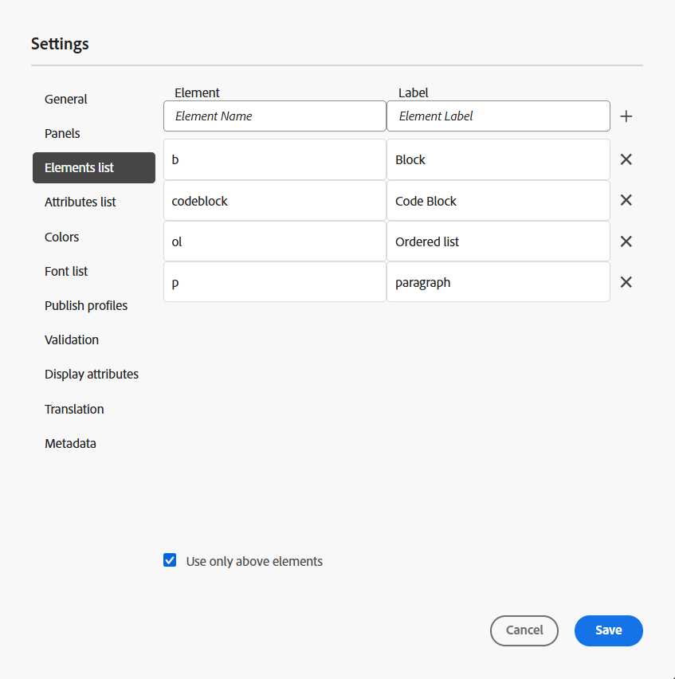
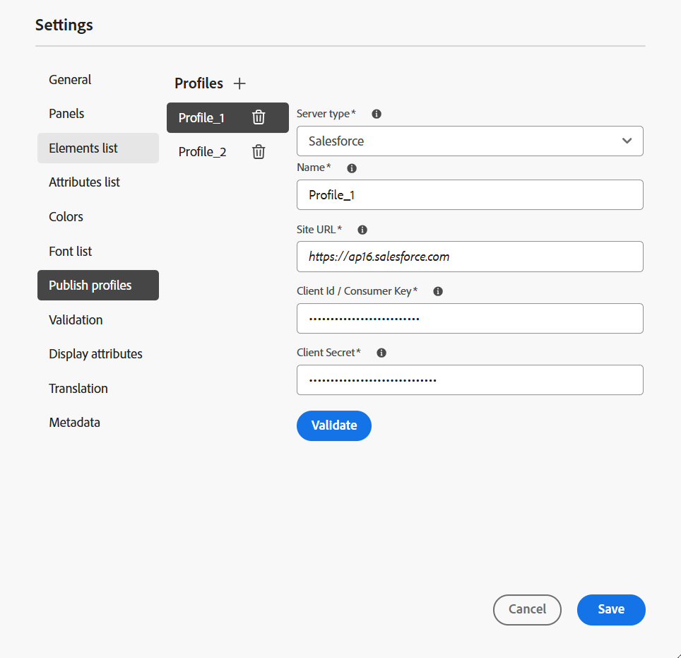
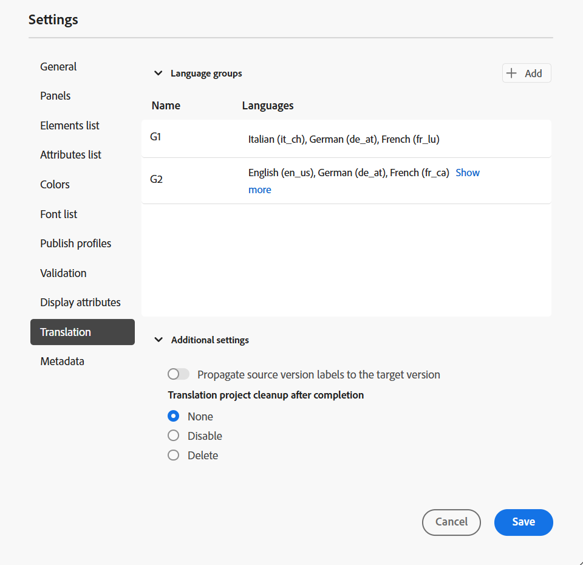
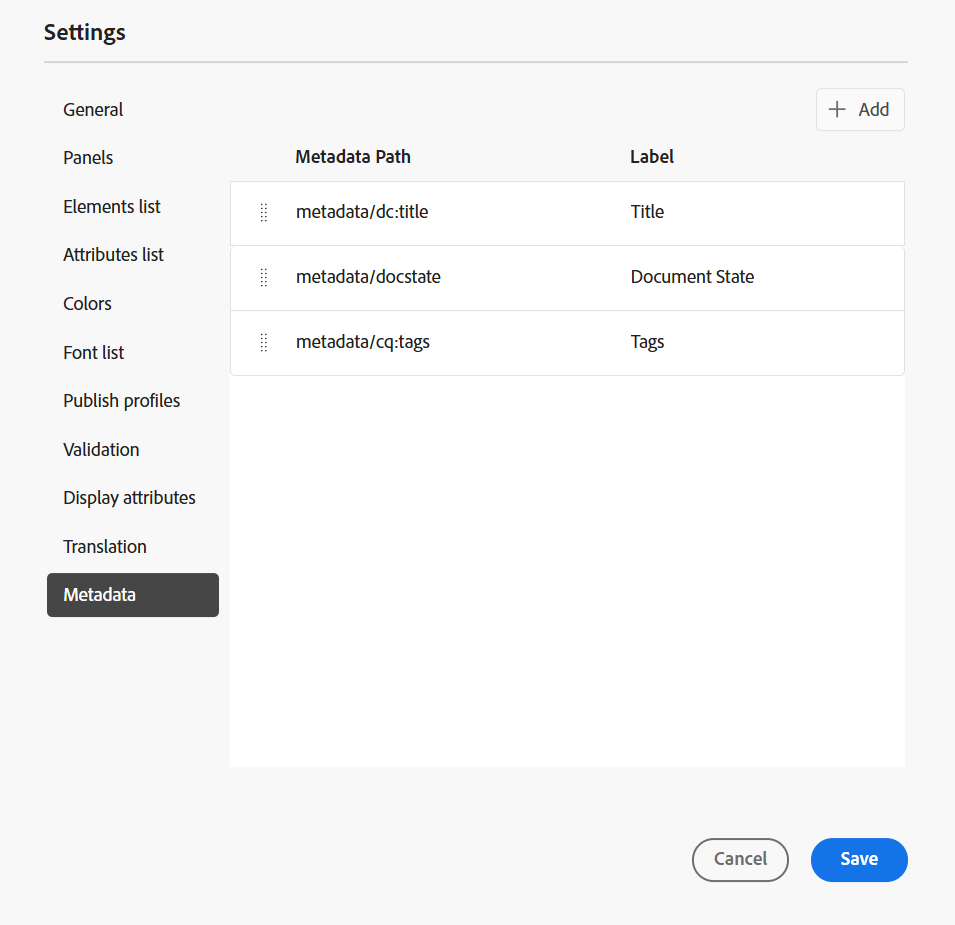
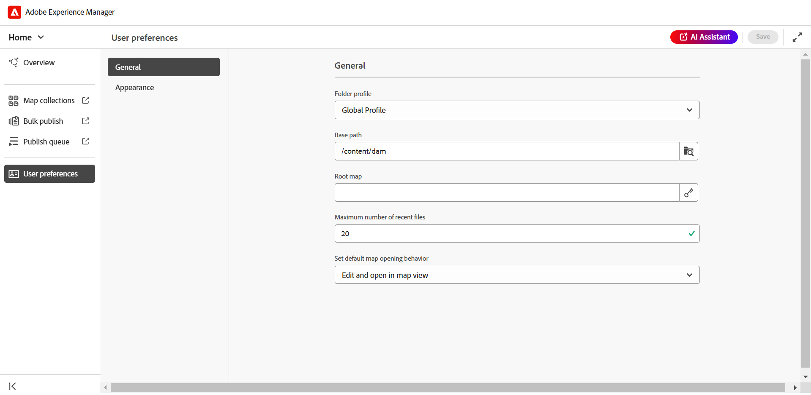
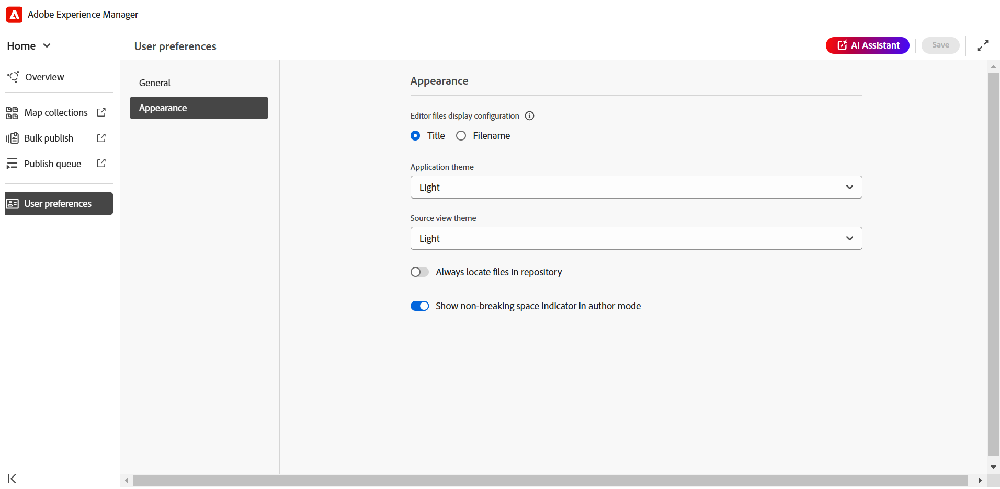
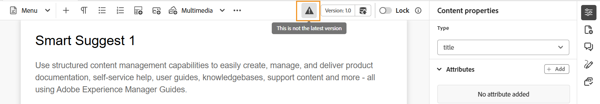
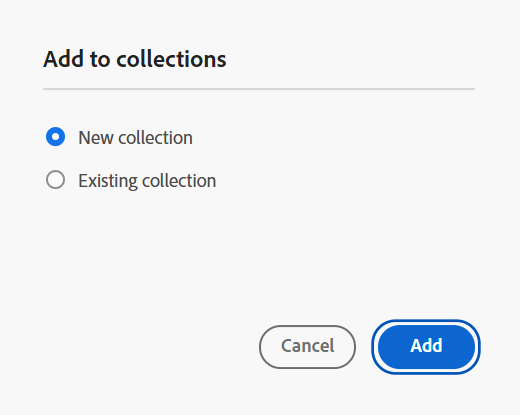
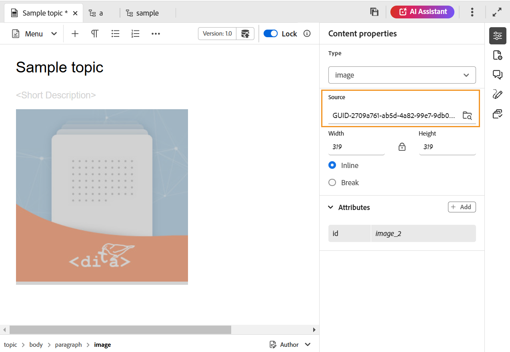
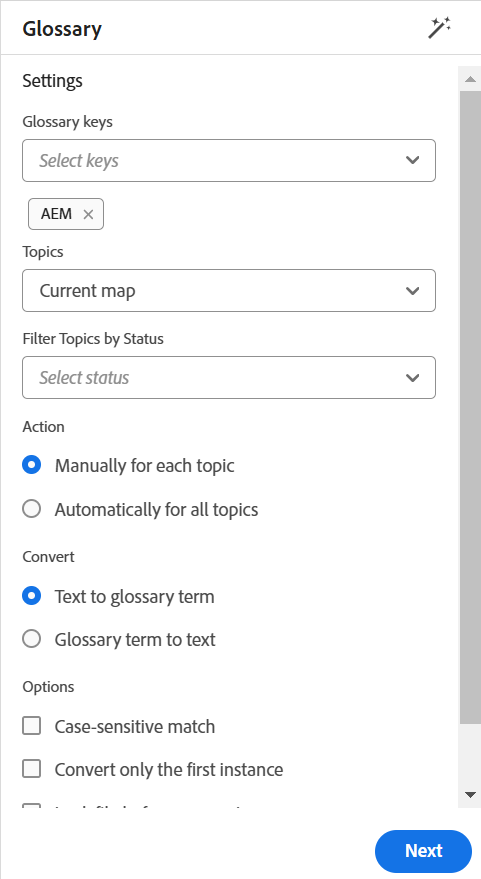

# Présentation des fonctionnalités de l’éditeur web {#id176NC500V5Z}

Cette section vous guide tout au long des différentes fonctionnalités disponibles dans l’éditeur web. Nous pouvons diviser l’éditeur Web en sections ou en zones suivantes :

- [Barre d’outils principale](#id2051EA0G05Z)
- [Barre d’outils Secondaire](#id2051EA0J0Y4)
- [Panneau gauche](#id2051EA0M0HS)
- [Zone de modification du contenu](#id2051EB000UI)
- [Panneau droit](#id2051EB003YK)

La sous-section suivante décrit en détail les différentes sections de l’éditeur Web.

## Barre d’outils principale {#id2051EA0G05Z}

La barre d’outils principale se trouve dans la partie supérieure de l’interface de l’éditeur Web. Elle fournit des fonctions au niveau du fichier et divers modes de création disponibles dans l’éditeur Web. Les fonctionnalités disponibles dans la barre d’outils supérieure sont expliquées comme suit :

**Enregistrer tout** - 

Enregistre les modifications que vous avez apportées à toutes les rubriques ouvertes. Si plusieurs rubriques sont ouvertes dans l’éditeur Web, cliquez sur **Enregistrer tout** ou en utilisant le raccourci **Crtl**+**S** pour enregistrer tous les documents en un seul clic. Vous n’avez pas à enregistrer individuellement chaque document.

>[!NOTE]
>
> L’opération Enregistrer ne crée pas de nouvelle version de vos rubriques. Pour créer une version, choisissez Enregistrer comme nouvelle version.

**Enregistrer comme nouvelle version** - 

Enregistre les modifications que vous avez apportées à votre rubrique et crée également une nouvelle version de votre rubrique. Si vous travaillez sur une nouvelle rubrique, les informations de version s’affichent sous la forme **none**.

{width="800" align="left"}

Le numéro de version change à chaque nouvelle version créée pour le fichier de rubrique ou de mappage.

Lorsque vous choisissez d’enregistrer une rubrique ou un mappage à l’aide de **Enregistrer comme nouvelle version**, la boîte de dialogue suivante s’affiche :

{width="300" align="left"}

Saisissez les commentaires et les libellés de version pour identifier les modifications, puis cliquez sur **Enregistrer** pour créer une nouvelle version de votre fichier.

Lorsque vous choisissez l’option *Enregistrer comme nouvelle version*, la première version de la rubrique est créée dans la gestion des ressources numériques, qui devient également la version actuellement active de votre rubrique. Par la suite, si vous revenez à une ancienne version de la rubrique, cela devient votre version active actuelle de la rubrique.

Si votre administrateur dispose d’étiquettes de version préconfigurées, ces étiquettes s’affichent dans une liste déroulante. Vous pouvez choisir un libellé dans la liste des libellés disponibles et enregistrer votre document.

{width="300" align="left"}

Au moment de l’enregistrement d’une rubrique, vous pouvez ajouter un commentaire spécifiant les modifications que vous avez apportées à la rubrique. Ce commentaire s’affiche dans l’historique des versions de la rubrique.

Si votre rubrique est en cours de révision, vos réviseurs reçoivent une notification indiquant qu’une version plus récente de la rubrique est disponible. Ils peuvent facilement accéder à la dernière révision de votre document et continuer à consulter la dernière version de votre rubrique.

Lorsque vous placez le pointeur sur le titre d’une rubrique, le chemin d’accès au fichier et le numéro de version s’affichent.

{width="800" align="left"}

>[!NOTE]
>
> Une fois qu’une version de votre rubrique est disponible, vous pouvez également ajouter des étiquettes à votre rubrique. Ces libellés peuvent ensuite être utilisés pour créer une ligne de base pour la publication d’une version spécifique de votre document. Pour plus d’informations sur l’utilisation des libellés dans vos rubriques, voir [Utilisation des libellés](web-editor-use-label.md#).

**Annuler et rétablir** -  / 

Annuler ou Rétablir la dernière action.

**Supprimer l’élément** - 

Supprime l’élément actuellement sélectionné ou l’élément sur lequel le curseur est placé.

**Rechercher et remplacer** - 

La fonction Chercher et Remplacer est disponible en mode Auteur et Source. La barre de texte Rechercher et remplacer s’affiche au bas de la zone de modification de la rubrique. Vous pouvez utiliser les touches de raccourci **CTRL**+**F** pour appeler la barre Rechercher et remplacer.

{width="800" align="left"}

À l’aide de l’icône de paramètres \(\), vous pouvez activer/désactiver les options de recherche **Ignorer la casse** et **Mot entier uniquement**. Pour effectuer une recherche non sensible à la casse, activez l’option **Ignorer la casse** . Sinon, si vous souhaitez effectuer une recherche sensible à la casse, désactivez l’option **Ignorer la casse** . Vous pouvez également choisir de rechercher un mot entier.

La recherche est instantanée, ce qui signifie que lorsque vous saisissez l’expression ou le mot recherché dans le champ **Rechercher**, le terme est immédiatement recherché et sélectionné dans la rubrique. De même, pour remplacer un texte dans votre rubrique, saisissez le terme de recherche et son remplacement dans les champs respectifs, puis cliquez sur le bouton **Remplacer** ou **Remplacer tout** .

Dans la vue Source, la fonction Rechercher et remplacer est extrêmement utile pour rechercher un élément ou un attribut spécifique. Par exemple, si vous souhaitez remplacer la valeur de l’attribut `@product`, vous pouvez facilement le faire à partir de la vue Source. La vue Auteur ne permet pas de rechercher sur la base d’un attribut ou d’un élément. Cependant, vous devez être prudent lors de l’utilisation de la fonction **Remplacer tout**, car elle peut remplacer le code XML.

**Paramètres de l’éditeur** - 

Les paramètres de l’éditeur ne sont disponibles que pour les utilisateurs administrateurs. Grâce aux préférences, un administrateur peut configurer les paramètres suivants :

>[!NOTE]
>
> Si vous mettez à jour des paramètres par défaut, vous devez rouvrir les documents pour que les modifications prennent effet.

- **Général** : les paramètres généraux vous permettent de configurer le dictionnaire à utiliser avec l’éditeur web. Cet onglet contient trois sections : **Vérification orthographique**, **Condition** et **Création**.

  {width="650" align="left"}

   - **Vérification orthographique** : il existe deux options : **Vérification orthographique de l’AEM** et **Vérification orthographique du navigateur**. Par défaut, l’éditeur utilise la fonction Vérifier l’orthographe du navigateur, dans laquelle la vérification orthographique est effectuée à l’aide du dictionnaire intégré du navigateur. Vous pouvez passer à AEM Vérifier l’orthographe pour utiliser AEM dictionnaire, qui peut également être personnalisé pour ajouter votre liste de mots personnalisée. Pour plus d’informations sur la personnalisation du dictionnaire d’AEM, voir la section *Personnaliser AEM dictionnaire par défaut* de l’as a Cloud Service Installer et configurer Adobe Experience Manager Guides.


   - **Condition**

      - **Mettre le texte conditionnel en surbrillance dans la vue Auteur** : sélectionnez cette option pour mettre en surbrillance le texte conditionnel dans la vue Auteur. Le contenu conditionnel est mis en surbrillance à l’aide de la couleur définie pour la condition.

      - **Valider avec les attributs de condition** : sélectionnez cette option pour permettre la validation des valeurs définies pour les attributs. Cela vous empêche d’ajouter une valeur incorrecte.

      - **Afficher la clé avec le titre dans le panneau Schéma de l’objet** : sélectionnez cette option pour afficher les clés avec les titres dans le schéma d’objet. Si vous ne sélectionnez pas cette option, seuls les titres s’affichent. Par exemple, ici, les clés &quot;os&quot;, &quot;audience&quot; et &quot;other&quot; s’affichent également avec les titres.

        {width="550" align="left"}

      - **Afficher le schéma de l’objet dans le panneau Conditions** : sélectionnez cette option pour afficher un schéma d’objet dans le panneau Conditions. Si vous désélectionnez cette option, les conditions définies s’affichent dans le panneau Conditions.

   - **Création**

      - **Activer Remplacer tout** : sélectionnez cette option pour afficher l’icône Tout remplacer dans le panneau Rechercher et remplacer.


   - **Citations**
Modifiez le style des citations. Choisissez le style de citation dans la liste déroulante que vous souhaitez utiliser dans votre projet. Pour plus d’informations, voir [Modifier les styles de citation](./web-editor-apply-citations.md#change-citation-style).


**Panneaux** : ce paramètre contrôle les panneaux affichés dans le panneau de gauche de l’éditeur. Vous pouvez activer ou désactiver le commutateur pour afficher ou masquer le panneau souhaité.

{width="650" align="left"}

>[!NOTE]
>
> Si un panneau personnalisé a été configuré, il apparaît également dans la liste des panneaux. Vous pouvez activer ou désactiver le commutateur pour afficher ou masquer le panneau personnalisé. Pour plus d’informations sur la configuration, voir la section *Configuration d’un panneau personnalisé dans le panneau de gauche* dans l’as a Cloud Service Installation et configuration d’Adobe Experience Manager Guides.

- **Liste d’éléments** : en tant qu’administrateur, vous pouvez contrôler la liste des éléments qu’un auteur peut insérer à l’aide de la fenêtre contextuelle [Insérer un élément](#id204SG30105Z) et définir également le nom d’affichage de l’élément. Le paramètre Liste d’éléments vous permet de spécifier le nom de l’élément conformément aux spécifications DITA et un libellé que vous souhaitez utiliser au lieu du nom d’élément défini par DITA :

  {width="650" align="left"}

Dans la capture d’écran ci-dessus, l’élément `b` a reçu un libellé Gras, `codeblock` reçoit un libellé Bloc de code avec d’autres éléments. Si vous sélectionnez l’option **Utiliser uniquement au-dessus des éléments** , seuls les éléments valides \(au point d’insertion actuel\) de cette liste s’affichent dans la fenêtre contextuelle Insérer un élément .

Dans la capture d’écran suivante, seuls 3 éléments configurés sur 4 de la capture d’écran précédente s’affichent dans le contexte actuel :

{width="300" align="left"}

- **Liste des attributs** : à l’instar de la liste des éléments, vous pouvez contrôler la liste des attributs et leurs noms d’affichage à afficher dans la liste des attributs d’un élément. Dans la capture d’écran suivante, seuls 3 attributs ont été configurés pour s’afficher dans la liste d’attributs d’un élément :

  {width="650" align="left"}

  Avec ce paramètre, lorsque vous essayez d’ajouter un attribut à un élément, vous ne voyez que la liste des attributs configurés dans la liste.

  {width="300" align="left"}

- **Profil Publish** : contient les profils Publish qui peuvent être utilisés pour publier la sortie de la **base de connaissances**. Vous pouvez créer un nouveau profil pour une base de connaissances cible. Par exemple, Salesforce ou ServiceNow.

   - **Création d’un profil Publish Salesforce**

     **Conditions préalables**

      - Créez une application connectée pour Salesforce. Pour plus d’informations, reportez-vous à la section [Activation des paramètres OAuth pour l’intégration d’API](https://help.salesforce.com/s/articleView?id=sf.connected_app_create_api_integration.htm&amp;type=5).

      - Lors de la configuration de l’application connectée, vérifiez les éléments suivants :

         - Spécifiez le rappel.

           `URL: http://<server name>:<port>/bin/dxml/thirdparty/callback/salesforce`

         - Sélectionnez les périmètres OAuth suivants :
            - Accès complet (complet)
            - Sélectionnez Gérer les données utilisateur via les API (api).

  Une fois l’application configurée, Salesforce fournit une **clé de consommateur** et un **secret de consommateur**.

  Ils peuvent être utilisés pour créer le profil Publish Salesforce.


   - Pour créer un profil Publish Salesforce, sélectionnez la base de connaissances **Salesforce** dans la liste déroulante **Type de serveur**. Saisissez un nom de profil. Dans l’ **URL du site**, entrez le site du client que vous utiliseriez pour publier la sortie, puis ajoutez les **Clé du client** et le **Secret du client** fournis par le site du client Salesforce. Ensuite, **Validez** et **Enregistrez** le profil nouvellement créé.
     {width="550" align="left"}

     >[!NOTE]
     >
     >Pour configurer un proxy pour Salesforce dans Experience Manager Guides, utilisez la configuration du proxy des composants HTTP Apache dans AEM. Découvrez comment [configurer le proxy pour le vérificateur de lien d’AEM](https://helpx.adobe.com/experience-manager/kb/How-to-configure-proxy-for-the-AEM-Link-Checker-AEM.html).


   - **Création d’un profil Publish ServiceNow**

     **Conditions préalables**

     Configurez le serveur ServiceNow pour charger les ressources.
      - Connectez-vous au serveur **ServiceNow**.
      - Accédez à **Propriétés système** > **Sécurité**.
      - Décochez l’option suivante :

        **Cette propriété doit être définie pour activer la vérification de type MIME pour les téléchargements (toutes les versions Eureka et supérieures). Active (true) ou désactive la validation de type MIME (false) pour les pièces jointes. Les extensions de fichier configurées via glide.attachment.extensions seront vérifiées pour le type MIME lors du téléchargement.**

      - Cliquez sur **Enregistrer**.

     Une fois que vous avez configuré l’application, créez le profil Publish **ServiceNow**.
   - Pour créer un profil Publish, sélectionnez la base de connaissances ServiceNow dans la liste déroulante **Server Type**. Saisissez un profil **Name**. Dans l’URL **ServiceNow**, saisissez le site du consommateur que vous utiliseriez pour publier la sortie, puis ajoutez les **Nom d’utilisateur** et **Mot de passe** fournis par le site du consommateur ServiceNow. Ensuite, **Validez** et **Enregistrez** le profil nouvellement créé.

     {width="550" align="left"}

  Après avoir validé, vous pouvez sélectionner le profil Publish dans les paramètres prédéfinis de sortie d’une carte DITA et l’utiliser pour générer la sortie sur le serveur **Salesforce** ou **ServiceNow** que vous avez choisi.

  En savoir plus sur le paramètre prédéfini de sortie [Base de connaissances](../user-guide/generate-output-knowledge-base.md).


- **Validation** : cet onglet contient des options pour configurer les validations de schémas dans l’éditeur web. Vous pouvez activer les fonctionnalités suivantes :

   - **Exécutez la vérification de validation avant d’enregistrer le fichier** : sélectionnez cette option pour exécuter les validations de schéma à l’aide du ou des fichiers de schéma sélectionnés avant toute opération d’enregistrement. Vous pouvez ajouter un fichier de schéma en cliquant sur l’icône + . Le ou les fichiers de schéma sélectionnés sont répertoriés.

     >[!NOTE]
     >Le ou les fichiers de schéma sélectionnés seront conservés pour le profil de dossier sélectionné.

     {width="550" align="left"}
Cela empêche les utilisateurs d’enregistrer un fichier qui rompt une règle définie dans le ou les fichiers de schéma sélectionnés. Si cette option n’est pas sélectionnée, le fichier ne sera pas validé avant d’enregistrer les modifications.

   - **Autoriser tous les utilisateurs à ajouter des fichiers de schéma dans le panneau de validation** : sélectionnez cette option pour permettre aux utilisateurs d’ajouter n’importe quel fichier de schéma dans le panneau Validation de l’éditeur web. Cela permet aux utilisateurs d’ajouter des fichiers de schéma, puis de valider les rubriques par rapport au fichier de schéma. Si cette option n’est pas sélectionnée, le bouton **Ajouter un fichier de schéma** n’est pas disponible pour les utilisateurs dans le **panneau de validation** de l’éditeur web.


- **Afficher les attributs** : tout comme la liste des attributs, vous pouvez contrôler la liste des attributs à afficher dans la liste des attributs d’un élément. Par défaut, quatre **attributs d’affichage** — audience, plateforme, produit et props ont été configurés pour s’afficher dans la liste d’attributs d’un élément. Vous pouvez également ajouter un attribut d’affichage à l’aide de l’icône **Ajouter** située en haut. Vous pouvez également supprimer n’importe quel attribut d’affichage à l’aide de l’icône **Supprimer** .

  Les attributs définis pour un élément sont affichés dans les vues Disposition et Contour.

  {width="550" align="left"}

- **Traduction** : cet onglet contient les options permettant de créer des groupes de langues, de propager les étiquettes source à la version cible et de nettoyer le projet de traduction.
  {width="550" align="left"}

   - **Groupes de langues** : en tant qu’administrateur, vous pouvez créer un groupe de langues et les utiliser comme ensemble pour traduire le contenu.\
     Pour créer un groupe de langues, procédez comme suit :
      1. Sélectionnez l&#39;icône Ajouter  .
      1. Saisissez le nom du groupe de langues. Chaque langue doit avoir un nom unique. Vous pouvez afficher une erreur si le champ nom est vide ou si le nom n’est pas unique.
      1. Sélectionnez les langues dans la liste déroulante. Vous pouvez sélectionner plusieurs langues.

     Saisissez les premiers caractères de la langue ou le code de langue pour filtrer les langues de votre choix. Par exemple, saisissez &quot;en&quot; pour filtrer toutes les langues qui contiennent &quot;en&quot; au début de leur nom ou code.
      1. Sélectionnez **Terminé** pour ajouter les langues sélectionnées au groupe. Les langues s’affichent. Lorsque vous ajoutez trois langues ou plus, **Afficher plus** s’affiche. Vous pouvez sélectionner **Afficher plus** pour afficher toutes les langues présentes dans le groupe.

         >[!TIP]
         >
         > Basculez de **Afficher plus** vers **Afficher moins** et n’affichez que quelques langues.

      1. Passez la souris sur les langues d’un groupe pour modifier  ou supprimer  les groupes de langues.
      1. Enregistrez les **paramètres de l’éditeur**.

         >[!NOTE]
         >
         >En tant qu’utilisateur, vous pouvez afficher les groupes de langues configurés pour votre profil de dossier.

   - **Propager les libellés de version source à la version cible** : sélectionnez cette option pour transmettre le libellé de la version du fichier source au fichier traduit. Par défaut, cette option est désactivée.
   - **Nettoyage du projet de traduction après la fin** : sélectionnez cette option pour configurer les projets de traduction à désactiver ou à supprimer automatiquement après la traduction. Par défaut, **None** est sélectionné, de sorte que le projet existe après traduction.

     Vous pouvez désactiver les projets de traduction si vous souhaitez les utiliser ultérieurement. La suppression d’un projet supprime définitivement tous les fichiers et dossiers présents dans le projet.


- **Métadonnées** : vous pouvez contrôler les métadonnées de version de la rubrique et leurs valeurs à afficher dans la boîte de dialogue **Historique de version**.  Dans le chemin d’accès aux métadonnées, spécifiez l’emplacement des noeuds à partir desquels vous souhaitez sélectionner les métadonnées. Vous pouvez également définir un nom personnalisé pour les métadonnées en tant que libellé. Les propriétés par défaut sont Titre, État du document et Balises.

  Les métadonnées peuvent être sélectionnées à partir de n’importe quelle propriété sous le noeud `/jcr:content` de la ressource. Vous pouvez donc ajouter le chemin d’accès de la propriété comme chemin d’accès aux métadonnées.


  Une erreur s’affiche si le chemin des métadonnées est vide. Si vous laissez le libellé vide, le dernier élément est sélectionné comme libellé.


  {width="550" align="left"}

  *Configurez les métadonnées de la boîte de dialogue **Version History**.*


  Vous pouvez également définir l’ordre d’affichage de ces balises de métadonnées. Pour modifier l’ordre par défaut de ces balises, sélectionnez les barres en pointillés à l’emplacement de votre choix.
Les libellés de métadonnées apparaissent dans la même séquence dans l’ **historique de version** de l’éditeur web.


**Préférences utilisateur** - 

Les préférences utilisateur sont disponibles pour tous les auteurs. À l’aide des préférences, un auteur peut configurer les paramètres suivants :


- **Général** : l’onglet Général vous permet de configurer les paramètres suivants :

  {width="550" align="left"}

   - **Profils de dossier** : le profil de dossier contrôle différentes configurations liées aux attributs conditionnels, aux modèles de création, aux paramètres prédéfinis de sortie et aux configurations de l’éditeur web. Le profil global s’affiche par défaut. En outre, si votre administrateur a configuré les profils de dossiers dans le système, ces derniers sont également affichés dans la liste Profils de dossiers .

     Les configurations de l’éditeur web qu’un administrateur peut définir dans le profil de dossier incluent : la personnalisation de l’interface utilisateur, notamment les icônes de la barre d’outils, la mise en page de l’éditeur web, les fragments de code et la carte racine. Pour plus d’informations, voir *Configuration des profils globaux ou au niveau du dossier* dans l’as a Cloud Service Installer et configurer Adobe Experience Manager Guides.

     >[!NOTE]
     >
     > Le nom du profil de dossier actif s’affiche sous forme de libellé pour l’icône Préférences utilisateur de la barre d’outils principale.

   - **Chemin d’accès de base** : par défaut, lorsque vous accédez au référentiel d’AEM à partir de l’éditeur web, les ressources s’affichent à partir de l’emplacement /content/dam. Votre dossier de travail se composerait probablement de quelques dossiers dans le dossier /content/dam/ . Il vous faudrait quelques clics pour atteindre le dossier de travail à chaque fois. Vous pouvez définir le chemin d’accès de base sur votre dossier de travail et la vue Référentiel affiche ensuite le contenu de cet emplacement en amont. Cela réduit le temps d’accès à votre dossier de travail. En outre, lorsque vous insérez un fichier de référence ou multimédia dans votre rubrique, l’emplacement de navigation du fichier commence par le jeu de dossiers dans le chemin d’accès de base.

   - **Sélectionner la carte racine** : sélectionnez un fichier de mappage DITA pour résoudre les références ou entrées de glossaire clés. La carte racine sélectionnée a la priorité la plus élevée pour résoudre les références clés. Pour plus d’informations, voir [Résoudre les références de clé](map-editor-other-features.md#id176GD01H05Z).

     >[!NOTE]
     >    
     > Si vous ne souhaitez pas utiliser de mappage racine, assurez-vous que le champ **Sélectionner la carte racine** est vide.

- **Apparence** : sélectionnez les thèmes de l’application de l’éditeur web et la vue source de la zone d’édition du contenu.

  {width="550" align="left"}

   - **Afficher les fichiers par** : sélectionnez la méthode par défaut pour afficher les fichiers dans l’éditeur web. Vous pouvez afficher la liste des fichiers selon les titres ou les noms des fichiers à partir des différents panneaux dans la vue **Auteur**.

     >[!NOTE]
     >
     > Par défaut, les fichiers sont affichés par titre dans l’éditeur web.

   - **Thème de l’application** : vous pouvez choisir parmi les thèmes **Clair** ou **Foncé** pour l’application. Dans le cas du thème **Lumière**, les barres d’outils et les panneaux utilisent un arrière-plan en gris clair. Dans le cas du thème **Sombre**, les barres d’outils et les panneaux utilisent un arrière-plan en couleur noire. Sélectionnez **Utiliser le thème de l’appareil** pour permettre à Experience Manager Guides de sélectionner les thèmes clairs et sombres en fonction du thème de votre appareil.  Dans tous les thèmes, la zone de modification du contenu est affichée en arrière-plan de couleur blanche dans la vue **Auteur**.

   - **Thème de vue Source** : - Vous pouvez choisir parmi les thèmes **Clair** ou **Foncé** pour la zone d’édition de contenu en mode source. Dans le cas du thème **Clair**, la zone d&#39;édition du contenu utilise un arrière-plan en gris clair pour la vue source, tandis que dans le cas du thème **Foncé**, elle utilise un arrière-plan en couleur noire. Sélectionnez **Utiliser le thème de l’appareil** pour permettre à Experience Manager Guides de sélectionner les thèmes clairs et sombres en fonction du thème de votre appareil.

   - **Localisez toujours les fichiers dans le référentiel** : sélectionnez cette option pour afficher l’emplacement d’un fichier dans le référentiel lors de sa modification dans l’éditeur web.

   - **Afficher l’indicateur d’espace insécable en mode création** : sélectionnez cette option pour afficher un indicateur pour les espaces insécables lors de sa modification dans l’éditeur web. Elle est activée par défaut.

**Modes Auteur, Source et Aperçu**

Pour plus d’informations sur les différents modes de création et d’affichage des documents, voir [Affichage de l’éditeur web](web-editor-views.md#).

## Barre d’outils Secondaire {#id2051EA0J0Y4}

La barre d’outils secondaire s’affiche lorsque vous ouvrez une rubrique en vue de la modifier dans l’éditeur web. Les fonctionnalités disponibles dans la barre d’outils secondaire sont expliquées comme suit :

**Insérer un élément** - 

Insère un élément valide à l’emplacement valide actuel ou à l’emplacement valide suivant. Vous pouvez également utiliser le raccourci clavier ***Alt***+***Entrée*** pour ouvrir la fenêtre contextuelle Insérer un élément . Par exemple, vous modifiez un paragraphe, puis, dans la fenêtre contextuelle **Insérer l’élément**, une liste d’éléments s’affiche et peut être insérée dans le paragraphe. Sélectionnez l’élément à insérer. Vous pouvez utiliser le clavier pour faire défiler la liste des éléments et appuyer sur ***Entrée*** pour insérer l’élément requis.

Vous pouvez afficher deux types d’éléments valides :

- **Éléments valides à l’emplacement actuel** : la liste affiche les éléments que vous pouvez insérer à l’emplacement actuel du curseur.

- **Éléments valides en dehors de l’emplacement actuel** : la liste affiche les éléments que vous pouvez insérer après l’un des parents de l’élément actuel dans la hiérarchie des éléments.


Par exemple, si vous vous trouvez dans l’élément `<b>` intégré, vous pouvez insérer des éléments tels que `<u>`, `<xref>`, `<i>` à l’emplacement actuel. En revanche, vous pouvez insérer des éléments tels que `<table>` et `<topic>` en dehors de l’emplacement actuel.

Vous pouvez également saisir un caractère ou une chaîne dans la zone de recherche et rechercher les éléments qui commencent par celui-ci.


{width="300" align="left"}

*Saisissez &#39;t&#39; pour rechercher tous les éléments valides commençant par &#39;t&#39;.*

Si vous travaillez dans un élément de bloc comme `note`, utilisez l’icône Insérer l’élément pour insérer un nouvel élément après l’élément `note`. Dans la capture d’écran suivante, un élément de note a été inséré dans l’élément p \(paragraph\) :

{width="800" align="left"}

Si vous appuyez sur Entrée dans l’élément de note, un nouveau paragraphe est créé dans l’élément de note lui-même. Pour insérer un nouvel élément en dehors d’une note, cliquez sur l’élément p \(surligné dans la capture d’écran\) dans le chemin de navigation des éléments et cliquez sur l’icône Insérer un élément ou appuyez sur ***Alt***+***Entrée*** pour ouvrir la fenêtre contextuelle Insérer un élément . Sélectionnez ensuite l’élément souhaité et appuyez sur Entrée pour insérer l’élément sélectionné après l’élément de note.

Vous pouvez également ajouter un élément entre deux éléments lorsqu’un curseur de bloc clignotant s’affiche.

{width="300" align="left"}

Par exemple, si vous travaillez sur une rubrique DITA et que le curseur de bloc clignote entre la brève description et le corps, vous pouvez ajouter l’élément `prolog` , puis ajouter les droits d’auteur, l’auteur et d’autres détails.

Une autre manière de saisir un nouvel élément consiste à utiliser le menu contextuel. Cliquez avec le bouton droit de la souris à n’importe quel emplacement de votre document pour appeler le menu contextuel. Dans ce menu, choisissez **Insérer l’élément** pour afficher la boîte de dialogue **Insérer l’élément** et sélectionnez l’élément à insérer.

{width="300" align="left"}

**Insérer un paragraphe** - 

Insérez l’élément de paragraphe à l’emplacement valide actuel ou suivant.

**Insérer/Supprimer une liste numérotée** - 

Crée une liste numérotée à l’emplacement valide actuel ou suivant. Si vous vous trouvez dans une liste numérotée et cliquez sur cette icône, l’élément est converti en paragraphe normal.

**Insérer/Supprimer la liste à puces** - 

Crée une liste à puces à l’emplacement valide actuel ou suivant. Si vous vous trouvez dans une liste à puces et cliquez sur cette icône, l’élément est converti en paragraphe normal.

>[!NOTE]
>
>Vous pouvez également sélectionner l’option **Diviser la liste** dans le menu contextuel d’un élément de liste pour fractionner la liste actuelle et commencer une nouvelle liste au même niveau.

**Insérer un tableau** - 

Insère un tableau à l’emplacement valide actuel ou suivant. Cliquez sur l’icône Insérer un tableau pour ouvrir la boîte de dialogue Insérer un tableau :

{width="550" align="left"}

Vous pouvez spécifier le nombre de lignes et de colonnes nécessaires dans le tableau. Si vous souhaitez conserver la première ligne comme en-tête de tableau, sélectionnez l’option Définir la première ligne comme en-tête. Pour ajouter un titre à votre tableau, saisissez-le dans le champ Titre .

Une fois qu’un tableau est inséré, vous pouvez le modifier à l’aide du menu contextuel.

{width="550" align="left"}

Grâce au menu contextuel du tableau, vous pouvez :

- Insérer des cellules, des lignes ou des colonnes

- Fusionner les cellules dans les directions droite et descendante

- Fractionner les cellules horizontalement ou verticalement

- Suppression de cellules, de lignes ou de colonnes

- Création d’un fragment de code à partir du tableau

- Générer des identifiants


Vous pouvez également définir des attributs sur plusieurs cellules, rangée entière ou colonne d’un tableau. Par exemple, pour aligner une cellule de tableau, faites glisser et sélectionnez la cellule requise. Dans le panneau Propriétés du contenu (à droite), la propriété **Type** se transforme en **Entrée multiple**.

1. Dans la section **Attributs**, cliquez sur **+Ajouter**.
1. Sélectionnez l’attribut `@valign` dans la liste déroulante **Attribute** .
1. Dans la liste déroulante des valeurs, sélectionnez l’alignement de texte que vous souhaitez appliquer aux cellules de tableau sélectionnées.
1. Cliquez sur **Ajouter.**

{width="800" align="left"}

**Insérer une image** - 

Insère une image à l’emplacement valide actuel ou suivant. Cliquez sur l’icône Insérer une image pour ouvrir la boîte de dialogue Insérer une image , puis recherchez et sélectionnez l’image à insérer.

>[!NOTE]
>
> Vous pouvez également ajouter une image en la faisant glisser de votre système local vers votre article. Dans ce cas, le fichier image est ajouté à l’aide du workflow **Télécharger Assets** .  Pour plus d’informations, voir le workflow **Télécharger Assets** dans la section [Panneau de gauche](web-editor-features.md#id2051EA0M0HS) .


{width="650" align="left"}

Vous pouvez ajouter le titre de l’image/de la figure et le texte de remplacement de l’image dans la boîte de dialogue Insérer une image .

Vous pouvez rechercher le fichier image requis en saisissant le nom du fichier dans la barre Type à rechercher située en haut et en filtrant également les résultats de la recherche par Chemin d’accès \(à rechercher dans\), Collections, Type de fichier et Balises. Une fois que vous avez trouvé le fichier image requis, sélectionnez-le et cliquez sur Sélectionner pour insérer l’image dans votre document. Vous pouvez insérer différents formats de fichiers image, tels que `.png`, `.svg`, `.gif`, `.jpg`, `.eps`, `.ai`, `.psd`, etc.

Une fois que vous avez inséré une image, vous pouvez modifier la hauteur, la largeur, le placement et les attributs dans le panneau Propriétés du contenu . Cliquez sur un fichier image, puis apportez des modifications dans le panneau Propriétés du contenu du rail droit.

{width="800" align="left"}

Le champ Source affiche l’UUID du fichier image inséré. Vous pouvez trouver le chemin d’accès complet au fichier image inséré en pointant le pointeur de la souris sur le champ Source. Le chemin d’accès s’affiche dans l’info-bulle.

Vous pouvez redimensionner une image en fournissant des valeurs Hauteur ou Largeur pour le fichier image. Les proportions de l’image sont conservées automatiquement. Si vous le souhaitez, vous pouvez également choisir de ne pas conserver les proportions du fichier image en cliquant sur l’icône de verrouillage \(de Conserver les proportions\) et en fournissant les valeurs de hauteur et de largeur.

Vous pouvez également spécifier le paramètre Placement de l’image en tant que En ligne ou Saut. Si vous choisissez d’utiliser l’option d’emplacement Saut , vous pouvez ensuite choisir l’endroit où aligner l’image (gauche, centre ou droite).

Vous pouvez également ajouter d’autres propriétés pour un fichier image en sélectionnant les propriétés requises dans le champ **Attributes**.

>[!NOTE]
>
>Vous pouvez également définir des zones cliquables \(zone cliquable\) dans votre image. Pour plus d’informations, voir la description de la fonctionnalité **Insérer/Modifier une zone cliquable** dans la section [Panneau de gauche](web-editor-features.md#id2051EA0M0HS) .

**Menu contextuel pour les fichiers image ou multimédia**

Vous pouvez également effectuer certaines opérations courantes pour les images et les fichiers multimédias à l’aide du menu contextuel. Cliquez avec le bouton droit de la souris à n’importe quel emplacement de votre image pour appeler le menu contextuel.

Le menu contextuel permet de couper, copier ou coller l’image ou le média. Vous pouvez insérer un élément avant ou après l’élément sélectionné. Vous avez également la possibilité de renommer ou de renvoyer à la ligne un élément. Vous pouvez localiser l’image ou le média sélectionné dans le référentiel ou afficher l’aperçu du fichier dans l’interface utilisateur d’Assets.

Les autres options du menu contextuel vous permettent de copier un chemin d’accès, de modifier une zone cliquable, de créer un fragment de code ou de générer des identifiants pour l’élément sélectionné.

**Insérer multimédia** - 

Insère différents types de fichiers multimédias. Cliquez sur l’icône Insérer un fichier multimédia et sélectionnez le type de fichier à insérer. Les formats multimédias pris en charge sont les suivants :

- Fichier audio
- Fichier vidéo
- YouTube
- Vimeo

Lorsque vous sélectionnez l’option Fichier audio ou vidéo, la vue du référentiel s’affiche pour parcourir et sélectionner le fichier souhaité. Si vous choisissez YouTube ou Vimeo, vous obtenez la boîte de dialogue Insérer du contenu multimédia. Collez le lien du fichier vidéo dans le champ Lien web , puis cliquez sur Insérer pour ajouter la vidéo à l’emplacement valide actuel ou suivant dans votre document.

>[!NOTE]
>
> Lors de l’ajout d’un lien vidéo YouTube, vous devez remplacer la chaîne `watch?v=` par `embed` dans l’URL. Par exemple, pour ajouter un lien vidéo YouTube : `https://www.youtube.com/**watch?v**=WlIKQOrmZcs`, vous devez l’ajouter comme suit : `https://www.youtube.com/**embed/**WlIKQOrmZcs`. Cette modification permet de s’assurer que la vidéo est incorporée dans le site AEM et la sortie du PDF.

Vous pouvez également ajouter le fichier audio ou vidéo à partir de la boîte de dialogue Insérer un fichier multimédia. Sélectionnez l’option Fichier audio/vidéo et cliquez sur l’icône Parcourir pour lancer la vue du référentiel. Sélectionnez le fichier audio ou vidéo dans le référentiel, puis cliquez sur Sélectionner pour ajouter le lien du fichier dans le champ Fichier audio/vidéo. Si vous choisissez un fichier vidéo, un aperçu du fichier s’affiche également dans la zone Aperçu. Vous pouvez lire le fichier vidéo pour afficher son aperçu.

{width="650" align="left"}

**Insérer une référence croisée** - 

Insérez des références de type : Référence de contenu, Référence de clé de contenu, Référence de clé, Référence de fichier, Lien web ou Lien de courrier électronique.

Cliquez sur l’icône **Sélectionner un fichier** \(pour Référence de contenu et référence de fichier\) ou **Sélectionner une carte** \(pour Référence de clé de contenu et référence de clé\) et sélectionnez le fichier ou le contenu à lier.

{width="650" align="left"}

Un lien de la référence sélectionnée est ajouté dans le document. Le menu contextuel du lien vous donne les options suivantes :

- **Insérer un élément** : affiche une liste d’éléments valides que vous pouvez insérer dans le contexte donné.
- **Copier UUID** : copie l’UUID de la référence insérée.
- **Copier le chemin** : copie le chemin complet de la référence insérée.
- **Créer un fragment de code** : crée un fragment de code réutilisable à partir de la référence insérée.
- **Générer les identifiants** : génère un identifiant unique pour la référence insérée.

Vous pouvez également effectuer une recherche à l’aide de l’UUID du fichier que vous souhaitez référencer. Pour les liens Contenu et Référence de clé, saisissez l’UUID du fichier vers lequel vous souhaitez créer un lien et la recherche et l’affichage du fichier sont automatiques dans la section Aperçu . Lorsque vous spécifiez l’UUID du fichier, vous n’avez pas besoin de mentionner explicitement l’extension de fichier pour les fichiers .xml. L’extension .xml est automatiquement ajoutée à l’UUID.

{width="650" align="left"}

Si votre administrateur a activé l’option UUID dans *XMLEditorConfig*, l’UUID du contenu référencé s’affiche dans la propriété **Link**.

{width="800" align="left"}

>[!NOTE]
>
> Si l’option **Activer les UUIDs** n’est pas activée, le chemin relatif du contenu référencé s’affiche.

>[!IMPORTANT]
>
> Même si le chemin relatif du contenu référencé est affiché dans la propriété **Link**, le lien est créé en interne à l’aide de l’UUID du contenu référencé.

>[!TIP]
>
> Consultez la section Références du guide des bonnes pratiques pour connaître les bonnes pratiques en matière de référencement de contenu.

**Recherche de filtre**

Vous pouvez rechercher du texte dans les fichiers présents sur le chemin d’accès sélectionné du référentiel AEM. Par exemple, &quot;général&quot; est recherché dans la capture d’écran ci-dessous. Vous pouvez également affiner votre recherche à l’aide de filtres améliorés. Vous pouvez rechercher tous les fichiers DITA tels que les rubriques DITA et les mappages DITA présents sur le chemin sélectionné.

Vous pouvez rechercher des fichiers non DITA tels que les fichiers d’image, les fichiers multimédias et les documents dans le chemin d’accès sélectionné. Vous pouvez également rechercher des valeurs spécifiques dans les attributs des éléments DITA. Vous pouvez également rechercher les fichiers extraits par l’utilisateur spécifié.

{width="650" align="left"}

>[!NOTE]
>
> L’administrateur du système peut également configurer les filtres de texte et afficher ou masquer d’autres filtres. Pour plus d’informations, voir la section Configuration des filtres de texte dans l’as a Cloud Service Installation et configuration d’Adobe Experience Manager Guides.

La liste des fichiers filtrés contenant le texte recherché s’affiche. Par exemple, dans la capture d’écran ci-dessus, les fichiers contenant le texte &quot;général&quot; sont répertoriés. Vous pouvez également prévisualiser le contenu du fichier.

**Insérer du contenu réutilisable** - 

Réutiliser le contenu existant dans tout autre document de votre projet. Vous pouvez insérer du contenu en liant directement le contenu dans un fichier ou en utilisant une référence de clé, voir [Résoudre les références de clé](map-editor-other-features.md#id176GD01H05Z). Lorsque vous cliquez sur l’icône Insérer du contenu réutilisable , la boîte de dialogue Réutiliser le contenu s’affiche :

{width="650" align="left"}

Dans la boîte de dialogue Réutiliser le contenu , sélectionnez le fichier DITA pour les références de fichier ou le fichier de mappage DITA qui contient les références de clé. Une fois cette option sélectionnée, la rubrique ou les références clés s’affichent dans la boîte de dialogue. Vous pouvez sélectionner l’identifiant/la clé de la rubrique à insérer, puis cliquer sur Terminé pour insérer le contenu dans votre rubrique.

Pour insérer une référence de contenu, vous pouvez également saisir l’UUID du fichier et le contenu réutilisable de ce fichier est répertorié dans la section Aperçu .

Selon le paramètre d’insertion de liens, vous pouvez afficher l’UUID du contenu inséré ou le chemin relatif dans le panneau Propriétés ou la vue de code Source. Le lien est toujours créé à l&#39;aide de l&#39;UUID du contenu référencé. Voir Configuration de liens basés sur l’UUID dans l’as a Cloud Service Installer et configurer Adobe Experience Manager Guides.

>[!NOTE]
>
> Pour ajouter du contenu avant ou après le contenu référencé, utilisez les touches fléchées *Alt*+*Left* ou Alt+*Right* pour déplacer le curseur vers l’emplacement souhaité.

Vous pouvez également incorporer le contenu référencé dans la rubrique en cliquant avec le bouton droit sur le contenu référencé et en choisissant **Remplacer la référence par le contenu** dans le menu contextuel.

**Insérer des caractères spéciaux** - 

Insère des caractères spéciaux dans votre rubrique. Cliquez sur l’icône Insérer un caractère spécial pour ouvrir la boîte de dialogue Insérer un caractère spécial .

>[!NOTE]
>
> AEM Guides fournit des boîtes de dialogue mobiles et redimensionnables. Les boîtes de dialogue comportant deux traits croisés dans le coin inférieur droit peuvent être redimensionnées. Les lignes transversales de la boîte de dialogue Caractère spécial sont présentées ci-dessous.

{width="550" align="left"}

Dans la boîte de dialogue Insérer un caractère spécial, vous pouvez rechercher un caractère spécial à l’aide de son nom. Tous les caractères spéciaux sont stockés dans différentes catégories. Utilisez la liste déroulante Sélectionner une catégorie et sélectionnez une catégorie. Les caractères spéciaux disponibles dans la catégorie sélectionnée s’affichent. Vous pouvez parcourir la liste des caractères spéciaux à l’aide des touches fléchées ou cliquer sur le caractère que vous souhaitez insérer. Le Nom et le Code hexadécimal du caractère spécial sélectionné sont affichés sous la liste. Cliquez sur Insérer pour insérer le caractère sélectionné dans votre document.

**Insérer un mot-clé** - 

Insérez le mot-clé défini dans votre mappage DITA. Cliquez sur l’icône Insérer un mot-clé pour ouvrir la boîte de dialogue Référence de clé .

{width="550" align="left"}

Les mots-clés sont répertoriés par ordre alphabétique. Vous pouvez également rechercher un mot-clé\(s\) en saisissant une chaîne de recherche dans la zone Rechercher. Le résultat de la recherche renvoie les mots-clés contenant la chaîne dans ID ou Valeur. Les mots-clés définis dans votre mappage DITA sont répertoriés dans cette boîte de dialogue. Sélectionnez le mot-clé à insérer, puis cliquez sur **Insérer**.

Vous pouvez également modifier les attributs du mot-clé inséré en cliquant avec le bouton droit de la souris sur le mot-clé et en sélectionnant l’option Attributs . La boîte de dialogue Attributs for Keyword (Attributs pour le mot-clé) s’ouvre :

{width="550" align="left"}

Vous pouvez modifier les attributs du mot-clé ou ajouter un nouvel attribut au mot-clé.

**Insérer un fragment de code** - 

Insérez un fragment de code à l’emplacement valide actuel ou suivant. Pour que cette fonction fonctionne, des fragments de code doivent être définis dans votre système. Pour plus d’informations sur l’ajout d’un fragment de code, consultez la description de la fonction **Fragment de code** dans la section [Panneau de gauche](web-editor-features.md#id2051EA0M0HS) .

Lorsque vous cliquez sur l’icône Insérer un fragment de code , le catalogue Insérer un fragment de code s’affiche. Le catalogue est sensible au contexte, ce qui indique qu’il affichera les fragments de code uniquement s’ils sont autorisés à l’emplacement actuel.

L’exemple suivant illustre deux fragments de code préconfigurés : Warning et Error, qui peuvent être insérés à l’emplacement actuel dans le document.

{width="300" align="left"}

Lorsque vous choisissez un fragment de code dans la liste, il est inséré à l’emplacement actuel ou valide suivant dans le document. La capture d’écran suivante montre le fragment de code d’erreur inséré dans le document :

{width="400" align="left"}

**Insérer/Modifier la zone cliquable** - 

Insère une zone cliquable sur l’image sélectionnée. Une image avec des zones cliquables liées à des rubriques ou des pages web est appelée zone cliquable.

Sélectionnez une image dans la rubrique actuelle, puis cliquez sur l’icône Insérer/Modifier une zone cliquable pour ouvrir la boîte de dialogue Insérer une zone cliquable .

{width="650" align="left"}

Sélectionnez la forme préférée Rectangle , Cercle  ou Polygone  pour définir une zone sur une image que vous souhaitez utiliser comme lien. Après avoir défini une zone, la boîte de dialogue Référence s’affiche, dans laquelle vous devez spécifier le lien vers le contenu interne ou externe :

{width="650" align="left"}

Si des zones se chevauchent, vous pouvez faire glisser la forme vers l’avant ou l’envoyer vers l’arrière en cliquant sur l’icône correspondante dans la barre d’outils. Vous pouvez également supprimer une zone en la sélectionnant et en cliquant sur l’icône Supprimer . Double-cliquez sur une zone pour ouvrir la boîte de dialogue Référence dans laquelle vous pouvez modifier le lien de destination. Une fois que vous avez marqué les zones requises de votre image, enregistrez les modifications en cliquant sur Terminé.

**Extraire/Archiver** - / 

Extrait ou extrait le fichier actif. L’extraction d’un fichier permet à l’utilisateur d’accéder exclusivement en écriture au fichier. Lorsque le fichier est archivé, les modifications sont enregistrées dans la version actuelle du fichier.

Si vous vous trouvez dans la vue Carte et que vous développez la carte parent, vous pouvez extraire tous les fichiers de la carte en un seul clic. Il vous suffit de développer le fichier de mappage parent et de sélectionner le fichier parent, ce qui entraîne la sélection de tous les fichiers dans le mappage. Ensuite, vous pouvez sélectionner **Extraire**  pour obtenir le verrou sur tous les fichiers de la carte.

>[!NOTE]
>
> Lorsque vous archivez un fichier contenant des modifications non enregistrées, vous êtes invité à les enregistrer. Si vous n’enregistrez pas vos modifications, il extrait uniquement le fichier.

L’info-bulle d’archivage/extraction est déterminée par la propriété title dans le fichier `ui_config.json`.

Pour plus d&#39;informations, voir [Configuration du titre des icônes d&#39;archivage et d&#39;extraction](../install-guide/conf-checkin-checkout-title.md) dans le Guide d&#39;installation et de configuration On-premise.


**Activer/désactiver la vue Balises** - 

Les balises sont des repères visuels indiquant les limites d’un élément. Une limite d’élément marque le début et la fin d’un élément. Vous pouvez ensuite utiliser ces bordures comme indice visuel pour placer le point d’insertion ou sélectionner le texte à l’intérieur d’une limite. Si vous souhaitez insérer un autre élément avant ou après un élément dans le document, vous pouvez placer le point d’insertion avant ou après la limite d’ouverture ou de fermeture de l’élément.

La capture d’écran suivante présente un document avec la vue Balises activée :

{width="650" align="left"}

Les opérations suivantes peuvent être effectuées dans un document avec l’affichage des balises activé :

- **Sélectionner un élément** : cliquez sur la balise d’ouverture ou de fermeture d’un élément pour sélectionner son contenu.

- **Développer ou réduire les balises** : cliquez sur le signe + ou - dans une balise pour la développer ou la réduire.

- **Utiliser le menu contextuel** : le menu contextuel permet de couper, copier ou coller l’élément sélectionné. Vous pouvez également insérer un élément avant ou après l’élément sélectionné. Les autres options permettent de générer un identifiant ou d’ouvrir le panneau Propriétés pour l’élément sélectionné.

- **Faire glisser des éléments** : sélectionnez la balise d’un élément et faites-la glisser facilement sur votre document. Si l’emplacement de dépôt est un emplacement valide où l’élément est autorisé, l’élément est placé à l’emplacement de dépôt.


>[!NOTE]
>
> Si un utilisateur active la vue Balises à partir de l’éditeur web, elle reste activée même au cours des sessions. Cela signifie que vous n’avez pas besoin d’activer à nouveau la vue Balises pour y accéder ultérieurement. La valeur par défaut de la vue Balises pour la session d’un nouvel utilisateur est déterminée par la propriété tagsView dans le fichier ui\_config.json. Pour plus d’informations, voir la section *Configuration de la valeur par défaut pour la vue Balises* dans Installation et configuration d’Adobe Experience Manager Guides as a Cloud Service.

**Activer/Désactiver le suivi des modifications** 

Vous pouvez effectuer le suivi de toutes les mises à jour effectuées sur un document en activant le mode de suivi des modifications . Après avoir activé le suivi des modifications, toutes les insertions et les suppressions sont capturées dans le document. Tout le contenu supprimé est mis en surbrillance à l’aide de l’option Barré et toutes les insertions sont mises en surbrillance en vert. En outre, les barres de modification s’affichent en périphérie de la page de rubrique. Là encore, une barre rouge s’affiche pour le contenu supprimé et une barre verte s’affiche pour le contenu ajouté. En cas d’ajout et de suppression sur la même ligne, les barres vertes et rouges s’affichent.

La capture d’écran suivante présente le contenu supprimé et inséré avec les barres de modification :

{width="650" align="left"}

Un cas d’utilisation typique pour le suivi des modifications dans un document peut être l’examen par les pairs. Vous pouvez activer le suivi des modifications et partager votre document à des fins de révision. Le réviseur les apporte ensuite avec les modifications de suivi activées. Lorsque vous recevez le document, vous devez alors disposer d’un mécanisme pour afficher les mises à jour suggérées, ainsi que d’un moyen pratique d’accepter ou de refuser les modifications.

AEM Guides fournit la fonction Tracking Changes qui contient des informations sur les mises à jour effectuées dans le document. La fonction Modifications suivies fournit des informations sur les mises à jour effectuées, les personnes qui les ont effectuées et à quelle heure. La fonction Modifications suivies vous permet également d’accepter ou de refuser facilement les mises à jour suggérées dans le document.

Pour accéder à la fonction, cliquez sur l’icône Modifications suivies dans le panneau de droite.

{width="300" align="left"}

Cliquer sur une modification sélectionne le contenu modifié dans le document. Vous pouvez accepter une modification en cliquant sur l’icône Accepter la modification ou la rejeter en sélectionnant Rejeter la modification.

Si vous souhaitez accepter ou rejeter toutes les modifications en un seul clic, sélectionnez **Accepter tout** ou **Rejeter tout**.

>[!NOTE]
>
> Le mode Aperçu permet d’afficher le document avec ou sans les balises du contenu modifié. Pour plus d’informations, voir le mode [Aperçu](web-editor-views.md#preview-mode-id19AAGL00163) .

**Fusionner** - 

Lorsque vous travaillez dans un environnement multi-auteur, il devient difficile de suivre les modifications que les autres auteurs ont apportées dans une rubrique ou une carte. La fonction Fusion vous permet de mieux contrôler non seulement l’affichage des modifications, mais également les modifications conservées dans la dernière version du document.

**Fusionner les fichiers de rubrique**

Pour fusionner les modifications dans une rubrique, procédez comme suit :

1. Ouvrez une rubrique dans l’éditeur web.

1. Cliquez sur **Fusionner**.

   La boîte de dialogue Fusionner s’affiche.

   {width="550" align="left"}

1. *\(Facultatif\)* Vous pouvez également parcourir et sélectionner un nouveau fichier à partir d’un autre emplacement de votre référentiel.

1. Sélectionnez une version du fichier avec laquelle comparer la version actuelle du fichier.

1. Dans les Options, choisissez :

   - **Suivi des modifications à partir de la version sélectionnée** : cette option affiche toutes les mises à jour de contenu sous la forme de suivi des modifications. Vous pouvez ensuite choisir d’accepter ou de rejeter les modifications apportées au document une par une, ou toutes en une seule fois.

   - **Revenir à la version sélectionnée** : cette option rétablit la version actuelle du document sur la version sélectionnée. Cette option ne vous donne aucun contrôle sur le contenu accepté ou rejeté.

1. Cliquez sur **Terminé**.

1. Si vous avez sélectionné l’option **Track Changed From Selected Version**, toutes les modifications de la version sélectionnée sont affichées dans la fonction Tracking Changes du panneau de droite.

   Vous pouvez choisir d’accepter ou de rejeter tous les commentaires du panneau Modifications suivies ou d’accepter ou de refuser un commentaire individuel.


**Fusionner les fichiers de mappage**

Pour fusionner les modifications dans un fichier map, procédez comme suit :

1. Ouvrez une carte dans l’éditeur web.

1. Cliquez sur **Fusionner**.

   La boîte de dialogue Fusionner s’affiche.

   {width="550" align="left"}

1. *\(Facultatif\)* Vous pouvez également parcourir et sélectionner un nouveau fichier à partir d’un autre emplacement de votre référentiel.

1. Sélectionnez une version du fichier avec laquelle comparer la version actuelle du fichier.

1. Dans les Options, choisissez :

   - **Suivi des modifications à partir de la version sélectionnée** : cette option affiche toutes les mises à jour de contenu sous la forme de suivi des modifications. Vous pouvez ensuite choisir d’accepter ou de rejeter les modifications apportées au document une par une, ou toutes en une seule fois.

   - **Revenir à la version sélectionnée** : cette option rétablit la version actuelle du document sur la version sélectionnée. Cette option ne vous donne aucun contrôle sur le contenu accepté ou rejeté.

1. Cliquez sur **Terminé**.

   1. Si vous avez sélectionné l’option **Track Changed From Selected Version**, toutes les modifications de la version sélectionnée sont affichées dans le panneau de modification suivi \(à droite\).

      Vous pouvez choisir d’accepter ou de rejeter toutes les modifications du panneau Modifications suivies ou d’accepter ou de rejeter les modifications individuelles dans le fichier de mappage.


**Historique de version** - 


La fonction **Historique de version** de l’éditeur web vous permet de vérifier les versions disponibles de vos fichiers DITA, de les comparer et de revenir à n’importe quelle version à partir de l’éditeur lui-même.

Dans l’historique des versions, vous pouvez comparer le contenu et les métadonnées de la version actuelle (qui peuvent également être une copie de travail) à n’importe quelle version précédente du même fichier. Vous pouvez également afficher les libellés et les commentaires pour les versions comparées.

Pour accéder à l’historique des versions et revenir à une version spécifique de votre rubrique, procédez comme suit :

1. Ouvrez une rubrique dans l’éditeur web.

1. Cliquez sur **Historique de version**.

   La boîte de dialogue **Historique de version** s’affiche.

   {width="550" align="left"}
   *Prévisualisez les modifications dans les différentes versions d’une rubrique.*

1. Sélectionnez une version de la rubrique que vous souhaitez comparer ou rétablir dans la liste déroulante **Comparer à** .

   >[!NOTE]
   >
   > Si des libellés sont appliqués à une version, ils sont également affichés \(entre crochets\) avec le numéro de version.


1. Activez l’option **Afficher les libellés et les commentaires** pour afficher les libellés et les commentaires appliqués aux versions actuelles et comparées.

1. Vous pouvez également afficher les informations suivantes dans la boîte de dialogue **Version History** :

   Onglet **Aperçu** : le contenu nouvellement ajouté est en police verte et le contenu supprimé est en police rouge.

   Onglet **Métadonnées** : les métadonnées nouvellement ajoutées sont en vert et les métadonnées supprimées en rouge.
   {width="550" align="left"}
   *Comparez les métadonnées de différentes versions dans l’historique des versions.*

   >[!NOTE]
   >
   > Votre administrateur système peut modifier les métadonnées à afficher à partir de l’onglet Métadonnées des Paramètres de l’éditeur.

   Vous pouvez également afficher les détails de l’utilisateur et de l’heure de la version actuelle et comparée.


1. Une fois que vous avez sélectionné une version dans la liste déroulante, l’option **Revenir à la version sélectionnée** est disponible. La fenêtre d’aperçu affiche les différences entre la version actuelle et la version sélectionnée de la rubrique.


1. Cliquez sur **Revenir à la version sélectionnée** pour rétablir votre copie de travail avec la version sélectionnée de la rubrique.

   La boîte de dialogue Rétablir la version s’affiche.

   {width="550" align="left"}

1. \(*Facultatif*\) Fournissez une raison de revenir à une version antérieure. Vous pouvez également créer une version de la copie de travail active de votre rubrique.

1. Cliquez sur **Confirmer.**

   Votre copie de travail du fichier est rétablie à la version sélectionnée. Si vous choisissez de créer une version de la copie de travail active, une nouvelle version du fichier est également créée avec toutes les modifications en cours.


Lorsque vous revenez à une version antérieure, un indice visuel s’affiche indiquant que la version sur laquelle vous travaillez n’est pas la dernière version.

{width="800" align="left"}

**Gestion des étiquettes de version** - 

Les libellés vous aident à identifier l’étape dans laquelle une rubrique particulière se trouve dans le DDLC \(Cycle de vie du développement de documents\). Par exemple, lorsque vous travaillez sur une rubrique, vous pouvez définir le libellé &quot;Approuvé&quot;. Une fois qu’une rubrique est publiée et mise à la disposition des clients, vous pouvez lui attribuer le libellé &quot;Publication&quot;.

AEM Guides vous permet de spécifier des libellés dans un format de texte libre ou d’utiliser un ensemble de libellés prédéfinis. Le libellé personnalisé permet à tout auteur du système de spécifier un libellé en fonction de son choix. Cela offre une certaine souplesse, mais introduit des libellés incohérents dans le système. Pour résoudre ce problème, les administrateurs peuvent configurer un ensemble de libellés prédéfinis. Pour plus d’informations sur la configuration des libellés prédéfinis, voir *Configuration et personnalisation de l’éditeur Web XML* dans l’as a Cloud Service Installation et configuration d’Adobe Experience Manager Guides.

Ces libellés s’affichent sous la forme d’une liste déroulante pour les auteurs lorsqu’ils ont besoin de spécifier un libellé. Ainsi, seules les étiquettes prédéfinies et cohérentes sont utilisées dans le système.

Il existe différentes méthodes pour appliquer des libellés à vos rubriques : panneau [Historique de version](web-editor-use-label.md) dans l’interface utilisateur d’Assets, interface utilisateur [de base](/help/product-guide/user-guide/generate-output-use-baseline-for-publishing.md) et éditeur web. La fonction Libellé de version de l’éditeur web permet aux auteurs d’attribuer facilement et rapidement des libellés à leurs rubriques.

Pour ajouter des libellés à votre rubrique à partir de l’éditeur web, procédez comme suit :

1. Ouvrez une rubrique dans l’éditeur web.

1. Cliquez sur **Version Label**.

   La boîte de dialogue Gestion des libellés de version s’affiche.

   {width="650" align="left"}

   La boîte de dialogue Gestion des étiquettes de version est divisée en deux parties : le panneau de gauche contient une liste des versions disponibles pour la rubrique, ainsi qu’une liste déroulante d’étiquettes \(ou une zone de texte pour saisir un libellé\) et le panneau de droite avec un aperçu de la rubrique.

1. Sélectionnez une version pour laquelle appliquer des libellés.

   Lorsque vous choisissez une autre version de la rubrique dans la liste des versions, le panneau d’aperçu affiche les modifications entre la version actuelle et la version sélectionnée de la rubrique.

   >[!NOTE]
   >
   > Si un libellé est déjà appliqué sur une version, il s’affiche en regard du numéro de version dans la liste déroulante et sous la liste Sélectionner la version . Vous pouvez supprimer une étiquette existante en cliquant sur l’icône \(**x**\) en regard de l’étiquette.

1. Si votre administrateur a défini une liste d’étiquettes, une liste déroulante s’affiche pour vous permettre de choisir les étiquettes à appliquer. Vous pouvez sélectionner plusieurs libellés dans la liste déroulante.

   Sinon, une zone de texte s’affiche, dans laquelle vous pouvez saisir les libellés que vous souhaitez ajouter à votre rubrique.

   >[!NOTE]
   >
   > Vous ne pouvez pas appliquer le même libellé sur plusieurs versions d’une rubrique. Si vous essayez d’associer un libellé existant, vous avez la possibilité de le supprimer de la version existante et de l’appliquer à la version sélectionnée de la rubrique.

1. Cliquez sur **Ajouter un libellé**.

1. Dans le message de confirmation Appliquer le libellé, sélectionnez l’option **Déplacer le libellé** pour déplacer les étiquettes d’une version existante vers la version sélectionnée. Si vous ne sélectionnez pas cette option et que des libellés sont attribués à une autre version de la rubrique, ils ne sont pas déplacés vers la version de la rubrique sélectionnée. Ces libellés sont ignorés dans le processus d’application des libellés.


**Créer une tâche de révision** - 

Vous pouvez créer une tâche de révision de la rubrique ou du fichier de mappage actif directement à partir de l’éditeur web. Ouvrez le fichier pour lequel vous souhaitez créer la tâche de révision, puis cliquez sur Créer une tâche de révision pour lancer le processus de création de révision.

>[!NOTE]
>
> Vous pouvez également créer une tâche de révision à partir du panneau Révision \(à droite\).

Suivez les instructions fournies dans la [Revue des rubriques ou des cartes](review.md#) pour plus d’informations.

## Panneau gauche {#id2051EA0M0HS}

Le panneau de gauche est un panneau persistant. Vous pouvez la développer ou la réduire en cliquant sur l’icône Développer la barre latérale \(\). Dans la vue développée, il affiche les noms des icônes qui apparaissent sous forme d’info-bulles dans la vue réduite.

>[!NOTE]
>
> Le panneau de gauche peut être redimensionné. Pour redimensionner le panneau, placez le curseur sur la bordure du panneau. Le curseur prend la forme d’une flèche à deux têtes, cliquez dessus et faites glisser pour redimensionner la largeur du panneau.

Le panneau de gauche vous donne accès aux fonctionnalités suivantes :

**Favoris** - 

Si vous travaillez sur un ensemble de fichiers ou de dossiers, vous pouvez les ajouter à votre liste préférée pour y accéder rapidement. La liste Favori affiche la liste des documents que vous avez ajoutés ainsi que d’autres listes publiques des documents favoris des autres utilisateurs.

Par défaut, vous pouvez afficher les fichiers par titres. Lorsque vous placez le pointeur de la souris sur un fichier, vous pouvez afficher le titre du fichier et le chemin du fichier sous forme d’info-bulle.

>[!NOTE]
>
> En tant qu’administrateur, vous pouvez également choisir d’afficher la liste des fichiers par nom de fichier dans l’éditeur Web. Sélectionnez l&#39;option **Nom de fichier** de la section **Afficher les fichiers par** dans **Préférences utilisateur** .

Pour créer une liste ou une collection préférée, cliquez sur l’icône + en regard du panneau Favoris pour afficher le journal de la nouvelle collection :

{width="300" align="left"}

Saisissez un titre et une description pour la collection préférée que vous souhaitez créer. Si vous sélectionnez **Public**, ce favori est également présenté à d’autres utilisateurs.

Pour ajouter un fichier à votre collection préférée, utilisez l’une des méthodes suivantes :

- Accédez au fichier ou au dossier requis en mode Référentiel, cliquez sur l’icône *Options* pour ouvrir le menu contextuel, puis sélectionnez **Ajouter aux favoris**. Dans la boîte de dialogue Ajouter aux favoris , vous pouvez choisir d’ajouter le fichier/dossier à un favori existant ou d’en créer un nouveau.

  {width="300" align="left"}

- Cliquez avec le bouton droit sur l’onglet d’un fichier dans l’éditeur pour ouvrir le menu contextuel. Sélectionnez **Ajouter à** > **Favoris** pour ajouter le fichier à votre liste de favoris.

  {width="400" align="left"}

>[!NOTE]
>
> - Pour supprimer un élément de la liste des favoris, sélectionnez l’icône Options en regard de l’élément dans une collection Favoris et choisissez **Supprimer des favoris**.
> - Pour prévisualiser le fichier sans l’ouvrir, sélectionnez un fichier, puis **Aperçu** dans le menu Options.


**Menu Options de la collection Favroties**\
Vous pouvez également effectuer de nombreuses actions à l’aide du menu Options disponible pour une collection Favoris :

{width="400" align="left"}

- **Renommer** : renommez la collection sélectionnée.
- **Supprimer** : supprimez la collection sélectionnée.
- **Actualiser** : obtenir une nouvelle liste de fichiers et de dossiers à partir du référentiel.
- **Afficher dans l’interface utilisateur d’Assets** : affichez le contenu du fichier ou du dossier dans l’interface utilisateur d’Assets.

>[!NOTE]
>
> Vous pouvez également actualiser la liste à l’aide de l’icône Actualiser située en haut.


**Repository View** - 

Lorsque vous cliquez sur l’icône Vue du référentiel, vous obtenez une liste de fichiers et de dossiers disponibles dans la gestion des ressources numériques. Par défaut, vous pouvez afficher les fichiers par titres. Lorsque vous placez le pointeur de la souris sur un fichier, vous pouvez afficher le titre du fichier et son nom sous forme d’info-bulle.

>[!NOTE]
>
> En tant qu’administrateur, vous pouvez également choisir d’afficher la liste des fichiers par nom de fichier dans l’éditeur Web. Sélectionnez l&#39;option **Nom de fichier** de la section **Afficher les fichiers par** dans **Préférences utilisateur** .


75 fichiers sont chargés à la fois. Chaque fois que vous cliquez sur **Charger plus**... 75 fichiers sont chargés, et le bouton cesse d’être affiché lorsque tous les fichiers ont été répertoriés. Ce chargement par lots est efficace et vous pouvez accéder aux fichiers plus rapidement par rapport au chargement de tous les fichiers existants dans un dossier.

Vous pouvez facilement accéder au fichier requis dans la gestion des ressources numériques et l’ouvrir dans l’éditeur web. Si vous disposez des droits d’accès nécessaires pour modifier le fichier, vous pouvez le faire.

Vous pouvez également cliquer et lire un fichier audio ou vidéo dans l’éditeur web. Vous pouvez modifier le volume ou
l’affichage de la vidéo. Dans le menu contextuel, vous disposez également des options de téléchargement et de modification de la lecture.
vitesse, ou afficher l’image dans l’image.


Sélectionnez une carte et appuyez sur Entrée ou double-cliquez pour l’ouvrir dans la **vue Carte**. Pour plus d’informations, voir la description de la fonctionnalité **Vue Carte** dans la section [Panneau de gauche](web-editor-features.md#id2051EA0M0HS) . Sélectionnez une rubrique et appuyez sur Entrée ou double-cliquez pour l’ouvrir dans la [zone d’édition de contenu](#id2051EB000UI). La navigation et l’ouverture d’un fichier directement à partir de l’éditeur Web permettent de gagner du temps et d’accroître la productivité.

**Recherche de filtre**

L’éditeur web fournit des filtres améliorés pour la recherche de texte. Vous pouvez rechercher et filtrer du texte dans les fichiers présents sur le chemin d’accès sélectionné du référentiel Adobe Experience Manager. Il effectue des recherches dans le titre, le nom de fichier et le contenu des fichiers.


{width="300" align="left"}

*Appliquez des filtres pour rechercher les fichiers contenant le texte`general purpose.`*

Sélectionnez l’icône **Filtrer la recherche** \(\) pour ouvrir la fenêtre contextuelle Filtrer par .

>[!NOTE]
>
> Lorsque vous recherchez du texte ou filtrez des fichiers, un point bleu s’affiche sur l’icône **Filtrer la recherche** \(\) pour indiquer que nous sommes dans le panneau de recherche et que certains filtres ont été appliqués.


Vous disposez des options suivantes pour filtrer les fichiers et affiner votre recherche dans le référentiel Adobe Experience Manager :

- **Fichiers DITA** : vous pouvez rechercher toutes les **rubriques DITA** et les **cartes DITA** présentes sur le chemin sélectionné. Ils sont sélectionnés par défaut.
- **Fichiers non DITA** : vous pouvez rechercher des **fichiers Ditaval**, des **fichiers image**, des **fichiers multimédias**, des **documents** et des **fichiers Json** dans le chemin d’accès sélectionné.

 {width="300" align="left"} filtre de recherche rapide

*Utilisez les filtres rapides pour rechercher des fichiers DITA et non DITA.*

**Filtrage avancé**

Sélectionnez l&#39;icône **Filtrage avancé** pour afficher la boîte de dialogue **Filtre avancé**.

Vous pouvez afficher les options suivantes sous les onglets **Général** et **Avancé** .

 {width="800" align="left"}


**Général**

- **Les résultats de la recherche seront les suivants** : recherchez du texte dans les fichiers présents sur le chemin d’accès sélectionné du référentiel Adobe Experience Manager. Le texte est recherché dans le titre, le nom de fichier et le contenu des fichiers.

Elle est synchronisée avec la zone de recherche de la fenêtre du référentiel. Par exemple, si vous tapez `general purpose` dans la zone de recherche du panneau du référentiel, il apparaît également dans la boîte de dialogue **Filtre avancé** et vice versa.

- **Rechercher dans** : sélectionnez le chemin d’accès où vous souhaitez rechercher les fichiers présents dans le référentiel Adobe Experience Manager.

- **Extraits par** : vous pouvez rechercher les fichiers que l’utilisateur spécifié extrait.
- **Dernière modification** : vous pouvez rechercher les fichiers qui ont été modifiés pour la dernière fois après une date sélectionnée, mais avant une date sélectionnée.
- **Modifié avant** : vous pouvez rechercher les fichiers qui ont été modifiés pour la dernière fois avant une date sélectionnée.
- **Période** : vous pouvez également rechercher les fichiers qui ont été modifiés pour la dernière fois au cours des deux dernières heures, de la semaine dernière, du mois dernier ou de l’année dernière.
- **Balises** : vous pouvez rechercher des fichiers auxquels des balises spécifiques sont appliquées. Vous pouvez saisir la balise ou la sélectionner dans la liste déroulante.

**Avancé**

- **Eléments DITA** : vous pouvez également rechercher des valeurs spécifiques dans les attributs des éléments DITA spécifiés.
   - Sélectionnez **Ajouter un élément**  pour ajouter les éléments, attributs et valeurs.
   - Appliquez les filtres que vous avez sélectionnés.

- Sélectionnez **Effacer tout** pour effacer tous les filtres appliqués.


- Sélectionnez l&#39;icône **Fermer le filtre**  pour fermer le filtre et revenir à l&#39;arborescence du référentiel.

  >[!NOTE]
  >
  >L’administrateur du système peut également configurer les filtres de texte et afficher ou masquer d’autres filtres. Pour plus d’informations, reportez-vous à la section *Configuration des filtres de texte* de la as a Cloud Service Installer et configurer Adobe Experience Manager Guides.
  >
  >La liste des fichiers filtrés contenant le texte recherché s’affiche. Par exemple, les fichiers contenant le texte `general purpose` sont répertoriés dans la capture d’écran précédente. Vous pouvez sélectionner plusieurs fichiers de la liste filtrée pour les faire glisser dans une carte ouverte à des fins d’édition.


**Menu Options**

Outre l’ouverture de fichiers à partir du panneau de gauche, vous pouvez également effectuer de nombreuses actions à l’aide du menu Options disponible dans la vue Repository. Selon que vous sélectionnez un dossier, un fichier de rubrique ou un fichier multimédia, différentes options s’affichent.

**Options pour un dossier**

Vous pouvez effectuer les actions suivantes à l’aide du menu Options disponible pour un *dossier* dans la vue Repository :

{width="550" align="left"}


- **Créer** : créez une rubrique DITA, un mappage DITA ou un dossier. Pour plus d’informations, voir la procédure **Créer des rubriques à partir de la vue du référentiel** dans la section [ Panneau gauche](web-editor-features.md#id2051EA0M0HS) .


- **Télécharger Assets** : téléchargez un fichier de votre système local vers le dossier sélectionné dans le référentiel Adobe Experience Manager. Vous pouvez également faire glisser des fichiers de votre système local vers votre rubrique de travail actuelle. Cela s’avère très utile si vous souhaitez insérer des images de votre système local dans votre rubrique.

  {width="550" align="left"}

  Vous pouvez sélectionner un dossier dans lequel vous souhaitez charger le fichier et un aperçu de l’image s’affiche également. Si vous souhaitez renommer le fichier, vous pouvez le faire dans la zone de texte Nom du fichier . Cliquez sur Télécharger pour terminer le processus de téléchargement de fichier. Si vous avez fait glisser et déposé un fichier image sur une rubrique, le fichier image est ajouté à l’article et téléchargé.

  Si votre administrateur a activé l’option UUID dans *XMLEditorConfig*, l’UUID de l’image téléchargée s’affiche dans la propriété **Source**.

  {width="800" align="left"}

- **Rechercher des fichiers dans le dossier** : déplace la cible d’action vers la recherche de référentiel dans laquelle vous pouvez saisir le terme de recherche. La recherche est effectuée sous le dossier sélectionné dans le référentiel. Vous pouvez également appliquer un filtre pour renvoyer des fichiers DITA, des fichiers image ou les deux.

  {width="400" align="left"}

  Vous pouvez également effectuer des recherches à l’aide de l’UUID d’un fichier. Dans ce cas, les résultats de recherche affichent le titre du fichier DITA/XML et, dans le cas où le fichier est un fichier image, l’UUID du fichier s’affiche. Dans l’exemple de recherche suivant, la recherche porte sur l’UUID d’un fichier image et les résultats de recherche affichent l’UUID du fichier image d’origine et le titre de la rubrique du fichier dans lequel cette image est référencée.

  {width="300" align="left"}

- **Réduire tout** : réduisez tous les dossiers ouverts dans le référentiel et affichez uniquement les dossiers de niveau racine.

  >[!NOTE]
  >
  > Utilisez l’icône **\>** en regard d’un dossier pour le développer.

- **Ajouter aux favoris** : ajoute le dossier sélectionné aux favoris. Vous pouvez choisir de l’ajouter à une collection de favoris existante ou nouvelle.

- **Actualiser** : obtenir une nouvelle liste de fichiers et de dossiers à partir du référentiel.
- **Afficher dans l’interface utilisateur d’Assets** : affichez le contenu du dossier dans l’interface utilisateur d’Assets.

**Options pour un fichier**

Le menu Options propose différentes options selon que vous sélectionnez un fichier multimédia ou un fichier DITA. Voici quelques options courantes disponibles pour les fichiers multimédia et DITA :

- Dupliquer
- Extraction/archivage
- Prévisualisation
- Déplacer vers
- Renommer
- Supprimer
- Copier
- Tout réduire
- Ajouter aux Favoris
- Propriétés
- Affichage dans l’interface utilisateur d’Assets

Menu {width="550" align="left"}

Les différentes options du menu Options sont expliquées ci-dessous :

- **Modifier** : ouvrez le fichier à modifier. Dans le cas d’un fichier .ditamap/.bookmap, il est ouvert dans l’ [ éditeur de cartes avancé](map-editor-advanced-map-editor.md#) pour modification.

- **Dupliquer** : utilisez cette option pour créer un doublon ou une copie du fichier sélectionné. Vous avez également la possibilité de renommer le fichier dupliqué à l’invite Dupliquer la ressource . Par défaut, le fichier est créé avec un suffixe \(comme filename\_1.extension\). Le titre du fichier reste identique à celui du fichier source et le nouveau fichier commence par la version 1.0. Toutes les références, balises et métadonnées sont copiées alors que les lignes de base ne sont pas copiées dans le fichier en double.
- **Extraire** : obtenez un verrou sur le fichier sélectionné en vue de le modifier. Pour un fichier verrouillé, cette option devient **Check In**.

  >[!NOTE]
  >
  > - Si un fichier est verrouillé ou extrait par un utilisateur, placez le pointeur de la souris sur l’icône de verrouillage pour afficher l’utilisateur \(nom\) qui a verrouillé le fichier.
  > - Lorsque vous archivez un fichier contenant des modifications non enregistrées, vous êtes invité à les enregistrer. Si vous n’enregistrez pas vos modifications, il extrait uniquement le fichier.

- **Aperçu** : obtenir un aperçu rapide du fichier (.dita, .xml, audio, vidéo ou image) sans l’ouvrir. Vous pouvez redimensionner le volet d’aperçu. Si le contenu contient `<xref>` ou `<conref>`, vous pouvez le sélectionner pour l’ouvrir dans un nouvel onglet. Le titre du fichier s’affiche dans la fenêtre. Si aucun titre n’est présent, le nom du fichier s’affiche. Pour fermer le volet **Aperçu**, vous pouvez sélectionner l’icône de fermeture ou cliquer n’importe où en dehors du volet.

  {width="800" align="left"}

- **Renommer** : utilisez cette option pour renommer le fichier sélectionné. Saisissez le nom du nouveau fichier dans la boîte de dialogue **Renommer la ressource**.
   - Vous pouvez renommer un fichier de n’importe quel type.
   - Vous ne pouvez pas modifier l’extension d’un fichier.
   - Deux fichiers ne peuvent pas porter le même nom. Ainsi, vous ne pouvez pas renommer un fichier avec un nom existant. Une erreur s’affiche.

- **Déplacer vers** : utilisez cette option pour déplacer le fichier sélectionné vers un autre dossier.
   - Vous pouvez saisir le nom du dossier de destination ou choisir **Sélectionner le chemin** pour sélectionner le dossier de destination.
   - Vous pouvez déplacer un fichier de n’importe quel type vers n’importe quelle destination dans le dossier Contenu .
   - Deux fichiers ne peuvent pas porter le même nom. Ainsi, vous ne pouvez pas déplacer un fichier vers un dossier dans lequel il existe déjà un fichier portant le même nom.

  Si vous essayez de déplacer un fichier vers un dossier dans lequel il existe un fichier portant le même nom mais dont le titre est différent, la boîte de dialogue Renommer et déplacer le fichier s’affiche. Vous devez renommer le fichier avant de le déplacer. Le fichier déplacé dans le dossier de destination porte le nouveau nom de fichier.

  {width="550" align="left"}

  >[!NOTE]
  >
  > Vous pouvez également faire glisser un fichier vers un autre dossier de destination.

  **Scénarios d’exclusion**

  AEM Guides ne vous permet pas de renommer ou de déplacer un fichier dans les cas suivants :

   - Vous ne pouvez pas déplacer ou renommer un fichier s’il fait partie d’un processus de révision ou de traduction.

   - Si un autre utilisateur extrait le fichier, vous ne pouvez pas le renommer ni le déplacer, l’option Renommer ou Déplacer vers ne s’affiche pas pour le fichier.

  >[!NOTE]
  >
  > Si votre administrateur vous a attribué les autorisations sur un dossier, seules les options **Renommer** ou **Déplacer vers** s’affichent.

  <details>
    <summary> Services cloud </summary>

  Le fait de renommer ou de déplacer un fichier n’interrompt aucune référence existante depuis ou vers le fichier, car chaque fichier comporte un UUID unique.
  </details>


- **Supprimer** : utilisez cette option pour supprimer le fichier sélectionné. Une invite de confirmation s’affiche avant de supprimer le fichier.

   - Une invite de confirmation s’affiche avant de supprimer le fichier.
   - Si le fichier n’est référencé dans aucun autre fichier, il est supprimé et un message de réussite s’affiche.
   - Si le fichier est extrait, vous ne pouvez pas le supprimer et un message d’erreur s’affiche.

     >[!NOTE]
     >
     > Si votre administrateur a empêché la suppression des fichiers extraits, le message d’erreur s’affiche uniquement. Pour plus d’informations, voir la section *Empêcher la suppression des fichiers extraits* de la as a Cloud Service Installer et configurer Adobe Experience Manager Guides.

   - Si le fichier est ajouté à une collection de favoris, la boîte de dialogue **Forcer la suppression** s’affiche et vous pouvez le supprimer de force.
   - Si le fichier est référencé à partir d’un autre fichier, la boîte de dialogue **Forcer la suppression** avec le message de confirmation s’affiche et vous pouvez le supprimer de force :

     {width="550" align="left"}

     >[!NOTE]
     >
     > Si votre administrateur a autorisé la suppression du fichier, l’option **Forcer la suppression** est activée. Sinon, **Forcer la suppression** est désactivé et un message s’affiche indiquant que vous n’êtes pas autorisé à supprimer les fichiers référencés. Pour plus d’informations, voir la section *Empêcher la suppression des fichiers référencés* de la as a Cloud Service Installer et configurer Adobe Experience Manager Guides.

   - Si vous supprimez une rubrique référencée et que vous avez ouvert le fichier contenant des références à modifier, le lien rompu du fichier référencé s’affiche.

  >[!NOTE]
  >
  > Vous pouvez également supprimer le fichier sélectionné de la même manière à l’aide de la touche Suppr du clavier.

- **Copier** : vous pouvez choisir parmi les options suivantes :

   - **Copier l’UUID** : copiez l’UUID du fichier sélectionné dans le Presse-papiers.

   - **Copier le chemin** : copiez le chemin d’accès complet du fichier sélectionné dans le Presse-papiers.

- **Réduire tout** : réduisez tous les fichiers dans le référentiel. Seuls les dossiers de niveau supérieur du référentiel s’affichent.
- **Ajouter à** : vous pouvez choisir parmi les options suivantes :
   - **Favoris** : ajoute le fichier sélectionné aux favoris. Vous pouvez choisir de l’ajouter à une collection de favoris existante ou nouvelle.

   - **Contenu réutilisable** : ajoute le fichier sélectionné à la liste Contenu réutilisable du panneau de gauche.

- **Propriétés** : utilisez cette option pour ouvrir la page des propriétés du fichier sélectionné. Cette page de propriétés est également accessible à partir de l’interface utilisateur d’Assets en sélectionnant un fichier et en cliquant sur l’icône Propriétés de la barre d’outils.

- **Ouvrir le tableau de bord de la carte** : si le fichier sélectionné est une carte DITA, cette option ouvre le tableau de bord de la carte.

- **Modifier dans Oxygen** : sélectionnez cette option pour modifier le fichier sélectionné dans le module externe du connecteur Oxygen. Le fichier est ouvert pour modification.

  >[!NOTE]
  >
  >Contactez votre équipe de réussite client pour que cette fonctionnalité soit activée dans l’environnement. Cette fonctionnalité n’est pas activée dans le cadre de la prise en charge prête à l’emploi. Pour plus d’informations, consultez la section [Configuration de l’option à modifier dans Oxygen](../cs-install-guide/conf-edit-in-oxygen.md) du Guide d’installation et de configuration.


- **Afficher dans l’interface utilisateur d’Assets** : utilisez cette option pour afficher un aperçu d’un fichier .dita/.xml dans l’interface utilisateur d’Assets. Dans le cas d’un fichier .ditamap/.bookmap, tous les fichiers de rubrique du mappage sont affichés dans une seule vue page par page unifiée.

- **Télécharger en tant que PDF** : utilisez l’option pour générer la sortie du PDF et la télécharger.

- **Publish As** : utilisez l’option pour publier une rubrique ou les éléments d’une rubrique dans un fragment de contenu.

- **Génération rapide** : générez la sortie pour le fichier sélectionné. La sortie ne peut être générée que pour les fichiers faisant partie d’un paramètre prédéfini de sortie. Pour plus d’informations, voir [Publication basée sur un article à partir de l’éditeur web](web-editor-article-publishing.md#id218CK0U019I).


**Création de rubriques à partir de la vue Repository**

Vous pouvez choisir de créer une rubrique, un mappage ou un dossier à partir de l’icône + en regard du panneau Référentiel ou du menu contextuel d’un dossier en mode Référentiel.

***Créer une rubrique***

Lorsque vous choisissez de *créer une nouvelle rubrique* à partir du menu, la boîte de dialogue suivante s’affiche :

{width="300" align="left"}

Dans la boîte de dialogue **Créer une nouvelle rubrique**, fournissez les détails suivants :

- Un modèle sur lequel sera basé la rubrique. Par exemple, pour une configuration d’usine, vous pouvez choisir parmi les modèles vierges, Concept, DITAVAL, Référence, Tâche, Rubrique et Dépannage .

  Si un profil de dossier est configuré sur votre dossier, vous ne verrez que les modèles de rubrique configurés sur le profil de dossier.

- Chemin d’accès où vous souhaitez enregistrer le fichier de rubrique. Par défaut, le chemin d’accès au dossier actuellement sélectionné dans le référentiel s’affiche dans le champ Chemin .
- Titre de la rubrique.

- *\(Facultatif\)* Nom de fichier de la rubrique. Le nom de fichier est suggéré automatiquement en fonction du titre de la rubrique.

  Si votre administrateur a activé les noms de fichiers automatiques en fonction du paramètre UUID , le champ Nom n’apparaît pas comme illustré dans la capture d’écran suivante :

  {width="300" align="left"}


Lorsque vous cliquez sur **Créer**, la rubrique est créée à l’emplacement spécifié. En outre, la rubrique est ouverte dans l’éditeur Web pour modification.

***Création d’une carte DITA***

Lorsque vous choisissez de *créer une carte DITA*, la boîte de dialogue suivante s’affiche :

{width="300" align="left"}

Dans la boîte de dialogue **Créer une carte**, fournissez les détails suivants :

- Un modèle sur lequel la carte sera basée. Par exemple, pour une configuration prête à l’emploi, vous pouvez choisir parmi les modèles Bookmap ou DITA map .

- Chemin d’accès où vous souhaitez enregistrer le fichier de mappage. Par défaut, le chemin d’accès au dossier actuellement sélectionné dans le référentiel s’affiche dans le champ Chemin .
- Un **Titre** pour la carte.

- *\(Facultatif\)* Nom de fichier de la carte. Le nom de fichier est suggéré automatiquement en fonction du titre de la carte.

  Si votre administrateur a activé les noms de fichiers automatiques en fonction du paramètre UUID, le champ Nom ne s’affiche pas.


Lorsque vous cliquez sur **Créer**, la carte est créée et ajoutée dans le dossier spécifié dans le champ Chemin d’accès. En outre, la carte est ouverte dans la vue Carte. Vous pouvez ouvrir le fichier de mappage dans l’éditeur de mappage et y ajouter une rubrique. Pour plus d’informations sur l’ajout de rubriques à un fichier map, voir [Création d’une carte](map-editor-create-map.md#).

***Créer un dossier***

Lorsque vous choisissez de *créer un dossier*, vous obtenez la boîte de dialogue **Créer un dossier** :

{width="300" align="left"}

Saisissez un **Titre** pour le dossier, qui est automatiquement converti en nom de dossier. Le chemin d’accès est l’emplacement où vous souhaitez enregistrer le fichier de carte. Par défaut, le chemin d’accès au dossier actuellement sélectionné dans le référentiel s’affiche dans le champ Chemin . Lorsque vous cliquez sur **Créer**, le dossier est créé et ajouté dans le dossier à partir duquel l’option Créer un dossier a été exécutée.

**Vue Carte** - 

Lorsque vous cliquez sur l’icône Affichage des cartes , vous obtenez une liste des rubriques dans le fichier de carte. Si vous n’avez ouvert aucun fichier de carte, la vue Carte apparaît vide. Double-cliquez sur un fichier de carte pour ouvrir le fichier de carte dans cette vue. Vous pouvez double-cliquer sur un fichier de la carte pour l’ouvrir dans l’éditeur Web.

Par défaut, vous pouvez afficher les fichiers par titres. Lorsque vous placez le pointeur de la souris sur un fichier, vous pouvez afficher le titre du fichier et le chemin du fichier sous forme d’info-bulle.

>[!NOTE]
>
>En tant qu’administrateur, vous pouvez également choisir d’afficher le nom de fichier de la carte parent actuellement ouverte dans la vue map. Sélectionnez l&#39;option **Nom de fichier** de la section **Afficher les fichiers par** dans **Préférences utilisateur** .


Lorsque vous ouvrez une carte en mode Carte, le titre de la carte active s’affiche au centre de la barre d’outils principale. Si le titre est trop long, des points de suspension s’affichent et vous pouvez également survoler le titre avec la souris pour afficher le titre complet dans l’info-bulle.

Lorsque vous définissez des attributs clés pour la rubrique ou les références de mappage, vous pouvez afficher le titre, l’icône correspondante et la clé dans le panneau de gauche. La clé s’affiche sous la forme `keys=<key-name>`.

{width="300" align="left"}

Si vous disposez de droits de modification sur les fichiers de mappage, vous pourrez également modifier les fichiers. Pour plus d’informations sur l’ouverture et la modification d’une rubrique via le mappage DITA, voir [Modification de rubriques via le mappage DITA](map-editor-advanced-map-editor.md#id17ACJ0F0FHS).


Vous pouvez effectuer les actions suivantes à l’aide du menu Options du fichier de carte :

{width="550" align="left"}

- **Modifier** : ouvrez le fichier map en vue de le modifier dans l’éditeur de mappage avancé.

- **Sélectionner tout** : sélectionnez tous les fichiers de la carte.

- **Effacer la sélection** : désélectionnez les fichiers sélectionnés dans la carte.

- **Extraction et verrouillage** : extraction et verrouillage des fichiers sélectionnés dans la carte.

- **Annuler l’extraction et déverrouiller** : déverrouille le fichier de mappage et le rend disponible pour modification. Il ne rétablit pas les modifications apportées à la version antérieure.

- **Enregistrer comme nouvelle version et déverrouiller** : créez une version plus récente et déverrouillez les fichiers sélectionnés dans la carte.

- **Aperçu** : ouvrez un aperçu du fichier de mappage. Dans cette vue, tous les fichiers de rubrique dans le mappage sont affichés dans une seule vue page par page unifiée.

- **Copier** : vous pouvez choisir parmi les options suivantes :
   - **Copier l’UUID** : copiez l’UUID du fichier de mappage dans le Presse-papiers.
   - **Copier le chemin** : copiez le chemin d’accès complet du fichier de mappage dans le Presse-papiers.

- **Locate in Repository** : affiche l’emplacement du fichier map dans le référentiel \(ou DAM\).

- **Ajouter à** : vous pouvez choisir parmi les options suivantes :
   - **Favoris** : ajoute le fichier de mappage aux favoris. Vous pouvez choisir de l’ajouter à une collection de favoris existante ou nouvelle.

   - **Contenu réutilisable** : ajoute le fichier map à la liste Contenu réutilisable dans le panneau de gauche.

- **Propriétés** : utilisez cette option pour ouvrir la page des propriétés du fichier de carte. Cette page de propriétés est également accessible à partir de l’interface utilisateur d’Assets en sélectionnant un fichier et en cliquant sur l’icône Propriétés de la barre d’outils.

- **Ouvrir le tableau de bord de carte** : ouvrez le tableau de bord de carte.

- **Afficher dans l’interface utilisateur d’Assets** : utilisez cette option pour afficher un aperçu du fichier de mappage dans l’interface utilisateur d’Assets. Dans cette vue, tous les fichiers de rubrique dans le mappage sont affichés dans une seule vue page par page unifiée.
- **Télécharger la carte** : sélectionnez cette option pour ouvrir la boîte de dialogue **Télécharger la carte**.

Dans la boîte de dialogue **Télécharger la carte**, vous pouvez choisir les options suivantes :

- **Utiliser la ligne de base** : sélectionnez cette option pour obtenir une liste des lignes de base créées pour le mappage DITA. Si vous souhaitez télécharger le fichier de mappage et son contenu en fonction d’une ligne de base spécifique, sélectionnez la ligne de base dans la liste déroulante. Pour plus d’informations sur l’utilisation des lignes de base, voir [Utilisation de la ligne de base](./generate-output-use-baseline-for-publishing.md).
- **Aplatir la hiérarchie de fichiers** : sélectionnez cette option pour enregistrer toutes les rubriques et tous les fichiers multimédias référencés dans un seul dossier.

  Vous pouvez également télécharger le fichier map sans sélectionner d’option. Dans ce cas, les dernières versions conservées des rubriques et des fichiers multimédia référencés sont téléchargées.

  Après avoir cliqué sur le bouton **Télécharger**, la demande d’exportation de package de mappage est mise en file d’attente. La boîte de dialogue **Succès** s’affiche si le module est créé avec succès.  Vous pouvez cliquer sur le bouton **Télécharger** dans la boîte de dialogue **Succès**.

  Vous recevez la notification prête à être téléchargée si la carte est prête à être téléchargée. En cas d’échec du téléchargement, vous recevez la notification indiquant que le téléchargement de carte a échoué.

  Vous pouvez accéder au lien de téléchargement à partir de la boîte de réception des notifications AEM. Sélectionnez la notification de carte générée dans la boîte de réception pour télécharger la carte au format .zip.

  >[!NOTE]
  >
  >  Par défaut, les mappages téléchargés restent pendant cinq jours dans la boîte de réception des notifications AEM.

- **Générer la sortie** : générez la sortie pour le fichier de mappage sélectionné. La sortie ne peut être générée que pour les fichiers faisant partie d’un paramètre prédéfini de sortie. Pour plus d’informations, voir [Publication basée sur un article à partir de l’éditeur web](web-editor-article-publishing.md#id218CK0U019I).
- **Fermer** : ferme le fichier map.


La capture d’écran suivante présente le menu Options d’un fichier dans la vue Carte DITA :

{width="550" align="left"}

Vous pouvez effectuer les actions suivantes à l’aide du menu Options :

- **Modifier** : ouvrez le fichier à modifier. Dans le cas d’un fichier .ditamap/.bookmap, il est ouvert dans l’ [ éditeur de cartes avancé](map-editor-advanced-map-editor.md#) pour modification.

- **Extraire** : extrait le fichier sélectionné. Pour un fichier extrait, cette option devient **Check In**.


  >[!NOTE]
  >
  > - Si un fichier est verrouillé ou extrait par un utilisateur, placez le pointeur de la souris sur l’icône de verrouillage pour afficher l’utilisateur \(nom\) qui a verrouillé le fichier.
  > - Lorsque vous archivez un fichier, vous êtes invité à enregistrer les modifications. Si vous n’enregistrez pas vos modifications, il extrait uniquement le fichier.

- **Aperçu** : obtenir un aperçu rapide du fichier (.dita, .xml, audio, vidéo ou image) sans l’ouvrir. Vous pouvez redimensionner le volet d’aperçu. Si le contenu contient `<xref>` ou `<conref>`, vous pouvez le sélectionner pour l’ouvrir dans un nouvel onglet.  Le titre du fichier s’affiche dans la fenêtre. Si aucun titre n’est présent, le nom du fichier s’affiche. Pour fermer le volet **Aperçu**, vous pouvez sélectionner l’icône de fermeture ou cliquer n’importe où en dehors du volet.
- **Copier** : vous pouvez choisir parmi les options suivantes :
   - **Copier l’UUID** : copiez l’UUID du fichier sélectionné dans le Presse-papiers.
   - **Copier le chemin** : copiez le chemin d’accès complet du fichier sélectionné dans le Presse-papiers.


- **Locate in Repository** : affiche l’emplacement du fichier sélectionné dans le référentiel \(ou DAM\).
- **Développer tout** : développez toutes les rubriques des fichiers de mappage.

- **Réduire tout** : réduisez toutes les rubriques qui font partie du fichier map actuel.

- **Ajouter à** : vous pouvez choisir parmi les options suivantes :
   - **Favoris** : ajoute le fichier sélectionné aux favoris. Vous pouvez choisir de l’ajouter à une collection de favoris existante ou nouvelle.

   - **Contenu réutilisable** : ajoute le fichier sélectionné à la liste Contenu réutilisable du panneau de gauche.

- **Propriétés** : utilisez cette option pour ouvrir la page des propriétés du fichier sélectionné. Cette page de propriétés est également accessible à partir de l’interface utilisateur d’Assets en sélectionnant un fichier et en cliquant sur l’icône Propriétés de la barre d’outils.

- **Afficher dans l’interface utilisateur d’Assets** : utilisez cette option pour afficher un aperçu d’un fichier .dita/.xml dans l’interface utilisateur d’Assets. Dans le cas d’un fichier .ditamap/.bookmap, tous les fichiers de rubrique du mappage sont affichés dans une seule vue page par page unifiée.

- **Génération rapide** : générez la sortie pour le fichier sélectionné. La sortie ne peut être générée que pour les fichiers faisant partie d’un paramètre prédéfini de sortie. Pour plus d’informations, voir [Publication basée sur un article à partir de l’éditeur web](web-editor-article-publishing.md#id218CK0U019I).

>[!NOTE]
>
> Vous pouvez également ouvrir et modifier les propriétés des rubriques sélectionnées dans un mappage DITA à partir du menu **Plus d’options** au bas de la vue Carte.

**** - 

Lorsque vous cliquez sur l’icône Afficher le plan, vous obtenez la vue hiérarchique des éléments utilisés dans le document.

{width="300" align="left"}

La vue Plan offre les fonctionnalités suivantes :

- Une arborescence de tous les éléments utilisés dans le document.

- Si un élément comporte un identifiant, un attribut et du texte, vous pouvez les voir avec l’élément .

- Accédez à la vue du plan dans les vues Auteur et Source.

- Utilisez la liste déroulante de filtrage pour afficher tous les éléments ou uniquement les références rompues :

- Cliquer sur un élément dans la vue Plan sélectionne le contenu de l’élément dans la vue Auteur ou Source. La vue Plan reste synchronisée avec la vue Auteur et Source. Si vous apportez des modifications dans n’importe quelle vue, vous pouvez les voir dans la vue Plan. Par exemple, si vous ajoutez un paragraphe ou mettez à jour un élément dans la vue Auteur, il s’affiche dans la vue Contour.

  {width="650" align="left"}

- Effectuez un glisser-déposer d’éléments. Vous pouvez facilement remplacer un élément en y déposant un autre élément. Si vous faites glisser et déposez un élément sur un autre élément et qu’une case carrée s’affiche autour de l’élément, cela indique que l’élément sera remplacé. Il remplace l’élément sur lequel l’élément est déposé.

  {width="300" align="left"}

  Si vous faites glisser et déposez un élément, un rectangle en pointillés indique que l’élément peut être placé à l’emplacement actuel. Si le glisser-déposer n’est pas valide, un message d’erreur s’affiche pour indiquer que l’opération n’est pas autorisée.

  {width="300" align="left"}

- Le menu **Options** de la *vue Plan* vous permet d’effectuer des opérations génériques telles que Couper, Copier, Supprimer, Générer un identifiant, Insérer un élément avant ou après l’élément actif, Renommer ou remplacer un élément, Placer un élément, Placer un élément à la ligne et créer un extrait de code à partir de l’élément sélectionné.

>[!NOTE]
>
>Pour plus d’informations sur Générer un ID, Insérer un élément avant ou après l’élément actif et Déplacer un élément, voir [Autres fonctionnalités de l’éditeur web](web-editor-other-features.md#).

**Options d’affichage du panneau Vue synchrone**

À l’aide de la liste déroulante Options d’affichage , vous pouvez choisir d’afficher les éléments suivants, si l’élément les possède :

- **Afficher l’identifiant** : affiche l’identifiant de l’élément.
- **Afficher l’attribut** : affiche l’attribut avec sa valeur.
- **Afficher le texte** : affiche le texte. Si le texte comporte plus de 20 caractères, des points de suspension s’affichent.

Si un élément de bloc comporte son propre texte, il est affiché avec cet élément de bloc. S’il n’a pas son propre texte, le texte du premier élément enfant s’affiche avec cet élément de bloc.

{width="550" align="left"}

Si votre administrateur a créé un profil pour les attributs, vous obtiendrez ces attributs avec leurs valeurs configurées. Vous pouvez également attribuer des attributs d’affichage configurés par votre administrateur sous l’onglet **Attributs d’affichage** des paramètres de l’éditeur. Les attributs définis pour un élément sont affichés dans les vues Disposition et Contour.


Pour plus d’informations, reportez-vous à la description de la fonction *Attributs d’affichage* dans les *Paramètres de l’éditeur* de la section [Panneau de gauche](web-editor-features.md#id2051EA0M0HS).

**Fonction de recherche**
La fonction de recherche vous permet de rechercher un élément par son nom, son identifiant, son texte ou sa valeur d’attribut.

La recherche n’est pas sensible à la casse et correspond exactement à la chaîne. Les résultats de la recherche sont triés en fonction de la position de l’élément dans le document.

Vous pouvez rechercher une chaîne dans l’élément si elle est affichée dans le panneau Vue synchrone. Par exemple, si la chaîne &quot;Adobe&quot; est présente dans le texte de l’élément et s’affiche dans le panneau Vue synchrone (comme vous avez sélectionné **Afficher le texte** dans la liste déroulante Options d’affichage), l’élément conteneur est filtré. Cependant, si le texte n’est pas affiché dans le panneau Affichage synchrone (puisque vous n’avez pas sélectionné **Afficher le texte** dans la liste déroulante Options d’affichage), l’élément conteneur n’est pas filtré. De même, la chaîne apparaît dans l’identifiant ou les attributs si vous les avez sélectionnés.


**Contenu réutilisable** - 

L’une des principales fonctionnalités de DITA est la possibilité de réutiliser du contenu. Le panneau Contenu réutilisable peut stocker vos fichiers DITA à partir desquels vous insérez généralement du contenu réutilisable. Une fois ajoutés, les fichiers DITA restent dans le panneau Contenu réutilisable d’une session à une autre. Cela signifie que vous n’avez pas besoin d’ajouter à nouveau vos fichiers DITA pour y accéder ultérieurement.

Vous pouvez simplement faire glisser et déposer du contenu réutilisable du panneau sur votre rubrique actuelle et il est inséré facilement et rapidement. Vous pouvez également obtenir un aperçu du contenu avant de l’insérer dans votre document.

Par défaut, vous pouvez afficher les fichiers par titres. Lorsque vous placez le pointeur de la souris sur un fichier, vous pouvez afficher le titre du fichier et le chemin du fichier sous forme d’info-bulle.

>[!NOTE]
>
> En tant qu’administrateur, vous pouvez également choisir d’afficher la liste des fichiers par nom de fichier dans l’éditeur Web. Sélectionnez l&#39;option **Nom de fichier** de la section **Afficher les fichiers par** dans **Préférences utilisateur** .

Pour ajouter un fichier DITA à votre panneau Contenu réutilisable , utilisez l’une des méthodes suivantes :

- Cliquez sur l’icône + en regard de Contenu réutilisable pour ouvrir la boîte de dialogue Parcourir le fichier. Sélectionnez le fichier à ajouter et cliquez sur **Ajouter** pour terminer le processus.

  {width="650" align="left"}

- Dans la vue Repository, cliquez sur l’icône Options du fichier souhaité et sélectionnez **Ajouter au contenu réutilisable** dans le menu contextuel.

- Cliquez avec le bouton droit sur l’onglet d’un fichier dans l’éditeur pour ouvrir le menu contextuel et choisissez **Ajouter au contenu réutilisable**.


Une fois le fichier ajouté, vous pouvez voir tous les éléments de contenu réutilisables du fichier dans le panneau Contenu réutilisable . Le contenu réutilisable s’affiche avec ses identifiants et noms d’élément.

Lorsque vous ajoutez un fichier à la liste Contenu réutilisable, le titre du fichier s’affiche à la place de l’UUID du fichier. Pour vérifier l’UUID du fichier, placez le pointeur de la souris sur son titre pour afficher l’UUID du fichier dans l’info-bulle.

{width="300" align="left"}

>[!NOTE]
>
> Vous pouvez ajouter plusieurs fichiers à la liste de contenu réutilisable. Vous pouvez ensuite insérer le contenu souhaité du panneau Contenu réutilisable dans votre document.

**Actualiser** : recharge tous les contenus réutilisables et affiche une nouvelle liste de contenus réutilisables.

Pour insérer du contenu à partir du panneau Contenu réutilisable , utilisez l’une des méthodes suivantes :

- Placez le pointeur de la souris sur un élément à insérer, cliquez sur l’icône Options, puis choisissez **Insérer du contenu réutilisable**.

  {width="400" align="left"}

  >[!NOTE]
  >
  > Sélectionnez un fichier, puis **Preview** dans le menu **Options** pour prévisualiser le fichier sans l’ouvrir. Vous pouvez également prévisualiser les références présentes dans une rubrique. L’ID de référence s’affiche dans la fenêtre.
  >
  > L’option **Aperçu** est également disponible dans le menu **Options** d’un élément, ce qui vous donne un aperçu rapide de l’élément avant de l’insérer.

- Faites glisser et déposez l’élément de contenu réutilisable du panneau à l’emplacement souhaité dans votre document.


**Glossaire** - 

AEM Guides vous permet de créer et d’utiliser facilement des documents de type glossaire. Vous pouvez créer des fichiers de rubrique de glossaire, puis les inclure dans un mappage de glossaire commun. Une fois cette carte ajoutée en tant que carte racine, les entrées du glossaire s’affichent dans le panneau Glossaire.

{width="650" align="left"}

Pour insérer un terme à partir du glossaire, il vous suffit de faire glisser l’entrée du panneau vers l’emplacement souhaité de votre rubrique. Le menu Options d’un terme du glossaire vous permet d’obtenir un **aperçu** rapide du terme d’entrée, **Copier le chemin** du fichier du terme d’entrée ou de localiser le fichier du terme d’entrée dans le référentiel.

Effectuez les étapes suivantes pour rechercher des termes textuels et les remplacer par des abréviations du glossaire :

1. Ouvrez la rubrique ou le mappage DITA dans lequel vous souhaitez rechercher et convertir le texte ou les termes.
1. Sélectionnez le panneau du glossaire pour afficher les termes du glossaire présents dans la carte racine. Vous pouvez faire glisser et déposer ces termes pour les ajouter à la rubrique ouverte.
1. Sélectionnez l’outil **Zone réactive** \( \) dans le panneau Glossaire pour rechercher et convertir des termes textuels spécifiques en abréviations de glossaire liées. Vous pouvez également l’utiliser pour rechercher des abréviations du glossaire et les convertir en termes de texte.

{width="300" align="left"}

Vous pouvez configurer les paramètres suivants de l’outil Zone réactive :

{width="300" align="left"}

- **Clés du glossaire** : sélectionnez les clés du glossaire dans le mappage DITA que vous souhaitez utiliser pour la recherche dans la rubrique sélectionnée. Les clés sélectionnées sont affichées ci-dessous. Vous pouvez supprimer une clé sélectionnée en cliquant sur l’icône **Supprimer** .

- **Rubriques** : sélectionnez soit la **Rubrique actuelle** ouverte dans l’éditeur web, toutes les **Rubriques ouvertes** dans la carte actuelle, soit la **Carte actuelle** modifiée dans l’éditeur de cartes pour rechercher les termes.
- **Filtrer les rubriques par état** : vous pouvez choisir de limiter la recherche aux rubriques ayant l’état du document sélectionné. Les rubriques peuvent être à l’état Version préliminaire, Modification, En révision, Approuvé, Révisé, Terminé ou dans n’importe quel état configuré par l’organisation.
- **Action** : vous pouvez choisir de rechercher les clés de glossaire **Manuellement pour chaque rubrique** ou **Automatiquement pour toutes les rubriques**. Si vous sélectionnez **Manuellement pour chaque rubrique**, vous êtes invité à confirmer la suppression avant de convertir chaque terme de chaque rubrique. Si vous choisissez **Automatiquement pour toutes les rubriques**, tous les termes de toutes les rubriques sont automatiquement convertis.
- **Convert** : vous pouvez convertir un **texte recherché en terme de glossaire** ou **terme du glossaire en texte.**
- **Options** : vous pouvez sélectionner l’une des options suivantes :
   - **Correspondance sensible à la casse** : recherche un terme pour trouver la correspondance ayant la même casse. Par exemple, &quot;USB&quot; ne correspond pas à &quot;usb&quot;.
   - **Convertir uniquement la première instance** : si plusieurs instances du terme recherché sont présentes dans une rubrique, seule la première instance est convertie.
   - **Extraire le fichier avant la conversion** : le fichier recherché est extrait avant la conversion des termes.
   - **Créer une version après la conversion** : une nouvelle version de la rubrique est créée une fois la conversion des termes terminée.
- Le bouton **Suivant** s’affiche si vous sélectionnez l’option **Manuellement pour chaque rubrique** . Cliquez sur **Suivant** pour convertir les termes de chaque rubrique en fonction des paramètres sélectionnés. Il demande la conversion des termes dans chaque rubrique et passe au fichier suivant. Vous pouvez choisir de convertir un terme ou de l’ignorer et passer au terme suivant.

  {width="300" align="left"}

- Le bouton **Convertir** s’affiche si vous sélectionnez l’option **Automatically for All topics** (Automatiquement pour toutes les rubriques). Sélectionnez **Convert** pour convertir tous les termes trouvés dans le document en abréviations du glossaire liées.

Une liste des **rubriques mises à jour** avec les termes convertis et des **rubriques avec erreur** s’affiche. Passez la souris sur l’icône \( \) près de Rubriques avec erreur pour afficher les détails de l’erreur.

{width="300" align="left"}

>[!NOTE]
>
> Actualisez la rubrique pour afficher les termes convertis.

**Conditions** - 

Le panneau Conditions affiche les attributs conditionnels définis par votre administrateur dans le profil global ou au niveau du dossier. Vous pouvez ajouter des conditions à votre contenu en faisant simplement glisser la condition souhaitée sur votre contenu. Le contenu conditionnel est mis en surbrillance à l’aide de la couleur définie pour la condition pour une identification facile.

Vous pouvez également appliquer plusieurs conditions à un élément en le faisant glisser et en le déposant sur un élément. Lorsque vous appliquez plusieurs conditions sur un élément, le panneau Propriétés affiche les conditions appliquées séparées par une virgule.

{width="800" align="left"}

Toutefois, en mode Code, les conditions sont séparées à l’aide d’un délimiteur d’espace. Lorsque vous ajoutez ou modifiez une condition en mode Code, assurez-vous que plusieurs conditions sont séparées à l’aide d’un espace.

>[!IMPORTANT]
>
> La capture d’écran suivante représente un utilisateur disposant de droits d’administrateur. En tant qu’utilisateur disposant de droits d’administrateur, vous pouvez ajouter, modifier et supprimer des conditions. Sinon, en tant qu’auteur normal, vous aurez uniquement la possibilité d’appliquer des conditions.

{width="800" align="left"}

Pour ajouter ou définir une condition, cliquez sur l’icône + en regard du panneau Conditions pour ouvrir la boîte de dialogue Définir la condition :

{width="400" align="left"}

Dans la liste Attribut , sélectionnez l’attribut conditionnel que vous souhaitez définir, saisissez une valeur pour la condition, puis spécifiez le libellé affiché dans le panneau Conditions . Définissez un groupe pour la condition. Vous pouvez ajouter plusieurs conditions à un groupe. Vous pouvez également définir une couleur pour la condition. Cette couleur est définie comme couleur d’arrière-plan du contenu auquel la condition est appliquée.

Vous pouvez regrouper les conditions et les structurer dans des dossiers imbriqués. Les groupes vous aident à créer des conditions à plusieurs niveaux et à les organiser mieux pour une utilisation dans le contenu.

Par exemple, vous pouvez créer des groupes de conditions de produits tels que *Acrobat* et *AEM Guides*. Vous pouvez sélectionner les attributs conditionnels pour les deux groupes. Sous chaque groupe, vous pouvez avoir des valeurs spécifiques telles que *User*, *Admin*, *Reviewer* et *Author*.

>[!NOTE]
>
> Saisissez pour créer un groupe ou sélectionnez un groupe existant pour un attribut particulier.

Vous pouvez utiliser `/` et définir des sous-groupes pour définir des sous-groupes comme `AEM Guides/Cloud Service`.


{width="300" align="left"}


Pour modifier une condition, sélectionnez **Modifier** dans le menu Options. La boîte de dialogue Modifier la condition s’affiche :

{width="400" align="left"}

Spécifiez les détails de la même manière que configuré lors de la définition d’une nouvelle condition.

**Schéma d’objet** - 

Les mappages de schéma d’objet sont une forme spécialisée de cartes DITA utilisées pour définir les sujets taxonomiques et les valeurs contrôlées. Selon vos besoins, vous pouvez créer un mappage de schéma d’objet et le référencer dans votre fichier de mappage racine. AEM Guides vous permet de définir la hiérarchie imbriquée des définitions de sujet dans votre schéma d’objet.

Vous pouvez facilement créer, puis utiliser le schéma d’objet dans une carte de schéma d’objet. Une fois cette carte ajoutée en tant que carte racine, le schéma d’objet s’affiche dans le panneau Schéma d’objet . Le panneau Schéma d’objet affiche le schéma d’objet disponible d’une manière imbriquée ou hiérarchique.

AEM Guides prend également en charge les mappages de schéma d’objet au niveau imbriqué et vous pouvez avoir plusieurs schémas d’objet définis sous la carte de schéma d’objet racine.

L’exemple suivant montre comment utiliser le modèle d’objet dans AEM Guides.

1. Créez un fichier de schéma d’objet dans un outil de votre choix. Le code XML suivant crée un modèle d’objet qui lie les valeurs de l’attribut `platform`.

   ```XML
   <?xml version="1.0" encoding="UTF-8"?>
   <!DOCTYPE subjectScheme PUBLIC "-//OASIS//DTD DITA Subject Scheme Map//EN" "subjectScheme.dtd">
   <subjectScheme id="GUID-4f942f63-9a20-4355-999f-eab7c6273270">
       <title>rw</title>
       <!-- Define new OS values that are merged with those in the unixOS scheme -->
       <subjectdef keys="os">
           <subjectdef keys="linux">    </subjectdef>
           <subjectdef keys="mswin">    </subjectdef>
           <subjectdef keys="zos">    </subjectdef>
       </subjectdef>
       <!-- Define application values -->
       <subjectdef keys="app" navtitle="Applications">
           <subjectdef keys="apacheserv">    </subjectdef>
           <subjectdef keys="mysql">    </subjectdef>
       </subjectdef>
       <!-- Define an enumeration of the platform attribute, equal to       each value in the OS subject. This makes the following values       valid for the platform attribute: linux, mswin, zos -->
       <enumerationdef>
           <attributedef name="platform">    </attributedef>
           <subjectdef keyref="os">    </subjectdef>
       </enumerationdef>
       <!-- Define an enumeration of the otherprops attribute, equal to       each value in the application subjects.       This makes the following values valid for the otherprops attribute:       apacheserv, mysql -->
       <enumerationdef>
           <attributedef name="otherprops">    </attributedef>
           <subjectdef keyref="app">    </subjectdef>
       </enumerationdef>
   </subjectScheme>
   ```

   {width="300" align="left"}

1. Enregistrez le fichier avec l’extension a.ditamap et téléchargez-le dans n’importe quel dossier de la gestion des ressources numériques.

   >[!NOTE]
   >
   > Vous pouvez ajouter une référence au fichier de schéma d’objet dans le mappage DITA parent.

   {width="550" align="left"}

1. Définissez le mappage parent comme mappage racine dans les **préférences utilisateur**. Une fois cette carte ajoutée en tant que carte racine, le schéma d’objet s’affiche dans le panneau Schéma d’objet .

   {width="400" align="left"}

1. Dans l’éditeur Web, ouvrez le fichier dans lequel vous souhaitez utiliser les définitions de schéma d’objet.
1. Appliquez le modèle d’objet à votre contenu en faisant simplement glisser et en déposant le modèle d’objet souhaité sur votre contenu. Le contenu est alors mis en surbrillance dans la couleur définie.

   {width="650" align="left"}

**Gestion des définitions hiérarchiques des définitions d’objet et des énumérations**

Outre la gestion des énumérations et des définitions d’objet présentes dans la même carte, AEM Guides fournit également la fonctionnalité permettant de définir des énumérations et des définitions d’objet dans deux mappages distincts. Vous pouvez définir une ou plusieurs définitions de sujet dans un mappage et les définitions d’énumération dans un autre mappage, puis ajouter la référence de mappage. Par exemple, le code XML suivant crée des définitions de sujet et des définitions d’énumération dans deux mappages distincts.

Les définitions de sujet sont définies dans `subject_scheme_map_1.ditamap`


```XML
  <?xml version="1.0" encoding="UTF-8"?> 
    <!DOCTYPE subjectScheme PUBLIC "-//OASIS//DTD DITA Subject Scheme Map//EN" "../dtd/libs/fmdita/dita_resources/DITA-1.3/dtd/subjectScheme/dtd/subjectScheme.dtd"> 
    <subjectScheme id="subject-scheme.ditamap_f0bfda58-377b-446f-bf49-e31bc87792b3"> 

    <title>subject_scheme_map_1</title> 
    
    <subjectdef keys="os" navtitle="Operating system">
        <subjectdef keys="linux" navtitle="Linux">
        <subjectdef keys="redhat" navtitle="RedHat Linux">
        </subjectdef>
        <subjectdef keys="suse" navtitle="SuSE Linux">
        </subjectdef>
        </subjectdef>
        <subjectdef keys="windows" navtitle="Windows">
        </subjectdef>
        <subjectdef keys="zos" navtitle="z/OS">
        </subjectdef>
        </subjectdef>
        <subjectdef keys="deliveryTargetValues">
        <subjectdef keys="print">
        </subjectdef>
        <subjectdef keys="online">
        </subjectdef>
    </subjectdef>
    <subjectdef keys="mobile" navtitle="Mobile">
        <subjectdef keys="android" navtitle="Android">
        </subjectdef>
        <subjectdef keys="ios" navtitle="iOS">
    </subjectdef>
    </subjectdef>
    <subjectdef keys="cloud" navtitle="Cloud">
        <subjectdef keys="aws" navtitle="Amazon Web Services">
        </subjectdef>
        <subjectdef keys="azure" navtitle="Microsoft Azure">
        </subjectdef>
        <subjectdef keys="gcp" navtitle="Google Cloud Platform">
        </subjectdef>
    </subjectdef>
    </subjectScheme>
```

La définition de l&#39;énumération est présente dans    subject_scheme_map_2.ditamap.

```XML
    ?xml version="1.0" encoding="UTF-8"?> 
        <!DOCTYPE subjectScheme PUBLIC "-//OASIS//DTD DITA Subject Scheme Map//EN" "../dtd/libs/fmdita/dita_resources/DITA-1.3/dtd/subjectScheme/dtd/subjectScheme.dtd"> 
        <subjectScheme id="subject-scheme.ditamap_17c433d9-0558-44d4-826e-3a3373a4c5ae"> 
        <title>subject_scheme_map_2</title> 
        <mapref format="ditamap" href="subject_scheme_map_1.ditamap" type="subjectScheme"> 
        </mapref> 
        <enumerationdef>
        <attributedef name="platform">
        </attributedef>
        <subjectdef keyref="mobile">
        </subjectdef>
        <subjectdef keyref="cloud">
        </subjectdef>
        </enumerationdef>
        </subjectScheme>
```

Ici, les définitions d’objet sont définies dans `subject_scheme_map_1.ditamap` alors que la définition d’énumération est présente dans `subject_scheme_map_2.ditamap`. La référence à `subject_scheme_map_1.ditamap` est également ajoutée dans `subject_scheme_map_2.ditamap`.

>[!NOTE]
>
> Comme `subject_scheme_map_1.ditamap` et `subject_scheme_map_2.ditamap` sont référencés les uns avec les autres, les schémas de sujet sont résolus.

Les références de l&#39;énumération objet sont résolues dans l&#39;ordre de priorité suivant :

1. Même carte
1. Carte référencée


Les références ne sont pas résolues si l’énumération est introuvable dans la même carte et la carte référencée.


**Limiter les valeurs à un élément spécifique**

Vous pouvez également restreindre les conditions à certains éléments d’une rubrique. Utilisez la balise `<elementdef>` pour définir l’élément et la balise `<attributedef>` pour définir la condition qui peut être appliquée à l’élément.  Si vous n’ajoutez pas la balise `<elementdef>`, vous pouvez appliquer les conditions à tous les éléments.
Par exemple, utilisez l’énumération suivante pour restreindre l’attribut `@platform` à l’élément `<shortdesc>`.  Les autres conditions sont visibles pour tous les éléments.

```XML
<enumerationdef>
    <elementdef name="shortdesc">
    </elementdef>
    <attributedef name="platform">
    </attributedef>
    <subjectdef keyref="deliveryTargetValues">
    </subjectdef>
    <subjectdef keyref="os">
    </subjectdef>
  </enumerationdef>
```

</details>


Liste déroulante **Attributs**

Vous pouvez également modifier la valeur du schéma d’objet à l’aide de la liste déroulante **Attributs** du panneau **Propriétés du contenu** dans la vue **Auteur**.
{width="200" align="left"}
Effectuez les étapes suivantes pour modifier la valeur :

1. Sélectionnez un attribut dans la liste déroulante **Attribute** .
1. Sélectionnez **Edit** .
1. Sélectionnez la valeur requise dans la liste déroulante **Valeur**.
1. Cliquez sur **Mettre à jour**.


Vous pouvez également appliquer des valeurs à un attribut en sélectionnant plusieurs valeurs dans la liste déroulante.

**Vue Source**

Vous pouvez également modifier les valeurs dans la liste déroulante de l’attribut dans la vue Source. La vue Source vous empêche également d’ajouter une valeur incorrecte.

{width="550" align="left"}

**Affichez et appliquez le schéma d’objet à partir du panneau Conditions**

Vous pouvez également afficher et appliquer le modèle d’objet à partir du panneau Conditions.

Pour afficher le schéma d’objet à partir du panneau Conditions, votre administrateur système doit sélectionner l’option **Afficher le schéma d’objet dans le panneau Conditions** sous l’onglet Condition dans Paramètres de l’éditeur. Pour plus d’informations, voir [Onglet Condition](#id21BMNE0602V).

Le panneau Conditions affiche la structure verticale plate des définitions d’objet dans le modèle d’objet.

{width="300" align="left"}

Vous pouvez ajouter des conditions à votre contenu en faisant glisser la condition souhaitée sur votre contenu. Le contenu conditionnel est mis en surbrillance à l’aide de la couleur définie pour la condition.

**Fragments de code** - 

Les fragments de code sont de petits fragments de contenu qui peuvent être réutilisés dans diverses rubriques de votre projet de documentation. Le panneau Fragments de code affiche une collection de fragments de contenu que vous avez créés. Pour insérer un fragment de code, faites-le glisser du panneau vers l’emplacement souhaité de votre rubrique. Le panneau Fragments de code vous permet d’ajouter, de modifier, de supprimer, de prévisualiser et d’insérer un fragment de code.

>[!IMPORTANT]
>
> La capture d’écran suivante représente un utilisateur disposant de droits d’administrateur. En tant qu’utilisateur disposant de droits d’administrateur, vous pouvez ajouter, modifier et supprimer des fragments de code. Sinon, en tant qu’auteur normal, vous aurez uniquement les options pour prévisualiser et insérer un fragment de code.

{width="400" align="left"}

Pour ajouter un fragment de code, utilisez l’une des méthodes suivantes :

- Cliquez sur l’icône + en regard de Fragments de code pour ouvrir la boîte de dialogue Nouveau fragment de code .

  {width="550" align="left"}

  Dans la boîte de dialogue Nouveau fragment de code, fournissez un titre qui s’affiche dans le panneau Fragments de code, une description et un code XML du contenu du fragment de code que vous souhaitez créer. Cliquez sur **Créer** pour enregistrer et créer le fragment de code.

- Dans la zone d’édition du contenu, cliquez avec le bouton droit sur le chemin de navigation de l’élément que vous souhaitez utiliser comme fragment de code et sélectionnez **Créer un fragment de code** dans le menu contextuel. La boîte de dialogue Nouveau fragment de code s’affiche avec le code XML de l’élément sélectionné renseigné dans le champ **Contenu** . Saisissez le **Titre** et la **Description** du fragment de code, puis cliquez sur **Créer** pour enregistrer le fragment de code.

- Dans la zone d’édition du contenu, cliquez avec le bouton droit de la souris sur le contenu que vous souhaitez utiliser comme fragment de code et choisissez **Créer un fragment de code** dans le menu contextuel. La boîte de dialogue Nouveau fragment de code s’affiche avec le code XML de l’élément sélectionné renseigné dans le champ **Contenu** . Saisissez le **Titre** et la **Description** du fragment de code, puis cliquez sur **Créer** pour enregistrer le fragment de code.

  La capture d’écran suivante met en évidence le chemin de navigation et la zone de contenu à partir de laquelle vous pouvez appeler le menu contextuel.

  {width="350" align="left"}


Pour insérer un fragment de code, utilisez l’une des méthodes suivantes :

- Sélectionnez un fragment dans le panneau Fragments de code et faites-le glisser à l’emplacement souhaité dans votre rubrique.

- Placez le point d’insertion à l’endroit où vous souhaitez insérer le fragment de code. Dans le menu Options du fragment de code requis, choisissez Insérer le fragment de code.


>[!NOTE]
>
> Dans le menu contextuel d’une entrée de fragment de code, vous pouvez également choisir Modifier, Supprimer, obtenir un aperçu ou Insérer un fragment de code.

**Modèles** - 

Le panneau Modèles est disponible uniquement pour les administrateurs. Grâce à ce panneau, l’administrateur peut facilement créer et gérer des modèles qui peuvent ensuite être utilisés par les auteurs. Par défaut, les modèles sont classés sous les modèles de type *Map* et *Topic*.

{width="550" align="left"}

Par défaut, vous pouvez afficher les fichiers par titres. Lorsque vous placez le pointeur de la souris sur un modèle, vous pouvez afficher le titre du fichier et son nom sous forme d’info-bulle.

>[!NOTE]
>
> En tant qu&#39;administrateur, vous pouvez également choisir d&#39;afficher la liste des fichiers dans l&#39;éditeur Web. Sélectionnez l&#39;option **Nom de fichier** de la section **Afficher les fichiers par** dans **Préférences utilisateur** .

Pour créer un modèle, cliquez sur l’icône + en regard de Modèles et choisissez un modèle à créer. Si vous sélectionnez **Modèle de rubrique**, la boîte de dialogue Créer un modèle de rubrique s’affiche :

{width="400" align="left"}

Choisissez le type de modèle que vous souhaitez créer dans la liste déroulante **Modèle** . Fournissez le **Titre**, qui apparaît dans le panneau Modèles . Le **nom** du modèle est automatiquement suggéré en fonction du titre, mais vous pouvez fournir un nom de fichier différent.

>[!NOTE]
>
> Si votre administrateur a activé les noms de fichiers automatiques en fonction du paramètre UUID, le champ Nom ne s’affiche pas.

Une fois le modèle créé, vous devez l’ajouter à votre profil global ou au niveau du dossier. Une fois le modèle ajouté, les auteurs commencent à voir le nouveau modèle dans le processus de création de rubrique/carte.

À l’aide du menu Options d’un modèle existant, vous pouvez choisir de le **Modifier** ou de le **Dupliquer**. En cas de duplication, la structure et le type \(du document\) du modèle sont conservés et vous pouvez le réutiliser pour en créer un autre modèle.

**Révision** - 

AEM Guides fournit la fonctionnalité permettant d’afficher toutes les tâches de révision de vos projets. Vous pouvez afficher tous les projets de révision et les tâches de révision actives dans les projets de révision, dont vous faites partie à partir du panneau **Révision**.  Vous pouvez ensuite ouvrir les tâches de révision pour afficher les commentaires des différents réviseurs.

Le panneau de révision affiche les tâches de révision. Par défaut, vous pouvez afficher les fichiers par titres. Lorsque vous placez le pointeur de la souris sur un fichier, vous pouvez afficher le titre du fichier et le chemin du fichier sous forme d’info-bulle.

>[!NOTE]
>
> En tant qu’administrateur, vous pouvez également choisir d’afficher la liste des fichiers par nom de fichier dans l’éditeur Web. Sélectionnez l&#39;option **Nom de fichier** de la section **Afficher les fichiers par** dans **Préférences utilisateur** .

En tant qu’auteur, vous pouvez traiter les commentaires d’une rubrique à l’aide de l’éditeur Web.


Pour afficher les commentaires de révision dans les tâches de révision actives présentes dans vos projets, procédez comme suit :

1. Sélectionnez Réviser    dans le panneau de gauche. Le panneau **Révision** s’ouvre.  Tous les projets de révision et les tâches de révision actives dans les projets de révision dont vous faites partie s’affichent.

   {width="300" align="left"}
1. Sélectionnez un projet de révision, puis une tâche de révision dans la liste pour l’ouvrir.
1. Vous pouvez également filtrer vos projets comme suit :

   - Saisissez le terme ou le texte de recherche que vous souhaitez trouver dans le titre du projet. Appuyez ensuite sur Entrée pour effectuer la recherche. Par exemple, vous pouvez rechercher tous les projets dont le titre contient le terme &quot;espace&quot;.

   - Sélectionnez  pour ouvrir la boîte de dialogue **Filtre**. Vous pouvez sélectionner tous les projets ou uniquement des projets spécifiques. Les projets sélectionnés sont répertoriés dans le panneau **Révision**.
     {width="300" align="left"}

     L’option **Tâches initiées par moi** est activée par défaut. Il vous permet de n’afficher que les tâches que vous avez initiées. L’état de bascule de cette option est conservé même après l’actualisation de la page.

1. Par défaut, dans votre projet de révision, vous affichez une liste plate des rubriques auxquelles des commentaires sont associés. Appliquez les filtres requis depuis le rail de gauche pour filtrer les rubriques en fonction des commentaires de révision qu’elles contiennent :

   - **Afficher toutes les rubriques** : répertorie toutes les rubriques présentes dans les projets.
   - **Afficher les rubriques avec commentaires** : répertorie uniquement les rubriques contenant les commentaires de révision.
1. Vous pouvez également saisir le terme ou le texte de recherche que vous souhaitez trouver dans le titre ou le chemin d’accès au fichier de la rubrique. Les rubriques qui contiennent le terme dans le titre ou le chemin d’accès au fichier sont répertoriées.
1. Double-cliquez sur une rubrique pour l’ouvrir dans la vue de création. Vous pouvez afficher les commentaires dans le panneau **Comments**.
   {width="800" align="left"}


   >[!NOTE]
   > 
   > Le panneau **Révision** et le panneau **Commentaires** sont synchronisés en permanence. Dans le panneau Commentaires , les commentaires sont chargés en fonction de la tâche de révision chargée dans le panneau Révision.
   >
   > Pour plus d&#39;informations sur la façon de traiter les commentaires, consultez [Commentaires sur la révision des adresses](review-address-review-comments.md#).

**Rechercher et remplacer** - 

L’icône Rechercher et remplacer se trouve au bas du panneau de gauche. Le panneau Rechercher et remplacer vous permet de rechercher et de remplacer du texte dans des fichiers d’une carte ou d’un dossier de votre référentiel. Vous pouvez trouver et remplacer dans toutes les rubriques d’une carte ainsi que les rubriques présentes dans les sous-cartes de la carte.

{width="800" align="left"}

Par défaut, vous pouvez afficher les fichiers par titres. Lorsque vous placez le pointeur de la souris sur un fichier, vous pouvez afficher le titre du fichier et le chemin du fichier sous forme d’info-bulle.

>[!NOTE]
>
> En tant qu’administrateur, vous pouvez également choisir d’afficher la liste des noms de fichier dans l’éditeur web. Sélectionnez l&#39;option **Nom de fichier** de la section **Afficher les fichiers par** dans **Préférences utilisateur** .

Pour effectuer la recherche globale et la remplacer, procédez comme suit :

1. Ouvrez le panneau global **Chercher et Remplacer** .
1. Cliquez sur la liste déroulante **Rechercher dans** pour sélectionner l’une des options suivantes pour effectuer la recherche.

   - **Carte actuelle** : pour effectuer une recherche dans la carte actuellement ouverte

     >[!NOTE]
     >
     > Cette option s’affiche si vous avez déjà ouvert une carte à modifier.

   - **Chemin** : pour effectuer une recherche sur le chemin sélectionné
   - **Sélectionner une carte** : pour effectuer une recherche dans la carte sélectionnée

1. Vous pouvez cliquer sur la liste déroulante **Options** et choisir l’une des options suivantes :

   - **Fichier d’extraction avant de remplacer** : sélectionnez cette option si vous souhaitez extraire automatiquement un fichier avant de remplacer le terme recherché. Ce paramètre est plus pertinent si votre administrateur a activé la configuration pour extraire un fichier avant de le modifier. Lorsque le paramètre du serveur principal est activé, vous devez sélectionner cette option. Cela empêchera la boîte de dialogue d’extraction de fichier de vous inviter à extraire chaque fichier avant d’apporter des modifications. Si vous ne sélectionnez pas cette option, une invite s’affiche avant qu’un fichier ne soit ouvert pour modification.
   - **Mot entier uniquement** : sélectionnez cette option si vous souhaitez rechercher la chaîne de recherche entière. Par exemple, si vous saisissez dans la chaîne de recherche, le résultat de la recherche renvoie tous les fichiers contenant des mots tels que over et overview. Si vous souhaitez restreindre votre recherche pour renvoyer le terme exact saisi, sélectionnez cette option.
   - **Créer une version après remplacement** : sélectionnez cette option si vous souhaitez créer une version de la rubrique dans laquelle vous choisissez de remplacer le texte. Vous pouvez également fournir des commentaires de version qui seront ajoutés avec chaque fichier mis à jour.

     Si vous ne sélectionnez pas cette option, les modifications sont enregistrées dans la version actuelle de la rubrique et aucune nouvelle version n’est créée.

   - **Inclure la référence indirecte** : sélectionnez cette option si vous souhaitez rechercher la chaîne dans les références indirectes également dans la carte DITA. Par défaut, cette option est désactivée. La recherche n’est donc effectuée que sur les références directes.

1. Saisissez le terme ou le texte à rechercher.
1. Entrez le texte avec lequel vous souhaitez remplacer le terme recherché.
1. Appuyez sur Entrée ou sélectionnez l’icône **Rechercher** \( \) pour effectuer la recherche.
1. Sélectionnez un fichier dans la liste des résultats de la recherche. Le fichier s’ouvre dans la zone d’édition du contenu avec le terme recherché en surbrillance dans le contenu.
1. Ouvrez le panneau global **Chercher et Remplacer** .
1. Cliquez sur la liste déroulante **Rechercher dans** pour sélectionner l’une des options suivantes pour effectuer la recherche.

   - **Carte actuelle** : pour effectuer une recherche dans la carte actuellement ouverte

     >[!NOTE]
     >
     > Cette option s’affiche si vous avez déjà ouvert une carte à modifier.

   - **Chemin** : pour effectuer une recherche sur le chemin sélectionné
   - **Sélectionner une carte** : pour effectuer une recherche dans la carte sélectionnée

1. Vous pouvez cliquer sur la liste déroulante **Options** et choisir l’une des options suivantes :

   - **Fichier d’extraction avant de remplacer** : sélectionnez cette option si vous souhaitez extraire automatiquement un fichier avant de remplacer le terme recherché. Ce paramètre est plus pertinent si votre administrateur a activé la configuration pour extraire un fichier avant de le modifier. Lorsque le paramètre du serveur principal est activé, vous devez sélectionner cette option. Cela empêchera la boîte de dialogue d’extraction de fichier de vous inviter à extraire chaque fichier avant d’apporter des modifications. Si vous ne sélectionnez pas cette option, une invite s’affiche avant qu’un fichier ne soit ouvert pour modification.

   - **Mot entier uniquement** : sélectionnez cette option si vous souhaitez rechercher la chaîne de recherche entière. Par exemple, si vous saisissez dans la chaîne de recherche, le résultat de la recherche renvoie tous les fichiers contenant des mots tels que over et overview. Si vous souhaitez restreindre votre recherche pour renvoyer le terme exact saisi, sélectionnez cette option.

   - **Créer une version après remplacement** : sélectionnez cette option si vous souhaitez créer une version de la rubrique dans laquelle vous choisissez de remplacer le texte. Vous pouvez également fournir des commentaires de version qui seront ajoutés avec chaque fichier mis à jour.

     Si vous ne sélectionnez pas cette option, les modifications sont enregistrées dans la version actuelle de la rubrique et aucune nouvelle version n’est créée.

   - **Inclure la référence indirecte** : sélectionnez cette option si vous souhaitez rechercher la chaîne dans les références indirectes également dans la carte DITA. Par défaut, cette option est désactivée. La recherche n’est donc effectuée que sur les références directes.

1. Saisissez le terme ou le texte à rechercher.

1. Entrez le texte avec lequel vous souhaitez remplacer le terme recherché.

1. Appuyez sur Entrée ou sélectionnez l’icône **Rechercher** \( \) pour effectuer la recherche.
1. Sélectionnez un fichier dans la liste des résultats de la recherche. Le fichier s’ouvre dans la zone d’édition du contenu avec le terme recherché en surbrillance dans le contenu.
1. Cliquez sur **Remplacer une occurrence unique** \( \) pour remplacer le terme de recherche actuellement mis en surbrillance dans la rubrique ou cliquez sur Correspondance suivante  ou  Correspondance précédente pour passer à l’occurrence suivante ou précédente du texte.
1. Cliquez sur **Tout remplacer dans le fichier** \( \) pour remplacer toutes les occurrences du terme recherché dans un seul fichier par le terme de remplacement en un seul clic. Une notification s’affiche après le remplacement de toutes les occurrences dans le fichier sélectionné.

   >[!NOTE]
   >
   > Pointez sur un fichier de la liste des résultats de recherche pour afficher l’icône Tout remplacer dans le fichier à droite de celui-ci. Vous obtenez également l’icône Ignorer le fichier pour supprimer le fichier du résultat de la recherche. Les fichiers que vous ignorez sont supprimés de la liste et le terme recherché n’y est pas remplacé.

1. Cliquez sur **Remplacer tout** \( \) à droite en haut de la liste pour remplacer toutes les occurrences du terme recherché dans tous les fichiers par le terme de remplacement en un seul clic.

   >[!NOTE]
   >
   > Pour activer l’icône **Remplacer tout**, votre administrateur système doit sélectionner l’option **Activer Remplacer tout** sous l’onglet **Général** dans **Paramètres de l’éditeur**.


Une seule opération de remplacement peut être effectuée à la fois dans l’ensemble du système et jusqu’à ce que l’opération soit en cours, l’état &quot;Remplacer tout en cours&quot; s’affiche. Vous pouvez également abandonner l’opération de remplacement entre ou afficher le rapport de journal. Si vous interrompez l’opération, vous recevrez une notification à ce sujet dans votre boîte de réception. Une notification de réussite s’affiche après le remplacement de toutes les occurrences dans le fichier sélectionné.

{width="400" align="left"}

Vous pouvez également utiliser l’option **Rechercher dans la carte** du menu **Options** d’une carte pour rechercher et remplacer le texte dans une carte. Cette option s’affiche pour une carte ouverte dans le panneau du référentiel ou dans la vue de carte.

{width="550" align="left"}

## Zone de modification du contenu {#id2051EB000UI}

La zone d’édition du contenu est l’endroit où s’affiche le contenu de votre rubrique ou mappage. Vous effectuez toutes les modifications de contenu dans cette zone. Il donne une vue WYSIWYG du contenu que vous êtes en train de modifier. Plusieurs rubriques peuvent être ouvertes simultanément et s’affichent dans leurs onglets respectifs.

Par défaut, vous pouvez afficher les titres des fichiers dans les onglets. Lorsque vous placez le pointeur de la souris sur un fichier, vous pouvez afficher le titre du fichier et le chemin du fichier sous forme d’info-bulle.

>[!NOTE]
>
> En tant qu’administrateur, vous pouvez également choisir d’afficher la liste des fichiers par nom de fichier dans les onglets. Sélectionnez l&#39;option **Nom de fichier** de la section **Afficher les fichiers par** dans **Préférences utilisateur** .

Sous l’onglet du fichier, le chemin de navigation de l’élément se trouve à l’emplacement actuel du curseur. Dans le coin supérieur droit de la zone d’édition du contenu, le numéro de version de la rubrique active s’affiche.

{width="650" align="left"}

## Panneau droit {#id2051EB003YK}

Le panneau de droite est un panneau persistant qui contient des informations sur le document actuellement sélectionné.

>[!NOTE]
>
> Le panneau de droite peut être redimensionné. Pour redimensionner le panneau, placez le curseur sur la bordure du panneau. Le curseur prend la forme d’une flèche à deux têtes, cliquez dessus et faites glisser pour redimensionner la largeur du panneau.

Le panneau de droite vous donne accès aux fonctionnalités suivantes :

**Propriétés du contenu** - 

Vous pouvez accéder à la fonction **Propriétés du contenu** en sélectionnant l’icône **Propriétés du contenu** dans le panneau de droite. Le panneau **Propriétés du contenu** contient des informations sur le type d’élément actuellement sélectionné dans le document et ses attributs.

**Type** : vous pouvez afficher et sélectionner les balises de la hiérarchie complète de la balise active dans la liste déroulante.

**Attributs** : le panneau déroulant **Attributs** est disponible dans les vues Disposition, Auteur et Source. Vous pouvez facilement ajouter, modifier ou supprimer les attributs.

1. Cliquez sur **+ Ajouter**.

   {width="300" align="left"}

1. Dans le panneau déroulant **Attribut**, sélectionnez l’attribut dans la liste déroulante et spécifiez la valeur d’un attribut.  Cliquez ensuite sur **Ajouter**.

   {width="300" align="left"}

1. Pour modifier l’attribut, passez la souris dessus et sélectionnez **Edit** .
   {width="300" align="left"}

1. Pour supprimer l’attribut, passez la souris dessus et sélectionnez **Delete** .


>[!NOTE]
>
> Même si votre rubrique contient du contenu référencé, vous pouvez y ajouter des attributs à l’aide du panneau Propriétés.

Si votre administrateur a créé un profil pour les attributs, vous obtiendrez ces attributs avec leurs valeurs configurées. À l’aide du panneau des propriétés de contenu, vous pouvez choisir ces attributs et les affecter au contenu approprié de votre rubrique. Vous pouvez ainsi créer du contenu conditionnel qui pourra ensuite être utilisé pour créer une sortie conditionnelle. Pour plus d’informations sur la génération de la sortie à l’aide de paramètres prédéfinis conditionnels, voir [Utilisation des paramètres prédéfinis de condition](generate-output-use-condition-presets.md#).


**Propriétés du fichier** - 

Affichez les propriétés du fichier sélectionné en cliquant sur l’icône Propriétés du fichier  dans le panneau de droite. La fonction Propriétés du fichier est disponible dans les quatre modes ou vues : Disposition, Auteur, Source et Aperçu.

Les propriétés du fichier comportent les deux sections suivantes :

**Général**

La section Général vous donne accès aux fonctionnalités suivantes :

{width="300" align="left"}

- **Nom** : affiche le nom de fichier de la rubrique sélectionnée. Le nom du fichier est lié par un lien hypertexte à la page des propriétés du fichier sélectionné.
- **ID** : affiche l’identifiant de la rubrique sélectionnée.
- **Balises** : il s’agit des balises de métadonnées de la rubrique. Elles sont définies à partir du champ de balises de la page de propriétés. Vous pouvez les saisir ou les sélectionner dans la liste déroulante.  Les balises s’affichent sous la liste déroulante. Pour supprimer une balise, cliquez sur l’icône croisée située en regard de la balise .
- **Modifier d’autres propriétés** : vous pouvez modifier d’autres propriétés à partir de la page des propriétés du fichier.
- **Langue** : affiche la langue de la rubrique. Elle est définie à partir du champ de langue de la page des propriétés.
- **Créé le** : affiche la date et l’heure de création de la rubrique.
- **Extraits par** : affiche l’utilisateur qui a extrait la rubrique.
- **État du document** : vous pouvez sélectionner et mettre à jour l’état du document de la rubrique actuellement ouverte. Pour plus d’informations, voir [État du document ](web-editor-document-states.md#)*.*

**Remarque :** Vous pouvez copier les valeurs d’attribut des différents champs dans les propriétés File dans le Presse-papiers.

**Références**

La section Références vous donne accès aux fonctionnalités suivantes :

{width="300" align="left"}

- **Utilisé(e) dans** : Utilisé(e) dans les références répertorie les documents dans lesquels le fichier actif est référencé ou utilisé.
- **Liens sortants :** Les liens sortants répertorient les documents auxquels il est fait référence dans le document actif.

Par défaut, vous pouvez afficher les fichiers par titres. Lorsque vous placez le pointeur de la souris sur un fichier, vous pouvez afficher le titre du fichier et le chemin du fichier sous forme d’info-bulle.

>[!NOTE]
>
> En tant qu’administrateur, vous pouvez également choisir d’afficher la liste des fichiers par nom de fichier dans l’éditeur Web. Sélectionnez l&#39;option **Nom de fichier** de la section **Afficher les fichiers par** dans **Préférences utilisateur** .

**Remarque :** Toutes les références utilisées dans et sortantes sont liées par un lien hypertexte vers les documents. Vous pouvez facilement ouvrir et modifier les documents liés.

Outre l’ouverture de fichiers, vous pouvez également effectuer de nombreuses actions à l’aide du menu **Options** de la section Références . Parmi les actions que vous pouvez effectuer, citons Modifier, Aperçu, Copier l’UUID, Copier le chemin, Ajouter aux favoris, Propriétés et Ouvrir le tableau de bord.

**Révision** - 

Cliquez sur l’icône Réviser pour ouvrir le panneau de révision dans lequel vous pouvez créer une tâche de révision pour le document actuellement ouvert.

{width="300" align="left"}

Si vous avez créé plusieurs projets de révision, vous pouvez en sélectionner un dans la liste déroulante et accéder aux commentaires de révision.

Le panneau de révision vous permet d’afficher et de publier des réponses aux commentaires sur le sujet. Vous pouvez accepter ou refuser les commentaires un par un.

Pour plus d’informations, voir [Commentaires sur la révision des adresses](review-address-review-comments.md#).

**Modifications suivies** - 

À l’aide de la fonction Modifications suivies du panneau de droite, vous pouvez afficher les informations de toutes les mises à jour effectuées dans un document. Vous pouvez également rechercher les mises à jour spécifiques apportées au document.

>[!NOTE]
>
> La fonction Modifications suivies affiche toutes les mises à jour qui ont été suivies à l’aide de la fonction Activer/Désactiver le suivi des modifications de la barre d’outils principale. Pour plus d’informations, voir [Activer/Désactiver le suivi des modifications](#id205DF0203Y4).

**Rubrique parente :**[ Utilisation de l’éditeur web](web-editor.md)
