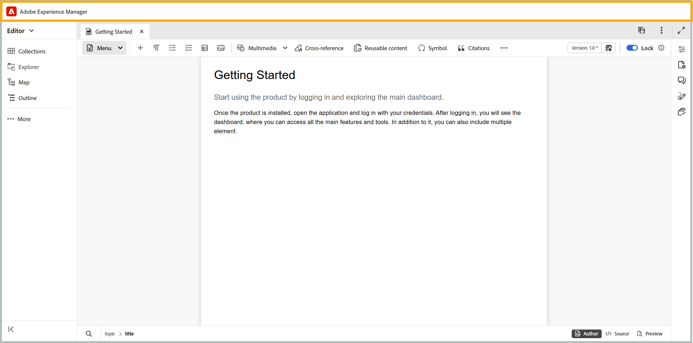

# Barre d’en-tête de l’éditeur

La barre d’en-tête est la barre supérieure de l’éditeur qui affiche le logo de Adobe Experience Manager (ou un shell unifié si vous utilisez le shell unifié comme interface utilisateur de Experience Manager Guides). Lorsque vous sélectionnez le logo, il vous dirige vers la page de navigation d’Experience Manager.

Utilisez l’icône **Développer** dans la barre d’outils pour masquer la barre d’en-tête et agrandir la zone de contenu. Pour restaurer la vue standard, sélectionnez **Quitter la vue développée**.

{width="350"}

**Rubrique parente :**&#x200B;[&#x200B; Présentation de l’éditeur](web-editor.md)
