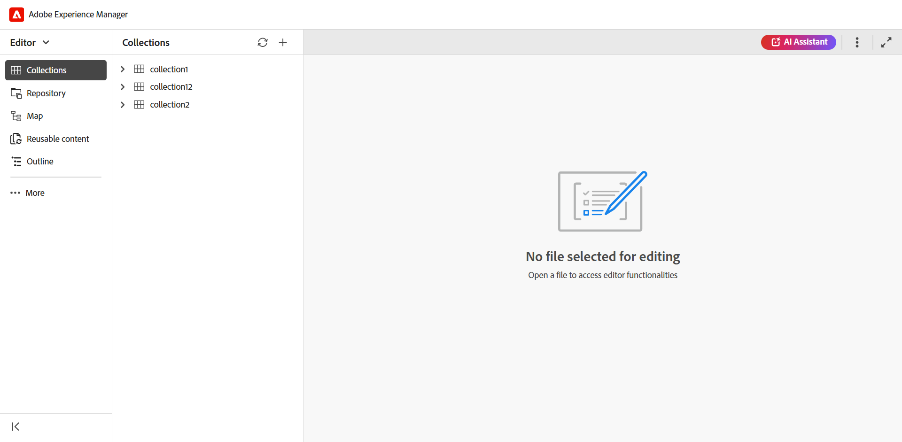
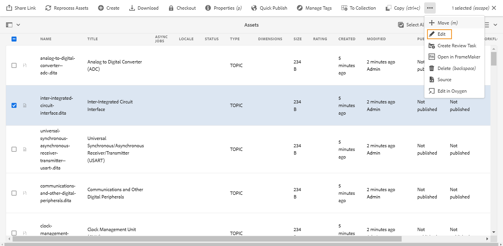
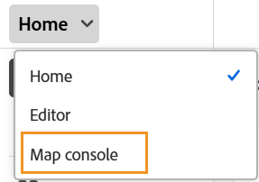
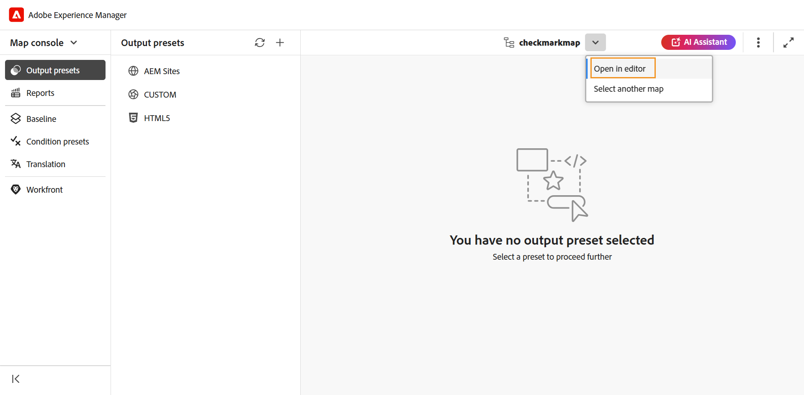
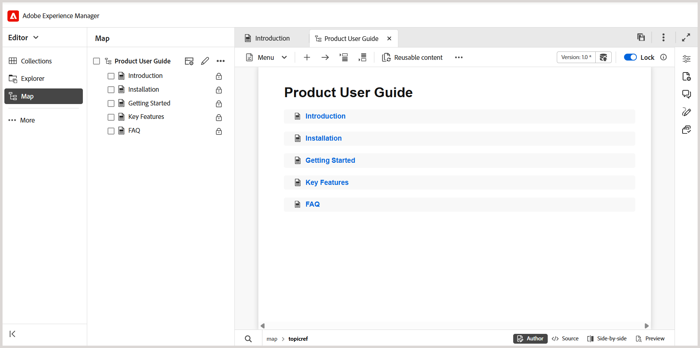
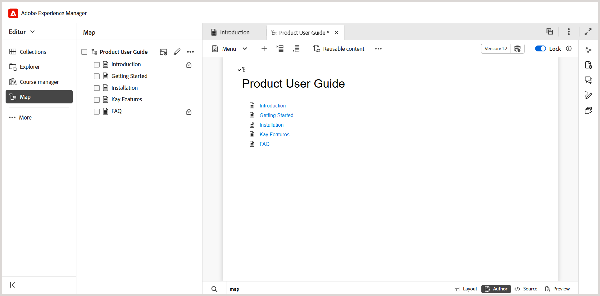

# Lancement de l’éditeur {#id2056B0140HS}

>[!INFO]
>
> Cette rubrique s’applique à la fois au nouvel éditeur et à l’ancien éditeur. Bien que les principales fonctionnalités restent cohérentes, les différences au niveau de l’interface utilisateur, de la terminologie et des interactions sont indiquées dans le contenu à l’aide des onglets et des légendes, le cas échéant.

Vous pouvez lancer l’éditeur à partir des emplacements suivants :

- [Page de navigation de Adobe Experience Manager](#adobe-experience-manager-navigation-page)
- [Interface utilisateur d’Adobe Experience Manager Assets](#adobe-experience-manager-assets-ui)
- [Console Carte](#map-console)

Les sections suivantes décrivent en détail comment accéder à l’éditeur et le lancer à partir de différents emplacements.

## Page de navigation de Adobe Experience Manager

Lorsque vous vous connectez à Experience Manager, la page Navigation s’affiche :

Le fait de sélectionner le lien **Guides** vous mène à la page d’accueil [Adobe Experience Manager Guides](./intro-home-page.md).

Pour lancer l’éditeur, accédez à la barre de navigation, puis sélectionnez **Éditeur** dans la liste déroulante. La page d’accueil est sélectionnée par défaut.

{width="350"}

Lorsque vous lancez l’éditeur sans sélectionner de fichier, un écran d’éditeur vierge s’affiche. Vous pouvez ouvrir un fichier pour le modifier à partir d’Experience Manager **référentiel** ou de vos **collections**.

Vous pouvez également lancer l’éditeur en ouvrant les fichiers existants présents dans les widgets **Fichiers récents** et **Collections** de [Expérience de la page d’accueil d’Adobe Experience Manager Guides](./intro-home-page.md).

Pour revenir à la page de navigation d’Experience Manager, sélectionnez le logo Adobe Experience Manager situé dans le coin supérieur gauche de l’en-tête supérieur.

## Interface utilisateur d’Adobe Experience Manager Assets

L’interface utilisateur de Experience Manager Assets est un autre emplacement à partir duquel vous pouvez lancer l’éditeur. Vous pouvez sélectionner une ou plusieurs rubriques et les ouvrir directement dans l’éditeur.

Pour ouvrir une rubrique dans l’éditeur, procédez comme suit :

1. Dans l’interface utilisateur d’Assets, accédez à la rubrique à modifier.

   >[!NOTE]
   >
   > Vous pouvez également afficher l’UUID de la rubrique.

   

   >[!IMPORTANT]
   >
   > Assurez-vous de disposer des autorisations de lecture et d’écriture sur le dossier contenant la rubrique à modifier.

1. Pour obtenir un verrou exclusif sur la rubrique, sélectionnez la rubrique et sélectionnez **Extraire**.

   >[!IMPORTANT]
   >
   > Si votre administrateur a configuré l’option **Désactiver la modification sans verrouiller le fichier**, vous devez extraire le fichier avant de le modifier. Si vous n&#39;extrayez pas le fichier, vous ne pourrez pas afficher l&#39;option d&#39;édition.

1. Fermez le mode de sélection des ressources et sélectionnez la rubrique à modifier.

   L’aperçu de la rubrique s’affiche.

   Vous pouvez ouvrir l’éditeur en mode Liste , Carte et Aperçu .

   >[!IMPORTANT]
   >
   > Si vous souhaitez ouvrir plusieurs rubriques pour les modifier, sélectionnez-les dans l’interface utilisateur d’Assets et sélectionnez **Modifier**. Assurez-vous que votre navigateur n’a pas de bloqueur de pop-up activé, sinon seule la première rubrique de la liste sélectionnée est ouverte pour modification.

   

   Si vous ne souhaitez pas prévisualiser une rubrique et que vous souhaitez l’ouvrir directement dans l’éditeur, sélectionnez l’icône **Modifier** dans le menu d’action rapide en mode Carte :

   

La rubrique s’ouvre dans l’éditeur.

>[!BEGINTABS]

>[!TAB Nouvel éditeur]

Cette vue affiche le rendu du contenu dans le nouvel éditeur

>[!TAB Ancien éditeur]

Cette vue affiche le rendu du contenu dans l’ancien éditeur

>[!ENDTABS]

Vous pouvez également ouvrir un fichier de mappage dans l’interface utilisateur d’Assets et lancer l’éditeur pour modifier les rubriques du fichier de mappage.

Pour ouvrir une carte dans l’éditeur, procédez comme suit :

1. Dans l’interface utilisateur d’Assets, accédez au fichier de mappage contenant la rubrique à modifier et sélectionnez-le.
1. Dans la console de plan DITA, accédez à l&#39;onglet **Rubriques**. Une liste de rubriques dans le fichier de mappage s’affiche.
1. Sélectionnez le fichier de rubrique à modifier.
1. Sélectionnez **Modifier rubrique**.

   

1. La rubrique s’ouvre dans l’éditeur.

   >[!IMPORTANT]
   >
   > Si votre administrateur a configuré l’option **Désactiver la modification sans verrouiller le fichier**, vous devez extraire le fichier avant de le modifier. Si vous ne récupérez pas le fichier, le document s’ouvre dans l’éditeur en mode lecture seule.

## Console Carte

Pour ouvrir l’éditeur à partir de la console Carte, procédez comme suit :

1. Ouvrez la page d’accueil et lancez la console Carte.

   {width="350"}

   Comme vous avez lancé la console Map sans sélectionner de fichier map, un écran de console Map vierge s’affiche. Vous pouvez également ouvrir un fichier de mappage à partir d’Experience Manager **Référentiel** ou de vos **Collections**.

   {width="500"}

1. Choisissez **Sélectionner un mappage** pour ouvrir un fichier de mappage contenant les rubriques à modifier dans l’éditeur.
1. Sélectionnez le chemin d’accès où se trouve votre fichier de mappage. Le fichier de mappage sélectionné est ajouté à la console Mappage.
1. Accédez au fichier de mappage et sélectionnez **Ouvrir dans l’éditeur** dans la liste déroulante.

   

Le fichier de mappage contenant les rubriques est ouvert pour modification dans l’éditeur.

>[!BEGINTABS]

>[!TAB Nouvel éditeur]

Mode d’édition des cartes dans le nouvel éditeur :

>[!TAB Ancien éditeur]

Mode d’édition des cartes dans l’ancien éditeur :

>[!ENDTABS]

**Rubrique parente** : [Présentation de l’éditeur](web-editor.md)
