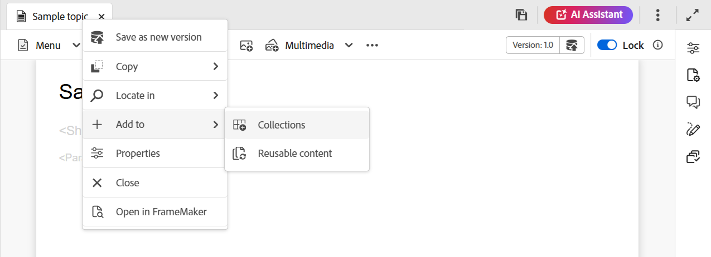
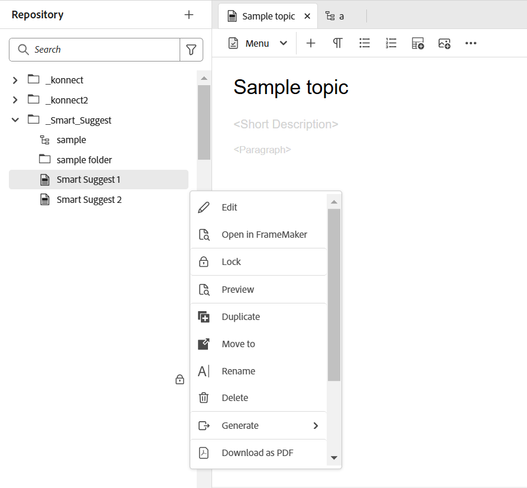
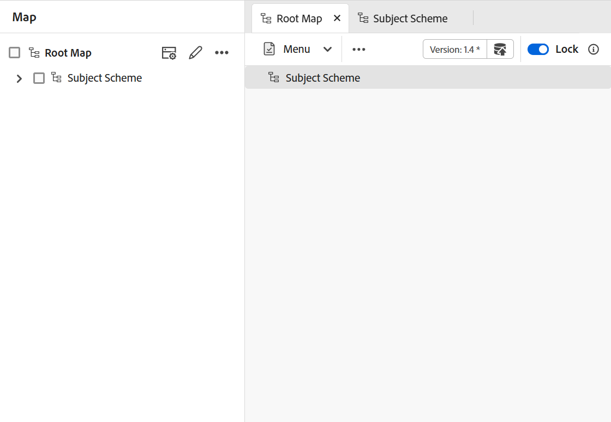

# Panneau de gauche de l’éditeur

Le panneau de gauche vous donne un accès rapide aux collections, à la vue du référentiel, à la vue Carte et à d’autres fonctionnalités. Vous pouvez développer le panneau en sélectionnant l’icône **Développer** placée dans le coin inférieur gauche de l’interface. Une fois développé, utilisez l’icône **Réduire** pour réduire le panneau. Dans la vue développée, il affiche les noms des icônes qui apparaissent sous forme d’info-bulles dans la vue réduite.

>[!NOTE]
>
>Le panneau de gauche est redimensionnable. Pour redimensionner le panneau, placez le curseur sur la limite du panneau, le curseur se transforme en flèche à deux pointes, sélectionnez et faites glisser pour redimensionner la largeur du panneau.

Le panneau de gauche vous donne accès aux fonctionnalités suivantes :

- [Collections](#collections)
- [Référentiel](#repository)
- [Explorateur](#explorer)
- [Map](#map)
- [Contenu réutilisable](#reusable-content)
- [Esquisse](#outline)

Certaines des fonctionnalités du panneau de gauche sont disponibles dans la section **Plus**. Sélectionnez l’icône Plus  pour accéder aux fonctionnalités ci-dessous :

- [Glossaire](#glossary)
- [Conditions](#conditions)
- [Schéma de l&#39;objet](#subject-scheme)
- [Fragments de code](#snippets)
- [Modèles](#templates)
- [Citations](#citations)
- [Variables de langue](#language-variables)
- [Variables](#variables)
- [Rechercher et remplacer](#find-and-replace)
- [Modèles PDF](#pdf-templates)
- [Révision](#review)


Une option supplémentaire intitulée **Workfront** s’affiche également dans le panneau de gauche si Adobe Workfront est configuré.

Pour plus d’informations, consultez Intégration de [Workfront](./workfront-integration.md).

>[!NOTE]
>
> Les fonctionnalités disponibles dans le panneau de gauche sont gérées par votre administrateur, ce qui leur permet d’activer ou de désactiver les fonctionnalités individuelles présentes dans le panneau de gauche. Seules les fonctionnalités activées s’affichent dans le panneau de gauche. Pour plus d’informations, consultez la section **Panneaux** de la [barre d’onglets](./web-editor-tab-bar.md).

L’explication détaillée des fonctionnalités du panneau de gauche est la suivante :

## Collections

Si vous travaillez sur un ensemble de fichiers ou de dossiers, vous pouvez les ajouter à votre liste préférée pour y accéder rapidement. **Collections** affiche la liste des documents que vous avez ajoutés et d’autres listes de documents accessibles au public provenant des autres utilisateurs.

Par défaut, vous pouvez afficher les fichiers par titres. Pointez sur un fichier pour afficher le titre du fichier et son chemin d’accès sous forme d’info-bulle.

>[!NOTE]
>
> En tant qu’administrateur, vous pouvez également choisir d’afficher la liste des fichiers par nom de fichier dans l’éditeur. Sélectionnez l’option **Nom de fichier** de la section **Configuration de l’affichage des fichiers de l’éditeur** dans **Préférences utilisateur**.

<details>
    <summary> Créer une collection </summary>


Pour créer une nouvelle collection, sélectionnez l’icône + en regard du panneau Collections pour afficher la boîte de dialogue **Nouvelle collection** :

{width="300" align="left"}

Saisissez un titre et une description pour la collection que vous souhaitez créer. Si vous sélectionnez **Public**, ce favori est également affiché aux autres utilisateurs.

>[!NOTE]
>
> Vous pouvez également créer une collection à partir de la page d’accueil de Experience Manager Guides. Ouvrez la page d’accueil, accédez au widget **Collections** dans la [section Aperçu](./intro-home-page.md#overview), puis sélectionnez **Nouvelle collection**.

</details>

<details>
    <summary> Ajout d’un fichier aux collections </summary>


Pour ajouter un fichier aux collections, utilisez l’une des méthodes suivantes :

- Accédez au fichier ou au dossier requis dans la vue Référentiel, sélectionnez l’icône *Options* pour ouvrir le menu contextuel, puis choisissez **Ajouter à** > **Collections**. Dans la boîte de dialogue **Ajouter aux collections**, vous pouvez choisir d’ajouter le fichier/dossier à un favori existant ou d’en créer un nouveau.

  {width="300" align="left"}

- Cliquez avec le bouton droit de la souris sur l’onglet d’un fichier dans l’éditeur pour ouvrir le menu contextuel. Choisissez **Ajouter à** > **Collections** pour ajouter le fichier à votre liste de favoris.

  {align="left"}


>[!NOTE]
>
> - Pour supprimer un élément de la liste des favoris, sélectionnez l’icône Options située en regard de l’élément dans une collection Favoris et choisissez **Supprimer des collections**.
> - Pour prévisualiser le fichier sans l’ouvrir, sélectionnez un fichier, puis sélectionnez **Aperçu** dans le menu Options.

</details>

**Menu Options d’une collection**

Vous pouvez également effectuer de nombreuses actions à l’aide du menu Options disponible pour une collection :

{width="650" align="left"}

- **Renommer** : renommez la collection sélectionnée.
- **Supprimer** : permet de supprimer la collection sélectionnée.
- **Actualiser** : obtenez une nouvelle liste de fichiers et de dossiers du référentiel.
- **Afficher dans l’interface utilisateur d’Assets** : afficher le contenu du fichier ou du dossier dans l’interface utilisateur d’Assets.

>[!NOTE]
>
> Vous pouvez actualiser la liste à l’aide de l’icône **Actualiser** située en haut. En outre, l’actualisation de la liste recharge les collections et, par conséquent, toutes les collections développées dans le panneau sont réduites.


## Référentiel

>[!NOTE]
>
> À compter de la version 2025.11.0, le **Référentiel** dans l’éditeur sera obsolète et remplacé par le **Explorateur** pour la configuration **Cloud Service**. Pour la configuration **On-Premise**, vous continuerez à afficher et à utiliser le référentiel via l’interface de l’éditeur jusqu’à la version 5.1 de Experience Manager Guides.

Lorsque vous sélectionnez l’icône Référentiel , vous obtenez une liste de fichiers et de dossiers disponibles dans la gestion des ressources numériques (DAM). Par défaut, vous pouvez afficher les fichiers par titres. Pointez sur un fichier pour afficher le titre et le nom du fichier sous forme d’info-bulle.

>[!NOTE]
>
> En tant qu’administrateur, vous pouvez également choisir d’afficher la liste des fichiers par nom de fichier dans l’éditeur. Sélectionnez l’option **Nom de fichier** de la section **Configuration de l’affichage des fichiers de l’éditeur** dans **Préférences utilisateur**.

75 fichiers sont chargés à la fois. Chaque fois que vous sélectionnez **Charger plus**... 75 fichiers sont chargés et le bouton cesse d’être affiché lorsque tous les fichiers ont été répertoriés. Ce chargement par lots est efficace et vous pouvez accéder aux fichiers plus rapidement qu’avec le chargement de tous les fichiers existants dans un dossier.

Vous pouvez facilement accéder au fichier requis dans la gestion des ressources numériques et l’ouvrir dans l’éditeur. Si vous disposez de l’accès requis pour modifier le fichier, vous pouvez le faire.

Vous pouvez également sélectionner et lire un fichier audio ou vidéo dans l’éditeur. Vous pouvez modifier le volume ou
la vue de la vidéo. Dans le menu contextuel, vous avez également les options de téléchargement et de modification de la lecture
vitesse ou afficher l&#39;image en image.

Sélectionnez une carte et appuyez sur Entrée ou double-cliquez pour l’ouvrir dans la **vue Carte**. Pour plus d’informations, consultez la description de la fonction **Vue Carte** dans le panneau de gauche. Sélectionnez une rubrique et appuyez sur Entrée ou double-cliquez pour l&#39;ouvrir dans la zone [Modification du contenu](./web-editor-content-editing-area.md). La possibilité de naviguer et d’ouvrir un fichier directement depuis l’éditeur permet de gagner du temps et d’augmenter la productivité.

## Filtrer la recherche dans le référentiel

L’éditeur fournit des filtres améliorés pour la recherche de texte. Vous pouvez rechercher et filtrer du texte dans les fichiers présents sur le chemin d’accès sélectionné du référentiel Adobe Experience Manager. Elle effectue une recherche dans le titre, le nom de fichier et le contenu des fichiers.


{width="300" align="left"}

*Appliquez des filtres pour rechercher les fichiers contenant le`personal spaceship.`* de texte

Sélectionnez l’icône **Filtrer la recherche** \(\) pour ouvrir le pop-up Filtre .

>[!NOTE]
>
> Lorsque vous recherchez du texte ou filtrez des fichiers, un point bleu s’affiche sur l’icône **Filtrer la recherche** \(\) pour indiquer que nous sommes sur le panneau de recherche et que certains filtres ont été appliqués.


Vous disposez des options suivantes pour filtrer les fichiers et affiner votre recherche dans le référentiel Adobe Experience Manager :

- **Fichiers DITA** : vous pouvez rechercher toutes les **rubriques DITA** et **cartes DITA** présentes sur le chemin d&#39;accès sélectionné. Ils sont sélectionnés par défaut.
- **Fichiers non-DITA** : vous pouvez rechercher **Fichiers Ditaval**, **Fichiers image**, **Multimédia**, **Documents** et **JSON** dans le chemin d’accès sélectionné.

   {width="300" align="left"}

  *Utilisez les filtres rapides pour rechercher des fichiers DITA et non DITA.*

>[!NOTE]
>
> Vous pouvez également utiliser le filtre **Rubrique DITA** pour rechercher du contenu spécifique aux fichiers Markdown dans le référentiel, y compris des titres, du contenu de rubrique et des propriétés. Actuellement, cette fonctionnalité s’applique uniquement aux fichiers Markdown nouvellement créés.

**Filtrage avancé**

Sélectionnez l’icône **Filtrage avancé**  pour afficher la boîte de dialogue **Filtre avancé**.

Vous pouvez afficher les options suivantes sous les onglets **Général** et **Avancé**.

 {width="650" align="left"}


**Général**

- **Résultats de la recherche avec** : recherchez du texte dans les fichiers présents sur le chemin d’accès sélectionné du référentiel Adobe Experience Manager. La recherche porte sur le titre, le nom de fichier et le contenu des fichiers.

Cette opération est synchronisée avec la zone de recherche de la fenêtre du référentiel. Par exemple, si vous saisissez `general purpose` dans la zone de recherche du panneau Référentiel, elle apparaît également dans la boîte de dialogue **Filtre avancé** et vice versa.

- **Rechercher dans** : sélectionnez le chemin d’accès où vous souhaitez rechercher les fichiers présents dans le référentiel Adobe Experience Manager.
- **Fichiers DITA** : vous pouvez rechercher toutes les **rubriques DITA** et **cartes DITA** présentes sur le chemin d&#39;accès sélectionné. Ils sont sélectionnés par défaut.
- **Fichiers non-DITA** : vous pouvez rechercher **Fichiers Ditaval**, **Fichiers image**, **Multimédia**, **Documents** et **JSON** dans le chemin d’accès sélectionné.
- **Verrouillé par** : affiche une liste d’utilisateurs. La liste est paginée et se charge de manière asynchrone, affichant un ensemble limité d’utilisateurs à la fois et en récupérant d’autres au fur et à mesure que vous faites défiler ou naviguez. Cela améliore la vitesse de chargement et les performances globales, en particulier lorsque vous travaillez avec un grand nombre d’utilisateurs.
- **Modifié après** / **Modifié avant** : filtrez le contenu en fonction de la date de modification. Sélectionnez une période dans le calendrier ou choisissez l’une des options de période suivantes :
   - Au cours des deux dernières heures
   - La semaine dernière
   - Le mois dernier
   - L&#39;année dernière
- **Balises** : filtrez le contenu en fonction des balises.

**Avancé**

- **Éléments DITA** : vous pouvez également rechercher des valeurs spécifiques dans les attributs des éléments DITA spécifiés.
   - Sélectionnez **Ajouter un élément** pour ajouter les éléments, les attributs et les valeurs.
   - Appliquez les filtres que vous avez sélectionnés.

- Sélectionnez **Effacer tout** pour effacer tous les filtres appliqués.


- Sélectionnez l’icône **Fermer le filtre**  pour fermer le filtre et revenir à l’arborescence du référentiel.

  >[!NOTE]
  >
  >Votre administrateur système peut également configurer les filtres de texte et afficher ou masquer d’autres filtres. Pour plus d’informations, consultez la section *Configurer les filtres de texte* dans la section Installation et configuration d’Adobe Experience Manager Guides as a Cloud Service.
  >
  >La liste des fichiers filtrés contenant le texte recherché s’affiche. Par exemple, les fichiers contenant le texte `personal spaceship` sont répertoriés dans la capture d’écran précédente. Vous pouvez sélectionner plusieurs fichiers dans la liste filtrée pour les faire glisser et les déposer dans une carte ouverte pour modification.

### Menu Options

Outre l’ouverture de fichiers à partir du panneau de gauche, vous pouvez également effectuer de nombreuses actions à l’aide du menu Options disponible dans la vue Référentiel. Différentes options s’affichent, selon que vous choisissez un dossier, un fichier de rubrique ou un fichier multimédia.

**Options d’un dossier**

Vous pouvez effectuer les actions suivantes à l’aide du menu Options disponible pour un *dossier* dans la vue Référentiel :

{width="550" align="left"}


- **Nouveau** : créez une rubrique DITA, un plan DITA ou un dossier.

<details>
    <summary> Procédure de création d’une rubrique </summary>

Procédure à suivre pour créer une rubrique :
1. Sélectionnez **Nouveau** > **Sujet**.
2. La boîte de dialogue **Nouvelle rubrique** s&#39;affiche.

   {width="300" align="left"}

3. Dans la boîte de dialogue **Nouvelle rubrique**, fournissez les détails suivants :
   - Titre de la rubrique.
   - \(Facultatif\)* Nom de fichier de la rubrique. Le nom du fichier est suggéré automatiquement en fonction du titre de la rubrique. Si votre administrateur a activé les noms de fichiers automatiques en fonction du paramètre UUID, vous ne verrez pas le champ Nom .
   - Modèle sur lequel la rubrique sera basée. Par exemple, pour une configuration prête à l’emploi, vous pouvez choisir parmi les modèles Vierge, Concept, DITAVAL, Référence, Tâche, Rubrique, Markdown, Glossaire et Dépannage. Si un profil de dossier est configuré sur votre dossier, seuls les modèles de rubrique configurés sur le profil de dossier sont affichés.

   - Chemin d’accès où enregistrer le fichier de rubrique. Par défaut, le chemin du dossier actuellement sélectionné dans le référentiel s’affiche dans le champ Chemin .
4. Sélectionnez **Créer**. La rubrique est créée au chemin d’accès spécifié. En outre, la rubrique est ouverte dans l’éditeur pour modification.

</details>

<details>
<summary> Procédure de création d'un plan DITA </summary>


Procédure à suivre pour créer un plan DITA :

1. Sélectionnez **Nouveau** > **Plan DITA**.
2. La boîte de dialogue **Nouvelle carte** s’affiche.

   {width="300" align="left"}

3. Dans la boîte de dialogue **Nouveau mappage**, fournissez les détails suivants :
   - Titre de la carte.
   - *\(Facultatif\)* Nom de fichier du mappage. Le nom du fichier est suggéré automatiquement en fonction du titre du mappage. Si votre administrateur a activé les noms de fichiers automatiques en fonction du paramètre UUID, vous ne verrez pas le champ Nom .
   - Un modèle sur lequel la carte sera basée. Par exemple, pour une configuration prête à l&#39;emploi, vous pouvez choisir parmi les modèles Bookmap ou DITA map.
   - Chemin où enregistrer le fichier de mappage. Par défaut, le chemin du dossier actuellement sélectionné dans le référentiel s’affiche dans le champ Chemin .
4. Sélectionnez **Créer**. La carte est créée et ajoutée dans le dossier spécifié dans le champ Chemin d’accès . En outre, la carte est ouverte en mode Carte. Vous pouvez ouvrir le fichier de mappage dans l’éditeur de mappages et y ajouter une rubrique. Pour plus d’informations sur l’ajout de rubriques à un fichier de mappage, voir [Créer un mappage](map-editor-create-map.md#). Vous pouvez également sélectionner **Ouvrir dans la console de mappage** pour ouvrir la carte dans la console de mappage.
</details>

<details>
<summary> Procédure de création d’un dossier </summary>

Procédure à suivre pour créer un dossier :

1. Sélectionnez **Nouveau** > **Dossier**.
2. La boîte de dialogue **Nouveau dossier** s’affiche.

   {width="300" align="left"}

3. Dans la boîte de dialogue **Nouveau dossier**, fournissez les détails suivants :
   - Un titre pour le dossier, qui est automatiquement converti en nom de dossier.
   - Chemin d’accès où enregistrer le dossier. Par défaut, le chemin du dossier actuellement sélectionné dans le référentiel s’affiche dans le champ Chemin .
4. Sélectionnez **Créer**. Le dossier est créé et ajouté dans le dossier à partir duquel l’option Créer un dossier a été exécutée.

</details>

- **Télécharger Assets** : chargez un fichier depuis votre système local vers le dossier sélectionné dans le référentiel Adobe Experience Manager. Vous pouvez également glisser-déposer des fichiers de votre système local sur votre rubrique de travail actuelle. Ceci est très utile si vous souhaitez insérer des images de votre système local dans votre rubrique.

  {width="300" align="left"}

  Vous pouvez sélectionner le dossier dans lequel vous souhaitez charger le fichier. Un aperçu de l’image s’affiche également. Si vous souhaitez renommer le fichier, vous pouvez le faire dans la zone de texte Nom du fichier. Sélectionnez **Charger** pour terminer le processus de chargement du fichier. Si vous avez fait glisser et déposé un fichier image sur une rubrique, le fichier image est alors ajouté à l’article et il est également téléchargé.

  Si votre administrateur a activé l’option UUIDs dans *XMLEditorConfig*, l’UUID de l’image chargée s’affiche dans la propriété **Source**.

  {align="left"}

- **Rechercher des fichiers dans le dossier** : déplace le focus vers la recherche de référentiel dans laquelle vous pouvez saisir le terme de recherche. La recherche s’effectue sous le dossier sélectionné dans le référentiel. Vous pouvez également appliquer un filtre pour renvoyer les fichiers DITA, les fichiers image ou les deux.

  {width="300" align="left"}

  Vous pouvez également effectuer une recherche à l’aide de l’UUID d’un fichier. Dans ce cas, les résultats de la recherche affichent le titre du fichier DITA/XML et, dans le cas où le fichier est un fichier image, l&#39;UUID du fichier s&#39;affiche. Dans l’exemple de recherche suivant, l’UUID d’un fichier image est recherché et les résultats de la recherche affichent l’UUID du fichier image d’origine et le titre de rubrique du fichier dans lequel cette image est référencée.

  {width="300" align="left"}

- **Réduire** : réduisez le dossier sélectionné dans le référentiel.

  >[!NOTE]
  >
  > Utilisez l’icône **\>** en regard d’un dossier pour le développer.

- **Ajouter aux collections** : ajoute le dossier sélectionné aux favoris. Vous pouvez choisir de l’ajouter à une collection existante ou nouvelle.

- **Actualiser** : obtenez une nouvelle liste de fichiers et de dossiers du référentiel.
- **Afficher dans l’interface utilisateur d’Assets** : afficher le contenu du dossier dans l’interface utilisateur d’Assets.

**Options d’un fichier**

Accédez aux différentes options du menu Options selon que vous sélectionnez un fichier multimédia ou un fichier DITA. Voici quelques options courantes disponibles pour les fichiers multimédia et DITA :

- Modifier
- Ouvrir dans FrameMaker
- Doublon
- Verrouiller/déverrouiller
- Prévisualisation
- Déplacer vers
- Renommer
- Supprimer
- Générer
- Télécharger en tant que PDF
- Ajouter à
- Copier
- Afficher dans l’interface utilisateur d’Assets
- Propriétés


{width="550" align="left"}

Les différentes options du menu Options sont expliquées ci-dessous :

- **Modifier** : ouvrez le fichier pour le modifier. Dans le cas d’un fichier .ditamap/.bookmap, il est ouvert pour modification dans l’[Éditeur de carte](map-editor-advanced-map-editor.md#).

- **Dupliquer** : utilisez cette option pour créer un doublon ou une copie du fichier sélectionné. Vous avez également la possibilité de renommer le fichier en double dans l’invite de ressources en double. Par défaut, le fichier est créé avec un suffixe \(comme nom_fichier\_1.extension\). Le titre du fichier reste identique au fichier source et le nouveau fichier commence par la version 1.0. Toutes les références, balises et métadonnées sont copiées alors que les lignes de base ne sont pas copiées dans le fichier en double.
- **Verrouiller** : verrouillez le fichier sélectionné pour le modifier. Si le fichier est verrouillé, le fait de placer le pointeur de la souris sur l’icône de verrouillage indique **Verrouillé par vous** si vous l’avez verrouillé, ou **Verrouillé par [nom d’utilisateur]** si un autre utilisateur l’a verrouillé.

- **Aperçu** : obtenez un aperçu rapide du fichier (.dita, .xml, audio, vidéo ou image) sans l’ouvrir. Vous pouvez redimensionner le volet d’aperçu. Si le contenu contient des `<xref>` ou des `<conref>`, vous pouvez les sélectionner pour les ouvrir dans un nouvel onglet. Le titre du fichier s’affiche dans la fenêtre. Si aucun titre n’est présent, le nom du fichier s’affiche. Pour fermer le panneau **Aperçu**, vous pouvez sélectionner l’icône de fermeture ou sélectionner un emplacement en dehors du panneau.

  {align="left"}

- **Renommer** : utilisez cette option pour renommer le fichier sélectionné. Saisissez le nom du nouveau fichier dans la boîte de dialogue **Renommer la ressource**.
   - Vous pouvez renommer un fichier de n’importe quel type.
   - Vous ne pouvez pas modifier l’extension d’un fichier.
   - Deux fichiers ne peuvent pas porter le même nom. Par conséquent, vous ne pouvez pas renommer un fichier avec un nom qui existe déjà. Une erreur s’affiche.

- **Déplacer vers** : utilisez cette option pour déplacer le fichier sélectionné vers un autre dossier.
   - Vous pouvez saisir le nom du dossier de destination ou choisir **Sélectionner le chemin** pour sélectionner le dossier de destination.
   - Vous pouvez déplacer un fichier de n’importe quel type vers n’importe quelle destination dans le dossier Contenu.
   - Deux fichiers ne peuvent pas porter le même nom. Vous ne pouvez donc pas déplacer un fichier vers un dossier où un fichier portant le même nom existe déjà.

  Si vous essayez de déplacer un fichier vers un dossier dans lequel un fichier portant le même nom existe mais avec un titre différent, la boîte de dialogue Renommer et déplacer le fichier s’affiche et vous devez renommer le fichier avant de le déplacer. Le fichier déplacé dans le dossier de destination porte le nouveau nom de fichier.

  {width="550" align="left"}

  >[!NOTE]
  >
  > Vous pouvez également faire glisser un fichier vers un autre dossier de destination.

  **Scénarios d’exclusion**

  Experience Manager Guides ne vous permet pas de renommer ou de déplacer un fichier dans les scénarios suivants :

   - Vous ne pouvez pas déplacer ou renommer un fichier s’il fait partie d’une révision ou d’un workflow de traduction.

   - Si un autre utilisateur verrouille le fichier, vous ne pouvez pas le renommer ni le déplacer. L’option Renommer ou Déplacer vers ne s’affiche pas pour le fichier.

  >[!NOTE]
  >
  > Si votre administrateur vous a donné les autorisations sur un dossier uniquement, les options **Renommer** ou **Déplacer vers** s’affichent.

  <details>
    <summary> Services cloud </summary>

  Le changement de nom ou le déplacement d’un fichier n’interrompt pas les références existantes à partir du fichier ou vers le fichier, car chaque fichier a un UUID unique.
  </details>

- **Supprimer** : utilisez cette option pour supprimer le fichier sélectionné. Une invite de confirmation s’affiche avant la suppression du fichier.

   - Une invite de confirmation s’affiche avant la suppression du fichier.
   - Si le fichier n’est pas référencé à partir d’un autre fichier, il est supprimé et un message de réussite s’affiche.
   - Si le fichier est verrouillé, vous ne pouvez pas le supprimer et un message d’erreur s’affiche.

     >[!NOTE]
     >
     > Si votre administrateur a empêché la suppression des fichiers verrouillés, le message d’erreur s’affiche. Pour plus d’informations, consultez la section *Empêcher la suppression des fichiers extraits* dans la section Installation et configuration d’Adobe Experience Manager Guides as a Cloud Service.

   - Si le fichier est ajouté à une collection, la boîte de dialogue **Forcer la suppression** s’affiche et vous pouvez forcer sa suppression.
   - Si le fichier est référencé à partir d’un autre fichier **la boîte de dialogue** Forcer la suppression s’affiche et vous pouvez forcer la suppression du fichier :

     {width="300" align="left"}

     >[!NOTE]
     >
     > Si votre administrateur a autorisé la suppression du fichier, l’option **Forcer la suppression** est activée. Dans le cas contraire, la fonction **Forcer la suppression** est désactivée et un message s’affiche indiquant que vous n’êtes pas autorisé à supprimer les fichiers référencés. Pour plus d’informations, consultez la section *Empêcher la suppression des fichiers référencés* dans la section Installation et configuration d’Adobe Experience Manager Guides as a Cloud Service.

   - Si vous supprimez une rubrique référencée et que vous avez ouvert le fichier contenant les références pour le modifier, le lien rompu pour le fichier référencé s’affiche.

  >[!NOTE]
  >
  > Vous pouvez également supprimer le fichier sélectionné de la même manière à l’aide de la touche Supprimer du clavier.

- **Copier** : vous pouvez choisir parmi les options suivantes :

   - **Copier l’UUID** : copiez l’UUID du fichier sélectionné dans le presse-papiers.

   - **Copier le chemin d’accès** : copiez le chemin d’accès complet du fichier sélectionné dans le Presse-papiers.

- **Ajouter à** : vous pouvez choisir parmi les options suivantes :
   - **Collections** : ajoute le fichier sélectionné aux collections. Vous pouvez choisir de l’ajouter à une collection existante ou nouvelle.

   - **Contenu réutilisable** : ajoute le fichier sélectionné à la liste Contenu réutilisable dans le panneau de gauche.

- **Propriétés** : utilisez cette option pour ouvrir la page des propriétés du fichier sélectionné. Cette page de propriétés est également accessible à partir de l’interface utilisateur d’Assets en sélectionnant un fichier, puis en sélectionnant Icône Propriétés dans la barre d’outils.

- **Ouvrir dans le tableau de bord des cartes** : si le fichier sélectionné est un plan DITA, cette option ouvre le tableau de bord des cartes.

- **Ouvrir dans la console de mappage** : si le fichier sélectionné est un mappage DITA, cette option ouvre la console de mappage.

- **Modifier dans Oxygen** : sélectionnez cette option pour modifier le fichier sélectionné dans le plug-in Oxygen Connector. Le fichier est ouvert pour modification.

  >[!NOTE]
  >
  >Contactez votre équipe du succès client pour que cette fonctionnalité soit activée dans l’environnement. Cette fonctionnalité n’est pas activée dans le cadre de la prise en charge prête à l’emploi. Pour plus d&#39;informations, consultez la section [Configurer l&#39;option à modifier dans Oxygen](../cs-install-guide/conf-edit-in-oxygen.md) du Guide d&#39;installation et de configuration.


- **Afficher dans l’interface utilisateur d’Assets** : utilisez cette option pour afficher un aperçu d’un fichier .dita/.xml dans l’interface utilisateur d’Assets. Dans le cas d’un fichier .ditamap/.bookmap, tous les fichiers de rubrique de la carte sont affichés dans une seule vue page par page unifiée.

- **Télécharger sous forme de PDF** : utilisez cette option pour générer la sortie PDF et la télécharger.

- **Générer** : utilisez cette option pour publier une carte ou des rubriques d’une carte sur une page Sites, un fragment de contenu ou un fragment d’expérience.

## Explorateur

>[!NOTE]
>
> À compter de la version 2025.11.0, le terme Référentiel dans l’éditeur sera remplacé par **Explorer** pour la configuration du service cloud. La configuration On-Premise continue à voir et à accéder au référentiel dans l’éditeur.

L’Explorateur fournit la plupart des fonctionnalités précédemment disponibles dans le référentiel, notamment :

- Navigation dans les fichiers et dossiers
- Menu Options des fichiers et des dossiers

Elle offre toutefois une expérience de recherche et de filtrage améliorée, conçue pour améliorer la convivialité et l’efficacité.

Pour plus d&#39;informations sur le menu contextuel des fichiers et des dossiers, voir [menu Options](#options-menu).

Pour plus d’informations sur l’expérience de recherche, consultez [Panneau de recherche](./search-panel-explorer.md).

## Map

Lorsque vous sélectionnez l’icône Vue Carte , la vue Carte s’affiche avec une liste de rubriques dans le fichier de carte. Si vous n’avez ouvert aucun fichier de mappage, la vue Carte apparaît vide. Double-cliquez sur un fichier de mappage pour ouvrir le fichier de mappage dans cette vue. Vous pouvez double-cliquer sur n’importe quel fichier de la carte pour l’ouvrir dans l’éditeur.

Par défaut, vous pouvez afficher les fichiers par titres. Pointez sur un fichier pour afficher le titre du fichier et son chemin d’accès sous forme d’info-bulle.

>[!NOTE]
>
>En tant qu’administrateur, vous pouvez également choisir d’afficher le nom de fichier du mappage parent actuellement ouvert dans la vue de mappage. Sélectionnez l’option **Nom de fichier** de la section **Configuration de l’affichage des fichiers de l’éditeur** dans **Préférences utilisateur**.


Lorsque vous ouvrez une carte dans la vue Carte, le titre de la carte en cours est affiché au centre de la barre d&#39;onglets. Si le titre est trop long, des points de suspension s’affichent et vous pouvez également survoler le titre pour en afficher le titre complet dans l’info-bulle.

Lorsque vous définissez des attributs de clé pour les références de rubrique ou de mappage, vous pouvez afficher le titre, l’icône correspondante et la clé dans le panneau de gauche. La clé s’affiche sous la forme `keys=<key-name>`.

{width="300" align="left"}

Si vous disposez de droits de modification sur les fichiers de carte, vous pourrez également modifier les fichiers. Pour plus d&#39;informations sur l&#39;ouverture et la modification d&#39;une rubrique via un plan DITA, consultez la section [Modifier des rubriques via un plan DITA](map-editor-advanced-map-editor.md#id17ACJ0F0FHS).

Les options suivantes sont disponibles pour un fichier de mappage dans la vue Carte :

- **Ouvrir dans la console de mappage** : ouvre le fichier de mappage dans la console de mappage.
- **Modifier** : ouvre le fichier de mappage pour le modifier.
- **Options** : ouvre le menu contextuel du fichier de mappage sélectionné.

Vous pouvez effectuer les actions suivantes à l’aide du menu Options du fichier de mappage :

{align="left"}

- **Modifier** : ouvrez le fichier de mappage pour le modifier dans l’éditeur de mappages.

- **Tout sélectionner** : sélectionnez tous les fichiers de la carte.

- **Effacer la sélection** : désélectionnez les fichiers sélectionnés dans le mappage.

- **Verrouiller** : Verrouillez les fichiers sélectionnés dans la carte.

- **Déverrouiller** : déverrouille le fichier de mappage et le rend disponible pour modification. Cela ne rétablit pas les modifications apportées à la version antérieure.

- **Enregistrer en tant que nouvelle version et déverrouiller** : créez une version plus récente et relâchez le verrouillage sur les fichiers sélectionnés dans la carte.

- **Aperçu** : ouvrez un aperçu du fichier de mappage. Dans cette vue, tous les fichiers de rubrique de la carte sont affichés dans une seule vue page par page unifiée.

- **Copier** : vous pouvez choisir parmi les options suivantes :
   - **Copier l’UUID** : copiez l’UUID du fichier de mappage dans le Presse-papiers.
   - **Copier le chemin** : copiez le chemin d’accès complet du fichier de mappage dans le Presse-papiers.

- **Localiser dans l’explorateur** : affiche l’emplacement du fichier de mappage dans l’explorateur\(ou la gestion des ressources numériques\).

- **Ajouter à** : vous pouvez choisir parmi les options suivantes :
   - **Collections** : ajoute le fichier de mappage aux collections. Vous pouvez choisir de l’ajouter à une collection existante ou nouvelle.

   - **Contenu réutilisable** : ajoute le fichier map à la liste Contenu réutilisable dans le panneau de gauche.

- **Propriétés** : utilisez cette option pour ouvrir la page de propriétés du fichier de mappage. Cette page de propriétés est également accessible à partir de l’interface utilisateur d’Assets en sélectionnant un fichier et en sélectionnant l’icône Propriétés dans la barre d’outils.

- **Ouvrir le tableau de bord des cartes** : ouvre le tableau de bord des cartes.

- **Afficher dans l’interface utilisateur d’Assets** : utilisez cette option pour afficher un aperçu du fichier de mappage dans l’interface utilisateur d’Assets. Dans cette vue, tous les fichiers de rubrique de la carte sont affichés dans une seule vue page par page unifiée.
- **Télécharger le mappage** : sélectionnez cette option pour ouvrir la boîte de dialogue **Télécharger le mappage**.

  Dans la boîte de dialogue **Télécharger la carte**, vous pouvez choisir les options suivantes :

  **Utiliser niveau de référence** : sélectionnez cette option pour obtenir la liste des niveaux de référence créés pour le plan DITA. Pour télécharger le fichier de mappage et son contenu en fonction d&#39;une ligne de base spécifique, sélectionnez la ligne de base dans la liste déroulante. Pour plus d&#39;informations sur l&#39;utilisation des lignes de base, voir [Utilisation des lignes de base](./generate-output-use-baseline-for-publishing.md).

  **Aplatir la hiérarchie de fichiers** : sélectionnez cette option pour enregistrer toutes les rubriques et tous les fichiers multimédias référencés dans un seul dossier.

  Vous pouvez également télécharger le fichier de mappage sans sélectionner d’option. Dans ce cas, les dernières versions conservées des rubriques et fichiers multimédias référencés sont téléchargées.

  Après avoir sélectionné le bouton **Télécharger**, la demande de package d’exportation du mappage est mise en file d’attente. La boîte de dialogue **Succès** s’affiche si le package est créé avec succès.  Vous pouvez sélectionner le bouton **Télécharger** dans la boîte de dialogue **Succès**.

  Vous recevez la notification map prêt pour le téléchargement si la carte est prête à être téléchargée. En cas d’échec du téléchargement, vous recevez une notification indiquant que le téléchargement du mappage a échoué.

  Vous pouvez accéder au lien de téléchargement à partir de la boîte de réception de notifications Adobe Experience Manager. Sélectionnez la notification de mappage générée dans la boîte de réception pour télécharger le mappage au format .zip.

  >[!NOTE]
  >
  >  Par défaut, les cartes téléchargées restent pendant cinq jours dans la boîte de réception de notifications de Adobe Experience Manager.

- **Fermer le contexte de mappage** : ferme le fichier de mappage.

La capture d’écran suivante présente le menu Options d’un fichier en mode Carte :

{align="left"}

Vous pouvez effectuer les actions suivantes à l’aide du menu Options :

- **Modifier** : ouvrez le fichier pour le modifier. Dans le cas d’un fichier .ditamap/.bookmap, il est ouvert pour modification dans l’[Éditeur de carte](map-editor-advanced-map-editor.md#).

- **Verrouiller** : verrouille le fichier sélectionné. Si le fichier est verrouillé, cette option est remplacée par **Déverrouiller**.


  >[!NOTE]
  >
  > - Si un fichier est verrouillé par un utilisateur, le fait de placer le pointeur de la souris sur l’icône de verrouillage indique l’utilisateur \(nom\) qui a verrouillé le fichier.
  > - Lorsque vous archivez un fichier, vous êtes invité à enregistrer les modifications. Si vous n’enregistrez pas vos modifications, il s’enregistre uniquement dans le fichier .

- **Aperçu** : obtenez un aperçu rapide du fichier (.dita, .xml, audio, vidéo ou image) sans l’ouvrir. Vous pouvez redimensionner le volet d’aperçu. Si le contenu contient des `<xref>` ou des `<conref>`, vous pouvez les sélectionner pour les ouvrir dans un nouvel onglet.  Le titre du fichier s’affiche dans la fenêtre. Si aucun titre n’est présent, le nom du fichier s’affiche. Pour fermer le volet **Aperçu**, vous pouvez sélectionner l’icône de fermeture ou sélectionner n’importe où en dehors du volet.
- **Copier** : vous pouvez choisir parmi les options suivantes :
   - **Copier l’UUID** : copiez l’UUID du fichier sélectionné dans le presse-papiers.
   - **Copier le chemin d’accès** : copiez le chemin d’accès complet du fichier sélectionné dans le Presse-papiers.


- **Localiser dans l’explorateur** : affiche l’emplacement du fichier sélectionné dans l’explorateur \(ou DAM\).
- **Développer tout** : permet de développer toutes les rubriques des fichiers de mappage.

- **Tout réduire** : réduisez toutes les rubriques faisant partie du fichier de mappage actuel.

- **Ajouter à** : vous pouvez choisir parmi les options suivantes :
   - **Collections** : ajoute le fichier sélectionné aux collections. Vous pouvez choisir de l’ajouter à une collection existante ou nouvelle.

   - **Contenu réutilisable** : ajoute le fichier sélectionné à la liste Contenu réutilisable dans le panneau de gauche.

- **Propriétés** : utilisez cette option pour ouvrir la page des propriétés du fichier sélectionné. Cette page de propriétés est également accessible à partir de l’interface utilisateur d’Assets en sélectionnant un fichier et en sélectionnant l’icône Propriétés dans la barre d’outils.

- **Afficher dans l’interface utilisateur d’Assets** : utilisez cette option pour afficher un aperçu d’un fichier .dita/.xml dans l’interface utilisateur d’Assets. Dans le cas d’un fichier .ditamap/.bookmap, tous les fichiers de rubrique de la carte sont affichés dans une seule vue page par page unifiée.

- **Générer** : générez la sortie du fichier sélectionné sur la page Sites, le fragment de contenu ou le fragment d’expérience.

>[!NOTE]
>
> Vous pouvez également ouvrir et modifier les propriétés des rubriques sélectionnées dans un plan DITA à partir du menu **Plus d&#39;options** sous Références.

## Contenu réutilisable

L’une des principales fonctionnalités de DITA est la possibilité de réutiliser du contenu. Le panneau **Contenu réutilisable** peut stocker vos fichiers DITA à partir desquels vous insérez généralement du contenu réutilisable. Une fois ajoutés, les fichiers DITA restent dans le panneau Contenu réutilisable entre les sessions. Cela signifie que vous n&#39;avez pas à ajouter à nouveau vos fichiers DITA pour y accéder ultérieurement.

Vous pouvez simplement faire glisser du contenu réutilisable du panneau sur votre rubrique actuelle et il est inséré facilement et rapidement. Vous pouvez également obtenir un aperçu du contenu avant de l’insérer dans votre document.

Par défaut, vous pouvez afficher les fichiers par titres. Pointez sur un fichier pour afficher le titre du fichier et son chemin d’accès sous forme d’info-bulle.

>[!NOTE]
>
> En tant qu’administrateur, vous pouvez également choisir d’afficher la liste des fichiers par nom de fichier dans l’éditeur. Sélectionnez l’option **Nom de fichier** de la section **Configuration de l’affichage des fichiers de l’éditeur** dans **Préférences utilisateur**.

Pour ajouter un fichier DITA à votre panneau Contenu réutilisable, utilisez l&#39;une des méthodes suivantes :

- Sélectionnez l’icône **+** en regard de Contenu réutilisable pour ouvrir la boîte de dialogue Parcourir le fichier . Sélectionnez le fichier à ajouter, puis sélectionnez **Ajouter** pour terminer le processus.

- Dans la vue Référentiel, sélectionnez l’icône **Options** du fichier souhaité, puis choisissez **Ajouter à** > **Contenu réutilisable** dans le menu contextuel.

- Cliquez avec le bouton droit de la souris sur l’onglet d’un fichier dans l’éditeur pour ouvrir le menu contextuel et sélectionnez **Ajouter à** > **Contenu réutilisable**.


Une fois le fichier ajouté, vous pouvez afficher tous les éléments de contenu réutilisables du fichier dans le panneau Contenu réutilisable . Le contenu réutilisable s’affiche avec leur identifiant et leur nom d’élément.

Lorsque vous ajoutez un fichier à la liste Contenu réutilisable , le titre du fichier s’affiche à la place de l’UUID du fichier. Pour vérifier l’UUID du fichier, pointez sur le titre du fichier avec la souris et l’UUID du fichier s’affiche dans l’info-bulle.

{width="400" align="left"}

>[!NOTE]
>
> Vous pouvez ajouter plusieurs fichiers à la liste de contenu réutilisable. Vous pouvez ensuite insérer le contenu souhaité à partir du panneau Contenu réutilisable dans votre document.

**Actualiser** : vérifie à nouveau tout le contenu réutilisable et affiche une nouvelle liste de contenu réutilisable.

Pour insérer du contenu à partir du panneau Contenu réutilisable, utilisez l’une des méthodes suivantes :

- Placez le pointeur de la souris sur un élément à insérer, sélectionnez l’icône **Options**, puis choisissez **Insérer du contenu réutilisable** dans la liste déroulante.

  {width="400" align="left"}

  >[!NOTE]
  >
  > Sélectionnez un fichier, puis sélectionnez **Aperçu** dans le menu **Options** pour prévisualiser le fichier sans l’ouvrir. Vous pouvez également prévisualiser les références présentes dans une rubrique. L’ID de référence s’affiche dans la fenêtre.
  >
  > L’option **Aperçu** est également disponible dans le menu **Options** d’un élément, ce qui vous permet d’obtenir un aperçu rapide de l’élément avant de l’insérer.

- Faites glisser et déposez l’élément de contenu réutilisable du panneau à l’emplacement souhaité dans votre document.

## Esquisse

Lorsque vous sélectionnez l’icône **Composition**, vous obtenez la vue hiérarchique des éléments utilisés dans le document.

{width="300" align="left"}

Le mode Plan offre les fonctionnalités suivantes :

- Arborescence de tous les éléments utilisés dans le document.

- Si un élément possède un ID, un attribut et du texte, vous pouvez les afficher avec l’élément.

- Accédez au mode Plan dans les vues Auteur et Source.

- Utilisez la liste déroulante de filtre pour afficher tous les éléments ou uniquement les références rompues :

- Le choix d’un élément en mode Plan sélectionne le contenu de l’élément en mode Auteur ou Source. Le mode Plan reste synchronisé avec les vues Auteur et Source. Si vous apportez des modifications dans un mode quelconque, vous pouvez les afficher dans le mode Plan. Par exemple, si vous ajoutez un paragraphe ou mettez à jour un élément en mode Création, il s’affiche en mode Plan.

  {width="650" align="left"}

- Faites glisser et déposez des éléments. Vous pouvez facilement remplacer un élément en y déposant un autre élément. Si vous glissez-déposez un élément sur un autre élément et que vous affichez une zone rectangle en tirets autour de l’élément, cela indique que l’élément sera remplacé. Il remplace l’élément sur lequel l’élément est déposé.

  {align="left"}

  Si vous faites glisser et déposez un élément, un rectangle en tirets indique que l’élément peut être placé à l’emplacement actuel. Si le glisser-déposer n’est pas valide, un message d’erreur s’affiche pour indiquer que l’opération n’est pas autorisée.

  {align="left"}

- Le menu **Options** de la vue *Plan* vous permet d&#39;effectuer des opérations génériques telles que Couper, Copier, Supprimer, Générer un identifiant, Insérer un élément avant ou après l&#39;élément actif, Renommer ou remplacer un élément, Enrouler un élément, Déplier un élément et créer un fragment de code à partir de l&#39;élément sélectionné.

>[!NOTE]
>
>Pour plus d’informations sur l’option Générer un identifiant, Insérer un élément avant ou après l’élément actif et Déplier un élément, consultez [Autres fonctionnalités de l’éditeur](web-editor-other-features.md#).

**Afficher la configuration**

À l’aide de l’option **Afficher configurer**, vous pouvez choisir d’afficher les éléments suivants :

- **Afficher l’ID** : affiche l’ID de l’élément.
- **Afficher l’attribut** : affiche l’attribut avec sa valeur.
- **Afficher le texte** : affiche le texte. Si le texte comporte plus de 20 caractères, des points de suspension s’affichent.

Si un élément de bloc possède son propre texte, il est affiché avec cet élément de bloc. S’il ne dispose pas de son propre texte, le texte du premier élément enfant est affiché avec cet élément de bloc.

{width="550" align="left"}

Si votre administrateur a créé un profil pour les attributs, vous obtiendrez ces attributs ainsi que leurs valeurs configurées. Vous pouvez également attribuer les attributs d’affichage configurés par votre administrateur sous l’onglet **Attributs d’affichage** dans les paramètres de **Workspace** (apparaissant sous la forme **Paramètres** pour **On-Prem**). Les attributs définis pour un élément sont affichés en mode Mise en page et Plan.


**Fonction de recherche**

La fonction de recherche vous permet de rechercher un élément par son nom, son identifiant, son texte ou sa valeur d’attribut.

La recherche ne respecte pas la casse et correspond exactement à la chaîne . Les résultats de la recherche sont triés en fonction de la position de l’élément dans le document.

Vous pouvez rechercher une chaîne dans l’élément s’il est affiché en mode **Plan**. Par exemple, si la chaîne « Adobe » est présente dans le texte de l’élément et est affichée dans le panneau Mode Plan (comme vous l’avez sélectionné **Afficher le texte** dans la liste déroulante Options d’affichage), l’élément conteneur est filtré. Cependant, si le texte n’est pas affiché dans le panneau Mode Plan (car vous n’avez pas sélectionné **Afficher le texte** dans la liste déroulante Options d’affichage), l’élément conteneur n’est pas filtré. De même, la chaîne se trouve dans l’ID ou les attributs si vous les avez sélectionnés.

## Glossaire

Experience Manager Guides vous permet de créer et d’utiliser facilement des documents de type glossaire. Vous pouvez créer des fichiers de rubrique de glossaire, puis les inclure dans une carte de glossaire commune. Une fois que cette carte est ajoutée en tant que carte racine, les entrées du glossaire s’affichent dans le panneau Glossaire.

{width="650" align="left"}

Pour insérer un terme dans le glossaire, il vous suffit de faire glisser l’entrée du panneau vers l’emplacement souhaité dans la rubrique. Le menu Options d’un terme de glossaire vous permet d’obtenir un **Aperçu** rapide du terme d’entrée, **Copier le chemin** du fichier de terme d’entrée ou de localiser le fichier de terme d’entrée dans le référentiel.

<details>
    <summary> Procédure de recherche et de remplacement de texte dans des abréviations de glossaire </summary>

Effectuez les étapes suivantes pour rechercher des termes textuels et les remplacer par des abréviations de glossaire :

1. Ouvrez la rubrique ou le plan DITA dans lequel vous souhaitez rechercher et convertir le texte ou les termes.
1. Sélectionnez le panneau du glossaire pour afficher les termes du glossaire présents dans le mappage racine. Vous pouvez faire glisser et déposer ces termes pour les ajouter à la rubrique ouverte.
1. Sélectionnez l’outil **Zone réactive** \( \) dans le panneau Glossaire pour rechercher et convertir des termes de texte spécifiques en abréviations de glossaire liées. Vous pouvez également l’utiliser pour rechercher des abréviations de glossaires et les convertir en termes textuels.

</details>


Vous pouvez configurer les paramètres suivants de l’outil Zone réactive :

{width="300" align="left"}


- **Clés de glossaire** : sélectionnez dans le plan DITA les clés de glossaire à utiliser pour la recherche dans la rubrique sélectionnée. Les clés sélectionnées s’affichent ci-dessous. Vous pouvez supprimer une clé sélectionnée en sélectionnant l’icône **Supprimer**.

- **Rubriques** : sélectionnez la **Rubrique actuelle** ouverte dans l’éditeur, toutes les **Rubriques ouvertes** dans la carte actuelle ou la **Carte actuelle** en cours de modification dans l’éditeur de cartes pour rechercher les termes.
- **Filtrer les rubriques par statut** : vous pouvez choisir de limiter la recherche aux rubriques qui ont le statut de document sélectionné. Les rubriques peuvent avoir le statut Version préliminaire, Modifier, En cours de révision, Approuvé, Révisé, Terminé ou présenter l’un des statuts configurés par l’organisation.
- **Action** : vous pouvez choisir de rechercher les clés du glossaire **manuellement pour chaque rubrique** ou **automatiquement pour toutes les rubriques**. Si vous choisissez **Manuellement pour chaque rubrique**, il vous invite à confirmer avant de convertir chaque terme de chaque rubrique. Si vous choisissez **Automatiquement pour toutes les rubriques**, tous les termes de toutes les rubriques sont automatiquement convertis.
- **Convertir** : vous pouvez convertir un terme recherché **Texte en terme glossaire** ou **Terme glossaire en texte.**
- **Options** : vous pouvez effectuer un choix parmi les options suivantes :
   - **Correspondance sensible à la casse** : recherche un terme pour trouver la correspondance qui a la même casse. Par exemple, « USB » ne correspond pas à « usb ».
   - **Convertir uniquement la première instance** : si plusieurs instances du terme recherché sont présentes dans une rubrique, seule la première instance est convertie.
   - **Verrouiller le fichier avant la conversion** : le fichier recherché est verrouillé avant la conversion des termes.
   - **Créer une version après la conversion** : une nouvelle version de la rubrique est créée une fois la conversion des termes terminée.
- Le bouton **Suivant** apparaît si vous sélectionnez l’option **Manuellement pour chaque rubrique**. Sélectionnez **Suivant** pour convertir les termes de chaque rubrique en fonction des paramètres sélectionnés. Il demande la conversion des termes de chaque rubrique et passe au fichier suivant. Vous pouvez choisir de convertir un terme ou de l’ignorer et de passer au terme suivant.

  {width="300" align="left"}

- Le bouton **Convertir** apparaît si vous sélectionnez l’option **Automatiquement pour toutes les rubriques**. Sélectionnez **Convertir** pour convertir tous les termes figurant dans le document en abréviations de glossaire liées.

Une liste des **Rubriques mises à jour** avec les termes convertis et **Rubriques avec erreur** s’affiche. Passez la souris sur l’icône d’informations près de Rubriques avec erreur pour afficher les détails de l’erreur.

>[!NOTE]
>
> Actualisez la rubrique pour afficher les termes convertis.

## Conditions

Le panneau Conditions affiche les attributs conditionnels définis par l’administrateur dans le profil global ou au niveau du dossier. Vous pouvez ajouter des conditions à votre contenu en faisant simplement glisser et en déposant la condition souhaitée sur votre contenu. Le contenu conditionnel est mis en surbrillance à l’aide de la couleur définie pour la condition afin de faciliter son identification.

Vous pouvez également appliquer plusieurs conditions à un élément en faisant glisser et en déposant plusieurs conditions sur un élément. Lorsque vous appliquez plusieurs conditions à un élément, le panneau Propriétés affiche les conditions appliquées séparées par une virgule.

{align="left"}

Toutefois, en mode Code, les conditions sont séparées à l’aide d’un délimiteur d’espace. Lorsque vous ajoutez ou modifiez une condition en mode Code, assurez-vous que plusieurs conditions sont séparées à l’aide d’un espace.

>[!IMPORTANT]
>
> La capture d’écran suivante représente un utilisateur disposant de droits d’administration. En tant qu’utilisateur disposant de droits d’administrateur, vous pouvez ajouter, modifier et supprimer des conditions. Sinon, en tant qu’auteur normal, vous n’aurez la possibilité d’appliquer que des conditions.

{align="left"}

Pour ajouter ou définir une condition, sélectionnez l’icône + en regard du panneau Conditions pour afficher la boîte de dialogue Définir une condition :

{width="400" align="left"}

Dans la liste Attribut , sélectionnez l’attribut conditionnel à définir, saisissez une valeur pour la condition, puis spécifiez le libellé affiché dans le panneau Conditions . Définissez un groupe pour la condition. Vous pouvez ajouter plusieurs conditions à un groupe. Vous pouvez également définir une couleur pour la condition. Cette couleur est définie comme couleur d’arrière-plan du contenu auquel la condition est appliquée.

Vous pouvez regrouper les conditions et les structurer dans des dossiers imbriqués. Les groupes vous aident à créer des conditions à plusieurs niveaux et à mieux les organiser pour les utiliser dans le contenu.

Par exemple, vous pouvez créer des groupes de conditions de produits tels que *Acrobat* et *AEM Guides*. Vous pouvez sélectionner les attributs conditionnels pour les deux groupes. Sous chaque groupe, vous pouvez avoir des valeurs spécifiques telles que *Utilisateur*, *Administrateur*, *Réviseur* et *Auteur*.

>[!NOTE]
>
> Saisissez pour créer un groupe ou sélectionnez un groupe existant pour un attribut particulier.

Vous pouvez utiliser des `/` et définir des sous-groupes tels que `AEM Guides/Cloud Service`.


{width="300" align="left"}


Pour modifier une condition, choisissez **Modifier** dans le menu Options. La boîte de dialogue Modifier la condition s’affiche :

{width="400" align="left"}

Spécifiez les détails de la même manière que lors de la définition d’une nouvelle condition.

## Schéma de l&#39;objet

Les cartes de schéma d&#39;objets sont une forme spécialisée de cartes DITA utilisées pour définir des sujets taxonomiques et des valeurs contrôlées. Selon vos besoins, vous pouvez créer un mappage de schéma d&#39;objet et le référencer dans votre fichier de mappage racine. Experience Manager Guides vous permet de définir la hiérarchie de niveau imbriqué des définitions d’objet dans votre schéma d’objet.

Vous pouvez facilement créer et utiliser le schéma d&#39;objet dans une carte de schéma d&#39;objet. Une fois que cette carte est ajoutée en tant que carte racine, le schéma d&#39;objet est affiché dans le panneau Schéma d&#39;objet . Le panneau Schéma d’objet affiche le schéma d’objet disponible de manière imbriquée ou hiérarchique.

Experience Manager Guides prend également en charge les mappages de schéma d&#39;objet au niveau imbriqué. Plusieurs schémas d&#39;objet peuvent être définis sous le mappage de schéma d&#39;objet racine.

<details>
    <summary> Utilisation du schéma d'objet dans Experience Manager Guides </summary>
L'exemple suivant montre comment utiliser le schéma d'objet dans Experience Manager Guides.

1. Créez un fichier de schéma d&#39;objet dans un outil de votre choix. Le code XML suivant crée un schéma d’objet qui lie les valeurs de l’attribut `platform`.

   ```XML
   <?xml version="1.0" encoding="UTF-8"?>
   <!DOCTYPE subjectScheme PUBLIC "-//OASIS//DTD DITA Subject Scheme Map//EN" "subjectScheme.dtd">
   <subjectScheme id="GUID-4f942f63-9a20-4355-999f-eab7c6273270">
       <title>rw</title>
       <!-- Define new OS values that are merged with those in the unixOS scheme -->
       <subjectdef keys="os">
           <subjectdef keys="linux">    </subjectdef>
           <subjectdef keys="mswin">    </subjectdef>
           <subjectdef keys="zos">    </subjectdef>
       </subjectdef>
       <!-- Define application values -->
       <subjectdef keys="app" navtitle="Applications">
           <subjectdef keys="apacheserv">    </subjectdef>
           <subjectdef keys="mysql">    </subjectdef>
       </subjectdef>
       <!-- Define an enumeration of the platform attribute, equal to       each value in the OS subject. This makes the following values       valid for the platform attribute: linux, mswin, zos -->
       <enumerationdef>
           <attributedef name="platform">    </attributedef>
           <subjectdef keyref="os">    </subjectdef>
       </enumerationdef>
       <!-- Define an enumeration of the otherprops attribute, equal to       each value in the application subjects.       This makes the following values valid for the otherprops attribute:       apacheserv, mysql -->
       <enumerationdef>
           <attributedef name="otherprops">    </attributedef>
           <subjectdef keyref="app">    </subjectdef>
       </enumerationdef>
   </subjectScheme>
   ```

   {width="300" align="left"}

1. Enregistrez le fichier avec l’extension a.ditamap et chargez-le dans n’importe quel dossier de la gestion des ressources numériques.

   >[!NOTE]
   >
   > Vous pouvez ajouter une référence au fichier de schéma d&#39;objet dans le plan DITA parent.

   {width="550" align="left"}

1. Définissez le mappage parent comme mappage racine dans les **Préférences utilisateur**. Une fois que cette carte est ajoutée en tant que carte racine, le schéma d&#39;objet est affiché dans le panneau Schéma d&#39;objet .

   {width="650" align="left"}


1. Dans l&#39;éditeur, ouvrez le fichier dans lequel vous souhaitez utiliser les définitions de schéma d&#39;objet.
1. Appliquez le schéma d’objet à votre contenu en faisant simplement glisser et en déposant le schéma d’objet souhaité sur votre contenu. Le contenu est ensuite mis en surbrillance dans la couleur définie.
</details>

<details>
    <summary> Gestion des définitions hiérarchiques des objets et des énumérations </summary>

En plus de gérer les énumérations et les définitions d’objet présentes dans le même mappage, Experience Manager Guides offre également la possibilité de définir des énumérations et des définitions d’objet dans deux mappages distincts. Vous pouvez définir une ou plusieurs définitions d’objet dans un mappage et les définitions d’énumération dans un autre mappage, puis ajouter la référence de mappage. Par exemple, le code XML suivant crée des définitions d’objet et d’énumération dans deux mappages distincts.

Les définitions des objets sont définies dans `subject_scheme_map_1.ditamap`


```XML
  <?xml version="1.0" encoding="UTF-8"?> 
    <!DOCTYPE subjectScheme PUBLIC "-//OASIS//DTD DITA Subject Scheme Map//EN" "../dtd/libs/fmdita/dita_resources/DITA-1.3/dtd/subjectScheme/dtd/subjectScheme.dtd"> 
    <subjectScheme id="subject-scheme.ditamap_f0bfda58-377b-446f-bf49-e31bc87792b3"> 

    <title>subject_scheme_map_1</title> 
    
    <subjectdef keys="os" navtitle="Operating system">
        <subjectdef keys="linux" navtitle="Linux">
        <subjectdef keys="redhat" navtitle="RedHat Linux">
        </subjectdef>
        <subjectdef keys="suse" navtitle="SuSE Linux">
        </subjectdef>
        </subjectdef>
        <subjectdef keys="windows" navtitle="Windows">
        </subjectdef>
        <subjectdef keys="zos" navtitle="z/OS">
        </subjectdef>
        </subjectdef>
        <subjectdef keys="deliveryTargetValues">
        <subjectdef keys="print">
        </subjectdef>
        <subjectdef keys="online">
        </subjectdef>
    </subjectdef>
    <subjectdef keys="mobile" navtitle="Mobile">
        <subjectdef keys="android" navtitle="Android">
        </subjectdef>
        <subjectdef keys="ios" navtitle="iOS">
    </subjectdef>
    </subjectdef>
    <subjectdef keys="cloud" navtitle="Cloud">
        <subjectdef keys="aws" navtitle="Amazon Web Services">
        </subjectdef>
        <subjectdef keys="azure" navtitle="Microsoft Azure">
        </subjectdef>
        <subjectdef keys="gcp" navtitle="Google Cloud Platform">
        </subjectdef>
    </subjectdef>
    </subjectScheme>
```

La définition de l’énumération est présente dans    subject_schema_map_2.ditamap.

```XML
    ?xml version="1.0" encoding="UTF-8"?> 
        <!DOCTYPE subjectScheme PUBLIC "-//OASIS//DTD DITA Subject Scheme Map//EN" "../dtd/libs/fmdita/dita_resources/DITA-1.3/dtd/subjectScheme/dtd/subjectScheme.dtd"> 
        <subjectScheme id="subject-scheme.ditamap_17c433d9-0558-44d4-826e-3a3373a4c5ae"> 
        <title>subject_scheme_map_2</title> 
        <mapref format="ditamap" href="subject_scheme_map_1.ditamap" type="subjectScheme"> 
        </mapref> 
        <enumerationdef>
        <attributedef name="platform">
        </attributedef>
        <subjectdef keyref="mobile">
        </subjectdef>
        <subjectdef keyref="cloud">
        </subjectdef>
        </enumerationdef>
        </subjectScheme>
```

Ici, les définitions d’objet sont définies dans `subject_scheme_map_1.ditamap` tandis que la définition d’énumération est présente dans `subject_scheme_map_2.ditamap`. La référence à `subject_scheme_map_1.ditamap` est également ajoutée dans `subject_scheme_map_2.ditamap`.

>[!NOTE]
>
> Comme les `subject_scheme_map_1.ditamap` et les `subject_scheme_map_2.ditamap` sont référencés l’un avec l’autre, les schémas en question sont résolus.

Les références d’énumération d’objet sont résolues dans l’ordre de priorité suivant :

1. Même mappage
1. Mappage référencé


Les références ne sont pas résolues si l’énumération n’est pas trouvée dans le même mappage et le mappage référencé.

</details>

<details>
    <summary> Limiter les valeurs à un élément spécifique </summary>


Vous pouvez également limiter les conditions à certains éléments d’une rubrique. Utilisez la balise `<elementdef>` pour définir l’élément et la balise `<attributedef>` pour définir la condition qui peut être appliquée à l’élément.  Si vous n’ajoutez pas la balise `<elementdef>`, vous pouvez appliquer les conditions à tous les éléments.
Par exemple, utilisez l’énumération suivante pour limiter l’attribut `@platform` à l’élément `<shortdesc>`.  Les autres conditions sont visibles pour tous les éléments.

```XML
<enumerationdef>
    <elementdef name="shortdesc">
    </elementdef>
    <attributedef name="platform">
    </attributedef>
    <subjectdef keyref="deliveryTargetValues">
    </subjectdef>
    <subjectdef keyref="os">
    </subjectdef>
  </enumerationdef>
```

</details>


Liste déroulante **Attributs**

Vous pouvez également modifier la valeur du schéma d’objet à l’aide de la liste déroulante **Attributs** du panneau **Propriétés du contenu** dans la vue **Auteur**.

Effectuez les étapes suivantes pour modifier la valeur :

1. Sélectionnez un attribut dans le menu déroulant **Attribut**.
1. Sélectionnez **Modifier**.
1. Sélectionnez la valeur requise dans le menu déroulant **Valeur**.
1. Sélectionner **Mettre à jour**.

Vous pouvez également appliquer des valeurs à un attribut en sélectionnant plusieurs valeurs dans la liste déroulante.

Vue Source ****

Vous pouvez également modifier les valeurs à partir de la liste déroulante de l’attribut dans la vue Source. La vue Source vous empêche également d’ajouter une valeur incorrecte.

{width="550" align="left"}

**Afficher et appliquer le schéma d&#39;objet à partir du panneau Conditions**

Vous pouvez également afficher et appliquer le schéma d&#39;objet à partir du panneau Conditions.

Pour afficher le schéma d&#39;objet à partir du panneau Conditions, votre administrateur système doit sélectionner l&#39;option **Afficher le schéma d&#39;objet dans le panneau Conditions** sous l&#39;onglet Général dans les paramètres **Workspace** (apparaissant sous la forme **Paramètres** pour **On-Prem**). Pour plus d’informations, voir la [barre d’onglets](./web-editor-tab-bar.md).

Le panneau Conditions affiche la structure verticale plate des définitions d&#39;objet dans le schéma d&#39;objet.

Vous pouvez ajouter des conditions à votre contenu en faisant glisser et en déposant la condition souhaitée sur votre contenu. Le contenu conditionnel est mis en surbrillance à l’aide de la couleur définie pour la condition.

## Fragments de code

Les fragments de code sont de petits fragments de contenu qui peuvent être réutilisés dans différentes rubriques de votre projet de documentation. Le panneau Fragments de code affiche une collection de fragments de code de contenu que vous avez créés. Pour insérer un fragment de code, faites-le glisser du panneau à l’emplacement souhaité dans votre rubrique. Le panneau Fragments de code vous permet d’ajouter, de modifier, de supprimer, de prévisualiser et d’insérer un fragment de code.

>[!IMPORTANT]
>
> La capture d’écran suivante représente un utilisateur disposant de droits d’administration. En tant qu’utilisateur disposant de droits d’administrateur, vous pouvez ajouter, modifier et supprimer des fragments de code. Sinon, en tant qu’auteur normal, vous n’obtiendrez que les options de prévisualisation et d’insertion d’un fragment de code.

{align="left"}

**Créer un fragment de code**

Pour ajouter un fragment de code, utilisez l’une des méthodes suivantes :

1. Sélectionnez l’icône **+** en regard de Fragments de code pour ouvrir la boîte de dialogue **Nouveau fragment de code**.

   {width="300" align="left"}

   Dans la boîte de dialogue Nouveau fragment de code, fournissez un Titre qui s’affiche dans le panneau Fragments de code, une Description, sélectionnez un Format (DITA ou HTML) pour votre contenu et fournissez un code du contenu du fragment de code que vous souhaitez créer. Sélectionnez **Créer** pour enregistrer et créer le fragment de code.

2. Dans la zone de modification du contenu, cliquez avec le bouton droit de la souris sur le chemin de navigation de l’élément à utiliser comme fragment de code et choisissez **Créer un fragment de code** dans le menu contextuel. La boîte de dialogue Nouveau fragment de code s’affiche avec le code XML de l’élément sélectionné renseigné dans le champ **Contenu**. Saisissez les **Titre** et **Description** pour le fragment de code, puis sélectionnez **Créer** pour enregistrer le fragment de code.

3. Dans la zone de modification du contenu, cliquez avec le bouton droit de la souris n’importe où sur le contenu à utiliser comme fragment de code et choisissez **Créer un fragment de code** dans le menu contextuel. La boîte de dialogue Nouveau fragment de code s’affiche avec le code XML de l’élément sélectionné renseigné dans le champ **Contenu**. Saisissez les **Titre** et **Description** pour le fragment de code, puis sélectionnez **Créer** pour enregistrer le fragment de code.

   La capture d’écran suivante met en évidence le chemin de navigation et la zone de contenu à partir desquels vous pouvez appeler le menu contextuel.

   {width="350" align="left"}

**Insérer un fragment de code**

Pour insérer un fragment de code, utilisez l’une des méthodes suivantes :

- Sélectionnez un fragment de code dans le panneau Fragments de code et faites-le glisser et déposez-le à l’emplacement souhaité dans votre rubrique. Vous pouvez également utiliser les options de filtre en haut du panneau Fragments de code pour affiner votre vue :

   - **Afficher tous les extraits** : répertorie tous les extraits disponibles, y compris les formats DITA et HTML.
   - **Afficher uniquement les fragments de code applicables** : filtre la liste afin d’afficher uniquement les fragments de code pertinents pour la rubrique ou le contexte en cours. Par exemple, si vous travaillez sur une rubrique DITA, les fragments de code HTML seront exclus de la liste pour garantir la précision du contexte.

- Placez le point d&#39;insertion à l&#39;endroit où vous souhaitez insérer le fragment de code. Dans le menu Options du fragment de code requis, choisissez Insérer un fragment de code.


>[!NOTE]
>
> Dans le menu contextuel d’un fragment de code, vous pouvez également choisir Modifier, Supprimer, Obtenir un aperçu ou Insérer un fragment de code.

## Modèles

Le panneau Modèles n’est disponible que pour les administrateurs et administratrices. Grâce à ce panneau, l’administrateur peut facilement créer et gérer des modèles qui peuvent ensuite être utilisés par les auteurs. Par défaut, les modèles sont classés sous des modèles de type *map* et *topic*.

{width="300" align="left"}

Par défaut, vous pouvez afficher les fichiers par titres. Pointez sur un modèle pour afficher le titre du fichier et le nom du fichier sous forme d’info-bulle.

>[!NOTE]
>
> En tant qu’administrateur, vous pouvez également choisir d’afficher la liste des fichiers dans l’éditeur. Sélectionnez l’option **Nom de fichier** de la section **Configuration de l’affichage des fichiers de l’éditeur** dans **Préférences utilisateur**.

Pour savoir comment créer des modèles personnalisés, consultez la section [Créer des mappages basés sur des modèles personnalisés](./create-maps-customized-templates.md).

## Citations

Dans Experience Manager Guides, vous pouvez ajouter et importer des citations et les appliquer à votre contenu. Vous pouvez ajouter ces citations à partir de n’importe quelle source de livres, de sites web et de revues.

Pour plus d’informations, consultez la section [ Ajouter et gérer des citations dans votre contenu ](./web-editor-apply-citations.md).

## Variables de langue

Experience Manager Guides permet d’utiliser des variables de langue dans la sortie Native PDF. Vous pouvez utiliser des variables de langue pour définir des chaînes localisées dans la sortie PDF ou pour localiser du texte statique dans les modèles de sortie. Vous pouvez utiliser des styles CSS pour localiser les chaînes provenant d’un fichier CSS.

Pour plus d’informations, consultez la section [Prise en charge des variables de langue](../native-pdf/native-pdf-language-variables.md).

## Variables

Experience Manager Guides vous permet de créer et de gérer des variables pour la publication native de PDF. Pour plus d’informations, consultez [Variables dans la sortie PDF](../native-pdf/native-pdf-variables.md).


## Rechercher et remplacer

L’icône Rechercher et remplacer se trouve au bas du panneau de gauche. Le panneau Rechercher et remplacer vous permet de rechercher et de remplacer du texte dans les fichiers d’un mappage ou d’un dossier de votre référentiel. Vous pouvez effectuer des opérations de recherche et de remplacement sur toutes les rubriques d&#39;un mappage, y compris les rubriques des sous-mappages et des fichiers Markdown.

{align="left"}

Par défaut, vous pouvez afficher les fichiers par titres. Pointez sur un fichier pour afficher le titre du fichier et son chemin d’accès sous forme d’info-bulle.

>[!NOTE]
>
> En tant qu’administrateur, vous pouvez également choisir d’afficher la liste des noms de fichier dans l’éditeur. Sélectionnez l’option **Nom de fichier** de la section **Configuration de l’affichage des fichiers de l’éditeur** dans **Préférences utilisateur**.

<details>
    <summary> Effectuer une recherche globale et remplacer </summary>


Pour effectuer la recherche globale et le remplacement, procédez comme suit :

1. Ouvrez le panneau global **Rechercher et remplacer**.
1. Sélectionnez la liste déroulante **Rechercher dans** et sélectionnez l’une des options suivantes pour effectuer la recherche.

   - **Carte actuelle** : pour effectuer une recherche dans la carte actuellement ouverte.

     >[!NOTE]
     >
     > Cette option s’affiche si vous avez déjà ouvert une carte à modifier.

   - **Chemin** : pour effectuer une recherche sur le chemin sélectionné
   - **Sélectionner une carte** : pour effectuer une recherche dans la carte sélectionnée

1. Vous pouvez utiliser la liste déroulante **Options** et choisir parmi les options suivantes :

   - **Verrouiller le fichier avant le remplacement** : sélectionnez cette option si vous souhaitez verrouiller automatiquement un fichier avant de remplacer le terme de recherche. Ce paramètre est plus pertinent si votre administrateur a activé la configuration pour verrouiller un fichier avant de le modifier. Lorsque le paramètre principal est activé, vous devez sélectionner cette option. Cela empêche la boîte de dialogue de verrouillage de fichier de vous inviter à verrouiller chaque fichier avant d’apporter une modification. Si vous ne sélectionnez pas cette option, une invite s’affiche avant l’ouverture d’un fichier en vue de le modifier.
   - **Mots entiers uniquement** : sélectionnez cette option si vous souhaitez rechercher toute la chaîne de recherche. Par exemple, si vous saisissez « over » dans la chaîne de recherche, le résultat de la recherche renvoie tous les fichiers contenant des mots tels que over et overview. Si vous souhaitez restreindre votre recherche pour renvoyer le terme exact saisi, sélectionnez cette option.
   - **Créer une version après le remplacement** : sélectionnez cette option si vous souhaitez créer une nouvelle version de la rubrique dans laquelle vous choisissez de remplacer le texte. Vous pouvez également fournir des commentaires sur la version qui seront ajoutés avec chaque fichier mis à jour.

     Si vous ne sélectionnez pas cette option, les modifications sont enregistrées dans la version actuelle de la rubrique et aucune nouvelle version n&#39;est créée.

   - **Inclure les références indirectes** : sélectionnez cette option si vous souhaitez rechercher la chaîne dans les références indirectes également dans le plan DITA. Par défaut, cette option est désactivée afin que la recherche soit effectuée uniquement sur les références directes.

1. Saisissez le terme ou le texte à rechercher.
1. Saisissez le texte avec lequel vous souhaitez remplacer le terme de recherche.
1. Appuyez sur Entrée ou sélectionnez l’icône **Rechercher** \( \) pour effectuer la recherche.
1. Sélectionnez un fichier dans la liste des résultats de la recherche. Le fichier s’ouvre dans la zone d’édition du contenu avec le terme recherché en surbrillance dans le contenu.

1. Sélectionnez **Remplacer une seule occurrence** \( \) pour remplacer le terme de recherche actuellement mis en surbrillance dans la rubrique ou sélectionnez Correspondance suivante  ou  Correspondance précédente pour passer à l’occurrence suivante ou précédente du texte.
1. Sélectionnez **Remplacer tout** \( \) pour remplacer toutes les occurrences du terme recherché dans un seul fichier par le terme de remplacement en un seul clic. Une notification vous sera présentée après le remplacement de toutes les occurrences dans le fichier sélectionné.

Pour activer l’icône **Tout remplacer**, votre administrateur système doit sélectionner l’option **Activer tout remplacer** sous l’onglet **Général** dans les paramètres **Workspace** (qui apparaissent sous la forme **Paramètres** pour **Sur site**).

    >[!REMARQUE]
    >
    > Survolez un fichier de la liste des résultats de recherche pour afficher l’icône Tout remplacer dans le fichier située à droite. Vous obtenez également l’icône Ignorer le fichier pour supprimer le fichier des résultats de recherche. Les fichiers que vous ignorez sont supprimés de la liste et le terme recherché n’y est pas remplacé.

Une seule opération de remplacement complet peut être effectuée à la fois dans l&#39;ensemble du système, et tant que l&#39;opération n&#39;est pas exécutée, vous verrez l&#39;état « Remplacer tout en cours ». Vous pouvez également abandonner l’opération de remplacement de tous les éléments entre les deux ou consulter le rapport de journal. Si vous abandonnez l’opération, vous recevrez une notification à ce sujet dans votre boîte de réception. Une notification de succès s’affichera après le remplacement de toutes les occurrences dans le fichier sélectionné.

{width="300" align="left"}

Vous pouvez également utiliser l&#39;option **Rechercher dans la carte** du menu **Options** d&#39;une carte pour rechercher et remplacer du texte dans une carte. Cette option s’affiche pour un mappage ouvert dans le panneau Référentiel ou dans la vue de mappage.

{width="550" align="left"}

</details>

## Modèles PDF

Permet d’utiliser divers modèles PDF. Pour plus de détails, consultez [les modèles PDF](../native-pdf/pdf-template.md).

## Révision

Experience Manager Guides permet d’afficher toutes les tâches de révision dans vos projets. Vous pouvez afficher tous les projets de révision et les tâches de révision actives dans les projets de révision, dont vous faites partie à partir du panneau **Révision**.  Vous pouvez ensuite ouvrir les tâches de révision pour afficher les commentaires des différents réviseurs et réviseuses.

Le panneau de révision affiche les tâches de révision. Par défaut, vous pouvez afficher les fichiers par titres. Pointez sur un fichier pour afficher le titre du fichier et son chemin d’accès sous forme d’info-bulle.

>[!NOTE]
>
> En tant qu’administrateur, vous pouvez également choisir d’afficher la liste des fichiers par nom de fichier dans l’éditeur. Sélectionnez l’option **Nom de fichier** de la section **Configuration de l’affichage des fichiers de l’éditeur** dans **Préférences utilisateur**.

En tant qu’auteur, vous pouvez ajouter des commentaires dans une rubrique à l’aide de l’éditeur.

<details>
    <summary> Étapes de révision des commentaires </summary>


Pour afficher les commentaires de révision dans les tâches de révision actives présentes dans vos projets, procédez comme suit :

1. Sélectionnez Révision dans le panneau de gauche. Le panneau **Révision** s’ouvre.  Tous les projets de révision et les tâches de révision actives au sein des projets de révision dont vous faites partie s’affichent.

   {width="300" align="left"}
1. Sélectionnez un projet de révision, puis sélectionnez une tâche de révision dans la liste pour l’ouvrir.
1. Vous pouvez sélectionner l’icône **Ouvrir le tableau de bord du projet** pour ouvrir le projet dans la console **Projets**.

   {width="300" align="left"}

1. Vous pouvez également filtrer vos projets des manières suivantes :

   - Saisissez le terme ou le texte à rechercher dans le titre du projet. Appuyez ensuite sur Entrée pour effectuer la recherche. Par exemple, vous pouvez rechercher tous les projets dont le titre contient le terme « espace ».

   - Sélectionnez  pour ouvrir la boîte de dialogue **Filtre**. Vous pouvez sélectionner tous les projets ou uniquement des projets spécifiques. Les projets sélectionnés sont répertoriés dans le panneau **Révision**.

     {width="300" align="left"}

     La boîte de dialogue **Filtre** comprend également les options suivantes, qui peuvent être activées ou désactivées à l’aide du bouton (bascule) :

      - **Tâches que j’ai lancées** : lorsqu’elle est activée, affiche uniquement les tâches que vous avez lancées.
      - **Afficher uniquement les tâches actives** : lorsqu’elle est activée, cette option filtre la liste des projets afin d’afficher uniquement les tâches actuellement actives.

     Par défaut, les deux options sont désactivées. En outre, l’état de basculement sélectionné est conservé même après l’actualisation de la page.

1. Par défaut, dans votre projet de révision, vous verrez une liste plate de sujets associés à des commentaires. Appliquez les filtres requis à partir du rail de gauche pour filtrer les rubriques en fonction des commentaires de révision qu’elles contiennent :

   - **Afficher toutes les rubriques** : répertorie toutes les rubriques présentes dans les projets.
   - **Afficher les rubriques avec des commentaires** : répertoriez uniquement les rubriques contenant des commentaires de révision.
1. Vous pouvez également saisir le terme ou le texte à rechercher dans le titre ou le chemin d’accès au fichier du sujet. Les rubriques qui contiennent le terme dans le titre ou le chemin du fichier sont répertoriées.
1. Double-cliquez sur une rubrique pour l’ouvrir en mode création. Vous pouvez afficher les commentaires dans le panneau **Commentaires**.

   {align="left"}

   >[!NOTE]
   > 
   > Le panneau **Révision** et le panneau **Commentaires** sont synchronisés en tout temps. Dans le panneau Commentaires, les commentaires sont chargés en fonction de la tâche de révision chargée dans le panneau Révision.
   >Vous pouvez afficher les tâches de révision fermées dans le rail gauche du panneau de révision avec les tâches de révision actives.
   >De plus, pour une tâche de révision fermée, vous pouvez afficher les commentaires de révision dans le panneau Commentaires à droite, mais les boutons **Importer les commentaires** et **Rétablir la version** sont désactivés.
   >Pour plus d’informations sur la manière de répondre aux commentaires, voir [Commentaires de révision d’adresse](review-address-review-comments.md#).

</details>

**Rubrique parente :**[ Présentation de l’éditeur](web-editor.md)
