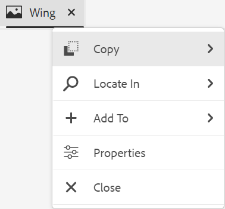
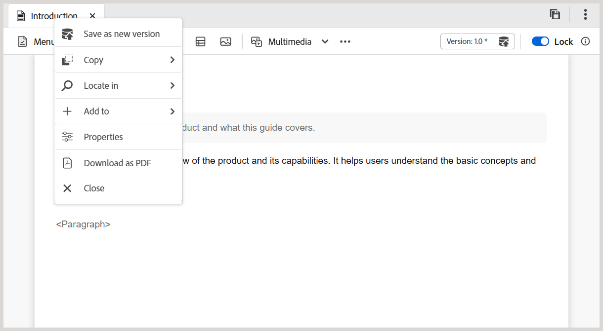
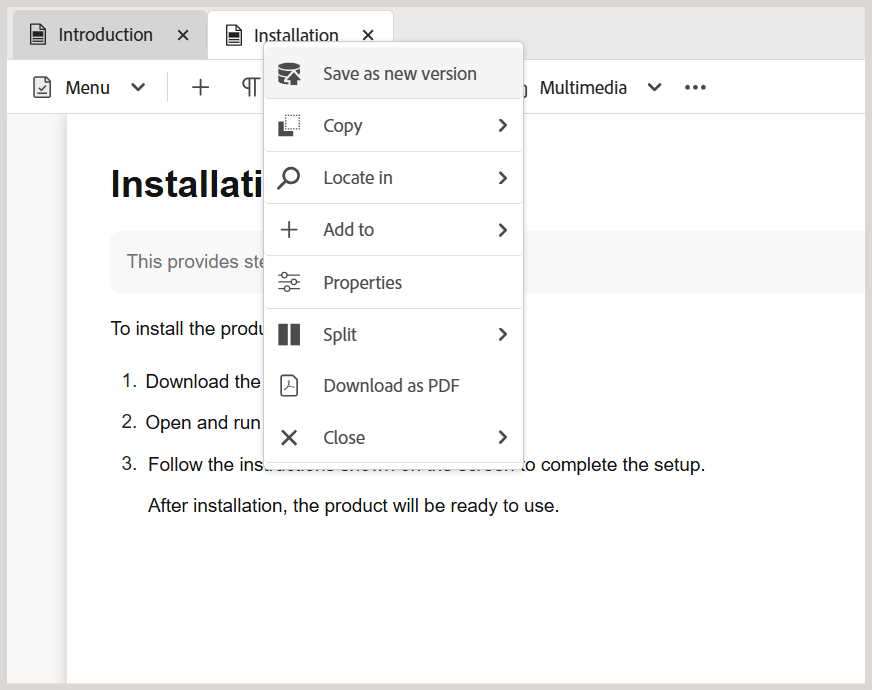
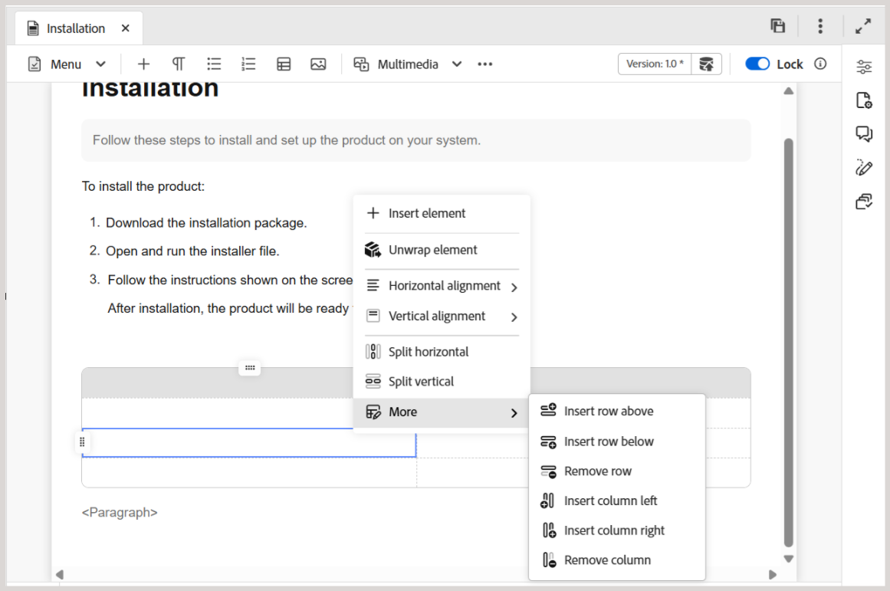
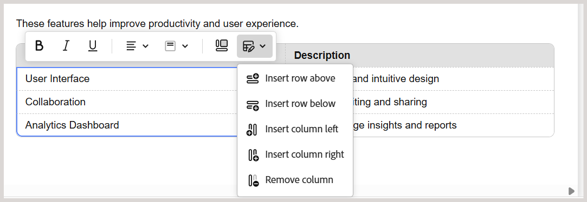
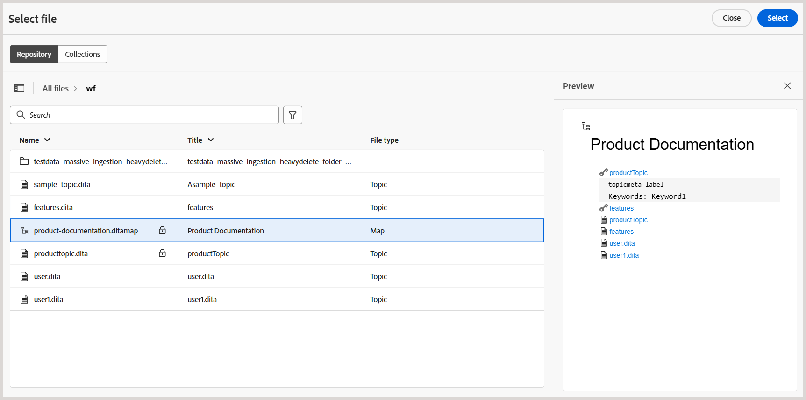
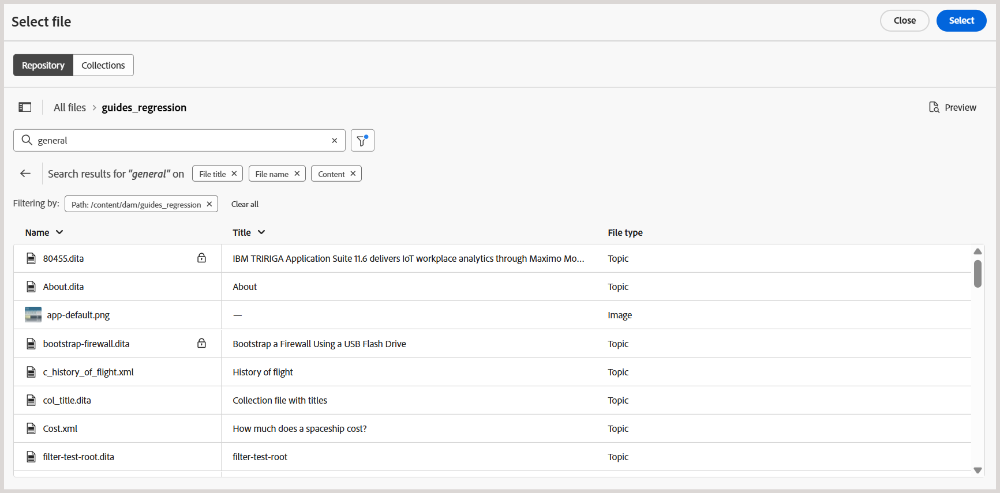
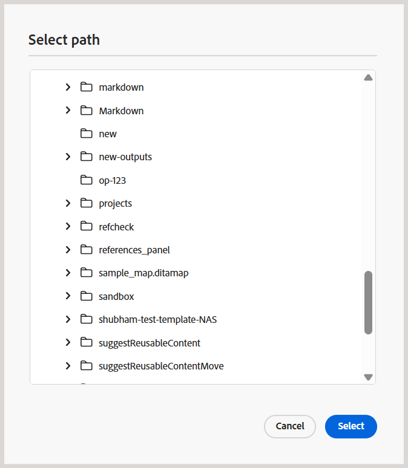
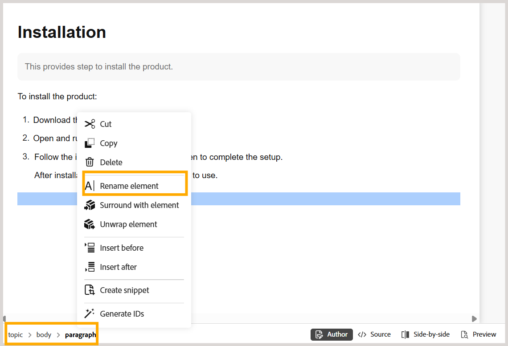

# Fonctionnalités supplémentaires de l’éditeur {#id2056B0B0YPF}

L’éditeur comporte d’autres fonctionnalités utiles que vous pouvez utiliser :

## Fonctions du menu contextuel dans l’onglet d’un fichier

Lorsque vous ouvrez un fichier dans l’éditeur, vous pouvez effectuer différentes actions à partir du menu contextuel. Vous pouvez afficher différentes options selon que vous ouvrez un fichier multimédia, un fichier DITA unique ou plusieurs fichiers.

**Fichier multimédia**

Les fonctions suivantes sont disponibles dans le menu contextuel de l’onglet d’un fichier multimédia ouvert :

{width="300"}

**Fichier DITA unique**

Le menu contextuel de l’onglet d’un fichier ouvert contient les fonctions suivantes :

>[!BEGINTABS]

>[!TAB Nouvel éditeur]

{width="400"}

>[!TAB Ancien éditeur]

{width="400"}

>[!ENDTABS]

**Plusieurs fichiers**

Lorsque plusieurs fichiers sont ouverts, le menu contextuel propose d’autres options :

>[!BEGINTABS]

>[!TAB Nouvel éditeur]

{width="550"}

>[!TAB Ancien éditeur]

{width="550"}

>[!ENDTABS]

Les différentes options du menu contextuel sont expliquées ci-dessous :

***Enregistrer*** : vous pouvez choisir parmi les options suivantes :

- **Enregistrer** : pour enregistrer un fichier sans créer de nouvelle version, sélectionnez **Enregistrer**. Chaque fois que vous créez une rubrique, une copie de travail sans version de la rubrique est créée dans la gestion des ressources numériques. L’enregistrement de votre document met à jour la copie de travail de votre document dans la gestion des ressources numériques. Un simple enregistrement sur cette version ne crée pas de nouvelle version d’une rubrique. Si votre rubrique est en cours de révision, l&#39;enregistrement d&#39;une rubrique ne permet pas à vos réviseurs d&#39;accéder au contenu de la rubrique modifiée.

- **Enregistrer tout** : si plusieurs documents sont ouverts dans l’éditeur, vous avez également la possibilité d’**Enregistrer tout** les documents ouverts.

***Enregistrer Comme Nouvelle Version***

Pour créer une nouvelle version du fichier, sélectionnez **Enregistrer comme nouvelle version**. Pour plus d’informations sur **Enregistrer** et **Enregistrer en tant que nouvelle version**, consultez la section [Barre d’outils dans l’éditeur](web-editor-toolbar.md).

***Copier*** : vous pouvez choisir parmi les options suivantes :

- **Copier l’UUID** : pour copier l’UUID du fichier actif dans le Presse-papiers, sélectionnez **Copier \> Copier l’UUID**.
- **Copier le chemin** : pour copier dans le presse-papiers le chemin d’accès complet du fichier actif, sélectionnez **Copier \> Copier le chemin**.

***Localiser dans*** : vous pouvez choisir parmi les options suivantes :

- **Mappage** : si vous avez ouvert un plan DITA volumineux et que vous souhaitez trouver l&#39;emplacement exact d&#39;un fichier dans le plan, sélectionnez **Localiser dans \> Mappage**. Lorsque vous sélectionnez l’option Localiser dans le mappage , le fichier \(d’où l’option est appelée\) est situé et mis en surbrillance dans la hiérarchie du mappage. Pour pouvoir utiliser cette fonctionnalité, vous devez ouvrir le fichier de mappage dans l’éditeur. Si la vue de carte est masquée, l’appel de cette fonction affiche la vue de carte et le fichier est mis en surbrillance dans la hiérarchie de carte.

- **Explorateur** : tout comme Localiser dans Map, le **Localiser dans l’explorateur \>** indique l’emplacement du fichier dans l’explorateur \(ou DAM\). La vue Explorateur s’ouvre et le fichier sélectionné est mis en surbrillance dans l’Explorateur. Si le fichier se trouve dans un dossier, ce dossier est développé pour afficher l’emplacement du fichier sélectionné dans l’Explorateur.

  >[!NOTE]
  >
  >À partir de la version 2025.11.0 pour Cloud Service et de la version 5.2 pour On-Premise, **Repository** est renommé **Explorer**. Pour la configuration On-Premise antérieure à la version 5.2, elle reste disponible en tant que référentiel.

***Ajouter à*** : vous pouvez choisir parmi les options suivantes :

- **Collections** : pour ajouter le fichier sélectionné aux collections, sélectionnez **Ajouter aux \> collections**. Pour plus d’informations, consultez la description de la fonctionnalité **Collections** dans la section [Panneau de gauche](web-editor-left-panel.md).

- **Contenu réutilisable** : pour copier le fichier sélectionné dans la liste de contenu réutilisable, sélectionnez **Ajouter à \> Contenu réutilisable**. Pour plus d’informations, consultez la description de la fonctionnalité **Contenu réutilisable** dans la section [Panneau de gauche](web-editor-left-panel.md).

***Propriétés***

Pour afficher la page des propriétés AEM du fichier sélectionné, sélectionnez **Propriétés**.

***Fractionner*** : vous pouvez choisir parmi les options suivantes :

**Haut, Bas, Gauche ou Droite**

Par défaut, l’éditeur vous permet d’afficher une rubrique à la fois. Il peut y avoir des cas où vous souhaitez afficher plusieurs sujets en même temps. Le fractionnement de l’écran de l’éditeur vous permet d’afficher plusieurs rubriques en même temps. Par exemple, si vous avez deux rubriques : A et B ouvertes dans l’éditeur. Cliquez avec le bouton droit sur la rubrique B et choisissez **Fractionner \> vers le haut** pour diviser la fenêtre de l’éditeur en deux parties. La rubrique B est affichée dans la moitié supérieure et la rubrique A est affichée dans la moitié inférieure. De même, vous pouvez également fractionner l’écran horizontalement en sélectionnant **Fractionner \> à gauche** ou **Fractionner \> à droite**. Vous pouvez déplacer vos documents d&#39;un écran à l&#39;autre en faisant glisser l&#39;onglet Fichier et en le déposant sur l&#39;écran où vous souhaitez le placer. De même, vous pouvez réorganiser les onglets de fichiers en les faisant glisser et en les déplaçant selon vos préférences.

<!--

***Quick Generate***

Generate the output for the selected file. Output can be generated only for files that are a part of an output preset. For more details, view [Article-based publishing from the Web Editor](web-editor-article-publishing.md#id218CK0U019I).

-->

***Fermer*** : vous pouvez choisir parmi les options suivantes :

**Fermer**, **Fermer les autres** ou **Tout fermer**

Pour fermer le fichier à partir duquel vous avez appelé le menu contextuel, sélectionnez **Fermer \> Fermer**. Utilisez **Fermer \> Fermer les autres** pour fermer tous les autres fichiers ouverts, à l’exception du fichier actif. Pour fermer tous les fichiers ouverts, sélectionnez l’option **Fermer \> Fermer tout** dans le menu contextuel. Vous pouvez également choisir de fermer l’éditeur. Si votre session contient des fichiers non enregistrés, vous êtes invité à les enregistrer.

**Fermer un fichier et enregistrer des scénarios**

Lorsque vous tentez de fermer un fichier ouvert dans l’éditeur à l’aide du bouton **Fermer** de l’onglet du fichier ou de l’option **Fermer** du menu Options, Experience Manager Guides vous invite à enregistrer vos modifications et à déverrouiller un fichier verrouillé.

Les invites sont basées sur les configurations suivantes sélectionnées par votre administrateur :

- **Demander le déverrouillage à la fermeture :** vous avez la possibilité de déverrouiller le fichier \(que vous avez verrouillé\) lorsque vous fermez l’éditeur.
- **Demander la nouvelle version à la fermeture** : l’option permettant d’enregistrer le fichier \(que vous avez modifié\) en tant que nouvelle version s’affiche à la fermeture de l’éditeur.

Votre expérience d’enregistrement de fichier dépend des trois scénarios suivants, dans lesquels vous disposez des éléments suivants :

- Aucune modification n’a été apportée au contenu.
- Modifiez le contenu et enregistrez les modifications.
- A modifié le contenu mais n’a pas enregistré les modifications.

Vous pouvez afficher les options suivantes selon que le fichier est verrouillé/déverrouillé et qu’il contient des modifications enregistrées ou non :

- **Déverrouiller et fermer** : le verrouillage du fichier est désactivé et le fichier est fermé.
- **Enregistrer en tant que nouvelle version** : les modifications que vous avez apportées à votre contenu seront enregistrées et une nouvelle version de votre fichier sera créée. Vous pouvez également ajouter des libellés et des commentaires pour la version nouvellement enregistrée. Pour plus d’informations sur l’enregistrement d’une nouvelle version, voir [Enregistrer en tant que nouvelle version](web-editor-toolbar.md#version-information-and-save-as-new-version).

- **Déverrouiller le fichier** : si vous choisissez de déverrouiller un fichier, le verrouillage sera relâché et les modifications seront enregistrées dans la version actuelle du fichier.

  >[!NOTE]
  >
  > Si vous désélectionnez l’option pour déverrouiller le fichier, vous obtenez également une option pour fermer le fichier sans enregistrer les modifications.

  Par exemple, l’une des invites est affichée dans la capture d’écran suivante :

  {width="400"}

**Repères visuels pour les références rompues**

Si votre rubrique contient des références croisées ou des références de contenu rompues, elles s&#39;affichent en rouge.

**Copie-collage intelligent**

Vous pouvez facilement copier et coller du contenu dans et entre des rubriques. La structure de l’élément source est conservée au niveau de la destination. En outre, si le contenu copié contient des références de contenu, même celles-ci sont copiées.

**Mémoriser le dernier emplacement parcouru**

L’éditeur fournit une boîte de dialogue de navigation dynamique dans les fichiers. L’éditeur mémorise le dernier emplacement utilisé lors de l’insertion d’une référence ou d’un contenu. La première fois que vous appelez la boîte de dialogue de recherche de fichier \(via Insérer une référence ou Insérer réutiliser le contenu\), vous accédez à l’emplacement où le document actif est enregistré. Au cours de la même session, si vous essayez d’insérer une autre référence, la boîte de dialogue de recherche de fichier permet d’accéder automatiquement à l’emplacement à partir duquel vous avez inséré la dernière référence.

>[!NOTE]
>
> Dans le cas d’un fichier image, audio ou vidéo, la boîte de dialogue de recherche de fichier correspond par défaut à l’emplacement du fichier et non au dernier emplacement utilisé.

## Utilisation des tableaux dans le nouvel éditeur

Le nouvel éditeur vous permet de créer, de mettre en forme et d’organiser des tableaux directement dans votre contenu à l’aide de diverses actions contextuelles. Regardez cette courte vidéo sur l’utilisation des différentes fonctionnalités d’édition de tableau disponibles dans le nouvel éditeur.

>[!VIDEO](https://video.tv.adobe.com/v/3491344)

Les fonctionnalités d&#39;édition de tableau suivantes sont disponibles dans le nouvel éditeur :

**Modifiez le tableau à l’aide du menu contextuel**

Le menu contextuel s’affiche lorsque vous cliquez avec le bouton droit de la souris dans une cellule de tableau. Les options suivantes sont disponibles en fonction du type de tableau que vous utilisez.

{width="550"}

- Insérer des lignes, colonnes ou cellules

- Fractionner les cellules horizontalement ou verticalement (non disponible pour les tableaux simples)

- Fusionner les cellules vers la droite ou vers le bas (non disponible pour les tableaux simples)

- Supprimer des lignes ou des colonnes

**Définir la mise en forme et l’alignement du texte à l’aide de la barre d’outils contextuelle**

La barre d’outils contextuelle s’affiche lorsque vous sélectionnez du contenu ou des cellules dans un tableau. La barre d’outils fournit des options pertinentes pour votre sélection.

- Sélectionnez le contenu de la cellule pour accéder aux options de formatage suivantes :

  {width="550"}

  Utilisez les options Gras, Italique ou Souligné pour mettre en forme votre texte.
- Pour accéder à la barre d’outils contextuelle d’une seule cellule, utilisez `Ctrl+click` pour Windows et `Command+click` pour macOS.

  {width="550"}

- De même, vous pouvez également sélectionner plusieurs cellules et utiliser la barre d’outils contextuelle pour leur appliquer simultanément une mise en forme et un alignement du texte.

  Options disponibles pour la sélection d’une ou de plusieurs lignes :

  {width="550"}

   - Alignement horizontal du texte (non disponible pour les tableaux simples)
   - Alignement vertical du texte (non disponible pour les tableaux simples)
   - Insérer une ligne au-dessus
   - Insérer une ligne ci-dessous
   - Supprimer une ligne
   - Fusionner les cellules (non disponible pour les tableaux simples)

  Options disponibles pour la sélection d’une ou de plusieurs colonnes :

  {width="550"}

   - Alignement horizontal du texte (non disponible pour les tableaux simples)
   - Alignement vertical du texte (non disponible pour les tableaux simples)
   - Insérer une ligne au-dessus
   - Insérer une ligne ci-dessous
   - Supprimer une ligne
   - Insérer une colonne ci-dessus
   - Insérer une colonne ci-dessous
   - Supprimer la colonne
   - Fusionner les cellules (non disponible pour les tableaux simples)

- Sélectionnez le tableau pour appliquer une mise en forme de texte et un alignement à l’ensemble du tableau.

  {width="550"}

- Ajouter des lignes ou des colonnes à l’aide d’un bouton plus interactif

  Pour ajouter une nouvelle ligne à la fin du tableau, passez la souris sur la dernière ligne et sélectionnez le bouton **+**. Une nouvelle ligne est ajoutée au bas du tableau.

  {width="550"}

  De même, passez la souris sur la dernière colonne et sélectionnez le bouton **+** pour ajouter une nouvelle colonne au côté le plus à droite du tableau.

  {width="550"}

- Ajouter plusieurs lignes ou colonnes à un tableau à l&#39;aide des options Insérer (non disponible pour les tableaux simples)

  Pour ajouter plusieurs lignes ou colonnes à un tableau, sélectionnez d&#39;abord le nombre de lignes ou de colonnes à ajouter, puis sélectionnez l&#39;option Insérer une ligne (ci-dessus ou ci-dessous) ou Insérer une colonne (à gauche ou à droite). Le même nombre de lignes ou de colonnes est ajouté au tableau en fonction de votre sélection.

- Glisser-déposer des lignes et des colonnes (non disponible pour les tableaux simples)

  Déplacez facilement les lignes et les colonnes du tableau par glisser-déposer. Lorsque vous faites glisser une ligne ou une colonne, elle s’affiche avec un arrière-plan semi-transparent pour indiquer qu’elle est en cours de déplacement. Une ligne bleue met en surbrillance la position cible où la ligne ou la colonne sera placée au moment de la libération.

  {width="550"}

## Parcourir les fichiers et les dossiers dans Experience Manager Guides

Experience Manager Guides propose des boîtes de dialogue intuitives (**Sélectionner un fichier** et **Sélectionner un chemin d’accès**) pour vous aider à parcourir et à sélectionner efficacement des fichiers ou des dossiers dans le référentiel de contenu.

>[!NOTE]
>
> L’explorateur de chemins d’accès aux fichiers et aux dossiers a été intégré à une nouvelle interface utilisateur dans la version 2601 de Experience Manager Guides as a Cloud Service. La nouvelle interface est activée par défaut. Si vous préférez continuer à utiliser l’interface utilisateur existante sans ces mises à jour, contactez votre équipe du succès client pour que cette nouvelle amélioration soit désactivée.

### Parcourir les fichiers dans Experience Manager Guides

L’explorateur de chemins d’accès aux fichiers vous permet de localiser et de sélectionner rapidement des fichiers spécifiques dans le référentiel de contenu. Cette fonctionnalité est disponible pour des tâches telles que l’ajout d’une rubrique à une carte, la liaison d’une image ou d’une référence croisée, la création de contenu réutilisable, etc.

{width="350"}

Lorsque vous lancez l’explorateur de fichiers, la boîte de dialogue **Sélectionner un fichier** s’ouvre. Cette boîte de dialogue comprend deux onglets : **Référentiel** et **Collections**. Par défaut, l’onglet Référentiel est sélectionné.

{width="650"}

**Fonctionnalités disponibles dans l’onglet Référentiel pour l’exploration des fichiers**

**Vue tabulaire des fichiers et des dossiers**

L’onglet Référentiel vous fournit une vue tabulaire des fichiers et des dossiers du référentiel de contenu, ce qui facilite la recherche du chemin d’accès au fichier approprié. Vous pouvez également utiliser les chemins de navigation en haut et le panneau de navigation des dossiers à gauche pour vous déplacer dans les dossiers.

{width="650"}

**Sélection de fichiers uniques et multiples**

Pour utiliser un fichier, sélectionnez-le simplement et choisissez **Sélectionner**.

{width="650"}

Dans certains cas, vous pouvez également sélectionner plusieurs fichiers à partir de cette boîte de dialogue de l’explorateur de chemins d’accès. Par exemple, lors de l’exploration de fichiers à la recherche de contenu réutilisable, vous pouvez sélectionner plusieurs fichiers et les intégrer à votre contenu réutilisable.

{width="650"}

La sélection de plusieurs fichiers est actuellement disponible pour le contenu réutilisable, les références de rubrique, le schéma, les paramètres prédéfinis de sortie (à l’aide de DITAVAL) et Workfront.

>[!NOTE]
>
> Lors de la sélection de fichiers dans la boîte de dialogue de l’explorateur de chemins d’accès, certains dossiers peuvent sembler désactivés. Ce comportement limite l’accès à des types de fichiers spécifiques pour garantir des sélections valides. Par exemple, lors de la création de contenu réutilisable, seuls les fichiers de rubrique et de mappage doivent être utilisés. Pour empêcher l’utilisation d’un type de fichier non valide, tel qu’une image, les fichiers correspondants ne s’affichent pas ou restent désactivés pour la sélection dans l’explorateur de chemins d’accès.

**Prévisualiser les fichiers sélectionnés**

Vous pouvez prévisualiser les fichiers sélectionnés à l&#39;aide du bouton **Aperçu**, comme dans l&#39;exemple ci-dessous :

{width="650"}

L’aperçu du fichier sélectionné s’affiche à droite.

{width="650"}

Pour plusieurs sélections, un aperçu de tous les fichiers sélectionnés s’affiche dans le panneau Aperçu pour une révision facile.

{width="650"}

Vous pouvez également utiliser l’icône **Supprimer** pour désélectionner certains fichiers de l’aperçu.

{width="650"}

**Rechercher et filtrer l’expérience**

Lorsque vous parcourez des fichiers dans le référentiel, vous pouvez rechercher des fichiers par nom, titre ou contenu dans le chemin d’accès sélectionné. Vous pouvez utiliser n’importe quel critère de recherche, deux ou les trois. Si aucun des critères n’est sélectionné, les résultats incluront les critères communs aux trois critères.

{width="650"}

Sélectionnez l’icône **Filtrer la recherche** \(\) pour ouvrir le panneau Filtre à droite.

Vous disposez des options suivantes pour filtrer les fichiers et affiner votre recherche :

- **Rechercher dans** : sélectionnez le chemin d’accès où vous souhaitez rechercher les fichiers présents dans le référentiel.

- **Type de fichier** : filtrez votre recherche en fonction d’un type de fichier spécifique. Les options disponibles sont les suivantes : **Rubrique**, **Carte**, **DITAVAL**, **Image**, **Multimédia**, **Document** et **Autres**.

  >[!NOTE]
  >
  > Dans certains cas, le filtre **Type de fichier** est pré-appliqué sur des types de fichiers spécifiques en fonction de la tâche et ne peut pas être modifié. Par exemple, lorsque vous recherchez une image, le filtre est défini pour afficher uniquement les fichiers image et lors de la création de contenu réutilisable, il est défini pour afficher uniquement les fichiers de rubrique et de mappage. Vous pouvez toujours ajuster d’autres filtres tels que l’état du document, les balises ou la date de dernière modification pour affiner vos résultats de recherche.

- **État du document** : vous pouvez filtrer votre recherche en fonction de l’état actuel du document des fichiers. Les valeurs de filtre disponibles sont définies dans le champ `repositoryFilters` de la `ui_config.json file` et sont associées au profil de dossier que vous utilisez actuellement.

  Cela signifie ce qui suit :

   - Si vous utilisez le profil global, les valeurs des filtres configurées dans le profil global sont appliquées.
   - Si vous sélectionnez un profil de dossier spécifique, les valeurs des filtres définies dans ce profil sont récupérées.

  Les valeurs de filtre par défaut disponibles pour l’état du document sont les suivantes : Brouillon, Modifier, En cours de révision, Approuvé, Révisé et Terminé. Pour plus d’informations sur la personnalisation des valeurs de filtre pour les états du document, voir [Configurer des filtres d’état du document](../cs-install-guide/config-doc-state-filters.md).

- **Verrouillé par** : affiche une liste d’utilisateurs. La liste est paginée et se charge de manière asynchrone, affichant un ensemble limité d’utilisateurs à la fois et en récupérant d’autres au fur et à mesure que vous faites défiler ou naviguez. Cela améliore la vitesse de chargement et les performances globales, en particulier lorsque vous travaillez avec un grand nombre d’utilisateurs.

- **Dernière modification** : filtrez le contenu en fonction de la date de modification. Sélectionnez une période dans le calendrier ou choisissez l’une des options de période suivantes :
   - La semaine dernière
   - Le mois dernier
   - L&#39;année dernière

- **Balises** : filtrez le contenu en fonction des balises.

- **Éléments DITA** : filtrez le contenu en fonction de divers éléments DITA.

Après avoir appliqué tous les filtres requis, sélectionnez **Appliquer** dans le coin inférieur droit du panneau Filtres.

**Fonctionnalités disponibles dans l’onglet Collections pour l’exploration des fichiers**

L’onglet **Collections** fournit une vue organisée des fichiers disponibles dans vos collections pour un accès rapide et une réutilisation. Contrairement à l’onglet Référentiel , qui affiche la hiérarchie complète des dossiers, les collections vous permettent de sélectionner les rubriques, mappages et images fréquemment utilisés sans devoir parcourir plusieurs dossiers.

Dans l’onglet Collections , vous pouvez :

- Utilisez les chemins de navigation en haut et le panneau de navigation des dossiers à droite pour parcourir facilement vos collections.

  
- Sélectionnez les fichiers présents dans un chemin d’accès aux collections spécifique et prévisualisez-le dans le panneau de droite.

  

### Dossiers du navigateur dans le référentiel

La navigation dans les dossiers à l’aide de la boîte de dialogue **Sélectionner un dossier** se concentre sur la sélection du chemin de dossier approprié dans le référentiel pour des tâches telles que la création de rubriques ou la spécification des emplacements de sortie pour le contenu publié. Il offre une vue claire et arborescente des dossiers, ce qui rend la navigation intuitive et garantit que le contenu est placé au bon endroit.

{width="300"}

## Prise en charge de la publication d’articles

Dans l&#39;éditeur, vous pouvez générer la sortie pour une ou plusieurs rubriques ou l&#39;ensemble du plan DITA. Vous devez créer des paramètres prédéfinis de sortie pour votre plan DITA, puis vous pouvez facilement générer la sortie pour une ou plusieurs rubriques. Si vous avez mis à jour quelques rubriques dans votre carte, vous pouvez également générer la sortie uniquement pour ces rubriques à partir de l’éditeur. Pour plus d’informations, consultez la section [Publication basée sur des articles](web-editor-article-publishing.md#id218CK0U019I).

## Prise en charge des documents Markdown

L&#39;éditeur vous permet d&#39;utiliser les documents Markdown \(.md\) avec vos documents DITA. Vous pouvez facilement créer et prévisualiser un document Markdown dans l&#39;éditeur et l&#39;ajouter dans votre fichier map via l&#39;éditeur de map DITA. Pour plus d’informations, consultez [Créer des documents Markdown à partir de l’éditeur](web-editor-markdown-topic.md#).

## Prise en charge du terme de glossaire DITA

L&#39;éditeur prend en charge les termes du glossaire DITA que vous pouvez insérer en ajoutant des éléments `term` ou `abbreviated-form`.

## Utiliser les équations de MathML

### Insérer des équations MathML

Experience Manager Guides vous offre une prise en charge prête à l’emploi pour insérer des équations MathML par intégration à l’application [MathType Web](https://docs.wiris.com/en/mathtype/mathtype_web/intro). Pour insérer une équation MathML, sélectionnez l’icône **Élément** et saisissez mathml. Lorsque vous sélectionnez l’élément mathml dans la liste, la boîte de dialogue **Insérer un MathML** s’affiche :

{width="550"}

À l&#39;aide des outils d&#39;équation de MathML, créez votre équation et sélectionnez **Insérer** pour l&#39;ajouter à votre document. L&#39;équation est insérée avec un arrière-plan gris clair.

Vous pouvez à tout moment mettre à jour une équation en cliquant avec le bouton droit de la souris sur une équation existante et en sélectionnant **Modifier MathML** dans le menu contextuel.

### Validation des équations dans l’éditeur de MathML

Experience Manager Guides valide les équations de MathML lorsque vous enregistrez une rubrique qui les contient.
Lorsque vous insérez une équation à l’aide de l’éditeur MathML, Experience Manager Guides met l’équation en surbrillance rouge en cas de problèmes de syntaxe. Vous pouvez le corriger avant de l’insérer. Si vous n&#39;apportez aucune modification, mais que vous sélectionnez **Insérer**, un avertissement s&#39;affiche.

{width="400"}

Si vous insérez l&#39;équation MathML qui contient une erreur de syntaxe, une erreur de validation se produit lorsque vous essayez d&#39;enregistrer la rubrique.

## Insérer des notes de bas de page

Insérez une note de bas de page dans votre contenu à l’aide de l’élément `fn`. En mode création, la valeur de la note de bas de page s’affiche en ligne avec le contenu. Cependant, lorsque vous basculez en mode Aperçu ou que vous publiez votre document, la note de bas de page s’affiche à la fin de la rubrique.

## Renommer ou remplacer un élément

L’éditeur affiche le chemin de navigation de l’élément en bas à gauche de la rubrique. Si vous souhaitez permuter ou remplacer un élément par un autre élément, vous pouvez le faire à partir du menu contextuel du chemin de navigation. Par exemple, vous pouvez permuter `p` élément avec `note` ou tout autre élément valide au niveau du contexte.

>[!BEGINTABS]

>[!TAB Nouvel éditeur]

{width="400"}

>[!TAB Ancien éditeur]

{width="400"}

>[!ENDTABS]

Dans le chemin de navigation, cliquez avec le bouton droit sur le nom d’un élément à remplacer, puis sélectionnez Renommer l’élément dans le menu contextuel. La boîte de dialogue Renommer l’élément affiche tous les éléments valides autorisés à l’emplacement actuel. Dans la boîte de dialogue Renommer l’élément , sélectionnez l’élément que vous souhaitez utiliser. L’élément d’origine est remplacé par le nouvel élément .

Outre le menu contextuel du chemin de navigation, la boîte de dialogue Renommer l’élément est également accessible à partir d’autres emplacements :

- Sélectionnez le nom de l’élément dans le chemin de navigation pour sélectionner le contenu de l’élément et cliquez avec le bouton droit sur le contenu sélectionné pour afficher le menu contextuel.

- Activez la vue Balises, sélectionnez la balise d’ouverture d’un élément, puis cliquez avec le bouton droit de la souris sur le contenu sélectionné pour afficher le menu contextuel.

- Vous pouvez accéder à la boîte de dialogue Renommer l’élément en appelant le menu Options d’un élément dans le panneau Plan.

## Habillage et débrouillage d’un élément

### Développer un élément

- Envelopper un élément permet d’ajouter une balise d’élément au texte sélectionné. Vous pouvez renvoyer le texte à la ligne sur n&#39;importe quel élément enfant en respectant les normes DITA. Par exemple, si vous avez du texte sous un élément `note`, vous pouvez encapsuler le texte dans un élément `p`.

- L’option **Développer** est disponible dans le menu contextuel du chemin de navigation de la rubrique. Pour encapsuler un élément, cliquez avec le bouton droit de la souris sur l’élément et ouvrez le menu contextuel. Sélectionnez l’élément dans la boîte de dialogue **Enrouler l’élément**. Le texte apparaît dans le nouvel élément.

- Vous pouvez également sélectionner le texte ou l’élément dans le contenu, puis sélectionner l’option **Enrouler l’élément** dans le menu contextuel.

### Déplier un élément

Déplier un élément vous permet de supprimer la balise d’élément du texte sélectionné et de le fusionner avec son élément parent. Par exemple, si vous disposez d’un élément `p` dans un élément `note`, vous pouvez déplier l’élément `p` pour fusionner le texte directement dans l’élément `note`. L’option **Déplier l’élément** est disponible dans le menu contextuel du chemin de navigation de la rubrique. Pour déplier un élément, cliquez avec le bouton droit de la souris sur l’élément pour ouvrir le menu contextuel, puis sélectionnez **Déplier l’élément** pour supprimer l’élément et fusionner le texte de l’élément avec son élément parent.

## Gestion des espaces pour les éléments DITA

Dans le langage XML, les espaces comprennent les espaces, les tabulations, les retours à la ligne et les lignes vides. Experience Manager Guides convertit plusieurs espaces blancs conséquents en un seul espace. Cela permet de conserver la vue WYSIWYG de l’éditeur.

>[!NOTE]
>
> Dans certains éléments où les espaces blancs doivent être conservés conformément aux règles DITA, les multiples espaces blancs qui en résultent sont conservés. Par exemple, les éléments `<pre>` et `<codeblock>`.

## Conserver les sauts de ligne et la mise en retrait

Les éléments DITA contenant des sauts de ligne et des espaces sont pris en charge et rendus conformément à leur définition dans les modes Auteur, Source ou Aperçu, ainsi que dans la sortie publiée finale. La capture d’écran suivante montre le contenu de l’élément `msgblock` dans lequel les sauts de ligne et les espaces \(retrait\) ont été conservés :

## Gestion des espaces insécables dans l’éditeur

- Vous pouvez insérer des espaces insécables dans votre document à l&#39;aide de l&#39;icône de  **Symobol** ou des touches de raccourci **Alt** + **Space**.  Ces espaces insécables s’affichent en tant qu’indicateurs lorsque vous modifiez une rubrique dans l’éditeur. Vous pouvez désactiver l’affichage des espaces insécables à l’aide de l’option **Afficher l’espace insécable en mode création** de l’onglet **Apparence** des [Préférences utilisateur](./intro-home-page.md#user-preferences).

- Si vous copiez et collez du contenu avec un espace insécable à partir de sources externes dans la vue **Auteur**, l’espace insécable est converti en espace.
Cependant, si vous copiez et collez du contenu avec un espace insécable à partir de la vue **Auteur**, il est conservé.

## Générer automatiquement l’identifiant de l’élément

Vous pouvez générer automatiquement des identifiants pour les éléments de votre rubrique DITA. Ces identifiants sont uniques dans une rubrique DITA. Par exemple, si vous générez des identifiants pour un élément de paragraphe, les identifiants seront p\_1, p2, p\_3, etc. Vous pouvez sélectionner plusieurs éléments et générer des identifiants pour chaque élément sélectionné.

Procédez comme suit pour générer automatiquement un identifiant pour un ou plusieurs éléments :

1. Ouvrez la rubrique dans l’éditeur.
1. Sélectionnez le contenu auquel vous souhaitez attribuer des identifiants.
1. Cliquez avec le bouton droit et sélectionnez **Générer des identifiants** dans le menu contextuel.

Vous pouvez également cliquer avec le bouton droit dans le chemin de navigation et sélectionner **Générer des identifiants**.

## Identification des ID en double pour les éléments d’une carte ou d’une rubrique dans la vue de création

Si une rubrique ou un mappage donné contient des éléments avec des identifiants en double, un bouton **Dupliquer les identifiants** s’affiche dans le coin inférieur droit de la zone de modification de contenu à côté des vues de l’éditeur.

{width="350"}

La sélection de **ID en double** ouvre une fenêtre contextuelle répertoriant tous les ID en double. Vous pouvez sélectionner l’identifiant affiché dans la fenêtre contextuelle pour accéder à l’élément correspondant et le mettre à jour avec un identifiant unique.

>[!NOTE]
>
> Le bouton **Dupliquer les identifiants** est disponible uniquement dans la vue **Auteur** et des identifiants d’élément similaires sont autorisés pour différentes rubriques imbriquées.

## Gestion des fichiers volumineux dans l’éditeur

>[!NOTE]
>
> Cette section s’applique uniquement à l’ancien éditeur. Grâce au nouvel éditeur, l’expérience de modification des sujets volumineux et complexes est améliorée grâce à un chargement plus rapide et à des interactions plus réactives, ainsi qu’à la prise en charge de l’annulation/la restauration et du marqueur d’intégrité.

Les principales fonctionnalités visant à améliorer la gestion des fichiers volumineux sont mentionnées comme suit :

- Pour améliorer les performances, certaines fonctionnalités telles que Annuler, Rétablir, le panneau de contour et la marque d’intégrité sont désactivées. Il est recommandé de diviser les rubriques en rubriques plus petites pour une expérience optimale.

- Un message d’alerte s’affiche en haut pour les fichiers volumineux, comme illustré dans le fragment de code ci-dessous. Cette alerte met en surbrillance le nombre d’éléments en fonction de la valeur spécifiée dans le paramètre **largeFileTagCount** du fichier uiconfig.json. Par défaut, la valeur de **largeFileTagCount** est 2 500.

  >[!NOTE]
  >
  > Ce message d’alerte s’applique uniquement à l’ancien éditeur, où il s’affiche en fonction du paramètre `largeFileTagCount` configuré. Dans le nouvel éditeur, les fichiers volumineux se chargent en toute simplicité sans déclencher d’alertes. En outre, les fonctionnalités connexes qui ne fonctionnent pas dans l’ancien éditeur fonctionnent normalement dans le nouvel éditeur.

{width="600"}

- En outre, le nombre de balises s’affiche dans la barre inférieure de l’interface. Lorsque vous passez la souris sur cette valeur de nombre de balises, une info-bulle s’affiche. Sélectionnez l’onglet **En savoir plus** pour plus d’informations sur la gestion des fichiers volumineux.

{width="600"}

- Le message d&#39;alerte est disponible uniquement pour les fichiers DITA et est visible dans tous les modes : Auteur, Source et Disposition.

**Rubrique parente :**&#x200B;[&#x200B; Présentation de l’éditeur](web-editor.md)
