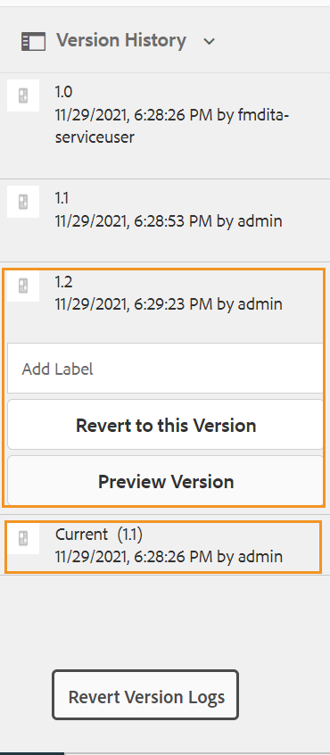
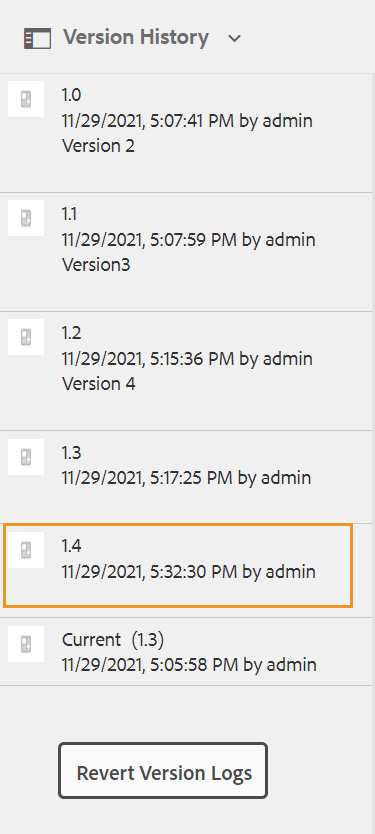

# Aperçu d’une rubrique {#id1696II000QR}

Une fois une rubrique créée, AEM Guides génère un aperçu de la rubrique. Le mode Aperçu fournit différentes fonctionnalités que vous pouvez utiliser pour travailler avec votre document.

Pour prévisualiser une rubrique, procédez comme suit :

1. Dans l’interface utilisateur d’Assets, accédez à la rubrique que vous souhaitez afficher.
1. Cliquez sur la rubrique que vous souhaitez afficher.

   Un aperçu de la rubrique s’affiche dans l’interface utilisateur d’Assets.

   >[!NOTE]
   >
   > Vous pouvez voir la version de la rubrique active ou du mappage DITA dans le coin supérieur droit de l’onglet Fichier de la rubrique.

   >[!IMPORTANT]
   >
   > Le positionnement des fonctionnalités suivantes dans la barre d’outils Aperçu peut varier en fonction de la configuration de votre serveur AEM. Certaines fonctionnalités peuvent être disponibles dans la barre d’outils principale, tandis que d’autres peuvent être disponibles sous le menu Plus .

## Fonctions disponibles en mode Aperçu

{width="800" align="left"}

Vous pouvez effectuer les opérations suivantes à partir de la barre d’outils en mode aperçu :

**Propriétés**

Afficher les propriétés de la rubrique sélectionnée. En fonction de votre version d’AEM, vous pouvez voir des propriétés telles que les métadonnées, l’activation de la planification \(de\), les références, l’état du document, etc.

>[!NOTE]
>
> La propriété de titre d’une rubrique est automatiquement renseignée à partir de la balise `title` de la rubrique ou du mappage DITA. Si vous apportez une modification au titre à l’aide de la fenêtre des propriétés, cette modification est perdue. Si vous souhaitez mettre à jour la propriété de titre, vous devez le faire à l’aide de l’éditeur web.

La page Propriétés contient des informations utiles sur les références, telles que l’endroit où une carte ou une rubrique est utilisée ou les références contenues dans un document. La page Propriétés répertorie deux types de références pour un document : **Utilisé(e) dans** et **Références sortantes**.

Les références **Utilisé(e) dans** répertorient les documents dans lesquels le fichier actif est référencé ou utilisé. Les **Références sortantes** répertorient les documents référencés dans le document actif.

L’icône \(+\) de la section de références **Utilisé(e) dans** vous permet de naviguer plus haut pour trouver l’emplacement où cette rubrique est utilisée ou référencée.

{width="800" align="left"}

Cliquez sur l’icône  en regard d’un document pour afficher les fichiers de mappage ou de rubrique où ce document est référencé.

**Filtrage conditionnel \(A/B\)**

Si votre rubrique comporte du contenu conditionnel, l’icône A/B s’affiche dans la barre d’outils. Cliquez sur cette icône pour ouvrir une fenêtre contextuelle qui vous permet de filtrer le contenu selon les conditions disponibles dans la rubrique.

>[!NOTE]
>
> Le contenu conditionnel est mis en surbrillance à l’aide de la couleur d’arrière-plan claire dans l’éditeur web.

{width="300" align="left"}

**Modifier**

- Ouvrez la rubrique à modifier dans l’éditeur Web. L’option **Modifier** ne sera pas disponible si votre administrateur a activé l’option **Désactiver la modification sans extraction**. Lorsque l’option est activée, l’option **Modifier** s’affiche uniquement après l’extraction d’un fichier de rubrique.

**Résolution de clé**

- Si vous souhaitez utiliser un fichier d’espace de clés pour la rubrique, cliquez sur l’icône Résolution des clés . Vous pouvez ensuite choisir un espace clé dans la fenêtre contextuelle Résolution de la clé .

**Source**

- Ouvrez le code source XML d’un fichier. Vous pouvez afficher le code XML sous-jacent d’un fichier map, topic ou DITAVAL en ouvrant le fichier en mode Aperçu et en cliquant sur l’icône Source . La fenêtre contextuelle Source XML affiche le code source XML. Vous pouvez sélectionner un code spécifique dans le fichier ou appuyer sur `Ctrl`+`a` pour sélectionner tout le contenu.

  >[!NOTE]
  >
  > Pour obtenir l’affichage du code source d’un fichier de mappage DITA, sélectionnez le fichier dans l’interface utilisateur d’Assets, puis cliquez sur Source.

  {width="800" align="left"}

**Partager le lien UID**

- AEM Guides vous permet de partager les liens basés sur l’UUID pour les mappages DITA, les rubriques et les fichiers image à partir des emplacements suivants :

   - Interface utilisateur d’Assets
   - Console de la carte DITA
   - Aperçu de la rubrique ou de l’image

Une nouvelle option **Partager le lien UUID** s’affiche dans la barre d’outils des zones mentionnées ci-dessus. La capture d’écran suivante montre l’option **Partager le lien UUID** en mode Aperçu d’une rubrique :

{width="800" align="left"}

Dans l’interface utilisateur d’Asset, cette option est visible lorsque vous sélectionnez un fichier. En mode Aperçu , cette option est disponible par défaut dans la barre d’outils principale. Dans une console de mappage DITA, cette option est visible dans la section Paramètres prédéfinis de sortie.

Une fois que vous avez copié l’URL, la même URL peut être partagée avec d’autres utilisateurs pour leur donner un accès direct au fichier. Ce lien reste valide même lorsque le fichier est déplacé vers un autre emplacement du référentiel. Le seul cas d’échec du lien est lorsque le fichier est supprimé du référentiel.

Si vous partagez le lien à partir de la console de mappage DITA ou du mode d’aperçu d’un fichier, l’utilisateur a consulté le même fichier. Cependant, lorsque vous partagez le lien d’un fichier de carte à partir de l’interface utilisateur d’Assets, l’utilisateur est dirigé vers la console de la carte. De même, pour un fichier de rubrique ou d’image, l’aperçu du fichier s’affiche.

>[!IMPORTANT]
>
> Le lien ne peut pas être utilisé comme lien de référence dans une autre rubrique, il donne uniquement un accès direct au fichier dans le référentiel. En outre, le lien reste valide tant que le fichier est disponible dans le référentiel. Même si le fichier est déplacé vers un autre emplacement du référentiel, le lien reste valide. Le lien échoue uniquement lorsque le fichier est supprimé du référentiel.

**Extraire/Archiver**

- Active/désactive les fonctionnalités d’extraction et d’archivage. Lorsqu’un fichier est extrait, l’utilisateur actuel obtient une autorisation d’écriture exclusive sur le fichier. Un fichier extrait peut être ouvert dans l’éditeur web pour modification. Une fois que vous avez apporté les modifications requises, cliquez sur l’icône Archiver pour enregistrer le fichier dans DAM.

Lorsque vous extrayez une rubrique, l’état du fichier s’affiche comme extrait en mode Carte et en mode Liste.

Extrait du fichier en mode Carte :

{width="300" align="left"}

Extrait du fichier en mode Liste :

{width="550" align="left"}

Si la colonne Extrait n’est pas visible, sélectionnez **Paramètres d’affichage** sous **Mode Liste** et sélectionnez l’état **Extraits** dans la boîte de dialogue **Configurer les colonnes**.

{width="800" align="left"}

>[!TIP]
>
> Voir la section Contrôle de version du contenu du guide des bonnes pratiques pour connaître les bonnes pratiques en matière d’extraction et d’archivage de fichiers.

**Différence de version web**

- Si votre rubrique a fait l’objet de modifications, vous pouvez facilement trouver les modifications apportées dans différentes versions de cette rubrique. Pour découvrir les modifications apportées à différentes versions d’une rubrique :

  >[!IMPORTANT]
  >
  > La méthode décrite dans la procédure suivante ne s’applique qu’aux fichiers DITA. Pour les fichiers autres que DITA, utilisez la vue Chronologie pour créer des versions ou restaurer une version existante d’un fichier.

   1. Ouvrez la rubrique en mode Aperçu .

   1. Dans le rail de gauche, cliquez sur **Historique de version** et sélectionnez une version.

      {width="800" align="left"}

   1. Dans les versions répertoriées, sélectionnez celle que vous souhaitez utiliser comme version de base et cliquez sur **Aperçu de la version**. L’aperçu de la version sélectionnée s’affiche dans la fenêtre Aperçu de la version .

   1. Dans la liste **Afficher l&#39;écart**, sélectionnez la version avec laquelle vous souhaitez comparer la version de base.

      {width="800" align="left"}

      Le contenu modifié est mis en surbrillance dans l’aperçu de la rubrique. Le contenu mis en surbrillance en vert indique que le contenu nouvellement ajouté est le contenu supprimé.

      {width="800" align="left"}

### Branchement, restauration et contrôle de version ultérieur {#id193PG0Y051X}

- Dans un environnement de création classique, vous devez créer une nouvelle branche d’une rubrique pour prendre en charge une version spécifique. Comme tout autre système de gestion de version, AEM Guides vous permet de créer une branche à partir d’une version existante d’une rubrique ou de revenir à une ancienne version d’une rubrique. Grâce aux fonctionnalités de gestion des versions proposées par AEM Guides, vous pouvez effectuer les tâches suivantes :

   - Création d’une branche à partir d’une version existante d’une rubrique
   - Création de versions ultérieures dans une nouvelle branche
   - Revenir à une version spécifique d’une rubrique

  L’illustration suivante présente l’embranchement type et le système de contrôle de version suivant :

  {width="550" align="center"}

  Pour toute nouvelle rubrique, la première version est numérotée 1.0. Par la suite, chaque nouvelle version de la rubrique est enregistrée avec un numéro incrémentiel tel que 1.1, 1.2, etc. Une fois que vous avez créé une branche d’une rubrique, une nouvelle branche prend le numéro de version à partir duquel la branche est créée et ajoute un 0 à la fin de la version. Comme le montre l’illustration, une nouvelle branche est créée à partir de la version 1.1 d’une rubrique. La nouvelle branche a la version 1.1.0. Par la suite, chaque fois que vous enregistrez une nouvelle version de la rubrique dans cette branche, elle obtient un numéro de version incrémentielle tel que 1.1.1, 1.1.2, etc.

  Comme pour l’embranchement, vous pouvez rétablir votre version actuelle ou opérationnelle sur n’importe quelle version du référentiel. Pour revenir à une version, sélectionnez simplement la version souhaitée de la rubrique et cliquez sur **Revenir à cette version** dans le panneau **Historique de version** .

  Pour créer une branche, revenir à une version et conserver les versions suivantes d’une rubrique, procédez comme suit :

  >[!IMPORTANT]
  >
  > La méthode décrite dans la procédure suivante ne s’applique qu’aux fichiers DITA. Pour les fichiers autres que DITA, utilisez la vue Chronologie pour créer des versions ou restaurer une version existante d’un fichier.

   1. Accédez à la rubrique dans l’interface utilisateur d’Assets.

      >[!NOTE]
      >
      > Vous pouvez également ouvrir la rubrique en mode Aperçu et passer à l’étape 3.

   1. Sélectionnez la rubrique pour laquelle vous souhaitez créer une branche.

   1. Dans le rail de gauche, cliquez sur **Historique de version**.

      >[!NOTE]
      >
      > Une liste des versions disponibles pour la rubrique sélectionnée s’affiche. Chaque version contient l’horodatage, le nom d’utilisateur, le commentaire de version et les informations [label](web-editor-use-label.md#).

   1. Sélectionnez une version à partir de laquelle vous souhaitez créer une branche. Dans la capture d’écran suivante, la version 1.2 est sélectionnée pour la création d’une branche.

      {width="300" align="left"}

      >[!NOTE]
      >
      > La version actuelle d’une rubrique contient *\(Current\)* mentionné en regard du numéro de version.

   1. Cliquez sur **Revenir à cette version**.

      Un message s’affiche vous demandant de confirmer la création d’une nouvelle branche.

   1. *\(Facultatif\)* Dans l’invite de message, vous avez la possibilité de sélectionner l’option **Enregistrer la copie de travail active comme nouvelle version**. Les deux actions suivantes sont possibles en fonction de la sélection de cette option :

      - Si vous sélectionnez cette option, une branche est créée à partir de la version 1.1. De plus, une nouvelle version de la rubrique est également créée à partir de la copie de travail actuelle de la rubrique et enregistrée comme version suivante - 1.4.

        {width="300" align="left"}

        La version 1.2 devient votre copie de travail actuelle de la rubrique. Toute version enregistrée après cette opération est créée sous la nouvelle branche de 1.1. Par exemple, la version ultérieure d’une nouvelle rubrique dans cette branche sera enregistrée sous la version 1.2.0.

        {width="300" align="left"}

      - Si vous ne sélectionnez pas cette option, aucune nouvelle version de la copie de travail actuelle de la rubrique n’est créée. Une nouvelle branche est créée à partir de la version 1.2 de la rubrique. Toute version ultérieure de la rubrique est enregistrée sous la branche 1.2 sous 1.2.0, 1.2.1, etc.

        {width="300" align="left"}

   1. Cliquez sur **OK**.

  Une nouvelle branche est créée à partir de la version sélectionnée de la rubrique. Le processus ci-dessus s’applique également pour revenir à une version spécifique d’une rubrique. Techniquement, la restauration d’une version spécifique signifie que vous créez une branche à partir de la version sélectionnée et que vous faites de cette version la copie de travail actuelle de la rubrique. Vous pouvez également afficher l’historique des fichiers qui ont été restaurés dans le rapport Historique de rétablissement de version . Pour plus d’informations sur ce rapport, voir [Rapport Historique des versions des fichiers restaurés](reports-reverted-file-version-history.md#).

**Rubrique parente :**[ Créer et prévisualiser des rubriques](create-preview-topics.md)
