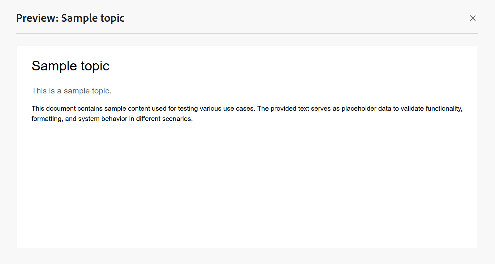
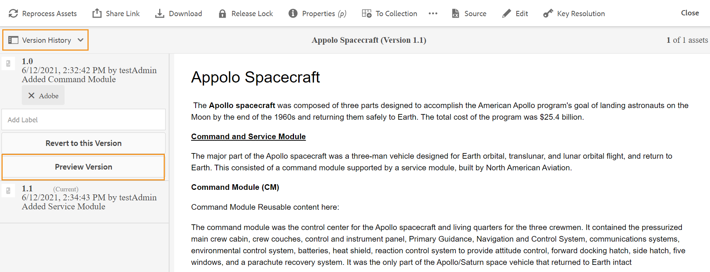
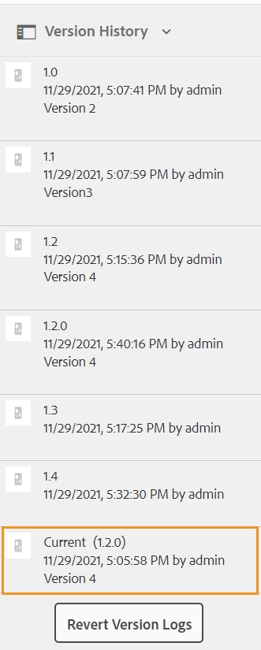

# Prévisualiser une rubrique {#id1696II000QR}

Une fois la rubrique créée, Adobe Experience Manager Guides génère un aperçu de la rubrique. Le mode Aperçu fournit diverses fonctionnalités que vous pouvez utiliser pour travailler avec votre document.

Il existe deux manières de prévisualiser une rubrique dans Experience Manager Guides :

- [À partir de l’éditeur](#preview-topics-from-the-editor)
- [À partir de l’interface utilisateur d’Assets](#preview-topics-from-the-assets-ui)

## Aperçu des rubriques à partir de l’éditeur

Pour prévisualiser une rubrique à partir de l’éditeur, procédez comme suit :

1. Dans le panneau Référentiel, accédez à la rubrique que vous souhaitez afficher.
1. Pointez sur la rubrique à prévisualiser et sélectionnez **Aperçu** dans le menu Options.

   {width="600" align="left"}

   L’aperçu de la rubrique s’affiche.

   {align="left"}

**Aperçu des rubriques en mode Aperçu**

Lorsque vous ouvrez une rubrique dans l’éditeur et passez en mode **Aperçu**, situé dans le coin inférieur droit de la zone d’édition du contenu, vous pouvez afficher un aperçu de la rubrique actuellement ouverte.

Pour plus d’informations, consultez la section [Vues de l’éditeur](./web-editor-views.md#preview).

## Aperçu des rubriques dans l’interface utilisateur d’Assets

Pour prévisualiser une rubrique, procédez comme suit :

1. Dans l’interface utilisateur d’Assets, accédez à la rubrique que vous souhaitez afficher.
1. Sélectionnez la rubrique que vous souhaitez afficher.

   Un aperçu de la rubrique s’affiche dans l’interface utilisateur d’Assets.

   >[!NOTE]
   >
   > Vous pouvez afficher la version de la rubrique active ou du plan DITA dans le coin supérieur droit de la barre d&#39;outils.

   >[!IMPORTANT]
   >
   > Le positionnement des fonctionnalités suivantes dans la barre d’outils d’aperçu peut différer en fonction de la configuration de votre serveur Adobe Experience Manager. Certaines des fonctionnalités peuvent être disponibles dans la barre d’outils principale, tandis que d’autres peuvent être disponibles sous le menu Plus .

## Fonctionnalités disponibles dans l’interface utilisateur d’Assets pour la prévisualisation

Les opérations suivantes sont disponibles dans la barre d’outils lors de l’utilisation de la fonction Aperçu de l’interface utilisateur d’Assets :

{align="left"}

**Propriétés**

Affichez les propriétés de la rubrique sélectionnée. En fonction de votre version de Adobe Experience Manager, vous pouvez afficher des propriétés telles que les métadonnées, la planification de l’activation \(de\), les références, l’état du document, etc.

>[!NOTE]
>
> La propriété title d&#39;une rubrique est automatiquement renseignée à partir de la balise `title` de la rubrique ou du mappage DITA. Si vous apportez une modification au titre à l’aide de la fenêtre des propriétés, cette modification est perdue. Si vous souhaitez mettre à jour la propriété de titre, vous devez le faire à l’aide de l’éditeur.

La page Propriétés contient des informations utiles sur les références, telles que l&#39;emplacement d&#39;utilisation d&#39;une carte ou d&#39;une rubrique, ou les références contenues dans un document. La page Propriétés répertorie deux types de références pour un document : **Utilisé dans** et **Références sortantes**.

Les références **Utilisé dans** répertorient les documents dans lesquels le fichier actuel est référencé ou utilisé. Le **Références sortantes** répertorie les documents qui sont référencés dans le document actif.

L’icône \(+\) de la section Références **Utilisé dans** vous permet de naviguer plus haut pour trouver où cette rubrique est utilisée ou référencée.

{align="left"}

Si vous sélectionnez l’icône  en regard d’un document, les fichiers de carte ou de rubrique dans lesquels ce document est référencé s’affichent.

**Filtrage Conditionnel \(A/B\)**

Si votre rubrique comporte du contenu conditionnel, l’icône A/B de la barre d’outils s’affiche. La sélection de cette icône ouvre un pop-up qui vous permet de filtrer le contenu en fonction des conditions disponibles dans la rubrique.

>[!NOTE]
>
> Le contenu conditionnel est mis en surbrillance à l’aide d’un arrière-plan clair dans l’éditeur.

{width="300" align="left"}

**Modifier**

- Ouvrez la rubrique pour modification dans l’éditeur. L’option **Modifier** n’est pas disponible si votre administrateur a activé l’option **Désactiver la modification sans verrouiller le fichier**. Lorsque l’option est activée, vous n’affichez l’option **Modifier** qu’après avoir verrouillé un fichier de rubrique.

**Résolution des clés**

- Si vous souhaitez utiliser un fichier d’espace de clés pour la rubrique, sélectionnez l’icône Résolution de clé . Vous pouvez ensuite choisir un espace de touches dans le pop-up Résolution des touches .

**Source**

- Ouvrez le code source XML d’un fichier. Vous pouvez afficher le code XML sous-jacent d&#39;un mappage, d&#39;une rubrique ou d&#39;un fichier DITAVAL en ouvrant le fichier en mode Aperçu et en sélectionnant l&#39;icône Source. Le pop-up XML Source affiche le code source XML. Vous pouvez sélectionner un code spécifique dans le fichier ou appuyer sur `Ctrl`+`a` pour sélectionner l’intégralité du contenu.

  >[!NOTE]
  >
  > Pour obtenir l&#39;affichage du code source d&#39;un fichier de plan DITA, sélectionnez le fichier dans l&#39;interface utilisateur d&#39;Assets et sélectionnez Source.

  {align="left"}

**Partager un lien UUID**

- Experience Manager Guides vous permet de partager les liens basés sur l&#39;UUID pour les plans DITA, les rubriques et les fichiers image à partir des emplacements suivants :

   - Interface utilisateur d’Assets
   - Console du plan DITA
   - Aperçu de la rubrique ou de l’image

Une nouvelle option **Partager le lien UUID** s’affiche dans la barre d’outils des zones mentionnées ci-dessus. La capture d’écran suivante présente l’option **Partager le lien UUID** en mode Aperçu d’une rubrique :

{align="left"}

Dans l’interface utilisateur d’Assets, cette option est visible lorsque vous sélectionnez un fichier. En mode Aperçu , cette option est disponible par défaut dans la barre d’outils principale. Dans une console de plan DITA, cette option est visible dans la section Paramètres prédéfinis de sortie .

Une fois que vous avez copié l’URL, elle peut être partagée avec d’autres utilisateurs pour leur donner un accès direct au fichier. Ce lien reste valide même lorsque le fichier est déplacé vers un autre emplacement du référentiel. Le lien échoue uniquement lorsque le fichier est supprimé du référentiel.

Si vous partagez le lien à partir de la console de plan DITA ou du mode d&#39;aperçu d&#39;un fichier, l&#39;utilisateur accède à la même vue du fichier. Cependant, lorsque vous partagez le lien d’un fichier de mappage à partir de l’interface utilisateur d’Assets, l’utilisateur est redirigé vers la console du mappage. De même, pour une rubrique ou un fichier image, l’aperçu du fichier s’affiche.

>[!IMPORTANT]
>
> Le lien ne peut pas être utilisé comme lien de référence dans une autre rubrique. Il donne uniquement un accès direct au fichier dans le référentiel. En outre, le lien reste valide tant que le fichier est disponible dans le référentiel. Même si le fichier est déplacé vers un autre emplacement du référentiel, le lien reste valide. Le lien échoue uniquement lorsque le fichier est supprimé du référentiel.

**Extraction/archivage**

- Active/désactive les fonctions Extraction et Archivage. Lorsqu’un fichier est extrait, l’utilisateur actuel obtient une autorisation d’écriture exclusive sur le fichier. Un fichier extrait peut être ouvert dans l’éditeur pour modification. Une fois la modification apportée, sélectionnez l’icône Archiver pour enregistrer le fichier dans la gestion des ressources numériques (DAM).

Lorsque vous extrayez une rubrique, le statut du fichier s’affiche comme extrait dans la vue Carte et dans la vue Liste.

Fichier extrait en mode Carte :

{width="300" align="left"}

Fichier extrait dans la vue Liste :

{width="550" align="left"}

Si la colonne Extrait n’est pas visible, sélectionnez **Paramètres d’affichage** sous **Vue Liste** et sélectionnez le statut **Extrait** dans la boîte de dialogue **Configurer les colonnes**.

{align="left"}

>[!TIP]
>
> Consultez la section Contrôle de version du contenu dans le guide des bonnes pratiques pour connaître les bonnes pratiques relatives à l’extraction et à l’archivage des fichiers.

**Différence de version web**

- Si votre rubrique a subi des modifications, vous pouvez facilement découvrir les modifications apportées dans différentes versions de cette rubrique. Pour connaître les modifications apportées à différentes versions d&#39;une rubrique :

  >[!IMPORTANT]
  >
  > La méthode décrite dans la procédure suivante s&#39;applique uniquement aux fichiers DITA. Pour les fichiers non DITA, utilisez la vue Chronologie pour créer des versions ou restaurer une version existante d&#39;un fichier.

   1. Ouvrez la rubrique en mode Aperçu .

   1. Dans le rail de gauche, sélectionnez **Historique des versions** et sélectionnez une version.

      {align="left"}

   1. Dans la liste des versions, sélectionnez celle que vous souhaitez utiliser comme version de base et sélectionnez **Aperçu de la version**. La prévisualisation de la version sélectionnée s’affiche dans la fenêtre Aperçu de la version .

   1. Dans la liste **Afficher la différence**, sélectionnez la version avec laquelle vous souhaitez comparer la version de base.

      {align="left"}

      Le contenu modifié est mis en surbrillance dans l’aperçu de la rubrique. Le contenu surligné en vert signifie que le contenu qui vient d’être ajouté et le contenu en rouge est le contenu supprimé.

      {align="left"}

## Branche, rétablissement et contrôle de version ultérieur

- Dans un environnement de création classique, vous devez créer une nouvelle branche d’une rubrique pour répondre à une version spécifique. Comme tout autre système de gestion des versions, Experience Manager Guides vous permet de créer une branche à partir d’une version existante d’une rubrique ou de revenir à une version plus ancienne d’une rubrique. À l’aide des fonctionnalités de gestion de version de Experience Manager Guides, vous pouvez effectuer les tâches suivantes :

   - Créer une branche à partir d’une version existante d’une rubrique
   - Créer les versions suivantes dans une nouvelle branche
   - Revenir à une version spécifique d’une rubrique

  L’illustration suivante présente le système d’embranchement type et de création de versions ultérieures :

  {width="550" align="center"}

  Pour toute nouvelle rubrique, la première version est numérotée 1.0. Par la suite, chaque nouvelle version de la rubrique est enregistrée avec un numéro incrémentiel, tel que 1.1, 1.2, etc. Une fois que vous avez créé une branche d’une rubrique, une nouvelle branche est créée, prenant le numéro de version d’où la branche est créée et ajoutant un .0 à la fin de la version. Comme illustré ci-dessous, une nouvelle branche est créée à partir de la version 1.1 d’une rubrique. La nouvelle branche a la version 1.1.0. Par la suite, chaque fois que vous enregistrez une nouvelle version de la rubrique dans cette branche, elle obtient un numéro de version incrémentiel, tel que 1.1.1, 1.1.2, etc.

  Tout comme pour l’embranchement, vous pouvez également rétablir votre version de travail ou actuelle de n’importe quelle version existant dans le référentiel. Pour revenir à une version, sélectionnez simplement la version souhaitée de la rubrique et sélectionnez **Revenir à cette version** dans le panneau **Historique des versions**.

  Pour créer une branche, revenir à une version et conserver les versions suivantes d’une rubrique, procédez comme suit :

  >[!IMPORTANT]
  >
  > La méthode décrite dans la procédure suivante s&#39;applique uniquement aux fichiers DITA. Pour les fichiers non DITA, utilisez la vue Chronologie pour créer des versions ou restaurer une version existante d&#39;un fichier.

   1. Accédez à la rubrique dans l’interface utilisateur d’Assets.

      >[!NOTE]
      >
      > Vous pouvez également ouvrir la rubrique en mode Aperçu et passer à l’étape 3.

   1. Sélectionnez la rubrique pour laquelle vous souhaitez créer une branche.

   1. Dans le rail de gauche, sélectionnez **Historique des versions**.

      >[!NOTE]
      >
      > Une liste des versions disponibles pour la rubrique sélectionnée s’affiche. Chaque version contient les informations d’horodatage, de nom d’utilisateur, de commentaire de version et de [libellé](web-editor-use-label.md#).

   1. Sélectionnez une version à partir de laquelle vous souhaitez créer une branche. Dans la capture d’écran suivante, la version 1.2 est sélectionnée pour la création d’une branche.

      {width="300" align="left"}

      >[!NOTE]
      >
      > La version actuelle d’une rubrique contient *\(Current\)* mentionné en regard du numéro de version.

   1. Sélectionnez **Revenir à cette version**.

      Un message s’affiche vous demandant de confirmer la création d’une nouvelle branche.

   1. *\(Facultatif\)* Dans l’invite de message, vous avez la possibilité de sélectionner l’option **Enregistrer la copie de travail actuelle en tant que nouvelle version**. Les deux actions suivantes sont possibles en fonction de la sélection de cette option :

      - Si vous sélectionnez cette option, une branche est créée à partir de la version 1.1. De plus, une nouvelle version de la rubrique est également créée à partir de la copie de travail actuelle de la rubrique et enregistrée comme version suivante : 1.4.

        {width="300" align="left"}

        La version 1.2 devient votre copie de travail actuelle de la rubrique. Toute version enregistrée après cela est créée dans la nouvelle branche de 1.1. Par exemple, la version suivante d’une nouvelle rubrique dans cette branche sera enregistrée en tant que 1.2.0.

        {width="300" align="left"}

      - Si vous ne sélectionnez pas cette option, aucune nouvelle version de la copie de travail actuelle de la rubrique n&#39;est créée. Une nouvelle branche est créée à partir de la version 1.2 de la rubrique. Toute version ultérieure de la rubrique est enregistrée sous la branche 1.2 en tant que 1.2.0, 1.2.1, etc.

        {width="300" align="left"}

   1. Sélectionnez **OK**.

  Une nouvelle branche est créée à partir de la version sélectionnée de la rubrique. Le processus ci-dessus s’applique également pour revenir à une version spécifique d’une rubrique. Le retour à une version spécifique signifie techniquement que vous créez une branche à partir de la version sélectionnée et que vous faites de cette version la copie de travail actuelle de la rubrique. Vous pouvez également afficher l’historique des fichiers qui ont été rétablis dans le rapport Historique de rétablissement de version. Pour plus d’informations sur ce rapport, consultez la section [Historique des versions des fichiers rétablis](reports-reverted-file-version-history.md#).

**Rubrique parente :**&#x200B;[ Créer et prévisualiser des rubriques](create-preview-topics.md)
