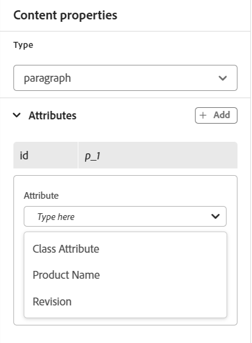
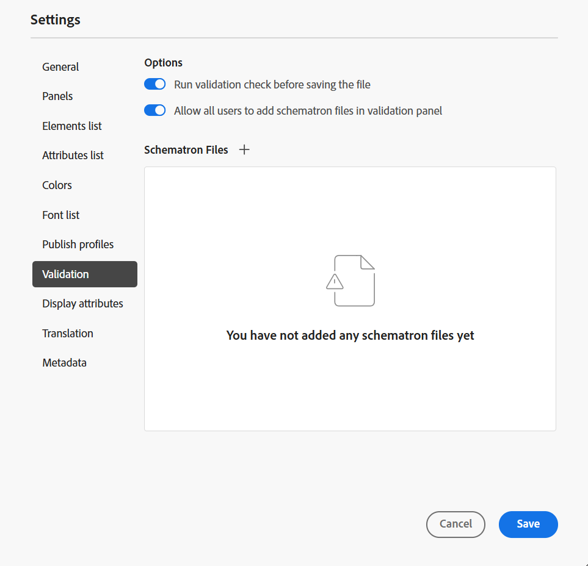

# Paramètres de l’éditeur

L’option **Paramètres** présente dans la barre d’onglets [Tabulation](./web-editor-tab-bar.md) de l’éditeur est disponible uniquement pour les administrateurs et les administrateurs de profil de dossiers et permet de configurer les paramètres suivants :

- [Général](#general)
- [Panneaux](#panels)
- [Liste des éléments](#elements-list)
- [Liste Attributs](#attributes-list)
- [Couleurs](#colors)
- [Publication de profils](#publish-profiles)
- [Validation](#validation)
- [Attributs d’affichage](#display-attributes)
- [Traduction](#translation)
- [Métadonnées](#metadata)

>[!NOTE]
>
> Si vous mettez à jour des paramètres par défaut, vous devez rouvrir les documents pour que les modifications prennent effet.

## Général

Les paramètres Général vous permettent de configurer le dictionnaire à utiliser avec l’éditeur. Cet onglet contient quatre sections : **Vérification orthographique**, **Condition**, **Création** et **Citations** .

{width="650" align="left"}

- **Vérification orthographique** : il existe deux options : **Vérification orthographique AEM** et **Vérification orthographique du navigateur**. Par défaut, l’éditeur utilise la fonction de vérification orthographique du navigateur , où la vérification orthographique est effectuée à l’aide du dictionnaire intégré du navigateur. Vous pouvez passer à la vérification orthographique d’AEM pour utiliser le dictionnaire Adobe Experience Manager, qui peut également être personnalisé pour ajouter votre liste de mots personnalisée. Pour plus d’informations sur la personnalisation du dictionnaire AEM, consultez la section [ Personnaliser le dictionnaire par défaut d’AEM ](../cs-install-guide/customize-aem-custom-dictionary.md) dans Installation et configuration d’Adobe Experience Manager Guides as a Cloud Service.

- **Condition**

   - **Mettre en surbrillance le texte conditionnel en mode Création** : sélectionnez cette option pour mettre en surbrillance le texte conditionnel en mode Création. Le contenu conditionnel est mis en surbrillance à l’aide de la couleur définie pour la condition.

   - **Valider avec des attributs de condition** : sélectionnez cette option pour permettre la validation des valeurs définies pour les attributs. Cela vous empêche d’ajouter une valeur incorrecte.

   - **Afficher la clé avec le titre dans le panneau Schéma d’objet** : sélectionnez cette option pour afficher les clés ainsi que les titres dans le schéma d’objet. Si vous ne sélectionnez pas cette option, seuls les titres s’affichent. Par exemple, les clés « os », « audience » et « other » sont également affichées avec les titres.

     {width="550" align="left"}

   - **Afficher le schéma d’objet dans le panneau Conditions** : sélectionnez cette option pour afficher un schéma d’objet dans le panneau Conditions. Si vous désélectionnez cette option, les conditions définies s’affichent dans le panneau Conditions .

- **Création**

   - **Activer tout remplacer** : sélectionnez cette option pour afficher l’icône **Tout remplacer** dans le panneau **Rechercher et remplacer**.

- **Citations**

  Modifier le style des citations. Choisissez le style de citation dans la liste déroulante que vous souhaitez utiliser dans votre projet. Pour plus d’informations, voir [Modifier les styles de citation](./web-editor-apply-citations.md#change-citation-style).

- **Assistant IA**
Sélectionnez cette option pour activer la fonctionnalité [Assistant IA](./ai-assistant.md) dans Experience Manager Guides. Désélectionnez cette option pour désactiver la fonction.

## Panneaux

Ce paramètre contrôle les panneaux qui s’affichent dans les panneaux de gauche et de droite de la console Éditeur et mappage . Vous pouvez activer/désactiver le bouton pour afficher ou masquer le panneau souhaité.

{width="650" align="left"}

Vous pouvez également définir l’ordre dans lequel les fonctionnalités présentes dans les panneaux sont affichées. Pour modifier l’ordre par défaut des fonctions disponibles dans les panneaux, sélectionnez les barres en pointillés afin de faire glisser et de déposer les onglets des fonctions à l’emplacement souhaité. Une fonction peut également être déplacée de la section **Plus** vers la section principale d’un panneau, et inversement, en fonction des besoins. Une fois réorganisées, les fonctions apparaissent dans la même séquence dans le panneau de droite et de gauche correspondant.

{width="650" align="left"}

Vous pouvez afficher huit panneaux à la fois au maximum. Toutes les modifications apportées aux paramètres du panneau sont appliquées immédiatement.

>[!NOTE]
>
> Si un panneau personnalisé a été configuré, il apparaît également dans la liste des panneaux. Vous pouvez activer/désactiver le basculement pour afficher ou masquer le panneau personnalisé.

## Liste des éléments

En tant qu’administrateur, vous pouvez contrôler la liste des éléments qu’un auteur peut insérer dans un fichier et également définir le nom d’affichage de l’élément. Le paramètre de liste Éléments vous permet de spécifier le nom de l&#39;élément selon les spécifications DITA et un libellé que vous souhaitez utiliser à la place du nom d&#39;élément défini par DITA :

{width="650" align="left"}

Dans la capture d’écran ci-dessus, l’élément `p` a reçu le libellé Paragraphe et `codeblock` reçoit le libellé Bloc de code ainsi que d’autres éléments. Si vous sélectionnez l&#39;option **Utiliser uniquement au-dessus des éléments**, seuls les éléments valides \(au point d&#39;insertion actuel\) de cette liste seront affichés dans la boîte de dialogue **Insérer un élément**.

Dans la capture d’écran suivante, seuls 3 des 4 éléments configurés de la capture d’écran précédente sont affichés dans le contexte actuel :

{width="300" align="left"}

## Liste Attributs

Tout comme pour la liste des éléments, vous pouvez contrôler la liste des attributs et leurs noms d’affichage à afficher dans la liste des attributs d’un élément. Dans la capture d’écran suivante, seuls 3 attributs ont été configurés pour être affichés dans la liste d’attributs d’un élément :

{width="650" align="left"}

Avec ce paramètre, lorsque vous essayez d’ajouter un attribut à un élément, vous ne voyez que la liste des attributs configurés dans la liste.

{width="300" align="left"}

## Couleurs

Affiche une liste de couleurs de fond préconfigurées pour les **Conditions**. Les utilisateurs peuvent sélectionner une couleur d’arrière-plan lors de l’application d’une condition à une rubrique. En tant qu’administrateur, vous pouvez également créer et ajouter des couleurs d’arrière-plan personnalisées à la liste. Pour ajouter une nouvelle couleur, saisissez le nom souhaité dans le champ **Nom de la couleur**, choisissez une couleur personnalisée, puis sélectionnez l’icône **+**. La couleur personnalisée s’affiche à la fin de la liste des couleurs.

## Publication de profils

Contient les profils qui peuvent être utilisés pour publier la sortie **Base de connaissances**. Vous pouvez créer un profil pour une base de connaissances cible. Par exemple, Salesforce ou ServiceNow.

**Créer un profil Salesforce**

**Conditions préalables**

- Créez une application connectée pour Salesforce. Pour plus d’informations, voir [Activer les paramètres OAuth pour l’intégration de l’API](https://help.salesforce.com/s/articleView?id=sf.connected_app_create_api_integration.htm&amp;type=5).

- Lors de la configuration de l’application connectée, assurez-vous des points suivants :

   - Spécifiez le rappel .

     `URL: http://<server name>:<port>/bin/dxml/thirdparty/callback/salesforce`

   - Sélectionnez les portées OAuth suivantes :
      - Accès complet (complet)
      - Sélectionnez Gérer les données utilisateur via les API (api) .

     Une fois l’application configurée, Salesforce fournit une **Clé du client** et **Secret du client**. Ils peuvent être utilisés pour créer le profil Salesforce.

   - Pour créer un profil Salesforce, sélectionnez la base de connaissances **Salesforce** dans le menu déroulant **Type de serveur**. Saisissez un nom de profil. Dans l’**URL du site**, saisissez le site client que vous utiliserez pour publier la sortie, puis ajoutez les **Clé du client** et **Secret du client** fournis par le site client Salesforce. Ensuite, **Valider** et **Enregistrer** le profil nouvellement créé.

     {width="550" align="left"}

     >[!NOTE]
     >
     >Pour configurer un proxy pour Salesforce dans Experience Manager Guides, utilisez la configuration proxy de composants HTTP Apache dans AEM. Découvrez comment [configurer le proxy pour le Vérificateur de lien AEM](https://helpx.adobe.com/experience-manager/kb/How-to-configure-proxy-for-the-AEM-Link-Checker-AEM.html).

**Créer un profil ServiceNow**

**Conditions préalables**

Configurez le serveur ServiceNow pour charger les ressources.

- Se connecter au serveur **ServiceNow**.
- Accédez à **Propriétés du système** > **Sécurité**.
- Désélectionnez l’option suivante :

  **Cette propriété doit être définie pour activer la vérification de type MIME pour les chargements (toutes les versions Eureka et ultérieures). Active (true) ou désactive (false) la validation du type MIME pour les pièces jointes. Les extensions de fichier configurées via glide.attachment.extensions seront vérifiées pour le type MIME lors du chargement.**

- Sélectionnez **Enregistrer**.

  Une fois que vous avez configuré l’application, créez le profil **ServiceNow**.

- Pour créer un profil, sélectionnez la base de connaissances ServiceNow dans le menu déroulant **Type de serveur**. Saisissez un profil **Nom**. Dans l’URL **ServiceNow**, saisissez le site client que vous utiliseriez pour publier la sortie, puis ajoutez les **Nom d’utilisateur** et **Mot de passe** fournis par le site client ServiceNow. Ensuite, **Valider** et **Enregistrer** le profil nouvellement créé.

  {width="550" align="left"}

  Après la validation, vous pouvez sélectionner le profil de publication dans les paramètres prédéfinis de sortie d&#39;un plan DITA et l&#39;utiliser pour générer la sortie vers le serveur **Salesforce** ou **ServiceNow** que vous avez choisi.

  En savoir plus sur le paramètre prédéfini de sortie [Base de connaissances](../user-guide/generate-output-knowledge-base.md).

## Validation

Cet onglet contient des options pour configurer les validations de schémas dans l’éditeur. Vous pouvez activer les fonctionnalités suivantes :

- **Exécuter la vérification de validation avant d’enregistrer le fichier** : sélectionnez cette option pour exécuter les validations Schematron à l’aide du ou des fichiers Schematron sélectionnés avant toute opération d’enregistrement. Vous pouvez ajouter un fichier de schéma en sélectionnant l’icône + . Le ou les fichiers Schematron sélectionnés sont répertoriés.

  >[!NOTE]
  >
  > Le ou les fichiers de schéma sélectionnés seront conservés pour le profil de dossier sélectionné.

  {width="550" align="left"}

  Cela empêche les utilisateurs d’enregistrer tout fichier qui enfreint une règle définie dans le ou les fichiers de schéma sélectionnés. Si cette option n’est pas sélectionnée, le fichier ne sera pas validé avant d’enregistrer les modifications.

- **Autoriser tous les utilisateurs à ajouter des fichiers Schematron dans le panneau de validation** : sélectionnez cette option pour autoriser les utilisateurs à ajouter n’importe quel fichier Schematron dans le panneau Validation de l’éditeur. Cela permet aux utilisateurs d’ajouter des fichiers Schematron, puis de valider les rubriques par rapport au fichier Schematron. Si cette option n’est pas sélectionnée, l’option permettant d’ajouter un fichier de schéma **Ajouter un fichier de schéma** n’est pas disponible pour les utilisateurs dans le panneau **Validation** de l’éditeur.

## Attributs d’affichage

Comme pour la liste Attributs , vous pouvez contrôler la liste des attributs à afficher dans la liste des attributs d’un élément. Par défaut, quatre **attributs d’affichage** — audience, plateforme, produit et props ont été configurés pour être affichés dans la liste d’attributs d’un élément. Vous pouvez également ajouter un attribut d’affichage à l’aide de l’icône **Ajouter** située en haut. Vous pouvez également supprimer l’un des attributs d’affichage à l’aide de l’icône **Supprimer**.

Les attributs définis pour un élément sont affichés en mode Mise en page et Plan.

{width="550" align="left"}

## Traduction

Cet onglet contient les options permettant de créer des groupes de langues, de propager les libellés source vers la version cible et de nettoyer le projet de traduction.

{width="550" align="left"}

- **Groupes de langues** : en tant qu’administrateur, vous pouvez créer un groupe de langues et les utiliser comme un ensemble pour traduire le contenu.

  Pour créer un groupe de langues, procédez comme suit :

   1. Sélectionnez **Ajouter**.
   1. Saisissez le nom du groupe linguistique. Chaque langue doit avoir un nom unique. Vous pouvez voir une erreur si le champ du nom est vide ou si le nom n’est pas unique.
   1. Sélectionnez les langues dans la liste déroulante. Vous pouvez sélectionner plusieurs langues.

      Saisissez les premiers caractères de la langue ou le code de langue pour filtrer les langues souhaitées. Par exemple, saisissez « en » pour filtrer toutes les langues qui contiennent « en » au début de leur nom ou de leur code.

   1. Sélectionnez l’icône Terminé pour ajouter les langues sélectionnées au groupe. Les langues s’affichent. Lorsque vous ajoutez trois langues ou plus, l’option **Afficher plus** s’affiche. Vous pouvez sélectionner **Afficher plus** pour afficher toutes les langues présentes dans le groupe.

      >[!TIP]
      >
      > Activez le bouton (bascule) **Afficher plus** pour **Afficher moins** et afficher uniquement quelques langues.

   1. Pointez sur les langues d’un groupe pour modifier  ou supprimer  les groupes de langues.
   1. Enregistrez le **Paramètres**.

      >[!NOTE]
      >
      >En tant qu’utilisateur, vous pouvez afficher les groupes linguistiques configurés sur votre profil de dossier.

- **Propager les libellés de la version source vers la version cible** : sélectionnez cette option pour transmettre le libellé de la version du fichier source au fichier traduit. Par défaut, cette option est désactivée.
- **Nettoyage du projet de traduction après l’achèvement** : sélectionnez cette option pour configurer les projets de traduction à désactiver ou à supprimer automatiquement après la traduction. Par défaut, l’option **Aucun** est sélectionnée, de sorte que le projet existe après la traduction.

  Vous pouvez désactiver les projets de traduction si vous souhaitez les utiliser ultérieurement. La suppression d’un projet supprime définitivement tous les fichiers et dossiers présents dans le projet.

## Métadonnées

Vous pouvez contrôler les métadonnées de version de la rubrique et leurs valeurs à afficher dans la boîte de dialogue **Historique des versions**.  Dans le chemin d’accès des métadonnées, indiquez l’emplacement des nœuds à partir desquels vous souhaitez sélectionner les métadonnées. Vous pouvez également définir un nom personnalisé pour les métadonnées comme libellé. Les propriétés par défaut sont Titre, État du document et Balises.

Les métadonnées peuvent être sélectionnées à partir de n’importe quelle propriété sous le nœud `/jcr:content` de la ressource. Vous pouvez donc ajouter le chemin de la propriété comme chemin des métadonnées.

Une erreur s’affiche si le chemin d’accès aux métadonnées est vide. Si vous laissez le libellé vide, le dernier élément est sélectionné comme libellé.

{width="550" align="left"}

*Configurer les métadonnées de la boîte de dialogue **Historique des versions**.*

Vous pouvez également définir l’ordre d’affichage de ces balises de métadonnées. Pour modifier l’ordre par défaut de ces balises, sélectionnez les barres pointillées pour faire glisser et déposer les balises à l’emplacement souhaité.
Les libellés de métadonnées apparaissent dans la même séquence dans la boîte de dialogue **Historique des versions** de l’éditeur.

**Rubrique parente :**[ Présentation de l’éditeur](web-editor.md)
