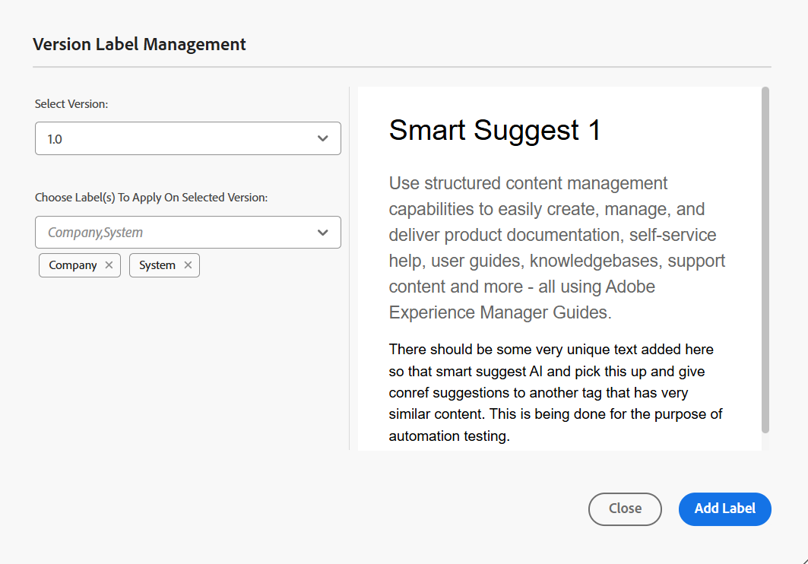
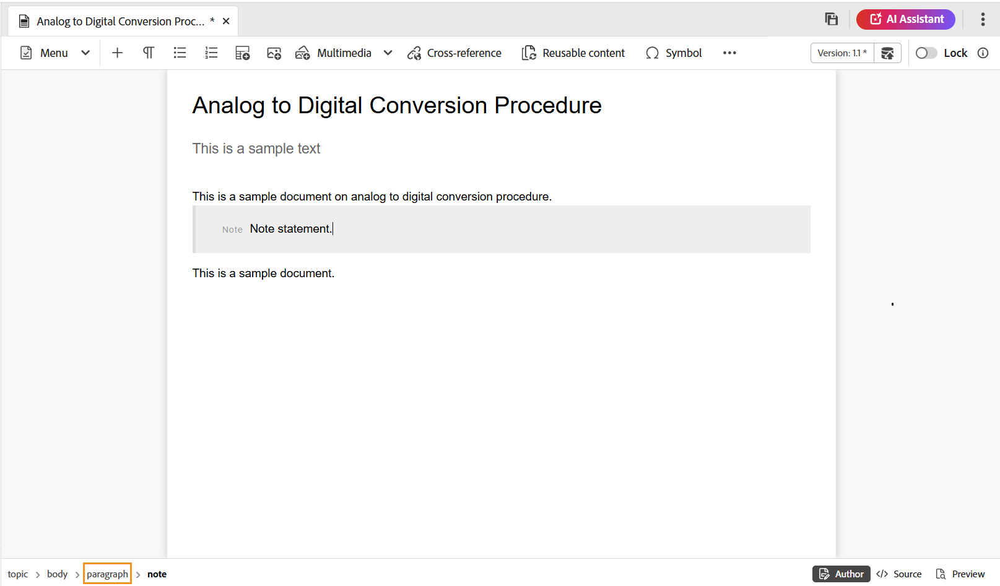

# Barre d’outils de l’éditeur

La barre d’outils s’affiche lorsque vous ouvrez une rubrique ou un mappage à modifier dans l’éditeur. Les fonctionnalités disponibles dans la barre d’outils sont les suivantes :

- [Menu déroulant](#menu-dropdown)
- [Options d&#39;insertion de contenu](#content-insertion-options)
- [Informations sur la version et bouton Enregistrer en tant que nouvelle version](#version-information-and-save-as-new-version)
- [Verrouiller/déverrouiller](#lockunlock)

>[!NOTE]
>
> Les fonctionnalités répertoriées ci-dessus s’appliquent uniquement aux fichiers de rubrique. Lorsque vous utilisez un fichier de mappage, différentes options s’affichent dans la barre d’outils en fonction de la vue actuelle de l’éditeur de mappages. Découvrez les options de la barre d’outils de l’éditeur de cartes dans le document [Fonctionnalités de l’éditeur de cartes](./map-editor-advanced-map-editor.md).

## Menu déroulant

La liste déroulante Menu permet d’accéder aux actions de modification, Rechercher et remplacer, Historique des versions, Libellé de version, Fusionner, Créer une tâche de révision et Afficher le menu (qui inclut le Suivi des modifications, les Balises, un espace insécable).

{width="350" align="left"}

Ces fonctionnalités sont expliquées en détail comme suit :

**Modification des actions**

Lorsque vous modifiez une rubrique dans l’éditeur, accédez aux différentes actions d’édition telles que **Couper** ou ***Ctrl***+***X*** , **Copier** ou ***Ctrl***+***C*** , **Undo** ou ***Ctrl***+***Z*** ou **Ctrl**+***Y*** et ***Delete*** **** présentes dans la liste déroulante Menu .

**Rechercher et remplacer**

La fonction **Rechercher et remplacer** est disponible dans les modes d’affichage Auteur et Source. Lorsqu’elle est activée, la barre de texte Rechercher et remplacer s’affiche au bas de la zone d’édition de la rubrique. Vous pouvez utiliser les touches de raccourci **Ctrl**+**F** pour appeler la barre de recherche et de remplacement.

{align="left"}

À l’aide de l’icône de paramètres \(\), vous pouvez activer ou désactiver les options de recherche **Ignorer la casse** et **Mot entier uniquement**. Pour effectuer une recherche qui ne respecte pas la casse, activez l’option **Ignorer la casse** en \(ou sélectionnez\). Sinon, si vous souhaitez effectuer une recherche sensible à la casse, désactivez l’option **Ignorer la casse**. Vous pouvez également choisir de rechercher un mot entier.

La recherche est instantanée, ce qui signifie que lorsque vous saisissez l’expression ou le mot à rechercher dans le champ **Rechercher**, le terme est immédiatement recherché et sélectionné dans le sujet. De même, pour remplacer un texte dans votre rubrique, saisissez le terme de recherche et son remplacement dans les champs respectifs et sélectionnez le bouton **Remplacer** ou **Tout remplacer**.

Dans la vue Source, la fonction **Rechercher et remplacer** est extrêmement utile pour rechercher un élément ou un attribut spécifique. Par exemple, si vous souhaitez remplacer la valeur de l’attribut `@product`, vous pouvez facilement le faire à partir de la vue Source. La vue Auteur ne vous permet pas d’effectuer une recherche sur la base d’un attribut ou d’un élément. Toutefois, vous devez faire preuve de prudence lors de l’utilisation de la fonction **Tout remplacer**, car elle peut remplacer le code XML.

**Historique des versions**

La fonction **Historique des versions** de l&#39;éditeur vous permet de vérifier les versions disponibles de vos fichiers DITA, de les comparer et de revenir à n&#39;importe quelle version de l&#39;éditeur lui-même. Vous pouvez comparer le contenu et les métadonnées de la version actuelle (qui peut également être une copie de travail) avec n’importe quelle version précédente du même fichier. Vous pouvez également afficher les libellés et les commentaires des versions comparées.

>[!NOTE]
>
> Les options Historique des versions n&#39;apparaissent que si des modifications sont apportées à la première version de la rubrique ou de la carte.

    
 Étapes pour accéder à l’historique des versions 

1. Ouvrez une rubrique dans l’éditeur.
1. Sélectionnez **Historique des versions** dans le menu déroulant **Menu**.

   La boîte de dialogue **Historique des versions** s’affiche.

   {width="550" align="left"}

   *Prévisualiser les modifications dans les différentes versions d&#39;une rubrique.*

1. Sélectionnez la version de la rubrique que vous souhaitez comparer ou revenir à dans la liste déroulante **Comparer avec**.

   >[!NOTE]
   >
   > Si des libellés sont appliqués à une version, ils sont également affichés \(entre parenthèses\) avec le numéro de version.

1. Activez l’option **Afficher les libellés et les commentaires** pour afficher les libellés et les commentaires appliqués aux versions actuelle et comparée.
1. Vous pouvez également afficher les informations suivantes dans la boîte de dialogue **Historique des versions** :

   Onglet **Aperçu** : le contenu nouvellement ajouté est dans la police verte et le contenu supprimé est dans la police rouge.

   Onglet **Métadonnées** : les métadonnées nouvellement ajoutées sont dans la police verte et les métadonnées supprimées sont dans la police rouge.

   {width="550" align="left"}

   *Comparez les métadonnées de différentes versions dans l’historique des versions.*

   >[!NOTE]
   >
   > Votre administrateur système peut modifier les métadonnées à afficher à partir de l’onglet Métadonnées dans le **Paramètres**. Pour plus d’informations, reportez-vous à la section **Autres actions** de la [barre d’onglets](./web-editor-tab-bar.md).

   Vous pouvez également afficher les détails de l’utilisateur et de l’heure de la version actuelle et de la version comparée.

   Une fois que vous avez choisi une version dans la liste déroulante, l’option **Revenir à la version sélectionnée** est disponible. La fenêtre de prévisualisation affiche les différences entre la version actuelle et la version sélectionnée de la rubrique.

1. Sélectionnez **Rétablir la version sélectionnée** pour rétablir votre copie de travail avec la version sélectionnée de la rubrique.

   La boîte de dialogue Rétablir la version s’affiche.

   {width="550" align="left"}

1. \(*Facultatif*\) Indiquez un motif pour revenir à une version antérieure. Vous pouvez également créer une nouvelle version de la copie de travail active de votre rubrique.

1. Sélectionnez **Confirmer**.

   Votre copie de travail du fichier est rétablie à la version sélectionnée. Si vous choisissez de créer une nouvelle version de la copie de travail active, une nouvelle version du fichier est également créée avec toutes les modifications de travail.

   Lorsque vous revenez à une version antérieure, un indice visuel s’affiche indiquant que la version sur laquelle vous travaillez actuellement n’est pas la dernière version.

   {align="left"}

**Libellés de version**

Les libellés vous permettent d’identifier l’étape à laquelle une rubrique spécifique se trouve dans le DDLC \(cycle de vie du développement de document\). Par exemple, lorsque vous travaillez sur une rubrique, vous pouvez définir le libellé comme « Approuvé ». Une fois qu’une rubrique est publiée et mise à la disposition des clients, vous pouvez lui attribuer le libellé « Publié ».

Experience Manager Guides vous permet de spécifier des libellés dans un format de texte libre ou d’utiliser un ensemble de libellés prédéfinis. Le libellé personnalisé permet à tout auteur ou autrice du système de spécifier un libellé en fonction de son choix. Cela donne de la flexibilité ; cependant, cela introduit des libellés incohérents dans le système. Pour résoudre ce problème, les administrateurs et administratrices peuvent configurer un ensemble de libellés prédéfinis. Pour plus d’informations sur la configuration des libellés prédéfinis, consultez *Configuration et personnalisation de l’éditeur web XML* dans la section Installation et configuration d’Adobe Experience Manager Guides as a Cloud Service.

Ces libellés s’affichent sous la forme d’une liste déroulante à l’intention des auteurs qui souhaitent spécifier un libellé. Cela permet de s’assurer que seuls des libellés prédéfinis et cohérents sont utilisés dans le système.

Il existe différentes méthodes d’application des libellés à vos rubriques : panneau [Historique des versions](web-editor-use-label.md) dans l’interface utilisateur d’Assets, [Lignes de base](/help/product-guide/user-guide/generate-output-use-baseline-for-publishing.md) interface utilisateur et éditeur. La fonction Libellé de version de l’éditeur permet aux auteurs d’attribuer rapidement et facilement des libellés à leurs rubriques.

    
 Procédure à suivre pour ajouter des libellés à votre rubrique à partir de l’éditeur 

1. Ouvrez une rubrique dans l’éditeur.

1. Sélectionnez **Libellés de version** dans le menu déroulant Menu .

   La boîte de dialogue Gestion des libellés de version s’affiche.

   {width="350" align="left"}

   La boîte de dialogue Gestion des libellés de version est divisée en deux parties : le panneau de gauche contient une liste des versions disponibles pour la rubrique, une liste déroulante de libellés \(ou une zone de texte pour saisir un libellé\) et le panneau de droite avec un aperçu de la rubrique.

1. Sélectionnez la version sur laquelle vous souhaitez appliquer des libellés.

   Lorsque vous choisissez une autre version de la rubrique dans la liste des versions, le panneau d’aperçu affiche les modifications entre la version actuelle et la version sélectionnée de la rubrique

   >[!NOTE]
   >
   > Si un libellé est déjà appliqué à une version, il est affiché en regard du numéro de version dans la liste déroulante et sous la liste Sélectionner la version . Vous pouvez supprimer un libellé existant en sélectionnant l’icône \(**x**\) en regard du libellé.

1. Si votre administrateur a défini une liste de libellés, une liste déroulante des libellés s’affiche à partir de laquelle vous pouvez choisir les libellés à appliquer. Vous pouvez sélectionner plusieurs libellés dans la liste déroulante.

   Dans le cas contraire, une zone de texte s’affiche, dans laquelle vous pouvez saisir les libellés à ajouter à la rubrique.

   >[!NOTE]
   >
   > Vous ne pouvez pas appliquer le même libellé à plusieurs versions d’une rubrique. Si vous essayez d’associer un libellé existant, vous avez la possibilité de le supprimer de la version existante et de l’appliquer à la version sélectionnée de la rubrique.

1. Sélectionnez **Ajouter une étiquette**.

1. Dans le message de confirmation Appliquer le libellé , sélectionnez l’option **Déplacer le libellé (s’il est utilisé dans une autre version)** pour déplacer les libellés d’une version existante vers la version sélectionnée. Si vous ne sélectionnez pas cette option et que des libellés sont affectés à une autre version de la rubrique, ils ne sont pas déplacés vers la version de la rubrique sélectionnée. Ces libellés sont ignorés dans le processus d’application des libellés.

**Fusionner**

Lorsque vous travaillez dans un environnement multi-auteurs, il devient difficile de suivre les modifications que les autres auteurs ont apportées à une rubrique ou à un mappage. La fonction de fusion vous permet de mieux contrôler non seulement l’affichage des modifications, mais également les modifications conservées dans la dernière version du document.

    
 Fusion des fichiers de rubrique 

Pour fusionner les modifications dans une rubrique, procédez comme suit :

1. Ouvrez une rubrique dans l’éditeur.

1. Sélectionnez **Fusionner**.

   La boîte de dialogue Fusionner s’affiche.

   {width="550" align="left"}

1. *\(Facultatif\)* Vous pouvez également rechercher et sélectionner un nouveau fichier à partir d’un autre emplacement de votre référentiel.

1. Sélectionnez la version du fichier avec laquelle vous souhaitez comparer la version actuelle du fichier.

1. Dans la liste Options, choisissez :

   - **Suivi des modifications de la version sélectionnée** : cette option affiche toutes les mises à jour de contenu sous la forme de modifications suivies. Vous pouvez ensuite choisir d&#39;accepter ou de rejeter les modifications apportées au document une par une ou toutes en une seule fois.

   - **Rétablir la version sélectionnée** : cette option rétablit la version actuelle du document à la version sélectionnée. Cette option ne vous permet pas de contrôler le contenu accepté ou rejeté.

1. Sélectionnez **Terminé**.

1. Si vous avez sélectionné l’option **Suivi des modifications à partir de la version sélectionnée**, toutes les modifications de la version sélectionnée sont affichées dans la fonction Modifications suivies du panneau de droite.

   Vous pouvez choisir d’accepter ou de rejeter tous les commentaires du panneau Modifications suivies ou d’accepter ou de rejeter chaque commentaire.

    
 Fusionner les fichiers de mappage 

Pour fusionner les modifications dans un fichier de mappage, procédez comme suit :

1. Ouvrez un mappage dans l’éditeur.

1. Sélectionnez **Fusionner**.

   La boîte de dialogue Fusionner s’affiche.

   {width="550" align="left"}

1. *\(Facultatif\)* Vous pouvez également rechercher et sélectionner un nouveau fichier à partir d’un autre emplacement de votre référentiel.

1. Sélectionnez la version du fichier avec laquelle vous souhaitez comparer la version actuelle du fichier.

1. Dans la liste Options, choisissez :

   - **Suivi des modifications de la version sélectionnée** : cette option affiche toutes les mises à jour de contenu sous la forme de suivi des modifications. Vous pouvez ensuite choisir d&#39;accepter ou de rejeter les modifications apportées au document une par une ou toutes en une seule fois.

   - **Rétablir la version sélectionnée** : cette option rétablit la version actuelle du document à la version sélectionnée. Cette option ne vous permet pas de contrôler le contenu accepté ou rejeté.

1. Sélectionnez **Terminé**.

1. Si vous avez sélectionné l’option **Suivi des modifications à partir de la version sélectionnée**, toutes les modifications de la version sélectionnée sont affichées dans le panneau Modifications suivies \(à droite\).

   Vous pouvez choisir d’accepter ou de rejeter toutes les modifications dans le panneau Modifications suivies ou d’accepter ou de rejeter des modifications individuelles dans le fichier de mappage.

**Créer une tâche de révision**

Vous pouvez [créer une tâche de révision](./review-send-topics-for-review.md) de la rubrique active ou mapper le fichier directement à partir de l&#39;éditeur. Ouvrez le fichier pour lequel vous souhaitez créer la tâche de révision et sélectionnez **Créer une tâche de révision** dans la liste déroulante du menu pour lancer le processus de création de révision.

**Afficher le menu**

Le menu Afficher comprend les fonctionnalités suivantes :

- **Suivi des modifications :** vous pouvez conserver une trace de toutes les mises à jour apportées à un document en activant le mode Suivi des modifications. Une fois le suivi des modifications activé, toutes les insertions et suppressions sont capturées dans le document. Tout le contenu supprimé est mis en surbrillance avec des caractères barrés et toutes les insertions sont mises en surbrillance en vert. En outre, vous obtenez également les barres de modification à la périphérie de la page de rubrique. Une nouvelle fois, une barre rouge s’affiche pour le contenu supprimé et une barre verte pour le contenu ajouté. S’il y a un ajout et une suppression sur la même ligne, des barres vertes et rouges s’affichent.
La capture d’écran suivante met en surbrillance le contenu supprimé et inséré ainsi que les barres de modification :
  {width="650" align="left"}

  Un cas d’utilisation type pour le suivi des modifications dans un document peut être la réalisation d’une révision par les pairs. Vous pouvez activer le suivi des modifications et partager votre document pour révision, puis le réviseur ou la réviseuse apporte des modifications avec le suivi des modifications ACTIVÉ. Lorsque vous recevez le document, vous devez disposer d’un mécanisme pour afficher les mises à jour suggérées, ainsi que d’un moyen pratique d’accepter ou de rejeter les modifications.

  Experience Manager Guides propose la fonction Modifications suivies qui contient des informations sur les mises à jour effectuées dans le document. La fonction Modifications suivies fournit des informations sur les mises à jour effectuées, leur auteur et l’heure. Grâce à la fonction Modifications suivies, vous pouvez également accepter ou refuser facilement les mises à jour suggérées dans le document.

  Pour accéder à la fonctionnalité, sélectionnez l’icône **Suivi des modifications** dans le panneau de droite.

  {width="300" align="left"}

  La sélection d’une modification suivie sélectionne le contenu modifié dans le document. Vous pouvez accepter une modification en sélectionnant l&#39;icône Accepter la modification ou la rejeter en sélectionnant Rejeter la modification.

  Pour accepter ou rejeter toutes les modifications en un seul clic, sélectionnez **Accepter toutes les modifications** ou **Rejeter toutes les modifications**.

  >[!NOTE]
  >
  > Le mode Aperçu vous permet d’afficher le document avec ou sans les balises du contenu modifié. Pour plus d’informations, consultez le mode [Aperçu](web-editor-views.md#preview-mode).

- **Balises :** la fonction **Balises** de l’éditeur est un bouton bascule qui contrôle la visibilité des éléments DITA. Lorsqu&#39;elle est activée, elle affiche des balises structurelles dans le contenu, ce qui vous permet d&#39;afficher et de gérer plus efficacement les éléments DITA sous-jacents. Lorsqu’il est désactivé, l’éditeur masque ces balises, offrant ainsi un environnement de création plus propre et plus ciblé.

  La capture d’écran suivante présente un document dans lequel la vue Balises est activée :

  {width="650" align="left"}

  Les opérations suivantes peuvent être effectuées dans un document avec des balises :

   - **Sélectionner un élément** : sélectionnez la balise d’ouverture ou de fermeture d’un élément pour sélectionner son contenu.

   - **Développer ou réduire des balises** : sélectionnez la balise + ou - pour la développer ou la réduire.

   - **Utiliser le menu contextuel** : le menu contextuel propose des options permettant de couper, copier ou coller l’élément sélectionné. Vous pouvez également insérer un élément avant ou après l’élément sélectionné. Les autres options vous permettent de Générer un identifiant ou d’ouvrir le panneau Propriétés pour l’élément sélectionné.

   - **Glisser-déposer des éléments** : sélectionnez la balise d’un élément et glissez-déposez-la facilement dans votre document. Si l’emplacement de dépôt est un emplacement valide où l’élément est autorisé, l’élément est placé à l’emplacement déposé.

  >[!NOTE]
  >
  > Si un utilisateur ou une utilisatrice active la vue Balises à partir de l’éditeur, elle reste activée même entre les sessions. Cela signifie que vous n’avez pas besoin d’activer à nouveau la vue Balises pour y accéder ultérieurement. La valeur par défaut de la vue Balises pour la session d’un nouvel utilisateur est déterminée par la propriété `tagsView` dans le fichier `ui\_config.json`. Pour plus d’informations, consultez la section [Configurer la valeur par défaut de la vue Balises](../cs-install-guide/configure-default-value-tags-view.md) dans Installation et configuration d’Adobe Experience Manager Guides as a Cloud Service.

- **Espace insécable :** activez cette option pour afficher un indicateur pour les espaces insécables lors de leur modification dans l’éditeur. Il est visible uniquement dans la vue **Auteur** pour les plans DITA et de rubrique DITA.

## Options d&#39;insertion de contenu

**Element** - 

Insère un élément valide à l’emplacement valide actuel ou suivant. Vous pouvez également utiliser le raccourci clavier ***Alt***+***Entrée*** pour ouvrir la boîte de dialogue Élément. Par exemple, si vous modifiez un paragraphe, une liste d’éléments pouvant être insérés dans le paragraphe apparaît dans la boîte de dialogue **Élément**. Sélectionnez l’élément à insérer. Vous pouvez utiliser le clavier pour faire défiler la liste des éléments et appuyer sur ***Entrée*** pour insérer l’élément requis.

Vous pouvez afficher deux types d’éléments valides :

- **Éléments valides à l’emplacement actuel** : la liste affiche les éléments que vous pouvez insérer à l’emplacement actuel du curseur.

- **Éléments valides en dehors de l’emplacement actuel** : la liste affiche les éléments que vous pouvez insérer après l’un des parents de l’élément actif dans la hiérarchie d’éléments.

Par exemple, si vous vous trouvez dans l’élément de `<b>` intégré, vous pouvez insérer des éléments tels que `<u>`, `<xref>` ou `<i>` à l’emplacement actuel. En revanche, vous pouvez insérer des éléments tels que `<table>` et `<topic>` en dehors de l’emplacement actuel.

Vous pouvez également saisir un caractère ou une chaîne dans la zone de recherche et rechercher les éléments qui commencent par lui.

{width="300" align="left"}

*Saisissez &#39;t&#39; pour rechercher tous les éléments valides commençant par &#39;t&#39;.*

Si vous travaillez dans un élément de bloc tel qu&#39;un `note`, utilisez l&#39;icône Insérer un élément pour insérer un nouvel élément après l&#39;élément de `note`. Dans la capture d’écran suivante, un élément note a été inséré dans l’élément p \(paragraph\) :

{align="left"}

Si vous appuyez sur Entrée dans l’élément de note, un nouveau paragraphe est créé dans l’élément de note lui-même. Pour insérer un nouvel élément en dehors d’une note, sélectionnez l’élément p \(mis en surbrillance dans la capture d’écran\) dans le chemin de navigation des éléments, puis sélectionnez l’icône Élément ou appuyez sur ***Alt***+***Entrée*** pour ouvrir la boîte de dialogue Insérer un élément . Sélectionnez ensuite l’élément souhaité et appuyez sur Entrée pour insérer l’élément sélectionné après l’élément de note.

Vous pouvez également ajouter un élément entre deux éléments lorsqu’un curseur en forme de bloc clignotant s’affiche.

{width="300" align="left"}

Par exemple, si vous travaillez sur une rubrique DITA et que le curseur de bloc clignote entre la description courte et le corps, vous pouvez ajouter `prolog` élément , puis ajouter les détails copyright, auteur et autres.

Le menu contextuel vous permet également de saisir un nouvel élément. Effectuez un clic droit à n’importe quel emplacement de votre document pour appeler le menu contextuel. Dans ce menu, choisissez **Insérer un élément** pour afficher la boîte de dialogue **Insérer un élément** et choisissez l&#39;élément à insérer.

{width="300" align="left"}

**Paragraphe** - 

Insérer l’élément de paragraphe à l’emplacement valide actuel ou suivant.

**Liste à puces** - 

Crée une liste à puces à l’emplacement valide actuel ou suivant. Si vous vous trouvez dans une liste à puces et sélectionnez cette icône, l’élément est converti en paragraphe normal.

**Liste numérotée** - 

Crée une liste numérotée à l’emplacement valide actuel ou suivant. Si vous vous trouvez sur une liste numérotée et sélectionnez cette icône, l’élément est converti en paragraphe normal.

>[!NOTE]
>
>Vous pouvez également sélectionner l’option **Fractionner la liste** dans le menu contextuel d’un élément de liste pour fractionner la liste actuelle et commencer une nouvelle liste au même niveau.

**Tableau** - 

Insère un tableau à l’emplacement valide actuel ou suivant. Sélectionnez l&#39;icône Tableau pour ouvrir la boîte de dialogue Insérer un tableau simple.

{width="550" align="left"}

>[!NOTE]
>
> Vous pouvez également copier un tableau à partir de MS Word ou Excel et le coller dans le fichier de rubrique Experience Manager Guides. Le tableau copié est collé sous la forme `<simpletable>` ou `<tgroup>` selon les paramètres configurés dans la configuration de l’éditeur XML. Pour plus d’informations, consultez [Configuration de l’affichage des tableaux collés](../cs-install-guide/conf-pasted-tables.md).

Vous pouvez indiquer le nombre de lignes et de colonnes requis dans le tableau. Si vous souhaitez conserver la première ligne comme en-tête du tableau, sélectionnez l’option **Définir la première ligne comme en-tête**. Pour ajouter un titre à votre tableau, saisissez-le dans le champ Titre .

Une fois un tableau inséré, vous pouvez le modifier à l’aide du menu contextuel.

{width="550" align="left"}

À l’aide du menu contextuel du tableau, vous pouvez :

- Insérer des cellules, des lignes ou des colonnes

- Fusionner les cellules dans les directions droite et vers le bas

- Fractionner les cellules horizontalement ou verticalement

- Supprimer des cellules, des lignes ou des colonnes

- Générer des identifiants

    
 Définir des attributs sur plusieurs cellules, une ligne entière ou une colonne d’un tableau 

Vous pouvez également définir des attributs sur plusieurs cellules, une ligne entière ou une colonne d’un tableau. Par exemple, pour aligner une cellule de tableau, faites glisser et sélectionnez la cellule souhaitée. Dans le panneau Propriétés du contenu (à droite), la propriété **Type** devient **entrée**.

1. Dans la section **Attributs**, sélectionnez **+Ajouter**.
1. Sélectionnez l’attribut `@valign` dans la liste déroulante **Attribut**.
1. Dans la liste déroulante Valeur , sélectionnez l’alignement du texte à appliquer aux cellules de tableau sélectionnées.
1. Sélectionnez **Ajouter.**

{align="left"}

**Image** - 

Insère une image à l’emplacement valide actuel ou suivant. Sélectionnez l’icône Image pour ouvrir la boîte de dialogue Insérer une image , puis recherchez et sélectionnez l’image à insérer.

>[!NOTE]
>
> Vous pouvez également ajouter une image en la faisant glisser de votre système local vers votre article. Dans ce cas, le fichier image est ajouté à l’aide du workflow **Télécharger Assets**.  Pour plus d’informations, consultez le workflow **Charger Assets** dans la section [Panneau de gauche](./web-editor-left-panel.md).

{width="300" align="left"}

Vous pouvez ajouter un titre d’image/d’illustration et un texte secondaire pour l’image dans la boîte de dialogue Insérer une image .

>[!NOTE]
>
> Lorsque vous insérez une image et spécifiez un texte secondaire pour celle-ci, il est ajouté dans l&#39;élément `<alt>` conformément aux dernières normes DITA. L&#39;utilisation de l&#39;attribut `@alt` pour le texte secondaire est obsolète, mais il reste pris en charge dans les versions précédentes de DITA.

À l’aide de l’option **Sélectionner un fichier**, vous pouvez rechercher le fichier image requis par nom de fichier. Vous pouvez également filtrer les résultats de la recherche par Chemin \(pour rechercher dans\), Collections, Type de fichier et Balises. Une fois que vous avez trouvé le fichier image requis, sélectionnez-le et choisissez **Sélectionner** pour insérer l’image dans votre document. Vous pouvez insérer différents formats de fichiers image, tels que `.png`, `.svg`, `.gif`, `.jpg`, `.eps`, `.ai`, `.psd`, etc.

Une fois que vous avez inséré une image, vous pouvez modifier sa hauteur, sa largeur, son emplacement et ses attributs à partir du panneau Propriétés du contenu . Sélectionnez le fichier image, puis apportez des modifications dans le panneau Propriétés du contenu du panneau de droite.

{align="left"}

Le champ Source affiche l’UUID du fichier image inséré. Vous pouvez obtenir le chemin d’accès complet au fichier image inséré en plaçant le pointeur de la souris sur le champ Source. Le chemin d’accès s’affiche dans l’info-bulle.

Vous pouvez redimensionner une image en fournissant une valeur de Hauteur ou de Largeur pour le fichier image. Les proportions de l’image sont conservées automatiquement. Si vous le souhaitez, vous pouvez également choisir de ne pas conserver les proportions du fichier image en sélectionnant l’icône de cadenas \(ou Conserver les proportions\) et en fournissant les valeurs Hauteur et Largeur .

Vous pouvez également définir le paramètre Emplacement de l’image sur Intégré ou Saut. Si vous choisissez d’utiliser l’option d’emplacement Saut , vous pouvez ensuite choisir où aligner l’image (Gauche, Centre ou Droite).

Vous pouvez également ajouter d’autres propriétés pour un fichier image en sélectionnant les propriétés requises dans le champ **Attributs**.

>[!NOTE]
>
>Vous pouvez également définir des zones cliquables \(zone cliquable\) dans votre image. Pour plus d’informations, reportez-vous à la description de la fonction **Insérer/modifier une zone cliquable** dans la section [Panneau de gauche](web-editor-left-panel.md).

**Menu contextuel des fichiers image ou multimédia**

Vous pouvez également effectuer certaines opérations courantes pour les images et les fichiers multimédias à l’aide du menu contextuel. Cliquez avec le bouton droit de la souris à n’importe quel emplacement de votre image pour appeler le menu contextuel.

Le menu contextuel propose des options permettant de couper, copier ou coller l’image ou le média. Vous pouvez insérer un élément avant ou après l’élément sélectionné. Vous avez également la possibilité de renommer ou de déplier un élément. Vous pouvez localiser l’image ou le média sélectionné dans le référentiel ou afficher l’aperçu du fichier dans l’interface utilisateur d’Assets.

Les autres options du menu contextuel vous permettent de copier un chemin d’accès, de modifier une zone cliquable, de renommer un élément, de créer un fragment de code ou de générer des identifiants pour l’élément sélectionné.

**Insérer/Modifier une zone cliquable**

Insère une zone cliquable sur l’image sélectionnée. Une image avec des zones cliquables pointant vers des rubriques ou des pages web est appelée zone cliquable.

Sélectionnez une image dans la rubrique active, puis sélectionnez l’icône Insérer/Modifier la zone cliquable pour ouvrir la boîte de dialogue Insérer une zone cliquable.

{width="650" align="left"}

Choisissez la forme préférée  de rectangle, Cercle  ou Polygone  pour définir une zone sur une image que vous voulez utiliser comme lien. Une fois la zone définie, la boîte de dialogue Référence s’affiche. Vous devez alors spécifier le lien vers le contenu interne ou externe :

{width="650" align="left"}

Si des zones se chevauchent, vous pouvez avancer ou reculer la forme en cliquant sur l&#39;icône correspondante dans la barre d&#39;outils. Vous pouvez également supprimer une zone en la sélectionnant et en cliquant sur l’icône Supprimer . Double-cliquez sur une zone pour ouvrir la boîte de dialogue Référence dans laquelle vous pouvez modifier le lien de destination. Une fois que vous avez marqué les zones requises sur votre image, enregistrez les modifications en sélectionnant **Terminé**.

**Multimédia**

Insère différents types de fichiers multimédias. Sélectionnez l’icône déroulante Multimédia et choisissez le type de fichier à insérer. Les formats multimédias pris en charge sont les suivants :

- Fichier audio
- Fichier vidéo
- YouTube
- Vimeo

Lorsque vous sélectionnez l’option Fichier audio ou vidéo , la vue du référentiel s’affiche et vous permet de rechercher et de sélectionner le fichier souhaité. Si vous choisissez YouTube ou Vimeo, la boîte de dialogue Insérer un fichier multimédia s’affiche. Collez le lien du fichier vidéo dans le champ Lien web et sélectionnez Insérer pour ajouter la vidéo à l’emplacement valide actuel ou suivant dans votre document.

>[!NOTE]
>
> Lors de l’ajout d’un lien vidéo YouTube, vous devez remplacer la chaîne `watch?v=` par `embed` dans l’URL. Par exemple, pour ajouter un lien vidéo YouTube : `https://www.youtube.com/**watch?v**=WlIKQOrmZcs`, vous devez l’ajouter en tant que : `https://www.youtube.com/**embed/**WlIKQOrmZcs`. Cette modification permet de s’assurer que la vidéo est incorporée dans la sortie AEM Site et PDF.

Vous pouvez également ajouter le fichier audio ou vidéo à partir de la boîte de dialogue Insérer un fichier multimédia. Sélectionnez l’option Fichier audio/vidéo , puis sélectionnez l’icône de navigation pour lancer la vue du référentiel. Sélectionnez le fichier audio ou vidéo dans le référentiel, puis sélectionnez **Sélectionner** pour ajouter le lien du fichier dans le champ Fichier audio/vidéo . Si vous choisissez un fichier vidéo, un aperçu du fichier s’affiche également dans la zone Aperçu . Vous pouvez lire le fichier vidéo pour en afficher l’aperçu.

{width="650" align="left"}

**Référence croisée**

Insérer des références de type Référence de contenu, Référence de clé de contenu, Référence de fichier, Lien web ou Lien e-mail.

Sélectionnez l’icône **Sélectionner un fichier** \(pour la référence de contenu et la référence de fichier\) ou **Sélectionner la carte racine** icône \(pour la référence de clé de contenu et la référence de clé\) et sélectionnez le fichier ou le contenu à lier.

{width="650" align="left"}

Un lien de la référence sélectionnée est ajouté dans le document. Le menu contextuel du lien vous donne les options suivantes :

- **Insérer un élément** : affiche une liste d’éléments valides que vous pouvez insérer dans le contexte donné.
- **Copier l’UUID** : copie l’UUID de la référence insérée.
- **Copier le chemin** : copie le chemin d’accès complet de la référence insérée.
- **Generate IDs** : génère un ID unique pour la référence insérée.

Vous pouvez également effectuer une recherche à l’aide de l’UUID du fichier que vous souhaitez référencer. Pour les liens Contenu et Référence de clé, saisissez l’UUID du fichier vers lequel vous souhaitez créer un lien afin que le fichier soit automatiquement recherché et affiché dans la section Aperçu . Lorsque vous spécifiez l’UUID du fichier, vous n’avez pas besoin de mentionner explicitement l’extension de fichier pour les fichiers .xml. L’extension .xml est ajoutée automatiquement à l’UUID.

{width="650" align="left"}

Si votre administrateur a activé l’option UUIDs dans *XMLEditorConfig*, l’UUID du contenu référencé s’affiche dans la propriété **Link**.

>[!IMPORTANT]
>
> Conformément au comportement standard de DITA, l&#39;attribut scope=`external` ne doit pas être appliqué aux liens internes, car il est destiné uniquement aux références à des ressources externes. L’application de cet attribut aux liens internes peut perturber les workflows. Pour le contenu géré dans Experience Manager Guides, utilisez plutôt l’étendue par défaut=`local` ou les références basées sur les clés .

{align="left"}

>[!NOTE]
>
> Si l’option **Activer les UUIDs** n’est pas activée, le chemin d’accès relatif du contenu référencé s’affiche.

>[!IMPORTANT]
>
> Même si le chemin d’accès relatif du contenu référencé est affiché dans la propriété **Link**, le lien est créé en interne à l’aide de l’UUID du contenu référencé.

>[!TIP]
>
> Consultez la section Références du guide des bonnes pratiques pour connaître les bonnes pratiques relatives au référencement de contenu.

**Filtrer la recherche**

Vous pouvez rechercher du texte dans les fichiers présents sur le chemin d’accès sélectionné du référentiel AEM. Par exemple, la recherche « général » est effectuée dans la capture d’écran ci-dessous. Vous pouvez également affiner votre recherche à l’aide de filtres améliorés. Vous pouvez rechercher tous les fichiers DITA tels que les rubriques DITA et les plans DITA présents sur le chemin d&#39;accès sélectionné.

Vous pouvez rechercher des fichiers non-DITA tels que des fichiers image, des fichiers multimédias et des documents dans le chemin d&#39;accès sélectionné. Vous pouvez également rechercher des valeurs spécifiques dans les attributs des éléments DITA. Vous pouvez également rechercher les fichiers qui sont extraits par l’utilisateur spécifié.

{width="650" align="left"}

>[!NOTE]
>
> Votre administrateur système peut également configurer les filtres de texte et afficher ou masquer d’autres filtres. Pour plus d’informations, consultez la section *Configurer les filtres de texte* dans la section Installation et configuration d’Adobe Experience Manager Guides as a Cloud Service.

La liste des fichiers filtrés contenant le texte recherché s’affiche. Par exemple, dans la capture d’écran ci-dessus, les fichiers contenant le texte « général » sont répertoriés. Vous pouvez également prévisualiser le contenu du fichier.

**Contenu réutilisable** - 

Réutilisez le contenu existant dans tout autre document du projet. Vous pouvez insérer du contenu en établissant un lien direct vers le contenu d’un fichier ou en utilisant une référence de clé, afficher [Résoudre les références de clé](map-editor-other-features.md#id176GD01H05Z). Lorsque vous sélectionnez l’icône Contenu réutilisable , la boîte de dialogue Réutiliser le contenu s’affiche :

{width="650" align="left"}

Dans la boîte de dialogue Réutiliser le contenu, sélectionnez le fichier DITA pour les références de fichier ou le fichier DITA map qui contient les références clés. Une fois la rubrique ou les références clés sélectionnées, elles s’affichent dans la boîte de dialogue. Vous pouvez sélectionner l’ID/la clé de la rubrique à insérer et sélectionner **Terminé** pour insérer le contenu dans la rubrique.

Pour insérer une référence de contenu, vous pouvez également saisir l’UUID du fichier et le contenu réutilisable de ce fichier est répertorié dans la section Aperçu .

Selon le paramètre d’insertion de liens, vous pouvez afficher l’UUID du contenu inséré ou le chemin d’accès relatif dans le panneau Propriétés ou dans l’affichage du code Source. Le lien est toujours créé à partir de l’UUID du contenu référencé. Affichez *Configurer des liens basés sur l’UUID* dans la section Installation et configuration d’Adobe Experience Manager Guides as a Cloud Service.

>[!NOTE]
>
> Pour ajouter du contenu avant ou après le contenu référencé, utilisez les touches fléchées *Alt*+*Gauche* ou Alt+*Droite* pour déplacer le curseur à l’emplacement souhaité.

Vous pouvez également incorporer le contenu référencé dans la rubrique en cliquant avec le bouton droit sur le contenu référencé et en choisissant **Remplacer la référence par le contenu** dans le menu contextuel.

**Symbole** - 

Insère des caractères spéciaux dans votre rubrique. Sélectionnez l’icône Symbole pour ouvrir la boîte de dialogue Insérer un caractère spécial .

>[!NOTE]
>
> Experience Manager Guides fournit des boîtes de dialogue mobiles et redimensionnables. Les boîtes de dialogue comportant deux lignes croisées dans le coin inférieur droit peuvent être redimensionnées. Les lignes croisées de la boîte de dialogue Caractère spécial sont affichées ci-dessous.

{width="350" align="left"}

Dans la boîte de dialogue Insérer un caractère spécial, vous pouvez rechercher un caractère spécial en utilisant son nom. Tous les caractères spéciaux sont stockés dans différentes catégories. Utilisez la liste déroulante Sélectionner une catégorie et sélectionnez une catégorie. Les caractères spéciaux disponibles dans la catégorie sélectionnée s’affichent. Vous pouvez parcourir la liste des caractères spéciaux à l’aide des touches fléchées ou sélectionner le caractère que vous souhaitez insérer. Le nom et le code hexadécimal du caractère spécial sélectionné s’affichent sous la liste. Sélectionnez **Insérer** pour insérer le caractère sélectionné dans votre document.

**Mot-clé** - 

Insérer un mot-clé défini dans votre plan DITA. Sélectionnez l’option Mot-clé pour ouvrir la boîte de dialogue Référence de clé .

{width="550" align="left"}

Les mots-clés sont répertoriés dans l’ordre alphabétique et vous pouvez également rechercher le(s) mot(s)-clé(s) en saisissant une chaîne de recherche dans la zone Rechercher . Le résultat de la recherche renvoie les mots-clés contenant la chaîne dans l’ID ou la Valeur. Les mots-clés définis dans votre plan DITA sont répertoriés dans cette boîte de dialogue. Choisissez le mot-clé à insérer et sélectionnez **Insérer**.

Vous pouvez également modifier les attributs du mot-clé inséré en cliquant avec le bouton droit sur le mot-clé et en sélectionnant l’option Attributs . La boîte de dialogue **Attributs pour le mot-clé) s’ouvre :

{width="550" align="left"}

Vous pouvez modifier les attributs du mot-clé ou ajouter un nouvel attribut au mot-clé.

**Fragments de code** - 

Insérez un fragment de code à l’emplacement valide actuel ou suivant. Pour que cette fonctionnalité fonctionne, des fragments de code doivent être définis dans votre système. Pour plus d’informations sur l’ajout d’un extrait de code, consultez la description de la fonctionnalité **Extrait de code** dans la section [Panneau de gauche](./web-editor-left-panel.md).

Lorsque vous sélectionnez l’option Fragments de code, le catalogue Insérer un fragment de code s’affiche. Le catalogue est contextuel, ce qui indique qu’il n’affichera les fragments de code que s’ils sont autorisés à l’emplacement actuel.

L’exemple suivant illustre deux fragments de code préconfigurés, Avertissement et Erreur, qui peuvent être insérés à l’emplacement actuel du document.

{width="300" align="left"}

Lorsque vous choisissez un fragment de code dans la liste, il est inséré à l’emplacement valide actuel ou suivant dans le document. La capture d’écran suivante présente le fragment de code d’erreur inséré dans le document :

{width="400" align="left"}

**Citations** - 

Créez des citations et ajoutez-les à votre contenu. Découvrez comment [ajouter et gérer des citations dans votre contenu](./web-editor-apply-citations.md).

**Requête sur les données** - 

Connectez-vous à votre source de données et utilisez les données pour créer du contenu. Découvrez comment [utiliser les données de votre source de données](./web-editor-content-snippet.md).

## Informations sur la version et Enregistrer comme nouvelle version

La fonctionnalité **Informations sur la version et Enregistrer en tant que nouvelle version** combine le suivi des versions et l’enregistrement de contenu dans une seule fonctionnalité.

- Les informations de version affichent la version actuelle de la rubrique ou du mappage. Un astérisque (*) s’affiche en regard du numéro de version pour indiquer les modifications non enregistrées.

  Le numéro de version change à chaque nouvelle version créée pour le fichier de rubrique ou de mappage. Si vous travaillez sur un document nouvellement créé, les informations de version apparaissent sous la forme **aucune**.

  {align="left"}

- **Enregistrer en tant que nouvelle version** est un bouton qui enregistre les modifications que vous avez apportées à votre rubrique et crée également une nouvelle version de votre rubrique.

  {align="left"}

Lorsque vous choisissez d’enregistrer une rubrique ou un mappage à l’aide de **Enregistrer en tant que nouvelle version**, la boîte de dialogue suivante s’affiche :

{width="300" align="left"}

Saisissez les commentaires et les libellés de version pour identifier les modifications, puis sélectionnez **Enregistrer** pour créer une nouvelle version du fichier.

Lorsque vous sélectionnez l’option **Enregistrer en tant que nouvelle version**, la première version de la rubrique est créée dans la gestion des ressources numériques, qui devient également la version actuellement active de votre rubrique. Par la suite, si vous revenez à une ancienne version de la rubrique, celle-ci devient votre version active actuelle de la rubrique.

Si votre administrateur ou administratrice dispose de libellés de version préconfigurés, vous verrez ces libellés dans une liste déroulante. Vous pouvez choisir un libellé dans la liste des libellés disponibles et enregistrer votre document.

{width="300" align="left"}

Au moment d’enregistrer une rubrique, vous pouvez ajouter un commentaire spécifiant les modifications que vous avez apportées à la rubrique. Ce commentaire s’affiche dans l’historique des versions de la rubrique.

Si votre rubrique est en cours de révision, vos réviseurs et réviseuses reçoivent une notification indiquant qu’une version plus récente de la rubrique est disponible. Ils peuvent facilement accéder à la dernière révision de votre document et continuer à consulter la dernière version de votre rubrique.

Lorsque vous placez le pointeur de la souris sur le titre d&#39;une rubrique, le titre du fichier, le chemin d&#39;accès au fichier et le numéro de version s&#39;affichent.

{align="left"}

>[!NOTE]
>
> Une fois qu’une version de votre rubrique est disponible, vous pouvez également ajouter des libellés à votre rubrique. Ces libellés peuvent ensuite être utilisés pour créer une ligne de base pour publier une version spécifique de votre document. Pour plus d&#39;informations sur l&#39;utilisation des libellés dans vos rubriques, voir [Utiliser des libellés](web-editor-use-label.md#).

## Verrouiller/déverrouiller

Verrouille ou déverrouille le fichier courant. Le verrouillage d’un fichier vous donne un accès exclusif en écriture au fichier. Cela empêche d’autres utilisateurs de modifier le fichier. Déverrouillez le fichier si vous souhaitez que d’autres utilisateurs aient un accès en modification. Lorsque le fichier est déverrouillé, les modifications sont enregistrées dans la version actuelle du fichier.

{align="left"}

Si vous êtes dans la vue Carte et que vous développez la carte parente, vous pouvez verrouiller tous les fichiers de la carte d&#39;un seul clic. Développez simplement le fichier de mappage parent et sélectionnez le fichier parent, ce qui entraîne la sélection de tous les fichiers dans le mappage. Ensuite, vous pouvez sélectionner **Verrouiller**  pour obtenir le verrouillage sur tous les fichiers de la carte.

Dans le panneau Référentiel, les fichiers verrouillés s’affichent avec une icône de verrouillage. Lorsque vous pointez sur cette icône de verrouillage, l’icône Verrouillé par vous/nom d’utilisateur s’affiche sous forme d’info-bulle.

{width="350" align="left"}

Si un fichier est verrouillé par un autre utilisateur, le fait de pointer sur l’icône de verrouillage dans le référentiel affiche le nom de l’utilisateur qui l’a verrouillé. Dans ce cas, le fichier s’ouvre en mode lecture seule, avec un **accès en lecture seule** affiché en regard des informations de version.

En tant qu’administrateur, vous avez également accès à la fonctionnalité **Forcer le déverrouillage** qui vous permet de déverrouiller le fichier verrouillé par d’autres utilisateurs. Utilisez cette fonctionnalité pour accéder aux droits de modification d&#39;un fichier verrouillé par d&#39;autres utilisateurs.

{width="350" align="left"}
**Rubrique parente :**[ Présentation de l’éditeur](web-editor.md)
