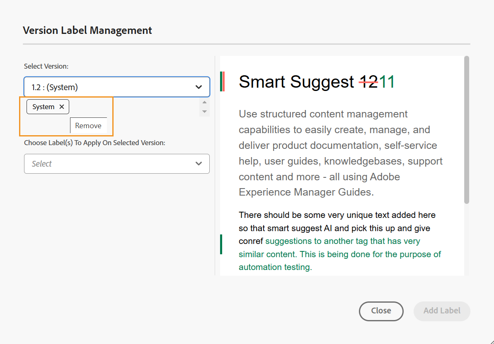

# Utiliser des libellés {#id164JBG0M0T1}

Adobe Experience Manager Guides vous permet d’ajouter des libellés à différentes versions d’un fichier. Vous pouvez utiliser ces libellés pour spécifier la version à inclure dans une ligne de base pour la publication. Pour plus d&#39;informations sur l&#39;utilisation des libellés pour créer une ligne de base, voir [Utilisation d&#39;une ligne de base](generate-output-use-baseline-for-publishing.md#).

Par exemple, si vous souhaitez utiliser *version 1.0* d’une rubrique dans *version 1.0* et *version 1.1* de la même rubrique dans *version 2.0*, vous pouvez ajouter le libellé *version 1.0* au libellé *version 1.0* et *version 2.0* au libellé *version 1.1*.

Une fois que vous avez ajouté les libellés, vous pouvez créer une ligne de base et spécifier la version de la rubrique à inclure pour la publication à l&#39;aide de cette ligne de base. Pour savoir quelle version doit être incluse ou exclue d&#39;une ligne de base, vous pouvez utiliser l&#39;option Historique des versions.

## Ajouter un libellé à partir de l’éditeur

Pour ajouter un libellé à votre rubrique à partir de l’éditeur, procédez comme suit :

1. Dans le panneau Référentiel, accédez à une rubrique et ouvrez-la dans l’éditeur.
1. Sélectionnez **Libellé de version** dans le menu déroulant **Menu**.

   {width="400" align="left"}

   La boîte de dialogue **Gestion des libellés de version** s’affiche.

1. Dans la boîte de dialogue **Gestion des libellés de version**, sélectionnez la version à laquelle vous souhaitez ajouter un libellé.
1. Sélectionnez un libellé pour la version sélectionnée, puis sélectionnez **Ajouter un libellé**.

   {width="650" align="left"}

   >[!NOTE]
   >
   > Vous ne pouvez pas ajouter le même libellé aux différentes versions d&#39;une rubrique. Cependant, vous pouvez ajouter plusieurs libellés à la même version d’une rubrique.
1. Confirmer pour appliquer les libellés dans l’invite de confirmation.

   Les libellés s’affichent dans l’historique des versions de la rubrique sélectionnée.

   {width="650" align="left"}

   >[!NOTE]
   >
   > A l&#39;aide d&#39;une ligne de base, vous pouvez ajouter un libellé à plusieurs rubriques. Pour plus d&#39;informations sur l&#39;ajout de libellés à l&#39;aide d&#39;une ligne de base, voir [Ajouter des libellés à une ligne de base](generate-output-use-baseline-for-publishing.md#id184KD0T305Z).

Pour supprimer un libellé de version d’une rubrique, utilisez l’icône **Supprimer** associée à chaque libellé ajouté dans la boîte de dialogue Gestion des libellés de version.

{align="left"}

## Utilisation des libellés de l’interface utilisateur d’Assets

Vous pouvez également ajouter des libellés à une rubrique et les supprimer de l’interface utilisateur d’Assets selon vos besoins.

Pour ajouter un libellé à votre rubrique à partir de l’interface utilisateur d’Assets, procédez comme suit :

1. Dans l’interface utilisateur d’Assets, sélectionnez une rubrique et ouvrez-la.
1. Sélectionnez l’icône du sélecteur de rail de gauche et sélectionnez **Historique des versions**.
1. Dans le menu déroulant Historique des versions , sélectionnez une version à laquelle vous souhaitez ajouter un libellé.
1. Saisissez un libellé pour la version sélectionnée et appuyez sur Entrée. Par exemple, la version *2.6*.

   >[!NOTE]
   >
   > Vous ne pouvez pas ajouter le même libellé aux différentes versions d&#39;une rubrique. Cependant, vous pouvez ajouter plusieurs libellés à la même version d’une rubrique.

   Les libellés s’affichent dans l’historique des versions de la rubrique sélectionnée. La capture d’écran suivante affiche les libellés *version x.x* et *guide de l’utilisateur* ajoutés à la version mise en surbrillance de la rubrique.

   {width="300" align="left"}

>[!NOTE]
>
> A l&#39;aide d&#39;une ligne de base, vous pouvez ajouter un libellé à plusieurs rubriques. Pour plus d&#39;informations sur l&#39;ajout de libellés à l&#39;aide d&#39;une ligne de base, voir [Ajouter des libellés à une ligne de base](generate-output-use-baseline-for-publishing.md#id184KD0T305Z).

Pour supprimer un libellé de version d’une rubrique, utilisez le bouton **Supprimer** fourni en regard de chaque libellé dans le panneau Historique des versions.

{width="300" align="left"}

**Rubrique parente :**[ Présentation de l’éditeur](web-editor.md)
