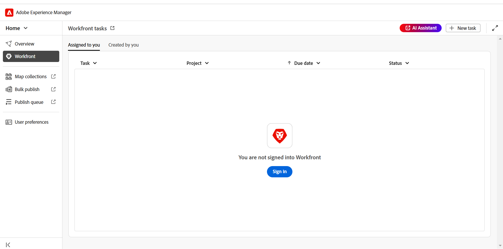
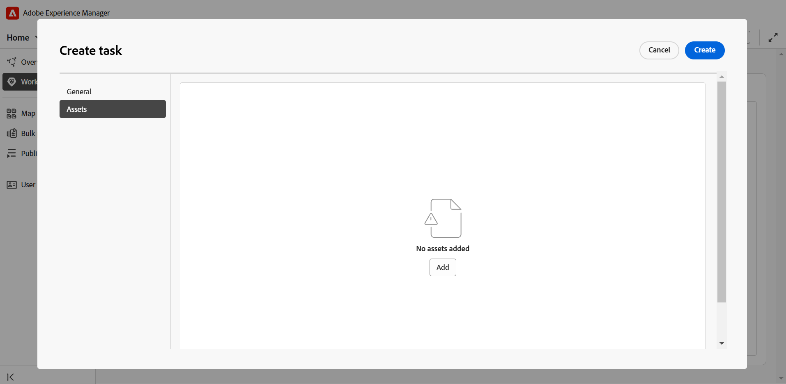

# Intégration de Workfront

Adobe Workfront est une solution de gestion du travail cloud qui aide les équipes et les organisations à planifier, suivre et gérer efficacement leur travail. L’intégration entre Experience Manager Guides et Adobe Workfront vous donne accès à des fonctionnalités de gestion de projet fiables, en plus des fonctionnalités de base du système de gestion de contenu par composant (CCMS) de Experience Manager Guides, ce qui vous permet de planifier, d’affecter et de suivre les tâches efficacement.

Grâce à cette intégration, vous pouvez créer et gérer des tâches Adobe Workfront directement depuis Experience Manager Guides. Par exemple, en tant qu&#39;auteur, vous pouvez créer une tâche de révision (avec une ou plusieurs rubriques ou cartes DITA ajoutées) directement dans l&#39;interface de Experience Manager Guides et l&#39;affecter à un réviseur. En tant que réviseur/réviseuse, vous pouvez travailler sur les tâches affectées dans l’interface utilisateur de révision de Experience Manager Guides et les renvoyer à l’auteur avec des commentaires. De même, vous pouvez créer une tâche de publication et de traduction, puis l’affecter aux utilisateurs qui doivent travailler dessus.

L’intégration vous permet également de surveiller vos files d’attente de travail, en vous assurant que vous restez organisé et au courant de toutes vos tâches (tâches affectées).

**Fonctions clés**

Grâce à l’intégration de Experience Manager Guides et d’Adobe Workfront, vous pouvez :

* Planifiez, attribuez et suivez l’avancement de tâches et de projets individuels sans recourir à de multiples outils non intégrés.
* Gérez tous les workflows Experience Manager Guides, notamment la création, la révision, la publication et la traduction de contenu plus efficacement.
* Recevez des notifications par e-mail d’Adobe Workfront chaque fois que de nouvelles tâches sont affectées. Pour plus d’informations, consultez [Présentation des notifications](https://experienceleague.adobe.com/en/docs/workfront/using/basics/use-notifications/wf-notifications).
* Surveillez l’intégrité du projet à l’aide du tableau de bord intuitif d’Adobe Workfront qui offre des informations en temps réel sur les performances du projet.

  Pour en savoir plus sur les puissantes fonctionnalités de gestion de projet d’Adobe Workfront activées pour les chefs de projet dans Experience Manager Guides, consultez la section [Planifier un projet](https://experienceleague.adobe.com/en/docs/workfront/using/manage-work/projects/plan-a-project/plan-project).

## Commencer

Une fois configurées et activées par votre administrateur, les tâches Adobe Workfront sont accessibles directement depuis la page d&#39;accueil de [Experience Manager Guides](./intro-home-page.md).

Pour accéder aux tâches Adobe Workfront, procédez comme suit :

1. Connectez-vous à Experience Manager Guides et ouvrez la **page d’accueil**.
2. Dans le panneau de gauche, sélectionnez **Workfront**.

   La page **Tâches Workfront** s’affiche.

   {width="800" align="left"}
3. Sélectionnez **Se connecter**.

   Vous êtes redirigé vers la page de connexion d’Adobe Workfront.
4. Connectez-vous à l’aide de la même adresse e-mail que celle utilisée dans Experience Manager Guides, puis sélectionnez **Autoriser l’accès** pour permettre à l’application d’accéder à votre compte Adobe Workfront.

   Vous êtes automatiquement redirigé vers la page **Tâches Workfront** sur Experience Manager Guides.

   {width="800" align="left"}

## Fonctionnalités disponibles sur la page des tâches de Workfront

Les fonctionnalités suivantes sont disponibles sur la page des tâches de Workfront :

* [Nouvelle tâche](#create-workfront-tasks) : permet de créer des tâches Adobe Workfront directement depuis l&#39;interface de Experience Manager Guides.
* [Affecté(e) à vous ](#managing-tasks-assigned-to-you) : répertorie toutes les tâches qui vous sont affectées et qui sont toujours actives.
* [Créé par vous](#managing-tasks-created-by-you) : répertorie toutes les tâches que vous avez créées et qui sont toujours actives.

La page Tâches de Workfront comprend également une  d’icône de lien vers l’extérieur qui, lorsqu’elle est sélectionnée, vous mène à la page du projet Adobe Workfront. Ici, vous pouvez afficher les détails de la tâche, afficher des commentaires, ajouter des commentaires et accéder à d’autres fonctionnalités en fonction des autorisations mappées avec votre compte Adobe Workfront.

Pour plus d’informations, consultez [Aperçu des dates de projet, de tâche et d’événement dans Workfront](https://experienceleague.adobe.com/en/docs/workfront/using/basics/navigate/definitions-pti-dates).

### Création de tâches Workfront

Vous pouvez créer des tâches Adobe Workfront directement à partir de l’interface Experience Manager Guides à l’aide du bouton **Nouvelle tâche** présent sur la page des tâches Workfront.

Pour créer une tâche Adobe Workfront, procédez comme suit :

1. Sur la page des tâches de Workfront, sélectionnez **Nouvelle tâche**.

   La boîte de dialogue **Créer une tâche** s’affiche.

   {width="650" align="left"}
2. Dans l&#39;onglet **Général**, renseignez les détails de la tâche :

   * **Type de tâche** : sélectionnez le type de tâche que vous souhaitez créer. Les options disponibles sont les suivantes : **Création**, **Révision**, **Publication** et **Traduction**.
   * **Projet** : sélectionnez le projet à l’intérieur duquel vous souhaitez créer la tâche.
   * **Nom de la tâche** : saisissez un nom explicite pour la tâche.
   * **Description** : saisissez une brève description de la tâche.
   * **Échéance le** : définissez la date d’échéance de la tâche.
   * **Personne désignée** : sélectionnez une personne désignée pour la tâche.
3. Dans l’onglet **Assets**, sélectionnez **Ajouter** pour ajouter une ressource à cette tâche.

   {width="650" align="left"}

   * Pour les tâches de création, de publication et de traduction, vous êtes invité à sélectionner l’emplacement du fichier requis dans la boîte de dialogue **Sélectionner le chemin**. Le fichier sélectionné (rubrique pour la création et le mappage pour la publication et la traduction) est ajouté à la tâche dès que le bouton **Créer** est sélectionné.

     {width="650" align="left"}

   * Pour les tâches de révision, vous êtes d’abord invité à sélectionner le type de ressource (Carte ou Rubriques), puis les fichiers sélectionnés s’affichent comme suit :

     {width="650" align="left"}

     *Ajout de rubriques à une tâche de révision*

     {width="650" align="left"}

     *Ajout de mappages à une tâche de révision*

     Les actions suivantes sont disponibles pour modifier votre sélection avant l’envoi pour révision :

      * Désélectionnez certaines rubriques de la liste.
      * Filtrez la liste de rubriques en fonction de l’état du document.
      * Modifiez ou définissez la version des rubriques sélectionnées sur **Dernière version**, **Version selon les dates** et **Ligne de base** (disponible uniquement pour les cartes) selon les besoins.

     Pour plus d’informations, consultez [envoi de rubriques pour révision](./review-send-topics-for-review.md).

   >[!NOTE]
   >
   > L’ajout d’une ressource à une tâche permet aux personnes désignées d’accéder rapidement à une rubrique, à un mappage ou à tout autre fichier sur lequel elles doivent travailler. Pour les tâches de création, de publication et de traduction, l’ajout d’une ressource est facultatif, mais peut s’avérer utile pour rationaliser les workflows. Toutefois, pour les tâches de révision, l’ajout d’une ressource est obligatoire.

4. Sélectionnez **Créer**.

Une nouvelle tâche est créée et répertoriée sous l’onglet **Créée par vous**.

>[!NOTE]
>
> En tant que chef de projet, vous pouvez afficher cette nouvelle tâche dans votre tableau de bord Adobe Workfront, ainsi que d’autres détails importants sur la tâche. Pour plus d’informations, voir [Présentation des tableaux de bord](https://experienceleague.adobe.com/en/docs/workfront/using/reporting/dashboards/understand-dashboards/understand-dashboards).

### Gestion des tâches que vous avez créées

Toutes les tâches que vous avez créées et qui sont toujours actives s’affichent dans l’onglet **Créées par vous** de la page des tâches de Workfront, vous donnant les détails clés de la tâche, tels que le nom du projet, les personnes désignées, la date de création de la tâche, la date d’achèvement de la tâche et le statut de la tâche.

{width="800" align="left"}

Les options suivantes sont disponibles lorsque vous pointez sur une tâche présente dans l’onglet Créé par vous :

**Ouvert** - 

Permet d’ouvrir la tâche. Selon le type de la tâche, elle s’ouvre dans l’éditeur, la console de mappage ou l’interface utilisateur de révision.

**Modifier** - 

Permet de modifier les détails de la tâche ajoutée lors de sa création. Tous les champs sont modifiables, à l’exception du type de tâche et du projet. Vous pouvez uniquement modifier les tâches que vous avez créées. Les tâches affectées ne peuvent pas être modifiées.

Vous pouvez également ajouter ou supprimer des ressources lors de la modification d’une tâche de création, de publication ou de traduction. Cependant, pour une tâche de révision, vous ne pouvez modifier que la version des ressources envoyées pour révision.

**Détails de la tâche** - 

Affiche les informations sur la tâche, y compris les détails saisis lors de la création de la tâche, le statut de la tâche et les ressources ajoutées.

### Gestion des tâches qui vous sont assignées

Toutes les tâches qui vous sont affectées et qui sont toujours actives sont affichées dans l’onglet **Affectées à vous** de la page des tâches de Workfront, vous donnant les détails clés de la tâche, tels que le nom du projet, les personnes désignées, la date d’échéance et le statut de la tâche.

{width="800" align="left"}

Les options suivantes sont disponibles lorsque vous pointez sur une tâche présente dans l’onglet Affecté à vous :

**Ouvert** - 

Permet d’ouvrir la tâche. Selon le type de la tâche, elle s’ouvre dans l’éditeur, la console de mappage ou l’interface utilisateur de révision.

**Détails de la tâche** - 

Affiche les informations sur la tâche, y compris les détails saisis lors de la création de la tâche, le statut de la tâche et les ressources ajoutées.

{width="800" align="left"}

#### Accès aux tâches affectées à partir de la section Aperçu

Vous pouvez également accéder aux tâches Adobe Workfront qui vous sont assignées à partir de la [section Aperçu](./intro-home-page.md#overview). La section Présentation , lorsqu’elle est sélectionnée, propose différents widgets qui vous permettent de rester concentré et organisé.

**Vos tâches** est l’un de ces widgets dans lequel la liste des tâches Adobe Workfront (qui vous sont affectées et qui sont toujours actives) s’affiche avec les détails clés de la tâche, y compris le nom de la tâche, le projet associé, la date d’échéance et le statut actuel.

{width="800" align="left"}

Tout comme l’onglet Qui vous est affecté, le widget Vos tâches fournit également des options pour **Ouvrir** et afficher **Détails de la tâche** lorsque vous passez la souris sur une tâche.

Le widget vous offre également des options pour trier et redimensionner les colonnes pour une vue personnalisée. Pour appliquer un tri à une colonne, sélectionnez l’en-tête de colonne et les options s’affichent dans une liste. Pour ajuster la largeur d’une colonne, passez le curseur au-dessus de la ligne de séparation des colonnes dans l’en-tête, puis faites glisser pour la redimensionner.

>[!NOTE]
>
> En dehors de votre interface Experience Manager Guides, vous recevez une notification par e-mail d’Adobe Workfront pour toute nouvelle tâche attribuée. Pour extraire ces tâches, connectez-vous à votre instance Experience Manager Guides et accédez aux tâches affectées.

## Utilisation des tâches affectées Adobe Workfront

Il existe quatre types de tâches Adobe Workfront que vous pouvez créer, puis affecter, ou sur lesquelles vous pouvez travailler lorsqu’elles sont affectées dans Experience Manager Guides :

1. [Tâches de création](#authoring-tasks)
2. [Tâches de révision](#review-tasks)
3. [Tâches de traduction](#translation-tasks)
4. [Publication de tâches](#publishing-tasks)

Les sections suivantes vous guident tout au long du processus détaillé de traitement des tâches Adobe Workfront affectées.

### Tâches de création

Effectuez les étapes suivantes pour travailler sur une tâche de création :

1. Accédez à la tâche à partir de la section [Aperçu](#accessing-assigned-tasks-from-overview-section) ou de l’onglet [Affecté à vous](#managing-tasks-assigned-to-you).

   {width="650" align="left"}

   *Tâche de création dans l’onglet Affecté à vous*

   {width="650" align="left"}

   *Tâche de création dans le widget Vos tâches*
2. Pointez sur la tâche sur laquelle vous souhaitez travailler et sélectionnez    pour l&#39;ouvrir. Vous pouvez également ouvrir la tâche en la sélectionnant simplement.

   Toutes les tâches de création s’ouvrent dans l’éditeur.
3. Passez en revue les détails de la tâche dans l’onglet **Détails** et sélectionnez le fichier **Ressource** pour l’ouvrir.

   {width="650" align="left"}

4. Effectuez les modifications requises et sélectionnez **Marquer comme terminé**.
5. Passez à l’onglet **Commentaires** pour ajouter un commentaire à cette tâche. Ces commentaires, ajoutés au niveau de la tâche, seront également répercutés sur le tableau de bord du projet Adobe Workfront.

   >[!NOTE]
   >
   > Une fois la tâche marquée comme terminée, elle est supprimée à la fois de la liste des tâches qui vous a été assignée et de la liste des tâches **Créée par vous** de l’initiateur de la tâche.

### Tâches de révision

En tant que réviseur/réviseuse, vous pouvez réviser les tâches de révision Adobe Workfront qui vous sont affectées.

Effectuez les étapes suivantes pour travailler sur une tâche de révision qui vous est assignée.

1. Accédez à la tâche à partir de la section [Aperçu](#accessing-assigned-tasks-from-overview-section) ou de l’onglet [Affecté à vous](#managing-tasks-assigned-to-you).

   {width="650" align="left"}

   *Tâche de révision dans l’onglet Affecté à vous*

   {width="650" align="left"}

   *Tâche de création dans le widget Vos tâches*
2. Pointez sur la tâche sur laquelle vous souhaitez travailler et sélectionnez    pour l&#39;ouvrir. Vous pouvez également ouvrir la tâche en la sélectionnant simplement.

   Pour les réviseurs, la tâche de révision s’ouvre dans l’**interface utilisateur de révision**.

   {width="650" align="left"}

3. Effectuez la révision requise. Pour plus d’informations sur la révision d’une rubrique, voir [réviser les rubriques](./review-topics.md).
4. Une fois la révision terminée, sélectionnez **Marquer comme terminé**.
5. Passez à l’onglet **Commentaires** pour ajouter un commentaire à cette tâche. Ces commentaires, ajoutés au niveau de la tâche, seront également répercutés sur le tableau de bord du projet Adobe Workfront.

Le marquage de la tâche comme étant effectuée par le réviseur ou la réviseuse n’indique pas l’achèvement de la tâche. Toutes les tâches de révision sont réaffectées à l’utilisateur qui a créé la tâche (dans l’idéal, un auteur qui a demandé une révision).

>[!NOTE]
>
> Si la tâche est affectée à plusieurs réviseurs et réviseuses, elle n’est réaffectée au créateur ou à la créatrice de la tâche qu’une fois que tous les réviseurs et réviseuses l’ont marquée comme terminée.

Les tâches de révision réaffectées au créateur/aux auteurs pour l’incorporation de révision sont accessibles à partir de la section [Aperçu](#accessing-assigned-tasks-from-overview-section) ou de l’onglet [Affecté à vous](#managing-tasks-assigned-to-you).

{width="800" align="left"}

*Tâche de révision renvoyée aux auteurs*

Pour ces tâches, l’état de la tâche de la personne désignée devient **Création** tandis que le type de tâche reste **Révision**. Ce changement d’état se produit lorsque la révision est terminée par tous les réviseurs.

{width="300" align="left"}

Si vous sélectionnez la tâche ou l’icône d’ouverture  ouvre la tâche dans l’éditeur, où l’auteur peut [adresser les commentaires de révision](../user-guide/review-address-review-comments.md), modifier la tâche en mettant à jour la version des rubriques, puis réaffecter la tâche au réviseur ou à la réviseuse si nécessaire.

L’auteur peut également modifier la tâche et l’affecter à un autre auteur, lui déléguant la tâche d’incorporer les commentaires. Pour ce faire, sélectionnez **Modifier**, modifiez l’état de la tâche en **Création**, puis sélectionnez **Modifier la personne désignée**. Vous pouvez désormais sélectionner une personne désignée dans la liste.

Ce processus forme un cycle continu, dans lequel la tâche passe de l’auteur au réviseur et vice versa jusqu’à ce qu’elle soit entièrement terminée. Une fois toutes les modifications suggérées intégrées, l’auteur peut terminer la tâche en sélectionnant **Marquer comme terminé**.

### Tâches de traduction

Vous pouvez effectuer différentes actions de traduction sur les tâches de traduction Adobe Workfront qui vous sont affectées.

Effectuez les étapes suivantes pour travailler sur une tâche de traduction :

1. Accédez à la tâche à partir de la section [Aperçu](#accessing-assigned-tasks-from-overview-section) ou de l’onglet [Affecté à vous](#managing-tasks-assigned-to-you).

   {width="650" align="left"}

   *Tâche de traduction dans l’onglet Affecté à vous*

   {width="650" align="left"}

   *Tâche de traduction dans le widget Vos tâches*

2. Pointez sur la tâche sur laquelle vous souhaitez travailler et sélectionnez    pour l’ouvrir dans la **console Mappage**. Vous pouvez également ouvrir la tâche en la sélectionnant simplement.
3. Vérifiez les détails de la tâche et le fichier ajouté pour la traduction.

   {width="650" align="left"}
4. Accédez à l’onglet **Traduction** pour les différentes options de traduction. Découvrez comment [traduire du contenu](../user-guide/translation.md) dans Experience Manager Guides.
5. Effectuez la traduction requise et sélectionnez **Envoyer pour traduction**.
   {width="650" align="left"}
6. Accédez à la section **Workfront** et sélectionnez **Marquer comme terminé** pour indiquer que la tâche est terminée.
7. Passez à l’onglet **Commentaires** pour ajouter un commentaire à cette tâche. Ces commentaires, ajoutés au niveau de la tâche, seront reflétés dans le tableau de bord du projet Adobe Workfront.

   >[!NOTE]
   >
   > Une fois la tâche marquée comme terminée, elle est supprimée à la fois de la liste des tâches qui vous a été assignée et de la liste des tâches **Créée par vous** de l’initiateur de la tâche.

### Publication de tâches

En tant qu’éditeur, vous pouvez afficher les détails et publier une tâche de publication qui vous est assignée.

Effectuez les étapes suivantes pour travailler sur une tâche de publication :

1. Accédez à la tâche à partir de la section [Aperçu](#accessing-assigned-tasks-from-overview-section) ou de l’onglet [Affecté à vous](#managing-tasks-assigned-to-you).

   {width="650" align="left"}

   *Publication de la tâche dans l’onglet Affecté à vous*

   {width="650" align="left"}

   *Publication de la tâche dans le widget Vos tâches*
2. Pointez sur la tâche sur laquelle vous souhaitez travailler et sélectionnez    pour l’ouvrir dans la **console Mappage**. Vous pouvez également ouvrir la tâche en la sélectionnant simplement.
3. Vérifiez les détails de la tâche et le fichier ajouté pour publication.

   {width="650" align="left"}
4. Accédez aux **Paramètres prédéfinis de sortie** et effectuez les actions de publication requises pour publier la tâche. Pour plus d’informations, consultez la section [Présentation des paramètres prédéfinis de sortie](../user-guide/generate-output-understand-presets.md/).
5. Une fois la publication terminée, accédez à la section **Workfront** et sélectionnez **Marquer comme terminé** pour indiquer que la tâche est terminée.
6. Passez à l’onglet **Commentaires** pour ajouter un commentaire à cette tâche. Ces commentaires, ajoutés au niveau de la tâche, seront répercutés sur le tableau de bord du projet Workfront.

   >[!NOTE]
   >
   > Une fois la tâche marquée comme terminée, elle est supprimée à la fois de la liste des tâches qui vous a été assignée et de la liste des tâches **Créée par vous** de l’initiateur de la tâche.