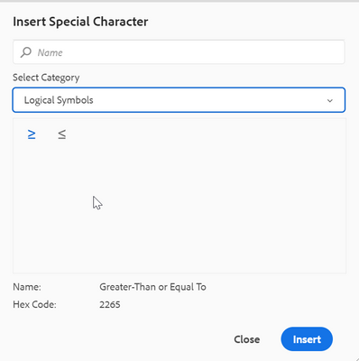

# Configuration de caractères spéciaux supplémentaires dans la barre d’outils de l’éditeur web

Il existe une option de raccourci dans la barre d’outils de l’éditeur web pour permettre à l’auteur d’insérer déjà les caractères spéciaux.
On peut voir la même chose dans la capture d&#39;écran ci-dessous :


Cette liste de caractères est configurable ici. Si vous devez ajouter d’autres caractères, procédez comme suit :

+ Connectez-vous à AEM et ouvrez le mode CRXDE Lite.

+ Créez le fichier Symboles.json à l’emplacement suivant : &#39;/apps/fmdita/xmleditor/&#39; (Vous pouvez copier la valeur par défaut à partir de l’emplacement &quot;/libs/fmdita/clientlibs/clientlibs/xmleditor/symbols.json&quot;).

+ Ajoutez la définition de caractère spécial dans le fichier symboles.json en tant que :

```
{
      "label": "Logical Symbols",
      "items": [
        {
          "name": "≥",
          "title": "Greater-Than or Equal To"
        },
        {
          "name": "≤",
          "title": "Smaller-Than or Equal To"
        }
      ]
}
```

La structure du fichier symboles.json est expliquée ci-dessous :

+ &quot;label&quot;: &quot;Symboles logiques&quot;: permet de spécifier la catégorie des caractères spéciaux. Dans le fragment de code, une catégorie nommée &quot;Symbole logique&quot; est définie.

+ &quot;items&quot; : définit la collection de caractères spéciaux dans la catégorie.

+ &quot;name&quot;: &quot;≥&quot;, &quot;title&quot;: &quot;Greater-Than or Equal To&quot;: c’est la définition du caractère spécial. Il commence par le libellé &quot;name&quot;, qui ne doit pas être modifié. Le nom est suivi du caractère spécial. Le &quot;titre&quot; est le nom ou le titre du caractère spécial qui apparaît comme info-bulle pour ce caractère spécial.

Vous pouvez définir plusieurs définitions de caractères spéciaux dans une catégorie.

Une autre catégorie est alors ajoutée dans la boîte de dialogue Caractères spéciaux :




>[!MORELIKETHIS]
>
>+ [Guide d&#39;installation et de configuration](https://helpx.adobe.com/content/dam/help/en/xml-documentation-solution/3-6/XML-Documentation-for-Adobe-Experience-Manager_Installation-Configuration-Guide_EN.pdf)
