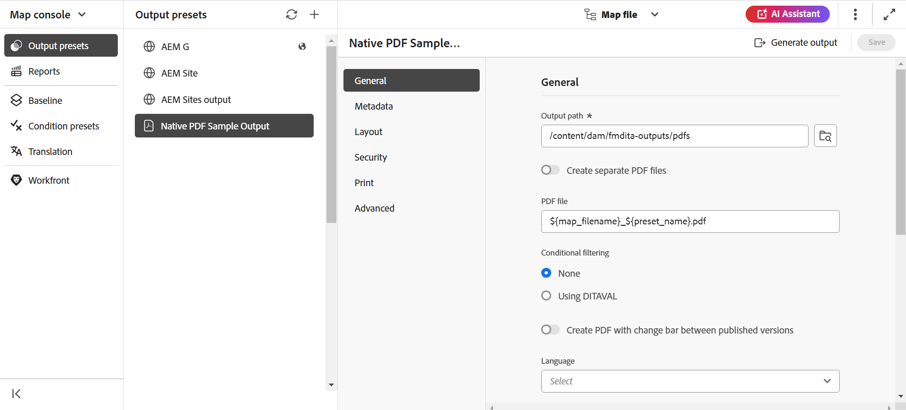

# Sortie Publish PDF

Avec AEM Guides, vous pouvez générer des PDF de rubriques individuelles ou d’un fichier de mappage entier. Vous pouvez publier votre contenu dans un format PDF à l’aide de l’une des trois méthodes suivantes :

* **DITA-OT**

Utilisez cette méthode pour générer une sortie de PDF pour une carte à partir du tableau de bord de carte. Vous pouvez définir les propriétés de publication avant de générer le PDF en créant un paramètre prédéfini de sortie pour la carte ouverte dans le tableau de bord de la carte. Pour créer ou modifier un paramètre prédéfini de sortie, reportez-vous à la section *Comprendre les paramètres prédéfinis de sortie* du [ Guide de l’utilisateur as a Cloud Service AEM Guides](https://helpx.adobe.com/content/dam/help/en/xml-documentation-solution/cs-apr-22/XML-Documentation-for-Adobe-Experience-Manager_CS_User-Guide_EN.pdf).

Pour plus d’informations sur la génération d’un PDF à l’aide de la méthode DITA-OT, voir [Générer un PDF à l’aide de DITA-OT](https://help.adobe.com/en_US/xml-documentation-for-adobe-experience-manager/index.html#t=DXML-master-map%2Fgenerate-output-pdf.html).

* **FrameMaker Publishing Server (FMPS)**

Utilisez cette méthode pour générer une sortie de PDF à partir non seulement du contenu DITA, mais également des documents de FrameMaker (.book et .fm) disponibles dans votre référentiel AEM. Le PDF peut être créé en configurant un paramètre prédéfini de sortie et publié à l’aide de FrameMaker Publishing Server (FMPS). Vous pouvez concevoir et configurer l’aspect de votre sortie pour les formats PDF et autres, puis les stocker dans un fichier de paramètres (.sts). Ce fichier de paramètres est ensuite utilisé par FMPS pour générer une sortie pour un mappage DITA ou un fichier .book. Pour créer ou modifier un paramètre prédéfini de sortie, consultez la section *Comprendre les paramètres prédéfinis de sortie* du [ Guide de l’utilisateur as a Cloud Service AEM Guides](https://helpx.adobe.com/content/dam/help/en/xml-documentation-solution/cs-apr-22/XML-Documentation-for-Adobe-Experience-Manager_CS_User-Guide_EN.pdf).

Pour plus d&#39;informations sur la configuration de FMPS, voir [Générer une sortie à partir de documents de FrameMaker](https://help.adobe.com/en_US/xml-documentation-for-adobe-experience-manager/index.html#t=DXML-master-map%2Ffm-output-generatation.html).

* **Publication de PDF natif**

Utilisez cette méthode pour générer une sortie de PDF riche en fonctionnalités basée sur les normes W3C CSS3 et CSS paged Media. Avec la publication avec des PDF natifs, vous pouvez utiliser des modèles pour définir la mise en page et le style de votre contenu et appliquer divers paramètres pour affiner votre PDF. En outre, vous pouvez modifier et créer vos propres modèles à l’aide de l’éditeur de modèles.

Pour plus d’informations sur la publication de PDF natif, voir [Utilisation de la publication de PDF natif](#native-pdf-publishing).

## Utilisation de la publication de PDF natif {#native-pdf-publishing}

Lors de la création de contenu, il devient essentiel de s’assurer que le contenu est optimisé pour l’affichage, la modification et l’impression. Grâce à des normes telles que le W3C CSS3 pour le style de contenu et les normes de médias paginés CSS pour les propriétés de définition de page telles que la taille, les marges, l’orientation, les sauts de page, les en-têtes, les pieds de page et la numérotation de pages, vous pouvez définir l’affichage et la mise en page de votre document de PDF pour garantir la cohérence et la convivialité. La fonction de publication de PDF natif utilise ces normes pour générer un PDF.

Avec la publication native de PDF, vous pouvez utiliser des modèles prédéfinis pour assurer la cohérence de la disposition et de la structure du contenu, appliquer des feuilles de style pour modifier l’aspect de votre sortie, optimiser le PDF, définir des repères d’impression, permettre la prise en charge des lecteurs d’écran, définir la conformité du PDF, incorporer des polices, etc.

La génération d’un PDF à l’aide de la publication d’un PDF natif comporte deux aspects :

* Utilisez les modèles pour appliquer un style au contenu, définir des mises en page et divers paramètres afin d’affiner votre PDF. Les auteurs peuvent choisir d’utiliser/de modifier les exemples de modèles fournis ou de créer des modèles personnalisés et de définir des options de configuration avancées utilisées par les éditeurs et les développeurs.

* Créez ou configurez un paramètre prédéfini de sortie du PDF pour contrôler les paramètres du PDF. Une fois que vous avez créé un paramètre prédéfini de sortie de PDF, vous pouvez générer le PDF.

Pour plus d’informations, voir [Générer une sortie de PDF](#generate-pdf-output).

## Création d’un paramètre prédéfini de sortie PDF {#create-output-preset}

La première étape de la génération d’une sortie de PDF consiste à créer un paramètre prédéfini de sortie de PDF, qui est un ensemble de propriétés de publication affectées à un mappage. Vous pouvez créer un paramètre prédéfini de sortie pour n’importe quel mappage ouvert dans le panneau Affichage des cartes ou configurer un paramètre prédéfini existant afin de générer rapidement un PDF pour le même mappage.

À partir du paramètre prédéfini de sortie du PDF, vous pouvez sélectionner un modèle, appliquer des conditions, définir des restrictions pour contrôler l’interaction d’un utilisateur avec votre PDF, configurer des paramètres avancés tels que la compression, la conformité, etc.

Pour créer ou configurer un paramètre prédéfini de sortie de PDF :

1. Dans l’onglet Sortie, cliquez sur **Paramètres prédéfinis** dans la barre latérale gauche.
Le panneau Paramètre prédéfini s’ouvre.  

1. Dans le panneau de sortie **Paramètres prédéfinis**, effectuez l’une des opérations suivantes :
   * Double-cliquez sur un paramètre prédéfini de sortie de PDF prédéfini pour l’afficher.
   * Cliquez sur l’icône + en regard de **Paramètres prédéfinis** pour ajouter un nouveau paramètre prédéfini de sortie **Type : PDF**

1. Pour configurer les paramètres d’un paramètre prédéfini de PDF existant :
   * Cliquez sur l’icône **Options**  en regard du paramètre prédéfini de sortie de votre choix et sélectionnez **Modifier**.
Vous pouvez utiliser les paramètres suivants dans les onglets **Général**, **Métadonnées**, **Disposition**, **Sécurité** et **Avancé** pour configurer un paramètre prédéfini de sortie de PDF :

**Général**

Utilisez pour spécifier les paramètres de sortie de base, tels que le chemin de sortie, le nom de fichier du PDF, etc.

| Configuration | Description |
| --- | --- |
| **Chemin de sortie** | Chemin d’accès dans le référentiel AEM où est stockée la sortie du PDF. Assurez-vous que le chemin d’accès de sortie ne se trouve pas dans le dossier du projet. Si rien n’est indiqué, la sortie est générée à l’emplacement de sortie du mappage DITA par défaut. Vous pouvez également utiliser les variables d’usine suivantes pour définir le chemin de sortie. Vous pouvez utiliser une seule ou une combinaison de variables pour définir cette option.   `${map_filename}` : utilise le nom des fichiers de mappage DITA pour créer le chemin de destination.   `${map_title}` : utilise le titre du mappage DITA pour créer le chemin de destination.  `${preset_name}` : utilise le nom du paramètre prédéfini de sortie pour créer le chemin de destination.   `${language_code}` : utilise le code de langue où se trouve le fichier map pour créer le chemin d’accès de destination.   `${map_parentpath}` : utilise le chemin d’accès complet du fichier map pour créer le chemin d’accès de destination.   `${path_after_langfolder}` : utilise le chemin d’accès du fichier map situé après le dossier language pour créer le chemin d’accès de destination. |
| **Fichier PDF** | Indiquez un nom de fichier pour l’enregistrement du PDF. Par défaut, le nom de fichier du PDF ajoute le nom du mappage DITA avec le nom du paramètre prédéfini. Par exemple, ditamap est &quot;TestMap&quot; et le nom du paramètre prédéfini est &quot;preset1&quot;. Le nom par défaut du pdf sera &quot;TestMap_preset1.pdf&quot;.  Vous pouvez également utiliser les variables d&#39;usine suivantes pour définir le fichier du PDF. Vous pouvez utiliser une seule ou une combinaison de variables pour définir cette option.  `${map_filename}` `${map_title}` `${preset_name}`   `${language_code}`. |
| **Appliquer des conditions à l’aide de** | Pour le contenu conditionnel, choisissez l’une des options ci-dessous afin de générer une sortie PDF basée sur ces conditions :  <ul> <li> **Aucun appliqué** Sélectionnez cette option si vous ne souhaitez appliquer aucune condition sur le mappage et le contenu source.  <li> **Fichier itaval** Sélectionnez un fichier DITAVAL pour générer du contenu conditionnel. Pour sélectionner, cliquez sur paramètre prédéfini de condition et recherchez le fichier.   <li> **Paramètre prédéfini de condition** Sélectionnez un paramètre prédéfini de condition dans la liste déroulante pour appliquer une condition lors de la publication de la sortie. Cette option est visible si vous avez ajouté une condition pour le fichier de mappage DITA. Les paramètres conditionnels sont disponibles dans l’onglet Paramètres prédéfinis de condition de la console de mappage DITA. Pour en savoir plus sur les paramètres prédéfinis de condition, voir [Utiliser les paramètres prédéfinis de condition](https://help.adobe.com/en_US/xml-documentation-for-adobe-experience-manager/index.html#t=DXML-master-map%2Fgenerate-output-use-condition-presets.html).   </ul> |
| **Utiliser la ligne de base** | Si vous avez créé une ligne de base pour le mappage DITA sélectionné, sélectionnez cette option pour spécifier la version que vous souhaitez publier. Pour plus d’informations, voir [Utilisation de la ligne de base](https://help.adobe.com/en_US/xml-documentation-for-adobe-experience-manager/index.html#t=DXML-master-map%2Fgenerate-output-use-baseline-for-publishing.html) . |
| **Créer un PDF avec une barre de modification entre les versions publiées** | Utilisez les options suivantes pour créer un PDF affichant les différences de contenu entre deux versions à l’aide de barres de modification :    <ul><li> **Baseline of the Previous Version** Sélectionnez la version de base que vous souhaitez comparer à la version actuelle ou à une autre ligne de base. Une barre de modification s’affiche dans le PDF pour indiquer le contenu modifié. Une barre de modification est une ligne verticale qui identifie visuellement le contenu nouveau ou révisé. La barre de modification s’affiche à gauche du contenu qui a été inséré, modifié ou supprimé.   **Remarque** : si vous sélectionnez **Utiliser la ligne de base** et choisissez une ligne de base à publier, la comparaison sera effectuée entre les deux versions de ligne de base sélectionnées. Par exemple, si vous choisissez la version de base 1.3 sous **Utiliser la ligne de base** et la version 1.1 sous **la ligne de base de la version précédente**, la comparaison sera effectuée entre la version de base 1.1 et la version de base 1.3.  <li> **Afficher le texte ajouté** Sélectionnez cette option pour afficher le texte inséré en vert et souligné. Cette option est sélectionnée par défaut.   <li> **Afficher le texte supprimé** Sélectionnez cette option pour afficher le texte supprimé en rouge et le texte barré. Cette option est sélectionnée par défaut.  **Remarque** Vous pouvez également personnaliser le style de la barre de modification, du contenu inséré ou du contenu supprimé à l’aide de la feuille de style. </ul> |
| **Workflow de génération de Post** | Sélectionnez cette option pour afficher une liste déroulante contenant tous les workflows configurés dans AEM. Vous pouvez sélectionner le workflow à exécuter une fois le workflow de génération de PDF terminé. |

**Métadonnées**

Les métadonnées sont la description ou la définition de votre contenu. Les métadonnées aident à la gestion de contenu et à la recherche de fichiers sur Internet.

Utilisez l’onglet Métadonnées pour définir les champs de métadonnées tels que le nom de l’auteur, le titre du document, les mots-clés, les informations de copyright et d’autres champs de données pour la sortie du PDF. Vous pouvez également ajouter des métadonnées personnalisées pour la sortie de votre PDF.

Ces métadonnées sont mappées aux métadonnées dans l’onglet **Description** de la **propriété du document** de votre PDF de sortie.

Dans les paramètres prédéfinis de sortie, sélectionnez **PDF** > **Native-PDF** > **Métadonnées** pour ajouter et personnaliser des options de métadonnées.
* **Utiliser les métadonnées ajoutées dans topicmeta**

  Cette option est sélectionnée par défaut. Vous pouvez utiliser les métadonnées que vous avez ajoutées dans l’élément topicmeta du mappage DITA pour renseigner les champs de métadonnées de la sortie du PDF.

* **Fournir un fichier XMP**

  Vous pouvez également remplir directement les champs de métadonnées en important le fichier [XMP](https://www.adobe.com/products/xmp.html) (Extensible Metadata Platform). Vous pouvez télécharger un exemple de fichier XMP ici.

[Télécharger](assets/SampleXMP.xmp)

  Vous pouvez également générer un fichier XMP à l’aide d’Adobe Acrobat.
   1. Cliquez sur **Fichier** > **Propriétés** dans Acrobat.
   1. Sous **Description**, cliquez sur **Métadonnées supplémentaires**.
   1. Dans le panneau de gauche, sélectionnez **Avancé**.
   1. Cliquez sur **Enregistrer**.

  XMP fichier est enregistré sur l’appareil.

* **Fournir des noms et des valeurs de métadonnées**

   1. Ajoutez un nom en le sélectionnant dans la liste déroulante ou ajoutez une métadonnée personnalisée en saisissant directement dans le champ du nom.
   1. Saisissez la valeur des métadonnées et cliquez sur l’icône &quot;+&quot;.
Les métadonnées sont ajoutées à la liste des métadonnées du PDF.

Vous pouvez également utiliser des variables pour définir les valeurs de métadonnées.  Vous pouvez utiliser les métadonnées définies pour le mappage DITA ou le fichier bookmap comme variables. Les métadonnées se trouvent sous le noeud `/jcr:content/metadata` du mappage DITA ou du fichier bookmap.
Lorsque vous utilisez une variable, sa valeur est sélectionnée dans les propriétés de métadonnées.

Pour utiliser une variable, vous devez la définir au format `${<variable>}`.

Par exemple, une des propriétés de métadonnées définies dans le noeud /`jcr:content/metadata` est
`dc:title`. Vous pouvez spécifier `${dc:title}` et la valeur de titre est utilisée dans la sortie finale.

Vous pouvez utiliser une seule ou une combinaison de variables pour définir les métadonnées. Par exemple, `${dc:title} ${dc:docstate}`. Vous pouvez également combiner une variable à une chaîne.  Par exemple, `View ${dc:title} in ${dc:language}`.

Utilisez des variables de langue pour définir la valeur localisée des propriétés de métadonnées. Selon la langue choisie, la valeur localisée est automatiquement sélectionnée dans la sortie du PDF. Par exemple, vous pouvez imprimer &quot;Auteur&quot; comme valeur de métadonnées en anglais et &quot;Autorin&quot; en allemand.

Format : `${lng:<variable name>}`. Par exemple, `${lng:author-label}` où `author-label` est une variable de langue.

Survol  près de l’option pour afficher plus de détails à son sujet.

**Disposition**

Utilisez pour définir des mises en page et des options de page vue pour la sortie du PDF, telles que l’affichage de la page et les niveaux de zoom.

| Configuration | Description |
| --- | --- |
| **Modèle de PDF** | Les modèles PDF fournissent une structure claire pour définir la mise en page, le style du contenu et l’application de divers paramètres à la sortie du PDF. Sélectionnez dans la liste déroulante Modèle de PDF pour choisir le modèle de votre choix.   Vous pouvez également sélectionner **Parcourir le modèle**  pour choisir un modèle. Dans la boîte de dialogue **Sélectionner le modèle de PDF**, vous pouvez également prévisualiser la miniature et afficher le titre et la description du modèle sélectionné. |
| **Affichage de page** | Utilisez l’affichage de page pour une page vue qui indique comment le PDF s’affiche à l’ouverture. Sélectionnez dans la liste déroulante Affichage de page pour choisir la vue souhaitée.  <ul><li> **Par défaut** S’affiche selon le paramètre par défaut de la visionneuse du PDF sur la machine d’un utilisateur.    <li> **Une seule page vue** Affiche une page à la fois.     <li> **Défilement d’une seule page** : affiche une seule page dans une colonne verticale continue.    <li> **Deux pages vues** : affiche la propagation de deux pages côte à côte à la fois. .  <li> **Défilement de deux pages** : affiche une propagation de deux pages côte à côte avec défilement continu. </ul> |
| **Zoom** | Sélectionnez cette option pour redimensionner la page vue qui indique comment le PDF s’affiche à l’ouverture.   <ul><li> **Par défaut** S’affiche selon le paramètre par défaut de la visionneuse de PDF sur la machine d’un utilisateur.      <li> **100%** Fait apparaître la page dans sa taille réelle.       <li> **Ajuster la page** fait en sorte que la largeur et la hauteur de la page s’ajustent au volet de document.   .  <li> **Ajuster la largeur de la page** Donne la largeur de la page pour remplir la largeur du volet de document.    <li> **Ajuster la hauteur de la page** : permet de faire la hauteur de la page pour remplir la hauteur du volet de document. </ul> |

**Sécurité**

Protect votre PDF en ajoutant des restrictions pour ouvrir et lire le fichier. Utilisez les options ci-dessous pour éviter tout accès non autorisé.

| Configuration | Description |
| --- | --- |
| **Définition du mot de passe pour ouvrir le document** | Sélectionnez cette option pour ajouter un mot de passe sécurisé afin d’afficher votre fichier de PDF. Indiquez un mot de passe dans le champ **Mot de passe utilisateur**. Les utilisateurs peuvent ouvrir le PDF uniquement en saisissant le mot de passe fourni dans ce champ. |
| **Définition des restrictions du document** | Sélectionnez cette option pour restreindre la manière dont les utilisateurs peuvent interagir avec votre PDF. Spécifiez un mot de passe dans le champ **Mot de passe du propriétaire** pour que les paramètres de restriction ci-dessous fonctionnent.   <ul><li> **Printing** Sélectionnez cette option pour permettre à un utilisateur d’imprimer le PDF.   <li> **Impression en qualité de brouillon** Sélectionnez cette option pour permettre à un utilisateur d’imprimer le PDF avec une résolution inférieure.    <li> **Copie de contenu** Sélectionnez cette option pour permettre à un utilisateur de copier le contenu du PDF.     <li> **Annotations** Sélectionnez cette option pour permettre à un utilisateur d’ajouter une note ou un commentaire dans le PDF.   <li> **Modifications du contenu** Sélectionnez cette option pour permettre à un utilisateur de modifier le contenu dans le PDF.   <li> **Copie de contenu pour accessibilité** Sélectionnez cette option pour permettre aux lecteurs d’écran de lire et de parcourir le contenu en PDF.    **Assemblage de document** Sélectionnez cette option pour permettre aux utilisateurs d’insérer des pages dans le PDF.   **Remarque** : les utilisateurs doivent saisir le mot de passe du propriétaire pour modifier toute restriction dans Fichier > Propriétés dans Adobe Acrobat. |

**Avancé**

Utilisez les options suivantes pour définir des paramètres avancés pour fusionner des PDF, utiliser la compression, sélectionner la norme de conformité, etc.

| Configuration | Description |
| --- | --- |
| **Créer un PDF accessible (balisé)** | Sélectionnez cette option pour générer un PDF avec des balises. Un PDF balisé permet aux lecteurs d’écran de lire et de parcourir plus facilement le contenu, les liens hypertexte, les signets, etc. Par exemple, si un tableau est balisé, le lecteur d’écran sait qu’il lit le tableau et pas seulement les lignes et le texte. |
| **Fusionner les PDF inclus dans la table des matières** | Sélectionnez cette option pour fusionner les PDF existants dans votre sortie en les ajoutant à votre mappage DITA en tant que fichier de ressource. Les PDF seront insérés à l’emplacement représenté dans la carte et les pages seront incrémentées en conséquence. |
| **Incorporer les polices utilisées** | Sélectionnez cette option lors de l’utilisation de polices qui peuvent ne pas être installées sur l’ordinateur de l’utilisateur final. Lorsque cette option est sélectionnée, les polices utilisées sont incorporées dans le PDF, ce qui permet à l’utilisateur de voir le PDF comme prévu, même si les polices ne sont pas installées sur son ordinateur.   **Remarque** : une police ne peut être incorporée que si elle contient un paramètre défini par le fournisseur de police qui lui permet d’être incorporée. Assurez-vous de disposer du paramètre ou de la licence requis avant d’incorporer une police. |
| **Utilisation de la césure automatique** | Lorsque la césure automatique est activée, les mots situés à la fin des lignes sont rompus dans des zones grammaticalement correctes avec un trait d’union. |
| **Activer JavaScript** | Activez cette option si vous disposez d’un code JavaScript que vous souhaitez utiliser pour transformer dynamiquement votre contenu avant de générer un PDF. |
| **Incorporer des fichiers multimédias** | Sélectionnez cette option pour inclure tout contenu audio, vidéo et interactif dans le PDF. |
| **Utilisez la compression complète pour optimiser la taille du PDF** | Sélectionnez cette option si vous souhaitez compresser/réduire la taille d’un PDF volumineux. N’oubliez pas que la compression du PDF peut réduire la qualité du fichier. |
| **Utilisez la compression d’image pour optimiser la taille du PDF** | Sélectionnez cette option si vous souhaitez compresser/réduire la taille des images utilisées, dans votre PDF. N’oubliez pas que la compression d’une image peut réduire la qualité de l’image. |
| **Utiliser la résolution personnalisée (pixels par pouce)** | Il s’agit de la résolution d’affichage de la page en pixels par pouce. Saisissez la valeur souhaitée dans le champ qui s’affiche lorsque cette option est sélectionnée. La valeur par défaut est de 96 pixels par pouce. Si vous définissez une valeur inférieure, définissez une valeur plus élevée afin d’y placer plus de contenu par pouce, et vice versa. |
| **Afficher le filigrane** | Sélectionnez cette option pour superposer un filigrane dans la sortie. Vous pouvez saisir une nouvelle chaîne de texte dans la zone de texte avec le caractère dont la casse correspond à vos besoins.   Utilisez du texte statique ou des variables de langue pour publier la version localisée du filigrane.  Selon la langue choisie, la valeur localisée est automatiquement sélectionnée dans la sortie du PDF. Par exemple, vous pouvez imprimer &quot;Éditeur&quot; en filigrane en anglais et &quot;Auteur&quot; en français.    Format : `${lng:<variable name>}`. Par exemple, `$ {lng:publisher-label}` où `publisher-label` est une variable de langue.   - Survol  près de l’option pour afficher plus de détails à son sujet. |
| **Activer les équations MathML** | Sélectionnez cette option pour effectuer le rendu des équations MathML présentes dans votre contenu. Les équations seront ignorées par défaut. |
| **Télécharger des fichiers temporaires** | Sélectionnez cette option si vous souhaitez télécharger les fichiers d’HTML intermédiaires créés lors de la génération de la sortie du PDF natif. Vous pouvez ensuite télécharger les fichiers temporaires après avoir généré la sortie. |
| **Conformité du PDF** | Il s’agit de la norme à laquelle vous envisagez d’enregistrer votre PDF pour vous assurer qu’il est conforme. Sélectionnez dans la liste déroulante pour effectuer un choix dans la liste des normes de PDF disponibles. Pour plus d’informations sur les normes prises en charge, voir [À propos des normes PDF](https://helpx.adobe.com/acrobat/using/pdf-conversion-settings.html#about_pdf_x_pdf_e_and_pdf_a_standards). |
| **Propriétés du fichier** | Sélectionnez les métadonnées à transmettre à la publication Native PDF. La liste déroulante répertorie les propriétés personnalisées et par défaut. Par exemple, `dc:description`, `dc:language`, `dc:title` et `docstate` sont les propriétés par défaut, tandis que `author` peut être la propriété personnalisée. Les propriétés de métadonnées sélectionnées sont transmises au fichier de PDF généré à l’aide de l’PDF natif.   Ces propriétés sont sélectionnées à partir du fichier `metadataList` disponible à l’adresse :`/libs/fmdita/config/metadataList`.  Ce fichier peut être superposé à l’emplacement suivant : `/apps/fmdita/config/metadataList`. |

## Génération d’une sortie de PDF {#generate-pdf-output}

Une fois que vous avez configuré le paramètre prédéfini de sortie, vous pouvez générer une sortie à partir du panneau Paramètres prédéfinis à l’aide de la fonction **Générer le paramètre prédéfini** .

1. Sous l’onglet **Auteur**, sélectionnez la vue **Référentiel**.\
   Le panneau Référentiel s’ouvre alors.

1. Dans le panneau Référentiel, ouvrez le fichier de mappage DITA dans **Vue de carte**.

1. Dans l’onglet **Output**, cliquez sur **Presets** pour afficher le panneau Paramètre prédéfini.
Pour créer ou configurer un paramètre prédéfini de sortie, voir [Création d’un paramètre prédéfini de sortie de PDF](#create-output-preset).
1. Pour enregistrer vos paramètres, cliquez sur l&#39;icône **Enregistrer tout**  dans le coin supérieur gauche de la barre d&#39;outils standard dans la vue Output.
1. Cliquez sur l’icône **Générer un paramètre prédéfini**  sur la barre supérieure.
Vous pouvez afficher une barre de progression en regard du paramètre prédéfini de sortie sélectionné dans le panneau Paramètres prédéfinis de sortie.
1. Une fois la génération de la sortie terminée, cliquez sur l’icône **Afficher la sortie**  sur la barre supérieure pour afficher la sortie.\
   Une boîte de dialogue **Success** est visible dans le coin inférieur droit de l’écran.
Si une sortie échoue, le message d’erreur ci-dessous s’affiche.

Pour afficher le journal des erreurs, cliquez sur **Ignorer**, survolez l’onglet de paramètre prédéfini sélectionné, puis cliquez sur  **Options** > **Afficher le journal**.

### Téléchargement de fichiers temporaires après génération de la sortie du PDF natif

Si vous sélectionnez l’option **Télécharger les fichiers temporaires** dans les paramètres avancés, vous pouvez également télécharger les fichiers d’HTML intermédiaires créés lors de la génération de la sortie du PDF natif. Une fois que vous avez généré la sortie, vous pouvez télécharger les fichiers temporaires à l’aide de l’icône **Télécharger les fichiers temporaires** située dans la barre supérieure. Cette fonctionnalité vous aide à afficher vos styles et mises en page d’HTML intermédiaires et à corriger ou modifier vos styles CSS en fonction de vos besoins.

>[!NOTE]
>
> L&#39;icône **Télécharger les fichiers temporaires**  s&#39;affiche uniquement si vous avez généré la dernière sortie du PDF à l&#39;aide du paramètre prédéfini dans lequel vous avez sélectionné l&#39;option dans l&#39;onglet **Avancé**.

### Utilisation de variables de langue

AEM Guides prend également en charge les variables de langue. Sélectionnez **Variables de langue**  dans le panneau de gauche pour définir une version localisée des libellés prêts à l’emploi tels que Remarque, Attention et Avertissement ou texte statique dans la sortie du PDF. Pour plus d’informations, voir [Prise en charge des variables de langue](../native-pdf/native-pdf-language-variables.md).

### Prise en charge des documents Markdown

Experience Manager Guides prend également en charge vos documents Markdown.  Les fichiers Markdown sont faciles à créer et également
offrent un large éventail d’options de formatage. Découvrez comment [créer des documents Markdown à partir de l’éditeur web](../user-guide/web-editor-markdown-topic.md).

Vous pouvez ajouter les rubriques Markdown à votre mappage DITA et générer la sortie du PDF à l’aide des paramètres prédéfinis de sortie du PDF natif.  Découvrez comment configurer ou [créer un paramètre prédéfini de sortie de PDF](#create-a-pdf-output-preset-create-output-preset).